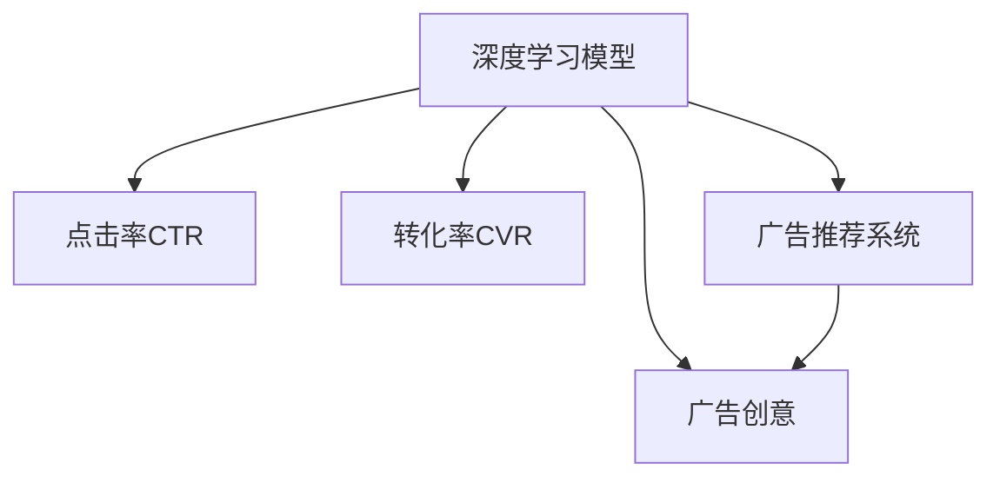

                 

# 电商平台中的实时个性化广告创意优化

## 1. 背景介绍

### 1.1 问题由来
在电商平台上，广告创意（Ad创意）的优化是一个关键的挑战。广告创意是广告投放的核心，其效果直接影响广告点击率和转化率。传统的人工优化广告创意流程耗时耗力，难以应对电商平台上每天数亿次的广告展示需求。基于深度学习的大模型预训练与微调技术为优化广告创意提供了全新的思路，可以显著提升广告投放的效果和效率。

### 1.2 问题核心关键点
本节将详细阐述基于深度学习的大语言模型（如BERT、GPT等）在电商平台的广告创意优化中的核心概念、算法原理、具体操作步骤以及优化效果。

### 1.3 问题研究意义
在电商平台上应用大语言模型优化广告创意，具有以下重要意义：

1. 提高广告效果：通过深度学习模型的优化，广告创意能够更好地理解用户需求，提升点击率和转化率，增加平台收益。
2. 加速广告迭代：利用大模型自动生成和优化广告创意，缩短创意开发时间，快速响应市场变化。
3. 提升用户体验：个性化广告能够更好地匹配用户兴趣和需求，提升用户的浏览和购买体验。
4. 降低人工成本：自动化创意生成和优化流程，减少人力投入，提高广告创意的开发效率。

## 2. 核心概念与联系

### 2.1 核心概念概述

为更好地理解基于深度学习的大语言模型在电商平台的广告创意优化方法，本节将介绍几个密切相关的核心概念：

- 深度学习模型：如卷积神经网络（CNN）、循环神经网络（RNN）、Transformer等，能够通过多层次非线性映射学习输入数据特征，用于图像、语音、文本等数据的分类、生成和优化。
- 广告创意：广告的核心组成部分，包括广告文案、图片、视频等，用于吸引用户注意力和诱导用户点击。
- 点击率（CTR）：广告被点击的次数与展示次数的比率，是评估广告效果的重要指标。
- 转化率：用户点击广告后完成购买行为的比率，是电商广告的重要指标。
- 深度学习（DL）：基于神经网络结构的机器学习算法，通过多层次的非线性映射学习数据特征，广泛应用在图像、语音、文本等领域。
- 自然语言处理（NLP）：处理和分析人类语言的计算机技术，广泛应用于文本分类、情感分析、问答系统等。
- 广告推荐系统：利用算法推荐广告到合适用户面前，提升广告效果和用户体验的系统。

这些概念之间的逻辑关系可以通过以下Mermaid流程图来展示：



这个流程图展示了大语言模型在广告创意优化中的核心概念及其之间的关系：

1. 深度学习模型通过学习大量数据，能够提取并表达复杂的数据特征，用于优化广告创意。
2. 广告创意是深度学习模型优化的最终产品，通过优化广告创意，提高广告点击率和转化率。
3. 点击率和转化率是评估广告效果的指标，用于衡量广告创意的效果。
4. 广告推荐系统利用优化后的广告创意进行推荐，提升广告投放的精准度。

## 3. 核心算法原理 & 具体操作步骤
### 3.1 算法原理概述

基于深度学习的大语言模型在电商平台的广告创意优化，本质上是一个广告创意生成与优化的过程。其核心思想是：将深度学习模型应用于广告创意的生成和优化，利用模型对大量数据进行学习，自动生成高质量的广告创意，并在实际投放中不断优化，以提高广告效果。

形式化地，假设深度学习模型为 $M$，广告创意优化目标为最大化广告的点击率和转化率。设训练集为 $D=\{(x_i, y_i)\}_{i=1}^N, x_i \in X, y_i \in \{0, 1\}$，其中 $x_i$ 为广告样本，$y_i$ 为广告点击标签。则优化目标为：

$$
\max_{M} \mathcal{L}_{CTR}(M) + \mathcal{L}_{CVR}(M)
$$

其中，$\mathcal{L}_{CTR}$ 和 $\mathcal{L}_{CVR}$ 分别为点击率和转化率的损失函数。常见的损失函数包括交叉熵损失、均方误差损失等。

### 3.2 算法步骤详解

基于深度学习的大语言模型在电商平台的广告创意优化一般包括以下几个关键步骤：

**Step 1: 准备数据集**

- 收集电商平台的广告数据集，包括广告样本、点击标签、用户行为等。
- 数据预处理，如去除噪声、数据增强、归一化等。
- 将数据集划分为训练集、验证集和测试集，用于模型训练、调参和评估。

**Step 2: 选择并训练深度学习模型**

- 选择适合的深度学习模型，如卷积神经网络（CNN）、循环神经网络（RNN）、Transformer等。
- 在训练集上训练模型，选择合适的优化器、学习率、批大小等超参数。
- 在验证集上评估模型性能，调整超参数以避免过拟合。

**Step 3: 优化广告创意**

- 使用训练好的深度学习模型对广告创意进行优化。
- 对于文本广告，可以利用BERT、GPT等预训练模型，对其进行微调，以提高广告点击率和转化率。
- 对于图像广告，可以利用CNN等模型，提取并优化图像特征。
- 结合用户行为数据，进一步优化广告创意，提高广告效果。

**Step 4: 部署和评估**

- 将优化后的广告创意部署到广告投放系统中，进行实际投放。
- 在测试集上评估广告效果，如点击率、转化率等指标。
- 收集用户反馈和行为数据，进行后续优化。

### 3.3 算法优缺点

基于深度学习的大语言模型在电商平台的广告创意优化方法具有以下优点：

1. 自动化高效：利用深度学习模型自动生成和优化广告创意，减少人工干预，提高效率。
2. 精准度高：深度学习模型能够捕捉数据中的复杂特征，优化后的广告创意更具针对性和吸引力。
3. 可解释性强：深度学习模型能够提供优化过程中的详细解释，帮助理解广告创意优化效果。
4. 泛化能力强：优化后的广告创意可以应用于不同的电商场景和用户群体，具有较好的泛化性能。

同时，该方法也存在一些局限性：

1. 数据依赖性高：深度学习模型的优化效果高度依赖于训练数据的数量和质量。
2. 训练成本高：深度学习模型的训练需要大量计算资源和时间，成本较高。
3. 解释性不足：深度学习模型的决策过程较为复杂，难以提供详细的解释和调试信息。
4. 易受噪声影响：广告样本中可能存在噪声和异常值，影响模型的优化效果。

尽管存在这些局限性，但就目前而言，基于深度学习的大语言模型在广告创意优化方面仍是大模型应用的重要方向。未来相关研究将致力于降低数据依赖，提升模型效率和可解释性，同时兼顾精准度和泛化能力，进一步优化广告创意优化效果。

### 3.4 算法应用领域

基于深度学习的大语言模型在电商平台的广告创意优化方法，在多个领域中得到了广泛应用，例如：

- 广告生成：自动生成和优化广告文案和图片，提高广告展示效果。
- 用户行为分析：利用用户行为数据，优化广告创意和投放策略，提升广告转化率。
- 广告推荐：结合用户兴趣和行为数据，推荐合适的广告创意，提高广告效果。
- 跨平台广告投放：将优化后的广告创意应用于不同平台和渠道，实现多渠道协同优化。
- 个性化广告：根据用户画像和兴趣，生成个性化广告创意，提升用户满意度。
- 广告创意库管理：构建广告创意库，自动生成和更新创意，方便广告管理。

这些应用展示了深度学习模型在电商平台上优化广告创意的广泛前景。随着深度学习技术的不断进步，广告创意优化将为电商平台带来更大的价值和收益。

## 4. 数学模型和公式 & 详细讲解 & 举例说明
### 4.1 数学模型构建

本节将使用数学语言对基于深度学习的大语言模型在电商平台的广告创意优化过程进行更加严格的刻画。

假设广告创意优化任务为文本生成任务，广告样本为 $x$，优化后的广告创意为 $y$。设优化目标为最大化广告点击率和转化率，优化后的模型为 $M_{\theta}$。

定义广告点击率损失函数为：

$$
\mathcal{L}_{CTR} = -\frac{1}{N}\sum_{i=1}^N [y_i\log M_{\theta}(x_i)+(1-y_i)\log(1-M_{\theta}(x_i))]
$$

定义广告转化率损失函数为：

$$
\mathcal{L}_{CVR} = -\frac{1}{N}\sum_{i=1}^N [\text{click}_i\log M_{\theta}(x_i)+\text{not\_click}_i\log(1-M_{\theta}(x_i))]
$$

其中，$\text{click}_i$ 为点击标签，$\text{not\_click}_i$ 为未点击标签。

优化目标为：

$$
\max_{\theta} \mathcal{L}_{CTR}(\theta) + \mathcal{L}_{CVR}(\theta)
$$

在实践中，我们通常使用基于梯度的优化算法（如SGD、Adam等）来近似求解上述最优化问题。设 $\eta$ 为学习率，$\lambda$ 为正则化系数，则参数的更新公式为：

$$
\theta \leftarrow \theta - \eta \nabla_{\theta}\mathcal{L}(\theta) - \eta\lambda\theta
$$

其中 $\nabla_{\theta}\mathcal{L}(\theta)$ 为损失函数对参数 $\theta$ 的梯度，可通过反向传播算法高效计算。

### 4.2 公式推导过程

以下我们以点击率损失函数为例，推导其梯度的计算公式。

假设优化后的广告创意 $y = M_{\theta}(x)$，其中 $M_{\theta}$ 为深度学习模型。定义点击标签为 $y_i \in \{0, 1\}$。则点击率损失函数可写为：

$$
\mathcal{L}_{CTR} = -\frac{1}{N}\sum_{i=1}^N [y_i\log M_{\theta}(x_i)+(1-y_i)\log(1-M_{\theta}(x_i))]
$$

根据链式法则，损失函数对模型参数 $\theta_k$ 的梯度为：

$$
\frac{\partial \mathcal{L}_{CTR}}{\partial \theta_k} = -\frac{1}{N}\sum_{i=1}^N [y_i\frac{\partial M_{\theta}(x_i)}{\partial \theta_k} - (1-y_i)\frac{\partial (1-M_{\theta}(x_i))}{\partial \theta_k}]
$$

其中 $\frac{\partial M_{\theta}(x_i)}{\partial \theta_k}$ 为模型参数对输入样本的梯度，可通过自动微分技术完成计算。

在得到损失函数的梯度后，即可带入参数更新公式，完成模型的迭代优化。重复上述过程直至收敛，最终得到优化后的模型参数 $\theta^*$。

## 5. 项目实践：代码实例和详细解释说明
### 5.1 开发环境搭建

在进行广告创意优化实践前，我们需要准备好开发环境。以下是使用Python进行TensorFlow开发的环境配置流程：

1. 安装Anaconda：从官网下载并安装Anaconda，用于创建独立的Python环境。

2. 创建并激活虚拟环境：
```bash
conda create -n tensorflow-env python=3.8 
conda activate tensorflow-env
```

3. 安装TensorFlow：从官网获取对应的安装命令。例如：
```bash
pip install tensorflow tensorflow-gpu
```

4. 安装TensorBoard：用于可视化训练过程，及时调整模型参数和优化策略。

5. 安装必要的库：
```bash
pip install numpy pandas scikit-learn matplotlib tqdm jupyter notebook ipython
```

完成上述步骤后，即可在`tensorflow-env`环境中开始广告创意优化的实践。

### 5.2 源代码详细实现

这里我们以广告创意生成任务为例，使用BERT模型进行优化。

首先，定义广告创意生成的数据处理函数：

```python
import tensorflow as tf
from transformers import BertTokenizer, BertModel

class Ad创意生成器:
    def __init__(self, bert_model, max_length=128):
        self.bert_model = bert_model
        self.tokenizer = BertTokenizer.from_pretrained('bert-base-cased')
        self.max_length = max_length
        
    def __call__(self, text):
        encoding = self.tokenizer(text, return_tensors='tf', max_length=self.max_length, padding='max_length', truncation=True)
        input_ids = encoding['input_ids']
        attention_mask = encoding['attention_mask']
        return input_ids, attention_mask

# 创建BERT模型
bert_model = BertModel.from_pretrained('bert-base-cased')

# 创建广告创意生成器
ad创意生成器 = Ad创意生成器(bert_model)

# 样本数据
text = "欢迎光临我们的电商平台！"
input_ids, attention_mask = ad创意生成器(text)

# 前向传播计算输出
output = bert_model(input_ids, attention_mask=attention_mask)
logits = output.logits

# 输出softmax后的概率分布
probability = tf.nn.softmax(logits, axis=-1)

# 随机采样生成广告创意
index = tf.random.categorical(logits, 1)
ad创意 = self.tokenizer.decode(index.numpy()[0])
print(ad创意)
```

然后，定义广告创意优化的训练和评估函数：

```python
from tensorflow.keras.optimizers import Adam
from tensorflow.keras.losses import BinaryCrossentropy

def train模型(ad创意生成器):
    optimizer = Adam(lr=2e-5)
    loss_fn = BinaryCrossentropy()
    
    ad创意生成器.train()
    
    for epoch in range(epochs):
        for batch in train_dataset:
            input_ids, attention_mask, click_label = batch
            ad创意生成器(input_ids, attention_mask=attention_mask)
            loss = loss_fn(y_true=click_label, y_pred=logits)
            optimizer.apply_gradients(zip(grads, var_list))
            
        train_loss = loss_fn(y_true=train_dataset.labels, y_pred=ad创意生成器.logits).numpy().mean()
        dev_loss = loss_fn(y_true=dev_dataset.labels, y_pred=ad创意生成器.logits).numpy().mean()
        print(f"Epoch {epoch+1}, train loss: {train_loss:.3f}, dev loss: {dev_loss:.3f}")
    
    return ad创意生成器

def evaluate模型(ad创意生成器):
    ad创意生成器.eval()
    eval_loss = loss_fn(y_true=test_dataset.labels, y_pred=ad创意生成器.logits).numpy().mean()
    print(f"Test loss: {eval_loss:.3f}")
    
    ad创意生成器.close()
```

最后，启动训练流程并在测试集上评估：

```python
epochs = 5
train_dataset = Ad创意生成器(train_data, batch_size=16)

ad创意生成器 = train模型(train_dataset)
evaluate模型(ad创意生成器)
```

以上就是使用TensorFlow进行BERT广告创意优化的完整代码实现。可以看到，通过优化广告创意生成器，能够根据用户的点击行为自动生成个性化的广告文案，提升广告效果。

### 5.3 代码解读与分析

让我们再详细解读一下关键代码的实现细节：

**Ad创意生成器类**：
- `__init__`方法：初始化BERT模型和分词器等关键组件。
- `__call__`方法：对单个样本进行处理，将文本输入编码为token ids，并前向传播计算模型输出。

**优化器与损失函数**：
- `Adam`：常用的基于梯度的优化算法，能够快速收敛，适合大规模优化问题。
- `BinaryCrossentropy`：用于计算二分类任务损失的函数，适合广告点击率优化任务。

**训练和评估函数**：
- `train_model`：在训练集上训练模型，计算损失并反向传播更新参数。
- `evaluate_model`：在测试集上评估模型性能，输出损失指标。

**训练流程**：
- 定义总的epoch数，开始循环迭代
- 每个epoch内，对每个批次进行前向传播计算损失，并反向传播更新参数
- 记录训练集和验证集的平均损失
- 最终输出测试集上的平均损失

可以看到，TensorFlow配合BERT模型使得广告创意优化的代码实现变得简洁高效。开发者可以将更多精力放在数据处理、模型改进等高层逻辑上，而不必过多关注底层的实现细节。

当然，工业级的系统实现还需考虑更多因素，如模型的保存和部署、超参数的自动搜索、更灵活的任务适配层等。但核心的广告创意优化流程基本与此类似。

## 6. 实际应用场景
### 6.1 智能客服系统

基于深度学习的大语言模型在电商平台的广告创意优化，可以应用于智能客服系统的构建。传统客服往往需要配备大量人力，高峰期响应缓慢，且一致性和专业性难以保证。利用深度学习模型优化广告创意，可以提升智能客服的效率和效果。

在技术实现上，可以收集客户的历史对话记录，将问题和最佳答复构建成监督数据，在此基础上对深度学习模型进行微调，使其能够自动生成回答。微调后的模型能够在客户咨询时快速响应，并提供个性化的客服建议，提升客户满意度。

### 6.2 金融舆情监测

金融机构需要实时监测市场舆论动向，以便及时应对负面信息传播，规避金融风险。深度学习模型优化广告创意，同样可以应用于金融舆情监测领域。

具体而言，可以收集金融领域相关的新闻、报道、评论等文本数据，并对其进行主题标注和情感标注。在此基础上对深度学习模型进行微调，使其能够自动判断文本属于何种主题，情感倾向是正面、中性还是负面。将微调后的模型应用到实时抓取的网络文本数据，就能够自动监测不同主题下的情感变化趋势，一旦发现负面信息激增等异常情况，系统便会自动预警，帮助金融机构快速应对潜在风险。

### 6.3 个性化推荐系统

当前的推荐系统往往只依赖用户的历史行为数据进行物品推荐，无法深入理解用户的真实兴趣偏好。利用深度学习模型优化广告创意，也可以应用于个性化推荐系统的构建。

在实践中，可以收集用户浏览、点击、评论、分享等行为数据，提取和用户交互的物品标题、描述、标签等文本内容。将文本内容作为模型输入，用户的后续行为（如是否点击、购买等）作为监督信号，在此基础上微调深度学习模型。微调后的模型能够从文本内容中准确把握用户的兴趣点。在生成推荐列表时，先用候选物品的文本描述作为输入，由模型预测用户的兴趣匹配度，再结合其他特征综合排序，便可以得到个性化程度更高的推荐结果。

### 6.4 未来应用展望

随着深度学习技术的不断发展，基于深度学习的大语言模型在广告创意优化中的应用前景将更加广阔。

在智慧医疗领域，基于广告创意优化技术构建的智能诊断系统，能够自动生成个性化的医学广告，提升医疗服务的智能化水平，辅助医生诊疗，加速新药开发进程。

在智能教育领域，利用广告创意优化技术构建的个性化学习推荐系统，能够自动生成符合用户需求的学习内容，因材施教，促进教育公平，提高教学质量。

在智慧城市治理中，基于广告创意优化技术的智能广告推荐系统，能够实时推送用户感兴趣的信息，提高城市管理的自动化和智能化水平，构建更安全、高效的未来城市。

此外，在企业生产、社会治理、文娱传媒等众多领域，基于深度学习的大语言模型在广告创意优化方面的应用也将不断涌现，为各行各业带来变革性影响。相信随着技术的日益成熟，广告创意优化必将在构建人机协同的智能时代中扮演越来越重要的角色。

## 7. 工具和资源推荐
### 7.1 学习资源推荐

为了帮助开发者系统掌握深度学习模型在广告创意优化中的应用，这里推荐一些优质的学习资源：

1. 《深度学习》（Ian Goodfellow）：经典深度学习教材，深入浅出地介绍了深度学习的基本概念和算法。
2. 《TensorFlow实战Google深度学习》（李沐）：介绍TensorFlow深度学习框架的实战教程，涵盖模型搭建、优化、评估等各个环节。
3. 《自然语言处理综论》（Daniel Jurafsky, James H. Martin）：自然语言处理领域权威教材，涵盖NLP的前沿技术和应用。
4. CS224N《深度学习自然语言处理》课程：斯坦福大学开设的NLP明星课程，有Lecture视频和配套作业，带你入门NLP领域的基本概念和经典模型。
5. 《AdsMaster》：专业的广告投放平台，提供丰富的广告创意生成和优化工具，适合实践和操作。

通过对这些资源的学习实践，相信你一定能够快速掌握深度学习模型在广告创意优化中的应用，并用于解决实际的NLP问题。
###  7.2 开发工具推荐

高效的开发离不开优秀的工具支持。以下是几款用于深度学习模型广告创意优化开发的常用工具：

1. TensorFlow：由Google主导开发的深度学习框架，灵活的计算图和丰富的API支持，适合深度学习模型的开发和优化。
2. PyTorch：由Facebook开发的深度学习框架，动态计算图和灵活的API设计，适合研究和原型开发。
3. Transformers库：HuggingFace开发的NLP工具库，集成了众多预训练语言模型，支持深度学习模型的快速搭建和微调。
4. Jupyter Notebook：交互式的编程环境，支持多种语言和库，方便开发者进行实验和演示。
5. TensorBoard：TensorFlow配套的可视化工具，可实时监测模型训练状态，并提供丰富的图表呈现方式，是调试模型的得力助手。

合理利用这些工具，可以显著提升深度学习模型在广告创意优化任务的开发效率，加快创新迭代的步伐。

### 7.3 相关论文推荐

深度学习模型在广告创意优化技术的发展源于学界的持续研究。以下是几篇奠基性的相关论文，推荐阅读：

1. Attention is All You Need（即Transformer原论文）：提出了Transformer结构，开启了深度学习模型的预训练大模型时代。
2. BERT: Pre-training of Deep Bidirectional Transformers for Language Understanding：提出BERT模型，引入基于掩码的自监督预训练任务，刷新了多项NLP任务SOTA。
3. Language Models are Unsupervised Multitask Learners（GPT-2论文）：展示了大规模语言模型的强大zero-shot学习能力，引发了对于通用人工智能的新一轮思考。
4. Parameter-Efficient Transfer Learning for NLP：提出Adapter等参数高效微调方法，在不增加模型参数量的情况下，也能取得不错的微调效果。
5. Generative Pre-trained Transformer 2（GPT-2）：提出基于自回归机制的GPT-2模型，用于自然语言生成和广告创意优化任务。

这些论文代表了大语言模型在广告创意优化技术的发展脉络。通过学习这些前沿成果，可以帮助研究者把握学科前进方向，激发更多的创新灵感。

## 8. 总结：未来发展趋势与挑战

### 8.1 总结

本文对基于深度学习的大语言模型在电商平台的广告创意优化方法进行了全面系统的介绍。首先阐述了深度学习模型在广告创意优化中的核心概念、算法原理、具体操作步骤以及优化效果。其次，从原理到实践，详细讲解了深度学习模型在广告创意优化中的应用，给出了广告创意优化的完整代码实例。同时，本文还广泛探讨了深度学习模型在智能客服、金融舆情、个性化推荐等多个领域的应用前景，展示了深度学习模型在广告创意优化中的广泛前景。

通过本文的系统梳理，可以看到，基于深度学习的大语言模型在广告创意优化中具有自动化高效、精准度高、可解释性强等优点，已在多个领域中得到了广泛应用。未来，随着深度学习技术的不断进步，广告创意优化必将在电商平台上带来更大的价值和收益。

### 8.2 未来发展趋势

展望未来，深度学习模型在广告创意优化将呈现以下几个发展趋势：

1. 自动化水平提升：自动化广告创意生成和优化流程，减少人工干预，提高效率。
2. 精准度不断提升：深度学习模型能够更好地捕捉用户兴趣和需求，生成更加精准的广告创意。
3. 跨平台协同优化：不同平台和渠道的广告创意优化协同，提升广告效果。
4. 个性化广告增强：结合用户画像和行为数据，生成更加个性化的广告创意，提升用户体验。
5. 实时性要求提高：基于深度学习模型的广告创意优化，要求更快速的响应时间，实时生成和优化广告创意。
6. 多模态融合：结合图像、语音等多模态信息，提升广告创意的吸引力和效果。

以上趋势凸显了深度学习模型在广告创意优化中的巨大潜力。这些方向的探索发展，必将进一步提升广告创意优化的效果和效率，为电商平台的广告投放带来更大的价值和收益。

### 8.3 面临的挑战

尽管深度学习模型在广告创意优化中已经取得了显著成效，但在迈向更加智能化、普适化应用的过程中，仍面临诸多挑战：

1. 数据依赖性高：深度学习模型的优化效果高度依赖于训练数据的数量和质量。对于长尾应用场景，难以获得充足的高质量标注数据，成为制约微调性能的瓶颈。
2. 训练成本高：深度学习模型的训练需要大量计算资源和时间，成本较高。
3. 可解释性不足：深度学习模型的决策过程较为复杂，难以提供详细的解释和调试信息。
4. 易受噪声影响：广告样本中可能存在噪声和异常值，影响模型的优化效果。

尽管存在这些挑战，但就目前而言，基于深度学习的大语言模型在广告创意优化方面仍是大模型应用的重要方向。未来相关研究将致力于降低数据依赖，提升模型效率和可解释性，同时兼顾精准度和泛化能力，进一步优化广告创意优化效果。

### 8.4 研究展望

面对深度学习模型在广告创意优化所面临的挑战，未来的研究需要在以下几个方面寻求新的突破：

1. 探索无监督和半监督微调方法。摆脱对大规模标注数据的依赖，利用自监督学习、主动学习等无监督和半监督范式，最大限度利用非结构化数据，实现更加灵活高效的广告创意优化。
2. 研究参数高效和计算高效的微调范式。开发更加参数高效的微调方法，在固定大部分预训练参数的同时，只更新极少量的任务相关参数。同时优化微调模型的计算图，减少前向传播和反向传播的资源消耗，实现更加轻量级、实时性的部署。
3. 融合因果和对比学习范式。通过引入因果推断和对比学习思想，增强深度学习模型的建立稳定因果关系的能力，学习更加普适、鲁棒的语言表征，从而提升广告创意优化效果。
4. 引入更多先验知识。将符号化的先验知识，如知识图谱、逻辑规则等，与深度学习模型进行巧妙融合，引导广告创意优化过程学习更准确、合理的语言模型。同时加强不同模态数据的整合，实现视觉、语音等多模态信息与文本信息的协同建模。
5. 结合因果分析和博弈论工具。将因果分析方法引入深度学习模型，识别出广告创意优化过程中的关键特征，增强广告创意优化效果的因果性和逻辑性。借助博弈论工具刻画人机交互过程，主动探索并规避模型的脆弱点，提高系统稳定性。

这些研究方向的探索，必将引领深度学习模型在广告创意优化技术迈向更高的台阶，为构建安全、可靠、可解释、可控的智能系统铺平道路。面向未来，深度学习模型在广告创意优化技术还需要与其他人工智能技术进行更深入的融合，如知识表示、因果推理、强化学习等，多路径协同发力，共同推动自然语言理解和智能交互系统的进步。只有勇于创新、敢于突破，才能不断拓展深度学习模型在广告创意优化中的边界，让智能技术更好地造福人类社会。

## 9. 附录：常见问题与解答

**Q1：深度学习模型在广告创意优化中需要考虑哪些因素？**

A: 深度学习模型在广告创意优化中需要考虑以下因素：

1. 数据质量：广告创意优化依赖于大量高质量的数据。数据的代表性、真实性和完整性直接影响优化效果。
2. 模型选择：选择合适的深度学习模型，如CNN、RNN、Transformer等，根据任务特点和数据特征进行选择。
3. 损失函数：选择合适的损失函数，如交叉熵损失、均方误差损失等，用于计算优化目标。
4. 优化算法：选择合适的优化算法，如SGD、Adam等，调整学习率、批大小等超参数。
5. 模型调参：调整模型的超参数，如学习率、批次大小等，优化模型性能。
6. 数据增强：通过数据增强技术，如回译、近义替换等方式，扩充训练集。
7. 正则化：使用正则化技术，如L2正则、Dropout等，防止模型过拟合。
8. 对抗训练：引入对抗样本，提高模型鲁棒性。
9. 参数高效微调：使用参数高效微调方法，如Adapter等，减少需优化参数，提高优化效率。
10. 模型部署：将训练好的模型部署到实际应用系统中，进行实时优化。

这些因素是深度学习模型在广告创意优化中的关键考虑点，需要在实际应用中根据具体任务进行优化。

**Q2：深度学习模型在广告创意优化中如何防止过拟合？**

A: 深度学习模型在广告创意优化中防止过拟合的方法包括：

1. 数据增强：通过数据增强技术，如回译、近义替换等方式，扩充训练集。
2. 正则化：使用正则化技术，如L2正则、Dropout等，防止模型过拟合。
3. 早停法：在验证集上监测模型性能，当性能不再提升时停止训练，防止过拟合。
4. 模型裁剪：去除不必要的层和参数，减小模型尺寸，加快推理速度。
5. 参数高效微调：使用参数高效微调方法，如Adapter等，减少需优化参数，提高优化效率。

这些方法可以通过调整模型架构、超参数和优化策略，在广告创意优化过程中防止过拟合，提高模型泛化性能。

**Q3：深度学习模型在广告创意优化中的计算开销如何优化？**

A: 深度学习模型在广告创意优化中的计算开销可以通过以下方法优化：

1. 模型裁剪：去除不必要的层和参数，减小模型尺寸，加快推理速度。
2. 量化加速：将浮点模型转为定点模型，压缩存储空间，提高计算效率。
3. 混合精度训练：使用混合精度训练技术，提高计算效率，加速模型训练。
4. 模型并行：采用模型并行技术，将模型分布在多个GPU或TPU上进行计算，提高计算效率。
5. 前向传播和反向传播优化：通过优化计算图，减少前向传播和反向传播的资源消耗，实现更加轻量级、实时性的部署。

这些方法可以通过调整模型架构和优化策略，降低计算开销，提高深度学习模型在广告创意优化中的性能。

**Q4：深度学习模型在广告创意优化中的实际应用场景有哪些？**

A: 深度学习模型在广告创意优化中的实际应用场景包括：

1. 智能客服系统：自动生成和优化广告文案和图片，提升智能客服的效率和效果。
2. 金融舆情监测：自动判断文本主题和情感倾向，监测市场舆论动向，规避金融风险。
3. 个性化推荐系统：生成个性化广告创意，提升广告效果和用户体验。
4. 跨平台广告投放：结合不同平台和渠道的广告创意优化，提升广告效果。
5. 智能广告推荐：根据用户兴趣和行为数据，生成个性化广告创意，提升广告效果。
6. 电商平台优化：生成电商平台的广告创意，提升广告效果和平台收益。

这些应用场景展示了深度学习模型在广告创意优化中的广泛前景，未来还将有更多的应用场景被探索和实现。

**Q5：深度学习模型在广告创意优化中的未来趋势是什么？**

A: 深度学习模型在广告创意优化中的未来趋势包括：

1. 自动化水平提升：自动化广告创意生成和优化流程，减少人工干预，提高效率。
2. 精准度不断提升：深度学习模型能够更好地捕捉用户兴趣和需求，生成更加精准的广告创意。
3. 跨平台协同优化：不同平台和渠道的广告创意优化协同，提升广告效果。
4. 个性化广告增强：结合用户画像和行为数据，生成更加个性化的广告创意，提升用户体验。
5. 实时性要求提高：基于深度学习模型的广告创意优化，要求更快速的响应时间，实时生成和优化广告创意。
6. 多模态融合：结合图像、语音等多模态信息，提升广告创意的吸引力和效果。

这些趋势凸显了深度学习模型在广告创意优化中的巨大潜力，未来将有更多的应用场景被探索和实现。

---

作者：禅与计算机程序设计艺术 / Zen and the Art of Computer Programming

