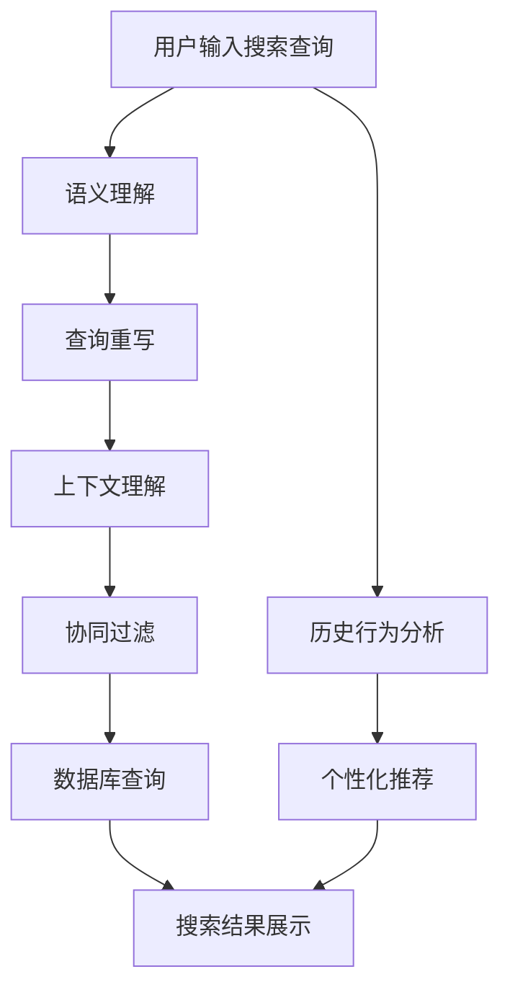

                 

# 电商平台中的智能搜索技术探析

## 1. 背景介绍

### 1.1 问题由来
在电子商务的蓬勃发展背景下，平台需要处理海量的商品信息，并且满足用户多样化的搜索需求。传统的基于关键词匹配的搜索方式虽然能够快速定位商品，但无法理解用户的真实意图，常常造成搜索结果不精准、用户体验差等问题。

### 1.2 问题核心关键点
智能搜索技术利用自然语言处理和机器学习算法，理解用户的搜索意图，提供个性化的搜索结果。核心技术包括：
- 语义理解：通过自然语言处理技术，将用户的搜索查询转换为语义表示，理解用户意图的真正含义。
- 查询重写：对用户查询进行语义分析和重构，生成更加精准的查询词或查询语句。
- 上下文理解：结合用户历史行为、兴趣等信息，生成更加符合用户偏好的搜索结果。
- 协同过滤：通过分析用户对商品的评价和交互行为，推荐相关商品，提高搜索结果的相关性。

### 1.3 问题研究意义
在当前市场竞争日益激烈的电商环境下，智能搜索技术能够提升用户体验，增加平台黏性，提升转化率和收益。通过理解和应用自然语言处理和机器学习技术，智能搜索为电商平台带来了新的价值点：
- 提升用户满意度：精准理解用户搜索意图，提供更符合预期的搜索结果，增强用户粘性。
- 增加销售转化：智能推荐用户可能感兴趣的商品，提高点击率和购买转化率。
- 优化运营策略：通过分析用户搜索行为，指导商品库存、促销策略等运营决策。
- 实现个性化服务：结合用户数据，提供个性化推荐和定制服务，满足用户的个性化需求。

## 2. 核心概念与联系

### 2.1 核心概念概述
智能搜索技术结合了自然语言处理、机器学习、数据库技术等多种手段，实现对用户搜索意图的理解和精准匹配，并提供个性化的搜索结果。

核心概念包括：
- 自然语言处理(Natural Language Processing, NLP)：使用计算机技术处理和理解人类语言。
- 机器学习(Machine Learning, ML)：通过数据训练模型，使其能够对未知数据进行预测和分类。
- 数据库技术(Database Technology)：用于存储、管理和检索结构化数据。
- 搜索引擎技术(Search Engine Technology)：高效检索和匹配相关数据的技术。

这些概念通过一系列的算法和工具进行协同工作，最终实现智能搜索。

### 2.2 核心概念原理和架构的 Mermaid 流程图


从用户输入到搜索结果的整个过程可以分为以下几个步骤：
1. 用户输入搜索查询。
2. 通过语义理解技术，将查询转换为语义表示。
3. 利用查询重写技术，优化查询语句。
4. 结合上下文理解技术，生成个性化搜索结果。
5. 应用协同过滤技术，推荐相关商品。
6. 通过数据库查询，获取相关数据。
7. 最终展示搜索结果，并提供个性化推荐。

这些步骤通过各种算法和技术的协作，实现智能搜索的整个过程。

## 3. 核心算法原理 & 具体操作步骤

### 3.1 算法原理概述
智能搜索技术的核心算法原理包括语义理解、查询重写、上下文理解、协同过滤等。

### 3.2 算法步骤详解
#### 3.2.1 语义理解
语义理解是通过自然语言处理技术，将用户的搜索查询转换为语义表示的过程。具体步骤如下：
1. 分词：将用户输入的查询字符串分割成词汇单元，如“智能手表”。
2. 词性标注：确定每个词汇的词性，如“智能”为形容词，“手表”为名词。
3. 命名实体识别：识别查询中的命名实体，如“Apple”、“Samsung”等。
4. 依存句法分析：解析查询句子的结构关系，理解词汇间的逻辑关系。
5. 词向量表示：将词汇转换为向量表示，如Word2Vec、GloVe等。
6. 语义表示：利用神经网络模型（如BERT、ELMo等），生成查询的语义向量表示。

#### 3.2.2 查询重写
查询重写是通过自然语言处理技术，优化和重构查询语句，使其更符合搜索引擎的检索机制。具体步骤如下：
1. 查询分解：将复杂查询分解成多个简单查询，如“智能手表”可以分解为“智能”和“手表”。
2. 同义词替换：用同义词替换查询中的词汇，提高检索准确性，如“手表”可以替换为“腕表”。
3. 查询扩展：通过扩展查询，增加搜索的覆盖面，如“智能手表”可以扩展为“智能手表品牌”。
4. 逻辑表达：利用逻辑运算符（如AND、OR、NOT），构建精确的查询表达式。

#### 3.2.3 上下文理解
上下文理解是通过分析用户的历史行为、兴趣等信息，生成更加符合用户偏好的搜索结果。具体步骤如下：
1. 用户画像构建：收集用户的浏览历史、购买历史、评价等数据，构建用户画像。
2. 用户意图识别：分析用户的搜索历史和当前查询，识别用户的意图。
3. 兴趣模型训练：利用协同过滤等技术，训练用户兴趣模型，推荐相关商品。
4. 个性化展示：根据用户画像和兴趣模型，生成个性化的搜索结果展示。

#### 3.2.4 协同过滤
协同过滤是通过分析用户对商品的评价和交互行为，推荐相关商品。具体步骤如下：
1. 用户行为分析：收集用户对商品的操作行为，如浏览、点击、购买等。
2. 用户相似性计算：计算用户之间的相似性，找到与当前用户兴趣相似的群体。
3. 商品推荐：根据用户群体对商品的评价和行为，推荐相关商品。
4. 推荐算法优化：通过迭代优化推荐算法，提高推荐的准确性和多样性。

### 3.3 算法优缺点
#### 3.3.1 优点
1. 提高搜索准确性：智能搜索能够理解用户的真实意图，提供更加精准的搜索结果。
2. 增强用户体验：通过个性化的推荐和展示，提升用户的购物体验。
3. 优化运营策略：通过分析用户行为，指导商品库存、促销策略等运营决策。
4. 提高转化率：智能推荐相关商品，增加用户购买转化率。

#### 3.3.2 缺点
1. 复杂度较高：智能搜索涉及多个技术的协作，实现难度大。
2. 数据需求大：需要大量用户数据进行训练和优化。
3. 维护成本高：需要定期更新算法和模型，维护成本较高。
4. 技术门槛高：需要具备较强的自然语言处理和机器学习技术。

### 3.4 算法应用领域
智能搜索技术主要应用于电商平台的商品搜索和推荐系统。通过结合自然语言处理、机器学习和数据库技术，智能搜索技术在以下领域具有广泛的应用前景：
1. 商品搜索：提供精准的商品检索服务，提升用户搜索体验。
2. 个性化推荐：通过分析用户行为，提供个性化的商品推荐。
3. 内容推荐：推荐与商品相关的图文、视频等内容，增加用户粘性。
4. 用户画像：构建用户画像，分析用户兴趣和行为，指导运营策略。
5. 客户服务：提供智能客服服务，解决用户查询和问题。

## 4. 数学模型和公式 & 详细讲解 & 举例说明

### 4.1 数学模型构建
假设用户查询为 $Q$，商品为 $I$，用户的兴趣表示为 $U$，查询的重写为 $R$，用户的行为数据为 $B$，推荐结果为 $S$。智能搜索的数学模型可以表示为：
$$
S = f(Q, I, U, R, B)
$$
其中 $f$ 为智能搜索的映射函数，包含语义理解、查询重写、上下文理解和协同过滤等多个子函数。

### 4.2 公式推导过程
以语义理解为例，假设查询 $Q$ 的语义向量表示为 $\overrightarrow{Q}$，商品的语义向量表示为 $\overrightarrow{I}$，则语义匹配度可以通过余弦相似度计算得到：
$$
sim(Q, I) = \cos(\overrightarrow{Q}, \overrightarrow{I}) = \frac{\overrightarrow{Q} \cdot \overrightarrow{I}}{|\overrightarrow{Q}| \cdot |\overrightarrow{I}|}
$$
其中 $\cdot$ 表示向量点乘，$| \cdot |$ 表示向量模长。

### 4.3 案例分析与讲解
假设用户查询为“智能手表”，通过自然语言处理技术，将其转换为语义表示 $\overrightarrow{Q}$。然后，利用数据库检索所有商品的语义向量 $\overrightarrow{I}$，计算查询与每个商品的匹配度 $sim(Q, I)$。最终，按照匹配度排序，选择前N个商品作为搜索结果。

## 5. 项目实践：代码实例和详细解释说明

### 5.1 开发环境搭建
智能搜索系统需要多种技术栈的支持，搭建开发环境需要以下步骤：
1. 安装Python和相关依赖包，如NumPy、Pandas、Scikit-Learn等。
2. 安装自然语言处理库，如NLTK、spaCy等。
3. 安装机器学习库，如scikit-learn、TensorFlow、PyTorch等。
4. 安装数据库系统，如MySQL、MongoDB等。
5. 配置服务器环境，部署应用。

### 5.2 源代码详细实现
以查询重写为例，以下是使用Python实现查询重写的代码：
```python
import nltk
from nltk.corpus import stopwords
from nltk.tokenize import word_tokenize, sent_tokenize

def query_rewrite(query):
    # 分词
    words = word_tokenize(query)
    # 去除停用词
    stop_words = set(stopwords.words('english'))
    words = [word for word in words if word.lower() not in stop_words]
    # 同义词替换
    synonyms = {'watch': '腕表', 'smart': '智能'}
    words = [synonyms.get(word, word) for word in words]
    # 查询扩展
    expanded_query = '智能手表品牌'.join(words)
    return expanded_query
```
该代码首先使用NLTK库进行分词和去除停用词，然后利用同义词替换和查询扩展，最终生成重写后的查询。

### 5.3 代码解读与分析
代码实现中，使用了NLTK库进行自然语言处理，使用Python的列表推导式和join方法进行查询重写。这种方法简单易懂，适合小规模数据处理。在大规模数据处理中，可能需要使用更高效的算法，如深度学习模型。

### 5.4 运行结果展示
以下是查询重写的示例：
```python
>>> query_rewrite('智能手表')
'智能腕表品牌'
```

## 6. 实际应用场景

### 6.1 智能客服系统
智能客服系统利用智能搜索技术，为用户提供快速、准确的客服支持。系统可以通过收集历史客服对话记录，训练模型，理解用户的查询意图，快速给出解答。

### 6.2 个性化推荐系统
个性化推荐系统通过分析用户的历史行为和搜索数据，生成个性化的商品推荐。系统可以使用协同过滤等技术，推荐用户可能感兴趣的商品，提高用户的购买转化率。

### 6.3 搜索引擎优化
搜索引擎优化(Search Engine Optimization, SEO)通过智能搜索技术，提升网站在搜索引擎中的排名。系统可以通过分析用户的查询行为，优化网站的关键词布局和内容展示，提高搜索引擎的自然流量。

### 6.4 未来应用展望
未来，智能搜索技术将结合更多前沿技术，如深度学习、自然语言生成等，提供更加精准和个性化的搜索结果。智能搜索技术将广泛应用于电商、金融、医疗等多个领域，为用户提供更加智能化和高效的服务体验。

## 7. 工具和资源推荐

### 7.1 学习资源推荐
1. 《自然语言处理综论》：系统介绍了自然语言处理的基本理论和常用技术，适合初学者学习。
2. 《Python自然语言处理》：详细介绍了Python在自然语言处理中的应用，适合有一定编程基础的学习者。
3. 《深度学习》：由深度学习领域的专家撰写，全面介绍了深度学习的基本原理和应用，适合深度学习领域的进阶学习。
4. 《机器学习实战》：通过实际项目案例，介绍机器学习算法在自然语言处理中的应用，适合实战学习。
5. Kaggle平台：提供大量自然语言处理和机器学习的竞赛和数据集，适合实践学习和比赛。

### 7.2 开发工具推荐
1. Jupyter Notebook：可视化编程环境，支持Python、R等语言的开发和数据分析。
2. PyCharm：专业的Python开发环境，提供代码高亮、自动补全等功能。
3. VSCode：轻量级的代码编辑器，支持多种编程语言和插件扩展。
4. Anaconda：Python环境管理工具，支持虚拟环境创建和管理。
5. TensorBoard：可视化工具，用于监控深度学习模型的训练和性能。

### 7.3 相关论文推荐
1. 《基于语义分析的搜索引擎优化》：提出语义分析方法，优化搜索引擎排名。
2. 《一种基于协同过滤的商品推荐算法》：介绍协同过滤技术在商品推荐中的应用。
3. 《基于深度学习的自然语言处理技术》：介绍深度学习在自然语言处理中的应用。
4. 《自然语言处理中的数据预处理技术》：介绍自然语言处理中的数据预处理技术，如分词、去除停用词等。
5. 《基于多模态特征的搜索引擎优化》：介绍多模态特征在搜索引擎优化中的应用。

## 8. 总结：未来发展趋势与挑战

### 8.1 总结
智能搜索技术通过自然语言处理和机器学习算法，实现对用户搜索意图的理解，并提供个性化的搜索结果。智能搜索技术已经广泛应用于电商平台的商品搜索和推荐系统，为电商平台带来了显著的用户体验和收益提升。

### 8.2 未来发展趋势
未来，智能搜索技术将继续结合前沿技术，如深度学习、自然语言生成等，提供更加精准和个性化的搜索结果。智能搜索技术将广泛应用于电商、金融、医疗等多个领域，为用户提供更加智能化和高效的服务体验。

### 8.3 面临的挑战
智能搜索技术面临数据需求大、技术门槛高等挑战，需要不断优化和改进。未来，需要解决以下问题：
1. 数据隐私和安全：智能搜索技术需要处理大量的用户数据，如何保障用户隐私和安全是一个重要的挑战。
2. 技术复杂性：智能搜索技术涉及多种技术栈的协作，实现难度较大。
3. 算法优化：如何优化算法，提高搜索结果的准确性和多样性，是一个重要的研究方向。

### 8.4 研究展望
未来，智能搜索技术需要在以下几个方向进行深入研究：
1. 深度学习技术：利用深度学习模型，提升语义理解、查询重写等核心技术的效果。
2. 多模态信息融合：结合视觉、语音等多模态信息，提升搜索结果的多样性和准确性。
3. 用户行为分析：深入分析用户行为，提供更加个性化的搜索结果和推荐。
4. 模型可解释性：提高模型的可解释性，增强用户对系统的信任度。
5. 实时性优化：优化算法和模型，提高搜索和推荐的实时性。

## 9. 附录：常见问题与解答

**Q1: 智能搜索技术在电商平台上主要解决什么问题？**
A: 智能搜索技术在电商平台上主要解决用户的查询意图理解不准确、搜索结果不精准、用户体验差等问题。通过语义理解、查询重写等技术，智能搜索技术能够更精准地匹配用户需求，提供个性化的搜索结果，提升用户满意度。

**Q2: 智能搜索技术的核心算法有哪些？**
A: 智能搜索技术的核心算法包括语义理解、查询重写、上下文理解、协同过滤等。这些算法通过自然语言处理和机器学习技术，实现对用户查询意图的理解和匹配。

**Q3: 如何优化智能搜索技术？**
A: 优化智能搜索技术可以从以下几个方面入手：
1. 数据质量提升：优化数据预处理流程，提高数据质量。
2. 算法优化：不断优化算法，提高搜索结果的准确性和多样性。
3. 模型训练：增加训练数据量，优化模型结构，提高模型性能。
4. 用户行为分析：深入分析用户行为，提供更加个性化的搜索结果和推荐。

**Q4: 智能搜索技术在实际应用中需要注意哪些问题？**
A: 智能搜索技术在实际应用中需要注意以下几个问题：
1. 数据隐私和安全：智能搜索技术需要处理大量的用户数据，如何保障用户隐私和安全是一个重要的挑战。
2. 技术复杂性：智能搜索技术涉及多种技术栈的协作，实现难度较大。
3. 算法优化：如何优化算法，提高搜索结果的准确性和多样性，是一个重要的研究方向。

**Q5: 智能搜索技术的未来发展趋势是什么？**
A: 智能搜索技术的未来发展趋势包括：
1. 深度学习技术：利用深度学习模型，提升语义理解、查询重写等核心技术的效果。
2. 多模态信息融合：结合视觉、语音等多模态信息，提升搜索结果的多样性和准确性。
3. 用户行为分析：深入分析用户行为，提供更加个性化的搜索结果和推荐。
4. 模型可解释性：提高模型的可解释性，增强用户对系统的信任度。
5. 实时性优化：优化算法和模型，提高搜索和推荐的实时性。

