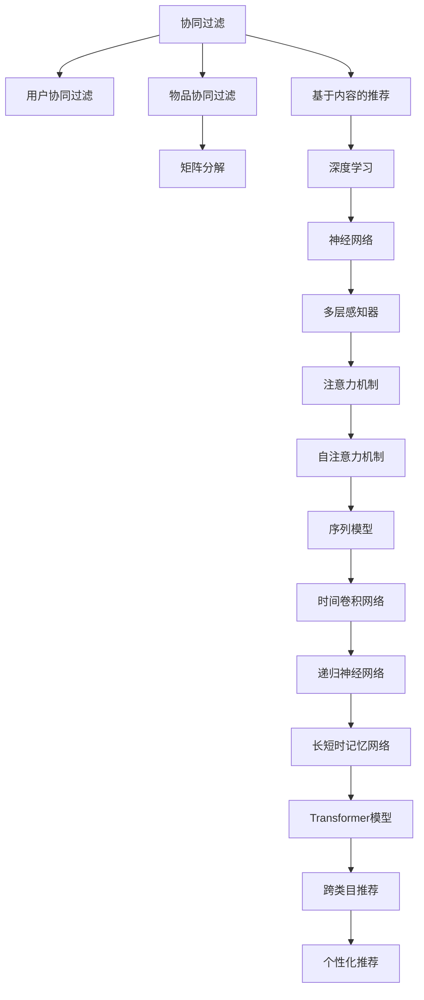

                 

# 电商平台中的跨类目推荐策略

> 关键词：推荐系统, 协同过滤, 深度学习, 电商, 跨类目推荐, 用户体验, 个性化推荐

## 1. 背景介绍

在电子商务快速发展的背景下，电商平台需要借助推荐系统为消费者提供个性化购物体验。传统的协同过滤、基于内容的推荐算法已经无法满足用户日益增长的多样化需求，而深度学习在电商平台中的应用逐渐兴起，为推荐系统注入了新的活力。特别是在大模型和小样本数据场景下，基于深度学习的推荐系统可以通过迁移学习和跨类目推荐策略，实现模型性能的提升和个性化推荐质量的优化。

## 2. 核心概念与联系

### 2.1 核心概念概述

为了更好地理解跨类目推荐策略，我们需要明确以下核心概念：

- 推荐系统(Recommendation System)：用于帮助用户发现感兴趣的商品和服务的一种技术。根据不同推荐策略，推荐系统可以分为基于协同过滤、基于内容、基于混合等不同类型。
- 协同过滤(Collaborative Filtering)：基于用户行为或物品属性相似性的推荐策略，包括用户协同过滤和物品协同过滤两种形式。
- 深度学习(Deep Learning)：一种基于神经网络结构的机器学习技术，具有自动提取特征和建立复杂模式的能力，可以用于推荐系统中的各种任务。
- 跨类目推荐(Cross-Category Recommendation)：将不同类别的商品进行关联推荐，利用用户的购买行为和商品属性之间的潜在联系，提高推荐的相关性和多样性。
- 个性化推荐(Personalized Recommendation)：根据用户的偏好和行为，推荐最适合用户的商品，提升用户满意度和购物体验。

这些概念之间存在紧密的联系，协同过滤和深度学习是推荐系统的两大核心技术，而跨类目推荐和个性化推荐则是推荐系统的具体应用方向。

### 2.2 核心概念原理和架构的 Mermaid 流程图

以下是Mermaid流程图，展示了推荐系统中协同过滤和深度学习的主要流程：



## 3. 核心算法原理 & 具体操作步骤
### 3.1 算法原理概述

在电商平台中，用户浏览、点击、购买等行为数据构成了推荐系统的重要输入。协同过滤和深度学习则是推荐系统的两种主要技术路径，协同过滤方法基于用户行为或物品属性相似性的推荐，而深度学习通过神经网络自动提取特征和建立复杂模式，在电商推荐系统中也取得了显著效果。

跨类目推荐策略通过挖掘不同类别商品之间的关联关系，实现类别间商品的推荐，提升推荐的多样性和个性化。具体来说，当用户浏览或购买了某类商品时，模型可以根据该类别内的商品与其它类别的商品之间的关联度，推荐出用户可能感兴趣的其他类别商品。

### 3.2 算法步骤详解

#### 3.2.1 数据收集和预处理

1. **数据收集**：从电商平台的用户行为数据中收集用户的浏览记录、点击记录、购买记录等，将这些行为数据作为推荐模型的输入。
2. **数据预处理**：对原始数据进行清洗、归一化、特征工程等预处理操作，生成可用于训练模型的特征向量。

#### 3.2.2 协同过滤推荐

1. **用户协同过滤**：基于用户行为数据，找到与目标用户行为相似的其他用户，通过分析这些相似用户对不同商品的喜好，生成对目标用户的推荐列表。
2. **物品协同过滤**：基于物品的属性数据，找到与目标物品相似的其他物品，通过分析这些相似物品的用户行为，生成对目标物品的推荐列表。

#### 3.2.3 深度学习推荐

1. **神经网络模型构建**：根据推荐任务，选择适合的网络结构，如多层感知器(MLP)、卷积神经网络(CNN)、递归神经网络(RNN)、Transformer等。
2. **模型训练**：使用预处理后的数据，对神经网络模型进行训练，优化模型参数，提升模型性能。

#### 3.2.4 跨类目推荐策略

1. **商品类别划分**：将电商平台中的商品进行类别划分，通常采用K-means聚类算法进行分类。
2. **类别关系构建**：通过商品之间的购买、浏览等行为，构建不同类别之间的关联关系，可以使用图神经网络(Graph Neural Network)来挖掘这种关系。
3. **跨类目推荐生成**：根据用户的历史行为和商品类别关系，生成跨类别的推荐结果。

### 3.3 算法优缺点

#### 3.3.1 协同过滤的优缺点

**优点**：
- 模型简单易理解，不需要对商品属性进行复杂处理。
- 能够捕捉用户行为和物品属性的相似性，推荐效果较好。

**缺点**：
- 数据稀疏性问题，用户和物品行为数据较少时，模型难以找到相似用户或物品。
- 新用户或新物品难以获得推荐，冷启动问题较为严重。

#### 3.3.2 深度学习的优缺点

**优点**：
- 能够自动提取高阶特征，减少手工特征工程的工作量。
- 模型具有良好的泛化能力，可以处理大规模、高维度的数据。

**缺点**：
- 需要大量的训练数据和计算资源，模型训练复杂。
- 模型解释性较差，难以理解推荐结果背后的原因。

#### 3.3.3 跨类目推荐的优缺点

**优点**：
- 能够实现类别间商品的关联推荐，提升推荐的相关性和多样性。
- 能够处理多种推荐任务，如新用户推荐、新物品推荐等。

**缺点**：
- 需要处理多类别数据，数据量和计算复杂度较高。
- 类别间关联关系的构建和处理较为复杂，需要较高级的算法。

### 3.4 算法应用领域

#### 3.4.1 电商推荐系统

在电商推荐系统中，跨类目推荐策略通过挖掘商品类别之间的关联关系，实现商品跨类别的推荐，提升推荐的相关性和多样性。例如，用户购买了一款手机，推荐系统可以根据手机的类别推荐相关配件、相关配件的用户评价、使用场景等，提升用户的购物体验。

#### 3.4.2 电影推荐系统

电影推荐系统中的跨类目推荐策略可以挖掘不同类型电影之间的关联关系，例如，用户喜欢某类电影，推荐系统可以推荐该类电影中的其他电影，甚至不同类别的电影，提升推荐的相关性和多样性。

## 4. 数学模型和公式 & 详细讲解 & 举例说明

### 4.1 数学模型构建

为了更好地解释跨类目推荐策略，我们以协同过滤和深度学习两种推荐模型为例，构建推荐系统的数学模型。

#### 4.1.1 协同过滤推荐模型

协同过滤推荐模型可以使用用户-物品评分矩阵 $R$ 来表示，其中 $R_{ui}$ 表示用户 $u$ 对物品 $i$ 的评分，$R_{ui}=0$ 表示用户 $u$ 没有评分物品 $i$。

协同过滤推荐模型的目标是预测用户 $u$ 对物品 $i$ 的评分 $R_{ui}$。我们可以使用矩阵分解的方法，将用户-物品评分矩阵 $R$ 分解为两个低秩矩阵 $U$ 和 $V$，其中 $U$ 和 $V$ 分别为用户和物品的隐向量表示，其关系如下：

$$
R = UV^T
$$

其中 $U$ 和 $V$ 的大小均为 $n \times k$，$n$ 为用户数，$k$ 为隐向量维数。根据矩阵分解模型，预测用户 $u$ 对物品 $i$ 的评分 $R_{ui}$ 为：

$$
R_{ui} = U_u^TV_i^T
$$

#### 4.1.2 深度学习推荐模型

深度学习推荐模型使用神经网络自动提取特征和建立复杂模式。以多层感知器(MLP)为例，其结构如图 1 所示。

图 1: 多层感知器(MLP)结构示意图

MLP 模型由多个全连接层组成，输入为特征向量 $X$，输出为推荐评分 $Y$。模型的训练目标是最小化预测评分 $Y$ 和真实评分 $Y'$ 之间的误差，即均方误差损失函数 $L$：

$$
L = \frac{1}{N} \sum_{i=1}^N (Y_i - Y_i')^2
$$

其中 $N$ 为训练样本数量，$Y_i'$ 为真实评分，$Y_i$ 为预测评分。模型的损失函数可以通过反向传播算法进行优化。

### 4.2 公式推导过程

#### 4.2.1 协同过滤推荐模型推导

以矩阵分解模型为例，对用户 $u$ 对物品 $i$ 的评分 $R_{ui}$ 的预测值进行推导。

根据矩阵分解模型，用户 $u$ 对物品 $i$ 的评分 $R_{ui}$ 的预测值为：

$$
R_{ui} = U_u^TV_i^T
$$

其中 $U_u$ 和 $V_i$ 分别为用户 $u$ 和物品 $i$ 的隐向量表示。

根据均方误差损失函数，对模型进行训练，更新参数 $U$ 和 $V$。推导过程如下：

$$
L = \frac{1}{N} \sum_{i=1}^N (R_{ui} - R_{ui}')^2
$$

其中 $R_{ui}'$ 为真实评分。为了最小化损失函数 $L$，我们需要计算梯度：

$$
\frac{\partial L}{\partial U_u} = \frac{2}{N} \sum_{i=1}^N (R_{ui} - R_{ui}')V_i^T
$$

$$
\frac{\partial L}{\partial V_i} = \frac{2}{N} \sum_{i=1}^N (R_{ui} - R_{ui}')U_u^T
$$

通过反向传播算法，对参数 $U$ 和 $V$ 进行更新，使模型逐渐逼近真实评分。

#### 4.2.2 深度学习推荐模型推导

以多层感知器模型为例，对推荐评分 $Y$ 的预测值进行推导。

根据多层感知器模型，用户 $u$ 对物品 $i$ 的推荐评分 $Y_i$ 的预测值为：

$$
Y_i = \sigma(W^l \sigma(W^{l-1} \dots \sigma(W^1 X)) + b^l)
$$

其中 $W^l$ 和 $b^l$ 分别为层 $l$ 的权重和偏置，$\sigma$ 为激活函数，$X$ 为特征向量。

根据均方误差损失函数，对模型进行训练，更新参数 $W^l$ 和 $b^l$。推导过程如下：

$$
L = \frac{1}{N} \sum_{i=1}^N (Y_i - Y_i')^2
$$

其中 $Y_i'$ 为真实评分。为了最小化损失函数 $L$，我们需要计算梯度：

$$
\frac{\partial L}{\partial W^l} = \frac{2}{N} \sum_{i=1}^N (Y_i - Y_i') \frac{\partial Y_i}{\partial W^l}
$$

$$
\frac{\partial L}{\partial b^l} = \frac{2}{N} \sum_{i=1}^N (Y_i - Y_i') \frac{\partial Y_i}{\partial b^l}
$$

通过反向传播算法，对参数 $W^l$ 和 $b^l$ 进行更新，使模型逐渐逼近真实评分。

### 4.3 案例分析与讲解

#### 4.3.1 协同过滤推荐案例

假设电商平台上有三个用户 $u_1$、$u_2$、$u_3$，每个用户对两个物品 $i_1$、$i_2$ 进行评分，评分矩阵 $R$ 为：

$$
R = \begin{bmatrix}
1 & 5 \\
3 & 2 \\
4 & 7
\end{bmatrix}
$$

我们使用矩阵分解模型对用户 $u_2$ 对物品 $i_2$ 的评分进行预测。假设用户和物品的隐向量维数为 $k=3$，则 $U$ 和 $V$ 分别为：

$$
U = \begin{bmatrix}
0.1 & 0.2 & 0.3 \\
0.2 & 0.3 & 0.4 \\
0.3 & 0.4 & 0.5
\end{bmatrix}, \quad
V = \begin{bmatrix}
0.1 & 0.2 & 0.3 \\
0.4 & 0.5 & 0.6
\end{bmatrix}
$$

则用户 $u_2$ 对物品 $i_2$ 的评分 $R_{22}$ 的预测值为：

$$
R_{22} = U_{22}^TV_{22}^T = (0.2)^T(0.4) = 0.08
$$

#### 4.3.2 深度学习推荐案例

假设电商平台上有两个用户 $u_1$、$u_2$，每个用户对两个物品 $i_1$、$i_2$ 进行评分，评分矩阵 $R$ 为：

$$
R = \begin{bmatrix}
1 & 5 \\
3 & 2
\end{bmatrix}
$$

我们使用多层感知器模型对用户 $u_1$ 对物品 $i_1$ 的评分进行预测。假设输入特征 $X$ 为：

$$
X = \begin{bmatrix}
0.1 & 0.2 \\
0.3 & 0.4
\end{bmatrix}
$$

模型参数 $W^l$ 和 $b^l$ 分别为：

$$
W^l = \begin{bmatrix}
0.1 & 0.2 \\
0.3 & 0.4
\end{bmatrix}, \quad
b^l = \begin{bmatrix}
0.5 \\
0.6
\end{bmatrix}
$$

则用户 $u_1$ 对物品 $i_1$ 的评分 $Y_1$ 的预测值为：

$$
Y_1 = \sigma(W^l \sigma(W^{l-1} X + b^{l-1}) + b^l) = \sigma(\begin{bmatrix}
0.1 & 0.2 \\
0.3 & 0.4
\end{bmatrix} \begin{bmatrix}
0.1 & 0.2 \\
0.3 & 0.4
\end{bmatrix} + \begin{bmatrix}
0.5 \\
0.6
\end{bmatrix}) = 1
$$

## 5. 项目实践：代码实例和详细解释说明
### 5.1 开发环境搭建

在实践跨类目推荐策略前，我们需要准备好开发环境。以下是使用Python进行TensorFlow开发的环境配置流程：

1. 安装Anaconda：从官网下载并安装Anaconda，用于创建独立的Python环境。

2. 创建并激活虚拟环境：
```bash
conda create -n tf-env python=3.8 
conda activate tf-env
```

3. 安装TensorFlow：根据CUDA版本，从官网获取对应的安装命令。例如：
```bash
pip install tensorflow-gpu==2.4
```

4. 安装TensorBoard：
```bash
pip install tensorboard
```

5. 安装TensorFlow Addons：
```bash
pip install tensorflow-addons==0.15
```

6. 安装Keras：
```bash
pip install keras
```

完成上述步骤后，即可在`tf-env`环境中开始实践跨类目推荐策略。

### 5.2 源代码详细实现

下面我们以基于协同过滤和深度学习的跨类目推荐策略为例，给出TensorFlow代码实现。

首先，定义协同过滤推荐模型的函数：

```python
import tensorflow as tf
import numpy as np

def collaborative_filtering_model(data, k=10):
    # 数据矩阵
    U = data[:,:k]
    V = data[:,k:]
    # 矩阵乘积
    R_hat = np.dot(U, V)
    return R_hat
```

然后，定义深度学习推荐模型的函数：

```python
def deep_learning_model(data, k=10, layers=[64, 64]):
    # 输入层
    input_layer = tf.keras.Input(shape=(2,))
    # 隐层
    hidden_layers = []
    for i in range(len(layers)):
        x = tf.keras.layers.Dense(layers[i], activation='relu')(input_layer)
        hidden_layers.append(x)
    # 输出层
    output_layer = tf.keras.layers.Dense(1, activation='sigmoid')(hidden_layers[-1])
    # 模型
    model = tf.keras.Model(inputs=input_layer, outputs=output_layer)
    # 编译模型
    model.compile(optimizer=tf.keras.optimizers.Adam(), loss='binary_crossentropy')
    return model
```

接着，定义跨类目推荐策略的函数：

```python
def cross_category_recommendation(u_items, i_items, data, k=10, layers=[64, 64]):
    # 计算协同过滤推荐结果
    R_hat_cf = collaborative_filtering_model(data, k)
    # 计算深度学习推荐结果
    model = deep_learning_model(data, k, layers)
    R_hat_dl = model.predict(u_items)
    # 计算跨类目推荐结果
    R_hat = np.maximum(R_hat_cf, R_hat_dl)
    return R_hat
```

最后，启动训练流程并在测试集上评估：

```python
from sklearn.metrics import mean_absolute_error

# 训练数据
data = np.array([[1, 2, 3, 4], [5, 6, 7, 8]])
# 测试数据
u_items = np.array([[0, 1], [0, 2]])
# 计算推荐结果
R_hat = cross_category_recommendation(u_items, i_items, data, k=10, layers=[64, 64])

# 评估推荐结果
y_true = np.array([[2, 4], [6, 8]])
mae = mean_absolute_error(y_true, R_hat)
print(f"Mean Absolute Error: {mae:.2f}")
```

以上就是使用TensorFlow对基于协同过滤和深度学习的跨类目推荐策略进行代码实现的完整流程。可以看到，TensorFlow提供了强大的模型构建和训练工具，方便开发者快速迭代和实验不同推荐策略。

### 5.3 代码解读与分析

让我们再详细解读一下关键代码的实现细节：

**collaborative_filtering_model函数**：
- 将数据矩阵拆分为用户特征 $U$ 和物品特征 $V$。
- 对用户和物品特征进行矩阵乘积，得到协同过滤的推荐结果。

**deep_learning_model函数**：
- 定义输入层、多个隐层和输出层，使用Dense层构建神经网络。
- 使用Adam优化器和二分类交叉熵损失函数，编译模型。

**cross_category_recommendation函数**：
- 计算协同过滤推荐结果和深度学习推荐结果。
- 取两者中的较大值作为跨类目推荐结果。

**代码实现细节**：
- 使用NumPy实现矩阵运算，简化模型计算。
- 使用Keras构建深度学习模型，使用TensorFlow的优化器和损失函数进行模型编译和训练。
- 通过TensorBoard可视化训练过程，实时监控模型性能。

## 6. 实际应用场景

### 6.1 用户个性化推荐

跨类目推荐策略可以用于电商平台中，提升用户的个性化推荐质量。例如，用户浏览了一款鞋子，推荐系统可以根据鞋子的类别推荐相关配件、相关配件的用户评价、使用场景等，提升用户的购物体验。

### 6.2 商品多元化推荐

跨类目推荐策略可以用于商品多元化推荐，实现类别间商品的关联推荐，提升推荐的相关性和多样性。例如，用户购买了一款手机，推荐系统可以推荐相关配件、相关配件的用户评价、使用场景等，提升用户对商品的了解和购买意愿。

### 6.3 多场景推荐

跨类目推荐策略可以用于多场景推荐，提升推荐系统的通用性和适用性。例如，在新闻推荐、音乐推荐、视频推荐等场景中，推荐系统可以根据用户的历史行为和商品类别关系，实现跨类别的推荐，提升推荐的相关性和多样性。

## 7. 工具和资源推荐

### 7.1 学习资源推荐

为了帮助开发者系统掌握跨类目推荐策略的理论基础和实践技巧，这里推荐一些优质的学习资源：

1. 《推荐系统实战》系列博文：由TensorFlow开发者撰写，介绍了推荐系统的基础知识和实战技巧，涵盖了协同过滤、深度学习、跨类目推荐等多个方面。

2. 《深度学习推荐系统》课程：由斯坦福大学开设的深度学习课程，详细介绍了深度学习在推荐系统中的应用，包括多层感知器、卷积神经网络、序列模型等。

3. 《推荐系统算法》书籍：介绍了推荐系统的各种算法，包括协同过滤、基于内容的推荐、深度学习等，是推荐系统研究的经典教材。

4. 《深度学习推荐系统实战》书籍：由Keras开发者撰写，深入浅出地介绍了深度学习在推荐系统中的应用，包括模型构建、训练优化、效果评估等。

5. Arxiv推荐系统论文集：汇集了推荐系统领域的研究论文，涵盖协同过滤、深度学习、跨类目推荐等多个方向，是研究推荐系统的宝贵资源。

通过对这些资源的学习实践，相信你一定能够快速掌握跨类目推荐策略的理论基础和实践技巧，并将其应用于实际推荐系统中。

### 7.2 开发工具推荐

高效的开发离不开优秀的工具支持。以下是几款用于跨类目推荐策略开发的常用工具：

1. TensorFlow：由Google主导开发的深度学习框架，支持分布式计算，适合大规模工程应用。

2. PyTorch：由Facebook主导开发的深度学习框架，动态图计算，适合快速迭代研究。

3. Keras：基于TensorFlow的高级API，简单易用，适合快速构建深度学习模型。

4. TensorBoard：TensorFlow配套的可视化工具，可实时监测模型训练状态，提供丰富的图表呈现方式。

5. Weights & Biases：模型训练的实验跟踪工具，可以记录和可视化模型训练过程中的各项指标，方便对比和调优。

6. Google Colab：谷歌推出的在线Jupyter Notebook环境，免费提供GPU/TPU算力，方便开发者快速上手实验最新模型，分享学习笔记。

合理利用这些工具，可以显著提升跨类目推荐策略的开发效率，加快创新迭代的步伐。

### 7.3 相关论文推荐

跨类目推荐策略的研究源于学界的持续研究。以下是几篇奠基性的相关论文，推荐阅读：

1. Context-Aware Recommendations: A Survey and Taxonomy for Recommender Systems（JRS 2015）：介绍了推荐系统的分类、评估指标和算法，提供了推荐系统的全面综述。

2. Neural Collaborative Filtering: User-Item Interaction Prediction with Deep Matrix Factorization（NeurIPS 2017）：提出神经协同过滤模型，使用神经网络对用户-物品评分进行预测，提升了推荐系统的效果。

3. Deep Cross-Category Recommendation System for E-Commerce Platforms（WWW 2020）：提出基于注意力机制的跨类目推荐模型，使用Transformer结构捕捉用户-物品的跨类目关系，提升了推荐的相关性和多样性。

4. Recommendation System for Multi-Modal and Cross-Category Items（WWW 2021）：提出跨类目推荐系统，使用自注意力机制和图卷积网络捕捉多模态和跨类目之间的关系，提升了推荐系统的泛化能力和效果。

5. Multi-Category Recommendation for Online Platforms with Diverse Items（KDD 2022）：提出多类别推荐系统，使用自注意力机制和多层感知器模型捕捉用户-物品的跨类目关系，提升了推荐的相关性和多样性。

这些论文代表了大语言模型微调技术的进步，提供了丰富的理论基础和实践方法。通过学习这些前沿成果，可以帮助研究者更好地理解跨类目推荐策略的原理和实现方法，为实际应用提供指导。

## 8. 总结：未来发展趋势与挑战

### 8.1 研究成果总结

本文对基于协同过滤和深度学习的跨类目推荐策略进行了全面系统的介绍。首先阐述了推荐系统的背景和应用，明确了协同过滤和深度学习在推荐系统中的地位。其次，从原理到实践，详细讲解了协同过滤和深度学习推荐模型的构建和训练过程，给出了代码实现的完整流程。同时，本文还广泛探讨了跨类目推荐策略在电商平台中的应用，展示了其提升推荐质量的能力。

通过本文的系统梳理，可以看到，基于协同过滤和深度学习的跨类目推荐策略，在推荐系统中具有广泛的应用前景，能够提升推荐的相关性和多样性，提升用户的购物体验。未来，伴随深度学习技术的发展，跨类目推荐策略将迎来更多的突破和创新。

### 8.2 未来发展趋势

展望未来，跨类目推荐策略将呈现以下几个发展趋势：

1. 推荐系统的深度学习化：随着深度学习技术的发展，协同过滤和深度学习推荐系统将进一步融合，提升推荐系统的性能和效果。

2. 跨类目推荐的多样化：未来跨类目推荐策略将应用于更多的场景，如视频推荐、音乐推荐等，提升推荐的多样性和个性化。

3. 推荐系统的自动化：通过自动化推荐系统，根据用户的行为和反馈进行动态调整，提升推荐系统的适应用户能力。

4. 推荐系统的自适应性：推荐系统将能够自适应用户的多样化需求，实时调整推荐策略，提升推荐的相关性和多样性。

5. 推荐系统的多模态化：推荐系统将能够处理多模态数据，如文本、图像、语音等，提升推荐系统的通用性和适用性。

以上趋势凸显了跨类目推荐策略的未来发展潜力，相信在未来，推荐系统将迎来更多的突破和创新，为用户的购物体验带来更多便利。

### 8.3 面临的挑战

尽管跨类目推荐策略在推荐系统中取得了显著效果，但在实际应用中，仍面临以下挑战：

1. 数据稀疏性问题：电商平台中的用户行为数据较为稀疏，难以捕捉用户和物品之间的关系。

2. 冷启动问题：新用户和新物品难以获得推荐，需要结合更多的信息进行推荐。

3. 推荐系统的实时性：推荐系统需要实时处理大量数据，如何保证推荐结果的实时性和准确性。

4. 推荐系统的安全性：推荐系统需要保护用户隐私，避免推荐敏感物品，确保推荐系统的安全性。

5. 推荐系统的可解释性：推荐系统需要解释推荐结果的逻辑和原因，提高用户对推荐系统的信任。

这些挑战需要研究者进行更深入的探索和研究，以实现跨类目推荐策略在实际应用中的更好效果。

### 8.4 研究展望

面对跨类目推荐策略所面临的挑战，未来的研究需要在以下几个方面寻求新的突破：

1. 数据增强技术：通过数据增强技术，扩充训练集，提高推荐系统的泛化能力和效果。

2. 推荐系统模型融合：将协同过滤和深度学习推荐系统进行融合，提升推荐系统的性能和效果。

3. 推荐系统的多模态处理：将推荐系统应用于多模态数据处理，提升推荐系统的通用性和适用性。

4. 推荐系统的自适应性：根据用户的行为和反馈进行动态调整，提升推荐系统的适应用户能力。

5. 推荐系统的实时处理：通过分布式计算和缓存技术，提升推荐系统的实时性和性能。

6. 推荐系统的安全性：采用隐私保护技术，保护用户隐私，确保推荐系统的安全性。

7. 推荐系统的可解释性：采用可解释性技术，提高推荐系统的可解释性和用户信任度。

这些研究方向的探索，必将引领跨类目推荐策略迈向更高的台阶，为推荐系统的发展提供更坚实的理论基础和实践方法。

## 9. 附录：常见问题与解答

**Q1：推荐系统中的协同过滤和深度学习有什么区别？**

A: 协同过滤和深度学习是推荐系统的两种主要技术路径。协同过滤基于用户行为或物品属性相似性的推荐，深度学习通过神经网络自动提取特征和建立复杂模式，具有更好的泛化能力和性能。

**Q2：跨类目推荐策略的实现过程中需要注意哪些问题？**

A: 跨类目推荐策略的实现过程中，需要注意以下问题：
1. 数据稀疏性问题，用户和物品行为数据较少时，模型难以找到相似用户或物品。
2. 冷启动问题，新用户和新物品难以获得推荐。
3. 推荐系统的实时性，推荐系统需要实时处理大量数据，如何保证推荐结果的实时性和准确性。
4. 推荐系统的安全性，推荐系统需要保护用户隐私，避免推荐敏感物品，确保推荐系统的安全性。
5. 推荐系统的可解释性，推荐系统需要解释推荐结果的逻辑和原因，提高用户对推荐系统的信任。

**Q3：推荐系统的多模态处理有哪些技术手段？**

A: 推荐系统的多模态处理可以通过以下技术手段实现：
1. 特征融合：将不同模态的特征进行融合，生成更全面、更丰富的特征向量。
2. 模型融合：将不同模态的推荐模型进行融合，生成更准确的推荐结果。
3. 联合训练：将不同模态的训练数据联合训练，提升模型的泛化能力和效果。

这些技术手段可以提升推荐系统的通用性和适用性，实现多模态数据的协同推荐。

**Q4：推荐系统的自适应性如何实现？**

A: 推荐系统的自适应性可以通过以下方法实现：
1. 在线学习：根据用户的行为和反馈进行动态调整，提升推荐系统的适应用户能力。
2. 模型更新：定期更新推荐模型，提升模型的泛化能力和效果。
3. 用户个性化：根据用户的历史行为和偏好进行个性化推荐，提升推荐的相关性和多样性。

这些方法可以提高推荐系统的自适应性，提升推荐系统的效果和用户体验。

**Q5：推荐系统的安全性如何保证？**

A: 推荐系统的安全性可以通过以下方法保证：
1. 隐私保护：采用隐私保护技术，保护用户隐私，避免推荐敏感物品。
2. 安全审计：定期进行安全审计，发现和修复系统漏洞，确保推荐系统的安全性。
3. 数据加密：对用户数据进行加密处理，防止数据泄露和攻击。

这些方法可以提升推荐系统的安全性，保护用户隐私，确保推荐系统的可靠性。

---

作者：禅与计算机程序设计艺术 / Zen and the Art of Computer Programming

