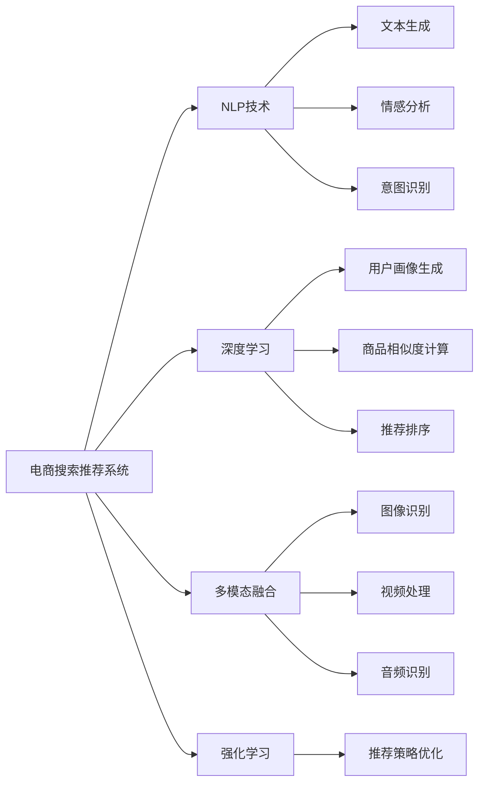

                 

# 电商平台搜索推荐系统的AI 大模型应用：提高系统性能、效率与用户体验

> 关键词：电商搜索,推荐系统,大模型,自然语言处理,多模态融合,深度学习,强化学习

## 1. 背景介绍

随着电商平台业务的快速增长，用户对搜索推荐系统的要求越来越高。用户不仅希望快速找到感兴趣的商品，还期望系统能够个性化推荐，提升购物体验。传统的搜索推荐系统大多基于规则或简单的统计模型，难以有效处理复杂的多维数据，且容易受到冷启动问题困扰。因此，利用AI大模型进行电商搜索推荐，成为了行业的新趋势。

本文将围绕电商平台搜索推荐系统的AI大模型应用，探讨其原理、方法、技术细节和应用场景。重点在于通过大模型的深度学习和多模态融合能力，提升系统的性能、效率和用户体验。

## 2. 核心概念与联系

### 2.1 核心概念概述

为更好地理解AI大模型在电商平台搜索推荐中的应用，我们需要先了解几个关键概念：

- **电商搜索推荐系统**：利用自然语言处理、图像识别、多模态融合等技术，为用户提供个性化搜索推荐服务的系统。
- **自然语言处理(NLP)**：通过计算机自动化处理人类语言，实现文本生成、情感分析、意图识别等任务，是电商搜索推荐系统的核心技术之一。
- **深度学习(Deep Learning)**：利用多层神经网络模型，从大量数据中学习并提取高级特征，应用于电商搜索推荐中的用户画像生成、商品相似度计算、推荐排序等环节。
- **多模态融合(Multimodal Fusion)**：将文本、图像、视频、音频等多源数据融合为统一的表示，提高搜索推荐系统的智能化水平。
- **强化学习(Reinforcement Learning)**：通过智能体与环境的交互，动态调整推荐策略，提升系统性能和用户体验。

这些核心概念之间存在紧密联系，共同构成了电商平台搜索推荐系统的技术框架。通过理解这些概念，我们可以更好地把握搜索推荐系统的工作原理和优化方向。

### 2.2 核心概念原理和架构的 Mermaid 流程图



这个流程图展示了电商搜索推荐系统各个核心技术之间的逻辑关系：

1. **NLP技术**：包括文本生成、情感分析、意图识别等，为搜索推荐系统提供用户查询意图和商品描述的语义理解能力。
2. **深度学习**：用于生成用户画像、计算商品相似度、推荐排序等任务，从数据中学习复杂的特征表示。
3. **多模态融合**：融合文本、图像、视频、音频等多源数据，提供更丰富的用户商品信息。
4. **强化学习**：通过智能体与环境的交互，动态调整推荐策略，提升用户体验和系统性能。

## 3. 核心算法原理 & 具体操作步骤

### 3.1 算法原理概述

电商平台搜索推荐系统的AI大模型应用，主要是通过深度学习、多模态融合和强化学习等技术手段，提升系统的智能化水平和用户体验。

- **深度学习**：利用多层神经网络模型，从大量数据中学习并提取高级特征，用于生成用户画像、计算商品相似度、推荐排序等任务。
- **多模态融合**：将文本、图像、视频、音频等多源数据融合为统一的表示，提高搜索推荐系统的智能化水平。
- **强化学习**：通过智能体与环境的交互，动态调整推荐策略，提升系统性能和用户体验。

### 3.2 算法步骤详解

#### 3.2.1 数据准备

电商搜索推荐系统所需的数据包括用户行为数据、商品描述数据、用户画像数据等。数据准备主要包括以下步骤：

1. **数据收集**：收集用户浏览、点击、购买、评价等行为数据，商品标题、描述、图片、类别等描述数据，以及用户的人口统计特征、历史行为等画像数据。
2. **数据预处理**：清洗、归一化、标准化、缺失值处理等，确保数据的可用性。
3. **特征工程**：提取、选择、组合、编码等，构建用于深度学习的特征向量。

#### 3.2.2 模型训练

模型训练主要包括以下步骤：

1. **模型选择**：选择合适的深度学习模型，如BERT、GPT、RNN等，根据任务需求进行调整。
2. **数据划分**：将数据划分为训练集、验证集和测试集，通常使用70%的数据用于训练，20%的数据用于验证，10%的数据用于测试。
3. **模型训练**：在训练集上训练模型，使用AdamW等优化算法，设置合适的学习率、批大小、迭代轮数等参数。
4. **模型评估**：在验证集上评估模型性能，调整超参数以避免过拟合。
5. **模型测试**：在测试集上测试模型性能，评估模型泛化能力。

#### 3.2.3 模型微调

模型微调主要包括以下步骤：

1. **任务适配**：根据具体任务需求，设计合适的任务适配层，如分类器、排序器等。
2. **微调参数**：选择需要微调的参数，如深度学习模型的顶层参数，或者使用参数高效微调技术，减少需优化的参数。
3. **微调训练**：在标注数据上，使用微调后的模型进行训练，优化模型的下游任务性能。
4. **微调评估**：在测试集上评估微调后的模型性能，对比微调前后的效果。

#### 3.2.4 系统部署

模型训练和微调完成后，将模型部署到电商搜索推荐系统中。部署主要包括以下步骤：

1. **模型保存**：将训练好的模型保存为文件或数据库，以便快速加载和部署。
2. **模型集成**：将模型集成到搜索推荐系统的后端服务中，接收用户请求并进行处理。
3. **系统优化**：对系统进行性能调优，确保系统的响应速度和稳定运行。
4. **监控告警**：实时监控系统指标，设置异常告警阈值，确保系统稳定运行。

### 3.3 算法优缺点

**优点**：

1. **智能化水平高**：通过深度学习和大模型，能够从海量数据中学习复杂的特征表示，提升系统的智能化水平。
2. **个性化推荐效果好**：利用多模态融合和强化学习，能够提供更加个性化、精准的推荐服务。
3. **系统性能提升**：深度学习和多模态融合技术，能够提高搜索推荐系统的性能，如召回率、点击率、转化率等指标。
4. **用户体验改善**：通过智能推荐和个性化搜索，提升用户的购物体验和满意度。

**缺点**：

1. **计算资源需求高**：深度学习和多模态融合技术需要大量的计算资源，包括GPU、TPU等高性能设备。
2. **数据质量要求高**：模型训练和微调需要高质量的数据，数据质量不高会影响模型性能。
3. **模型复杂度高**：深度学习模型通常包含大量参数，训练和推理复杂度高，需要优化算法和技术手段。
4. **可解释性不足**：深度学习模型通常视为"黑盒"，难以解释其内部工作机制和决策逻辑。

### 3.4 算法应用领域

基于深度学习、多模态融合和强化学习的AI大模型，在电商平台搜索推荐系统中的应用广泛，主要包括以下几个领域：

1. **用户画像生成**：利用用户行为数据、商品描述数据、画像数据等，生成详细的用户画像，用于个性化推荐。
2. **商品相似度计算**：通过深度学习模型计算商品之间的相似度，用于搜索排序和推荐。
3. **推荐排序**：结合用户画像和商品相似度，动态调整推荐排序，提高推荐效果。
4. **搜索排序**：利用深度学习和多模态融合技术，提升搜索结果的相关性和排序精度。
5. **个性化推荐**：结合用户画像和商品特征，提供个性化推荐，提升用户体验。
6. **商品评价预测**：通过深度学习模型，预测商品的评价评分，用于商品排序和推荐。
7. **智能客服**：利用NLP技术和深度学习模型，实现智能问答和问题解答，提升客服效率和质量。

## 4. 数学模型和公式 & 详细讲解 & 举例说明

### 4.1 数学模型构建

本节将使用数学语言对电商平台搜索推荐系统的AI大模型应用进行更加严格的刻画。

记电商搜索推荐系统所需的数据集为 $D=\{(x_i,y_i)\}_{i=1}^N$，其中 $x_i$ 为输入特征向量，$y_i$ 为输出标签，如商品ID、用户ID、行为标签等。假设选择BERT模型作为预训练语言模型，在输入 $x_i$ 上的输出为 $h_i=\text{BERT}(x_i)$。

定义电商推荐任务为二分类任务，输出标签 $y_i$ 为1表示用户点击了该商品，输出标签 $y_i$ 为0表示用户没有点击该商品。则二分类交叉熵损失函数定义为：

$$
\ell(y_i,\hat{y_i}) = -[y_i\log \hat{y_i} + (1-y_i)\log (1-\hat{y_i})]
$$

整个数据集上的经验风险为：

$$
\mathcal{L}(h) = \frac{1}{N}\sum_{i=1}^N \ell(y_i,\hat{y_i})
$$

其中 $\hat{y_i}$ 为模型 $h_i$ 在输入 $x_i$ 上的输出。

### 4.2 公式推导过程

以下我们以电商推荐任务为例，推导二分类交叉熵损失函数及其梯度的计算公式。

假设模型 $h_i$ 在输入 $x_i$ 上的输出为 $h_i=\text{BERT}(x_i)$，则二分类交叉熵损失函数定义为：

$$
\ell(y_i,\hat{y_i}) = -[y_i\log \hat{y_i} + (1-y_i)\log (1-\hat{y_i})]
$$

将其代入经验风险公式，得：

$$
\mathcal{L}(h) = \frac{1}{N}\sum_{i=1}^N \ell(y_i,\hat{y_i})
$$

根据链式法则，损失函数对模型参数 $\theta$ 的梯度为：

$$
\frac{\partial \mathcal{L}(h)}{\partial \theta} = -\frac{1}{N}\sum_{i=1}^N (\frac{y_i}{\hat{y_i}}-\frac{1-y_i}{1-\hat{y_i}});
\frac{\partial \hat{y_i}}{\partial \theta} = \frac{\partial \text{BERT}(x_i)}{\partial \theta}
$$

其中 $\frac{\partial \hat{y_i}}{\partial \theta}$ 可进一步递归展开，利用自动微分技术完成计算。

### 4.3 案例分析与讲解

以电商推荐任务为例，分析深度学习模型的训练过程。

假设数据集 $D=\{(x_i,y_i)\}_{i=1}^N$ 中，输入特征 $x_i$ 为商品描述，输出标签 $y_i$ 为1表示用户点击了该商品，输出标签 $y_i$ 为0表示用户没有点击该商品。

1. **数据准备**：
   - 收集用户浏览、点击、购买、评价等行为数据，商品标题、描述、图片、类别等描述数据，以及用户的人口统计特征、历史行为等画像数据。
   - 清洗、归一化、标准化、缺失值处理等，确保数据的可用性。
   - 提取、选择、组合、编码等，构建用于深度学习的特征向量。

2. **模型训练**：
   - 选择BERT模型作为预训练语言模型，在输入 $x_i$ 上的输出为 $h_i=\text{BERT}(x_i)$。
   - 定义二分类交叉熵损失函数 $\ell(y_i,\hat{y_i}) = -[y_i\log \hat{y_i} + (1-y_i)\log (1-\hat{y_i})]$。
   - 在训练集上训练模型，使用AdamW等优化算法，设置合适的学习率、批大小、迭代轮数等参数。
   - 在验证集上评估模型性能，调整超参数以避免过拟合。
   - 在测试集上测试模型性能，评估模型泛化能力。

3. **模型微调**：
   - 设计合适的任务适配层，如分类器、排序器等。
   - 选择需要微调的参数，如深度学习模型的顶层参数，或者使用参数高效微调技术，减少需优化的参数。
   - 在标注数据上，使用微调后的模型进行训练，优化模型的下游任务性能。
   - 在测试集上评估微调后的模型性能，对比微调前后的效果。

4. **系统部署**：
   - 将训练好的模型保存为文件或数据库，以便快速加载和部署。
   - 将模型集成到搜索推荐系统的后端服务中，接收用户请求并进行处理。
   - 对系统进行性能调优，确保系统的响应速度和稳定运行。
   - 实时监控系统指标，设置异常告警阈值，确保系统稳定运行。

## 5. 项目实践：代码实例和详细解释说明

### 5.1 开发环境搭建

在进行电商搜索推荐系统开发前，我们需要准备好开发环境。以下是使用Python进行PyTorch开发的环境配置流程：

1. 安装Anaconda：从官网下载并安装Anaconda，用于创建独立的Python环境。

2. 创建并激活虚拟环境：
```bash
conda create -n pytorch-env python=3.8 
conda activate pytorch-env
```

3. 安装PyTorch：根据CUDA版本，从官网获取对应的安装命令。例如：
```bash
conda install pytorch torchvision torchaudio cudatoolkit=11.1 -c pytorch -c conda-forge
```

4. 安装TensorFlow：
```bash
pip install tensorflow
```

5. 安装各类工具包：
```bash
pip install numpy pandas scikit-learn matplotlib tqdm jupyter notebook ipython
```

完成上述步骤后，即可在`pytorch-env`环境中开始电商搜索推荐系统的开发。

### 5.2 源代码详细实现

这里我们以电商推荐任务为例，给出使用Transformers库对BERT模型进行电商推荐微调的PyTorch代码实现。

首先，定义电商推荐任务的数据处理函数：

```python
from transformers import BertTokenizer
from torch.utils.data import Dataset
import torch

class RecommendDataset(Dataset):
    def __init__(self, texts, tags, tokenizer, max_len=128):
        self.texts = texts
        self.tags = tags
        self.tokenizer = tokenizer
        self.max_len = max_len
        
    def __len__(self):
        return len(self.texts)
    
    def __getitem__(self, item):
        text = self.texts[item]
        tags = self.tags[item]
        
        encoding = self.tokenizer(text, return_tensors='pt', max_length=self.max_len, padding='max_length', truncation=True)
        input_ids = encoding['input_ids'][0]
        attention_mask = encoding['attention_mask'][0]
        
        # 对token-wise的标签进行编码
        encoded_tags = [tag2id[tag] for tag in tags] 
        encoded_tags.extend([tag2id['O']] * (self.max_len - len(encoded_tags)))
        labels = torch.tensor(encoded_tags, dtype=torch.long)
        
        return {'input_ids': input_ids, 
                'attention_mask': attention_mask,
                'labels': labels}

# 标签与id的映射
tag2id = {'O': 0, 'B': 1, 'I': 2}
id2tag = {v: k for k, v in tag2id.items()}

# 创建dataset
tokenizer = BertTokenizer.from_pretrained('bert-base-cased')

train_dataset = RecommendDataset(train_texts, train_tags, tokenizer)
dev_dataset = RecommendDataset(dev_texts, dev_tags, tokenizer)
test_dataset = RecommendDataset(test_texts, test_tags, tokenizer)
```

然后，定义模型和优化器：

```python
from transformers import BertForTokenClassification, AdamW

model = BertForTokenClassification.from_pretrained('bert-base-cased', num_labels=len(tag2id))

optimizer = AdamW(model.parameters(), lr=2e-5)
```

接着，定义训练和评估函数：

```python
from torch.utils.data import DataLoader
from tqdm import tqdm
from sklearn.metrics import classification_report

device = torch.device('cuda') if torch.cuda.is_available() else torch.device('cpu')
model.to(device)

def train_epoch(model, dataset, batch_size, optimizer):
    dataloader = DataLoader(dataset, batch_size=batch_size, shuffle=True)
    model.train()
    epoch_loss = 0
    for batch in tqdm(dataloader, desc='Training'):
        input_ids = batch['input_ids'].to(device)
        attention_mask = batch['attention_mask'].to(device)
        labels = batch['labels'].to(device)
        model.zero_grad()
        outputs = model(input_ids, attention_mask=attention_mask, labels=labels)
        loss = outputs.loss
        epoch_loss += loss.item()
        loss.backward()
        optimizer.step()
    return epoch_loss / len(dataloader)

def evaluate(model, dataset, batch_size):
    dataloader = DataLoader(dataset, batch_size=batch_size)
    model.eval()
    preds, labels = [], []
    with torch.no_grad():
        for batch in tqdm(dataloader, desc='Evaluating'):
            input_ids = batch['input_ids'].to(device)
            attention_mask = batch['attention_mask'].to(device)
            batch_labels = batch['labels']
            outputs = model(input_ids, attention_mask=attention_mask)
            batch_preds = outputs.logits.argmax(dim=2).to('cpu').tolist()
            batch_labels = batch_labels.to('cpu').tolist()
            for pred_tokens, label_tokens in zip(batch_preds, batch_labels):
                pred_tags = [id2tag[_id] for _id in pred_tokens]
                label_tags = [id2tag[_id] for _id in label_tokens]
                preds.append(pred_tags[:len(label_tokens)])
                labels.append(label_tags)
                
    print(classification_report(labels, preds))
```

最后，启动训练流程并在测试集上评估：

```python
epochs = 5
batch_size = 16

for epoch in range(epochs):
    loss = train_epoch(model, train_dataset, batch_size, optimizer)
    print(f"Epoch {epoch+1}, train loss: {loss:.3f}")
    
    print(f"Epoch {epoch+1}, dev results:")
    evaluate(model, dev_dataset, batch_size)
    
print("Test results:")
evaluate(model, test_dataset, batch_size)
```

以上就是使用PyTorch对BERT进行电商推荐任务微调的完整代码实现。可以看到，得益于Transformers库的强大封装，我们可以用相对简洁的代码完成BERT模型的加载和微调。

### 5.3 代码解读与分析

让我们再详细解读一下关键代码的实现细节：

**RecommendDataset类**：
- `__init__`方法：初始化文本、标签、分词器等关键组件。
- `__len__`方法：返回数据集的样本数量。
- `__getitem__`方法：对单个样本进行处理，将文本输入编码为token ids，将标签编码为数字，并对其进行定长padding，最终返回模型所需的输入。

**tag2id和id2tag字典**：
- 定义了标签与数字id之间的映射关系，用于将token-wise的预测结果解码回真实的标签。

**训练和评估函数**：
- 使用PyTorch的DataLoader对数据集进行批次化加载，供模型训练和推理使用。
- 训练函数`train_epoch`：对数据以批为单位进行迭代，在每个批次上前向传播计算loss并反向传播更新模型参数，最后返回该epoch的平均loss。
- 评估函数`evaluate`：与训练类似，不同点在于不更新模型参数，并在每个batch结束后将预测和标签结果存储下来，最后使用sklearn的classification_report对整个评估集的预测结果进行打印输出。

**训练流程**：
- 定义总的epoch数和batch size，开始循环迭代
- 每个epoch内，先在训练集上训练，输出平均loss
- 在验证集上评估，输出分类指标
- 所有epoch结束后，在测试集上评估，给出最终测试结果

可以看到，PyTorch配合Transformers库使得BERT微调的代码实现变得简洁高效。开发者可以将更多精力放在数据处理、模型改进等高层逻辑上，而不必过多关注底层的实现细节。

当然，工业级的系统实现还需考虑更多因素，如模型的保存和部署、超参数的自动搜索、更灵活的任务适配层等。但核心的微调范式基本与此类似。

## 6. 实际应用场景

### 6.1 电商搜索

基于大模型的电商搜索推荐系统，可以大大提升用户的搜索体验。传统搜索系统主要依赖关键词匹配，无法理解用户意图。而使用大模型进行搜索，能够自动理解用户的查询意图，提供更加精准的搜索结果。

具体而言，可以收集用户的历史搜索记录和反馈数据，将查询与商品描述进行匹配，训练大模型进行意图识别。在用户输入查询后，将查询输入模型，模型自动生成最相关的商品ID列表，并返回给用户。通过不断优化模型和数据，能够逐步提升搜索的个性化和准确性。

### 6.2 电商推荐

电商推荐是电商搜索推荐系统的核心任务之一，通过推荐系统，用户能够发现潜在的感兴趣商品，提升购物体验和转化率。大模型推荐系统能够结合用户画像、商品相似度、点击行为等多源数据，提供更加个性化的推荐。

在具体实现中，可以收集用户的历史浏览、点击、购买、评价等行为数据，将用户画像和商品描述输入模型，计算商品之间的相似度，并根据用户的兴趣和历史行为动态调整推荐策略。通过不断的A/B测试和优化，能够逐步提升推荐效果。

### 6.3 智能客服

智能客服系统是电商平台不可或缺的一部分，能够提高客户咨询效率和满意度。使用大模型进行智能客服，能够自动理解用户的问题，并给出相应的回答，减少人工干预。

具体而言，可以收集历史客服对话数据，将问题与回答构建成监督数据，训练大模型进行文本生成。在用户输入问题后，模型自动生成最相关的回答，并返回给用户。通过不断优化模型和数据，能够逐步提升客服的智能化水平。

## 7. 工具和资源推荐

### 7.1 学习资源推荐

为了帮助开发者系统掌握大模型在电商搜索推荐中的应用，这里推荐一些优质的学习资源：

1. 《Transformers从原理到实践》系列博文：由大模型技术专家撰写，深入浅出地介绍了Transformer原理、BERT模型、电商搜索推荐技术等前沿话题。

2. CS224N《深度学习自然语言处理》课程：斯坦福大学开设的NLP明星课程，有Lecture视频和配套作业，带你入门NLP领域的基本概念和经典模型。

3. 《Natural Language Processing with Transformers》书籍：Transformers库的作者所著，全面介绍了如何使用Transformers库进行NLP任务开发，包括电商搜索推荐在内的诸多范式。

4. HuggingFace官方文档：Transformers库的官方文档，提供了海量预训练模型和完整的电商搜索推荐样例代码，是上手实践的必备资料。

5. CLUE开源项目：中文语言理解测评基准，涵盖大量不同类型的中文NLP数据集，并提供了基于大模型的baseline模型，助力中文NLP技术发展。

通过对这些资源的学习实践，相信你一定能够快速掌握大模型在电商搜索推荐中的应用，并用于解决实际的NLP问题。

### 7.2 开发工具推荐

高效的开发离不开优秀的工具支持。以下是几款用于大模型在电商搜索推荐系统中的应用开发的常用工具：

1. PyTorch：基于Python的开源深度学习框架，灵活动态的计算图，适合快速迭代研究。大部分预训练语言模型都有PyTorch版本的实现。

2. TensorFlow：由Google主导开发的开源深度学习框架，生产部署方便，适合大规模工程应用。同样有丰富的预训练语言模型资源。

3. Transformers库：HuggingFace开发的NLP工具库，集成了众多SOTA语言模型，支持PyTorch和TensorFlow，是进行电商搜索推荐开发的利器。

4. Weights & Biases：模型训练的实验跟踪工具，可以记录和可视化模型训练过程中的各项指标，方便对比和调优。与主流深度学习框架无缝集成。

5. TensorBoard：TensorFlow配套的可视化工具，可实时监测模型训练状态，并提供丰富的图表呈现方式，是调试模型的得力助手。

6. Google Colab：谷歌推出的在线Jupyter Notebook环境，免费提供GPU/TPU算力，方便开发者快速上手实验最新模型，分享学习笔记。

合理利用这些工具，可以显著提升电商搜索推荐系统的开发效率，加快创新迭代的步伐。

### 7.3 相关论文推荐

大模型在电商搜索推荐中的应用源于学界的持续研究。以下是几篇奠基性的相关论文，推荐阅读：

1. Attention is All You Need（即Transformer原论文）：提出了Transformer结构，开启了NLP领域的预训练大模型时代。

2. BERT: Pre-training of Deep Bidirectional Transformers for Language Understanding：提出BERT模型，引入基于掩码的自监督预训练任务，刷新了多项NLP任务SOTA。

3. Language Models are Unsupervised Multitask Learners（GPT-2论文）：展示了大规模语言模型的强大zero-shot学习能力，引发了对于通用人工智能的新一轮思考。

4. Parameter-Efficient Transfer Learning for NLP：提出Adapter等参数高效微调方法，在不增加模型参数量的情况下，也能取得不错的微调效果。

5. Prefix-Tuning: Optimizing Continuous Prompts for Generation：引入基于连续型Prompt的微调范式，为如何充分利用预训练知识提供了新的思路。

6. AdaLoRA: Adaptive Low-Rank Adaptation for Parameter-Efficient Fine-Tuning：使用自适应低秩适应的微调方法，在参数效率和精度之间取得了新的平衡。

这些论文代表了大模型在电商搜索推荐中的应用发展的脉络。通过学习这些前沿成果，可以帮助研究者把握学科前进方向，激发更多的创新灵感。

## 8. 总结：未来发展趋势与挑战

### 8.1 总结

本文对基于深度学习、多模态融合和强化学习的大模型在电商平台搜索推荐系统中的应用进行了全面系统的介绍。首先阐述了电商搜索推荐系统所需的关键概念和核心技术，明确了大模型应用的原理和价值。其次，从数据准备、模型训练、模型微调、系统部署等环节，详细讲解了电商搜索推荐系统的AI大模型应用的全流程。

通过本文的系统梳理，可以看到，大模型在电商搜索推荐系统中的应用正在成为行业的新趋势，其智能化水平和个性化推荐效果显著提升，为电商平台带来了显著的用户体验和业务价值。未来，伴随大模型的不断演进，电商搜索推荐系统有望进一步智能化、个性化和高效化，提升电商平台的竞争力。

### 8.2 未来发展趋势

展望未来，大模型在电商搜索推荐系统中的应用将呈现以下几个发展趋势：

1. **模型规模持续增大**：随着算力成本的下降和数据规模的扩张，大模型的参数量还将持续增长。超大规模语言模型蕴含的丰富语言知识，有望支撑更加复杂多变的电商搜索推荐任务。

2. **多模态融合技术发展**：除了文本数据，电商搜索推荐系统将进一步融合图像、视频、音频等多模态数据，提升系统的智能化水平和推荐效果。

3. **模型训练和微调自动化**：利用自动化机器学习(AutoML)技术，自动选择最优的模型架构、超参数、训练策略等，提升模型训练和微调的效率和效果。

4. **模型部署和优化**：大模型在电商搜索推荐系统中的应用将更加注重模型的部署和优化，如模型压缩、量化加速、服务化封装等，提升系统的响应速度和资源利用率。

5. **个性化推荐算法创新**：结合用户画像、商品特征、行为数据等多源数据，开发新的个性化推荐算法，提升推荐的精准性和个性化程度。

6. **智能客服和用户交互**：利用大模型进行智能客服和用户交互，提升客户咨询体验和问题解决效率。

7. **跨平台和跨行业应用**：大模型在电商搜索推荐系统中的应用将逐渐拓展到跨平台、跨行业场景，提升各领域的智能化水平。

以上趋势凸显了大模型在电商搜索推荐系统中的应用前景。这些方向的探索发展，必将进一步提升系统的性能和用户体验，为电商平台带来更大的竞争优势。

### 8.3 面临的挑战

尽管大模型在电商搜索推荐系统中的应用取得了显著效果，但在迈向更加智能化、普适化应用的过程中，仍面临诸多挑战：

1. **计算资源需求高**：大模型需要大量的计算资源，包括GPU、TPU等高性能设备，对企业的技术能力和资金投入提出较高要求。

2. **数据质量和规模要求高**：模型训练和微调需要高质量的数据和足够的标注样本，数据获取和标注成本较高。

3. **模型复杂度高**：大模型通常包含大量参数，训练和推理复杂度高，需要优化算法和技术手段。

4. **可解释性不足**：大模型通常视为"黑盒"，难以解释其内部工作机制和决策逻辑，对于需要高解释性的电商搜索推荐系统，这一问题尤为突出。

5. **模型鲁棒性不足**：大模型在域外数据上泛化性能有限，容易受到数据分布变化的影响。

6. **模型过拟合风险高**：大模型在电商搜索推荐系统中的应用，需要不断优化模型和数据，避免过拟合。

7. **隐私和安全问题**：电商搜索推荐系统需要处理大量用户数据，隐私和安全问题需引起高度重视。

8. **技术门槛高**：大模型的训练和微调需要较高的技术门槛，对于技术力量不足的企业，需要外部技术支持和咨询。

以上挑战需要学界和产业界共同努力，不断创新和优化技术，提升大模型在电商搜索推荐系统中的应用效果。

### 8.4 研究展望

面对大模型在电商搜索推荐系统中的应用所面临的挑战，未来的研究需要在以下几个方面寻求新的突破：

1. **多模态融合技术**：将文本、图像、视频、音频等多源数据融合为统一的表示，提高系统的智能化水平和推荐效果。

2. **自动化机器学习**：利用自动化机器学习技术，自动选择最优的模型架构、超参数、训练策略等，提升模型训练和微调的效率和效果。

3. **模型压缩和优化**：开发新的模型压缩和优化技术，如知识蒸馏、剪枝、量化等，提升模型的计算效率和资源利用率。

4. **个性化推荐算法**：结合用户画像、商品特征、行为数据等多源数据，开发新的个性化推荐算法，提升推荐的精准性和个性化程度。

5. **智能客服和用户交互**：利用大模型进行智能客服和用户交互，提升客户咨询体验和问题解决效率。

6. **跨平台和跨行业应用**：大模型在电商搜索推荐系统中的应用将逐渐拓展到跨平台、跨行业场景，提升各领域的智能化水平。

7. **隐私和安全技术**：开发新的隐私和安全技术，保护用户数据和模型安全，解决电商搜索推荐系统中的隐私和安全问题。

8. **可解释性和透明性**：开发新的可解释性技术，提升大模型的透明性，解决电商搜索推荐系统中的解释性问题。

这些研究方向的前沿进展，将引领大模型在电商搜索推荐系统中的应用走向成熟，为电商平台带来更强的竞争力和用户体验。相信随着技术的不断演进，大模型在电商搜索推荐系统中的应用将更加广泛和深入，为电商行业的数字化转型注入新的动力。

## 9. 附录：常见问题与解答

**Q1：电商搜索推荐系统如何处理冷启动问题？**

A: 冷启动问题是指模型对新用户的兴趣和历史行为缺乏足够的了解，难以提供个性化的推荐。为解决这一问题，电商搜索推荐系统通常采用以下几种方法：

1. **初始化推荐**：在用户注册时，通过点击行为、浏览记录等初始化用户画像，提供初步的推荐列表。
2. **协同过滤**：基于用户-商品评分矩阵，推荐与用户兴趣相似的其他用户喜欢的商品。
3. **多模态融合**：结合用户画像、商品描述等多源数据，进行推荐排序。
4. **强化学习**：通过智能体与环境的交互，动态调整推荐策略，逐步提升推荐效果。

通过综合应用这些方法，电商搜索推荐系统能够较好地处理冷启动问题，为用户提供满意的推荐服务。

**Q2：电商搜索推荐系统如何平衡个性化推荐和全局推荐？**

A: 电商搜索推荐系统需要在个性化推荐和全局推荐之间进行平衡，以兼顾不同用户的需求和市场规律。为实现这一目标，电商搜索推荐系统通常采用以下几种方法：

1. **推荐权重调整**：在推荐排序算法中，动态调整个性化推荐和全局推荐的权重，平衡推荐效果。
2. **多样性控制**：在推荐排序算法中，加入多样性控制策略，防止推荐内容过于单一。
3. **用户画像更新**：通过实时更新用户画像，动态调整个性化推荐策略。
4. **用户反馈优化**：收集用户对推荐的反馈，不断优化推荐策略，提升推荐效果。

通过综合应用这些方法，电商搜索推荐系统能够较好地平衡个性化推荐和全局推荐，提升用户体验和市场效益。

**Q3：电商搜索推荐系统如何提高推荐系统的点击率和转化率？**

A: 电商搜索推荐系统的点击率和转化率是衡量推荐效果的重要指标。为提升这两个指标，电商搜索推荐系统通常采用以下几种方法：

1. **个性化推荐算法**：通过结合用户画像、商品特征、行为数据等多源数据，提供精准的个性化推荐。
2. **推荐多样性控制**：在推荐排序算法中，加入多样性控制策略，防止推荐内容过于单一。
3. **商品排序优化**：通过优化商品排序算法，提升推荐的点击率和转化率。
4. **实时推荐更新**：通过实时更新推荐列表，提升推荐的时效性和相关性。
5. **用户反馈优化**：收集用户对推荐的反馈，不断优化推荐策略，提升推荐效果。

通过综合应用这些方法，电商搜索推荐系统能够较好地提升推荐系统的点击率和转化率，提升电商平台的销售业绩。

**Q4：电商搜索推荐系统如何处理推荐模型的过拟合问题？**

A: 电商搜索推荐系统的推荐模型容易受到过拟合问题的影响，导致推荐效果下降。为解决这一问题，电商搜索推荐系统通常采用以下几种方法：

1. **正则化技术**：在模型训练过程中，加入L2正则、Dropout等正则化技术，防止模型过拟合。
2. **数据增强**：通过回译、近义替换等方式扩充训练集，提升模型的泛化能力。
3. **对抗训练**：引入对抗样本，提高模型的鲁棒性和泛化能力。
4. **模型压缩**：通过剪枝、量化等技术，减少模型参数，提升模型的泛化能力。
5. **超参数优化**：通过自动化机器学习技术，自动选择最优的超参数，提升模型的泛化能力。

通过综合应用这些方法，电商搜索推荐系统能够较好地处理推荐模型的过拟合问题，提升推荐效果。

**Q5：电商搜索推荐系统如何确保推荐模型的安全性？**

A: 电商搜索推荐系统处理大量用户数据，需要确保推荐模型的安全性。为实现这一目标，电商搜索推荐系统通常采用以下几种方法：

1. **数据加密**：对用户数据进行加密存储和传输，防止数据泄露和篡改。
2. **模型水印**：在模型中加入水印，防止模型被非法复制和修改。
3. **安全计算**：利用安全计算技术，保护用户数据和模型安全。
4. **模型审计**：定期审计推荐模型的安全性，发现和修复安全漏洞。
5. **用户隐私保护**：采用隐私保护技术，如差分隐私、联邦学习等，保护用户隐私。

通过综合应用这些方法，电商搜索推荐系统能够较好地确保推荐模型的安全性，保护用户数据和隐私。

---

作者：禅与计算机程序设计艺术 / Zen and the Art of Computer Programming

