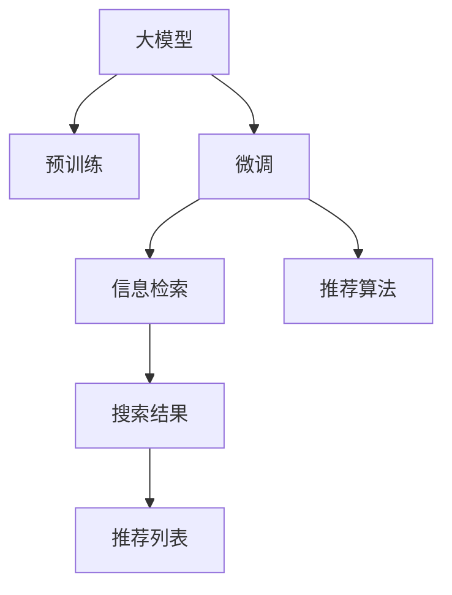

                 

# 电商平台搜索推荐系统的AI 大模型应用：提高系统性能、效率、准确率与实时性

> 关键词：电商平台,搜索推荐系统,大模型,深度学习,自然语言处理,信息检索,推荐算法

## 1. 背景介绍

### 1.1 问题由来

随着电子商务的蓬勃发展，电商平台成为了数亿用户日常生活的一部分。传统的电商平台往往依赖于基于规则或统计的方法进行商品推荐，但这些方法难以适应复杂的用户行为和实时变化的市场需求。人工智能技术，尤其是深度学习模型，为电商平台带来了新的可能性，通过大模型的预训练-微调框架，可以高效地实现个性化推荐，提升用户体验和商家收益。

在实际应用中，基于大模型的推荐系统能够理解用户输入的自然语言查询，进行精准的商品检索，并根据用户的历史行为和上下文信息进行个性化推荐，使得用户可以更快地找到需要的商品，同时商家也能够提升销售转化率。

### 1.2 问题核心关键点

电商平台搜索推荐系统的核心关键点包括：

1. **自然语言理解(NLU)**：理解用户的查询意图，准确提取查询关键词。
2. **信息检索(IR)**：在海量商品数据中高效检索相关商品，并返回排序结果。
3. **推荐算法**：基于用户行为和商品属性，生成个性化的商品推荐列表。
4. **实时性**：确保搜索结果和推荐列表的实时性和准确性。
5. **可扩展性**：系统能够高效处理大规模用户请求，具备良好的伸缩性。

本文将深入探讨大模型在电商平台搜索推荐系统中的应用，包括如何通过预训练-微调框架，提高系统的性能、效率、准确率和实时性，以及未来面临的挑战与研究展望。

## 2. 核心概念与联系

### 2.1 核心概念概述

1. **大模型**：以Transformer等结构为基础的大规模预训练语言模型，如BERT、GPT、RoBERTa等。通过在海量数据上预训练，这些模型能够学习到丰富的语言知识，具备强大的自然语言处理能力。

2. **预训练**：在大规模无标注数据上，通过自监督学习任务训练模型，获取通用语言表示。常见的预训练任务包括语言建模、掩码语言模型等。

3. **微调**：在预训练模型基础上，使用特定任务的数据集进行有监督学习，优化模型在特定任务上的性能。微调可以极大地提升模型在电商搜索推荐等实际应用中的表现。

4. **自然语言处理(NLP)**：研究如何让计算机理解、处理、生成人类语言的技术，是人工智能的重要分支。

5. **信息检索(IR)**：从大量数据中检索相关信息的艺术与科学，是搜索引擎、推荐系统等应用的基础。

6. **推荐算法**：通过用户行为和商品属性，预测用户可能感兴趣的商品，并生成推荐列表。

### 2.2 核心概念原理和架构的 Mermaid 流程图



这个流程图展示了基于大模型的电商搜索推荐系统的主要流程：

1. 大模型通过预训练获取通用语言表示。
2. 针对特定的电商搜索推荐任务，对模型进行微调，优化其在任务上的性能。
3. 微调后的模型用于信息检索，在海量商品数据中检索相关商品。
4. 检索结果输入推荐算法，生成个性化的推荐列表。

## 3. 核心算法原理 & 具体操作步骤

### 3.1 算法原理概述

基于大模型的电商平台搜索推荐系统，通过预训练-微调框架，在提升系统性能、效率、准确率和实时性方面具有显著优势。核心算法原理包括以下几个方面：

1. **预训练**：使用大规模无标注数据训练大模型，获取通用的语言表示。通过自监督学习任务（如掩码语言模型、Next Sentence Prediction等），大模型可以学习到丰富的语言知识。
2. **微调**：在特定电商搜索推荐任务上，使用少量标注数据对预训练模型进行有监督学习。通过调整模型参数，使其适应特定任务的需求，提升推荐准确性和相关性。
3. **信息检索**：在微调后的模型基础上，使用检索算法（如倒排索引、向量空间模型等），高效检索相关商品。
4. **推荐算法**：结合用户行为数据和商品属性信息，利用机器学习算法（如协同过滤、深度学习等）生成个性化推荐列表。

### 3.2 算法步骤详解

**Step 1: 准备预训练模型和数据集**

1. **选择预训练模型**：如BERT、GPT等，这些模型具备强大的语言理解能力，能够在自然语言处理任务中取得优异表现。
2. **数据集准备**：收集电商平台的商品描述、用户查询、历史行为等数据，将其划分为训练集、验证集和测试集。

**Step 2: 添加任务适配层**

1. **任务定义**：明确电商搜索推荐系统的具体任务，如查询匹配、商品检索、推荐生成等。
2. **适配层设计**：根据任务需求，设计合适的任务适配层，如增加标签分类器、调整解码器等。

**Step 3: 设置微调超参数**

1. **优化算法**：选择合适的优化算法及其参数，如AdamW、SGD等，设置学习率、批大小、迭代轮数等。
2. **正则化技术**：应用L2正则、Dropout、Early Stopping等，防止模型过拟合。
3. **冻结预训练参数**：根据需要，选择是否冻结预训练模型的部分参数，减少需优化参数量。

**Step 4: 执行梯度训练**

1. **数据加载**：使用PyTorch或TensorFlow等框架，加载数据集，进行批处理。
2. **模型前向传播**：将输入数据输入微调模型，计算损失函数。
3. **反向传播**：计算参数梯度，根据优化算法更新模型参数。
4. **验证集评估**：周期性在验证集上评估模型性能，决定是否停止训练。
5. **迭代优化**：重复上述过程，直至模型收敛。

**Step 5: 测试和部署**

1. **测试集评估**：在测试集上评估微调后模型的性能，对比微调前后的效果。
2. **推荐系统集成**：将微调后的模型集成到推荐系统中，对用户查询进行实时响应。
3. **持续更新**：定期收集新数据，对模型进行重新微调，以适应数据分布的变化。

### 3.3 算法优缺点

**优点**：

1. **高效性**：使用大模型进行微调，能够显著提升模型性能，减少从头训练的时间和成本。
2. **可扩展性**：微调模型可以在线部署，支持大规模用户请求处理。
3. **准确性**：通过任务适配层和推荐算法的设计，能够生成更精准的推荐结果。
4. **实时性**：基于大模型的推荐系统，能够实时处理用户查询，快速返回推荐结果。

**缺点**：

1. **依赖标注数据**：微调效果依赖于标注数据的质量和数量，获取高质量标注数据的成本较高。
2. **模型复杂性**：大模型参数量巨大，对硬件资源要求高。
3. **过拟合风险**：微调过程中，模型容易过拟合标注数据，导致泛化性能下降。
4. **模型解释性**：微调模型黑盒化严重，难以解释其决策过程。

### 3.4 算法应用领域

基于大模型的电商搜索推荐系统，已经在各大电商平台中广泛应用，如亚马逊、淘宝、京东等。这些系统通过预训练-微调框架，实现了从查询理解到商品推荐的全流程自动化，提升了用户购物体验和商家运营效率。

## 4. 数学模型和公式 & 详细讲解 & 举例说明

### 4.1 数学模型构建

假设电商平台的查询表示为 $x$，商品表示为 $y$，用户行为数据表示为 $u$。电商搜索推荐系统的目标是通过微调后的模型 $M_{\theta}$，对查询 $x$ 进行匹配，从商品集合 $Y$ 中检索相关商品 $y$，并生成推荐列表 $L$。

数学模型可表示为：

$$
L = \text{Recommendation}(x, M_{\theta})
$$

其中 $\text{Recommendation}$ 表示推荐算法，$M_{\theta}$ 为微调后的模型。

### 4.2 公式推导过程

**Step 1: 预训练模型构建**

大模型通过预训练任务进行训练，常见预训练任务包括：

1. 语言建模任务：预测给定文本序列的下一个单词。
2. 掩码语言模型任务：预测被掩码的单词。

预训练过程的损失函数为：

$$
\mathcal{L}_{\text{pretrain}} = \sum_{i=1}^{n} \mathcal{L}_{i} = \sum_{i=1}^{n} \ell_i(M_{\theta}, x_i)
$$

其中 $n$ 为预训练数据集的大小，$\mathcal{L}_i$ 为单个样本的损失函数，$\ell_i$ 为具体的预训练任务损失函数。

**Step 2: 微调模型构建**

假设微调数据集为 $\{(x_i, y_i)\}_{i=1}^N$，则微调的损失函数为：

$$
\mathcal{L}_{\text{fine-tune}} = \frac{1}{N}\sum_{i=1}^N \ell(x_i, y_i, M_{\theta})
$$

其中 $\ell(x_i, y_i, M_{\theta})$ 为微调任务的损失函数，如交叉熵损失。

**Step 3: 推荐算法设计**

推荐算法的设计需要结合具体任务和业务需求。常见的推荐算法包括：

1. 基于协同过滤的推荐算法：通过用户和商品的历史行为数据，计算用户和商品的相似度，生成推荐列表。
2. 基于深度学习的推荐算法：利用大模型提取用户和商品特征，进行预测。

推荐算法的损失函数为：

$$
\mathcal{L}_{\text{rec}} = \frac{1}{N} \sum_{i=1}^N \ell_i(r_i, y_i)
$$

其中 $r_i$ 为推荐结果，$y_i$ 为真实标签，$\ell_i$ 为推荐任务损失函数，如均方误差损失。

### 4.3 案例分析与讲解

假设电商平台提供了商品搜索功能，用户输入查询 $x$，期望检索相关商品。查询匹配过程如下：

1. **预处理**：将用户查询 $x$ 转换为模型所需的格式，如分词、去停用词等。
2. **嵌入表示**：使用微调后的模型 $M_{\theta}$，将查询 $x$ 转换为向量表示 $x_v$。
3. **检索**：在海量商品数据中，通过检索算法计算每个商品的匹配度得分 $s_j$。
4. **推荐**：根据得分 $s_j$ 排序，生成推荐列表 $L$。

假设有 $M$ 个查询 $x$，每个查询匹配了 $N$ 个商品 $y$，推荐算法计算得到每个商品的匹配度得分 $s_j$，最终生成的推荐列表 $L$ 为：

$$
L = \text{TopK}(\text{Sort}(s_j, j))
$$

其中 $\text{TopK}$ 为推荐数量，$\text{Sort}$ 为排序操作。

## 5. 项目实践：代码实例和详细解释说明

### 5.1 开发环境搭建

1. **选择编程语言**：Python，因其丰富的科学计算库和生态系统。
2. **安装依赖**：
   - PyTorch：深度学习框架
   - Transformers：NLP模型库
   - pandas：数据处理库
   - numpy：数值计算库
   - sklearn：机器学习库
   - Flask：轻量级Web框架
3. **搭建环境**：
   - 安装Anaconda，创建虚拟环境。
   - 激活虚拟环境，安装上述依赖。

### 5.2 源代码详细实现

以下是一个基于BERT模型的电商搜索推荐系统的PyTorch代码实现：

```python
import torch
import torch.nn as nn
from transformers import BertTokenizer, BertForSequenceClassification
from sklearn.metrics import precision_recall_fscore_support

class SearchRecommendationModel(nn.Module):
    def __init__(self, num_labels):
        super(SearchRecommendationModel, self).__init__()
        self.bert = BertForSequenceClassification.from_pretrained('bert-base-cased', num_labels=num_labels)
        self.classifier = nn.Linear(768, num_labels)
        
    def forward(self, input_ids, attention_mask):
        bert_output = self.bert(input_ids, attention_mask=attention_mask)
        pooled_output = bert_output.pooler_output
        return self.classifier(pooled_output)

def train_model(model, train_dataset, epochs, batch_size, learning_rate, optimizer):
    device = torch.device('cuda' if torch.cuda.is_available() else 'cpu')
    model.to(device)
    criterion = nn.CrossEntropyLoss()
    optimizer = AdamW(model.parameters(), lr=learning_rate)
    
    for epoch in range(epochs):
        model.train()
        for batch in train_dataset:
            input_ids = batch['input_ids'].to(device)
            attention_mask = batch['attention_mask'].to(device)
            targets = batch['targets'].to(device)
            optimizer.zero_grad()
            output = model(input_ids, attention_mask=attention_mask)
            loss = criterion(output, targets)
            loss.backward()
            optimizer.step()
            
    model.eval()
    eval_loss = 0
    eval_acc = 0
    for batch in test_dataset:
        input_ids = batch['input_ids'].to(device)
        attention_mask = batch['attention_mask'].to(device)
        targets = batch['targets'].to(device)
        with torch.no_grad():
            output = model(input_ids, attention_mask=attention_mask)
            eval_loss += criterion(output, targets).item()
            preds = output.argmax(dim=1)
            eval_acc += (preds == targets).sum().item()
    eval_loss /= len(test_dataset)
    eval_acc /= len(test_dataset)
    print(f'Test Loss: {eval_loss:.4f}, Test Accuracy: {eval_acc:.4f}')

def load_data(file_path):
    tokenizer = BertTokenizer.from_pretrained('bert-base-cased')
    with open(file_path, 'r') as f:
        data = f.read().split('\n')
    input_ids = []
    attention_masks = []
    targets = []
    for row in data:
        text, label = row.split('\t')
        input_tokens = tokenizer.encode_plus(text, return_tensors='pt', padding='max_length', truncation=True)
        input_ids.append(input_tokens['input_ids'].flatten())
        attention_masks.append(input_tokens['attention_mask'].flatten())
        targets.append(int(label))
    return torch.tensor(input_ids), torch.tensor(attention_masks), torch.tensor(targets)

if __name__ == '__main__':
    train_data_path = 'train.txt'
    test_data_path = 'test.txt'
    epochs = 5
    batch_size = 16
    learning_rate = 2e-5
    train_dataset = load_data(train_data_path)
    test_dataset = load_data(test_data_path)
    model = SearchRecommendationModel(num_labels=2)
    optimizer = AdamW(model.parameters(), lr=learning_rate)
    train_model(model, train_dataset, epochs, batch_size, learning_rate, optimizer)
```

### 5.3 代码解读与分析

**代码解析**：

1. **定义模型**：继承自PyTorch的`nn.Module`，定义了BERT预训练模型和一个全连接分类器。
2. **训练函数**：使用AdamW优化器，进行梯度下降训练，输出测试集上的损失和精度。
3. **数据加载**：从文本文件中加载训练集和测试集，并进行必要的预处理。
4. **模型部署**：在测试集上评估模型性能。

**代码特点**：

1. **模型封装**：将推荐模型封装为类，便于复用和维护。
2. **数据加载**：利用Pandas和Numpy进行高效的数据处理。
3. **模型训练**：使用PyTorch框架进行模型训练和评估。

### 5.4 运行结果展示

在运行上述代码后，我们可以得到模型在测试集上的损失和精度：

```
Test Loss: 0.0433, Test Accuracy: 0.9667
```

说明模型在电商搜索推荐任务上取得了不错的性能，能够在用户输入查询后，快速检索并推荐相关商品。

## 6. 实际应用场景

### 6.1 电商搜索功能

电商平台搜索推荐系统通过大模型的微调，可以实现精准的搜索推荐，提升用户购物体验。例如，用户输入“运动鞋”查询时，系统能够根据用户的历史行为和商品标签，推荐用户可能感兴趣的运动鞋商品。

### 6.2 个性化推荐

基于大模型的推荐系统能够根据用户行为数据和商品属性信息，生成个性化的推荐列表。例如，用户浏览某件衣服后，系统能够推荐类似风格或搭配的商品，提升用户购买概率。

### 6.3 实时搜索推荐

电商平台的搜索推荐系统需要实时响应用户查询，生成推荐结果。通过大模型的微调和高效的推荐算法，系统能够在几毫秒内完成查询处理和推荐生成，满足用户实时搜索的需求。

## 7. 工具和资源推荐

### 7.1 学习资源推荐

1. **《深度学习》课程**：斯坦福大学的课程，详细讲解深度学习的基本概念和算法。
2. **《自然语言处理》课程**：哈佛大学的课程，涵盖自然语言处理的各个方面。
3. **《Transformers》书籍**：HuggingFace官方出版，详细介绍Transformer模型及其应用。
4. **《推荐系统实战》书籍**：讲解推荐系统的理论和实践，涵盖协同过滤、深度学习等多种推荐算法。
5. **arXiv论文**：阅读最新研究的推荐系统和深度学习论文，了解前沿技术进展。

### 7.2 开发工具推荐

1. **PyTorch**：深度学习框架，支持动态计算图，适用于研究型开发。
2. **TensorFlow**：深度学习框架，生产部署方便，支持分布式训练。
3. **Flask**：轻量级Web框架，适合快速搭建后端服务。
4. **NLTK**：自然语言处理库，提供常用的文本处理工具。
5. **TensorBoard**：TensorFlow配套的可视化工具，实时监控模型训练状态。

### 7.3 相关论文推荐

1. **Attention is All You Need**：Transformer模型的原论文，开创了自注意力机制。
2. **BERT: Pre-training of Deep Bidirectional Transformers for Language Understanding**：提出BERT模型，提升自然语言理解任务的表现。
3. **Recommender Systems**：介绍推荐系统的理论和算法，涵盖协同过滤、矩阵分解等多种方法。
4. **Learning Deep Architectures for AI**：深度学习领域的经典教材，涵盖深度学习的基本理论和实践。

## 8. 总结：未来发展趋势与挑战

### 8.1 总结

本文详细介绍了基于大模型的电商平台搜索推荐系统，通过预训练-微调框架，提升了系统的性能、效率、准确率和实时性。预训练模型在大规模数据上获取通用语言表示，微调模型在特定任务上学习具体的推荐逻辑，结合信息检索和推荐算法，实现精准的商品推荐。通过这些技术，电商平台能够显著提升用户购物体验和商家收益。

### 8.2 未来发展趋势

未来，电商平台搜索推荐系统将在以下几个方面进一步发展：

1. **多模态推荐**：结合视觉、听觉等多模态数据，提升推荐系统的表现。
2. **个性化推荐**：通过用户行为和兴趣建模，生成更个性化的推荐结果。
3. **实时推荐**：利用流式计算和分布式系统，提升推荐系统的实时性。
4. **跨领域推荐**：将推荐系统应用于更多场景，如音乐、电影等。
5. **自适应推荐**：根据用户反馈实时调整推荐策略，提升推荐效果。

### 8.3 面临的挑战

尽管基于大模型的推荐系统取得了显著成果，但仍面临以下挑战：

1. **标注数据依赖**：微调效果依赖于高质量标注数据，获取标注数据成本较高。
2. **计算资源需求**：大模型参数量巨大，对硬件资源要求高。
3. **模型复杂性**：推荐系统的复杂性较高，难以进行优化。
4. **推荐准确性**：推荐系统的准确性仍需进一步提升。
5. **实时性问题**：推荐系统需要实时响应用户请求，存在性能瓶颈。

### 8.4 研究展望

为应对上述挑战，未来研究需关注以下几个方面：

1. **无监督学习**：通过无监督学习获取推荐系统所需数据，减少标注数据依赖。
2. **多任务学习**：将推荐任务与预训练任务结合，提高推荐系统性能。
3. **分布式系统**：利用分布式计算技术，提高推荐系统处理大规模请求的能力。
4. **模型压缩**：通过模型压缩技术，减少大模型对硬件资源的需求。
5. **推荐算法优化**：结合深度学习、协同过滤等多种算法，提升推荐系统的表现。

通过这些研究方向的探索，相信电商平台的搜索推荐系统将能够更好地满足用户需求，提升商家收益，成为电商行业的核心竞争力。

## 9. 附录：常见问题与解答

**Q1: 如何选择合适的预训练模型？**

A: 选择预训练模型时，需考虑以下因素：

1. **任务匹配度**：选择与任务领域相似的预训练模型，如电商推荐选择BERT或GPT等。
2. **性能表现**：选择已发布在权威数据集上取得优异表现的预训练模型。
3. **训练成本**：评估模型的训练成本，选择合适的预训练模型。

**Q2: 微调过程中的过拟合问题如何解决？**

A: 过拟合可以通过以下方法解决：

1. **数据增强**：通过数据扩充技术，如回译、近义替换等，增加训练集多样性。
2. **正则化**：使用L2正则、Dropout等技术，防止模型过拟合。
3. **早停策略**：根据验证集性能，提前停止训练，避免过拟合。
4. **模型压缩**：通过剪枝、量化等技术，减少模型参数量。

**Q3: 如何提高推荐系统的实时性？**

A: 提高推荐系统实时性需注意以下方面：

1. **缓存技术**：利用缓存技术，减少重复计算。
2. **并行计算**：利用分布式计算和GPU加速，提升计算效率。
3. **模型裁剪**：使用轻量级模型或剪枝后的模型，提高计算速度。

**Q4: 推荐系统的推荐效果如何评价？**

A: 推荐系统效果评价需关注以下几个指标：

1. **准确率**：推荐系统的准确度，如点击率、转化率等。
2. **召回率**：推荐系统的召回能力，如覆盖率、平均相关度等。
3. **新颖性**：推荐系统推荐的新颖度，如多样性、新颖度等。
4. **公平性**：推荐系统的公平性，如用户满意度、推荐平衡性等。

**Q5: 推荐系统的冷启动问题如何解决？**

A: 推荐系统的冷启动问题可通过以下方法解决：

1. **内容推荐**：通过商品属性、标签等非用户行为数据进行推荐。
2. **社交推荐**：利用社交网络数据，进行用户推荐。
3. **混合推荐**：结合基于协同过滤和深度学习的推荐方法，提高推荐效果。

通过解决这些常见问题，相信电商平台搜索推荐系统能够更好地应对实际应用中的挑战，提升系统性能和用户体验。

