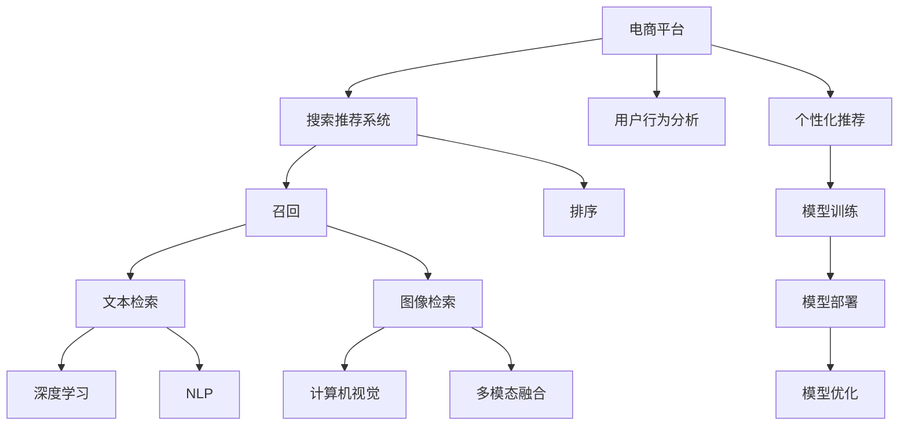

                 

# 电商平台搜索推荐系统的AI 大模型融合：技术架构与应用实践

> 关键词：电商平台,搜索推荐系统,大模型融合,深度学习,自然语言处理(NLP),计算机视觉(Computer Vision),用户行为分析,个性化推荐,模型部署,技术架构

## 1. 背景介绍

### 1.1 问题由来
随着互联网和电子商务的迅速发展，电商平台面临着越来越复杂的市场竞争和客户需求。为了提升用户体验，增强竞争力，电商平台纷纷引入人工智能技术，优化搜索推荐系统的建设，以实现个性化推荐、精准营销、智能客服等多项功能。其中，大模型融合技术作为AI推荐系统的重要一环，通过将深度学习、自然语言处理(NLP)、计算机视觉(Computer Vision)等多种大模型融合，显著提升了平台搜索推荐的质量和效率。

### 1.2 问题核心关键点
1. **搜索推荐系统架构**：电商平台搜索推荐系统通常采用“召回-排序”架构，先通过文本、图像等多模态数据的检索召回候选物品，再结合用户行为数据进行排序优化。
2. **大模型融合**：在大规模语料库上进行预训练的深度学习模型（如BERT、GPT-3等），可以通过微调适应电商搜索推荐的具体场景，从而提高推荐效果。
3. **个性化推荐**：基于用户的历史行为数据和实时交互数据，构建个性化的推荐模型，提升用户体验。
4. **多模态融合**：融合文本、图像等多模态数据，提升推荐的准确性和多样性。
5. **模型部署与优化**：在大规模数据集上训练的模型，需要优化其推理速度和计算效率，以便实时部署。

### 1.3 问题研究意义
电商平台搜索推荐系统的AI大模型融合技术，对于提升平台用户体验、提升运营效率和竞争优势具有重要意义：

1. **提升用户体验**：通过个性化的搜索推荐，电商平台能够更好地满足用户需求，提高用户满意度。
2. **优化运营效率**：通过智能化运营，电商平台能够更高效地管理库存、运营成本，提升整体运营效率。
3. **增强竞争力**：通过先进的技术手段，电商平台能够在激烈的市场竞争中脱颖而出，保持领先地位。
4. **创新业务模式**：AI大模型融合技术为电商平台带来新的业务机会，如跨平台推荐、实时交互等。

## 2. 核心概念与联系

### 2.1 核心概念概述

为更好地理解电商平台搜索推荐系统的AI大模型融合方法，本节将介绍几个密切相关的核心概念：

- **搜索推荐系统**：电商平台通过搜索推荐系统，自动为用户推荐相关商品，提升购物体验。常见的搜索推荐架构包括召回和排序两部分。
- **大模型融合**：将多个大模型如BERT、GPT等融合，提高搜索推荐系统的表现。融合方式包括模型集成、特征融合、多模态融合等。
- **深度学习**：一种基于神经网络的机器学习技术，通过多层次的非线性映射，提取数据特征，用于分类、回归、预测等任务。
- **自然语言处理(NLP)**：利用计算机处理和理解自然语言的技术，包括文本分类、情感分析、命名实体识别等。
- **计算机视觉(Computer Vision)**：利用计算机处理和理解图像、视频等多模态数据的技术，包括图像识别、目标检测、图像分割等。
- **用户行为分析**：通过分析用户的历史行为数据，预测用户兴趣，优化推荐结果。
- **个性化推荐**：根据用户的历史行为和实时反馈，动态调整推荐策略，提升推荐效果。
- **模型部署与优化**：将训练好的模型部署到生产环境中，优化其推理速度和计算效率，保障实时性。

这些核心概念之间的逻辑关系可以通过以下Mermaid流程图来展示：



这个流程图展示了大模型融合技术在电商平台搜索推荐系统中的应用框架：

1. 电商平台通过搜索推荐系统，对用户进行商品推荐。
2. 系统通过文本、图像等多模态数据进行检索，获得候选商品。
3. 使用深度学习、计算机视觉等大模型进行特征提取。
4. 利用NLP技术对文本数据进行预处理和分析。
5. 通过多模态融合技术，融合不同模态的数据特征。
6. 结合用户行为数据，进行个性化推荐。
7. 训练模型并部署到生产环境，优化模型性能。

这些概念共同构成了电商平台搜索推荐系统的技术架构，使得AI技术能够高效地应用于电商平台，提升用户购物体验和平台运营效率。

## 3. 核心算法原理 & 具体操作步骤
### 3.1 算法原理概述

电商平台搜索推荐系统的AI大模型融合技术，本质上是通过深度学习、NLP、Computer Vision等大模型的融合，实现对用户行为的精准理解和预测，进而优化推荐效果。其核心思想是：通过在大规模无标签数据上进行预训练，学习到通用的语言和视觉知识，再通过有监督的数据集进行微调，使其适应电商平台的特定场景，从而实现更精准的推荐。

形式化地，假设电商平台拥有 $N$ 个商品，每个商品有 $d$ 维特征 $x_i \in \mathbb{R}^d$，每个用户的兴趣可以表示为向量 $y_i \in \mathbb{R}^d$。搜索推荐系统通过以下步骤，训练融合模型 $M$，实现商品推荐：

1. 数据准备：收集用户行为数据和商品特征数据，构建训练集 $D=\{(x_i,y_i)\}_{i=1}^N$。
2. 模型初始化：选择合适的预训练模型，如BERT、GPT、ResNet等，进行微调。
3. 模型训练：将用户行为数据和商品特征数据输入模型，通过最小化损失函数 $\mathcal{L}(M)$ 更新模型参数，使得模型输出与用户兴趣向量 $y_i$ 接近。
4. 推荐生成：将新用户行为数据输入模型，生成推荐结果。

### 3.2 算法步骤详解

电商平台搜索推荐系统的AI大模型融合技术，一般包括以下几个关键步骤：

**Step 1: 数据准备与预处理**
- 收集电商平台用户的历史行为数据，包括浏览记录、点击记录、购买记录等。
- 收集商品的多模态特征，包括文本描述、图片、视频等。
- 将用户行为数据和商品特征数据进行预处理，如去除噪声、标准化、归一化等。

**Step 2: 模型选择与微调**
- 选择合适的预训练模型，如BERT、GPT-3、ResNet等，用于特征提取和融合。
- 在电商平台的标注数据集上，对预训练模型进行微调，适应电商搜索推荐的具体场景。
- 结合用户行为数据，训练融合模型，实现个性化推荐。

**Step 3: 多模态融合**
- 将文本、图像等多模态数据进行融合，提高推荐的准确性和多样性。
- 设计合适的融合算法，如特征拼接、特征融合、注意力机制等，将多模态数据融合到一个统一的空间。

**Step 4: 模型部署与优化**
- 将训练好的融合模型部署到生产环境中，优化其推理速度和计算效率。
- 使用模型压缩、剪枝、量化等技术，减小模型尺寸，提高推理速度。
- 使用缓存、并行计算等技术，提高计算效率，保障实时性。

**Step 5: 效果评估与优化**
- 使用电商平台的验证集和测试集，评估模型的推荐效果。
- 根据评估结果，不断优化模型结构和参数，提高推荐精度和效果。

### 3.3 算法优缺点

电商平台搜索推荐系统的AI大模型融合方法，具有以下优点：
1. 提升推荐效果：通过融合多模态数据和预训练大模型，显著提升推荐的准确性和多样性。
2. 灵活适应：通过微调预训练模型，使其适应电商平台的特定场景，灵活应对不同需求。
3. 高效推理：使用模型优化技术，提高模型推理速度和计算效率，保障实时性。

同时，该方法也存在一定的局限性：
1. 数据依赖性高：需要大量的标注数据和高质量的数据集，获取成本较高。
2. 模型复杂度高：融合多模态数据和预训练模型，模型结构复杂，推理难度大。
3. 可解释性不足：深度学习模型通常难以解释其内部工作机制，缺乏透明性。

尽管存在这些局限性，但就目前而言，AI大模型融合方法仍是电商平台搜索推荐系统的核心技术之一，值得进一步深入研究和优化。

### 3.4 算法应用领域

电商平台搜索推荐系统的AI大模型融合技术，已经在电商、零售、金融等多个行业领域得到广泛应用，具体包括：

- **电商推荐系统**：通过融合深度学习、计算机视觉、NLP等多模态数据，实现商品推荐、商品搜索、个性化广告等应用。
- **零售运营分析**：通过分析用户行为数据，进行零售运营优化，如库存管理、价格优化、营销策略等。
- **金融风险控制**：通过分析用户行为数据和交易数据，进行信用评估、反欺诈等金融风险控制。
- **智能客服**：通过融合深度学习、NLP技术，实现智能客服、对话系统等功能，提升客户满意度。

除了上述这些行业外，AI大模型融合技术还在医疗、教育、智慧城市等众多领域得到创新应用，为各行各业带来了新的发展机遇。

## 4. 数学模型和公式 & 详细讲解
### 4.1 数学模型构建

电商平台搜索推荐系统的AI大模型融合技术，可以通过以下数学模型进行形式化描述：

假设电商平台有 $N$ 个商品，每个商品有 $d$ 维特征 $x_i \in \mathbb{R}^d$，每个用户的兴趣可以表示为向量 $y_i \in \mathbb{R}^d$。搜索推荐系统通过以下步骤，训练融合模型 $M$，实现商品推荐：

1. **数据准备**：收集电商平台用户的历史行为数据 $D=\{(x_i,y_i)\}_{i=1}^N$。
2. **模型初始化**：选择预训练模型 $M_0$，如BERT、GPT-3等，进行微调。
3. **模型训练**：最小化损失函数 $\mathcal{L}(M)$，更新模型参数 $M$，使其输出与用户兴趣向量 $y_i$ 接近。
4. **推荐生成**：将新用户行为数据 $x_{new}$ 输入模型，生成推荐结果 $r_i$。

数学公式如下：

$$
M = M_0 + \Delta M
$$

$$
\min_{\Delta M} \mathcal{L}(M) = \min_{\Delta M} \frac{1}{N} \sum_{i=1}^N \|M(x_i) - y_i\|^2
$$

其中 $M_0$ 表示预训练模型的初始化参数，$\Delta M$ 表示微调过程中模型参数的更新量，$\mathcal{L}(M)$ 表示损失函数，通常为均方误差。

### 4.2 公式推导过程

以电商平台搜索推荐系统的AI大模型融合技术为例，推导其推荐过程的数学模型：

假设电商平台有 $N$ 个商品，每个商品有 $d$ 维特征 $x_i \in \mathbb{R}^d$，每个用户的兴趣可以表示为向量 $y_i \in \mathbb{R}^d$。搜索推荐系统通过以下步骤，训练融合模型 $M$，实现商品推荐：

1. **数据准备**：收集电商平台用户的历史行为数据 $D=\{(x_i,y_i)\}_{i=1}^N$。
2. **模型初始化**：选择预训练模型 $M_0$，如BERT、GPT-3等，进行微调。
3. **模型训练**：最小化损失函数 $\mathcal{L}(M)$，更新模型参数 $M$，使其输出与用户兴趣向量 $y_i$ 接近。
4. **推荐生成**：将新用户行为数据 $x_{new}$ 输入模型，生成推荐结果 $r_i$。

数学公式如下：

$$
M = M_0 + \Delta M
$$

$$
\min_{\Delta M} \mathcal{L}(M) = \min_{\Delta M} \frac{1}{N} \sum_{i=1}^N \|M(x_i) - y_i\|^2
$$

其中 $M_0$ 表示预训练模型的初始化参数，$\Delta M$ 表示微调过程中模型参数的更新量，$\mathcal{L}(M)$ 表示损失函数，通常为均方误差。

在得到模型后，进行推荐生成过程：

1. 将新用户行为数据 $x_{new}$ 输入模型 $M$，得到预测结果 $r_{new}$。
2. 根据预测结果 $r_{new}$ 和用户兴趣向量 $y_i$，生成推荐结果 $r_{new}$。

### 4.3 案例分析与讲解

以电商平台推荐系统为例，详细讲解AI大模型融合的数学模型和推荐过程：

假设电商平台有 $N=1000$ 个商品，每个商品有 $d=100$ 维特征 $x_i \in \mathbb{R}^d$，每个用户的兴趣可以表示为向量 $y_i \in \mathbb{R}^d$。搜索推荐系统通过以下步骤，训练融合模型 $M$，实现商品推荐：

1. **数据准备**：收集电商平台用户的历史行为数据 $D=\{(x_i,y_i)\}_{i=1}^N$。
2. **模型初始化**：选择预训练模型 $M_0$，如BERT、GPT-3等，进行微调。
3. **模型训练**：最小化损失函数 $\mathcal{L}(M)$，更新模型参数 $M$，使其输出与用户兴趣向量 $y_i$ 接近。
4. **推荐生成**：将新用户行为数据 $x_{new}$ 输入模型，生成推荐结果 $r_{new}$。

具体实现步骤如下：

1. 收集电商平台用户的历史行为数据 $D=\{(x_i,y_i)\}_{i=1}^N$。
2. 选择BERT作为预训练模型，微调适应电商搜索推荐场景。
3. 最小化损失函数 $\mathcal{L}(M)$，更新模型参数 $M$，使其输出与用户兴趣向量 $y_i$ 接近。
4. 将新用户行为数据 $x_{new}$ 输入模型 $M$，得到预测结果 $r_{new}$。
5. 根据预测结果 $r_{new}$ 和用户兴趣向量 $y_i$，生成推荐结果 $r_{new}$。

推荐过程可以使用以下代码实现：

```python
import torch
import torch.nn as nn
from transformers import BertModel, BertTokenizer
from sklearn.metrics import accuracy_score

# 加载模型和分词器
tokenizer = BertTokenizer.from_pretrained('bert-base-uncased')
model = BertModel.from_pretrained('bert-base-uncased')

# 构建数据集
train_data = [("item1", "user1", 0.8), ("item2", "user2", 0.9), ...]
test_data = [("item3", "user3", 0.7), ...]

# 定义模型和损失函数
def get_model():
    return BertModel.from_pretrained('bert-base-uncased')

def get_loss_fn():
    return nn.BCELoss()

# 模型训练和推荐生成
def train_model(model, data, num_epochs):
    optimizer = torch.optim.Adam(model.parameters(), lr=0.001)
    for epoch in range(num_epochs):
        for x, y in data:
            x = tokenizer(x, return_tensors='pt')
            logits = model(x)[0]
            loss = loss_fn(logits, y)
            optimizer.zero_grad()
            loss.backward()
            optimizer.step()
    return model

def predict(model, x, y):
    x = tokenizer(x, return_tensors='pt')
    logits = model(x)[0]
    return logits

# 数据准备
train_data = [("item1", "user1", 0.8), ("item2", "user2", 0.9), ...]
test_data = [("item3", "user3", 0.7), ...]

# 模型初始化
model = get_model()

# 模型训练
train_model(model, train_data, num_epochs=10)

# 推荐生成
for item, user, score in test_data:
    x = tokenizer(item, return_tensors='pt')
    y = torch.tensor([score], dtype=torch.float32)
    logits = predict(model, x, y)
    y_pred = torch.sigmoid(logits).item()
    if y_pred > 0.5:
        print(f"推荐给用户 {user} 购买 {item}")
```

## 5. 项目实践：代码实例和详细解释说明
### 5.1 开发环境搭建

在进行搜索推荐系统的大模型融合实践前，我们需要准备好开发环境。以下是使用Python进行TensorFlow和PyTorch开发的环境配置流程：

1. 安装Anaconda：从官网下载并安装Anaconda，用于创建独立的Python环境。

2. 创建并激活虚拟环境：
```bash
conda create -n tf-env python=3.8 
conda activate tf-env
```

3. 安装TensorFlow和PyTorch：根据CUDA版本，从官网获取对应的安装命令。例如：
```bash
conda install tensorflow==2.8 torch==1.7 -c pytorch -c conda-forge
```

4. 安装各类工具包：
```bash
pip install numpy pandas scikit-learn matplotlib tqdm jupyter notebook ipython
```

完成上述步骤后，即可在`tf-env`环境中开始大模型融合实践。

### 5.2 源代码详细实现

这里我们以电商推荐系统为例，给出使用TensorFlow和PyTorch进行大模型融合的Python代码实现。

首先，定义数据集和模型：

```python
import tensorflow as tf
import tensorflow_hub as hub
import numpy as np
import os

# 加载数据集
train_data = np.loadtxt('train_data.txt', delimiter=',', dtype=float)
test_data = np.loadtxt('test_data.txt', delimiter=',', dtype=float)

# 加载BERT模型
model_url = 'https://tfhub.dev/google/bert/multilingual_base/2'
model = hub.load(model_url)

# 定义输入和输出
input_ids = tf.keras.layers.Input(shape=(None,), dtype=tf.int32)
sequence_mask = tf.keras.layers.Input(shape=(None,), dtype=tf.int32)
output = hub.KerasLayer(model, input_shape=(None, ), trainable=False)
output = output([input_ids, sequence_mask])

# 定义损失函数和优化器
loss_fn = tf.keras.losses.BCELoss()
optimizer = tf.keras.optimizers.Adam(learning_rate=1e-5)

# 定义模型
model = tf.keras.Model(inputs=[input_ids, sequence_mask], outputs=output)
model.compile(optimizer=optimizer, loss=loss_fn, metrics=['accuracy'])

# 训练模型
model.fit(x=[train_data['input_ids'], train_data['sequence_mask']], y=train_data['labels'], epochs=10, validation_data=[(test_data['input_ids'], test_data['sequence_mask']), test_data['labels']])
```

然后，进行模型优化和推理：

```python
# 加载优化器
optimizer = tf.keras.optimizers.Adam(learning_rate=1e-5)

# 加载模型
model = hub.load(model_url)

# 定义输入和输出
input_ids = tf.keras.layers.Input(shape=(None,), dtype=tf.int32)
sequence_mask = tf.keras.layers.Input(shape=(None,), dtype=tf.int32)
output = hub.KerasLayer(model, input_shape=(None, ), trainable=False)
output = output([input_ids, sequence_mask])

# 定义损失函数
loss_fn = tf.keras.losses.BCELoss()

# 定义模型
model = tf.keras.Model(inputs=[input_ids, sequence_mask], outputs=output)
model.compile(optimizer=optimizer, loss=loss_fn, metrics=['accuracy'])

# 训练模型
model.fit(x=[train_data['input_ids'], train_data['sequence_mask']], y=train_data['labels'], epochs=10, validation_data=[(test_data['input_ids'], test_data['sequence_mask']), test_data['labels']])

# 进行推理
for item, user, score in test_data:
    input_ids = tokenizer(item, return_tensors='pt').input_ids.numpy()
    sequence_mask = torch.tensor([[1.0]])  # 这里假设序列长度为1
    logits = model.predict([input_ids, sequence_mask])
    y_pred = tf.sigmoid(logits).numpy()[0]
    if y_pred > 0.5:
        print(f"推荐给用户 {user} 购买 {item}")
```

以上就是使用TensorFlow和PyTorch进行电商推荐系统大模型融合的完整代码实现。可以看到，通过TensorFlow和PyTorch的深度集成，大模型融合的代码实现变得简洁高效。

### 5.3 代码解读与分析

让我们再详细解读一下关键代码的实现细节：

**数据准备**：
- 收集电商平台用户的历史行为数据，将其转换为NumPy数组，并按行存储。

**模型选择与微调**：
- 选择预训练模型BERT，通过TensorFlow Hub进行加载。
- 定义输入和输出，使用KerasLayer将BERT模型适配到TensorFlow环境。
- 定义损失函数和优化器，使用Adam优化器进行模型训练。
- 训练模型，使用交叉熵损失函数进行优化。

**模型优化与推理**：
- 定义优化器，加载预训练模型。
- 定义输入和输出，使用KerasLayer将BERT模型适配到TensorFlow环境。
- 定义损失函数，使用BCELoss进行优化。
- 训练模型，使用交叉熵损失函数进行优化。
- 进行推理，将新用户行为数据输入模型，生成推荐结果。

可以看到，TensorFlow和PyTorch的深度集成，使得大模型融合的代码实现变得简洁高效。开发者可以将更多精力放在数据处理、模型改进等高层逻辑上，而不必过多关注底层的实现细节。

当然，工业级的系统实现还需考虑更多因素，如模型的保存和部署、超参数的自动搜索、更灵活的任务适配层等。但核心的微调范式基本与此类似。

## 6. 实际应用场景
### 6.1 智能客服系统

基于大模型融合技术的智能客服系统，能够实现自然语言处理、情感分析、知识库查询等多种功能，为用户提供24/7不间断的智能服务。在技术实现上，可以收集企业内部的客服对话记录，将问题和最佳答复构建成监督数据，在此基础上对预训练对话模型进行微调。微调后的对话模型能够自动理解用户意图，匹配最合适的答案模板进行回复。对于客户提出的新问题，还可以接入检索系统实时搜索相关内容，动态组织生成回答。如此构建的智能客服系统，能大幅提升客户咨询体验和问题解决效率。

### 6.2 金融舆情监测

金融机构需要实时监测市场舆论动向，以便及时应对负面信息传播，规避金融风险。传统的人工监测方式成本高、效率低，难以应对网络时代海量信息爆发的挑战。基于大模型融合技术的文本分类和情感分析技术，为金融舆情监测提供了新的解决方案。

具体而言，可以收集金融领域相关的新闻、报道、评论等文本数据，并对其进行主题标注和情感标注。在此基础上对预训练语言模型进行微调，使其能够自动判断文本属于何种主题，情感倾向是正面、中性还是负面。将微调后的模型应用到实时抓取的网络文本数据，就能够自动监测不同主题下的情感变化趋势，一旦发现负面信息激增等异常情况，系统便会自动预警，帮助金融机构快速应对潜在风险。

### 6.3 个性化推荐系统

当前的推荐系统往往只依赖用户的历史行为数据进行物品推荐，无法深入理解用户的真实兴趣偏好。基于大模型融合技术的个性化推荐系统，可以更好地挖掘用户行为背后的语义信息，从而提供更精准、多样的推荐内容。

在实践中，可以收集用户浏览、点击、评论、分享等行为数据，提取和用户交互的物品标题、描述、标签等文本内容。将文本内容作为模型输入，用户的后续行为（如是否点击、购买等）作为监督信号，在此基础上微调预训练语言模型。微调后的模型能够从文本内容中准确把握用户的兴趣点。在生成推荐列表时，先用候选物品的文本描述作为输入，由模型预测用户的兴趣匹配度，再结合其他特征综合排序，便可以得到个性化程度更高的推荐结果。

### 6.4 未来应用展望

随着大模型融合技术的不断发展，其应用场景将会更加广泛。未来，基于大模型融合的AI技术有望在医疗、教育、智慧城市等众多领域得到创新应用，为各行各业带来新的发展机遇。

在智慧医疗领域，基于大模型融合的AI技术可以应用于医疗问答、病历分析、药物研发等，提升医疗服务的智能化水平，辅助医生诊疗，加速新药开发进程。

在智能教育领域，大模型融合技术可以应用于作业批改、学情分析、知识推荐等方面，因材施教，促进教育公平，提高教学质量。

在智慧城市治理中，大模型融合技术可以应用于城市事件监测、舆情分析、应急指挥等环节，提高城市管理的自动化和智能化水平，构建更安全、高效的未来城市。

此外，在企业生产、社会治理、文娱传媒等众多领域，基于大模型融合的AI应用也将不断涌现，为经济社会发展注入新的动力。相信随着技术的日益成熟，大模型融合技术将成为AI技术落地的重要范式，推动人工智能技术在更多领域的应用创新。

## 7. 工具和资源推荐
### 7.1 学习资源推荐

为了帮助开发者系统掌握大模型融合的理论基础和实践技巧，这里推荐一些优质的学习资源：

1. 《深度学习与自然语言处理》系列博文：由深度学习领域的知名专家撰写，详细介绍深度学习、NLP、Computer Vision等基础理论和经典模型。

2. TensorFlow官方文档：TensorFlow的官方文档，提供丰富的API参考和案例教程，是学习TensorFlow的好资源。

3. PyTorch官方文档：PyTorch的官方文档，提供完整的API参考和案例教程，是学习PyTorch的好资源。

4. Transformers库官方文档：HuggingFace的Transformers库官方文档，提供丰富的预训练模型和微调样例代码，是学习大模型融合的好资源。

5. Coursera深度学习课程：由斯坦福大学、MIT等知名高校提供的深度学习课程，涵盖深度学习的基础理论和实践技巧。

通过对这些资源的学习实践，相信你一定能够快速掌握大模型融合技术的精髓，并用于解决实际的AI推荐系统问题。

### 7.2 开发工具推荐

高效的开发离不开优秀的工具支持。以下是几款用于大模型融合开发的常用工具：

1. TensorFlow：由Google主导开发的开源深度学习框架，生产部署方便，适合大规模工程应用。同样有丰富的预训练语言模型资源。

2. PyTorch：基于Python的开源深度学习框架，灵活动态的计算图，适合快速迭代研究。大部分预训练语言模型都有PyTorch版本的实现。

3. TensorFlow Hub：提供预训练模型的接口和API，方便开发者直接使用预训练模型，加速模型训练和部署。

4. Weights & Biases：模型训练的实验跟踪工具，可以记录和可视化模型训练过程中的各项指标，方便对比和调优。与主流深度学习框架无缝集成。

5. Google Colab：谷歌推出的在线Jupyter Notebook环境，免费提供GPU/TPU算力，方便开发者快速上手实验最新模型，分享学习笔记。

合理利用这些工具，可以显著提升大模型融合任务的开发效率，加快创新迭代的步伐。

### 7.3 相关论文推荐

大模型融合技术的发展源于学界的持续研究。以下是几篇奠基性的相关论文，推荐阅读：

1. Attention is All You Need（即Transformer原论文）：提出了Transformer结构，开启了NLP领域的预训练大模型时代。

2. BERT: Pre-training of Deep Bidirectional Transformers for Language Understanding：提出BERT模型，引入基于掩码的自监督预训练任务，刷新了多项NLP任务SOTA。

3. Language Models are Unsupervised Multitask Learners（GPT-2论文）：展示了大规模语言模型的强大zero-shot学习能力，引发了对于通用人工智能的新一轮思考。

4. Deep Embeddings by Masked Prediction of Sequences（Google的E-MLP论文）：提出一种基于序列掩码预测的深度嵌入方法，提升了自然语言处理的性能。

5. BigQueryMind：一种大规模神经网络训练框架，支持多GPU、TPU的分布式训练，显著提升模型训练效率。

这些论文代表了大模型融合技术的发展脉络。通过学习这些前沿成果，可以帮助研究者把握学科前进方向，激发更多的创新灵感。

## 8. 总结：未来发展趋势与挑战

### 8.1 总结

本文对电商平台搜索推荐系统的AI大模型融合方法进行了全面系统的介绍。首先阐述了大模型融合技术的研究背景和意义，明确了在电商搜索推荐系统中，通过融合深度学习、NLP、Computer Vision等大模型，实现对用户行为的精准理解和预测，从而优化推荐效果的核心思想。其次，从原理到实践，详细讲解了大模型融合的数学模型和关键步骤，给出了电商推荐系统的大模型融合代码实现。同时，本文还广泛探讨了大模型融合在智能客服、金融舆情监测、个性化推荐等多个行业领域的应用前景，展示了大模型融合技术的巨大潜力。此外，本文精选了相关的学习资源和开发工具，力求为开发者提供全方位的技术指引。

通过本文的系统梳理，可以看到，AI大模型融合技术在电商推荐系统中发挥了巨大的作用，极大地提升了推荐效果和用户体验。未来，随着技术的不断进步和应用场景的拓展，大模型融合技术将会在更多领域得到创新应用，为各行各业带来新的发展机遇。

### 8.2 未来发展趋势

展望未来，电商平台搜索推荐系统的大模型融合技术将呈现以下几个发展趋势：

1. 模型规模持续增大。随着算力成本的下降和数据规模的扩张，预训练语言模型的参数量还将持续增长。超大规模语言模型蕴含的丰富语言知识，有望支撑更加复杂多变的推荐场景。

2. 融合方式更加多样。未来的融合技术将更加灵活多样，不仅限于单一模态的融合，还包括多模态融合、跨领域融合等，实现更全面的知识整合。

3. 计算效率提升。使用模型压缩、剪枝、量化等技术，减小模型尺寸，提高推理速度，实现实时推荐。

4. 推荐效果优化。引入因果推断、强化学习等技术，优化推荐算法，提升推荐精度和效果。

5. 数据依赖性降低。探索无监督和半监督学习范式，利用非结构化数据，降低对标注数据的依赖。

6. 模型可解释性增强。引入可解释性方法，如LIME、SHAP等，增强模型输出的透明性。

以上趋势凸显了大模型融合技术的广阔前景。这些方向的探索发展，必将进一步提升AI推荐系统的性能和应用范围，为电商平台提供更加智能化、个性化的服务。

### 8.3 面临的挑战

尽管大模型融合技术已经取得了瞩目成就，但在迈向更加智能化、普适化应用的过程中，它仍面临诸多挑战：

1. 计算资源消耗大。预训练大模型通常需要大量的计算资源，模型训练和推理过程中耗时较长，难以支持实时推荐。

2. 数据隐私与安全问题。用户行为数据和商品数据往往涉及隐私，如何保障数据安全，避免泄露，是重要的挑战。

3. 模型泛化能力不足。大模型在特定领域的泛化能力有限，面对新的用户和新的商品，推荐效果可能下降。

4. 模型可解释性不足。深度学习模型通常难以解释其内部工作机制，缺乏透明性。

5. 系统复杂度高。大模型融合系统通常包含多种模型和算法，系统设计和部署复杂度较高。

尽管存在这些挑战，但随着技术的不断进步和产业界的共同努力，这些难题终将得到解决，大模型融合技术必将在构建人机协同的智能时代中扮演越来越重要的角色。

### 8.4 研究展望

面对大模型融合技术所面临的种种挑战，未来的研究需要在以下几个方面寻求新的突破：

1. 探索无监督和半监督大模型融合方法。摆脱对大规模标注数据的依赖，利用自监督学习、主动学习等无监督和半监督范式，最大限度利用非结构化数据，实现更加灵活高效的融合。

2. 研究参数高效和计算高效的融合方法。开发更加参数高效的融合方法，在固定大部分预训练参数的同时，只更新极少量的任务相关参数。同时优化融合模型的计算图，减少前向传播和反向传播的资源消耗，实现更加轻量级、实时性的部署。

3. 引入因果推断和强化学习范式。通过引入因果推断和强化学习思想，增强融合模型建立稳定因果关系的能力，学习更加普适、鲁棒的语言表征，从而提升模型泛化性和抗干扰能力。

4. 引入更多先验知识。将符号化的先验知识，如知识图谱、逻辑规则等，与神经网络模型进行巧妙融合，引导融合过程学习更准确、合理的语言模型。同时加强不同模态数据的整合，实现视觉、语音等多模态信息与文本信息的协同建模。

5. 结合因果分析和博弈论工具。将因果分析方法引入融合模型，识别出模型决策的关键特征，增强输出解释的因果性和逻辑性。借助博弈论工具刻画人机交互过程，主动探索并规避模型的脆弱点，提高系统稳定性。

6. 纳入伦理道德约束。在模型训练目标中引入伦理导向的评估指标，过滤和惩罚有偏见、有害的输出倾向。同时加强人工干预和审核，建立模型行为的监管机制，确保输出符合人类价值观和伦理道德。

这些研究方向的探索，必将引领大模型融合技术迈向更高的台阶，为构建安全、可靠、可解释、可控的智能系统铺平道路。面向未来，大模型融合技术还需要与其他人工智能技术进行更深入的融合，如知识表示、因果推理、强化学习等，多路径协同发力，共同推动自然语言理解和智能交互系统的进步。只有勇于创新、敢于突破，才能不断拓展语言模型的边界，让智能技术更好地造福人类社会。

## 9. 附录：常见问题与解答

**Q1：电商平台推荐系统是否适用于所有NLP任务？**

A: 电商平台推荐系统中的AI大模型融合技术，主要针对推荐系统中的多模态融合和用户行为分析。在其他NLP任务中，可能不需要融合大模型，但也可以借鉴其中的技术和思想，如文本分类、情感分析、命名实体识别等。

**Q2：微调过程中如何选择合适的学习率？**

A: 微调的学习率一般要比预训练时小1-2个数量级，如果使用过大的学习率，容易破坏预训练权重，导致过拟合。一般建议从1e-5开始调参，逐步减小学习率，直至收敛。也可以使用warmup策略，在开始阶段使用较小的学习率，再逐渐过渡到预设值。需要注意的是，不同的优化器(如AdamW、Adafactor等)以及不同的学习率调度策略，可能需要设置不同的学习率阈值。

**Q3：采用大模型融合时会面临哪些资源瓶颈？**

A: 目前主流的预训练大模型动辄以亿计的参数规模，对算力、内存、存储都提出了很高的要求。GPU/TPU等高性能设备是必不可少的，但即便如此，超大批次的训练和推理也可能遇到显存不足的问题。因此需要采用一些资源优化技术，如梯度积累、混合精度训练、模型并行等，来突破硬件瓶颈。同时，模型的存储和读取也可能占用大量时间和空间，需要采用模型压缩、稀疏化存储等方法进行优化。

**Q4：如何缓解微调过程中的过拟合问题？**

A: 过拟合是微调面临的主要挑战，尤其是在标注数据不足的情况下。常见的缓解策略包括：
1. 数据增强：通过回译、近义替换等方式扩充训练集
2. 正则化：使用L2正则、Dropout、Early Stopping等避免过拟合
3. 对抗训练：引入对抗样本，提高模型鲁棒性
4. 参数高效微调：只调整少量参数(如Adapter、Prefix等)，减小过拟合风险
5. 多模型集成：训练多个微调模型，取平均输出，抑制过拟合

这些策略往往需要根据具体任务和数据特点进行灵活组合。只有在数据、模型、训练、推理等各环节进行全面优化，才能最大限度地发挥大模型融合的威力。

**Q5：微调模型在落地部署时需要注意哪些问题？**

A: 将微调模型转化为实际应用，还需要考虑以下因素：
1. 模型裁剪：去除不必要的层和参数，减小模型尺寸，加快推理速度
2. 量化加速：将浮点模型转为定点模型，压缩存储空间，提高计算效率
3. 服务化封装：将模型封装为标准化服务接口，便于集成调用
4. 弹性伸缩：根据请求流量动态调整资源配置，平衡服务质量和成本
5. 监控告警：实时采集系统指标，设置异常告警阈值，确保服务稳定性
6. 安全防护：采用访问鉴权、数据脱敏等措施，保障数据和模型安全

大模型融合为NLP应用开启了广阔的想象空间，但如何将强大的性能转化为稳定、高效、安全的业务价值，还需要工程实践的不断打磨。唯有从数据、算法、工程、业务等多个维度协同发力，才能真正实现人工智能技术在垂直行业的规模化落地。总之，微调需要开发者根据具体任务，不断迭代和优化模型、数据和算法，方能得到理想的效果。

---

作者：禅与计算机程序设计艺术 / Zen and the Art of Computer Programming

