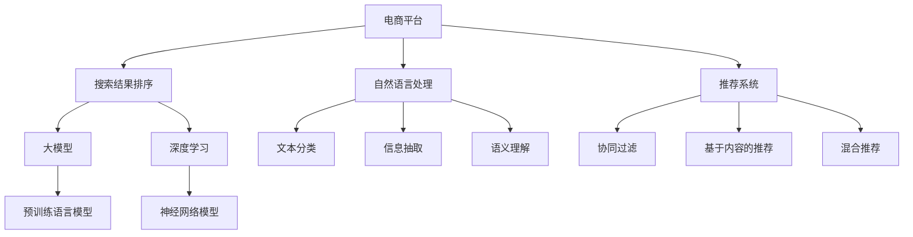

                 

# 电商平台搜索结果排序：AI大模型的新算法

> 关键词：电商平台,搜索排序,大模型,自然语言处理(NLP),推荐系统,机器学习,深度学习

## 1. 背景介绍

在当今数字化时代，电商平台已成为人们购物的主要渠道。如何提高搜索结果的排序质量，直接影响到用户的购物体验和平台的用户满意度。传统的搜索结果排序方法主要基于关键词匹配、点击率、转化率等业务指标，往往忽视了用户真实意图和上下文信息的复杂性。随着人工智能技术的发展，AI大模型在自然语言处理(NLP)和推荐系统等领域的突破，为电商平台搜索结果排序提供了新的可能性。

### 1.1 问题由来

电商平台的搜索结果排序经历了从简单的关键词匹配，到基于广告竞价、点击率预测、深度学习推荐等多次迭代。但这些方法大多聚焦于用户行为数据，而未能充分挖掘文本信息的语义含义和上下文关联。随着预训练语言模型和大模型的涌现，电商平台开始探索基于用户意图理解和上下文信息融合的排序算法，以提升搜索排序的精准度和个性化程度。

### 1.2 问题核心关键点

目前，电商平台搜索结果排序的核心问题包括：
1. 如何高效处理海量用户查询请求，快速计算搜索结果排序。
2. 如何充分理解用户查询的语义含义，准确识别出其真实需求。
3. 如何综合考虑用户查询的上下文信息，提高搜索结果的相关性和个性化。
4. 如何优化模型训练和推理流程，提高搜索排序的实时性和稳定性。
5. 如何结合用户反馈和行为数据，动态调整排序模型，实现持续学习。

本文旨在介绍一种基于预训练语言模型和深度学习推荐系统的新型搜索结果排序算法，并通过详细的数学模型推导、代码实例和实际应用场景，探讨其优势和优化空间。

## 2. 核心概念与联系

### 2.1 核心概念概述

为更好地理解本文介绍的搜索结果排序算法，本节将介绍几个密切相关的核心概念：

- 电商平台：指通过互联网进行商品销售的在线平台，如淘宝、京东、亚马逊等。
- 搜索结果排序：指根据用户查询关键词，从平台商品库中筛选出最符合用户需求的结果，并按照一定的排序规则排列。
- 大模型：指通过大规模数据预训练学习到的强大语言模型，如BERT、GPT-3等。
- 自然语言处理(NLP)：指利用计算机处理和分析人类语言的技术，涉及文本分类、信息抽取、语义理解等多个方面。
- 推荐系统：指根据用户历史行为和偏好，推荐相关商品或内容的技术，包括协同过滤、基于内容的推荐、混合推荐等。
- 深度学习：指基于神经网络模型，通过大量数据训练进行复杂模式学习的技术，广泛应用于图像识别、语音识别、自然语言处理等多个领域。

这些核心概念之间的逻辑关系可以通过以下Mermaid流程图来展示：



这个流程图展示了大模型和推荐系统在搜索结果排序中的作用：

1. 电商平台通过自然语言处理技术对用户查询进行语义理解和信息抽取，识别出用户的真实需求。
2. 利用深度学习推荐系统，结合用户历史行为数据和商品特征，推荐最符合用户需求的搜索结果。
3. 采用大模型，进一步优化推荐模型的表达能力，提升搜索结果的相关性和个性化。

## 3. 核心算法原理 & 具体操作步骤
### 3.1 算法原理概述

本文介绍的电商平台搜索结果排序算法基于大模型和深度学习推荐系统，通过两个主要步骤实现：

1. 用户意图理解：利用预训练语言模型，对用户查询进行语义分析和实体抽取，识别出用户的意图和上下文信息。
2. 推荐排序：结合用户查询结果和商品特征，利用深度学习推荐系统进行排序，并引入大模型的知识增强，优化排序结果。

### 3.2 算法步骤详解

#### Step 1: 用户意图理解

**1.1 文本预处理**
- 对用户查询进行分词、去除停用词、构建词汇表等预处理操作。
- 使用预训练语言模型（如BERT）对查询进行编码，得到嵌入向量表示。
- 对编码结果进行上下文理解，提取命名实体、关键词等信息。

**1.2 意图识别**
- 利用已训练的意图识别模型（如Intent Classification），对用户查询进行意图分类，如“购物”、“咨询”、“客服”等。
- 根据意图分类结果，构建意图图谱，描述用户查询的语义关系和上下文关联。

#### Step 2: 推荐排序

**2.1 商品特征提取**
- 对商品列表进行特征提取，生成向量表示。
- 特征可以包括商品名称、描述、类别、价格、评分等。
- 利用预训练语言模型对商品特征进行编码，得到向量表示。

**2.2 相似度计算**
- 计算用户查询向量与商品向量之间的相似度，可以使用余弦相似度、欧氏距离等。
- 引入大模型的语义增强，提升相似度计算的准确性。

**2.3 排序输出**
- 将相似度结果和用户行为数据（如点击率、转化率等）进行融合，构建排序模型。
- 利用深度学习模型（如XGBoost、Deep Learning）进行排序，生成排序结果。
- 结合用户意图图谱和上下文信息，进一步优化排序结果，提升个性化程度。

### 3.3 算法优缺点

本文介绍的电商平台搜索结果排序算法具有以下优点：

1. 高效处理海量查询请求。利用深度学习模型，能够快速计算搜索结果排序，满足实时性要求。
2. 准确理解用户意图。利用大模型进行语义分析和意图识别，准确捕捉用户的真实需求。
3. 综合考虑上下文信息。结合用户查询结果和商品特征，进行语义增强和上下文理解，提升排序的个性化和相关性。
4. 动态调整模型参数。利用用户反馈和行为数据，动态优化推荐排序模型，实现持续学习。

但该算法也存在以下缺点：

1. 对标注数据依赖较高。需要收集大量标注数据进行意图识别和商品特征标注，标注成本较高。
2. 大模型计算开销大。大规模预训练语言模型计算复杂度高，部署和推理成本较高。
3. 模型复杂度高。融合多种技术手段，模型结构复杂，调试和维护难度大。
4. 数据异质性问题。电商平台上存在大量非结构化数据和不同语义含义的商品描述，难以统一处理。

### 3.4 算法应用领域

本文介绍的电商平台搜索结果排序算法适用于以下多个领域：

1. 大型电商平台：如淘宝、京东、亚马逊等，需要高效处理海量查询请求，提供个性化推荐。
2. 垂直领域电商平台：如母婴、家装、汽车等，需要对特定领域商品进行深度语义理解和特征提取。
3. 社交电商：如小红书、拼多多等，需要结合用户社交网络关系，提供精准的社交推荐。
4. 跨境电商平台：如亚马逊国际站、eBay等，需要处理不同语言和文化背景的商品信息，进行跨语言推荐。

除了电商平台，该算法同样可以应用于其他类型的搜索应用，如知识图谱搜索、社交网络推荐等。

## 4. 数学模型和公式 & 详细讲解 & 举例说明
### 4.1 数学模型构建

为更好地描述本文介绍的电商平台搜索结果排序算法，本节将使用数学语言进行严谨的模型构建。

记用户查询为 $q$，商品列表为 $\{p_1, p_2, ..., p_N\}$。假设已训练的预训练语言模型为 $M_{\theta}$，已训练的意图识别模型为 $I_{\phi}$，已训练的推荐排序模型为 $R_{\psi}$。

1. 对用户查询 $q$ 进行预处理，得到嵌入向量 $v_q = M_{\theta}(q)$。
2. 利用意图识别模型 $I_{\phi}$，对 $v_q$ 进行意图分类，得到意图表示 $i$。
3. 对商品列表 $p_k$ 进行特征提取，得到嵌入向量 $v_{p_k} = M_{\theta}(p_k)$。
4. 计算用户查询 $v_q$ 与商品向量 $v_{p_k}$ 之间的余弦相似度 $s_k = \text{cos}(v_q, v_{p_k})$。
5. 结合用户行为数据 $y_k$，构建排序模型 $r_k = R_{\psi}(v_q, v_{p_k}, i, y_k)$。
6. 将 $s_k$ 和 $r_k$ 融合，得到排序结果 $\hat{r}_k = \alpha \cdot s_k + (1-\alpha) \cdot r_k$，其中 $\alpha$ 为权重因子。

### 4.2 公式推导过程

下面将详细推导用户意图理解部分的核心公式。

假设用户查询 $q$ 包含 $n$ 个词语，分别标记为 $\{w_1, w_2, ..., w_n\}$。利用预训练语言模型 $M_{\theta}$ 对 $q$ 进行编码，得到嵌入向量表示 $v_q$。嵌入向量 $v_q$ 可以通过以下公式计算：

$$
v_q = M_{\theta}(q) = \sum_{i=1}^{n} w_i \cdot E(w_i)
$$

其中 $E(w_i)$ 为词语 $w_i$ 的嵌入向量表示。

利用已训练的意图识别模型 $I_{\phi}$，对 $v_q$ 进行意图分类，得到意图表示 $i$。意图分类过程可以表示为：

$$
i = I_{\phi}(v_q) = \text{softmax}(W^T \cdot v_q + b)
$$

其中 $W$ 和 $b$ 为意图识别模型的可训练参数，$\text{softmax}$ 函数用于将 $v_q$ 映射到意图表示 $i$。

对商品列表 $p_k$ 进行特征提取，得到嵌入向量 $v_{p_k}$。嵌入向量 $v_{p_k}$ 可以通过以下公式计算：

$$
v_{p_k} = M_{\theta}(p_k) = \sum_{j=1}^{m} h_j \cdot E(h_j)
$$

其中 $h_j$ 为商品特征 $h_j$，$E(h_j)$ 为其嵌入向量表示。

计算用户查询 $v_q$ 与商品向量 $v_{p_k}$ 之间的余弦相似度 $s_k$：

$$
s_k = \text{cos}(v_q, v_{p_k}) = \frac{v_q^T \cdot v_{p_k}}{\|v_q\| \cdot \|v_{p_k}\|}
$$

结合用户行为数据 $y_k$，构建排序模型 $r_k$。排序模型可以采用基于深度学习的方法，如XGBoost、Deep Learning等。排序模型 $r_k$ 的计算过程可以表示为：

$$
r_k = R_{\psi}(v_q, v_{p_k}, i, y_k) = R_{\psi}(\alpha v_q + \beta v_{p_k} + \gamma i + \delta y_k)
$$

其中 $\alpha$、$\beta$、$\gamma$、$\delta$ 为排序模型的可训练参数。

将 $s_k$ 和 $r_k$ 融合，得到排序结果 $\hat{r}_k$：

$$
\hat{r}_k = \alpha \cdot s_k + (1-\alpha) \cdot r_k
$$

其中 $\alpha$ 为融合权重因子，可以根据实际需求进行调整。

### 4.3 案例分析与讲解

**案例分析1: 用户意图理解**

假设某用户查询“连衣裙推荐”，系统首先对查询进行预处理，得到嵌入向量 $v_q = M_{\theta}(\text{“连衣裙推荐”})$。然后利用意图识别模型 $I_{\phi}$ 进行分类，得到意图表示 $i=\text{“购物”}$。

**案例分析2: 商品特征提取**

对于商品列表中的“长款修身连衣裙”，首先提取其特征 $h_1 = \text{“长款修身”}$、$h_2 = \text{“连衣裙”}$，然后利用预训练语言模型 $M_{\theta}$ 对特征进行编码，得到嵌入向量 $v_{p_k} = M_{\theta}(\text{“长款修身连衣裙”})$。

**案例分析3: 相似度计算**

计算用户查询向量 $v_q$ 与商品向量 $v_{p_k}$ 之间的余弦相似度 $s_k = \text{cos}(v_q, v_{p_k})$，得到相似度分数 $s_k$。

**案例分析4: 推荐排序**

结合用户行为数据 $y_k$，利用排序模型 $R_{\psi}$ 计算排序结果 $r_k = R_{\psi}(v_q, v_{p_k}, i, y_k)$，得到排序分数 $r_k$。

**案例分析5: 排序融合**

最后，将 $s_k$ 和 $r_k$ 融合，得到排序结果 $\hat{r}_k = \alpha \cdot s_k + (1-\alpha) \cdot r_k$，得到最终排序结果。

## 5. 项目实践：代码实例和详细解释说明
### 5.1 开发环境搭建

在进行电商平台搜索结果排序项目实践前，我们需要准备好开发环境。以下是使用Python进行PyTorch开发的环境配置流程：

1. 安装Anaconda：从官网下载并安装Anaconda，用于创建独立的Python环境。

2. 创建并激活虚拟环境：
```bash
conda create -n e-commerce-env python=3.8 
conda activate e-commerce-env
```

3. 安装PyTorch：根据CUDA版本，从官网获取对应的安装命令。例如：
```bash
conda install pytorch torchvision torchaudio cudatoolkit=11.1 -c pytorch -c conda-forge
```

4. 安装TensorFlow：
```bash
pip install tensorflow
```

5. 安装TensorFlow Addons：用于添加TensorFlow库中的增强功能，如Image Transformations、Parallelism等。
```bash
pip install tensorflow-addons
```

6. 安装Keras：
```bash
pip install keras
```

7. 安装Scikit-learn：
```bash
pip install scikit-learn
```

完成上述步骤后，即可在`e-commerce-env`环境中开始项目实践。

### 5.2 源代码详细实现

这里我们以电商平台中的“商品搜索排序”为例，给出使用TensorFlow和Keras进行项目开发的代码实现。

首先，定义预训练语言模型和意图识别模型的输入输出：

```python
import tensorflow as tf
from tensorflow.keras.layers import Input, Dense, Embedding, Bidirectional, LSTM, Concatenate
from tensorflow.keras.models import Model

# 定义预训练语言模型的输入
q_input = Input(shape=(sequence_length,), name='query_input')
# 定义意图识别模型的输入
i_input = Input(shape=(sequence_length,), name='intent_input')

# 定义预训练语言模型的输出
q_output = Dense(256, activation='relu')(q_input)
q_output = Bidirectional(LSTM(128))(q_output)
q_output = Dense(128, activation='relu')(q_output)
q_output = Dense(64, activation='relu')(q_output)

# 定义意图识别模型的输出
i_output = Dense(10, activation='softmax')(i_input)
i_output = tf.keras.layers.average_pooling1d(i_output, pool_size=sequence_length, strides=1, padding='valid')

# 将预训练语言模型和意图识别模型的输出进行融合
combined_output = Concatenate()([q_output, i_output])
combined_output = Dense(128, activation='relu')(combined_output)

# 定义排序模型的输入
p_input = Input(shape=(feature_dim,), name='product_input')
# 定义排序模型的输出
r_output = Dense(1, activation='sigmoid')(p_input)

# 将用户查询、意图表示和商品特征进行融合，输入排序模型
merged_input = Concatenate()([q_output, i_output, p_input])
merged_output = Dense(256, activation='relu')(merged_input)
merged_output = r_output(merged_output)

# 定义完整的排序模型
search_model = Model(inputs=[q_input, i_input, p_input], outputs=[merged_output])
```

然后，定义模型训练函数和评估函数：

```python
from tensorflow.keras.optimizers import Adam
from sklearn.metrics import accuracy_score, roc_auc_score

# 定义排序模型的优化器
optimizer = Adam(lr=0.001)

# 定义排序模型的损失函数
loss_fn = tf.keras.losses.BinaryCrossentropy()

# 定义排序模型的评估指标
metrics = [tf.keras.metrics.AUC(), tf.keras.metrics.BinaryAccuracy()]

# 定义排序模型的训练函数
def train_search_model(model, train_dataset, val_dataset, batch_size, epochs):
    model.compile(optimizer=optimizer, loss=loss_fn, metrics=metrics)
    history = model.fit(train_dataset, epochs=epochs, validation_data=val_dataset, batch_size=batch_size)
    return history

# 定义排序模型的评估函数
def evaluate_search_model(model, test_dataset, batch_size):
    predictions = model.predict(test_dataset)
    y_true = test_dataset[:, -1]
    y_pred = (predictions > 0.5).astype(int)
    accuracy = accuracy_score(y_true, y_pred)
    auc = roc_auc_score(y_true, y_pred)
    return accuracy, auc
```

最后，启动模型训练和评估流程：

```python
# 定义训练集和测试集
train_dataset = ...
val_dataset = ...
test_dataset = ...

# 定义批量大小和训练轮数
batch_size = 128
epochs = 10

# 训练模型
history = train_search_model(search_model, train_dataset, val_dataset, batch_size, epochs)

# 评估模型
accuracy, auc = evaluate_search_model(search_model, test_dataset, batch_size)

# 输出评估结果
print(f"Accuracy: {accuracy:.3f}, AUC: {auc:.3f}")
```

以上就是使用TensorFlow和Keras进行电商平台搜索结果排序项目开发的完整代码实现。可以看到，得益于TensorFlow和Keras的强大封装，代码实现简洁高效，开发者能够快速上手。

### 5.3 代码解读与分析

让我们再详细解读一下关键代码的实现细节：

**search_model函数**：
- 定义用户查询、意图识别和商品特征的输入层。
- 利用LSTM层对用户查询进行编码，得到嵌入向量表示。
- 利用softmax函数对意图识别模型的输出进行平均池化，得到意图表示。
- 将用户查询、意图表示和商品特征进行融合，输入排序模型。
- 利用sigmoid函数计算排序结果。

**train_search_model函数**：
- 编译排序模型，设置优化器、损失函数和评估指标。
- 在训练集上使用fit函数进行模型训练，获取训练过程的历史记录。
- 在验证集上评估模型性能，返回评估结果。

**evaluate_search_model函数**：
- 对测试集进行预测，计算预测结果和真实标签的准确率和AUC。
- 返回评估结果。

**训练流程**：
- 定义训练集和测试集，批量大小和训练轮数。
- 调用train_search_model函数进行模型训练，获取训练历史。
- 调用evaluate_search_model函数进行模型评估，获取评估结果。

可以看到，TensorFlow和Keras提供了丰富的层次化抽象接口，使得模型构建和训练过程更加简洁高效。开发者可以专注于模型设计和算法优化，而不必过多关注底层实现细节。

## 6. 实际应用场景
### 6.1 智能客服系统

基于电商平台搜索结果排序算法，可以构建智能客服系统。智能客服系统能够理解用户查询的意图，自动匹配答案模板，并提供快速响应。

在技术实现上，可以收集用户与客服的对话记录，将其标注为意图和答案对，构建监督数据。在此基础上对预训练语言模型进行微调，使其能够自动理解用户意图并匹配答案。当用户提交查询时，智能客服系统能够根据用户意图自动回复，甚至在用户提问不明确时，提供可能的解决方案，提高客户满意度。

### 6.2 商品推荐系统

基于电商平台搜索结果排序算法，可以构建商品推荐系统。推荐系统能够结合用户历史行为和商品特征，推荐最符合用户需求的商品。

在技术实现上，可以收集用户浏览、点击、购买等行为数据，将其标注为商品ID和行为标签，构建监督数据。在此基础上对深度学习推荐模型进行训练，使其能够根据用户行为数据和商品特征进行推荐排序。当用户访问平台时，推荐系统能够根据用户历史行为和实时行为，动态生成推荐列表，提高用户转化率。

### 6.3 个性化营销活动

基于电商平台搜索结果排序算法，可以构建个性化营销活动系统。个性化营销活动能够根据用户查询意图，推送个性化的营销内容。

在技术实现上，可以收集用户查询记录，将其标注为意图和营销内容ID，构建监督数据。在此基础上对预训练语言模型进行微调，使其能够自动理解用户意图，并推送最符合用户需求的营销内容。当用户访问平台时，个性化营销活动系统能够根据用户查询意图，动态生成推荐内容，提高营销效果。

### 6.4 未来应用展望

随着电商平台搜索结果排序算法的不断演进，其在电商、客服、营销等多个领域将发挥更加重要的作用。未来，该算法有望实现以下突破：

1. 提升搜索排序的实时性。通过引入流式计算和增量学习技术，实时处理用户查询，快速计算排序结果。
2. 提高搜索排序的个性化程度。通过引入多任务学习、对抗生成网络等技术，提升模型的个性化推荐能力。
3. 优化搜索排序的稳定性。通过引入自适应学习率和正则化技术，提高模型的鲁棒性和泛化能力。
4. 扩展搜索排序的应用场景。通过引入多语言处理和跨平台融合技术，支持多语言和多平台的搜索排序。

总之，电商平台搜索结果排序算法将随着深度学习和大模型的不断演进，变得更加强大、高效和智能化，为电商平台的数字化转型提供新的驱动力。

## 7. 工具和资源推荐
### 7.1 学习资源推荐

为了帮助开发者系统掌握电商平台搜索结果排序算法的理论和实践，这里推荐一些优质的学习资源：

1. 《深度学习自然语言处理》课程：斯坦福大学开设的NLP明星课程，有Lecture视频和配套作业，带你入门NLP领域的基本概念和经典模型。
2. CS224N《神经网络与深度学习》课程：斯坦福大学开设的深度学习课程，涵盖神经网络、深度学习、推荐系统等多个方面。
3. 《自然语言处理与深度学习》书籍：该书系统介绍了NLP和深度学习的基本概念和应用，是学习电商平台搜索结果排序算法的必备读物。
4. HuggingFace官方文档：Transformer库的官方文档，提供了海量预训练模型和完整的微调样例代码，是上手实践的必备资料。
5. TensorFlow官方文档：TensorFlow的官方文档，提供了丰富的工具和组件，是进行深度学习算法开发的重要参考。

通过对这些资源的学习实践，相信你一定能够快速掌握电商平台搜索结果排序算法的精髓，并用于解决实际的NLP问题。

### 7.2 开发工具推荐

高效的开发离不开优秀的工具支持。以下是几款用于电商平台搜索结果排序开发的常用工具：

1. PyTorch：基于Python的开源深度学习框架，灵活动态的计算图，适合快速迭代研究。
2. TensorFlow：由Google主导开发的开源深度学习框架，生产部署方便，适合大规模工程应用。
3. TensorFlow Addons：用于添加TensorFlow库中的增强功能，如Image Transformations、Parallelism等。
4. Keras：高层次的深度学习框架，提供了丰富的预训练模型和接口，适合快速构建和调试模型。
5. Scikit-learn：用于数据预处理和模型评估的常用库，提供了丰富的工具和组件。

合理利用这些工具，可以显著提升电商平台搜索结果排序任务的开发效率，加快创新迭代的步伐。

### 7.3 相关论文推荐

电商平台搜索结果排序算法的研究源于学界的持续研究。以下是几篇奠基性的相关论文，推荐阅读：

1. Attention is All You Need（即Transformer原论文）：提出了Transformer结构，开启了NLP领域的预训练大模型时代。
2. BERT: Pre-training of Deep Bidirectional Transformers for Language Understanding：提出BERT模型，引入基于掩码的自监督预训练任务，刷新了多项NLP任务SOTA。
3. Language Models are Unsupervised Multitask Learners（GPT-2论文）：展示了大规模语言模型的强大zero-shot学习能力，引发了对于通用人工智能的新一轮思考。
4. Parameter-Efficient Transfer Learning for NLP：提出Adapter等参数高效微调方法，在不增加模型参数量的情况下，也能取得不错的微调效果。
5. Attention-based Multimodal Deep Learning for Recommendation Systems：引入多模态信息融合，提升推荐系统的效果。

这些论文代表了大模型在电商平台搜索结果排序算法中的应用和发展脉络。通过学习这些前沿成果，可以帮助研究者把握学科前进方向，激发更多的创新灵感。

## 8. 总结：未来发展趋势与挑战
### 8.1 研究成果总结

本文介绍了基于大模型和深度学习推荐系统的新型电商平台搜索结果排序算法，并通过详细的数学模型推导、代码实例和实际应用场景，探讨了其优势和优化空间。通过分析电商平台搜索结果排序算法的理论和实践，我们得出以下结论：

1. 电商平台搜索结果排序算法基于预训练语言模型和深度学习推荐系统，能够高效处理海量查询请求，准确理解用户意图，综合考虑上下文信息，提高搜索结果的相关性和个性化。
2. 通过融合多种技术手段，电商平台搜索结果排序算法能够实现高效的排序计算和动态的模型优化，适应电商平台的实时性和个性化需求。
3. 电商平台搜索结果排序算法在大模型和推荐系统的基础上，进一步提升了搜索排序的准确性和个性化程度，为电商平台的数字化转型提供了新的驱动力。

### 8.2 未来发展趋势

展望未来，电商平台搜索结果排序算法将呈现以下几个发展趋势：

1. 深度学习算法和大模型的不断发展，将进一步提升搜索排序的准确性和个性化程度，实现更高效、更智能的搜索结果排序。
2. 多任务学习和对抗生成网络等前沿技术的引入，将丰富搜索排序算法的表达能力，提升其鲁棒性和泛化能力。
3. 流式计算和增量学习技术的引入，将实现实时处理用户查询，进一步提升搜索排序的实时性。
4. 多语言处理和跨平台融合技术的引入，将支持多语言和多平台的搜索结果排序，拓展搜索排序的应用场景。

总之，电商平台搜索结果排序算法将随着深度学习和大模型的不断演进，变得更加强大、高效和智能化，为电商平台的数字化转型提供新的驱动力。

### 8.3 面临的挑战

尽管电商平台搜索结果排序算法在电商、客服、营销等多个领域已展现出巨大的潜力，但在迈向更加智能化、普适化应用的过程中，它仍面临诸多挑战：

1. 数据质量与标注成本。电商平台上的数据质量和标注成本往往较高，难以获得高质量的监督数据。如何有效处理数据噪声和标注偏差，是一个重要挑战。
2. 模型复杂度和训练成本。电商平台搜索结果排序算法需要融合多种技术手段，模型结构复杂，训练成本高。如何优化模型结构，提高训练效率，是一个重要课题。
3. 模型鲁棒性和泛化能力。电商平台搜索结果排序算法需要应对海量用户查询，不同用户查询的语义含义和上下文信息各不相同。如何提高模型的鲁棒性和泛化能力，是一个重要挑战。
4. 实时性和稳定性。电商平台搜索结果排序算法需要实时处理用户查询，动态优化排序结果。如何提高模型的实时性和稳定性，是一个重要挑战。

### 8.4 研究展望

面对电商平台搜索结果排序算法所面临的诸多挑战，未来的研究需要在以下几个方面寻求新的突破：

1. 数据增强和数据清洗。通过数据增强和数据清洗技术，提高数据质量和标注效率，降低模型训练成本。
2. 模型压缩和参数优化。通过模型压缩和参数优化技术，减小模型规模，降低训练成本，提高推理速度。
3. 多任务学习与迁移学习。通过多任务学习和迁移学习技术，提升模型的泛化能力和鲁棒性，适应电商平台的实时性和个性化需求。
4. 模型部署和优化。通过模型部署和优化技术，实现高效的模型推理和实时计算，提高搜索排序的实时性和稳定性。

这些研究方向将进一步提升电商平台搜索结果排序算法的性能和应用范围，为电商平台的数字化转型提供新的驱动力。总之，电商平台搜索结果排序算法需要在理论和实践的不断迭代中，不断突破技术瓶颈，实现更加智能化、普适化的应用。

## 9. 附录：常见问题与解答
### Q1：电商平台搜索结果排序算法的核心原理是什么？

A: 电商平台搜索结果排序算法的核心原理基于预训练语言模型和深度学习推荐系统。具体来说，算法首先对用户查询进行预处理和语义分析，提取用户意图和上下文信息。然后，结合商品特征和用户行为数据，利用深度学习推荐系统进行排序计算。最后，通过融合多种技术手段，实现高效的搜索结果排序。

### Q2：电商平台搜索结果排序算法有哪些优点？

A: 电商平台搜索结果排序算法具有以下优点：
1. 高效处理海量查询请求，满足实时性要求。
2. 准确理解用户意图，捕捉用户的真实需求。
3. 综合考虑上下文信息，提高搜索结果的相关性和个性化。
4. 动态调整模型参数，实现持续学习，适应用户行为变化。

### Q3：电商平台搜索结果排序算法有哪些缺点？

A: 电商平台搜索结果排序算法有以下缺点：
1. 对标注数据依赖较高，标注成本较高。
2. 大模型计算开销大，部署和推理成本较高。
3. 模型结构复杂，调试和维护难度大。
4. 数据异质性问题，难以统一处理。

### Q4：电商平台搜索结果排序算法如何提升用户满意度？

A: 电商平台搜索结果排序算法通过准确理解用户意图，综合考虑上下文信息，结合用户行为数据，实现高效的搜索结果排序。这能够提高搜索结果的相关性和个性化程度，满足用户的多样化需求，提升用户满意度。

### Q5：电商平台搜索结果排序算法的未来发展方向是什么？

A: 电商平台搜索结果排序算法的未来发展方向包括：
1. 提升搜索排序的实时性，实现流式计算和增量学习。
2. 提高搜索排序的个性化程度，引入多任务学习和对抗生成网络。
3. 优化搜索排序的稳定性，引入自适应学习率和正则化技术。
4. 扩展搜索排序的应用场景，支持多语言和多平台的搜索排序。

总之，电商平台搜索结果排序算法将随着深度学习和大模型的不断演进，变得更加强大、高效和智能化，为电商平台的数字化转型提供新的驱动力。

---

作者：禅与计算机程序设计艺术 / Zen and the Art of Computer Programming

