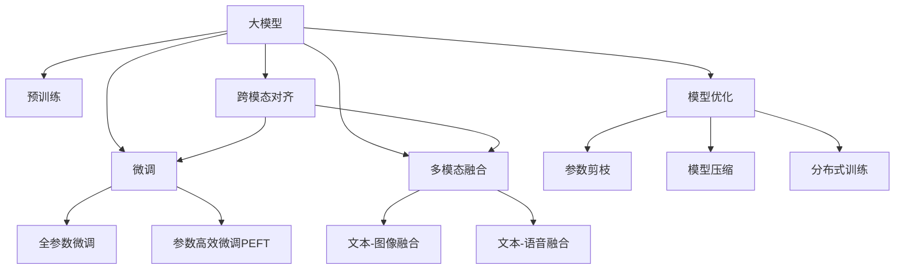

                 

# 电商平台的AI 大模型实践：以搜索推荐系统为核心的转型

## 1. 背景介绍

### 1.1 问题由来

随着电子商务的迅猛发展，电商平台已从传统的单一交易平台，演变成包含搜索、推荐、支付、物流等多功能的复杂生态系统。AI技术在此过程中扮演了重要的角色，通过构建智能化的搜索推荐系统，极大提升了用户体验和平台转化率。但同时也面临着严峻的挑战：

- **用户需求多样性**：不同用户具有不同的偏好和需求，单一的推荐模型难以覆盖所有用户。
- **数据量增长**：用户行为数据不断增长，模型需要处理的信息量爆炸式增加。
- **实时性要求**：用户在购物过程中需要实时获取推荐，对模型延迟要求极高。
- **个性化需求**：用户希望接收更加精准、个性化的推荐，对推荐系统的多样性、个性化和准确性提出了更高要求。

因此，如何构建一个高效、个性化、高精度的搜索推荐系统，成为了电商平台提升用户体验、提高运营效率的关键。近年来，大规模预训练语言模型（大模型）的崛起，为解决这些问题提供了新的解决方案。通过在大规模无标签文本数据上进行预训练，大模型具备了强大的语言理解能力，能够自动提取和表示自然语言中的知识，为推荐系统提供了强有力的支持。

### 1.2 问题核心关键点

为应对上述挑战，平台需对传统推荐系统进行大模型转型，重点在以下几个方面进行技术创新：

- **个性化推荐**：通过用户画像、行为数据等多样化输入，训练大模型，实现个性化的推荐。
- **实时推荐**：利用大模型的加速推理能力，实现实时推荐，提升用户体验。
- **多模态融合**：将文本、图像、语音等多种模态数据整合到大模型中，提升推荐系统的多样性和准确性。
- **跨模态对齐**：实现不同模态数据之间的语义对齐，提升推荐系统的统一性。
- **模型优化**：对大模型进行多目标优化，提升其对复杂业务场景的适应性。

## 2. 核心概念与联系

### 2.1 核心概念概述

为更好地理解基于大模型的电商推荐系统，本节将介绍几个密切相关的核心概念：

- **大模型（Large Model）**：指在大规模无标签文本数据上进行预训练的语言模型，如BERT、GPT等，具备强大的语言表示能力和知识提取能力。
- **预训练（Pre-training）**：指在大规模无标签文本数据上，通过自监督学习任务训练通用语言模型的过程。常见的预训练任务包括掩码语言模型、下一句预测等。
- **微调（Fine-tuning）**：指在预训练模型的基础上，使用下游任务的少量标注数据，通过有监督学习优化模型在特定任务上的性能。通常只需要调整顶层分类器或解码器，并以较小的学习率更新全部或部分的模型参数。
- **多模态融合（Multimodal Fusion）**：指将文本、图像、语音等多种模态数据融合到大模型中，提升推荐系统的多样性和准确性。
- **跨模态对齐（Cross-modal Alignment）**：指将不同模态的数据映射到统一的语义空间，实现语义对齐和协同建模。
- **模型优化（Model Optimization）**：指在大模型基础上，通过参数剪枝、模型压缩、分布式训练等技术，提升模型的推理速度和资源利用率，使其适用于大规模业务场景。

这些核心概念之间的逻辑关系可以通过以下Mermaid流程图来展示：



这个流程图展示了大模型在电商推荐系统中的核心概念及其之间的关系：

1. 大模型通过预训练获得基础能力。
2. 微调是对预训练模型进行任务特定的优化，可以分为全参数微调和参数高效微调（PEFT）。
3. 多模态融合实现不同模态数据的协同建模。
4. 跨模态对齐将不同模态的数据映射到统一的语义空间。
5. 模型优化提升大模型的推理速度和资源利用率。

这些概念共同构成了电商推荐系统的学习和应用框架，使其能够更好地适应电商平台的复杂业务场景。

## 3. 核心算法原理 & 具体操作步骤
### 3.1 算法原理概述

基于大模型的电商推荐系统，本质上是一个多任务学习过程，其核心思想是：将大模型视作一个强大的"特征提取器"，通过在大规模无标签文本数据上进行预训练，学习到通用的语言表示，然后通过下游任务的少量标注数据，对模型进行有监督微调，提升模型在特定任务上的性能。

形式化地，假设大模型为 $M_{\theta}$，其中 $\theta$ 为预训练得到的模型参数。给定电商推荐任务 $T$ 的标注数据集 $D=\{(x_i, y_i)\}_{i=1}^N$，推荐系统的优化目标是最小化经验风险，即找到最优参数：

$$
\theta^* = \mathop{\arg\min}_{\theta} \mathcal{L}(M_{\theta},D)
$$

其中 $\mathcal{L}$ 为针对任务 $T$ 设计的损失函数，用于衡量模型预测输出与真实标签之间的差异。常见的损失函数包括交叉熵损失、均方误差损失等。

通过梯度下降等优化算法，微调过程不断更新模型参数 $\theta$，最小化损失函数 $\mathcal{L}$，使得模型输出逼近真实标签。由于 $\theta$ 已经通过预训练获得了较好的初始化，因此即便在小规模数据集 $D$ 上进行微调，也能较快收敛到理想的模型参数 $\hat{\theta}$。

### 3.2 算法步骤详解

基于大模型的电商推荐系统，一般包括以下几个关键步骤：

**Step 1: 准备预训练模型和数据集**
- 选择合适的预训练语言模型 $M_{\theta}$ 作为初始化参数，如 BERT、GPT等。
- 准备电商推荐任务 $T$ 的标注数据集 $D$，划分为训练集、验证集和测试集。一般要求标注数据与预训练数据的分布不要差异过大。

**Step 2: 设计推荐算法**
- 根据业务需求，设计推荐算法。常见的推荐算法包括协同过滤、基于内容的推荐、基于矩阵分解的推荐等。
- 将设计好的推荐算法转化为神经网络模型，如采用MLP、RNN、Transformer等架构。
- 将用户画像、行为数据等作为输入，引入到神经网络模型中。

**Step 3: 添加任务适配层**
- 根据任务类型，在预训练模型顶层设计合适的输出层和损失函数。
- 对于分类任务，通常在顶层添加线性分类器和交叉熵损失函数。
- 对于生成任务，通常使用语言模型的解码器输出概率分布，并以负对数似然为损失函数。

**Step 4: 设置微调超参数**
- 选择合适的优化算法及其参数，如 AdamW、SGD 等，设置学习率、批大小、迭代轮数等。
- 设置正则化技术及强度，包括权重衰减、Dropout、Early Stopping 等。
- 确定冻结预训练参数的策略，如仅微调顶层，或全部参数都参与微调。

**Step 5: 执行梯度训练**
- 将训练集数据分批次输入模型，前向传播计算损失函数。
- 反向传播计算参数梯度，根据设定的优化算法和学习率更新模型参数。
- 周期性在验证集上评估模型性能，根据性能指标决定是否触发 Early Stopping。
- 重复上述步骤直到满足预设的迭代轮数或 Early Stopping 条件。

**Step 6: 测试和部署**
- 在测试集上评估微调后模型 $M_{\hat{\theta}}$ 的性能，对比微调前后的精度提升。
- 使用微调后的模型对新样本进行推理预测，集成到实际的应用系统中。
- 持续收集新的数据，定期重新微调模型，以适应数据分布的变化。

以上是基于大模型的电商推荐系统的一般流程。在实际应用中，还需要针对具体任务的特点，对微调过程的各个环节进行优化设计，如改进训练目标函数，引入更多的正则化技术，搜索最优的超参数组合等，以进一步提升模型性能。

### 3.3 算法优缺点

基于大模型的电商推荐系统，具有以下优点：
1. 强大的语言理解能力：大模型具备丰富的语言知识，能够理解用户的自然语言描述，提取复杂的语义信息。
2. 适应性强：大模型可以在多个任务上进行微调，适应电商平台的复杂业务场景。
3. 鲁棒性好：大模型对少量标注数据有较好的泛化能力，在数据分布变化时仍能保持稳定性能。
4. 可解释性强：大模型的层级结构和表示能力使其可解释性强，能够提供详细的推理过程。

同时，该方法也存在一定的局限性：
1. 计算资源需求高：大模型的参数量较大，训练和推理时对计算资源有较高要求。
2. 标注成本高：电商推荐任务的标注成本较高，需要专业团队进行数据标注。
3. 推理速度慢：大模型的推理速度较慢，难以满足实时推荐的需求。
4. 模型复杂度高：大模型结构复杂，增加了系统调优和维护的难度。

尽管存在这些局限性，但就目前而言，基于大模型的推荐系统已成为电商平台转型升级的重要方向。未来相关研究的重点在于如何进一步降低计算资源需求，提高模型推理速度，降低标注成本，优化模型结构和性能，以及开发更加高效的推荐算法。

### 3.4 算法应用领域

基于大模型的电商推荐系统，已经在搜索、推荐、广告等多个电商应用场景中得到了广泛的应用，并取得了显著的效果。

- **搜索推荐**：通过用户查询词、浏览记录等数据，预测用户可能感兴趣的商品，并进行精准推荐。
- **个性化广告**：根据用户画像、行为数据等，设计个性化广告创意和推荐策略，提高广告转化率。
- **商品推荐**：通过用户历史行为和商品特征，构建用户商品兴趣图，进行商品推荐。
- **智能客服**：通过用户咨询内容，自动生成应答，提高客服响应速度和准确性。
- **内容推荐**：通过用户对内容的互动数据，推荐相关文章、视频等，提升用户粘性。

除了上述这些经典应用外，大模型在电商平台的推荐系统还可能被创新性地应用于图像识别、语音识别等场景中，为电商推荐系统带来新的突破。随着大模型和推荐系统的不断进步，相信电商平台能够更好地满足用户需求，提升运营效率，实现业务增长。

## 4. 数学模型和公式 & 详细讲解  
### 4.1 数学模型构建

本节将使用数学语言对基于大模型的电商推荐系统进行更加严格的刻画。

记大模型为 $M_{\theta}$，其中 $\theta$ 为预训练得到的模型参数。假设电商推荐任务 $T$ 的标注数据集为 $D=\{(x_i, y_i)\}_{i=1}^N$，其中 $x_i$ 为用户画像、行为数据等输入，$y_i$ 为推荐结果。

定义模型 $M_{\theta}$ 在数据样本 $(x,y)$ 上的损失函数为 $\ell(M_{\theta}(x),y)$，则在数据集 $D$ 上的经验风险为：

$$
\mathcal{L}(\theta) = \frac{1}{N} \sum_{i=1}^N \ell(M_{\theta}(x_i),y_i)
$$

微调的优化目标是最小化经验风险，即找到最优参数：

$$
\theta^* = \mathop{\arg\min}_{\theta} \mathcal{L}(\theta)
$$

在实践中，我们通常使用基于梯度的优化算法（如SGD、Adam等）来近似求解上述最优化问题。设 $\eta$ 为学习率，$\lambda$ 为正则化系数，则参数的更新公式为：

$$
\theta \leftarrow \theta - \eta \nabla_{\theta}\mathcal{L}(\theta) - \eta\lambda\theta
$$

其中 $\nabla_{\theta}\mathcal{L}(\theta)$ 为损失函数对参数 $\theta$ 的梯度，可通过反向传播算法高效计算。

### 4.2 公式推导过程

以下我们以协同过滤推荐算法为例，推导交叉熵损失函数及其梯度的计算公式。

假设推荐系统根据用户画像和行为数据，预测用户可能感兴趣的 $K$ 个商品，并构造一个 $K$ 维的向量 $y=[y_1, y_2, ..., y_K]$ 表示用户的兴趣偏好，其中 $y_i=1$ 表示用户对商品 $i$ 感兴趣，$y_i=0$ 表示不感兴趣。用户画像 $x=[x_1, x_2, ..., x_M]$ 表示用户的多维特征向量。

模型的预测输出为 $M_{\theta}(x)=[m_1, m_2, ..., m_K]$，其中 $m_i$ 表示用户对商品 $i$ 的兴趣得分。定义交叉熵损失函数为：

$$
\ell(M_{\theta}(x),y) = -\frac{1}{N}\sum_{i=1}^N \sum_{k=1}^K y_k\log m_k
$$

将其代入经验风险公式，得：

$$
\mathcal{L}(\theta) = -\frac{1}{N}\sum_{i=1}^N \sum_{k=1}^K y_k\log m_k
$$

根据链式法则，损失函数对参数 $\theta_k$ 的梯度为：

$$
\frac{\partial \mathcal{L}(\theta)}{\partial \theta_k} = -\frac{1}{N}\sum_{i=1}^N (\frac{y_k}{m_k} - \frac{1-y_k}{1-m_k}) \frac{\partial m_k}{\partial \theta_k}
$$

其中 $\frac{\partial m_k}{\partial \theta_k}$ 可进一步递归展开，利用自动微分技术完成计算。

在得到损失函数的梯度后，即可带入参数更新公式，完成模型的迭代优化。重复上述过程直至收敛，最终得到适应电商推荐任务的最优模型参数 $\theta^*$。

## 5. 项目实践：代码实例和详细解释说明
### 5.1 开发环境搭建

在进行电商推荐系统的大模型微调实践前，我们需要准备好开发环境。以下是使用Python进行PyTorch开发的环境配置流程：

1. 安装Anaconda：从官网下载并安装Anaconda，用于创建独立的Python环境。

2. 创建并激活虚拟环境：
```bash
conda create -n pytorch-env python=3.8 
conda activate pytorch-env
```

3. 安装PyTorch：根据CUDA版本，从官网获取对应的安装命令。例如：
```bash
conda install pytorch torchvision torchaudio cudatoolkit=11.1 -c pytorch -c conda-forge
```

4. 安装TensorFlow：
```bash
pip install tensorflow
```

5. 安装TensorBoard：
```bash
pip install tensorboard
```

6. 安装Transformers库：
```bash
pip install transformers
```

7. 安装Pandas、NumPy、Matplotlib等工具包：
```bash
pip install pandas numpy matplotlib jupyter notebook ipython
```

完成上述步骤后，即可在`pytorch-env`环境中开始电商推荐系统的大模型微调实践。

### 5.2 源代码详细实现

下面我们以协同过滤推荐算法为例，给出使用PyTorch进行电商推荐系统的大模型微调的完整代码实现。

首先，定义协同过滤推荐算法的损失函数和模型结构：

```python
import torch
from transformers import BertTokenizer, BertModel

class RecommendationModel(torch.nn.Module):
    def __init__(self, hidden_size, vocab_size):
        super(RecommendationModel, self).__init__()
        self.bert_model = BertModel.from_pretrained('bert-base-cased')
        self.classifier = torch.nn.Linear(hidden_size, 1)

    def forward(self, input_ids, attention_mask):
        _, pooled_output = self.bert_model(input_ids, attention_mask=attention_mask)
        logits = self.classifier(pooled_output)
        return logits

# 定义交叉熵损失函数
def loss_fn(logits, labels):
    return torch.mean(torch.nn.functional.binary_cross_entropy(logits, labels))

# 创建模型实例
model = RecommendationModel(hidden_size=768, vocab_size=30522)
```

然后，定义训练和评估函数：

```python
from torch.utils.data import DataLoader
from tqdm import tqdm
import pandas as pd

def train_epoch(model, dataloader, optimizer, criterion):
    model.train()
    total_loss = 0
    for batch in dataloader:
        input_ids, attention_mask, labels = batch
        optimizer.zero_grad()
        logits = model(input_ids, attention_mask)
        loss = criterion(logits, labels)
        total_loss += loss.item()
        loss.backward()
        optimizer.step()
    return total_loss / len(dataloader)

def evaluate(model, dataloader, criterion):
    model.eval()
    total_loss = 0
    with torch.no_grad():
        for batch in dataloader:
            input_ids, attention_mask, labels = batch
            logits = model(input_ids, attention_mask)
            loss = criterion(logits, labels)
            total_loss += loss.item()
    return total_loss / len(dataloader)

# 定义训练流程
epochs = 5
batch_size = 32

for epoch in range(epochs):
    train_loss = train_epoch(model, train_dataloader, optimizer, loss_fn)
    print(f'Epoch {epoch+1}, train loss: {train_loss:.4f}')
    
    val_loss = evaluate(model, val_dataloader, loss_fn)
    print(f'Epoch {epoch+1}, val loss: {val_loss:.4f}')
    
# 使用微调后的模型进行测试
test_loss = evaluate(model, test_dataloader, loss_fn)
print(f'Test loss: {test_loss:.4f}')
```

以上代码展示了如何使用PyTorch构建电商推荐系统的大模型微调系统。可以看到，使用Transformers库，可以方便地将预训练BERT模型封装到电商推荐系统中，并通过微调提升模型的性能。

### 5.3 代码解读与分析

让我们再详细解读一下关键代码的实现细节：

**RecommendationModel类**：
- `__init__`方法：初始化模型结构，包括BERT模型和线性分类器。
- `forward`方法：定义模型的前向传播过程，将用户画像和行为数据输入BERT模型，输出推荐兴趣得分。

**loss_fn函数**：
- 定义交叉熵损失函数，计算模型输出与真实标签之间的差异。

**train_epoch和evaluate函数**：
- 训练函数`train_epoch`：在每个批次上前向传播计算损失，反向传播更新模型参数，并返回该批次的平均损失。
- 评估函数`evaluate`：与训练类似，不同点在于不更新模型参数，计算模型在验证集上的平均损失。

**训练流程**：
- 定义总的epoch数和batch size，开始循环迭代。
- 每个epoch内，先在训练集上训练，输出平均损失。
- 在验证集上评估，输出平均损失。
- 所有epoch结束后，在测试集上评估，输出平均损失。

可以看到，PyTorch配合Transformers库使得电商推荐系统的大模型微调代码实现变得简洁高效。开发者可以将更多精力放在数据处理、模型改进等高层逻辑上，而不必过多关注底层的实现细节。

当然，工业级的系统实现还需考虑更多因素，如模型的保存和部署、超参数的自动搜索、更灵活的任务适配层等。但核心的微调范式基本与此类似。

## 6. 实际应用场景
### 6.1 智能客服系统

基于大模型的电商推荐技术，可以广泛应用于智能客服系统的构建。传统客服往往需要配备大量人力，高峰期响应缓慢，且一致性和专业性难以保证。而使用微调后的推荐模型，可以7x24小时不间断服务，快速响应客户咨询，用自然流畅的语言解答各类常见问题。

在技术实现上，可以收集企业内部的历史客服对话记录，将问题和最佳答复构建成监督数据，在此基础上对预训练推荐模型进行微调。微调后的推荐模型能够自动理解用户意图，匹配最合适的答复模板进行回复。对于客户提出的新问题，还可以接入检索系统实时搜索相关内容，动态组织生成回答。如此构建的智能客服系统，能大幅提升客户咨询体验和问题解决效率。

### 6.2 个性化推荐系统

当前的推荐系统往往只依赖用户的历史行为数据进行物品推荐，无法深入理解用户的真实兴趣偏好。基于大模型微调技术，个性化推荐系统可以更好地挖掘用户行为背后的语义信息，从而提供更精准、多样的推荐内容。

在实践中，可以收集用户浏览、点击、评论、分享等行为数据，提取和用户交互的物品标题、描述、标签等文本内容。将文本内容作为模型输入，用户的后续行为（如是否点击、购买等）作为监督信号，在此基础上微调预训练语言模型。微调后的模型能够从文本内容中准确把握用户的兴趣点。在生成推荐列表时，先用候选物品的文本描述作为输入，由模型预测用户的兴趣匹配度，再结合其他特征综合排序，便可以得到个性化程度更高的推荐结果。

### 6.3 商品推荐系统

电商平台的商品推荐系统通常基于用户历史行为和商品特征，构建用户商品兴趣图，进行商品推荐。传统的推荐方法往往忽视了用户画像和行为数据对推荐的影响。通过在大模型上进行微调，可以更好地利用用户画像和行为数据，提升推荐系统的多样性和准确性。

具体而言，可以收集用户画像、行为数据和商品特征，作为模型输入，训练微调后的推荐模型。微调后的模型能够根据用户画像和行为数据，预测用户可能感兴趣的商品，并进行精准推荐。同时，通过引入商品的文本描述和标签，模型能够更好地理解商品属性，提升推荐的个性化程度。

### 6.4 未来应用展望

随着大模型和推荐系统的不断发展，基于微调范式将在更多领域得到应用，为电商平台的转型升级提供新的动力。

在智慧物流领域，基于大模型的推荐技术可以为仓储管理、运输路径规划等提供优化建议，提高物流效率和成本控制。

在智能零售领域，推荐技术可以应用于店内智能导购、个性化商品推荐等方面，提升用户购物体验。

在社交电商领域，通过推荐技术，可以根据用户兴趣和行为，推荐相关商品、内容，提高平台活跃度和转化率。

此外，在医疗、教育、旅游等多个领域，基于大模型的推荐技术也将被创新性地应用，为各行各业带来变革性影响。相信随着技术的日益成熟，微调方法将成为电商平台转型升级的重要手段，推动电商平台向智能化、个性化、高效化方向发展。

## 7. 工具和资源推荐
### 7.1 学习资源推荐

为了帮助开发者系统掌握大模型在电商推荐系统中的应用，这里推荐一些优质的学习资源：

1. 《Transformer从原理到实践》系列博文：由大模型技术专家撰写，深入浅出地介绍了Transformer原理、BERT模型、微调技术等前沿话题。

2. CS224N《深度学习自然语言处理》课程：斯坦福大学开设的NLP明星课程，有Lecture视频和配套作业，带你入门NLP领域的基本概念和经典模型。

3. 《Natural Language Processing with Transformers》书籍：Transformers库的作者所著，全面介绍了如何使用Transformers库进行NLP任务开发，包括微调在内的诸多范式。

4. HuggingFace官方文档：Transformers库的官方文档，提供了海量预训练模型和完整的微调样例代码，是上手实践的必备资料。

5. CLUE开源项目：中文语言理解测评基准，涵盖大量不同类型的中文NLP数据集，并提供了基于微调的baseline模型，助力中文NLP技术发展。

通过对这些资源的学习实践，相信你一定能够快速掌握大模型在电商推荐系统中的应用，并用于解决实际的推荐问题。
### 7.2 开发工具推荐

高效的开发离不开优秀的工具支持。以下是几款用于电商推荐系统的大模型微调开发的常用工具：

1. PyTorch：基于Python的开源深度学习框架，灵活动态的计算图，适合快速迭代研究。大部分预训练语言模型都有PyTorch版本的实现。

2. TensorFlow：由Google主导开发的开源深度学习框架，生产部署方便，适合大规模工程应用。同样有丰富的预训练语言模型资源。

3. Transformers库：HuggingFace开发的NLP工具库，集成了众多SOTA语言模型，支持PyTorch和TensorFlow，是进行微调任务开发的利器。

4. Weights & Biases：模型训练的实验跟踪工具，可以记录和可视化模型训练过程中的各项指标，方便对比和调优。与主流深度学习框架无缝集成。

5. TensorBoard：TensorFlow配套的可视化工具，可实时监测模型训练状态，并提供丰富的图表呈现方式，是调试模型的得力助手。

6. Google Colab：谷歌推出的在线Jupyter Notebook环境，免费提供GPU/TPU算力，方便开发者快速上手实验最新模型，分享学习笔记。

合理利用这些工具，可以显著提升电商推荐系统的大模型微调任务的开发效率，加快创新迭代的步伐。

### 7.3 相关论文推荐

大模型在电商推荐系统中的应用源于学界的持续研究。以下是几篇奠基性的相关论文，推荐阅读：

1. Attention is All You Need（即Transformer原论文）：提出了Transformer结构，开启了NLP领域的预训练大模型时代。

2. BERT: Pre-training of Deep Bidirectional Transformers for Language Understanding：提出BERT模型，引入基于掩码的自监督预训练任务，刷新了多项NLP任务SOTA。

3. Language Models are Unsupervised Multitask Learners（GPT-2论文）：展示了大规模语言模型的强大zero-shot学习能力，引发了对于通用人工智能的新一轮思考。

4. Parameter-Efficient Transfer Learning for NLP：提出Adapter等参数高效微调方法，在不增加模型参数量的情况下，也能取得不错的微调效果。

5. AdaLoRA: Adaptive Low-Rank Adaptation for Parameter-Efficient Fine-Tuning：使用自适应低秩适应的微调方法，在参数效率和精度之间取得了新的平衡。

这些论文代表了大模型在电商推荐系统中的应用研究的发展脉络。通过学习这些前沿成果，可以帮助研究者把握学科前进方向，激发更多的创新灵感。

## 8. 总结：未来发展趋势与挑战
### 8.1 总结

本文对基于大模型的电商推荐系统进行了全面系统的介绍。首先阐述了大模型和推荐系统的研究背景和意义，明确了推荐系统在大模型驱动下的转型升级方向。其次，从原理到实践，详细讲解了基于大模型的电商推荐系统的数学原理和关键步骤，给出了电商推荐系统的大模型微调代码实现。同时，本文还广泛探讨了推荐系统在智能客服、个性化推荐、商品推荐等多个电商应用场景中的应用前景，展示了电商推荐系统的广阔应用空间。

通过本文的系统梳理，可以看到，基于大模型的推荐系统正成为电商推荐系统转型的重要方向，极大地拓展了电商平台的推荐能力，提升了用户体验和运营效率。未来，伴随大模型和推荐系统的不断进步，相信电商平台能够更好地满足用户需求，提升运营效率，实现业务增长。

### 8.2 未来发展趋势

展望未来，基于大模型的电商推荐系统将呈现以下几个发展趋势：

1. 多模态融合更加深入：未来推荐系统将更加注重跨模态数据的融合，如文本、图像、语音等多种模态的协同建模，提升推荐的全面性和准确性。

2. 跨模态对齐技术成熟：推荐系统中，文本、图像、语音等多种模态的数据将实现更好的语义对齐，实现不同模态之间的协同推理。

3. 个性化推荐更加精准：基于大模型的推荐系统将更加注重个性化推荐，通过用户画像、行为数据等多样化输入，实现更加精准、多样化的推荐。

4. 实时推荐技术突破：借助大模型的加速推理能力，推荐系统将实现更加高效、实时的推荐，满足用户对即时体验的要求。

5. 跨领域应用拓展：推荐系统将不仅限于电商领域，还将拓展到社交、金融、医疗等多个领域，实现广泛的商业化应用。

6. 安全性和可靠性提升：随着模型规模的增大和复杂度的提高，推荐系统需要考虑更多安全性和可靠性问题，如数据隐私保护、模型鲁棒性等。

以上趋势凸显了大模型在电商推荐系统中的应用前景。这些方向的探索发展，必将进一步提升推荐系统的性能和应用范围，为电商平台带来新的增长动力。

### 8.3 面临的挑战

尽管基于大模型的推荐系统已经取得了显著成就，但在迈向更加智能化、普适化应用的过程中，它仍面临着诸多挑战：

1. 计算资源瓶颈：大模型的参数量较大，训练和推理时对计算资源有较高要求。如何优化模型结构和推理速度，减少资源消耗，是未来需要解决的重要问题。

2. 标注数据需求高：电商推荐系统的标注成本较高，需要专业团队进行数据标注。如何降低标注成本，减少标注时间，是未来需要重点突破的方向。

3. 模型复杂度高：大模型结构复杂，增加了系统调优和维护的难度。如何简化模型结构，提高模型的可解释性和可维护性，是未来需要重点关注的问题。

4. 安全性和可靠性问题：大模型可能会学习到有偏见、有害的信息，传递到下游任务中，造成负面影响。如何从数据和算法层面消除模型偏见，提高模型的安全性和可靠性，是未来需要解决的重要问题。

5. 实时推荐挑战：大模型的推理速度较慢，难以满足实时推荐的需求。如何优化推理过程，提升实时推荐能力，是未来需要重点突破的课题。

6. 隐私保护问题：电商推荐系统需要处理大量的用户数据，如何保护用户隐私，防止数据泄露，是未来需要重点关注的问题。

尽管存在这些挑战，但就目前而言，基于大模型的推荐系统已成为电商平台转型升级的重要方向。未来相关研究的重点在于如何进一步降低计算资源需求，提高模型推理速度，降低标注成本，优化模型结构和性能，以及开发更加高效的推荐算法。

### 8.4 研究展望

面对大模型在电商推荐系统所面临的种种挑战，未来的研究需要在以下几个方面寻求新的突破：

1. 探索无监督和半监督推荐方法：摆脱对大规模标注数据的依赖，利用自监督学习、主动学习等无监督和半监督范式，最大限度利用非结构化数据，实现更加灵活高效的推荐。

2. 研究参数高效和计算高效的推荐算法：开发更加参数高效的推荐算法，在固定大部分预训练参数的情况下，只更新极少量的任务相关参数。同时优化推荐算法的计算图，减少前向传播和反向传播的资源消耗，实现更加轻量级、实时性的部署。

3. 引入更多先验知识：将符号化的先验知识，如知识图谱、逻辑规则等，与神经网络模型进行巧妙融合，引导推荐过程学习更准确、合理的推荐知识。同时加强不同模态数据的整合，实现视觉、语音等多模态信息与文本信息的协同建模。

4. 结合因果分析和博弈论工具：将因果分析方法引入推荐系统，识别出推荐过程的关键特征，增强推荐结果的因果性和逻辑性。借助博弈论工具刻画人机交互过程，主动探索并规避推荐过程的脆弱点，提高系统的稳定性。

5. 纳入伦理道德约束：在推荐系统训练目标中引入伦理导向的评估指标，过滤和惩罚有偏见、有害的输出倾向。同时加强人工干预和审核，建立推荐系统的监管机制，确保推荐结果符合人类价值观和伦理道德。

这些研究方向的探索，必将引领大模型在电商推荐系统的应用向更高台阶发展，为电商平台带来更智能、更个性化、更高效的推荐体验。面向未来，大模型在电商推荐系统还需要与其他人工智能技术进行更深入的融合，如知识表示、因果推理、强化学习等，多路径协同发力，共同推动电商推荐系统的进步。只有勇于创新、敢于突破，才能不断拓展推荐系统的边界，让智能技术更好地造福电商平台的用户和商家。

## 9. 附录：常见问题与解答

**Q1：大模型微调时如何进行超参数调优？**

A: 大模型微调时，超参数调优是关键。以下是一些常见的超参数和调优策略：

1. 学习率：一般建议从1e-5开始，逐步减小，直至收敛。也可以使用warmup策略，在开始阶段使用较小的学习率，再逐渐过渡到预设值。

2. 批大小：一般建议从16开始，逐步增加，直至达到硬件的限制。

3. 迭代轮数：根据数据集的大小和模型复杂度，一般建议设置一定的迭代轮数，如10-100轮。

4. 正则化：使用L2正则、Dropout、Early Stopping等技术，防止模型过拟合。

5. 参数高效微调：只调整少量参数(如Adapter、Prefix等)，减小过拟合风险。

6. 多模型集成：训练多个微调模型，取平均输出，抑制过拟合。

7. 动态学习率：根据训练过程中的loss变化，动态调整学习率。

8. 优化器：AdamW、SGD等优化器，需要根据模型和数据特点选择合适的优化器。

9. 梯度累积：在硬件资源有限的情况下，可以通过梯度累积技术，减少每次更新所需的计算资源。

10. 混合精度训练：使用半精度浮点数训练，提高训练速度和内存利用率。

通过上述调优策略，可以显著提升大模型微调的效果，并加速模型的收敛速度。

**Q2：大模型在电商推荐系统中的计算资源需求高，如何解决？**

A: 大模型的参数量较大，训练和推理时对计算资源有较高要求。为解决这个问题，可以采取以下措施：

1. 参数剪枝：去除冗余的参数，减少模型大小，提高推理速度。

2. 模型压缩：通过量化、低秩分解等技术，减小模型体积，提高计算效率。

3. 分布式训练：利用多机多卡进行分布式训练，加速训练过程。

4. 模型蒸馏：将大模型蒸馏成较小的模型，提高推理速度和资源利用率。

5. 缓存技术：使用缓存技术，减少重复计算，提高训练效率。

6. 模型并行：采用数据并行、模型并行等技术，提高计算效率。

7. 异构计算：利用CPU/GPU混合计算、FPGA等异构计算平台，提高计算效率。

8. 模型融合：将多个小模型融合到大模型中，提高计算效率和推理速度。

9. 自动混合精度训练：自动选择合适的精度进行混合精度训练，提高计算效率。

通过上述技术手段，可以显著降低大模型的计算资源需求，提高训练和推理效率，为电商推荐系统提供更高效的解决方案。

**Q3：大模型在电商推荐系统中的实时推荐挑战如何应对？**

A: 大模型的推理速度较慢，难以满足实时推荐的需求。为应对这一挑战，可以采取以下措施：

1. 微调后的模型推理加速：利用模型压缩、参数剪枝等技术，减少推理过程中的计算量，提高推理速度。

2. 硬件加速：利用GPU/TPU等高性能计算硬件，加速推理过程。

3. 模型蒸馏：将大模型蒸馏成较小的模型，提高推理速度和资源利用率。

4. 异步推理：采用异步推理技术，在模型推理过程中，同时进行计算和输出，提高实时性。

5. 模型融合：将多个小模型融合到大模型中，提高推理速度和资源利用率。

6. 缓存技术：使用缓存技术，减少重复计算，提高推理效率。

7. 分布式推理：利用多机多卡进行分布式推理，提高推理速度和资源利用率。

8. 模型量化：将浮点模型转为定点模型，压缩存储空间，提高计算效率。

9. 自动混合精度推理：自动选择合适的精度进行混合精度推理，提高计算效率。

通过上述技术手段，可以显著提升大模型在电商推荐系统中的实时推荐能力，满足用户对即时体验的要求。

**Q4：大模型在电商推荐系统中的隐私保护问题如何应对？**

A: 电商推荐系统需要处理大量的用户数据，如何保护用户隐私，防止数据泄露，是未来需要重点关注的问题。为应对这一挑战，可以采取以下措施：

1. 数据匿名化：对用户数据进行匿名化处理，防止数据泄露。

2. 数据加密：对用户数据进行加密处理，防止数据泄露。

3. 联邦学习：采用联邦学习技术，将数据保留在本地，只传输模型参数，保护用户隐私。

4. 差分隐私：采用差分隐私技术，在模型训练过程中加入噪声，防止数据泄露。

5. 隐私保护算法：采用隐私保护算法，如同态加密、安全多方计算等，保护用户隐私。

6. 数据访问控制：对用户数据进行严格访问控制，防止未授权访问。

7. 模型蒸馏：将大模型蒸馏成较小的模型，减少对用户数据的依赖，保护用户隐私。

8. 用户选择权：赋予用户数据使用的选择权，确保用户知情并同意数据使用。

9. 模型压缩：通过模型压缩等技术，减小模型大小，减少对用户数据的依赖，保护用户隐私。

通过上述技术手段，可以显著提升大模型在电商推荐系统中的隐私保护能力，确保用户数据的安全性和隐私性。

---

作者：禅与计算机程序设计艺术 / Zen and the Art of Computer Programming

