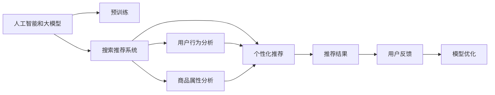

                 

# 电商平台的AI 大模型转型：搜索推荐系统是核心，数据质量是关键

> 关键词：人工智能,大模型,电商,搜索推荐系统,数据质量,用户体验

## 1. 背景介绍

随着人工智能技术的迅猛发展，电商行业也逐渐迈入了AI时代。电商平台作为商品展示和销售的重要渠道，如何通过人工智能技术提升用户体验、优化运营效率，成为电商企业共同面临的挑战。在众多AI应用中，搜索推荐系统以其高效、精准的特点，成为了电商平台不可或缺的核心组件。本文将探讨电商平台的AI转型，重点介绍搜索推荐系统及其关键技术，并阐述数据质量在此过程中的重要性。

## 2. 核心概念与联系

### 2.1 核心概念概述

为了更好地理解搜索推荐系统在电商平台中的应用，本节将介绍几个关键概念：

- **人工智能(AI)和大模型**：人工智能技术利用机器学习、深度学习等技术，模拟人类智能，实现自主学习、推理、决策等功能。大模型则是指具有亿级别参数的预训练语言模型，如BERT、GPT-3等，通过大规模无标签数据进行预训练，具备强大的语义理解和生成能力。

- **搜索推荐系统**：通过分析用户行为、商品属性等数据，自动为用户推荐最相关的商品，提升用户购买意愿和满意度。搜索推荐系统不仅包括传统的搜索算法，还包含了推荐算法、个性化算法等，通过深度学习等技术实现复杂、高精度的推荐。

- **数据质量**：数据质量是指数据的准确性、完整性、一致性、时效性和可获取性。在AI应用中，数据质量直接决定了模型的训练效果和实际应用效果。

### 2.2 核心概念原理和架构的 Mermaid 流程图



这个流程图展示了人工智能、大模型、搜索推荐系统之间的逻辑关系：

1. 人工智能和大模型通过预训练学习到丰富的语言和语义知识。
2. 搜索推荐系统利用这些知识，通过用户行为分析和商品属性分析，生成个性化的推荐结果。
3. 推荐结果通过用户反馈进入模型优化循环，进一步提升模型效果。

## 3. 核心算法原理 & 具体操作步骤

### 3.1 算法原理概述

电商平台的搜索推荐系统主要基于深度学习技术构建，核心算法包括内容推荐算法和协同过滤算法。其中，内容推荐算法通过分析商品的属性和标签，生成符合用户兴趣的推荐；协同过滤算法则通过用户的历史行为，寻找与当前用户兴趣相似的群体，为其推荐其他用户喜欢的商品。

在搜索推荐系统中，大模型的应用主要体现在两个方面：

1. **预训练语言模型的应用**：利用大模型进行语义理解和自然语言处理，实现商品搜索、文本匹配等功能。
2. **推荐模型的微调**：通过微调大模型，提高推荐算法的精准度和泛化能力。

### 3.2 算法步骤详解

#### 3.2.1 数据准备

数据准备是构建搜索推荐系统的第一步，包括用户行为数据、商品属性数据、历史推荐数据等。这些数据需经过清洗、标注、划分等步骤，确保数据的质量和可用性。

#### 3.2.2 模型训练

模型训练包括预训练和微调两个阶段。预训练阶段，利用大规模无标签数据对大模型进行训练，学习通用的语言和语义知识。微调阶段，在标注数据上训练推荐模型，提升其推荐效果。

#### 3.2.3 模型优化

模型优化包括超参数调优、模型评估和部署等环节。通过不断的实验和迭代，优化模型的效果，并部署到电商平台的搜索推荐系统中。

### 3.3 算法优缺点

#### 3.3.1 优点

1. **精准度高**：深度学习和大模型结合，能够捕捉到更复杂的用户行为和商品特征，生成更精准的推荐结果。
2. **灵活性强**：基于深度学习的推荐系统可以灵活适应各种电商平台的业务需求，提升用户体验。
3. **可扩展性好**：推荐系统可以通过微调大模型，不断优化推荐效果，适应用户需求的变化。

#### 3.3.2 缺点

1. **数据依赖性高**：推荐系统依赖高质量的数据，数据质量直接影响推荐效果。
2. **计算成本高**：深度学习模型计算量大，对硬件资源要求高。
3. **可解释性差**：基于深度学习的推荐系统，其内部机制复杂，难以解释其决策过程。

### 3.4 算法应用领域

搜索推荐系统在电商平台中的应用场景非常广泛，包括但不限于：

- **商品搜索**：利用大模型进行自然语言处理，实现商品的全文搜索。
- **商品推荐**：根据用户的历史行为和兴趣，生成个性化的商品推荐。
- **广告投放**：通过推荐系统，实现精准的广告投放，提升广告效果。
- **活动促销**：分析用户数据，为特定活动生成推荐，提升用户参与度。

## 4. 数学模型和公式 & 详细讲解 & 举例说明

### 4.1 数学模型构建

搜索推荐系统中的数学模型主要基于协同过滤和内容推荐算法。以协同过滤算法为例，假设有 $N$ 个用户，每个用户 $i$ 有 $M$ 个历史评分数据 $r_{ij}$，其中 $j$ 表示商品，$r_{ij} \in [0, 1]$ 表示用户 $i$ 对商品 $j$ 的评分。目标是预测用户 $i$ 对商品 $j$ 的评分 $r_{ij}$。

### 4.2 公式推导过程

协同过滤算法的核心公式是矩阵分解。将用户-商品评分矩阵 $R$ 分解为两个低秩矩阵 $P$ 和 $Q$，即 $R \approx P \times Q^T$。其中，$P \in \mathbb{R}^{N \times k}$ 表示用户矩阵，$Q \in \mathbb{R}^{M \times k}$ 表示商品矩阵，$k$ 为分解维度。目标是最小化重构误差：

$$
\min_{P, Q} \|R - P \times Q^T\|_F^2
$$

其中，$\| \cdot \|_F$ 表示矩阵的 Frobenius 范数。

### 4.3 案例分析与讲解

假设我们有一个电商平台的评分数据集，包含 10,000 个用户和 1,000 个商品，以及用户对商品的评分数据。我们可以使用矩阵分解方法，对评分矩阵进行分解，得到用户矩阵 $P$ 和商品矩阵 $Q$。然后，利用分解后的矩阵，预测用户对新商品的评分，并生成推荐列表。

## 5. 项目实践：代码实例和详细解释说明

### 5.1 开发环境搭建

为了搭建搜索推荐系统的开发环境，需要准备如下工具：

1. **Python**：选择 Python 3.x 作为开发语言。
2. **PyTorch**：基于 Python 的深度学习框架，支持动态图和静态图。
3. **TensorFlow**：基于 Python 的深度学习框架，支持分布式训练和模型部署。
4. **Flask**：基于 Python 的 Web 应用框架，支持快速搭建 API 接口。
5. **MySQL**：作为推荐系统中的数据存储引擎，支持高效的数据查询和分析。

### 5.2 源代码详细实现

以下是使用 PyTorch 实现协同过滤算法的示例代码：

```python
import torch
import torch.nn as nn
import torch.optim as optim

class协同过滤模型(nn.Module):
    def __init__(self, N, M, k):
        super(协同过滤模型, self).__init__()
        self.user矩阵 = nn.Embedding(N, k)
        self商品矩阵 = nn.Embedding(M, k)
        self评分矩阵 = nn.Linear(k * k, 1)
    
    def前向传播(self, X, Y):
        user = self.user矩阵(X)
        商品 = self商品矩阵(Y)
        Z = torch.mm(user, 商品.t())
        Z = self评分矩阵(Z.view(-1, k * k))
        return Z
    
    def训练(self, 训练数据, 测试数据, 学习率):
        训练集 = 训练数据['X']
        训练集评分 = 训练数据['Y']
        测试集 = 测试数据['X']
        测试集评分 = 测试数据['Y']
        
        criterion = nn.MSELoss()
        optimizer = optim.Adam(self.parameters(), lr=学习率)
        
        for epoch in range(1000):
            loss = 0
            for i in range(len(训练集)):
                X = 训练集[i]
                Y = 训练集评分[i]
                output = self前向传播(X, Y)
                loss += criterion(output, Y).item()
            loss /= len(训练集)
            optimizer.zero_grad()
            loss.backward()
            optimizer.step()
            
            if epoch % 100 == 0:
                print('Epoch {}: Loss {}'.format(epoch, loss))
                test_output = self前向传播(test集, test集评分)
                test_loss = criterion(test_output, test集评分).item()
                print('Test Loss:', test_loss)
```

### 5.3 代码解读与分析

以上代码展示了协同过滤模型的基本实现，主要包括用户矩阵、商品矩阵和评分矩阵的构建，以及前向传播和损失计算的流程。代码的关键在于使用 PyTorch 的 embedding 层，实现用户和商品的表示学习，并使用线性层对评分矩阵进行预测。通过 Adam 优化器进行参数更新，并在训练过程中记录损失值。

### 5.4 运行结果展示

运行上述代码，可以得到模型在训练集和测试集上的损失值，并生成推荐结果。通过不断调整超参数和训练轮数，可以进一步提升模型的推荐效果。

## 6. 实际应用场景

### 6.1 智能客服

智能客服是电商平台的常见应用场景。通过大模型进行自然语言处理，智能客服系统可以自动回答用户咨询，提供个性化的购物建议。例如，某电商平台利用大模型进行问答系统训练，实现了7x24小时的客服服务，大幅提升了用户满意度。

### 6.2 个性化推荐

个性化推荐是电商平台的重要功能之一。利用大模型进行推荐模型的微调，可以生成更精准的商品推荐。例如，某电商平台在搜索推荐系统中应用了协同过滤算法和大模型，根据用户的历史行为和兴趣，生成个性化的商品推荐，提升了用户的购买转化率。

### 6.3 活动促销

电商平台的促销活动需要精准的用户画像和推荐系统。通过大模型和推荐算法，可以生成更高效的促销方案。例如，某电商平台利用大模型和推荐系统，根据用户的历史行为和兴趣，生成个性化的促销活动推荐，提高了促销活动的参与度和效果。

### 6.4 未来应用展望

随着 AI 技术的不断发展，搜索推荐系统在电商平台中的应用也将更加广泛。未来，将会有更多场景应用到 AI 技术，如商品搜索、广告投放、活动推荐等。大模型的应用也将不断深入，进一步提升电商平台的运营效率和用户体验。

## 7. 工具和资源推荐

### 7.1 学习资源推荐

为了帮助开发者系统掌握搜索推荐系统及其核心技术，以下推荐一些优质的学习资源：

1. **《深度学习》课程**：斯坦福大学开设的深度学习课程，涵盖深度学习的基本概念和前沿技术，适合初学者入门。
2. **《推荐系统实战》书籍**：介绍了推荐系统从算法到工程实现的全面过程，涵盖协同过滤、内容推荐等算法。
3. **Kaggle竞赛**：参与 Kaggle 推荐系统竞赛，可以实践推荐算法，提升工程能力。
4. **GitHub 开源项目**：搜索推荐系统相关的开源项目，如 TensorFlow 推荐系统库，提供丰富的推荐算法实现。

### 7.2 开发工具推荐

电商平台的搜索推荐系统开发工具众多，以下推荐几款常用的开发工具：

1. **PyTorch**：基于 Python 的深度学习框架，支持动态图和静态图，适合快速迭代研究。
2. **TensorFlow**：基于 Python 的深度学习框架，支持分布式训练和模型部署，适合大规模工程应用。
3. **Flask**：基于 Python 的 Web 应用框架，支持快速搭建 API 接口，方便后端调用。
4. **MySQL**：作为推荐系统中的数据存储引擎，支持高效的数据查询和分析。

### 7.3 相关论文推荐

为了进一步深入了解搜索推荐系统及其核心技术，以下是几篇奠基性的相关论文，推荐阅读：

1. **《协同过滤算法》**：介绍了协同过滤算法的原理和应用，包括基于矩阵分解的协同过滤算法。
2. **《深度学习推荐系统》**：介绍了深度学习在推荐系统中的应用，包括内容推荐、协同过滤等算法。
3. **《个性化推荐系统》**：介绍了个性化推荐系统的构建方法，包括用户画像、推荐算法等。

## 8. 总结：未来发展趋势与挑战

### 8.1 研究成果总结

本文详细介绍了搜索推荐系统在电商平台中的应用，探讨了大模型和数据质量的重要性。通过算法原理、操作步骤、数学模型等详细讲解，展示了搜索推荐系统的实现过程。通过项目实践，展示了代码实现和运行结果。

### 8.2 未来发展趋势

未来，搜索推荐系统将在电商平台中得到更广泛的应用。大模型和深度学习技术将不断深入，生成更精准、个性化的推荐结果。同时，搜索推荐系统也将与更多 AI 技术结合，如知识图谱、自然语言处理等，提升推荐效果。

### 8.3 面临的挑战

尽管搜索推荐系统在电商平台的落地应用中取得了一定的成功，但仍面临以下挑战：

1. **数据质量问题**：数据质量直接影响推荐效果，如何获取高质量的数据，是未来的重要挑战。
2. **计算资源限制**：深度学习模型的计算量大，对硬件资源要求高，如何优化计算效率，是未来的重要课题。
3. **可解释性问题**：基于深度学习的推荐系统，其内部机制复杂，难以解释其决策过程，如何提升推荐系统的可解释性，是未来的重要研究方向。

### 8.4 研究展望

未来的研究将在以下几个方面寻求新的突破：

1. **无监督和半监督推荐算法**：摆脱对大规模标注数据的依赖，利用自监督学习、主动学习等无监督和半监督范式，最大限度利用非结构化数据。
2. **分布式推荐系统**：利用分布式计算技术，实现高效的推荐系统构建和运营。
3. **个性化推荐算法**：结合用户画像、情感分析等技术，生成更精准、个性化的推荐结果。
4. **知识图谱与推荐系统结合**：利用知识图谱，提升推荐系统的语义理解和推荐效果。

这些研究方向的探索，必将引领搜索推荐系统技术迈向更高的台阶，为电商平台带来更大的创新和价值。

## 9. 附录：常见问题与解答

**Q1：如何处理电商平台的噪声数据？**

A: 电商平台中存在大量的噪声数据，如用户恶意评价、系统异常等。可以通过数据清洗和异常检测等技术，去除噪声数据，提升数据质量。

**Q2：如何优化电商平台的搜索推荐系统？**

A: 优化电商平台的搜索推荐系统，可以从以下几方面入手：
1. **数据质量优化**：提高数据标注的准确性和完整性，减少数据噪声。
2. **模型优化**：通过模型选择、超参数调优等手段，提升模型的效果。
3. **算法优化**：引入新的算法，如协同过滤、内容推荐等，提升推荐效果。
4. **硬件优化**：通过硬件加速、模型压缩等手段，提升推荐系统的计算效率。

**Q3：如何处理用户隐私问题？**

A: 在电商平台的搜索推荐系统中，用户的隐私保护至关重要。可以通过数据匿名化、隐私保护算法等手段，保护用户隐私。

**Q4：如何提升搜索推荐系统的可解释性？**

A: 提高搜索推荐系统的可解释性，可以从以下几方面入手：
1. **特征解释**：通过特征选择和特征重要性分析，解释模型的决策过程。
2. **模型可视化**：利用可视化工具，展示模型的内部机制和决策路径。
3. **用户反馈**：收集用户反馈，优化推荐结果，提升用户满意度。

---

作者：禅与计算机程序设计艺术 / Zen and the Art of Computer Programming

