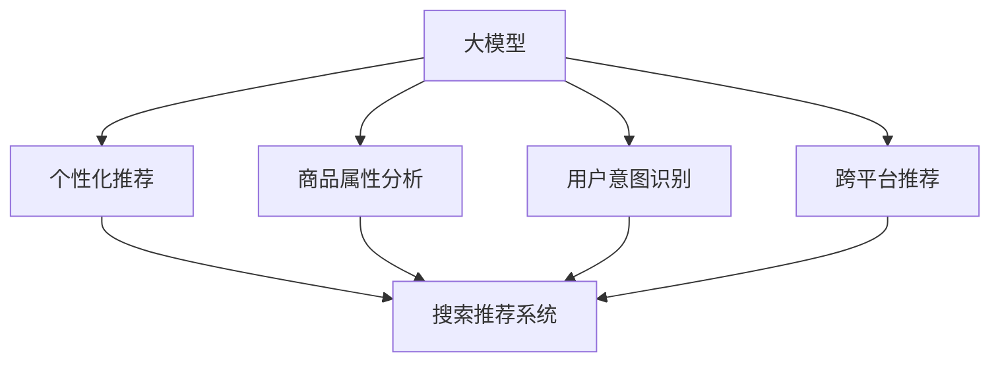

                 

# 电商平台的AI 大模型转型：搜索推荐系统是核心，用户体验优化与数据质量

## 1. 背景介绍

随着互联网技术的发展和电商市场的竞争加剧，电商平台的数字化转型已是大势所趋。AI技术的深度应用，特别是基于深度学习的大模型技术，正在从根本上改变电商平台的运营模式。尤其是在搜索推荐系统中，大模型的引入带来了革命性的变革，显著提升了用户体验和平台效率。

### 1.1 电商搜索推荐系统的现状与挑战

当前，大多数电商平台仍依赖传统的推荐算法，如协同过滤、矩阵分解等，这些算法在处理大规模稀疏矩阵时，计算复杂度高，易受数据冷启动和稀疏性问题困扰。同时，传统的推荐算法难以充分利用用户行为数据中的隐含信息，无法满足电商用户对个性化推荐日益增长的需求。

随着深度学习技术的发展，基于大模型的推荐系统逐渐成为电商搜索推荐领域的新宠。大模型通过海量无标签数据的预训练，学习到了丰富的语义表示和结构特征，具备强大的泛化能力和鲁棒性。在电商搜索推荐系统中，大模型可以从用户搜索行为、点击记录、购买历史等多种数据源中提取有价值的信息，形成全面的用户画像，实现更加个性化和精准的推荐。

### 1.2 大模型在电商搜索推荐中的应用

大模型在电商搜索推荐系统中主要应用于以下几个方面：

- **个性化推荐**：通过用户行为数据的预训练和微调，生成用户兴趣表示，对不同用户推荐不同商品。
- **商品属性分析**：从产品描述、标签等数据中提取商品属性信息，提升商品搜索的准确性和召回率。
- **用户意图识别**：通过用户搜索查询的预训练和微调，精准理解用户意图，实现更高效的搜索结果排序。
- **跨平台推荐**：将用户的电商行为数据与其他平台（如社交媒体、内容网站）的兴趣数据相结合，提供多场景、多渠道的推荐服务。

大模型的引入极大地提高了电商搜索推荐系统的性能，但同时伴随着数据质量、模型训练、用户体验等新挑战。本文将从这些方面系统探讨电商搜索推荐系统中大模型的应用，以期为电商平台的AI转型提供参考。

## 2. 核心概念与联系

### 2.1 核心概念概述

为更好地理解电商搜索推荐系统中大模型的应用，本节将介绍几个密切相关的核心概念：

- **大模型**：以深度学习模型为代表的，通过海量数据预训练，学习复杂语义和结构特征的模型。常见的有BERT、GPT-3、DALL·E等。
- **推荐系统**：根据用户行为数据，为用户推荐其可能感兴趣的商品或内容。传统推荐算法主要包括协同过滤、矩阵分解等，近年来基于大模型的推荐系统逐渐成为主流。
- **搜索推荐系统**：电商平台上集成的搜索和推荐功能，通过用户搜索和点击行为，为用户推荐符合其兴趣的商品，同时实现商品搜索的精准匹配。
- **个性化推荐**：针对不同用户，根据其历史行为和兴趣特征，推荐个性化商品，提升用户体验和平台转化率。
- **用户体验**：用户在电商平台上的行为反馈，包括浏览、点击、购买、评价等，通过用户行为数据驱动推荐系统优化。
- **数据质量**：电商平台生成的行为数据和商品数据，其完整性、准确性和多样性直接影响大模型的性能和推荐效果。

这些概念之间的逻辑关系可以通过以下Mermaid流程图来展示：



这个流程图展示了大模型在电商搜索推荐系统中的应用路径：

1. 大模型通过预训练和微调，生成商品和用户画像。
2. 生成个性化推荐结果，应用于搜索推荐系统。
3. 分析和识别商品属性和用户意图，进一步提升推荐效果。
4. 实现跨平台推荐，覆盖更多渠道和场景。

## 3. 核心算法原理 & 具体操作步骤
### 3.1 算法原理概述

基于大模型的电商搜索推荐系统，本质上是通过用户行为数据的预训练和微调，学习商品和用户间的语义表示，从而实现个性化推荐和搜索排序。其核心思想是：利用大模型的预训练能力，从用户搜索行为、点击记录、购买历史等多种数据源中提取有价值的信息，生成个性化的推荐结果。

形式化地，假设大模型为 $M_{\theta}$，其中 $\theta$ 为模型参数。给定电商平台的用户行为数据集 $D=\{(x_i,y_i)\}_{i=1}^N$，其中 $x_i$ 为用户行为记录，$y_i$ 为用户对推荐商品的评分或购买行为。微调的目标是找到新的模型参数 $\hat{\theta}$，使得：

$$
\hat{\theta}=\mathop{\arg\min}_{\theta} \mathcal{L}(M_{\theta},D)
$$

其中 $\mathcal{L}$ 为针对电商推荐任务设计的损失函数，用于衡量推荐结果与用户评分或购买行为之间的差异。常见的损失函数包括均方误差损失、交叉熵损失等。

通过梯度下降等优化算法，微调过程不断更新模型参数 $\theta$，最小化损失函数 $\mathcal{L}$，使得推荐结果逼近用户评分或购买行为。由于 $\theta$ 已经通过预训练获得了较好的初始化，因此即便在用户行为数据量较少的场景下，也能较快收敛到理想的模型参数 $\hat{\theta}$。

### 3.2 算法步骤详解

基于大模型的电商搜索推荐系统的一般步骤如下：

**Step 1: 准备数据和模型**

- 收集电商平台的用户行为数据，包括搜索记录、点击行为、购买记录等。这些数据通常具有稀疏性，且包含大量噪声和冷启动样本。
- 选择合适的大模型，如BERT、GPT-3等，作为初始化参数，进行预训练。预训练任务可以是掩码语言模型、序列分类等。
- 划分训练集、验证集和测试集，确保数据集的多样性和代表性。

**Step 2: 数据预处理和特征工程**

- 对原始行为数据进行清洗和归一化，去除异常值和重复数据。
- 利用特征工程技术，将行为数据转换为数值特征，如点击次数、浏览时长、购买金额等。
- 提取用户搜索查询和商品属性标签等文本特征，并使用分词和编码技术进行处理。

**Step 3: 模型微调与优化**

- 将预训练模型作为初始化参数，对用户行为数据进行微调。微调的目标是根据用户行为生成推荐结果，并对商品属性进行分析。
- 选择合适的优化算法及其参数，如Adam、SGD等，设置学习率、批大小、迭代轮数等。
- 应用正则化技术，如L2正则、Dropout、Early Stopping等，防止过拟合。
- 设置冻结预训练部分层的策略，如仅微调顶层，减少需优化的参数量。

**Step 4: 评估和部署**

- 在验证集上评估模型性能，根据评估指标（如均方误差、交叉熵等）决定是否触发Early Stopping。
- 在测试集上测试微调后的模型，对比微调前后的性能提升。
- 使用微调后的模型进行商品推荐和搜索结果排序，集成到电商平台中。
- 持续收集新数据，定期重新微调模型，以适应数据分布的变化。

以上步骤展示了电商搜索推荐系统中大模型微调的一般流程。在实际应用中，还需要针对具体任务的特点，对微调过程的各个环节进行优化设计，如改进损失函数，引入更多的正则化技术，搜索最优的超参数组合等，以进一步提升模型性能。

### 3.3 算法优缺点

基于大模型的电商搜索推荐系统具有以下优点：

- 数据利用效率高：大模型能够高效利用稀疏行为数据，挖掘其中隐含的语义信息。
- 个性化能力强：通过微调，大模型能够从多维度数据中生成个性化推荐，满足用户多样化的需求。
- 推荐效果稳定：大模型的泛化能力和鲁棒性，使得推荐系统能够适应不同用户和商品的多样性。

同时，该方法也存在一定的局限性：

- 数据质量要求高：用户行为数据的准确性和完整性直接影响模型性能，数据质量不高会严重影响推荐结果。
- 模型训练耗时：大模型的参数量庞大，训练和微调过程需要大量计算资源和时间。
- 模型可解释性差：大模型通常是黑盒系统，缺乏对推荐结果的解释和分析，可能影响用户信任和接受度。

尽管存在这些局限性，但就目前而言，基于大模型的推荐系统在电商搜索推荐领域取得了显著的成效，成为推荐系统的主流范式。未来相关研究的重点在于如何进一步优化数据质量，提高模型训练效率，提升模型的可解释性和伦理性。

### 3.4 算法应用领域

基于大模型的电商搜索推荐系统在电商平台上已得到广泛应用，覆盖了商品推荐、搜索排序、个性化展示等多个环节，为电商平台的数字化转型带来了显著的效益：

- **商品推荐**：根据用户历史行为和搜索记录，生成个性化推荐列表，提升用户购买转化率。
- **搜索结果排序**：根据用户查询，动态调整搜索结果排序，提升搜索精准度和用户体验。
- **个性化展示**：通过分析用户行为数据，生成用户画像，实现商品广告和推荐内容的个性化展示。
- **用户行为分析**：从用户行为数据中提取行为模式和兴趣特征，指导商品运营和用户营销策略。

除了上述这些经典应用外，大模型在电商搜索推荐系统中还有更多创新性的应用，如商品属性预测、交叉销售推荐、个性化搜索建议等，进一步拓展了电商平台的推荐能力。随着大模型的不断进步和应用，电商平台的搜索推荐系统必将在更多场景中发挥更大的作用，提升用户的购物体验和平台的运营效率。

## 4. 数学模型和公式 & 详细讲解 & 举例说明

### 4.1 数学模型构建

本节将使用数学语言对电商搜索推荐系统中大模型的微调过程进行更加严格的刻画。

假设大模型为 $M_{\theta}$，其中 $\theta$ 为模型参数。给定电商推荐任务的训练集 $D=\{(x_i,y_i)\}_{i=1}^N$，其中 $x_i$ 为用户行为记录，$y_i$ 为用户对推荐商品的评分或购买行为。

定义模型 $M_{\theta}$ 在数据样本 $(x,y)$ 上的损失函数为 $\ell(M_{\theta}(x),y)$，则在数据集 $D$ 上的经验风险为：

$$
\mathcal{L}(\theta) = \frac{1}{N} \sum_{i=1}^N \ell(M_{\theta}(x_i),y_i)
$$

微调的优化目标是最小化经验风险，即找到最优参数：

$$
\theta^* = \mathop{\arg\min}_{\theta} \mathcal{L}(\theta)
$$

在实践中，我们通常使用基于梯度的优化算法（如SGD、Adam等）来近似求解上述最优化问题。设 $\eta$ 为学习率，$\lambda$ 为正则化系数，则参数的更新公式为：

$$
\theta \leftarrow \theta - \eta \nabla_{\theta}\mathcal{L}(\theta) - \eta\lambda\theta
$$

其中 $\nabla_{\theta}\mathcal{L}(\theta)$ 为损失函数对参数 $\theta$ 的梯度，可通过反向传播算法高效计算。

### 4.2 公式推导过程

以下我们以电商商品推荐为例，推导均方误差损失函数及其梯度的计算公式。

假设模型 $M_{\theta}$ 在输入 $x$ 上的输出为 $\hat{y}=M_{\theta}(x) \in [0,1]$，表示用户对商品的评分。真实标签 $y \in [0,1]$。则均方误差损失函数定义为：

$$
\ell(M_{\theta}(x),y) = (\hat{y}-y)^2
$$

将其代入经验风险公式，得：

$$
\mathcal{L}(\theta) = \frac{1}{N}\sum_{i=1}^N (\hat{y_i}-y_i)^2
$$

根据链式法则，损失函数对参数 $\theta_k$ 的梯度为：

$$
\frac{\partial \mathcal{L}(\theta)}{\partial \theta_k} = -2\sum_{i=1}^N (\hat{y_i}-y_i)\frac{\partial \hat{y_i}}{\partial \theta_k}
$$

其中 $\frac{\partial \hat{y_i}}{\partial \theta_k}$ 可进一步递归展开，利用自动微分技术完成计算。

在得到损失函数的梯度后，即可带入参数更新公式，完成模型的迭代优化。重复上述过程直至收敛，最终得到适应电商推荐任务的最优模型参数 $\theta^*$。

## 5. 项目实践：代码实例和详细解释说明

### 5.1 开发环境搭建

在进行电商搜索推荐系统开发前，我们需要准备好开发环境。以下是使用Python进行PyTorch开发的环境配置流程：

1. 安装Anaconda：从官网下载并安装Anaconda，用于创建独立的Python环境。

2. 创建并激活虚拟环境：
```bash
conda create -n pytorch-env python=3.8 
conda activate pytorch-env
```

3. 安装PyTorch：根据CUDA版本，从官网获取对应的安装命令。例如：
```bash
conda install pytorch torchvision torchaudio cudatoolkit=11.1 -c pytorch -c conda-forge
```

4. 安装Transformers库：
```bash
pip install transformers
```

5. 安装各类工具包：
```bash
pip install numpy pandas scikit-learn matplotlib tqdm jupyter notebook ipython
```

完成上述步骤后，即可在`pytorch-env`环境中开始电商搜索推荐系统的开发。

### 5.2 源代码详细实现

下面我们以电商商品推荐为例，给出使用Transformers库对大模型进行微调的PyTorch代码实现。

首先，定义电商商品推荐任务的数据处理函数：

```python
from transformers import BertTokenizer
from torch.utils.data import Dataset
import torch

class RecommendationDataset(Dataset):
    def __init__(self, features, labels, tokenizer, max_len=128):
        self.features = features
        self.labels = labels
        self.tokenizer = tokenizer
        self.max_len = max_len
        
    def __len__(self):
        return len(self.features)
    
    def __getitem__(self, item):
        feature = self.features[item]
        label = self.labels[item]
        
        encoding = self.tokenizer(feature, return_tensors='pt', max_length=self.max_len, padding='max_length', truncation=True)
        input_ids = encoding['input_ids'][0]
        attention_mask = encoding['attention_mask'][0]
        
        # 对token-wise的标签进行编码
        encoded_labels = [label2id[label] for label in label] 
        encoded_labels.extend([label2id['']]*(self.max_len - len(encoded_labels)))
        labels = torch.tensor(encoded_labels, dtype=torch.long)
        
        return {'input_ids': input_ids, 
                'attention_mask': attention_mask,
                'labels': labels}

# 标签与id的映射
label2id = {'1': 0, '2': 1, '3': 2, '4': 3, '5': 4}
id2label = {v: k for k, v in label2id.items()}

# 创建dataset
tokenizer = BertTokenizer.from_pretrained('bert-base-cased')

train_dataset = RecommendationDataset(train_features, train_labels, tokenizer)
dev_dataset = RecommendationDataset(dev_features, dev_labels, tokenizer)
test_dataset = RecommendationDataset(test_features, test_labels, tokenizer)
```

然后，定义模型和优化器：

```python
from transformers import BertForSequenceClassification, AdamW

model = BertForSequenceClassification.from_pretrained('bert-base-cased', num_labels=len(label2id))

optimizer = AdamW(model.parameters(), lr=2e-5)
```

接着，定义训练和评估函数：

```python
from torch.utils.data import DataLoader
from tqdm import tqdm
from sklearn.metrics import classification_report

device = torch.device('cuda') if torch.cuda.is_available() else torch.device('cpu')
model.to(device)

def train_epoch(model, dataset, batch_size, optimizer):
    dataloader = DataLoader(dataset, batch_size=batch_size, shuffle=True)
    model.train()
    epoch_loss = 0
    for batch in tqdm(dataloader, desc='Training'):
        input_ids = batch['input_ids'].to(device)
        attention_mask = batch['attention_mask'].to(device)
        labels = batch['labels'].to(device)
        model.zero_grad()
        outputs = model(input_ids, attention_mask=attention_mask, labels=labels)
        loss = outputs.loss
        epoch_loss += loss.item()
        loss.backward()
        optimizer.step()
    return epoch_loss / len(dataloader)

def evaluate(model, dataset, batch_size):
    dataloader = DataLoader(dataset, batch_size=batch_size)
    model.eval()
    preds, labels = [], []
    with torch.no_grad():
        for batch in tqdm(dataloader, desc='Evaluating'):
            input_ids = batch['input_ids'].to(device)
            attention_mask = batch['attention_mask'].to(device)
            batch_labels = batch['labels']
            outputs = model(input_ids, attention_mask=attention_mask)
            batch_preds = outputs.logits.argmax(dim=2).to('cpu').tolist()
            batch_labels = batch_labels.to('cpu').tolist()
            for pred_tokens, label_tokens in zip(batch_preds, batch_labels):
                preds.append(pred_tokens[:len(label_tokens)])
                labels.append(label_tokens)
                
    print(classification_report(labels, preds))
```

最后，启动训练流程并在测试集上评估：

```python
epochs = 5
batch_size = 16

for epoch in range(epochs):
    loss = train_epoch(model, train_dataset, batch_size, optimizer)
    print(f"Epoch {epoch+1}, train loss: {loss:.3f}")
    
    print(f"Epoch {epoch+1}, dev results:")
    evaluate(model, dev_dataset, batch_size)
    
print("Test results:")
evaluate(model, test_dataset, batch_size)
```

以上就是使用PyTorch对大模型进行电商商品推荐任务微调的完整代码实现。可以看到，得益于Transformers库的强大封装，我们可以用相对简洁的代码完成大模型的加载和微调。

### 5.3 代码解读与分析

让我们再详细解读一下关键代码的实现细节：

**RecommendationDataset类**：
- `__init__`方法：初始化商品特征、标签、分词器等关键组件。
- `__len__`方法：返回数据集的样本数量。
- `__getitem__`方法：对单个样本进行处理，将商品特征输入编码为token ids，将标签编码为数字，并对其进行定长padding，最终返回模型所需的输入。

**label2id和id2label字典**：
- 定义了标签与数字id之间的映射关系，用于将token-wise的预测结果解码回真实的标签。

**训练和评估函数**：
- 使用PyTorch的DataLoader对数据集进行批次化加载，供模型训练和推理使用。
- 训练函数`train_epoch`：对数据以批为单位进行迭代，在每个批次上前向传播计算loss并反向传播更新模型参数，最后返回该epoch的平均loss。
- 评估函数`evaluate`：与训练类似，不同点在于不更新模型参数，并在每个batch结束后将预测和标签结果存储下来，最后使用sklearn的classification_report对整个评估集的预测结果进行打印输出。

**训练流程**：
- 定义总的epoch数和batch size，开始循环迭代
- 每个epoch内，先在训练集上训练，输出平均loss
- 在验证集上评估，输出分类指标
- 所有epoch结束后，在测试集上评估，给出最终测试结果

可以看到，PyTorch配合Transformers库使得电商商品推荐任务的微调代码实现变得简洁高效。开发者可以将更多精力放在数据处理、模型改进等高层逻辑上，而不必过多关注底层的实现细节。

当然，工业级的系统实现还需考虑更多因素，如模型的保存和部署、超参数的自动搜索、更灵活的任务适配层等。但核心的微调范式基本与此类似。

## 6. 实际应用场景
### 6.1 个性化推荐系统

在电商平台上，个性化推荐系统是提升用户体验和平台价值的重要手段。通过大模型的微调，可以实现更加精准和个性化的推荐，满足用户多样化、个性化的需求。

具体而言，可以收集用户历史浏览、点击、购买等行为数据，通过微调大模型，生成用户兴趣表示，对不同用户推荐不同商品。在用户进入电商平台时，实时计算推荐结果，生成个性化推荐列表，提升用户满意度和购买转化率。

### 6.2 搜索排序优化

在电商搜索功能中，搜索结果的排序优化是提升用户体验的关键。传统的搜索排序算法通常采用TF-IDF、BM25等方法，难以充分利用用户行为数据中的隐含信息。通过微调大模型，可以从用户搜索查询中提取语义信息，生成精准的搜索结果排序。

具体而言，可以收集用户搜索查询数据，通过微调大模型，生成查询向量，与商品特征向量进行相似度计算，对搜索结果进行排序。同时，可以引入用户的评分和点击行为，动态调整搜索结果排序，进一步提升搜索效果。

### 6.3 个性化广告推荐

在电商平台上，个性化广告推荐是提升广告点击率、提升广告收入的重要手段。通过大模型的微调，可以实现更加精准的广告推荐，提升广告投放效果。

具体而言，可以收集用户搜索、点击、浏览等行为数据，通过微调大模型，生成用户画像，匹配相关广告内容，提升广告的展示效果和点击率。同时，可以结合用户的购买行为和评分，进一步优化广告推荐策略，提升广告转化率。

### 6.4 未来应用展望

随着大模型和微调方法的不断发展，电商搜索推荐系统必将在更多场景中得到应用，为电商平台带来新的机遇。

在智慧零售领域，基于大模型的推荐系统将推动商品推荐和搜索排序的智能化升级，提升消费者的购物体验和平台的运营效率。

在供应链管理中，基于大模型的推荐系统将优化商品库存和供应链管理，提升供应链的响应速度和效率。

在金融领域，基于大模型的推荐系统将推荐个性化的金融产品和服务，提升金融服务的覆盖面和用户满意度。

此外，在教育、医疗、娱乐等众多领域，基于大模型的推荐系统也将不断涌现，为各行各业带来新的机遇。相信随着技术的日益成熟，大模型微调技术将在更广阔的领域发挥更大的作用，推动电商平台的数字化转型。

## 7. 工具和资源推荐
### 7.1 学习资源推荐

为了帮助开发者系统掌握大模型在电商搜索推荐中的应用，这里推荐一些优质的学习资源：

1. 《深度学习与推荐系统实战》：由阿里技术团队撰写，深入浅出地介绍了深度学习在推荐系统中的应用，包括电商推荐、广告推荐、个性化展示等。

2. 《电商推荐系统》课程：清华大学开设的电商推荐系统课程，涵盖了推荐算法、数据处理、模型优化等电商推荐系统的核心内容。

3. 《深度学习与自然语言处理》书籍：斯坦福大学自然语言处理课程配套教材，详细介绍了深度学习在NLP领域的应用，包括大模型的预训练和微调。

4. 《Transformer理论与实践》博客：由大模型技术专家撰写，深入浅出地介绍了Transformer模型的原理、应用及优化技术。

5. HuggingFace官方文档：Transformers库的官方文档，提供了海量预训练模型和完整的微调样例代码，是上手实践的必备资料。

通过对这些资源的学习实践，相信你一定能够快速掌握大模型在电商搜索推荐中的应用，并用于解决实际的电商推荐问题。
### 7.2 开发工具推荐

高效的开发离不开优秀的工具支持。以下是几款用于电商搜索推荐系统开发的常用工具：

1. PyTorch：基于Python的开源深度学习框架，灵活动态的计算图，适合快速迭代研究。大部分预训练语言模型都有PyTorch版本的实现。

2. TensorFlow：由Google主导开发的开源深度学习框架，生产部署方便，适合大规模工程应用。同样有丰富的预训练语言模型资源。

3. Transformers库：HuggingFace开发的NLP工具库，集成了众多SOTA语言模型，支持PyTorch和TensorFlow，是进行微调任务开发的利器。

4. Weights & Biases：模型训练的实验跟踪工具，可以记录和可视化模型训练过程中的各项指标，方便对比和调优。与主流深度学习框架无缝集成。

5. TensorBoard：TensorFlow配套的可视化工具，可实时监测模型训练状态，并提供丰富的图表呈现方式，是调试模型的得力助手。

6. Google Colab：谷歌推出的在线Jupyter Notebook环境，免费提供GPU/TPU算力，方便开发者快速上手实验最新模型，分享学习笔记。

合理利用这些工具，可以显著提升电商搜索推荐系统的开发效率，加快创新迭代的步伐。

### 7.3 相关论文推荐

大模型在电商搜索推荐系统中的应用源于学界的持续研究。以下是几篇奠基性的相关论文，推荐阅读：

1. Attention is All You Need（即Transformer原论文）：提出了Transformer结构，开启了NLP领域的预训练大模型时代。

2. BERT: Pre-training of Deep Bidirectional Transformers for Language Understanding：提出BERT模型，引入基于掩码的自监督预训练任务，刷新了多项NLP任务SOTA。

3. Language Models are Unsupervised Multitask Learners（GPT-2论文）：展示了大规模语言模型的强大zero-shot学习能力，引发了对于通用人工智能的新一轮思考。

4. Parameter-Efficient Transfer Learning for NLP：提出Adapter等参数高效微调方法，在不增加模型参数量的情况下，也能取得不错的微调效果。

5. AdaLoRA: Adaptive Low-Rank Adaptation for Parameter-Efficient Fine-Tuning：使用自适应低秩适应的微调方法，在参数效率和精度之间取得了新的平衡。

这些论文代表了大模型在电商搜索推荐系统中的应用和发展脉络。通过学习这些前沿成果，可以帮助研究者把握学科前进方向，激发更多的创新灵感。

## 8. 总结：未来发展趋势与挑战

### 8.1 总结

本文对基于大模型的电商搜索推荐系统的应用进行了全面系统的介绍。首先阐述了大模型在电商搜索推荐系统中的重要地位，明确了微调技术在提升用户体验和平台价值方面的独特价值。其次，从原理到实践，详细讲解了电商搜索推荐系统中大模型的微调过程，给出了电商商品推荐任务的完整代码实现。同时，本文还广泛探讨了电商搜索推荐系统中的个性化推荐、搜索排序优化、个性化广告推荐等多个应用场景，展示了微调范式的巨大潜力。此外，本文精选了电商搜索推荐系统的各类学习资源，力求为开发者提供全方位的技术指引。

通过本文的系统梳理，可以看到，基于大模型的电商搜索推荐系统已经在电商平台上得到了广泛应用，极大地提升了用户购物体验和平台运营效率。未来，伴随大模型和微调方法的持续演进，电商平台的搜索推荐系统必将在更多场景中发挥更大的作用，推动电商平台的数字化转型。

### 8.2 未来发展趋势

展望未来，电商搜索推荐系统中的大模型微调技术将呈现以下几个发展趋势：

1. 数据质量提升。随着电商平台的不断增长和用户行为的日益丰富，数据的完整性和多样性将显著提升，为模型的微调提供了更多有价值的信息。

2. 推荐策略优化。结合用户行为、商品属性、社交网络等多维信息，优化推荐策略，提升推荐的个性化和多样化。

3. 模型训练优化。引入更高效的优化算法和正则化技术，提高模型训练速度和性能，降低计算资源消耗。

4. 实时推荐。基于流数据的大模型微调，实现实时推荐，提升用户体验和平台响应速度。

5. 模型压缩和量化。在大模型压缩、量化等技术支持下，提升模型推理速度，降低硬件成本。

6. 跨平台协同推荐。结合不同平台（如社交媒体、内容网站等）的用户数据，实现跨平台协同推荐，提升推荐的全面性和多样性。

这些趋势凸显了大模型在电商搜索推荐系统中的应用前景。这些方向的探索发展，必将进一步提升电商平台的搜索推荐系统性能，满足用户日益增长的个性化需求。

### 8.3 面临的挑战

尽管大模型在电商搜索推荐系统中取得了显著成效，但在迈向更加智能化、普适化应用的过程中，它仍面临着诸多挑战：

1. 数据质量瓶颈。用户行为数据的准确性和完整性直接影响模型性能，电商平台的增长初期，数据质量可能不高，需要投入大量资源进行数据清洗和预处理。

2. 模型鲁棒性不足。大模型面对多样化的用户行为和商品属性，泛化性能可能有所波动，如何提升模型的鲁棒性，避免冷启动和数据分布漂移，仍然是一大难题。

3. 模型可解释性差。电商推荐系统需要提供良好的用户解释，帮助用户理解推荐结果的依据。如何增强大模型的可解释性，提升用户的信任和接受度，还需要进一步研究。

4. 模型训练耗时。大模型的参数量和计算量巨大，训练和微调过程需要大量时间和计算资源，如何提高模型训练效率，缩短研发周期，是未来的重要方向。

5. 隐私和安全问题。电商平台的推荐系统需要处理大量用户隐私数据，如何保护用户隐私，确保数据安全，也是电商推荐系统的重要课题。

尽管存在这些挑战，但就目前而言，基于大模型的推荐系统在电商搜索推荐领域取得了显著的成效，成为推荐系统的主流范式。未来相关研究的重点在于如何进一步优化数据质量，提高模型训练效率，提升模型的可解释性和伦理性。

### 8.4 研究展望

面对电商搜索推荐系统中的大模型微调所面临的种种挑战，未来的研究需要在以下几个方面寻求新的突破：

1. 无监督和半监督微调方法。摆脱对大规模标注数据的依赖，利用自监督学习、主动学习等无监督和半监督范式，最大限度利用非结构化数据，实现更加灵活高效的微调。

2. 参数高效和计算高效的微调范式。开发更加参数高效的微调方法，在固定大部分预训练参数的同时，只更新极少量的任务相关参数。同时优化微调模型的计算图，减少前向传播和反向传播的资源消耗，实现更加轻量级、实时性的部署。

3. 因果分析和博弈论工具。将因果分析方法引入微调模型，识别出模型决策的关键特征，增强输出解释的因果性和逻辑性。借助博弈论工具刻画人机交互过程，主动探索并规避模型的脆弱点，提高系统稳定性。

4. 数据质量保障与隐私保护。引入数据清洗和预处理技术，提升数据质量。同时，引入差分隐私等技术，保护用户隐私，确保数据安全。

5. 持续学习与反馈机制。结合用户反馈和行为数据，不断更新模型，提升模型性能和鲁棒性。引入反馈机制，及时调整推荐策略，提高用户满意度。

这些研究方向的探索，必将引领大模型在电商搜索推荐系统中的应用走向新的高度，为电商平台带来更多的机遇和挑战。只有勇于创新、敢于突破，才能不断拓展大模型的应用边界，推动电商平台的数字化转型。

## 9. 附录：常见问题与解答

**Q1：电商推荐系统如何实现个性化推荐？**

A: 电商推荐系统通过大模型的微调，从用户历史行为数据中提取用户兴趣表示，对不同用户推荐不同商品。具体而言，可以通过以下步骤实现：

1. 收集用户历史浏览、点击、购买等行为数据，构建用户行为数据集。
2. 选择合适的大模型，如BERT、GPT-3等，进行预训练。
3. 将用户行为数据集划分为训练集、验证集和测试集，用于模型训练和评估。
4. 在训练集上微调大模型，生成用户兴趣表示。
5. 在测试集上评估模型性能，选择最优模型。
6. 使用微调后的模型，对新用户或新行为进行推荐。

**Q2：电商搜索排序如何实现精准排序？**

A: 电商搜索排序通过微调大模型，从用户搜索查询中提取语义信息，生成精准的搜索结果排序。具体而言，可以通过以下步骤实现：

1. 收集用户搜索查询数据，构建查询数据集。
2. 选择合适的大模型，如BERT、GPT-3等，进行预训练。
3. 将查询数据集划分为训练集、验证集和测试集，用于模型训练和评估。
4. 在训练集上微调大模型，生成查询向量。
5. 在测试集上评估模型性能，选择最优模型。
6. 使用微调后的模型，对新查询进行排序。

**Q3：电商个性化广告推荐如何提升广告点击率？**

A: 电商个性化广告推荐通过微调大模型，生成用户画像，匹配相关广告内容，提升广告的展示效果和点击率。具体而言，可以通过以下步骤实现：

1. 收集用户搜索、点击、浏览等行为数据，构建用户行为数据集。
2. 选择合适的大模型，如BERT、GPT-3等，进行预训练。
3. 将用户行为数据集划分为训练集、验证集和测试集，用于模型训练和评估。
4. 在训练集上微调大模型，生成用户画像。
5. 在测试集上评估模型性能，选择最优模型。
6. 使用微调后的模型，对新广告进行推荐。

**Q4：电商推荐系统的数据质量如何保障？**

A: 电商推荐系统的数据质量保障可以从以下几个方面入手：

1. 数据清洗和预处理：去除异常值和重复数据，进行数据归一化和特征工程，提升数据质量。
2. 数据标注和验证：通过人工标注和验证，确保数据标注的准确性和一致性。
3. 数据合成和增强：使用数据增强技术，合成更多的训练样本，提升数据多样性。
4. 数据采样和平衡：采用采样技术，平衡数据分布，避免模型在少数类别上过拟合。
5. 数据隐私和安全：采用差分隐私等技术，保护用户隐私，确保数据安全。

通过以上措施，可以提升电商推荐系统的数据质量，增强模型的性能和鲁棒性。

**Q5：电商搜索推荐系统如何应对数据冷启动问题？**

A: 电商搜索推荐系统应对数据冷启动问题，可以通过以下方法：

1. 利用无监督学习方法，从用户行为数据中提取隐含的语义信息，生成用户画像。
2. 使用迁移学习方法，将用户行为数据与其他平台（如社交媒体、内容网站）的用户数据结合，提升数据多样性和质量。
3. 采用增量学习方法，不断更新用户画像，增强模型对新用户的适应能力。
4. 引入模型初始化技术，如随机初始化、预训练嵌入等，提升模型的泛化能力。
5. 引入用户反馈机制，及时调整推荐策略，增强模型对用户偏好的适应能力。

通过以上方法，可以有效地应对电商搜索推荐系统中的数据冷启动问题，提升模型性能和用户体验。

---

作者：禅与计算机程序设计艺术 / Zen and the Art of Computer Programming

