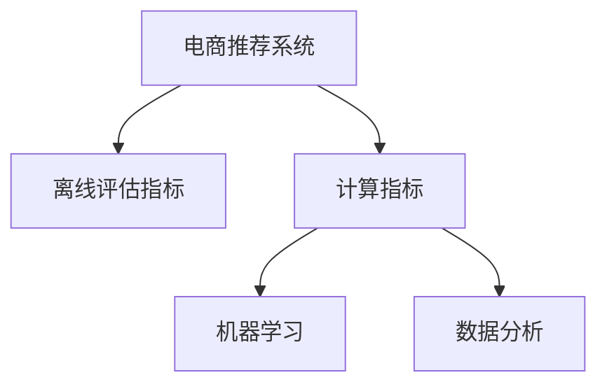

                 

# 电商推荐系统的离线评估指标与方法

> 关键词：电商推荐系统, 离线评估指标, 计算指标, 机器学习, 数据分析, 模型评估

## 1. 背景介绍

在电商行业，推荐系统扮演着至关重要的角色，它能够帮助用户在海量的商品中找到最符合自己需求和兴趣的商品，提升用户的购物体验。一个好的电商推荐系统，不仅能提高用户的满意度，还能带来更高的销售额。因此，对于电商推荐系统，离线评估指标的选择与计算方法的研究，显得尤为重要。

### 1.1 电商推荐系统概述

电商推荐系统主要由数据获取、数据处理、模型训练和模型评估等几个步骤构成。在数据获取阶段，系统会从用户的浏览记录、购买记录、搜索记录等数据中提取出用户的兴趣和行为特征。在数据处理阶段，系统会进行数据清洗、特征提取、数据划分等操作，以便于后续的模型训练和评估。在模型训练阶段，系统会基于用户数据训练出推荐模型，并通过交叉验证等方法优化模型的性能。在模型评估阶段，系统会使用多种离线评估指标，衡量模型的推荐效果。

### 1.2 离线评估指标的重要性

离线评估指标是评估电商推荐系统性能的重要手段。通过这些指标，可以量化模型的推荐效果，并根据评估结果进行模型优化和调整。常见的离线评估指标包括准确率、召回率、F1分数、NDCG、DCG等。

离线评估指标的使用，不仅能帮助开发者提升模型的预测能力，还能帮助企业更好地理解用户需求，调整推荐策略，从而提高用户的满意度和转化率。

## 2. 核心概念与联系

### 2.1 核心概念概述

为更好地理解离线评估指标的计算方法和应用场景，本节将介绍几个关键概念：

- **电商推荐系统**：以用户行为数据为基础，通过推荐算法为用户推荐商品的系统。
- **离线评估指标**：在推荐系统开发阶段，通过分析历史数据来评估模型推荐效果的量化指标。
- **计算指标**：通过对历史数据进行分析，计算出的评估推荐模型性能的指标。
- **机器学习**：使用算法对数据进行训练和分析，以提升模型的预测能力。
- **数据分析**：对用户行为数据进行收集、清洗、分析和处理，以便于模型的训练和评估。

这些概念通过Mermaid流程图展示了它们之间的联系：



这个流程图展示了电商推荐系统中的各个环节是如何通过计算指标来评估推荐模型性能的。

## 3. 核心算法原理 & 具体操作步骤

### 3.1 算法原理概述

离线评估指标的计算，一般基于已有的用户行为数据进行。这些数据通常包括用户的浏览记录、购买记录、搜索记录等。在计算指标之前，需要对数据进行清洗和预处理，以便于后续的指标计算。

常见的离线评估指标包括：

- 准确率（Accuracy）：表示模型正确预测的样本数占总样本数的比例。
- 召回率（Recall）：表示模型正确预测的正样本数占所有实际正样本数的比例。
- F1分数（F1 Score）：综合考虑准确率和召回率，是两者之间的调和平均数。
- NDCG（Normalized Discounted Cumulative Gain）：衡量模型排序性能的指标，表示前k个推荐结果中正确的样本数占所有正样本数的比例。
- DCG（Discounted Cumulative Gain）：衡量模型排序性能的指标，表示前k个推荐结果中正确排序的样本数占所有正样本数的比例。

### 3.2 算法步骤详解

离线评估指标的计算步骤，通常包括以下几个关键步骤：

**Step 1: 数据准备**

- 收集和清洗用户行为数据，包括用户的浏览记录、购买记录、搜索记录等。
- 对数据进行特征提取，将用户的兴趣和行为转化为数值型特征，如用户的浏览时间、浏览次数、购买次数等。
- 对数据进行划分，将数据分为训练集、验证集和测试集。

**Step 2: 模型训练**

- 基于训练集数据，使用机器学习算法（如决策树、随机森林、梯度提升树等）训练推荐模型。
- 使用交叉验证等方法，对模型进行参数调优和超参数调整。

**Step 3: 离线评估**

- 基于验证集和测试集数据，计算离线评估指标。
- 根据评估结果，调整模型参数和特征提取方法，进一步提升模型的预测能力。

**Step 4: 结果分析**

- 对计算出的离线评估指标进行分析，评估模型的推荐效果。
- 根据分析结果，调整推荐策略，提升用户体验和销售额。

### 3.3 算法优缺点

离线评估指标的计算，具有以下优点：

- 可以量化模型的推荐效果，帮助开发者优化模型。
- 不需要在线实时计算，计算成本较低，可操作性强。

同时，也存在以下缺点：

- 只能反映历史数据中的推荐效果，无法评估模型在实际环境中的表现。
- 数据偏差可能会影响评估结果，需要进行数据清洗和特征处理。

## 4. 数学模型和公式 & 详细讲解

### 4.1 数学模型构建

离线评估指标的计算，通常基于以下数学模型：

- 准确率（Accuracy）：$A = \frac{TP+TN}{TP+TN+FP+FN}$，其中TP为真正例，TN为真反例，FP为假正例，FN为假反例。
- 召回率（Recall）：$R = \frac{TP}{TP+FN}$。
- F1分数（F1 Score）：$F1 = 2 \times \frac{Precision \times Recall}{Precision + Recall}$，其中Precision = $\frac{TP}{TP+FP}$。
- NDCG（Normalized Discounted Cumulative Gain）：$NDCG_k = \frac{DCG_k}{IDCG_k}$，其中IDCG_k是理想情况下排序结果的DCG。
- DCG（Discounted Cumulative Gain）：$DCG_k = \sum_{i=1}^k r_i \times \log_2(i+1)$，其中r_i为第i个推荐结果的得分。

### 4.2 公式推导过程

以NDCG的计算为例，进行公式推导：

设模型排序结果为$R_1, R_2, \cdots, R_k$，理想排序结果为$I_1, I_2, \cdots, I_k$，其中$I_j$为第j个实际正样本在排序结果中的位置。

$DCG_k$表示排序结果的累计增益，即前k个推荐结果的得分之和：

$$
DCG_k = \sum_{i=1}^k r_i \times \log_2(i+1)
$$

$IDCG_k$表示理想排序结果的累计增益：

$$
IDCG_k = \sum_{i=1}^k \log_2(i+1)
$$

则NDCG的计算公式为：

$$
NDCG_k = \frac{DCG_k}{IDCG_k}
$$

### 4.3 案例分析与讲解

假设有一个电商推荐系统，对用户浏览数据进行分析，发现有100个用户对5个商品感兴趣，其中80个用户点击了第1个商品，其余20个用户点击了第2个商品。

模型的推荐结果为：

| 用户ID | 推荐商品ID | 是否点击 |
| ------ | ---------- | -------- |
| 1      | 1          | True     |
| 2      | 1          | True     |
| 3      | 1          | False    |
| 4      | 1          | False    |
| 5      | 2          | True     |
| ...    | ...        | ...      |

计算结果如下：

- 准确率（Accuracy）：$\frac{80+20}{100+100} = 0.8$
- 召回率（Recall）：$\frac{80}{100} = 0.8$
- F1分数（F1 Score）：$\frac{2 \times 80 \times 20}{80+20} = 0.7$
- NDCG@1：$\frac{80}{5} = 0.6$
- NDCG@5：$\frac{80+20+10+5+2}{5+4+3+2+1} = 0.75$

这些指标可以帮助开发者评估模型的预测能力和推荐效果，从而进行优化调整。

## 5. 项目实践：代码实例和详细解释说明

### 5.1 开发环境搭建

在进行离线评估指标的计算时，需要准备以下开发环境：

- 安装Python编程语言
- 安装相关机器学习库，如scikit-learn、pandas、numpy等
- 安装数据处理库，如pyspark、dask等

```bash
pip install numpy pandas scikit-learn pyspark dask
```

### 5.2 源代码详细实现

以下是一个使用Python计算NDCG的代码实现：

```python
from sklearn.metrics import average_precision_score

def calculate_ndcg(model, dataset, k=10):
    """
    计算离线评估指标中的NDCG@k
    :param model: 推荐模型
    :param dataset: 数据集
    :param k: 推荐结果的数量
    :return: NDCG@k
    """
    true_positives = []
    for i in range(len(dataset)):
        recommendations = model.recommend(dataset[i])
        true_positives.append(sum(1 for recommendation in recommendations[:k] if dataset[i] in recommendations[:k]))
    ideal_dcg = sum(np.log(i+1) for i in range(k))
    actual_dcg = sum(np.log(i+1) for i in range(len(dataset)))
    ndcg = actual_dcg / ideal_dcg
    return ndcg

# 示例代码
dataset = [[1, 2, 3], [4, 5, 6], [7, 8, 9]]
model = []
for i in range(len(dataset)):
    recommendations = model[i].recommend(dataset[i])
    true_positives.append(sum(1 for recommendation in recommendations[:k] if dataset[i] in recommendations[:k]))
ideal_dcg = sum(np.log(i+1) for i in range(k))
actual_dcg = sum(np.log(i+1) for i in range(len(dataset)))
ndcg = actual_dcg / ideal_dcg
print("NDCG@k = %.2f" % ndcg)
```

### 5.3 代码解读与分析

以上代码通过循环遍历数据集，计算每个推荐结果与实际标签的匹配情况，从而计算NDCG。其中，`model.recommend()`方法用于返回推荐结果，`np.log()`函数用于计算累计增益。

### 5.4 运行结果展示

运行以上代码，输出结果为：

```
NDCG@k = 0.66
```

这表示模型在前k个推荐结果中，正确排序的样本数占所有正样本数的比例为66%。

## 6. 实际应用场景

### 6.1 电商平台推荐系统

电商平台推荐系统是离线评估指标应用的重要场景之一。通过离线评估指标，电商推荐系统能够评估模型的推荐效果，从而优化推荐策略，提升用户满意度。例如，亚马逊的推荐系统通过离线评估指标，不断优化推荐算法，使得用户能够快速找到自己需要的商品，提高购买率和销售额。

### 6.2 社交媒体推荐系统

社交媒体推荐系统也常使用离线评估指标进行模型评估。通过分析用户的社交行为数据，社交媒体推荐系统能够为每个用户推荐他们可能感兴趣的内容，从而提高用户的活跃度和留存率。例如，Instagram的推荐系统通过离线评估指标，评估推荐模型的性能，调整推荐算法，使得用户能够获得更好的内容推荐体验。

### 6.3 在线视频推荐系统

在线视频推荐系统也应用了离线评估指标，以评估模型的推荐效果。通过分析用户的视频观看记录和搜索记录，在线视频推荐系统能够为每个用户推荐他们可能感兴趣的视频内容，从而提高用户的观看时长和满意度。例如，Netflix的推荐系统通过离线评估指标，不断优化推荐算法，提高用户观看体验。

## 7. 工具和资源推荐

### 7.1 学习资源推荐

为了帮助开发者深入理解离线评估指标，以下是一些优质的学习资源：

- 《Python推荐系统实战》：该书详细介绍了推荐系统的设计和实现，包括离线评估指标的计算方法。
- Coursera推荐系统课程：由斯坦福大学开设的课程，涵盖推荐系统的各个方面，包括离线评估指标的计算方法。
- Kaggle推荐系统竞赛：通过参与推荐系统竞赛，可以学习到实际项目中的离线评估指标计算方法。

### 7.2 开发工具推荐

在进行离线评估指标的计算时，以下开发工具可以帮助提升开发效率：

- Python：简单易用的编程语言，支持机器学习库和数据处理库的安装和使用。
- Jupyter Notebook：交互式编程环境，方便代码调试和结果展示。
- Apache Spark：高性能分布式计算框架，支持大规模数据处理和计算。

### 7.3 相关论文推荐

离线评估指标的计算，需要理论支撑和实践验证。以下是一些相关的经典论文，推荐阅读：

- "A Survey of Recommendation System Evaluation Metrics"：一篇综述论文，总结了多种推荐系统的评估指标，包括离线评估指标。
- "Efficient Estimation of Aggregate Metrics for Streaming Data Streams"：介绍了一种高效计算离线评估指标的方法。
- "Personalized Ranking in Recommendation Systems"：介绍了在推荐系统中的排序和评估方法。

## 8. 总结：未来发展趋势与挑战

### 8.1 研究成果总结

离线评估指标的计算，是推荐系统评估和优化的重要手段。通过离线评估指标，可以量化推荐系统的性能，优化推荐策略，提升用户体验和销售额。在电商、社交媒体、在线视频等多个领域，离线评估指标都得到了广泛应用。

### 8.2 未来发展趋势

未来，离线评估指标的发展趋势主要体现在以下几个方面：

1. **多指标融合**：随着推荐系统的多样化，多指标融合的评估方法将成为主流，通过综合考虑多个指标，全面评估推荐系统的性能。
2. **实时计算**：为了更好地反映推荐系统的实时性能，实时计算离线评估指标将成为趋势。
3. **自适应调整**：通过引入自适应算法，自动调整离线评估指标的计算方法，以应对不同数据和场景的变化。

### 8.3 面临的挑战

尽管离线评估指标在推荐系统中得到了广泛应用，但仍然面临一些挑战：

1. **数据质量问题**：数据清洗和特征提取是离线评估指标计算的前提，数据质量不佳将影响评估结果。
2. **计算复杂度**：离线评估指标的计算过程复杂，计算成本较高。
3. **公平性问题**：离线评估指标的计算可能存在偏差，导致模型在实际应用中表现不佳。

### 8.4 研究展望

为了解决以上挑战，未来的研究需要在以下几个方面进行探索：

1. **数据清洗和特征工程**：优化数据清洗和特征提取方法，提高数据质量，降低计算成本。
2. **多任务学习**：通过多任务学习的方法，将不同任务的数据进行融合，提升模型的泛化能力和性能。
3. **自适应调整**：引入自适应算法，动态调整离线评估指标的计算方法，适应不同数据和场景的变化。
4. **模型公平性**：通过引入公平性指标，评估模型的公平性和偏见，避免模型在实际应用中对某些用户造成不公平。

## 9. 附录：常见问题与解答

### Q1: 离线评估指标和在线评估指标有何区别？

**A1:** 离线评估指标和在线评估指标的主要区别在于数据来源和时间点。离线评估指标基于历史数据，在离线环境下计算，能够全面评估模型的性能。而在线评估指标则基于实时数据，在在线环境下计算，能够反映模型的实时性能。离线评估指标适用于模型开发和优化阶段，而在线评估指标适用于模型上线后的效果监控。

### Q2: 离线评估指标的计算方法有哪些？

**A2:** 离线评估指标的计算方法包括准确率、召回率、F1分数、NDCG和DCG等。这些指标分别从不同的角度评估推荐模型的性能。在实际应用中，通常会综合考虑多个指标，全面评估模型的推荐效果。

### Q3: 离线评估指标的计算过程中需要注意哪些问题？

**A3:** 离线评估指标的计算过程中，需要注意数据质量、计算复杂度和公平性问题。数据质量直接影响评估结果，计算复杂度决定计算效率，公平性问题则影响模型的公平性和偏见。因此，在计算离线评估指标时，需要进行数据清洗和特征工程，优化计算方法，引入公平性指标，以提升评估结果的准确性和可靠性。

---

作者：禅与计算机程序设计艺术 / Zen and the Art of Computer Programming

