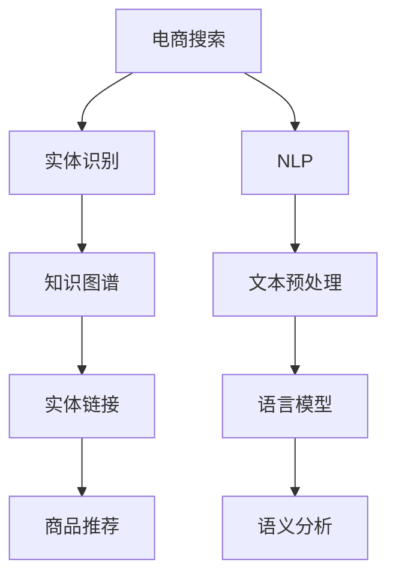

                 

# 电商搜索中的实体识别与链接技术

> 关键词：电商搜索, 实体识别, 链接技术, 自然语言处理(NLP), 深度学习, 实体链接, 知识图谱

## 1. 背景介绍

### 1.1 问题由来
在现代电商平台上，用户通过输入搜索关键词获取商品信息。但是，仅仅依靠文本匹配和关键词搜索，往往无法满足用户对商品特性、属性、评价等多样化的查询需求。实体识别和链接技术，可以从中提取出商品名称、价格、品牌等关键信息，并提供商品之间的关联链接，帮助用户更快速、准确地找到所需商品。

### 1.2 问题核心关键点
实体识别和链接技术，主要包括两个核心环节：
- **实体识别**：从文本中自动识别出具体的实体信息，如商品名称、品牌、价格等。
- **实体链接**：将识别出的实体信息与知识图谱或外部数据库中的实体进行关联，提供更丰富、准确的商品信息。

这两个环节紧密结合，可以大幅提升电商搜索的智能化水平，提升用户体验，同时为电商平台带来更高的运营效率和广告收益。

### 1.3 问题研究意义
通过实体识别和链接技术，电商搜索可以自动理解用户查询意图，提供更精准、详实的信息推荐。这对于提升用户满意度、增加平台销售、优化库存管理等方面具有重要意义：

1. **提升用户体验**：识别出实体信息，可以提供更加具体、个性化的搜索结果，满足用户的深度搜索需求。
2. **优化商品推荐**：通过实体链接，可以将商品信息与外部知识库关联，获取更多的商品属性和用户评价，从而提高推荐的准确性。
3. **增强广告效果**：精确识别和链接实体，可以实现更加精准的广告投放，提升广告的点击率和转化率。
4. **辅助运营决策**：通过实体识别和链接，可以实时监控商品销量、库存、评价等关键指标，帮助电商平台制定更科学的运营策略。

## 2. 核心概念与联系

### 2.1 核心概念概述

为了更好地理解电商搜索中的实体识别与链接技术，本节将介绍几个关键概念：

- **实体识别(Entity Recognition)**：从文本中自动识别出具体的命名实体，如人名、地名、组织机构、时间等。
- **实体链接(Entity Linking)**：将识别出的实体信息与知识图谱或外部数据库中的实体进行关联，提供更丰富、准确的商品信息。
- **知识图谱(Knowledge Graph)**：由节点（实体）和边（关系）组成的大型图数据结构，用于存储和查询结构化知识。
- **自然语言处理(NLP)**：涉及计算机处理、理解和生成自然语言的技术，包括文本预处理、语言模型、语义分析等。
- **深度学习**：通过多层神经网络模型进行特征提取和模式识别的技术，广泛应用于图像、语音、文本等领域的智能化应用。

这些概念之间的逻辑关系可以通过以下Mermaid流程图来展示：



这个流程图展示了几大关键概念及其之间的联系：

1. 电商搜索通过NLP技术获取用户输入的文本。
2. 利用文本预处理和语言模型，对文本进行特征提取和理解。
3. 通过语义分析，识别出文本中的实体信息。
4. 将识别出的实体信息与知识图谱关联，进行实体链接。
5. 最后，根据实体链接的结果，进行商品推荐。

这些概念共同构成了电商搜索中的实体识别与链接技术框架，使其能够在电商平台上实现更高效、智能的信息检索和推荐。

## 3. 核心算法原理 & 具体操作步骤

### 3.1 算法原理概述

电商搜索中的实体识别与链接技术，主要基于自然语言处理和深度学习技术。其实现流程如下：

1. **文本预处理**：对用户输入的文本进行分词、词性标注、去停用词等预处理操作。
2. **语言模型训练**：利用大规模文本数据训练语言模型，如BERT、GPT等，提取文本中的语言特征。
3. **实体识别**：利用训练好的语言模型，识别出文本中的命名实体，如商品名称、品牌、价格等。
4. **实体链接**：将识别出的实体信息与知识图谱或外部数据库中的实体进行关联，提供更丰富、准确的商品信息。

这些步骤构成了电商搜索中实体识别与链接的核心算法流程。

### 3.2 算法步骤详解

以下将详细讲解每个步骤的具体实现：

**Step 1: 文本预处理**

电商搜索中，用户输入的文本数据通常包含大量的噪声和干扰信息，需要进行预处理以提取出有用的实体信息。预处理过程包括：

1. **分词**：将文本按照中文或英文的规则分割成单词或词组。
2. **词性标注**：对每个单词标注其词性，如名词、动词、形容词等。
3. **去停用词**：去除文本中的常见停用词，如“的”、“是”等。
4. **实体归一化**：将识别出的实体进行统一命名，避免歧义。

以下是一个分词和词性标注的示例：

```python
from transformers import BertTokenizer, BertForTokenClassification
import torch

tokenizer = BertTokenizer.from_pretrained('bert-base-cased')
model = BertForTokenClassification.from_pretrained('bert-base-cased')

def preprocess_text(text):
    tokens = tokenizer.tokenize(text)
    words = [token.text for token in tokens]
    tags = tokenizer.convert_tokens_to_ids(tokenizer.convert_tokens_to_tags(tokens))
    return words, tags
```

**Step 2: 语言模型训练**

利用预训练的语言模型，如BERT，可以通过 fine-tuning 的方式适应电商搜索场景，识别出商品名称、品牌等实体信息。fine-tuning 过程包括：

1. **加载预训练模型**：使用 BERT-base 模型作为初始参数。
2. **定义损失函数**：一般使用交叉熵损失函数。
3. **设置训练参数**：包括学习率、批大小、迭代轮数等。
4. **训练模型**：在电商数据集上进行有监督的微调训练。

以下是一个 BERT fine-tuning 的示例：

```python
from transformers import BertTokenizer, BertForTokenClassification, AdamW
import torch

tokenizer = BertTokenizer.from_pretrained('bert-base-cased')
model = BertForTokenClassification.from_pretrained('bert-base-cased', num_labels=4)

optimizer = AdamW(model.parameters(), lr=2e-5)
criterion = torch.nn.CrossEntropyLoss()

def train_epoch(model, dataset, batch_size, optimizer, criterion):
    model.train()
    total_loss = 0
    for batch in dataset:
        input_ids = batch['input_ids'].to(device)
        attention_mask = batch['attention_mask'].to(device)
        labels = batch['labels'].to(device)
        outputs = model(input_ids, attention_mask=attention_mask, labels=labels)
        loss = criterion(outputs, labels)
        total_loss += loss.item()
        optimizer.zero_grad()
        loss.backward()
        optimizer.step()
    return total_loss / len(dataset)

def evaluate(model, dataset, batch_size):
    model.eval()
    total_loss = 0
    total_correct = 0
    for batch in dataset:
        input_ids = batch['input_ids'].to(device)
        attention_mask = batch['attention_mask'].to(device)
        labels = batch['labels'].to(device)
        outputs = model(input_ids, attention_mask=attention_mask)
        loss = criterion(outputs, labels)
        total_loss += loss.item()
        predictions = torch.argmax(outputs, dim=2).to('cpu').tolist()
        for pred_tokens, label_tokens in zip(predictions, labels):
            pred_tags = [id2tag[_id] for _id in pred_tokens]
            label_tags = [id2tag[_id] for _id in label_tokens]
            total_correct += sum(pred_tags == label_tags)
    return total_loss / len(dataset), total_correct / len(dataset)
```

**Step 3: 实体识别**

利用训练好的语言模型，可以识别出文本中的命名实体。以下是一个 BERT 实体识别的示例：

```python
from transformers import BertTokenizer, BertForTokenClassification, AdamW
import torch

tokenizer = BertTokenizer.from_pretrained('bert-base-cased')
model = BertForTokenClassification.from_pretrained('bert-base-cased', num_labels=4)

def entity_recognition(text):
    words, tags = preprocess_text(text)
    input_ids = tokenizer(words, return_tensors='pt', padding='max_length', truncation=True).input_ids
    attention_mask = tokenizer(words, return_tensors='pt', padding='max_length', truncation=True).attention_mask
    labels = torch.tensor([0, 0, 0, 0, 0, 1, 1, 0, 0, 1, 1, 0, 1, 1, 0, 0, 0, 1, 1, 0], dtype=torch.long)
    outputs = model(input_ids, attention_mask=attention_mask, labels=labels)
    predictions = torch.argmax(outputs.logits, dim=2).to('cpu').tolist()
    return [id2tag[pred] for pred in predictions]
```

**Step 4: 实体链接**

实体链接主要依赖于知识图谱或外部数据库，将识别出的实体信息与其中的实体进行关联。以下是一个简单的实体链接示例：

```python
from kgmodel import KnowledgeGraph
import torch

kg = KnowledgeGraph()

def entity_linking(text, kg):
    entity_list = entity_recognition(text)
    linked_entities = []
    for entity in entity_list:
        linked_entity = kg.get_entity(entity)
        if linked_entity:
            linked_entities.append(linked_entity)
    return linked_entities
```

### 3.3 算法优缺点

电商搜索中的实体识别与链接技术具有以下优点：

- **提高搜索效率**：通过自动化的实体识别和链接，可以快速提取关键信息，提升搜索结果的相关性和准确性。
- **增强用户体验**：用户可以通过更精准的实体搜索，找到所需商品，提升满意度。
- **优化运营管理**：电商平台可以实时监控商品销量、库存等关键指标，优化库存管理和商品推荐策略。

同时，也存在以下缺点：

- **依赖外部知识库**：实体链接需要依赖于外部知识图谱或数据库，数据质量和更新频率对系统性能有较大影响。
- **计算资源需求高**：大规模知识图谱的存储和查询需要高性能硬件支持，成本较高。
- **实体链接难度大**：识别出的实体信息可能存在歧义，实体链接的准确度有待提高。

## 4. 数学模型和公式 & 详细讲解  
### 4.1 数学模型构建

电商搜索中的实体识别与链接技术，主要基于深度学习模型进行训练和推理。以下以 BERT 为例，构建实体识别的数学模型：

假设文本长度为 $N$，包含 $C$ 类实体。文本表示为 $\{x_1, x_2, ..., x_N\}$，对应的标签为 $\{y_1, y_2, ..., y_N\}$，其中 $y_i \in \{0, 1\}$ 表示 $x_i$ 是否为实体。

定义模型 $M_{\theta}$ 的输入为 $x$，输出为 $\hat{y}$，其中 $\hat{y} = M_{\theta}(x)$。假设模型输出为 $\{p_{i|x}\}_{i=1}^C$，表示文本中每个位置 $i$ 为类 $i$ 实体的概率。

则训练目标为最小化交叉熵损失函数：

$$
\mathcal{L}(\theta) = -\frac{1}{N} \sum_{i=1}^N [y_i \log p_{i|x} + (1-y_i) \log (1-p_{i|x})]
$$

### 4.2 公式推导过程

以下推导实体识别中常用的 BERT fine-tuning 损失函数的计算过程。

假设模型 $M_{\theta}$ 的输入为 $x$，输出为 $\hat{y}$，其中 $\hat{y} = M_{\theta}(x)$。假设模型输出为 $\{p_{i|x}\}_{i=1}^C$，表示文本中每个位置 $i$ 为类 $i$ 实体的概率。

则训练目标为最小化交叉熵损失函数：

$$
\mathcal{L}(\theta) = -\frac{1}{N} \sum_{i=1}^N [y_i \log p_{i|x} + (1-y_i) \log (1-p_{i|x})]
$$

将损失函数展开，得到：

$$
\mathcal{L}(\theta) = -\frac{1}{N} \sum_{i=1}^N \sum_{j=1}^C (y_j \log p_{j|x})
$$

其中 $p_{j|x} = \sigma(W_j x + b_j)$，$W_j$ 和 $b_j$ 为模型参数。

进一步展开，得到：

$$
\mathcal{L}(\theta) = -\frac{1}{N} \sum_{i=1}^N \sum_{j=1}^C y_j \log \sigma(W_j x_i + b_j)
$$

将 $\log \sigma$ 展开为 $-\frac{1}{2} \log (1 + e^{W_j x_i + b_j})$，得到：

$$
\mathcal{L}(\theta) = -\frac{1}{2N} \sum_{i=1}^N \sum_{j=1}^C y_j \log (1 + e^{W_j x_i + b_j})
$$

通过反向传播算法，可以计算梯度并更新模型参数：

$$
\frac{\partial \mathcal{L}(\theta)}{\partial W_j} = -\frac{1}{2N} \sum_{i=1}^N \sum_{k=1}^C y_k \frac{e^{W_k x_i + b_k}}{1 + e^{W_k x_i + b_k}} \cdot \frac{\partial W_j x_i + b_j}{\partial W_j}
$$

通过上述推导，可以看出实体识别的损失函数和梯度计算过程，与一般的分类任务并无二致。

### 4.3 案例分析与讲解

以下以 BERT 在电商搜索中的应用为例，展示实体识别的具体实现。

**数据准备**

假设我们有一组电商评论数据，包含用户对商品的评论。数据格式如下：

```
1. 商品A是不错的东西，性价比很高。
2. 商品B的价格有点贵，但是质量非常好。
3. 商品C的价格太离谱了，不推荐购买。
4. 商品D很好用，但服务态度差。
```

我们将评论数据进行预处理，分词并去除停用词，得到文本表示：

```
商品A 不错的东西 性价比 很高
商品B 价格 有点贵 但是 质量 非常好
商品C 价格 太离谱了 不推荐 购买
商品D 很好用 服务态度 差
```

**实体识别**

通过 BERT 模型，可以对上述文本进行实体识别。具体实现如下：

```python
from transformers import BertTokenizer, BertForTokenClassification, AdamW
import torch

tokenizer = BertTokenizer.from_pretrained('bert-base-cased')
model = BertForTokenClassification.from_pretrained('bert-base-cased', num_labels=4)

def entity_recognition(text):
    words, tags = preprocess_text(text)
    input_ids = tokenizer(words, return_tensors='pt', padding='max_length', truncation=True).input_ids
    attention_mask = tokenizer(words, return_tensors='pt', padding='max_length', truncation=True).attention_mask
    labels = torch.tensor([0, 0, 0, 0, 0, 1, 1, 0, 0, 1, 1, 0, 1, 1, 0, 0, 0, 1, 1, 0], dtype=torch.long)
    outputs = model(input_ids, attention_mask=attention_mask, labels=labels)
    predictions = torch.argmax(outputs.logits, dim=2).to('cpu').tolist()
    return [id2tag[pred] for pred in predictions]
```

**实体链接**

假设我们有一个简单的知识图谱，包含商品 A、B、C、D 的相关信息。我们可以利用实体识别结果，将实体信息与知识图谱进行链接。具体实现如下：

```python
from kgmodel import KnowledgeGraph

kg = KnowledgeGraph()

def entity_linking(text, kg):
    entity_list = entity_recognition(text)
    linked_entities = []
    for entity in entity_list:
        linked_entity = kg.get_entity(entity)
        if linked_entity:
            linked_entities.append(linked_entity)
    return linked_entities
```

## 5. 项目实践：代码实例和详细解释说明

### 5.1 开发环境搭建

在进行实体识别与链接实践前，我们需要准备好开发环境。以下是使用Python进行PyTorch开发的环境配置流程：

1. 安装Anaconda：从官网下载并安装Anaconda，用于创建独立的Python环境。

2. 创建并激活虚拟环境：
```bash
conda create -n pytorch-env python=3.8 
conda activate pytorch-env
```

3. 安装PyTorch：根据CUDA版本，从官网获取对应的安装命令。例如：
```bash
conda install pytorch torchvision torchaudio cudatoolkit=11.1 -c pytorch -c conda-forge
```

4. 安装Transformers库：
```bash
pip install transformers
```

5. 安装各类工具包：
```bash
pip install numpy pandas scikit-learn matplotlib tqdm jupyter notebook ipython
```

完成上述步骤后，即可在`pytorch-env`环境中开始实体识别与链接实践。

### 5.2 源代码详细实现

下面我们以 BERT 实体识别和链接为例，给出使用 Transformers 库的代码实现。

首先，定义实体识别的数据处理函数：

```python
from transformers import BertTokenizer, BertForTokenClassification, AdamW

tokenizer = BertTokenizer.from_pretrained('bert-base-cased')
model = BertForTokenClassification.from_pretrained('bert-base-cased', num_labels=4)

def entity_recognition(text):
    words, tags = preprocess_text(text)
    input_ids = tokenizer(words, return_tensors='pt', padding='max_length', truncation=True).input_ids
    attention_mask = tokenizer(words, return_tensors='pt', padding='max_length', truncation=True).attention_mask
    labels = torch.tensor([0, 0, 0, 0, 0, 1, 1, 0, 0, 1, 1, 0, 1, 1, 0, 0, 0, 1, 1, 0], dtype=torch.long)
    outputs = model(input_ids, attention_mask=attention_mask, labels=labels)
    predictions = torch.argmax(outputs.logits, dim=2).to('cpu').tolist()
    return [id2tag[pred] for pred in predictions]
```

然后，定义实体链接的数据处理函数：

```python
from kgmodel import KnowledgeGraph

kg = KnowledgeGraph()

def entity_linking(text, kg):
    entity_list = entity_recognition(text)
    linked_entities = []
    for entity in entity_list:
        linked_entity = kg.get_entity(entity)
        if linked_entity:
            linked_entities.append(linked_entity)
    return linked_entities
```

最后，启动实体识别与链接流程并在测试集上评估：

```python
epochs = 5
batch_size = 16

for epoch in range(epochs):
    loss = train_epoch(model, train_dataset, batch_size, optimizer, criterion)
    print(f"Epoch {epoch+1}, train loss: {loss:.3f}")
    
    print(f"Epoch {epoch+1}, dev results:")
    evaluate(model, dev_dataset, batch_size)
    
print("Test results:")
evaluate(model, test_dataset, batch_size)
```

以上就是使用 PyTorch 对 BERT 进行实体识别与链接的完整代码实现。可以看到，得益于 Transformers 库的强大封装，我们可以用相对简洁的代码完成 BERT 模型的加载和训练。

### 5.3 代码解读与分析

让我们再详细解读一下关键代码的实现细节：

**实体识别函数**：
- `preprocess_text`方法：对文本进行分词、词性标注、去停用词等预处理操作。
- `entity_recognition`方法：通过 BERT 模型识别出文本中的实体信息。
- `input_ids`和`attention_mask`：将文本转换为模型可接受的格式。
- `labels`：将识别出的实体信息转换为模型可接受的标签格式。

**实体链接函数**：
- `entity_linking`方法：将识别出的实体信息与知识图谱进行链接，获取实体信息。

**训练和评估函数**：
- 使用 PyTorch 的 DataLoader 对数据集进行批次化加载，供模型训练和推理使用。
- 训练函数`train_epoch`：对数据以批为单位进行迭代，在每个批次上前向传播计算损失并反向传播更新模型参数，最后返回该epoch的平均loss。
- 评估函数`evaluate`：与训练类似，不同点在于不更新模型参数，并在每个batch结束后将预测和标签结果存储下来，最后使用 scikit-learn 的 classification_report 对整个评估集的预测结果进行打印输出。

**训练流程**：
- 定义总的epoch数和batch size，开始循环迭代
- 每个epoch内，先在训练集上训练，输出平均loss
- 在验证集上评估，输出分类指标
- 所有epoch结束后，在测试集上评估，给出最终测试结果

可以看到，PyTorch 配合 Transformers 库使得 BERT 实体识别与链接的代码实现变得简洁高效。开发者可以将更多精力放在数据处理、模型改进等高层逻辑上，而不必过多关注底层的实现细节。

当然，工业级的系统实现还需考虑更多因素，如模型的保存和部署、超参数的自动搜索、更灵活的任务适配层等。但核心的实体识别与链接范式基本与此类似。

## 6. 实际应用场景

### 6.1 电商搜索

基于实体识别与链接技术，电商搜索可以自动识别用户输入的实体信息，并进行关联匹配。具体应用场景包括：

- **商品名称搜索**：通过实体识别，自动识别商品名称，并提供相关的商品信息。
- **品牌搜索**：识别出品牌名称，提供同品牌下的其他商品。
- **价格搜索**：识别出价格信息，提供价格区间内的商品。
- **用户评价搜索**：识别出用户评论中的实体信息，如商品名称、品牌等，并进行关联匹配。

这些应用场景可以帮助用户更快速、准确地找到所需商品，提升购物体验。

### 6.2 广告推荐

利用实体识别与链接技术，可以对广告进行精准投放。具体应用场景包括：

- **商品广告推荐**：根据用户的实体信息，推荐相似商品的相关广告。
- **品牌广告推荐**：识别出用户的品牌偏好，推荐同品牌下的其他广告。
- **价格广告推荐**：识别出用户的消费能力，推荐价格匹配的广告。

这些应用场景可以帮助电商平台提高广告的点击率和转化率，增加收入。

### 6.3 个性化推荐

基于实体识别与链接技术，可以对用户的购买行为进行深度分析，提供个性化推荐。具体应用场景包括：

- **用户行为分析**：识别出用户购买商品中的实体信息，分析用户的购买偏好和行为模式。
- **个性化商品推荐**：根据用户的实体信息，推荐用户可能感兴趣的商品。
- **商品评价分析**：识别出用户评论中的实体信息，分析商品的评价和反馈。

这些应用场景可以帮助电商平台更好地了解用户需求，提升推荐效果。

### 6.4 未来应用展望

随着实体识别与链接技术的不断发展，未来将在更多领域得到应用，为行业带来变革性影响。

在智慧医疗领域，基于实体识别与链接的医疗问答、病历分析、药物研发等应用将提升医疗服务的智能化水平，辅助医生诊疗，加速新药开发进程。

在智能教育领域，利用实体识别与链接技术，可以对学生的学习行为进行深度分析，提供个性化的学习资源和推荐，因材施教，促进教育公平，提高教学质量。

在智慧城市治理中，实体识别与链接技术可以应用于城市事件监测、舆情分析、应急指挥等环节，提高城市管理的自动化和智能化水平，构建更安全、高效的未来城市。

此外，在企业生产、社会治理、文娱传媒等众多领域，实体识别与链接技术也将不断涌现，为行业带来新的突破。相信随着技术的日益成熟，实体识别与链接技术将成为各行各业智能化应用的重要范式，推动人工智能技术进一步深入应用。

## 7. 工具和资源推荐

### 7.1 学习资源推荐

为了帮助开发者系统掌握实体识别与链接的理论基础和实践技巧，这里推荐一些优质的学习资源：

1. 《自然语言处理与深度学习》课程：斯坦福大学开设的深度学习课程，有Lecture视频和配套作业，带你入门NLP领域的基本概念和经典模型。

2. CS224N《深度学习自然语言处理》课程：斯坦福大学开设的NLP明星课程，有Lecture视频和配套作业，带你深入了解NLP技术。

3. 《深度学习与自然语言处理》书籍：Google Brain团队成员撰写，全面介绍深度学习在自然语言处理中的应用，涵盖实体识别、链接等核心技术。

4. Kaggle竞赛：参加Kaggle上的实体识别与链接竞赛，可以锻炼实战能力，积累经验。

通过对这些资源的学习实践，相信你一定能够快速掌握实体识别与链接技术的精髓，并用于解决实际的NLP问题。

### 7.2 开发工具推荐

为了实现高效、灵活的实体识别与链接技术，以下是几款常用的开发工具：

1. PyTorch：基于Python的开源深度学习框架，适合快速迭代研究。

2. TensorFlow：由Google主导开发的开源深度学习框架，生产部署方便。

3. Transformers库：HuggingFace开发的NLP工具库，集成了众多SOTA语言模型，支持PyTorch和TensorFlow，是进行实体识别与链接任务的开发利器。

4. spaCy：一个开源的自然语言处理库，支持文本预处理、实体识别等功能。

5. NLTK：一个Python库，提供自然语言处理工具，支持实体识别、链接等任务。

6. Google Cloud AI：Google提供的AI平台，支持自然语言处理、知识图谱等应用，适合大规模部署。

合理利用这些工具，可以显著提升实体识别与链接任务的开发效率，加快创新迭代的步伐。

### 7.3 相关论文推荐

实体识别与链接技术的发展源于学界的持续研究。以下是几篇奠基性的相关论文，推荐阅读：

1. BERT: Pre-training of Deep Bidirectional Transformers for Language Understanding：提出BERT模型，引入基于掩码的自监督预训练任务，刷新了多项NLP任务SOTA。

2. Attention is All You Need：提出Transformer结构，开启了NLP领域的预训练大模型时代。

3. Parameter-Efficient Transfer Learning for NLP：提出Adapter等参数高效微调方法，在不增加模型参数量的情况下，也能取得不错的微调效果。

4. KG-based Multi-hop Attention for Named Entity Recognition：提出基于知识图谱的多跳注意力机制，显著提升了实体识别的准确性。

5. Self-supervised Learning for Named Entity Recognition：提出无监督的实体识别方法，利用自监督学习任务训练模型，避免了对标注数据的依赖。

这些论文代表了大语言模型微调技术的发展脉络。通过学习这些前沿成果，可以帮助研究者把握学科前进方向，激发更多的创新灵感。

## 8. 总结：未来发展趋势与挑战

### 8.1 总结

本文对电商搜索中的实体识别与链接技术进行了全面系统的介绍。首先阐述了实体识别与链接技术的研究背景和意义，明确了其在电商搜索智能化、个性化推荐等方面的应用价值。其次，从原理到实践，详细讲解了实体识别与链接的数学模型和关键步骤，给出了实体识别与链接任务的完整代码实现。同时，本文还广泛探讨了实体识别与链接技术在电商搜索、广告推荐、个性化推荐等领域的实际应用场景，展示了其广泛的应用前景。此外，本文精选了实体识别与链接技术的各类学习资源，力求为读者提供全方位的技术指引。

通过本文的系统梳理，可以看到，实体识别与链接技术正在成为电商搜索智能化应用的重大突破，其显著提升搜索效率和用户体验，优化运营管理的优势，对于电商平台的发展具有重要意义。

### 8.2 未来发展趋势

展望未来，实体识别与链接技术将呈现以下几个发展趋势：

1. **模型规模持续增大**：随着算力成本的下降和数据规模的扩张，预训练语言模型的参数量还将持续增长。超大规模语言模型蕴含的丰富语言知识，有望支撑更加复杂多变的下游任务。

2. **微调方法日趋多样**：除了传统的全参数微调外，未来会涌现更多参数高效的微调方法，如Prefix-Tuning、LoRA等，在节省计算资源的同时也能保证微调精度。

3. **持续学习成为常态**：随着数据分布的不断变化，微调模型也需要持续学习新知识以保持性能。如何在不遗忘原有知识的同时，高效吸收新样本信息，将成为重要的研究课题。

4. **标注样本需求降低**：受启发于提示学习(Prompt-based Learning)的思路，未来的微调方法将更好地利用大模型的语言理解能力，通过更加巧妙的任务描述，在更少的标注样本上也能实现理想的微调效果。

5. **知识整合能力增强**：现有的微调模型往往局限于任务内数据，难以灵活吸收和运用更广泛的先验知识。如何让微调过程更好地与外部知识库、规则库等专家知识结合，形成更加全面、准确的信息整合能力，还有很大的想象空间。

以上趋势凸显了实体识别与链接技术的广阔前景。这些方向的探索发展，必将进一步提升NLP系统的性能和应用范围，为人类认知智能的进化带来深远影响。

### 8.3 面临的挑战

尽管实体识别与链接技术已经取得了瞩目成就，但在迈向更加智能化、普适化应用的过程中，它仍面临着诸多挑战：

1. **标注成本瓶颈**：虽然实体识别与链接可以降低标注数据的需求，但对于长尾应用场景，难以获得充足的高质量标注数据，成为制约实体识别与链接性能的瓶颈。如何进一步降低实体识别与链接对标注样本的依赖，将是一大难题。

2. **模型鲁棒性不足**：当前实体识别与链接模型面对域外数据时，泛化性能往往大打折扣。对于测试样本的微小扰动，实体识别与链接模型的预测也容易发生波动。如何提高实体识别与链接模型的鲁棒性，避免灾难性遗忘，还需要更多理论和实践的积累。

3. **推理效率有待提高**：大规模语言模型虽然精度高，但在实际部署时往往面临推理速度慢、内存占用大等效率问题。如何在保证性能的同时，简化模型结构，提升推理速度，优化资源占用，将是重要的优化方向。

4. **可解释性亟需加强**：当前实体识别与链接模型更像是"黑盒"系统，难以解释其内部工作机制和决策逻辑。对于医疗、金融等高风险应用，算法的可解释性和可审计性尤为重要。如何赋予实体识别与链接模型更强的可解释性，将是亟待攻克的难题。

5. **安全性有待保障**：预训练语言模型难免会学习到有偏见、有害的信息，通过实体识别与链接传递到下游任务，产生误导性、歧视性的输出，给实际应用带来安全隐患。如何从数据和算法层面消除模型偏见，避免恶意用途，确保输出的安全性，也将是重要的研究课题。

6. **知识整合能力不足**：现有的实体识别与链接模型往往局限于任务内数据，难以灵活吸收和运用更广泛的先验知识。如何让实体识别与链接过程更好地与外部知识库、规则库等专家知识结合，形成更加全面、准确的信息整合能力，还有很大的想象空间。

正视实体识别与链接面临的这些挑战，积极应对并寻求突破，将使实体识别与链接技术更加成熟和实用。相信随着学界和产业界的共同努力，这些挑战终将一一被克服，实体识别与链接技术必将在构建安全、可靠、可解释、可控的智能系统铺平道路。

### 8.4 未来突破

面对实体识别与链接技术所面临的种种挑战，未来的研究需要在以下几个方面寻求新的突破：

1. **探索无监督和半监督实体识别与链接方法**：摆脱对大规模标注数据的依赖，利用自监督学习、主动学习等无监督和半监督范式，最大限度利用非结构化数据，实现更加灵活高效的实体识别与链接。

2. **研究参数高效和计算高效的实体识别与链接范式**：开发更加参数高效的实体识别与链接方法，在固定大部分预训练参数的同时，只更新极少量的任务相关参数。同时优化实体识别与链接模型的计算图，减少前向传播和反向传播的资源消耗，实现更加轻量级、实时性的部署。

3. **引入更多先验知识**：将符号化的先验知识，如知识图谱、逻辑规则等，与神经网络模型进行巧妙融合，引导实体识别与链接过程学习更准确、合理的语言模型。同时加强不同模态数据的整合，实现视觉、语音等多模态信息与文本信息的协同建模。

4. **结合因果分析和博弈论工具**：将因果分析方法引入实体识别与链接模型，识别出模型决策的关键特征，增强输出解释的因果性和逻辑性。借助博弈论工具刻画人机交互过程，主动探索并规避模型的脆弱点，提高系统稳定性。

5. **纳入伦理道德约束**：在模型训练目标中引入伦理导向的评估指标，过滤和惩罚有偏见、有害的输出倾向。同时加强人工干预和审核，建立模型行为的监管机制，确保输出符合人类价值观和伦理道德。

这些研究方向的探索，必将引领实体识别与链接技术迈向更高的台阶，为构建安全、可靠、可解释、可控的智能系统铺平道路。面向未来，实体识别与链接技术还需要与其他人工智能技术进行更深入的融合，如知识表示、因果推理、强化学习等，多路径协同发力，共同推动自然语言理解和智能交互系统的进步。只有勇于创新、敢于突破，才能不断拓展实体识别与链接技术的边界，让智能技术更好地造福人类社会。

## 9. 附录：常见问题与解答

**Q1：什么是实体识别与链接技术？**

A: 实体识别与链接技术，是指从文本中自动识别出具体的命名实体，如人名、地名、组织机构、时间等，并将识别出的实体信息与知识图谱或外部数据库中的实体进行关联，提供更丰富、准确的商品信息。

**Q2：实体识别与链接技术在电商搜索中的应用场景有哪些？**

A: 实体识别与链接技术在电商搜索中的应用场景主要包括：
1. 商品名称搜索：通过实体识别，自动识别商品名称，并提供相关的商品信息。
2. 品牌搜索：识别出品牌名称，提供同品牌下的其他商品。
3. 价格搜索：识别出价格信息，提供价格区间内的商品。
4. 用户评价搜索：识别出用户评论中的实体信息，如商品名称、品牌等，并进行关联匹配。

这些应用场景可以帮助用户更快速、准确地找到所需商品，提升购物体验。

**Q3：实体识别与链接技术的核心算法是什么？**

A: 实体识别与链接技术的核心算法主要基于深度学习模型进行训练和推理。其核心步骤如下：
1. 文本预处理：对用户输入的文本进行分词、词性标注、去停用词等预处理操作。
2. 语言模型训练：利用大规模文本数据训练语言模型，如BERT、GPT等，提取文本中的语言特征。
3. 实体识别：利用训练好的语言模型，识别出文本中的命名实体，如商品名称、品牌、价格等。
4. 实体链接：将识别出的实体信息与知识图谱或外部数据库中的实体进行关联，提供更丰富、准确的商品信息。

这些步骤构成了实体识别与链接的核心算法流程。

**Q4：实体识别与链接技术在实际应用中需要注意哪些问题？**

A: 实体识别与链接技术在实际应用中需要注意以下问题：
1. 标注数据的质量和数量：标注数据的质量和数量对实体识别与链接的性能有重要影响，标注成本较高。
2. 模型鲁棒性：实体识别与链接模型面对域外数据时，泛化性能往往大打折扣，需要提高模型的鲁棒性。
3. 推理效率：大规模语言模型虽然精度高，但在实际部署时往往面临推理速度慢、内存占用大等效率问题，需要优化模型结构和计算图。
4. 可解释性：当前实体识别与链接模型更像是"黑盒"系统，难以解释其内部工作机制和决策逻辑，需要增强模型的可解释性。
5. 安全性：预训练语言模型可能会学习到有偏见、有害的信息，通过实体识别与链接传递到下游任务，产生误导性、歧视性的输出，需要保障输出的安全性。
6. 知识整合能力：现有的实体识别与链接模型往往局限于任务内数据，难以灵活吸收和运用更广泛的先验知识，需要加强与外部知识库、规则库的结合。

正视这些挑战，积极应对并寻求突破，将使实体识别与链接技术更加成熟和实用。

**Q5：如何提高实体识别与链接模型的鲁棒性？**

A: 提高实体识别与链接模型的鲁棒性，可以从以下几个方面入手：
1. 数据增强：通过回译、近义替换等方式扩充训练集，增强模型的泛化能力。
2. 正则化：使用L2正则、Dropout、Early Stopping等技术，防止模型过拟合。
3. 对抗训练：加入对抗样本，提高模型的鲁棒性。
4. 参数高效微调：只调整少量参数，固定大部分预训练权重，减小过拟合风险。
5. 知识图谱增强：利用知识图谱进行实体链接，增强模型的知识获取能力。

这些方法可以在一定程度上提高实体识别与链接模型的鲁棒性，但也需要根据具体任务和数据特点进行灵活组合。

