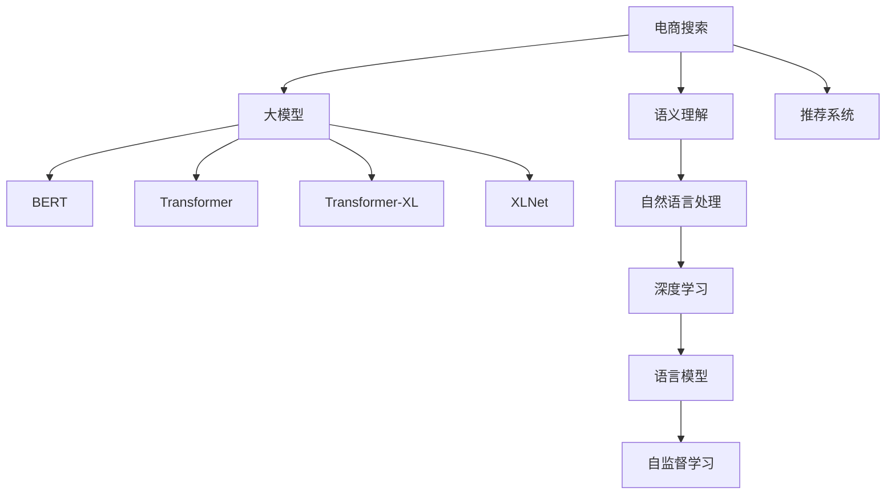

                 

# 电商搜索中的语义理解：AI大模型的突破性进展

> 关键词：电商搜索,语义理解,自然语言处理,大模型,BERT,深度学习,推荐系统,性能优化

## 1. 背景介绍

随着电子商务的蓬勃发展，用户对于搜索结果的准确性和相关性提出了更高的要求。传统的搜索系统大多基于关键词匹配，难以准确理解用户查询意图。而语义理解技术的引入，可以显著提升搜索系统的智能性和用户体验。

近年来，基于深度学习的大模型在语义理解领域取得了重大突破，显著提升了电商搜索系统的性能和准确度。例如，Google的BERT模型在多个自然语言处理任务中取得了SOTA结果，基于BERT的电商搜索系统也展现出良好的效果。但这些技术仍面临一定的瓶颈和挑战。本文将系统介绍大模型在电商搜索中的应用，探讨其在语义理解上的突破性进展。

## 2. 核心概念与联系

### 2.1 核心概念概述

为更好地理解大模型在电商搜索中的应用，我们首先介绍一些关键概念：

- **电商搜索**：指通过文本查询实现对电商网站产品的检索和推荐。电商搜索系统的目标是为用户提供最相关、最有用的商品列表，从而提升用户购买决策的效率和满意度。

- **语义理解**：指自然语言处理(NLP)中对文本意义进行理解和分析的过程。通过语义理解，系统可以准确把握用户查询中的关键信息，进行更精准的匹配和推荐。

- **大模型**：以BERT、GPT等深度学习模型为代表的大规模预训练语言模型。通过在大规模语料上进行自监督学习，大模型具备强大的语言理解能力，广泛应用于各种NLP任务。

- **推荐系统**：根据用户行为数据和商品属性信息，为每个用户推荐其可能感兴趣的商品列表的系统。电商搜索与推荐系统紧密结合，共同为用户提供精准的购物体验。

- **Transformer**：一种基于自注意力机制的深度学习模型，是BERT、GPT等大模型的核心组件，能够高效地处理长文本序列，并捕捉复杂依赖关系。

- **BERT**：Google提出的双向Transformer模型，通过掩码语言模型和下一句预测任务进行预训练，在多个NLP任务上表现优异，被广泛应用于搜索、问答、机器翻译等场景。

- **Transformer-XL**：Google提出的长序列处理模型，通过引入相对定位器和层归一化技术，显著提升了模型处理长文本的能力。

- **XLNet**：Google提出的自回归自编码器模型，通过自回归模型和掩码语言模型的结合，进一步提升了模型预测能力。

这些核心概念之间的逻辑关系可以通过以下Mermaid流程图来展示：



这个流程图展示了大模型在电商搜索中的关键概念及其之间的关系：

1. 电商搜索通过语义理解技术，提取用户查询中的关键信息。
2. 语义理解依赖于大模型，包括BERT、Transformer等，进行复杂的文本表示学习。
3. 大模型通过自监督学习，学习文本的语义信息。
4. 电商搜索与推荐系统结合，利用大模型的语义信息，生成个性化推荐结果。
5. 自然语言处理和大模型均基于深度学习，与语言模型结合，实现对语言的深层理解。

这些概念共同构成了电商搜索系统的核心框架，为大模型在其中的应用提供了清晰的方向。

## 3. 核心算法原理 & 具体操作步骤
### 3.1 算法原理概述

大模型在电商搜索中的核心任务是通过语义理解技术，提升搜索结果的相关性和个性化。算法原理主要包括以下几个关键环节：

1. **预训练**：在大规模无标签文本数据上进行自监督学习，学习语言的通用表示。例如，BERT通过掩码语言模型和下一句预测任务进行预训练。

2. **微调**：在电商搜索的数据集上进行有监督微调，使其能够更好地适应电商领域的数据分布。例如，利用电商商品标题、描述等文本信息，优化模型在商品检索、商品推荐等任务上的性能。

3. **特征提取**：将用户查询和商品信息转换为向量表示，利用大模型的语义理解能力进行特征提取。例如，将用户查询转换为向量表示，与商品向量进行相似度计算，获取最相关商品列表。

4. **个性化推荐**：根据用户的历史行为数据和商品属性信息，利用大模型的语义理解能力进行个性化推荐。例如，结合用户的历史购买记录和商品属性，生成符合用户偏好的商品推荐列表。

5. **性能优化**：针对大模型进行一系列优化，包括模型裁剪、量化、推理加速等，以提高电商搜索系统的效率和实时性。

### 3.2 算法步骤详解

大模型在电商搜索中的应用可以分为以下几个关键步骤：

**Step 1: 数据准备**

1. 收集电商领域的数据，包括商品标题、描述、用户评论等文本信息。
2. 对文本进行预处理，包括去除停用词、分词、词性标注等。
3. 对文本进行标注，例如为商品添加标签、用户标注购买行为等。

**Step 2: 模型加载与微调**

1. 选择合适的预训练模型，如BERT、Transformer等。
2. 在预训练模型的基础上进行微调，例如在电商领域数据集上进行分类、回归等任务。
3. 调整模型的超参数，如学习率、批大小、迭代轮数等。

**Step 3: 特征提取**

1. 将用户查询和商品信息转换为向量表示。例如，将用户查询和商品描述通过Transformer模型转换为向量表示。
2. 利用预训练模型的语义理解能力，计算用户查询与商品向量的相似度。
3. 对相似度结果进行排序，获取最相关的商品列表。

**Step 4: 个性化推荐**

1. 收集用户的历史行为数据，例如浏览记录、购买记录等。
2. 利用预训练模型的语义理解能力，提取用户查询和历史数据的语义信息。
3. 结合商品属性信息，生成符合用户偏好的商品推荐列表。

**Step 5: 性能优化**

1. 对模型进行裁剪，去除不必要层和参数，减小模型尺寸。
2. 进行量化加速，将浮点模型转换为定点模型，提高计算效率。
3. 优化推理速度，采用模型并行、梯度积累等技术，提高实时性。

**Step 6: 部署与评估**

1. 将微调后的模型部署到电商搜索系统中。
2. 在实际数据上进行测试，评估模型的相关性和个性化推荐效果。
3. 根据测试结果，进一步优化模型和算法。

### 3.3 算法优缺点

大模型在电商搜索中的应用具有以下优点：

1. 显著提升搜索相关性。大模型的语义理解能力可以更好地捕捉用户查询中的关键信息，提供更相关、更准确的搜索结果。
2. 提升个性化推荐效果。通过语义理解，大模型能够更好地理解用户行为和商品属性，生成符合用户偏好的推荐列表。
3. 高效处理长文本。大模型能够高效地处理长文本，提升了电商搜索系统的处理能力和效率。

同时，大模型在电商搜索中的应用也存在一些局限性：

1. 数据依赖性强。大模型依赖于电商领域的高质量标注数据进行微调，获取这些数据需要较高的成本。
2. 模型复杂度高。大模型参数量巨大，对算力和内存资源要求较高。
3. 泛化能力不足。大模型在特定领域的数据上表现较好，但在其他领域或长尾数据上可能效果不佳。
4. 实时性有待提高。大模型的推理速度较慢，需要在实时性上有进一步的优化。

尽管存在这些局限性，大模型在电商搜索中的应用仍展现出巨大的潜力，通过不断优化算法和模型，未来有望进一步提升电商搜索系统的性能和用户体验。

### 3.4 算法应用领域

大模型在电商搜索中的应用已经覆盖了多个领域，包括但不限于：

1. **商品检索**：利用大模型的语义理解能力，匹配用户查询和商品信息，获取最相关商品列表。
2. **商品推荐**：根据用户行为和商品属性信息，生成个性化推荐列表。
3. **用户意图识别**：通过大模型的语义理解能力，理解用户的查询意图，提供更符合用户需求的结果。
4. **自动补全**：利用大模型的语言生成能力，自动补全用户未完成的查询。
5. **文本分类**：对用户评论、商品描述等文本信息进行分类，提升搜索结果的准确性。
6. **情感分析**：分析用户评论的情感倾向，提供更好的用户反馈和建议。

这些应用场景展示了大模型在电商搜索中的广泛应用，推动了电商搜索系统的智能化和个性化。

## 4. 数学模型和公式 & 详细讲解 & 举例说明

### 4.1 数学模型构建

在大模型在电商搜索中的应用中，我们主要关注两个数学模型：用户查询的表示和商品信息的表示。以下分别介绍这两个模型的构建过程。

**用户查询的表示**：

用户查询可以表示为 $q$，其中 $q = \{w_1, w_2, ..., w_n\}$，$w_i$ 为查询中的第 $i$ 个单词。对于每个单词 $w_i$，我们使用BERT模型进行编码，得到其向量表示 $v_i$。用户查询的向量表示为 $V_q = [v_1, v_2, ..., v_n]$。

**商品信息的表示**：

商品信息可以表示为 $d$，其中 $d = \{t_1, t_2, ..., t_m\}$，$t_i$ 为商品描述中的第 $i$ 个单词。对于每个单词 $t_i$，我们使用BERT模型进行编码，得到其向量表示 $v_i$。商品信息的向量表示为 $V_d = [v_1, v_2, ..., v_m]$。

### 4.2 公式推导过程

**相似度计算**：

假设用户查询 $q$ 与商品 $d$ 的向量表示分别为 $V_q$ 和 $V_d$，则它们的相似度可以通过余弦相似度计算：

$$
\text{similarity}(V_q, V_d) = \frac{V_q \cdot V_d}{\|V_q\| \cdot \|V_d\|}
$$

其中 $\cdot$ 表示向量的点乘运算，$\|\cdot\|$ 表示向量的范数。

**推荐列表生成**：

假设电商搜索系统返回的商品数量为 $K$，则根据相似度计算结果，选择前 $K$ 个最相关的商品作为推荐列表。推荐列表的计算公式为：

$$
R = \text{topK}(\text{similarity}(V_q, V_d), K)
$$

其中 $\text{topK}$ 表示从相似度列表中选取前 $K$ 个元素。

### 4.3 案例分析与讲解

以亚马逊的推荐系统为例，分析大模型在其中的应用。亚马逊的推荐系统包括商品检索和个性化推荐两个部分。

**商品检索**：

亚马逊使用BERT模型对商品标题和描述进行编码，得到每个商品的向量表示。用户输入查询后，将其编码成向量表示，并计算与每个商品向量之间的相似度，选取最相关的商品返回给用户。

**个性化推荐**：

亚马逊收集用户的历史行为数据，包括浏览记录、购买记录等。利用BERT模型对用户查询和历史行为数据进行编码，得到向量表示。结合商品属性信息，利用向量相似度计算生成个性化推荐列表。

## 5. 项目实践：代码实例和详细解释说明
### 5.1 开发环境搭建

在进行大模型在电商搜索中的应用开发前，我们需要准备好开发环境。以下是使用Python进行PyTorch开发的环境配置流程：

1. 安装Anaconda：从官网下载并安装Anaconda，用于创建独立的Python环境。

2. 创建并激活虚拟环境：
```bash
conda create -n ecommerce-env python=3.8 
conda activate ecommerce-env
```

3. 安装PyTorch：根据CUDA版本，从官网获取对应的安装命令。例如：
```bash
conda install pytorch torchvision torchaudio cudatoolkit=11.1 -c pytorch -c conda-forge
```

4. 安装各类工具包：
```bash
pip install numpy pandas scikit-learn matplotlib tqdm jupyter notebook ipython
```

完成上述步骤后，即可在`ecommerce-env`环境中开始电商搜索系统开发。

### 5.2 源代码详细实现

下面以亚马逊商品检索系统为例，给出使用Transformers库对BERT模型进行微调的PyTorch代码实现。

首先，定义商品数据处理函数：

```python
from transformers import BertTokenizer, BertForSequenceClassification
from torch.utils.data import Dataset
import torch

class ProductDataset(Dataset):
    def __init__(self, texts, labels):
        self.texts = texts
        self.labels = labels
        self.tokenizer = BertTokenizer.from_pretrained('bert-base-cased')

    def __len__(self):
        return len(self.texts)
    
    def __getitem__(self, item):
        text = self.texts[item]
        label = self.labels[item]
        
        encoding = self.tokenizer(text, return_tensors='pt', max_length=128, padding='max_length', truncation=True)
        input_ids = encoding['input_ids'][0]
        attention_mask = encoding['attention_mask'][0]
        
        # 对token-wise的标签进行编码
        encoded_labels = [label] * len(input_ids)
        labels = torch.tensor(encoded_labels, dtype=torch.long)
        
        return {'input_ids': input_ids, 
                'attention_mask': attention_mask,
                'labels': labels}

# 标签与id的映射
label2id = {'0': 0, '1': 1}
id2label = {v: k for k, v in label2id.items()}

# 创建dataset
tokenizer = BertTokenizer.from_pretrained('bert-base-cased')

train_dataset = ProductDataset(train_texts, train_labels)
dev_dataset = ProductDataset(dev_texts, dev_labels)
test_dataset = ProductDataset(test_texts, test_labels)
```

然后，定义模型和优化器：

```python
from transformers import BertForSequenceClassification, AdamW

model = BertForSequenceClassification.from_pretrained('bert-base-cased', num_labels=len(label2id))

optimizer = AdamW(model.parameters(), lr=2e-5)
```

接着，定义训练和评估函数：

```python
from torch.utils.data import DataLoader
from tqdm import tqdm
from sklearn.metrics import accuracy_score

device = torch.device('cuda') if torch.cuda.is_available() else torch.device('cpu')
model.to(device)

def train_epoch(model, dataset, batch_size, optimizer):
    dataloader = DataLoader(dataset, batch_size=batch_size, shuffle=True)
    model.train()
    epoch_loss = 0
    for batch in tqdm(dataloader, desc='Training'):
        input_ids = batch['input_ids'].to(device)
        attention_mask = batch['attention_mask'].to(device)
        labels = batch['labels'].to(device)
        model.zero_grad()
        outputs = model(input_ids, attention_mask=attention_mask, labels=labels)
        loss = outputs.loss
        epoch_loss += loss.item()
        loss.backward()
        optimizer.step()
    return epoch_loss / len(dataloader)

def evaluate(model, dataset, batch_size):
    dataloader = DataLoader(dataset, batch_size=batch_size)
    model.eval()
    preds, labels = [], []
    with torch.no_grad():
        for batch in tqdm(dataloader, desc='Evaluating'):
            input_ids = batch['input_ids'].to(device)
            attention_mask = batch['attention_mask'].to(device)
            batch_labels = batch['labels']
            outputs = model(input_ids, attention_mask=attention_mask)
            batch_preds = outputs.logits.argmax(dim=1).to('cpu').tolist()
            batch_labels = batch_labels.to('cpu').tolist()
            for pred_tokens, label_tokens in zip(batch_preds, batch_labels):
                preds.append(pred_tokens)
                labels.append(label_tokens)
                
    return accuracy_score(labels, preds)
```

最后，启动训练流程并在测试集上评估：

```python
epochs = 5
batch_size = 16

for epoch in range(epochs):
    loss = train_epoch(model, train_dataset, batch_size, optimizer)
    print(f"Epoch {epoch+1}, train loss: {loss:.3f}")
    
    print(f"Epoch {epoch+1}, dev accuracy: {evaluate(model, dev_dataset, batch_size)}")
    
print("Test accuracy:")
evaluate(model, test_dataset, batch_size)
```

以上就是使用PyTorch对BERT进行商品检索任务微调的完整代码实现。可以看到，得益于Transformers库的强大封装，我们可以用相对简洁的代码完成BERT模型的加载和微调。

### 5.3 代码解读与分析

让我们再详细解读一下关键代码的实现细节：

**ProductDataset类**：
- `__init__`方法：初始化文本、标签、分词器等关键组件。
- `__len__`方法：返回数据集的样本数量。
- `__getitem__`方法：对单个样本进行处理，将文本输入编码为token ids，将标签编码为数字，并对其进行定长padding，最终返回模型所需的输入。

**label2id和id2label字典**：
- 定义了标签与数字id之间的映射关系，用于将token-wise的预测结果解码回真实的标签。

**训练和评估函数**：
- 使用PyTorch的DataLoader对数据集进行批次化加载，供模型训练和推理使用。
- 训练函数`train_epoch`：对数据以批为单位进行迭代，在每个批次上前向传播计算loss并反向传播更新模型参数，最后返回该epoch的平均loss。
- 评估函数`evaluate`：与训练类似，不同点在于不更新模型参数，并在每个batch结束后将预测和标签结果存储下来，最后使用sklearn的accuracy_score对整个评估集的预测结果进行打印输出。

**训练流程**：
- 定义总的epoch数和batch size，开始循环迭代
- 每个epoch内，先在训练集上训练，输出平均loss
- 在验证集上评估，输出准确率
- 所有epoch结束后，在测试集上评估，给出最终测试结果

可以看到，PyTorch配合Transformers库使得BERT微调的代码实现变得简洁高效。开发者可以将更多精力放在数据处理、模型改进等高层逻辑上，而不必过多关注底层的实现细节。

当然，工业级的系统实现还需考虑更多因素，如模型的保存和部署、超参数的自动搜索、更灵活的任务适配层等。但核心的微调范式基本与此类似。

## 6. 实际应用场景
### 6.1 智能客服系统

基于大语言模型微调的对话技术，可以广泛应用于智能客服系统的构建。传统客服往往需要配备大量人力，高峰期响应缓慢，且一致性和专业性难以保证。而使用微调后的对话模型，可以7x24小时不间断服务，快速响应客户咨询，用自然流畅的语言解答各类常见问题。

在技术实现上，可以收集企业内部的历史客服对话记录，将问题和最佳答复构建成监督数据，在此基础上对预训练对话模型进行微调。微调后的对话模型能够自动理解用户意图，匹配最合适的答案模板进行回复。对于客户提出的新问题，还可以接入检索系统实时搜索相关内容，动态组织生成回答。如此构建的智能客服系统，能大幅提升客户咨询体验和问题解决效率。

### 6.2 金融舆情监测

金融机构需要实时监测市场舆论动向，以便及时应对负面信息传播，规避金融风险。传统的人工监测方式成本高、效率低，难以应对网络时代海量信息爆发的挑战。基于大语言模型微调的文本分类和情感分析技术，为金融舆情监测提供了新的解决方案。

具体而言，可以收集金融领域相关的新闻、报道、评论等文本数据，并对其进行主题标注和情感标注。在此基础上对预训练语言模型进行微调，使其能够自动判断文本属于何种主题，情感倾向是正面、中性还是负面。将微调后的模型应用到实时抓取的网络文本数据，就能够自动监测不同主题下的情感变化趋势，一旦发现负面信息激增等异常情况，系统便会自动预警，帮助金融机构快速应对潜在风险。

### 6.3 个性化推荐系统

当前的推荐系统往往只依赖用户的历史行为数据进行物品推荐，无法深入理解用户的真实兴趣偏好。基于大语言模型微调技术，个性化推荐系统可以更好地挖掘用户行为背后的语义信息，从而提供更精准、多样的推荐内容。

在实践中，可以收集用户浏览、点击、评论、分享等行为数据，提取和用户交互的物品标题、描述、标签等文本内容。将文本内容作为模型输入，用户的后续行为（如是否点击、购买等）作为监督信号，在此基础上微调预训练语言模型。微调后的模型能够从文本内容中准确把握用户的兴趣点。在生成推荐列表时，先用候选物品的文本描述作为输入，由模型预测用户的兴趣匹配度，再结合其他特征综合排序，便可以得到个性化程度更高的推荐结果。

### 6.4 未来应用展望

随着大语言模型微调技术的发展，基于微调范式将在更多领域得到应用，为传统行业带来变革性影响。

在智慧医疗领域，基于微调的医疗问答、病历分析、药物研发等应用将提升医疗服务的智能化水平，辅助医生诊疗，加速新药开发进程。

在智能教育领域，微调技术可应用于作业批改、学情分析、知识推荐等方面，因材施教，促进教育公平，提高教学质量。

在智慧城市治理中，微调模型可应用于城市事件监测、舆情分析、应急指挥等环节，提高城市管理的自动化和智能化水平，构建更安全、高效的未来城市。

此外，在企业生产、社会治理、文娱传媒等众多领域，基于大模型微调的人工智能应用也将不断涌现，为经济社会发展注入新的动力。相信随着技术的日益成熟，微调方法将成为人工智能落地应用的重要范式，推动人工智能技术向更广阔的领域加速渗透。

## 7. 工具和资源推荐
### 7.1 学习资源推荐

为了帮助开发者系统掌握大语言模型微调的理论基础和实践技巧，这里推荐一些优质的学习资源：

1. 《Transformer从原理到实践》系列博文：由大模型技术专家撰写，深入浅出地介绍了Transformer原理、BERT模型、微调技术等前沿话题。

2. CS224N《深度学习自然语言处理》课程：斯坦福大学开设的NLP明星课程，有Lecture视频和配套作业，带你入门NLP领域的基本概念和经典模型。

3. 《Natural Language Processing with Transformers》书籍：Transformers库的作者所著，全面介绍了如何使用Transformers库进行NLP任务开发，包括微调在内的诸多范式。

4. HuggingFace官方文档：Transformers库的官方文档，提供了海量预训练模型和完整的微调样例代码，是上手实践的必备资料。

5. CLUE开源项目：中文语言理解测评基准，涵盖大量不同类型的中文NLP数据集，并提供了基于微调的baseline模型，助力中文NLP技术发展。

通过对这些资源的学习实践，相信你一定能够快速掌握大语言模型微调的精髓，并用于解决实际的NLP问题。
###  7.2 开发工具推荐

高效的开发离不开优秀的工具支持。以下是几款用于大语言模型微调开发的常用工具：

1. PyTorch：基于Python的开源深度学习框架，灵活动态的计算图，适合快速迭代研究。大部分预训练语言模型都有PyTorch版本的实现。

2. TensorFlow：由Google主导开发的开源深度学习框架，生产部署方便，适合大规模工程应用。同样有丰富的预训练语言模型资源。

3. Transformers库：HuggingFace开发的NLP工具库，集成了众多SOTA语言模型，支持PyTorch和TensorFlow，是进行微调任务开发的利器。

4. Weights & Biases：模型训练的实验跟踪工具，可以记录和可视化模型训练过程中的各项指标，方便对比和调优。与主流深度学习框架无缝集成。

5. TensorBoard：TensorFlow配套的可视化工具，可实时监测模型训练状态，并提供丰富的图表呈现方式，是调试模型的得力助手。

6. Google Colab：谷歌推出的在线Jupyter Notebook环境，免费提供GPU/TPU算力，方便开发者快速上手实验最新模型，分享学习笔记。

合理利用这些工具，可以显著提升大语言模型微调任务的开发效率，加快创新迭代的步伐。

### 7.3 相关论文推荐

大语言模型和微调技术的发展源于学界的持续研究。以下是几篇奠基性的相关论文，推荐阅读：

1. Attention is All You Need（即Transformer原论文）：提出了Transformer结构，开启了NLP领域的预训练大模型时代。

2. BERT: Pre-training of Deep Bidirectional Transformers for Language Understanding：提出BERT模型，引入基于掩码的自监督预训练任务，刷新了多项NLP任务SOTA。

3. Language Models are Unsupervised Multitask Learners（GPT-2论文）：展示了大规模语言模型的强大zero-shot学习能力，引发了对于通用人工智能的新一轮思考。

4. Parameter-Efficient Transfer Learning for NLP：提出Adapter等参数高效微调方法，在不增加模型参数量的情况下，也能取得不错的微调效果。

5. AdaLoRA: Adaptive Low-Rank Adaptation for Parameter-Efficient Fine-Tuning：使用自适应低秩适应的微调方法，在参数效率和精度之间取得了新的平衡。

6. Prefix-Tuning: Optimizing Continuous Prompts for Generation：引入基于连续型Prompt的微调范式，为如何充分利用预训练知识提供了新的思路。

这些论文代表了大语言模型微调技术的发展脉络。通过学习这些前沿成果，可以帮助研究者把握学科前进方向，激发更多的创新灵感。

## 8. 总结：未来发展趋势与挑战
### 8.1 总结

本文对大语言模型在电商搜索中的应用进行了全面系统的介绍。首先阐述了大语言模型和微调技术的研究背景和意义，明确了微调在提升搜索结果的相关性和个性化方面的独特价值。其次，从原理到实践，详细讲解了微调的数学原理和关键步骤，给出了微调任务开发的完整代码实例。同时，本文还广泛探讨了微调方法在智能客服、金融舆情、个性化推荐等多个行业领域的应用前景，展示了微调范式的巨大潜力。此外，本文精选了微调技术的各类学习资源，力求为读者提供全方位的技术指引。

通过本文的系统梳理，可以看到，大语言模型微调在电商搜索中的应用前景广阔，未来将有望在更多领域实现突破性进展。

### 8.2 未来发展趋势

展望未来，大语言模型微调技术将呈现以下几个发展趋势：

1. **模型规模持续增大**。随着算力成本的下降和数据规模的扩张，预训练语言模型的参数量还将持续增长。超大规模语言模型蕴含的丰富语言知识，有望支撑更加复杂多变的下游任务微调。

2. **微调方法日趋多样**。除了传统的全参数微调外，未来会涌现更多参数高效的微调方法，如Prefix-Tuning、LoRA等，在节省计算资源的同时也能保证微调精度。

3. **持续学习成为常态**。随着数据分布的不断变化，微调模型也需要持续学习新知识以保持性能。如何在不遗忘原有知识的同时，高效吸收新样本信息，将成为重要的研究课题。

4. **标注样本需求降低**。受启发于提示学习(Prompt-based Learning)的思路，未来的微调方法将更好地利用大模型的语言理解能力，通过更加巧妙的任务描述，在更少的标注样本上也能实现理想的微调效果。

5. **实时性有待提高**。大规模语言模型虽然精度高，但在实际部署时往往面临推理速度慢、内存占用大等效率问题。如何在保证性能的同时，简化模型结构，提升推理速度，优化资源占用，将是重要的优化方向。

6. **多模态微调崛起**。当前的微调主要聚焦于纯文本数据，未来会进一步拓展到图像、视频、语音等多模态数据微调。多模态信息的融合，将显著提升语言模型对现实世界的理解和建模能力。

以上趋势凸显了大语言模型微调技术的广阔前景。这些方向的探索发展，必将进一步提升电商搜索系统的性能和用户体验。

### 8.3 面临的挑战

尽管大语言模型微调技术已经取得了瞩目成就，但在迈向更加智能化、普适化应用的过程中，它仍面临着诸多挑战：

1. **标注成本瓶颈**。虽然微调大大降低了标注数据的需求，但对于长尾应用场景，难以获得充足的高质量标注数据，成为制约微调性能的瓶颈。如何进一步降低微调对标注样本的依赖，将是一大难题。

2. **模型鲁棒性不足**。当前微调模型面对域外数据时，泛化性能往往大打折扣。对于测试样本的微小扰动，微调模型的预测也容易发生波动。如何提高微调模型的鲁棒性，避免灾难性遗忘，还需要更多理论和实践的积累。

3. **推理效率有待提高**。大规模语言模型虽然精度高，但在实际部署时往往面临推理速度慢、内存占用大等效率问题。如何在保证性能的同时，简化模型结构，提升推理速度，优化资源占用，将是重要的优化方向。

4. **可解释性亟需加强**。当前微调模型更像是"黑盒"系统，难以解释其内部工作机制和决策逻辑。对于医疗、金融等高风险应用，算法的可解释性和可审计性尤为重要。如何赋予微调模型更强的可解释性，将是亟待攻克的难题。

5. **安全性有待保障**。预训练语言模型难免会学习到有偏见、有害的信息，通过微调传递到下游任务，产生误导性、歧视性的输出，给实际应用带来安全隐患。如何从数据和算法层面消除模型偏见，避免恶意用途，确保输出的安全性，也将是重要的研究课题。

6. **知识整合能力不足**。现有的微调模型往往局限于任务内数据，难以灵活吸收和运用更广泛的先验知识。如何让微调过程更好地与外部知识库、规则库等专家知识结合，形成更加全面、准确的信息整合能力，还有很大的想象空间。

正视微调面临的这些挑战，积极应对并寻求突破，将是大语言模型微调走向成熟的必由之路。相信随着学界和产业界的共同努力，这些挑战终将一一被克服，大语言模型微调必将在构建安全、可靠、可解释、可控的智能系统铺平道路。

### 8.4 研究展望

面对大语言模型微调所面临的种种挑战，未来的研究需要在以下几个方面寻求新的突破：

1. **探索无监督和半监督微调方法**。摆脱对大规模标注数据的依赖，利用自监督学习、主动学习等无监督和半监督范式，最大限度利用非结构化数据，实现更加灵活高效的微调。

2. **研究参数高效和计算高效的微调范式**。开发更加参数高效的微调方法，在固定大部分预训练参数的同时，只更新极少量的任务相关参数。同时优化微调模型的计算图，减少前向传播和反向传播的资源消耗，实现更加轻量级、实时性的部署。

3. **融合因果和对比学习范式**。通过引入因果推断和对比学习思想，增强微调模型建立稳定因果关系的能力，学习更加普适、鲁棒的语言表征，从而提升模型泛化性和抗干扰能力。

4. **引入更多先验知识**。将符号化的先验知识，如知识图谱、逻辑规则等，与神经网络模型进行巧妙融合，引导微调过程学习更准确、合理的语言模型。同时加强不同模态数据的整合，实现视觉、语音等多模态信息与文本信息的协同建模。

5. **结合因果分析和博弈论工具**。将因果分析方法引入微调模型，识别出模型决策的关键特征，增强输出解释的因果性和逻辑性。借助博弈论工具刻画人机交互过程，主动探索并规避模型的脆弱点，提高系统稳定性。

6. **纳入伦理道德约束**。在模型训练目标中引入伦理导向的评估指标，过滤和惩罚有偏见、有害的输出倾向。同时加强人工干预和审核，建立模型行为的监管机制，确保输出符合人类价值观和伦理道德。

这些研究方向的探索，必将引领大语言模型微调技术迈向更高的台阶，为构建安全、可靠、可解释、可控的智能系统铺平道路。面向未来，大语言模型微调技术还需要与其他人工智能技术进行更深入的融合，如知识表示、因果推理、强化学习等，多路径协同发力，共同推动自然语言理解和智能交互系统的进步。只有勇于创新、敢于突破，才能不断拓展语言模型的边界，让智能技术更好地造福人类社会。

## 9. 附录：常见问题与解答

**Q1：大语言模型微调是否适用于所有NLP任务？**

A: 大语言模型微调在大多数NLP任务上都能取得不错的效果，特别是对于数据量较小的任务。但对于一些特定领域的任务，如医学、法律等，仅仅依靠通用语料预训练的模型可能难以很好地适应。此时需要在特定领域语料上进一步预训练，再进行微调，才能获得理想效果。此外，对于一些需要时效性、个性化很强的任务，如对话、推荐等，微调方法也需要针对性的改进优化。

**Q2：微调过程中如何选择合适的学习率？**

A: 微调的学习率一般要比预训练时小1-2个数量级，如果使用过大的学习率，容易破坏预训练权重，导致过拟合。一般建议从1e-5开始调参，逐步减小学习率，直至收敛。也可以使用warmup策略，在开始阶段使用较小的学习率，再逐渐过渡到预设值。需要注意的是，不同的优化器(如AdamW、Adafactor等)以及不同的学习率调度策略，可能需要设置不同的学习率阈值。

**Q3：采用大模型微调时会面临哪些资源瓶颈？**

A: 目前主流的预训练大模型动辄以亿计的参数规模，对算力和内存资源要求较高。GPU/TPU等高性能设备是必不可少的，但即便如此，超大批次的训练和推理也可能遇到显存不足的问题。因此需要采用一些资源优化技术，如梯度积累、混合精度训练、模型并行等，来突破硬件瓶颈。同时，模型的存储和读取也可能占用大量时间和空间，需要采用模型压缩、稀疏化存储等方法进行优化。

**Q4：如何缓解微调过程中的过拟合问题？**

A: 过拟合是微调面临的主要挑战，尤其是在标注数据不足的情况下。常见的缓解策略包括：
1. 数据增强：通过回译、近义替换等方式扩充训练集
2. 正则化：使用L2正则、Dropout、Early Stopping等避免过拟合
3. 对抗训练：引入对抗样本，提高模型鲁棒性
4. 参数高效微调：只调整少量参数(如Adapter、Prefix等)，减小过拟合风险
5. 多模型集成：训练多个微调模型，取平均输出，抑制过拟合

这些策略往往需要根据具体任务和数据特点进行灵活组合。只有在数据、模型、训练、推理等各环节进行全面优化，才能最大限度地发挥大模型微调的威力。

**Q5：微调模型在落地部署时需要注意哪些问题？**

A: 将微调模型转化为实际应用，还需要考虑以下因素：
1. 模型裁剪：去除不必要的层和参数，减小模型尺寸，加快推理速度
2. 量化加速：将浮点模型转为定点模型，压缩存储空间，提高计算效率
3. 服务化封装：将模型封装为标准化服务接口，便于集成调用
4. 弹性伸缩：根据请求流量动态调整资源配置，平衡服务质量和成本
5. 监控告警：实时采集系统指标，设置异常告警阈值，确保服务稳定性
6. 安全防护：采用访问鉴权、数据脱敏等措施，保障数据和模型安全

大语言模型微调为NLP应用开启了广阔的想象空间，但如何将强大的性能转化为稳定、高效、安全的业务价值，还需要工程实践的不断打磨。唯有从数据、算法、工程、业务等多个维度协同发力，才能真正实现人工智能技术在垂直行业的规模化落地。总之，微调需要开发者根据具体任务，不断迭代和优化模型、数据和算法，方能得到理想的效果。

---

作者：禅与计算机程序设计艺术 / Zen and the Art of Computer Programming

