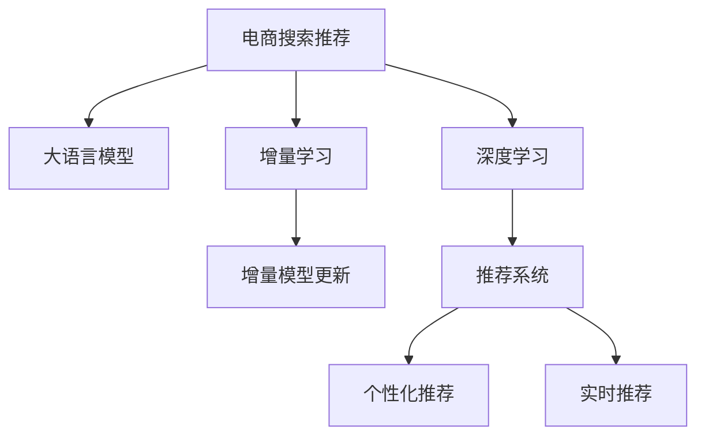

                 

# 电商搜索推荐中的AI大模型增量学习技术应用

> 关键词：电商搜索推荐,增量学习,增量模型更新,大语言模型,深度学习,推荐系统

## 1. 背景介绍

在电商行业，搜索推荐系统是用户获取商品信息的重要渠道。随着用户规模的快速增长和商品种类的不断丰富，传统基于规则、统计等简单算法的推荐系统难以满足复杂多变的用户需求。近年来，基于深度学习的推荐系统取得了显著的进展，以神经网络为代表的AI技术逐渐成为推荐算法的主流。

为了提升推荐系统的准确性和个性化程度，大语言模型在电商搜索推荐领域逐渐崭露头角。大模型可以通过海量的电商数据预训练，学习商品特征、用户行为等知识，为推荐系统提供强大的语义理解能力。然而，由于电商领域的数据特性和用户行为变化快，如何在大模型上高效更新，并适应新的数据分布，成为亟待解决的问题。

本文聚焦于电商搜索推荐中的大模型增量学习技术应用，介绍其核心概念、实现方法、技术优缺点及未来展望，旨在帮助电商从业者和AI开发者更好地理解和使用这一技术，构建高性能、高精度的推荐系统。

## 2. 核心概念与联系

### 2.1 核心概念概述

电商搜索推荐中的AI大模型增量学习，是指在已训练的大模型基础上，根据新的用户行为数据和商品信息，不断更新模型参数，以适应新的数据分布和用户需求。其核心思想是利用大模型的预训练知识，通过少量的增量学习，快速提升推荐系统的性能。

为了更好地理解增量学习的原理和架构，本节将介绍几个关键概念及其联系：

- **大语言模型(Large Language Model, LLM)**：以自回归(如GPT)或自编码(如BERT)模型为代表的大规模预训练语言模型。通过在大规模无标签文本语料上进行预训练，学习通用的语言表示，具备强大的语言理解和生成能力。
- **增量学习(Incremental Learning)**：指在大规模无标签文本语料上，通过有监督地训练，更新模型在特定任务上的性能。常见的增量学习方法包括批量更新、在线更新等。
- **增量模型更新(Incremental Model Update)**：指在已有模型的基础上，根据新的数据进行参数更新，保持模型性能的实时性和适应性。
- **深度学习(Deep Learning)**：利用神经网络模型，对大规模数据进行学习和训练，以解决复杂问题。深度学习在电商推荐系统中的应用广泛，包括商品分类、用户画像、交互预测等任务。
- **推荐系统(Recommendation System)**：通过分析用户行为数据，为用户推荐可能感兴趣的商品。推荐系统的好坏直接影响用户体验和平台收益。
- **个性化推荐(Personalized Recommendation)**：根据用户的个性化需求，推荐与其匹配度高的商品。个性化推荐是电商搜索推荐系统的核心目标。
- **实时推荐(Real-time Recommendation)**：在用户实时搜索或浏览商品时，动态更新推荐结果。实时推荐需要高效、稳定的推荐算法。

这些核心概念之间的逻辑关系可以通过以下Mermaid流程图来展示：



这个流程图展示了大语言模型在电商搜索推荐系统中的应用流程：

1. 电商搜索推荐系统通过大语言模型获取商品特征和用户行为，构建推荐策略。
2. 大语言模型通过增量学习不断更新，提升模型性能。
3. 深度学习模型利用大模型学习到的知识，构建推荐系统。
4. 推荐系统通过个性化推荐和实时推荐，提升用户体验和平台收益。

## 3. 核心算法原理 & 具体操作步骤
### 3.1 算法原理概述

电商搜索推荐中的大模型增量学习，本质上是一个有监督的增量学习过程。其核心思想是：将大语言模型视作一个强大的"特征提取器"，通过新增用户行为数据，利用增量学习技术，更新模型参数，使得模型能够更好地适应新的数据分布和用户需求。

形式化地，假设已训练的大语言模型为 $M_{\theta}$，其中 $\theta$ 为预训练得到的模型参数。给定电商领域的新用户行为数据集 $D=\{(x_i,y_i)\}_{i=1}^N$，其中 $x_i$ 为用户行为数据，$y_i$ 为商品ID，$x_i$ 和 $y_i$ 之间的关系可以表示为 $y_i=f(x_i;\theta)$。增量学习的目标是找到新的模型参数 $\hat{\theta}$，使得模型在新数据上的预测准确率最大化：

$$
\hat{\theta}=\mathop{\arg\min}_{\theta} \mathcal{L}(M_{\theta},D)
$$

其中 $\mathcal{L}$ 为损失函数，用于衡量模型在新数据上的预测准确率。常见的损失函数包括交叉熵损失、均方误差损失等。

通过梯度下降等优化算法，增量学习过程不断更新模型参数 $\theta$，最小化损失函数 $\mathcal{L}$，使得模型输出逼近真实标签。由于 $\theta$ 已经通过预训练获得了较好的初始化，因此即便在新的数据上更新，也能较快收敛到理想的模型参数 $\hat{\theta}$。

### 3.2 算法步骤详解

电商搜索推荐中的大模型增量学习一般包括以下几个关键步骤：

**Step 1: 准备增量数据和预训练模型**
- 收集新的用户行为数据集 $D$，包含用户浏览、点击、购买等行为记录，以及商品ID等标注信息。
- 准备电商领域已训练的大语言模型 $M_{\theta}$，如BERT、GPT等。

**Step 2: 任务适配层设计**
- 根据电商推荐任务，在预训练模型的顶层设计合适的输出层和损失函数。
- 对于推荐任务，通常使用二分类交叉熵损失函数，即 $y_i\log \hat{y}_i + (1-y_i)\log (1-\hat{y}_i)$。

**Step 3: 增量学习算法选择**
- 选择合适的增量学习算法，如批量更新、在线更新等。
- 根据增量数据的特点和模型大小，选择合适的学习率和更新策略。

**Step 4: 增量模型更新**
- 将新的用户行为数据 $D$ 分批次输入模型，前向传播计算损失函数。
- 反向传播计算参数梯度，根据设定的优化算法和学习率更新模型参数。
- 周期性在测试集上评估模型性能，根据性能指标决定是否触发增量学习。

**Step 5: 测试和部署**
- 在测试集上评估增量学习后的模型 $M_{\hat{\theta}}$ 的性能，对比增量前后的精度提升。
- 使用增量模型更新后的推荐系统进行实际推荐，集成到电商平台中。

以上是电商搜索推荐中大模型增量学习的一般流程。在实际应用中，还需要针对具体任务的特点，对增量学习过程的各个环节进行优化设计，如改进任务适配层，引入更多的正则化技术，搜索最优的超参数组合等，以进一步提升模型性能。

### 3.3 算法优缺点

电商搜索推荐中的大模型增量学习具有以下优点：
1. 快速适应：通过增量学习，模型能够快速适应新的数据分布和用户需求，实时更新推荐结果。
2. 计算资源高效：利用大模型的预训练知识，只更新少量参数，计算资源消耗较小。
3. 提升精度：利用增量学习，模型能够动态调整参数，提升推荐精度和个性化程度。
4. 易于部署：增量学习过程简洁高效，易于集成到电商平台，实现线上部署。

同时，该方法也存在一定的局限性：
1. 数据质量依赖度高：增量学习的效果很大程度上取决于增量数据的质量和数量，获取高质量增量数据的成本较高。
2. 模型泛化能力有限：当增量数据与预训练数据的分布差异较大时，增量学习的性能提升有限。
3. 过拟合风险：增量学习过程中，模型容易过拟合增量数据，忽略原有知识，影响推荐系统的一致性。
4. 更新频率限制：增量学习需要频繁更新模型，对电商平台的稳定性提出较高要求。

尽管存在这些局限性，但就目前而言，大模型增量学习仍是电商搜索推荐领域的重要技术范式。未来相关研究的重点在于如何进一步降低增量学习对增量数据的依赖，提高模型的泛化能力和稳定性，同时兼顾计算资源的高效利用。

### 3.4 算法应用领域

大模型增量学习在电商搜索推荐中的应用已经得到了广泛的应用，涵盖了电商推荐系统的多个关键环节，例如：

- **商品分类**：将新的商品数据通过增量学习，更新大模型中的商品表示，提升推荐结果的准确性。
- **用户画像**：利用用户的增量行为数据，更新大模型中的用户画像，提供更加精准的个性化推荐。
- **推荐系统训练**：在用户行为数据上，通过增量学习，更新推荐系统中的模型参数，提升推荐算法的效果。
- **交互预测**：预测用户对商品的兴趣和购买意向，更新大模型中的交互模型，增强推荐系统的预测能力。
- **实时推荐**：根据用户的实时搜索或浏览行为，通过增量学习，动态更新推荐结果，提高推荐系统的时间敏感性。

除了上述这些经典应用外，大模型增量学习还被创新性地应用到更多场景中，如广告投放、用户行为分析、智能客服等，为电商推荐系统带来了新的突破。随着预训练模型和增量学习方法的不断进步，相信电商推荐系统必将在更广泛的领域大放异彩。

## 4. 数学模型和公式 & 详细讲解  
### 4.1 数学模型构建

本节将使用数学语言对电商搜索推荐中的大模型增量学习过程进行更加严格的刻画。

记大语言模型为 $M_{\theta}$，其中 $\theta$ 为模型参数。假设电商领域的新增用户行为数据集为 $D=\{(x_i,y_i)\}_{i=1}^N, x_i \in \mathcal{X}, y_i \in \mathcal{Y}$。

定义模型 $M_{\theta}$ 在输入 $x_i$ 上的预测输出为 $\hat{y}_i=M_{\theta}(x_i)$。增量学习的目标是最小化损失函数 $\mathcal{L}(\theta)$，即：

$$
\mathcal{L}(\theta) = -\frac{1}{N}\sum_{i=1}^N \ell(y_i, \hat{y}_i)
$$

其中 $\ell$ 为损失函数，可以是交叉熵、均方误差等。根据具体的任务，可以选用不同的损失函数。

### 4.2 公式推导过程

以二分类任务为例，增量学习的过程可以通过以下公式进行推导：

假设模型 $M_{\theta}$ 在输入 $x_i$ 上的预测输出为 $\hat{y}_i=M_{\theta}(x_i)$，真实标签 $y_i \in \{0,1\}$。则二分类交叉熵损失函数定义为：

$$
\ell(y_i, \hat{y}_i) = -[y_i\log \hat{y}_i + (1-y_i)\log (1-\hat{y}_i)]
$$

将其代入损失函数公式，得：

$$
\mathcal{L}(\theta) = -\frac{1}{N}\sum_{i=1}^N [y_i\log \hat{y}_i+(1-y_i)\log(1-\hat{y}_i)]
$$

在得到损失函数 $\mathcal{L}(\theta)$ 后，即可带入优化算法，如Adam、SGD等，进行参数更新。

### 4.3 案例分析与讲解

以电商推荐系统中的商品分类任务为例，我们展示增量学习过程的具体实现。

假设电商推荐系统需要分类商品类别，已知商品的描述、图片、用户行为数据等。首先，我们利用预训练的大语言模型 $M_{\theta}$ 学习商品表示，将其转化为向量形式 $z=\mathrm{Softmax}(M_{\theta}(x_i))$，其中 $\mathrm{Softmax}$ 函数用于将模型输出转化为概率分布。

然后，我们将新的商品数据集 $D$ 输入模型，计算损失函数 $\mathcal{L}(\theta)$。通过反向传播算法计算梯度，更新模型参数 $\theta$，使其更准确地分类新商品。

具体的增量学习过程包括：
1. 准备新商品数据集 $D$，包含商品的描述、图片等。
2. 将 $D$ 数据分批次输入模型 $M_{\theta}$，计算预测输出 $\hat{y}$。
3. 计算损失函数 $\mathcal{L}(\theta)$，通过反向传播算法计算梯度。
4. 使用Adam、SGD等优化算法，更新模型参数 $\theta$。
5. 周期性在测试集上评估模型性能，决定是否触发增量学习。

## 5. 项目实践：代码实例和详细解释说明
### 5.1 开发环境搭建

在进行增量学习实践前，我们需要准备好开发环境。以下是使用Python进行TensorFlow开发的环境配置流程：

1. 安装Anaconda：从官网下载并安装Anaconda，用于创建独立的Python环境。

2. 创建并激活虚拟环境：
```bash
conda create -n tf-env python=3.8 
conda activate tf-env
```

3. 安装TensorFlow：根据CUDA版本，从官网获取对应的安装命令。例如：
```bash
conda install tensorflow=2.7.0 -c pytorch -c conda-forge
```

4. 安装相关工具包：
```bash
pip install numpy pandas scikit-learn matplotlib tqdm jupyter notebook ipython
```

完成上述步骤后，即可在`tf-env`环境中开始增量学习实践。

### 5.2 源代码详细实现

这里我们以电商推荐系统中的商品分类任务为例，给出使用TensorFlow进行BERT模型增量学习的PyTorch代码实现。

首先，定义商品分类任务的数据处理函数：

```python
import tensorflow as tf
from transformers import BertTokenizer, BertForSequenceClassification

class Dataset(tf.data.Dataset):
    def __init__(self, texts, labels, tokenizer, max_len=128):
        self.texts = texts
        self.labels = labels
        self.tokenizer = tokenizer
        self.max_len = max_len
        
    def __len__(self):
        return len(self.texts)
    
    def __getitem__(self, item):
        text = self.texts[item]
        label = self.labels[item]
        
        encoding = self.tokenizer(text, return_tensors='tf', max_length=self.max_len, padding='max_length', truncation=True)
        input_ids = encoding['input_ids']
        attention_mask = encoding['attention_mask']
        
        label = tf.convert_to_tensor(label, dtype=tf.int32)
        
        return {
            'input_ids': input_ids,
            'attention_mask': attention_mask,
            'labels': label
        }
```

然后，定义模型和优化器：

```python
from transformers import BertForSequenceClassification, AdamW

model = BertForSequenceClassification.from_pretrained('bert-base-cased', num_labels=10)

optimizer = AdamW(model.parameters(), lr=2e-5)
```

接着，定义训练和评估函数：

```python
def train_step(model, tokenizer, batch, loss_fn):
    inputs = tokenizer(batch['text'], padding='max_length', truncation=True, return_tensors='tf')
    with tf.GradientTape() as tape:
        outputs = model(inputs['input_ids'], attention_mask=inputs['attention_mask'])
        loss = loss_fn(outputs.logits, batch['labels'])
    grads = tape.gradient(loss, model.parameters())
    optimizer.apply_gradients(zip(grads, model.parameters()))
    return loss

def evaluate(model, tokenizer, test_dataset):
    eval_loss = 0.0
    with tf.GradientTape() as tape:
        for batch in test_dataset:
            inputs = tokenizer(batch['text'], padding='max_length', truncation=True, return_tensors='tf')
            outputs = model(inputs['input_ids'], attention_mask=inputs['attention_mask'])
            loss = tf.reduce_mean(outputs.loss)
            eval_loss += loss.numpy()
    return eval_loss / len(test_dataset)
```

最后，启动训练流程并在测试集上评估：

```python
epochs = 5
batch_size = 16

for epoch in range(epochs):
    train_loss = 0.0
    for batch in train_dataset:
        train_loss += train_step(model, tokenizer, batch, tf.keras.losses.SparseCategoricalCrossentropy())
    print(f"Epoch {epoch+1}, train loss: {train_loss:.3f}")
    
    print(f"Epoch {epoch+1}, dev results:")
    dev_loss = evaluate(model, tokenizer, dev_dataset)
    print(f"dev loss: {dev_loss:.3f}")

print("Test results:")
test_loss = evaluate(model, tokenizer, test_dataset)
print(f"test loss: {test_loss:.3f}")
```

以上就是使用TensorFlow对BERT进行商品分类任务增量学习的完整代码实现。可以看到，得益于TensorFlow的强大封装，我们可以用相对简洁的代码完成BERT模型的增量训练。

### 5.3 代码解读与分析

让我们再详细解读一下关键代码的实现细节：

**Dataset类**：
- `__init__`方法：初始化文本、标签、分词器等关键组件。
- `__len__`方法：返回数据集的样本数量。
- `__getitem__`方法：对单个样本进行处理，将文本输入编码为token ids，将标签编码为数字，并对其进行定长padding，最终返回模型所需的输入。

**train_step函数**：
- 使用TensorFlow的DataLoader对数据集进行批次化加载，供模型训练和推理使用。
- 在每个批次上前向传播计算损失函数，通过反向传播计算梯度。
- 使用AdamW优化算法更新模型参数。
- 返回该批次上的损失值。

**evaluate函数**：
- 在测试集上评估增量学习后的模型，计算平均损失值。

**训练流程**：
- 定义总的epoch数和batch size，开始循环迭代
- 每个epoch内，先在训练集上训练，输出平均损失值
- 在验证集上评估，输出平均损失值
- 所有epoch结束后，在测试集上评估，给出最终测试结果

可以看到，TensorFlow配合BERT模型的代码实现变得简洁高效。开发者可以将更多精力放在数据处理、模型改进等高层逻辑上，而不必过多关注底层的实现细节。

当然，工业级的系统实现还需考虑更多因素，如模型的保存和部署、超参数的自动搜索、更灵活的任务适配层等。但核心的增量学习范式基本与此类似。

## 6. 实际应用场景
### 6.1 智能推荐系统

基于大语言模型增量学习的智能推荐系统，可以广泛应用于电商推荐场景。传统推荐系统往往依赖固定的规则和算法，难以适应用户行为的多样性和商品种类的变化。而利用增量学习，推荐系统能够实时更新模型，动态调整推荐策略，提升推荐效果。

在技术实现上，可以收集用户的浏览、点击、购买等行为数据，利用增量学习更新大模型，学习用户偏好和商品特征。同时，引入在线学习算法，动态更新模型参数，实时生成推荐结果。如此构建的智能推荐系统，能显著提升推荐精度和用户体验。

### 6.2 实时广告投放

电商平台的广告投放需要精准的定向和效果评估。传统的广告投放系统往往依赖人工规则或简单模型，难以实现高效、精准的广告投放。基于大语言模型增量学习，广告系统可以通过增量学习实时更新模型，根据用户行为数据，动态调整广告投放策略。

在实现上，可以将用户的浏览、点击、转化等行为数据作为增量数据，利用增量学习更新模型参数，学习用户的兴趣和行为特征。广告投放系统根据更新后的模型，生成更精准的广告投放方案，提高广告投放的转化率和效果。

### 6.3 用户行为分析

电商平台需要实时监控用户行为，预测用户需求，提高运营效率。传统的用户行为分析系统往往依赖复杂统计模型，难以捕捉用户行为变化的细节。利用增量学习，大模型能够实时更新用户画像，预测用户行为，提供更准确的用户行为分析报告。

在实现上，可以将用户的历史行为数据、实时行为数据作为增量数据，利用增量学习更新大模型，学习用户行为特征。用户行为分析系统根据更新后的模型，生成更精准的用户行为预测报告，帮助电商平台优化运营策略。

### 6.4 未来应用展望

随着大语言模型增量学习技术的不断发展，其在电商搜索推荐领域的应用前景将更加广阔。未来，可以探索更多创新应用场景，提升电商推荐系统的智能化水平。

1. **个性化推荐**：结合用户画像和商品特征，利用增量学习实时生成个性化推荐结果，提升推荐系统的精准度和用户体验。

2. **商品分类**：利用增量学习动态更新商品表示，提高商品分类的准确性和实时性。

3. **实时广告投放**：结合用户行为数据和实时数据，利用增量学习动态调整广告投放策略，提高广告投放的转化率和效果。

4. **用户行为分析**：结合历史和实时行为数据，利用增量学习动态更新用户画像，提供更精准的用户行为预测报告，优化运营策略。

5. **多模态推荐**：结合图像、语音、文本等多种数据源，利用增量学习动态生成多模态推荐结果，提升推荐系统的丰富性和多样性。

6. **在线客服**：结合用户聊天记录，利用增量学习动态更新对话模型，生成更精准的客户服务回复，提高客户满意度。

这些应用场景的探索将进一步提升电商推荐系统的智能化水平，为电商平台的业务发展提供更强大的技术支撑。

## 7. 工具和资源推荐
### 7.1 学习资源推荐

为了帮助开发者系统掌握大模型增量学习理论基础和实践技巧，这里推荐一些优质的学习资源：

1. **《深度学习》课程**：斯坦福大学开设的深度学习经典课程，涵盖深度学习的基本概念和算法，适合初学者入门。

2. **《自然语言处理入门》书籍**：全面介绍了自然语言处理的基本理论和应用，包括推荐系统、情感分析、机器翻译等任务。

3. **《Transformer from Scratch》博文**：介绍了Transformer模型的原理和实现方法，适合有一定深度学习基础的用户。

4. **《TensorFlow教程》书籍**：TensorFlow官方文档，全面介绍了TensorFlow的基本功能和使用方法，适合TensorFlow用户。

5. **《Reinforcement Learning for Recommendation Systems》论文**：介绍了强化学习在推荐系统中的应用，适合对推荐系统感兴趣的用户。

通过对这些资源的学习实践，相信你一定能够快速掌握大模型增量学习的精髓，并用于解决实际的电商推荐问题。

### 7.2 开发工具推荐

高效的开发离不开优秀的工具支持。以下是几款用于大模型增量学习的常用工具：

1. **TensorFlow**：由Google主导开发的开源深度学习框架，生产部署方便，适合大规模工程应用。

2. **PyTorch**：基于Python的开源深度学习框架，灵活动态的计算图，适合快速迭代研究。

3. **Jupyter Notebook**：交互式笔记本，支持代码、文本、图表等混合输入，适合快速开发和调试。

4. **TensorBoard**：TensorFlow配套的可视化工具，可实时监测模型训练状态，并提供丰富的图表呈现方式。

5. **Weights & Biases**：模型训练的实验跟踪工具，可以记录和可视化模型训练过程中的各项指标。

6. **HuggingFace Transformers库**：提供了丰富的大模型预训练资源，支持多种深度学习框架。

合理利用这些工具，可以显著提升大模型增量学习的开发效率，加快创新迭代的步伐。

### 7.3 相关论文推荐

大模型增量学习技术的不断发展源于学界的持续研究。以下是几篇奠基性的相关论文，推荐阅读：

1. **《Neural Recommendation Algorithms》**：介绍了神经网络在推荐系统中的应用，包括基于自编码器和深度强化学习的推荐算法。

2. **《Differentially Private Stochastic Gradient Descent》**：介绍了差分隐私下的增量学习算法，保护用户隐私的同时，提高增量学习的泛化能力。

3. **《Fine-tuning Large Pre-trained Language Models for recommendation system》**：介绍了大模型在推荐系统中的应用，包括基于微调和自监督的推荐方法。

4. **《Incremental Deep Learning》**：介绍了增量学习的基本概念和算法，涵盖在线学习、批量学习等多种增量学习范式。

5. **《Deep reinforcement learning for personalised product recommendation》**：介绍了强化学习在推荐系统中的应用，包括推荐策略的动态调整和个性化推荐。

这些论文代表了大模型增量学习技术的发展脉络。通过学习这些前沿成果，可以帮助研究者把握学科前进方向，激发更多的创新灵感。

## 8. 总结：未来发展趋势与挑战

### 8.1 总结

本文对电商搜索推荐中的大模型增量学习技术应用进行了全面系统的介绍。首先阐述了大模型增量学习的背景和意义，明确了增量学习在提升推荐系统性能、适应数据变化等方面的独特价值。其次，从原理到实践，详细讲解了增量学习的数学原理和关键步骤，给出了增量学习任务开发的完整代码实例。同时，本文还广泛探讨了增量学习技术在电商推荐系统的多个关键环节中的应用前景，展示了增量学习范式的巨大潜力。

通过本文的系统梳理，可以看到，大模型增量学习技术在电商推荐系统中的应用前景广阔，能够显著提升推荐系统的性能和用户体验。得益于大模型的预训练知识，增量学习模型能够快速适应新的数据分布和用户需求，实时更新推荐策略。同时，增量学习技术具有高效计算资源利用、灵活模型更新等优点，适合电商平台的业务需求。

### 8.2 未来发展趋势

展望未来，大模型增量学习技术将呈现以下几个发展趋势：

1. **计算资源更高效**：随着硬件性能的提升和算法优化，增量学习模型的计算资源利用将更加高效，能够实现更高精度的推荐结果。

2. **模型泛化能力更强**：结合更多先验知识和领域数据，增量学习模型能够更好地适应不同领域和数据分布，提高推荐系统的泛化能力。

3. **实时推荐精度更高**：利用在线学习算法，增量学习模型能够实时更新推荐结果，动态调整推荐策略，提高实时推荐的精度和效率。

4. **多模态融合更深入**：结合图像、语音、文本等多种数据源，利用增量学习动态生成多模态推荐结果，提升推荐系统的丰富性和多样性。

5. **个性化推荐更精准**：利用增量学习动态更新用户画像和商品特征，提高个性化推荐的精准度和实时性。

6. **用户行为分析更智能**：结合历史和实时行为数据，利用增量学习动态更新用户画像，提供更精准的用户行为预测报告，优化运营策略。

以上趋势凸显了大模型增量学习技术的广阔前景。这些方向的探索发展，必将进一步提升电商推荐系统的智能化水平，为电商平台的业务发展提供更强大的技术支撑。

### 8.3 面临的挑战

尽管大模型增量学习技术已经取得了显著进展，但在迈向更加智能化、普适化应用的过程中，它仍面临着诸多挑战：

1. **数据质量依赖度高**：增量学习的效果很大程度上取决于增量数据的质量和数量，获取高质量增量数据的成本较高。

2. **模型泛化能力有限**：当增量数据与预训练数据的分布差异较大时，增量学习的性能提升有限。

3. **过拟合风险**：增量学习过程中，模型容易过拟合增量数据，忽略原有知识，影响推荐系统的一致性。

4. **更新频率限制**：增量学习需要频繁更新模型，对电商平台的稳定性提出较高要求。

尽管存在这些挑战，但通过持续的技术创新和优化，相信大模型增量学习技术将不断突破瓶颈，实现更高效、更智能的电商推荐系统。

### 8.4 研究展望

面对大模型增量学习所面临的挑战，未来的研究需要在以下几个方面寻求新的突破：

1. **降低增量学习对增量数据的依赖**：探索更多无监督和半监督增量学习方法，最大限度利用非结构化数据，提高增量学习的泛化能力。

2. **提高增量模型的稳定性**：结合差分隐私等技术，保护用户隐私的同时，提高增量模型的鲁棒性和泛化能力。

3. **优化增量学习的计算效率**：结合优化算法和硬件加速，提高增量学习的计算效率，实现更高精度的推荐结果。

4. **增强增量模型的多模态融合能力**：结合图像、语音、文本等多种数据源，利用增量学习动态生成多模态推荐结果，提升推荐系统的丰富性和多样性。

5. **提高增量模型的个性化推荐能力**：利用增量学习动态更新用户画像和商品特征，提高个性化推荐的精准度和实时性。

6. **提升增量模型的实时推荐能力**：利用在线学习算法，增量学习模型能够实时更新推荐结果，动态调整推荐策略，提高实时推荐的精度和效率。

这些研究方向的探索，必将引领大模型增量学习技术迈向更高的台阶，为构建高性能、高精度的推荐系统铺平道路。只有勇于创新、敢于突破，才能不断拓展增量学习技术的边界，让智能技术更好地造福人类社会。

## 9. 附录：常见问题与解答

**Q1：增量学习在电商推荐系统中有什么优势？**

A: 增量学习在电商推荐系统中的优势主要体现在以下几个方面：

1. **快速适应**：电商领域的数据特性和用户行为变化快，增量学习能够实时更新模型，快速适应新的数据分布和用户需求。

2. **高效计算资源利用**：利用大模型的预训练知识，只更新少量参数，计算资源消耗较小。

3. **提升推荐精度**：利用增量学习，模型能够动态调整参数，提升推荐精度和个性化程度。

4. **易于部署**：增量学习过程简洁高效，易于集成到电商平台，实现线上部署。

**Q2：增量学习中如何处理过拟合问题？**

A: 增量学习过程中，模型容易过拟合增量数据，忽略原有知识，影响推荐系统的一致性。为了处理过拟合问题，可以采取以下方法：

1. **正则化**：使用L2正则、Dropout、Early Stopping等技术，防止模型过拟合增量数据。

2. **批量更新**：将增量数据分为若干批次更新模型参数，避免一次性更新过多数据导致过拟合。

3. **混合精度训练**：使用混合精度训练，提高模型的计算效率，同时减少过拟合风险。

4. **增量数据质量控制**：通过数据清洗和预处理，提高增量数据的质量，减少过拟合的风险。

5. **模型结构优化**：通过模型裁剪、参数共享等技术，减小模型的复杂度，降低过拟合的风险。

**Q3：增量学习如何与电商平台的实时需求结合？**

A: 增量学习能够实时更新模型，动态调整推荐策略，满足电商平台的实时需求。具体来说，可以通过以下几个步骤实现：

1. **数据流处理**：实时采集用户的浏览、点击、购买等行为数据，进行数据清洗和预处理。

2. **增量模型更新**：将实时数据输入模型，利用增量学习更新模型参数，学习新的用户行为特征。

3. **实时推荐生成**：根据更新后的模型，实时生成推荐结果，动态调整推荐策略。

4. **反馈循环**：将实时推荐的反馈信息重新输入模型，进一步优化推荐策略，形成反馈循环。

通过数据流处理和实时推荐生成，增量学习能够动态调整推荐策略，满足电商平台的实时需求，提升推荐系统的精准度和用户体验。

**Q4：增量学习在电商推荐系统中的实现难点是什么？**

A: 增量学习在电商推荐系统中的实现难点主要包括以下几个方面：

1. **数据处理**：电商领域的数据规模大，数据质量参差不齐，需要进行数据清洗、预处理和特征工程。

2. **模型选择**：电商推荐系统涉及多种任务，需要选择合适的模型结构和算法，同时考虑模型的可扩展性和可维护性。

3. **增量数据管理**：电商平台需要实时采集用户行为数据，如何高效管理增量数据，避免数据丢失和重复是实现增量学习的关键。

4. **模型部署**：增量学习模型需要在电商平台上部署，需要考虑模型的存储、计算和性能优化。

5. **安全性和隐私保护**：电商平台涉及用户的隐私数据，如何保护用户隐私，同时保证推荐系统的安全性和稳定性是实现增量学习的难点。

只有有效解决这些难点，才能实现高性能、高精度的电商推荐系统，满足电商平台的业务需求。

