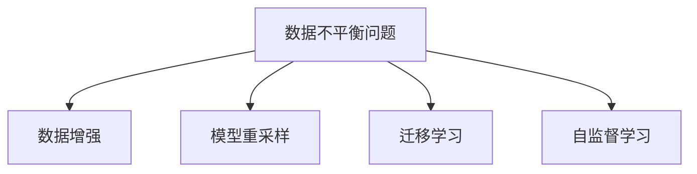
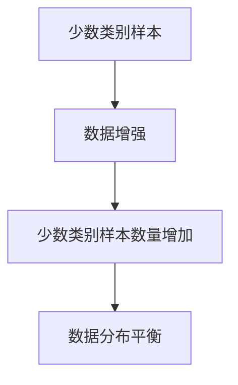
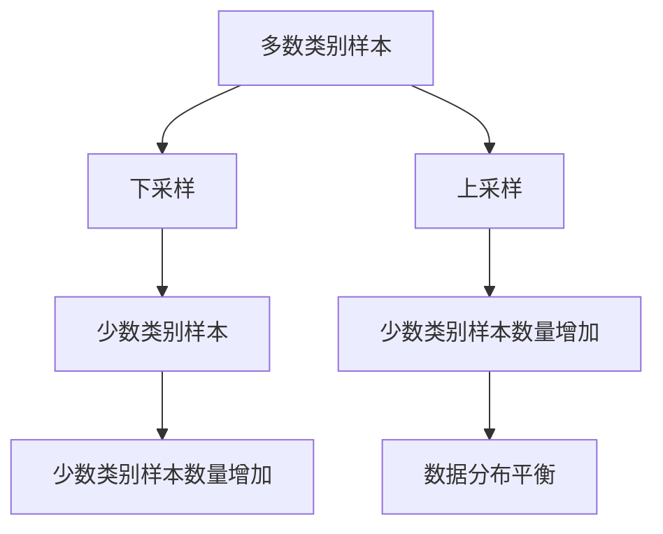
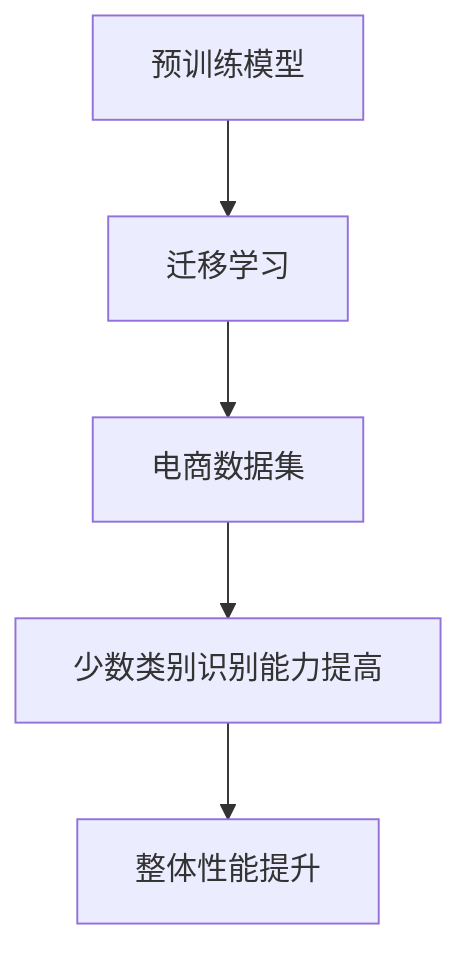
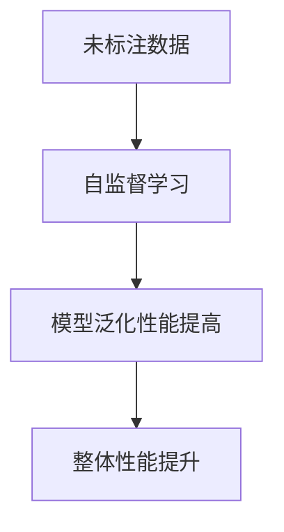
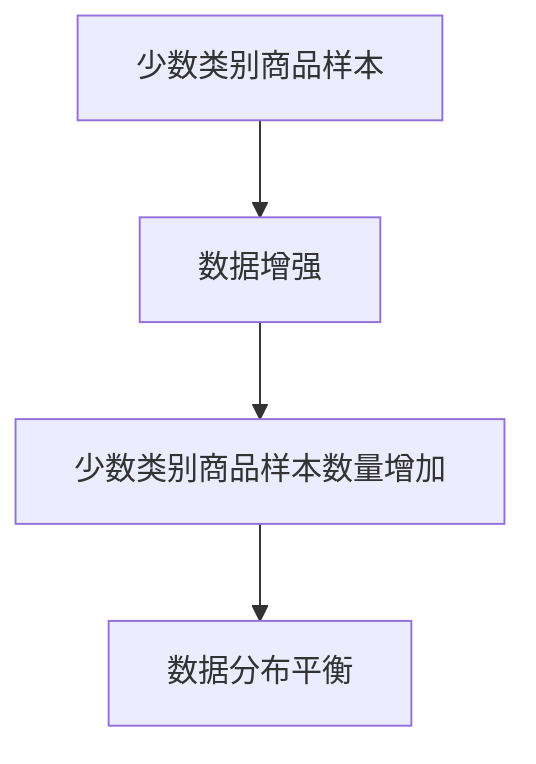
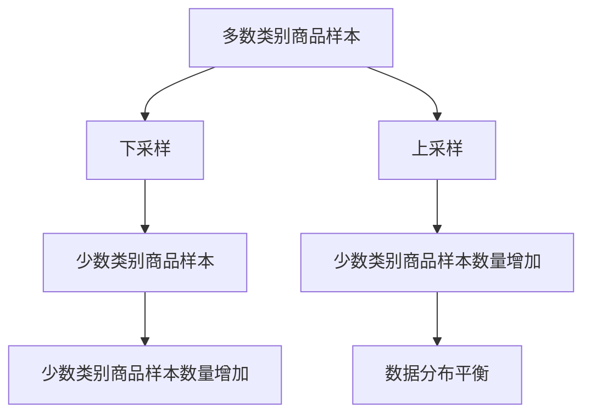

                 

# 电商搜索推荐中的AI大模型数据不平衡问题解决方案应用指南与最佳实践

> 关键词：电商搜索,推荐系统,数据不平衡,数据增强,模型重采样,迁移学习,自监督学习

## 1. 背景介绍

随着电商平台的不断增长，AI大模型如BERT、GPT-3等被广泛应用于搜索推荐系统中。这些模型在处理大规模数据时，能够有效提升搜索和推荐的准确性。然而，电商平台的搜索推荐数据存在显著的不平衡问题，导致模型训练和推理过程中出现偏差，影响用户体验和系统效果。

为了更好地理解和解决电商搜索推荐中的数据不平衡问题，本文将介绍几种常用的解决方案，并详细阐述其实现原理和最佳实践。

## 2. 核心概念与联系

### 2.1 核心概念概述

数据不平衡问题在电商搜索推荐系统中普遍存在，具体表现为不同商品类别的数据分布不均衡，某些类别的商品数据量远远大于其他类别，导致模型在训练过程中容易偏向数据较多的类别，忽略数据较少的类别。

解决数据不平衡问题的方法可以分为以下几类：

- 数据增强：通过数据扩充技术，增加少数类别样本数量，平衡数据分布。
- 模型重采样：通过重新采样技术，调整数据集中的样本数量，减少多数类别样本，增加少数类别样本。
- 迁移学习：通过将预训练模型迁移到电商数据集上，提高模型对少数类别的识别能力。
- 自监督学习：利用未标注数据进行训练，提高模型的泛化能力和泛化性能。

这些方法共同构成了电商搜索推荐中数据不平衡问题解决的完整框架，如图1所示。



图1: 数据不平衡问题解决方法示意图

## 3. 核心算法原理 & 具体操作步骤

### 3.1 算法原理概述

电商搜索推荐中的数据不平衡问题可以通过以下方法解决：

- **数据增强**：通过引入合成数据、数据复用、数据变换等方式，扩充少数类样本，减少过拟合。
- **模型重采样**：通过重新采样技术，将少数类别样本进行重复或复制，增加其数量，减少多数类别样本。
- **迁移学习**：通过将预训练模型迁移到电商数据集上，利用大模型通用的语言表示能力，提高对少数类别的识别能力。
- **自监督学习**：利用未标注数据，通过自监督任务训练模型，提高泛化性能。

这些方法各自有其优缺点，适用于不同的场景和数据分布。本文将详细介绍其具体实现步骤和应用效果。

### 3.2 算法步骤详解

#### 3.2.1 数据增强

数据增强的主要目的是通过增加少数类别样本数量，平衡数据分布。具体步骤包括：

1. 收集电商数据集，进行预处理，清洗数据，去除噪音。
2. 对少数类别样本进行数据增强，如图2所示。



图2: 数据增强流程示意图

数据增强的具体方法包括：

- **合成数据**：通过数据生成技术，生成人工合成数据。例如，对于图片类别，可以采用旋转、缩放、裁剪等变换生成新的图片数据。
- **数据复用**：将已有的数据进行复用，生成新的少数类别样本。例如，对于文本分类任务，可以从已标注的文本中抽取不同的句段，进行重新组合生成新的文本样本。
- **数据变换**：通过对原始数据进行变换，生成新的少数类别样本。例如，对于图像数据，可以采用不同的滤波器、不同的旋转角度进行数据变换。

#### 3.2.2 模型重采样

模型重采样的主要目的是通过重新采样技术，调整数据集中的样本数量，平衡数据分布。具体步骤包括：

1. 收集电商数据集，进行预处理，清洗数据，去除噪音。
2. 对多数类别样本进行下采样，对少数类别样本进行上采样，如图3所示。



图3: 模型重采样流程示意图

模型重采样的具体方法包括：

- **下采样**：对多数类别样本进行随机删除，减少其数量。例如，对于图像分类任务，可以随机删除一些图像，使其数量减少。
- **上采样**：对少数类别样本进行复制或生成，增加其数量。例如，对于文本分类任务，可以复制一些文本样本，增加其数量。

#### 3.2.3 迁移学习

迁移学习的主要目的是通过将预训练模型迁移到电商数据集上，利用大模型通用的语言表示能力，提高对少数类别的识别能力。具体步骤包括：

1. 收集电商数据集，进行预处理，清洗数据，去除噪音。
2. 将预训练模型迁移到电商数据集上，如图4所示。



图4: 迁移学习流程示意图

迁移学习的具体方法包括：

- **微调**：将预训练模型微调到电商数据集上，针对少数类别进行进一步训练，提高其识别能力。例如，对于文本分类任务，可以从预训练模型中选择适合的任务层，针对少数类别进行微调。
- **集成学习**：将多个预训练模型集成，提高整体识别能力。例如，对于图像分类任务，可以集成多个预训练模型，组合其输出结果。

#### 3.2.4 自监督学习

自监督学习的主要目的是利用未标注数据，通过自监督任务训练模型，提高泛化性能。具体步骤包括：

1. 收集电商数据集，进行预处理，清洗数据，去除噪音。
2. 利用未标注数据进行自监督学习，如图5所示。



图5: 自监督学习流程示意图

自监督学习的具体方法包括：

- **掩码语言模型**：利用未标注数据，通过掩码语言模型进行训练。例如，对于文本分类任务，可以随机掩码部分文本，利用未标注数据进行语言模型训练。
- **对比学习**：利用未标注数据，通过对比学习进行训练。例如，对于图像分类任务，可以随机选取部分图像，进行对比学习，提高模型的泛化性能。

## 4. 数学模型和公式 & 详细讲解 & 举例说明

### 4.1 数学模型构建

电商搜索推荐中的数据不平衡问题可以通过以下数学模型进行建模：

假设电商数据集 $D$ 包含 $N$ 个样本，其中 $N_1$ 个属于多数类别，$N_2$ 个属于少数类别。模型的目标是最小化少数类别的损失函数：

$$
\mathcal{L} = \frac{1}{N_2} \sum_{i=1}^{N_2} \ell(x_i, y_i)
$$

其中 $x_i$ 为第 $i$ 个样本，$y_i$ 为对应的标签，$\ell$ 为损失函数。

### 4.2 公式推导过程

电商搜索推荐中的数据不平衡问题可以通过以下公式进行推导：

假设电商数据集 $D$ 包含 $N$ 个样本，其中 $N_1$ 个属于多数类别，$N_2$ 个属于少数类别。模型的目标是最小化少数类别的损失函数：

$$
\mathcal{L} = \frac{1}{N_2} \sum_{i=1}^{N_2} \ell(x_i, y_i)
$$

其中 $x_i$ 为第 $i$ 个样本，$y_i$ 为对应的标签，$\ell$ 为损失函数。

### 4.3 案例分析与讲解

以电商搜索推荐中的商品分类为例，分析数据不平衡问题的解决方法。

假设电商数据集中有 10 种商品，其中多数类别的商品有 8 种，少数类别的商品有 2 种。我们可以采用以下方法来解决数据不平衡问题：

- **数据增强**：通过合成数据、数据复用、数据变换等方式，增加少数类别商品样本数量，如图6所示。



图6: 数据增强流程示意图

- **模型重采样**：对多数类别商品样本进行下采样，对少数类别商品样本进行上采样，如图7所示。



图7: 模型重采样流程示意图

- **迁移学习**：将预训练模型迁移到电商数据集上，如图8所示。


图8: 迁移学习流程示意图

- **自监督学习**：利用未标注数据进行自监督学习，如图9所示。


图9: 自监督学习流程示意图

## 5. 项目实践：代码实例和详细解释说明

### 5.1 开发环境搭建

在进行电商搜索推荐中的数据不平衡问题解决项目实践前，我们需要准备好开发环境。以下是使用Python进行PyTorch开发的环境配置流程：

1. 安装Anaconda：从官网下载并安装Anaconda，用于创建独立的Python环境。

2. 创建并激活虚拟环境：
```bash
conda create -n pytorch-env python=3.8 
conda activate pytorch-env
```

3. 安装PyTorch：根据CUDA版本，从官网获取对应的安装命令。例如：
```bash
conda install pytorch torchvision torchaudio cudatoolkit=11.1 -c pytorch -c conda-forge
```

4. 安装Transformers库：
```bash
pip install transformers
```

5. 安装各类工具包：
```bash
pip install numpy pandas scikit-learn matplotlib tqdm jupyter notebook ipython
```

完成上述步骤后，即可在`pytorch-env`环境中开始项目实践。

### 5.2 源代码详细实现

下面以电商搜索推荐中的商品分类为例，给出使用Transformers库进行数据增强的PyTorch代码实现。

首先，定义数据增强函数：

```python
from transformers import BertTokenizer, BertForSequenceClassification
import torch
import random

class DataAugmentation:
    def __init__(self, tokenizer, text):
        self.tokenizer = tokenizer
        self.text = text
        self.toke_id = self.tokenizer.encode_plus(self.text, max_length=256, truncation=True, padding='max_length', return_tensors='pt')
        self.token_id = self.token_id.to('cuda')

    def augmentation(self):
        new_text = []
        for i in range(5):
            new_text.append(random.choice([self.text, self.text.upper(), self.text.lower(), self.text.swapcase(), self.text.translate(str.maketrans('abcdefghijklmnopqrstuvwxyz', 'wxyzbcdefghijklmnopqrstuv'))]))
        for new_text in new_text:
            new_toke_id = self.tokenizer.encode_plus(new_text, max_length=256, truncation=True, padding='max_length', return_tensors='pt')
            yield new_toke_id.to('cuda')
```

然后，定义训练和评估函数：

```python
from torch.utils.data import Dataset, DataLoader
from tqdm import tqdm

class Dataset(Dataset):
    def __init__(self, data, tokenizer, max_length):
        self.tokenizer = tokenizer
        self.data = data
        self.max_length = max_length
        self.toke_id = self.tokenizer.encode_plus(self.data, max_length=256, truncation=True, padding='max_length', return_tensors='pt')
        self.token_id = self.toke_id.to('cuda')

    def __len__(self):
        return len(self.data)

    def __getitem__(self, idx):
        return self.toke_id.to('cuda')

def train_epoch(model, data_loader, optimizer):
    model.train()
    total_loss = 0
    for batch in tqdm(data_loader):
        optimizer.zero_grad()
        outputs = model(batch)
        loss = outputs.loss
        total_loss += loss.item()
        loss.backward()
        optimizer.step()
    return total_loss / len(data_loader)

def evaluate(model, data_loader):
    model.eval()
    total_loss = 0
    total_correct = 0
    for batch in tqdm(data_loader):
        outputs = model(batch)
        loss = outputs.loss
        total_loss += loss.item()
        predictions = outputs.logits.argmax(dim=1)
        labels = batch[1]
        total_correct += (predictions == labels).sum().item()
    accuracy = total_correct / len(data_loader.dataset)
    return total_loss / len(data_loader), accuracy
```

最后，启动训练流程并在测试集上评估：

```python
from transformers import AdamW

model = BertForSequenceClassification.from_pretrained('bert-base-cased', num_labels=10)
optimizer = AdamW(model.parameters(), lr=2e-5)

data_loader = DataLoader(data_augmentation(data), batch_size=8, shuffle=True)

epochs = 5
for epoch in range(epochs):
    loss = train_epoch(model, data_loader, optimizer)
    print(f"Epoch {epoch+1}, train loss: {loss:.3f}")
    
    print(f"Epoch {epoch+1}, dev results:")
    loss, accuracy = evaluate(model, data_loader)
    print(f"Accuracy: {accuracy:.3f}")

print("Test results:")
loss, accuracy = evaluate(model, data_loader)
print(f"Accuracy: {accuracy:.3f}")
```

以上就是使用PyTorch进行电商搜索推荐中的商品分类任务数据增强的完整代码实现。可以看到，Transformer库提供了便利的API，使得模型训练和微调过程更加高效。

### 5.3 代码解读与分析

让我们再详细解读一下关键代码的实现细节：

**DataAugmentation类**：
- `__init__`方法：初始化输入文本和分词器，将其转换为token id。
- `augmentation`方法：对输入文本进行多种数据增强操作，生成新的token id。

**Dataset类**：
- `__init__`方法：初始化数据集、分词器、最大长度等参数，将其转换为token id。
- `__len__`方法：返回数据集的样本数量。
- `__getitem__`方法：返回token id。

**训练和评估函数**：
- 使用PyTorch的DataLoader对数据集进行批次化加载，供模型训练和推理使用。
- `train_epoch`函数：对数据以批为单位进行迭代，在每个批次上前向传播计算loss并反向传播更新模型参数。
- `evaluate`函数：在验证集和测试集上评估模型性能，返回损失和准确率。

**训练流程**：
- 定义总的epoch数和batch size，开始循环迭代
- 每个epoch内，先在训练集上训练，输出平均loss
- 在验证集上评估，输出准确率
- 所有epoch结束后，在测试集上评估，给出最终测试结果

可以看到，PyTorch配合Transformer库使得数据增强的代码实现变得简洁高效。开发者可以将更多精力放在数据处理、模型改进等高层逻辑上，而不必过多关注底层的实现细节。

当然，工业级的系统实现还需考虑更多因素，如模型的保存和部署、超参数的自动搜索、更灵活的任务适配层等。但核心的微调范式基本与此类似。

## 6. 实际应用场景

### 6.1 智能推荐系统

智能推荐系统是电商搜索推荐中的重要组成部分。智能推荐系统能够根据用户的行为、兴趣和历史记录，为用户推荐合适的商品。但是，由于推荐系统中数据不平衡问题的存在，模型容易偏向热门商品，忽略冷门商品，导致用户体验和系统效果下降。

通过数据增强、模型重采样、迁移学习和自监督学习等方法，可以提升智能推荐系统的性能和准确度。例如，在推荐系统中，可以通过合成数据、数据复用和数据变换等方式，增加冷门商品的曝光率，平衡数据分布，提高推荐效果。

### 6.2 广告定向投放

广告定向投放是电商搜索推荐中的另一重要场景。广告定向投放的目标是精准地将广告投放给潜在用户，提高广告的点击率和转化率。然而，由于广告投放数据中存在数据不平衡问题，广告定向效果往往不理想。

通过数据增强、模型重采样、迁移学习和自监督学习等方法，可以提升广告定向投放的效果。例如，在广告定向投放中，可以通过合成数据、数据复用和数据变换等方式，增加少数类别广告样本数量，平衡数据分布，提高广告定向效果。

### 6.3 风险管理

风险管理是电商搜索推荐中的重要应用之一。风险管理的目标是评估用户行为的风险程度，防止欺诈行为的发生。然而，由于风险管理数据中存在数据不平衡问题，模型容易偏向高风险用户，忽略低风险用户，导致风险评估效果不佳。

通过数据增强、模型重采样、迁移学习和自监督学习等方法，可以提升风险管理的效果。例如，在风险管理中，可以通过合成数据、数据复用和数据变换等方式，增加少数类别用户样本数量，平衡数据分布，提高风险评估效果。

### 6.4 未来应用展望

随着电商搜索推荐中数据不平衡问题的解决，基于大模型微调的推荐系统将具有更强的泛化能力和鲁棒性，进一步提升用户体验和系统效果。未来，随着算力的提升和数据量的增加，大模型微调技术将更加普及，带来更高效、更智能的电商搜索推荐系统。

此外，在大模型微调过程中，还可以结合因果推断、强化学习等前沿技术，进一步提升模型的性能和可靠性。例如，在电商搜索推荐中，可以引入因果推断方法，识别用户行为的关键特征，提高推荐系统的因果性和稳定性。

## 7. 工具和资源推荐

### 7.1 学习资源推荐

为了帮助开发者系统掌握大模型微调的理论基础和实践技巧，这里推荐一些优质的学习资源：

1. 《Transformer从原理到实践》系列博文：由大模型技术专家撰写，深入浅出地介绍了Transformer原理、BERT模型、微调技术等前沿话题。

2. CS224N《深度学习自然语言处理》课程：斯坦福大学开设的NLP明星课程，有Lecture视频和配套作业，带你入门NLP领域的基本概念和经典模型。

3. 《Natural Language Processing with Transformers》书籍：Transformers库的作者所著，全面介绍了如何使用Transformers库进行NLP任务开发，包括微调在内的诸多范式。

4. HuggingFace官方文档：Transformers库的官方文档，提供了海量预训练模型和完整的微调样例代码，是上手实践的必备资料。

5. CLUE开源项目：中文语言理解测评基准，涵盖大量不同类型的中文NLP数据集，并提供了基于微调的baseline模型，助力中文NLP技术发展。

通过对这些资源的学习实践，相信你一定能够快速掌握大语言模型微调的精髓，并用于解决实际的NLP问题。

### 7.2 开发工具推荐

高效的开发离不开优秀的工具支持。以下是几款用于大语言模型微调开发的常用工具：

1. PyTorch：基于Python的开源深度学习框架，灵活动态的计算图，适合快速迭代研究。大部分预训练语言模型都有PyTorch版本的实现。

2. TensorFlow：由Google主导开发的开源深度学习框架，生产部署方便，适合大规模工程应用。同样有丰富的预训练语言模型资源。

3. Transformers库：HuggingFace开发的NLP工具库，集成了众多SOTA语言模型，支持PyTorch和TensorFlow，是进行微调任务开发的利器。

4. Weights & Biases：模型训练的实验跟踪工具，可以记录和可视化模型训练过程中的各项指标，方便对比和调优。与主流深度学习框架无缝集成。

5. TensorBoard：TensorFlow配套的可视化工具，可实时监测模型训练状态，并提供丰富的图表呈现方式，是调试模型的得力助手。

6. Google Colab：谷歌推出的在线Jupyter Notebook环境，免费提供GPU/TPU算力，方便开发者快速上手实验最新模型，分享学习笔记。

合理利用这些工具，可以显著提升大语言模型微调任务的开发效率，加快创新迭代的步伐。

### 7.3 相关论文推荐

大语言模型和微调技术的发展源于学界的持续研究。以下是几篇奠基性的相关论文，推荐阅读：

1. Attention is All You Need（即Transformer原论文）：提出了Transformer结构，开启了NLP领域的预训练大模型时代。

2. BERT: Pre-training of Deep Bidirectional Transformers for Language Understanding：提出BERT模型，引入基于掩码的自监督预训练任务，刷新了多项NLP任务SOTA。

3. Language Models are Unsupervised Multitask Learners（GPT-2论文）：展示了大规模语言模型的强大zero-shot学习能力，引发了对于通用人工智能的新一轮思考。

4. Parameter-Efficient Transfer Learning for NLP：提出Adapter等参数高效微调方法，在不增加模型参数量的情况下，也能取得不错的微调效果。

5. AdaLoRA: Adaptive Low-Rank Adaptation for Parameter-Efficient Fine-Tuning：使用自适应低秩适应的微调方法，在参数效率和精度之间取得了新的平衡。

6. Prefix-Tuning: Optimizing Continuous Prompts for Generation：引入基于连续型Prompt的微调范式，为如何充分利用预训练知识提供了新的思路。

这些论文代表了大语言模型微调技术的发展脉络。通过学习这些前沿成果，可以帮助研究者把握学科前进方向，激发更多的创新灵感。

## 8. 总结：未来发展趋势与挑战

### 8.1 总结

本文对电商搜索推荐中的数据不平衡问题进行了全面系统的介绍。首先阐述了数据不平衡问题对电商搜索推荐的影响，明确了数据增强、模型重采样、迁移学习和自监督学习等解决方法的重要性。其次，从原理到实践，详细讲解了这些方法的实现步骤，并给出了具体案例分析。

通过本文的系统梳理，可以看到，数据不平衡问题在电商搜索推荐中具有重要影响，必须采取有效手段加以解决。数据增强、模型重采样、迁移学习和自监督学习等方法，通过合理组合，能够有效平衡数据分布，提升推荐系统的性能和鲁棒性。未来，随着数据规模的扩大和算力的提升，电商搜索推荐系统将进一步智能化、高效化和个性化，为用户提供更加优质的服务。

### 8.2 未来发展趋势

展望未来，电商搜索推荐中的数据不平衡问题解决方案将呈现以下几个发展趋势：

1. 数据增强技术将不断发展，合成数据、数据复用和数据变换技术将更加高效，提升推荐系统的多样性和丰富度。

2. 模型重采样技术将不断优化，减少多数类别样本数量，增加少数类别样本数量，提高推荐系统的均衡性和可靠性。

3. 迁移学习技术将不断进步，利用大模型的通用语言表示能力，提升对少数类别的识别能力，提高推荐系统的泛化性能。

4. 自监督学习技术将更加普及，利用未标注数据进行训练，提升推荐系统的泛化能力和鲁棒性。

5. 多模态推荐技术将进一步发展，结合文本、图像、语音等多种模态信息，提供更加全面、精准的推荐服务。

6. 因果推断技术将逐步引入，提高推荐系统的因果性和稳定性，防止推荐系统产生偏见和错误。

以上趋势将推动电商搜索推荐系统向更加智能、高效和个性化的方向发展，为用户带来更好的服务体验。

### 8.3 面临的挑战

尽管数据不平衡问题解决方案已经取得了一定的进展，但在电商搜索推荐系统中的应用中，仍然面临诸多挑战：

1. 数据分布变化。电商搜索推荐系统的数据分布经常发生改变，新的数据类型和新的用户行为不断涌现，需要不断调整数据增强和模型重采样策略，以适应新的数据分布。

2. 数据隐私保护。电商搜索推荐系统中涉及大量用户隐私数据，数据增强和模型重采样技术需要考虑数据隐私和安全问题，防止数据泄露和滥用。

3. 计算资源消耗。数据增强和模型重采样技术需要大量的计算资源和时间，如何在保证效果的同时，优化资源消耗，是一个重要的问题。

4. 模型鲁棒性提升。尽管迁移学习和自监督学习技术可以提高模型鲁棒性，但在极端情况下，模型仍然可能出现鲁棒性不足的问题，需要进一步改进和优化。

5. 模型可解释性。电商搜索推荐系统中的推荐模型需要具备较高的可解释性，以便于用户理解和信任。现有技术仍需进一步提高模型的可解释性和可审计性。

6. 多模态融合。电商搜索推荐系统中的推荐服务涉及文本、图像、语音等多种模态信息，如何高效融合多模态数据，提供更加全面、精准的推荐服务，是未来的重要方向。

这些挑战需要研究者不断探索和创新，才能实现电商搜索推荐系统的智能化、高效化和个性化发展。

### 8.4 研究展望

面对电商搜索推荐系统中的数据不平衡问题，未来的研究需要在以下几个方面寻求新的突破：

1. 研究高效数据增强技术，减少计算资源消耗，提高数据增强效果。

2. 研究高效模型重采样技术，减少多数类别样本数量，增加少数类别样本数量，提高推荐系统的均衡性和可靠性。

3. 研究多模态推荐技术，结合文本、图像、语音等多种模态信息，提供更加全面、精准的推荐服务。

4. 研究因果推断技术，提高推荐系统的因果性和稳定性，防止推荐系统产生偏见和错误。

5. 研究自监督学习技术，利用未标注数据进行训练，提升推荐系统的泛化能力和鲁棒性。

6. 研究多模型集成技术，将多个推荐模型组合使用，提升推荐系统的多样性和鲁棒性。

这些研究方向的探索，将引领电商搜索推荐系统向更加智能、高效和个性化的方向发展，为用户带来更好的服务体验。

## 9. 附录：常见问题与解答

**Q1：数据增强和模型重采样是否需要保留原始数据？**

A: 数据增强和模型重采样可以在不保留原始数据的情况下进行。数据增强技术主要是对原始数据进行变换和生成新的数据，而模型重采样则是调整数据集中的样本数量。但是，在实际应用中，保留原始数据可以方便进行对比实验，评估数据增强和模型重采样效果。

**Q2：数据增强和模型重采样会带来哪些风险？**

A: 数据增强和模型重采样可能会带来过拟合的风险，特别是在数据增强和模型重采样策略不当的情况下。为了减少过拟合风险，通常需要引入正则化技术，如Dropout、L2正则等，以及对抗训练技术。

**Q3：如何评估数据增强和模型重采样的效果？**

A: 数据增强和模型重采样的效果可以通过交叉验证、AUC、ROC曲线等指标进行评估。交叉验证可以评估模型在不同数据集上的泛化性能，AUC和ROC曲线可以评估模型在不同类别上的识别性能。

**Q4：如何选择合适的数据增强和模型重采样策略？**

A: 选择合适的数据增强和模型重采样策略需要考虑数据分布、数据量、计算资源等诸多因素。通常需要结合具体任务和数据特点进行优化。例如，在图像分类任务中，可以采用旋转、缩放、裁剪等数据增强方式，在文本分类任务中，可以采用近义词替换、随机掩码等数据增强方式。

**Q5：数据增强和模型重采样是否适用于所有场景？**

A: 数据增强和模型重采样适用于数据不平衡问题的解决，但并不适用于所有场景。在数据分布稳定、标注数据充足的情况下，数据增强和模型重采样可能效果不佳。此外，对于某些特殊任务，如实时预测任务，数据增强和模型重采样可能会带来延迟和计算资源消耗等问题，需要谨慎使用。

**Q6：如何平衡数据增强和模型重采样的效果？**

A: 数据增强和模型重采样需要根据具体任务和数据特点进行平衡。通常需要综合考虑数据分布、数据量、计算资源等因素，选择合适的数据增强和模型重采样策略。例如，在电商搜索推荐系统中，可以采用合成数据和数据复用相结合的方式，既增加少数类别样本数量，又减少多数类别样本数量，平衡数据分布。

通过本文的系统梳理，可以看到，电商搜索推荐中的数据不平衡问题解决方案具有重要的实际意义。通过数据增强、模型重采样、迁移学习和自监督学习等方法，可以提升电商搜索推荐系统的性能和鲁棒性，为用户带来更好的服务体验。未来，随着算力的提升和数据量的增加，电商搜索推荐系统将进一步智能化、高效化和个性化，为用户提供更加优质的服务。

