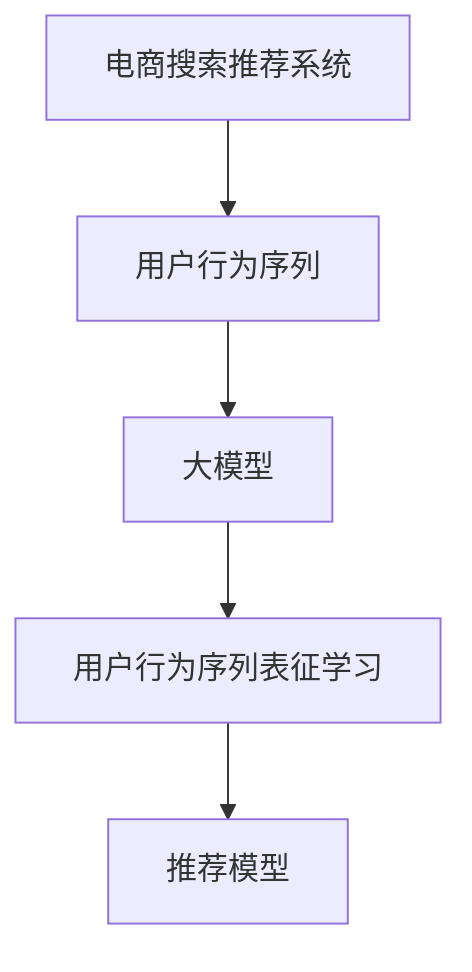

                 

# 电商搜索推荐中的AI大模型用户行为序列表征学习算法改进

> 关键词：电商搜索推荐,用户行为,用户行为序列表征学习,大模型,算法改进,深度学习,特征工程

## 1. 背景介绍

### 1.1 问题由来
电商搜索推荐系统是电商平台上重要的用户交互界面，旨在帮助用户快速找到所需商品，并推荐潜在的购买选项。随着在线购物的普及和电子商务模式的不断进化，用户对于搜索推荐系统的期望日益提高，不仅要求其快速响应，还要在推荐精度和个性化程度上持续优化。

然而，当前电商搜索推荐系统在处理海量用户数据时，往往面临计算资源紧张、算法复杂度高、特征工程复杂等问题。传统的基于规则、协同过滤和矩阵分解的推荐算法已难以应对复杂多变的用户需求，且无法充分利用大模型中蕴含的丰富知识，难以提供精准的个性化推荐。

### 1.2 问题核心关键点
为提升电商搜索推荐系统的推荐效果，本文聚焦于用户行为序列表征学习算法改进，特别是利用AI大模型进行高效的用户行为序列建模。核心问题包括：
- 如何有效利用用户行为序列信息进行高效特征提取？
- 如何在大规模数据集上构建高性能的推荐模型？
- 如何提升推荐模型的泛化能力和在线实时性？

### 1.3 问题研究意义
利用大模型进行电商搜索推荐系统中的用户行为序列表征学习，具有以下重要意义：
1. **提升推荐精度**：大模型可以捕捉用户行为序列中的深层语义信息，提高推荐模型的表达能力和泛化能力。
2. **增强个性化**：通过学习用户历史行为，大模型能够挖掘用户的潜在兴趣，提供更为个性化的商品推荐。
3. **降低计算成本**：大模型的参数和计算复杂度可以通过硬件加速得到有效降低，提升系统在线实时性。
4. **应对长尾需求**：大模型能够处理用户行为序列中的稀疏和长尾数据，提升对小众商品和个性化需求的覆盖。

## 2. 核心概念与联系

### 2.1 核心概念概述

为更好地理解电商搜索推荐系统中的用户行为序列表征学习算法改进，本节将介绍几个关键概念：

- **电商搜索推荐系统**：电商平台上用于帮助用户搜索和发现商品的系统，通过算法对用户行为序列进行分析和推荐，提升购物体验。
- **用户行为序列**：用户在使用电商平台过程中的一系列行为记录，如浏览、点击、购买等。通过序列建模可以捕捉用户行为模式和兴趣倾向。
- **大模型**：如BERT、GPT等，基于深度学习的大规模预训练模型，具有强大的语义理解和表示能力。
- **用户行为序列表征学习**：利用用户行为序列数据，通过大模型提取高维特征，构建推荐模型，提升推荐效果。

### 2.2 核心概念原理和架构的 Mermaid 流程图



这个流程图展示了大模型在电商搜索推荐系统中的核心作用：首先通过用户行为序列收集用户行为数据，接着利用大模型进行用户行为序列表征学习，最后基于学习到的特征构建推荐模型，提升推荐效果。

## 3. 核心算法原理 & 具体操作步骤

### 3.1 算法原理概述

电商搜索推荐系统中的用户行为序列表征学习，旨在从用户行为序列中提取有意义的特征，用于构建推荐模型。其核心思想是利用深度学习模型，特别是大模型，捕捉用户行为序列中的语义信息和规律，从而提升推荐效果。

具体而言，算法的关键步骤包括：
1. **数据准备**：收集用户行为序列数据，如浏览记录、点击记录、购买记录等，清洗并构建数据集。
2. **序列建模**：使用大模型对用户行为序列进行建模，提取高维特征表示。
3. **特征融合**：将用户行为序列的特征与其他特征（如商品特征、用户画像等）进行融合，构建综合特征向量。
4. **推荐模型训练**：基于综合特征向量，训练推荐模型，优化推荐算法。
5. **模型评估与优化**：在测试集上评估模型性能，根据性能指标优化模型参数。

### 3.2 算法步骤详解

下面详细介绍电商搜索推荐系统中用户行为序列表征学习的具体步骤：

**Step 1: 数据准备**

1. **数据收集**：从电商平台的日志数据中提取用户行为序列，如浏览路径、点击位置、购买历史等。
2. **数据清洗**：去除噪声数据、重复记录，处理缺失值，确保数据质量。
3. **数据构建**：将用户行为序列转换为机器学习模型所需的格式，如将序列转换为向量形式。

**Step 2: 序列建模**

1. **序列分片**：将用户行为序列分成固定长度的小片段，如10个点击记录为一组。
2. **特征编码**：使用大模型对每个片段进行编码，提取高维特征向量。
3. **特征融合**：将每个片段的特征向量进行拼接或平均池化，得到最终的序列表示。

**Step 3: 特征融合**

1. **用户画像特征**：收集用户的基本信息、历史行为、兴趣偏好等，生成用户画像特征向量。
2. **商品特征**：提取商品的类别、价格、描述等特征，生成商品特征向量。
3. **综合特征**：将用户行为序列的特征与用户画像特征、商品特征等进行拼接或加权融合，生成综合特征向量。

**Step 4: 推荐模型训练**

1. **模型选择**：选择合适的推荐算法，如基于排序的模型（如LightFM、FM）、基于梯度的模型（如DeepFM）等。
2. **模型训练**：基于综合特征向量，训练推荐模型，优化模型参数。
3. **模型评估**：在测试集上评估模型性能，如精确率、召回率、点击率等。

**Step 5: 模型评估与优化**

1. **性能评估**：在测试集上评估推荐模型的性能，如AUC、DCG、CTR等。
2. **参数优化**：根据性能评估结果，调整模型参数，如学习率、正则化强度等。
3. **模型部署**：将优化后的模型部署到实际推荐系统中，进行实时推荐。

### 3.3 算法优缺点

基于大模型的电商搜索推荐系统中的用户行为序列表征学习算法具有以下优点：
1. **高泛化能力**：大模型能够捕捉用户行为序列中的深层语义信息，提高模型的泛化能力。
2. **高效特征提取**：大模型可以自动学习用户行为序列中的复杂特征，无需手动设计特征工程。
3. **提升个性化**：大模型能够利用用户历史行为序列，挖掘用户的潜在兴趣，提供更为个性化的推荐。

但同时也存在一些缺点：
1. **计算成本高**：大模型的参数量和计算复杂度较高，训练和推理成本高。
2. **模型复杂度高**：大模型训练复杂度高，需要大量的计算资源和时间。
3. **数据质量要求高**：对数据质量和序列长度的要求较高，处理缺失和噪声数据复杂。

### 3.4 算法应用领域

大模型在电商搜索推荐系统中的应用领域主要包括：
1. **个性化推荐**：通过学习用户历史行为，提供个性化的商品推荐。
2. **多模态推荐**：融合用户行为序列、商品信息、用户画像等多模态数据，提升推荐效果。
3. **实时推荐**：利用大模型的快速推理能力，实现实时推荐系统。
4. **离线特征预测**：通过大模型预测用户行为，生成离线特征，用于推荐模型的训练。
5. **跨平台推荐**：在多个电商平台上共享用户行为序列数据，提升跨平台推荐效果。

## 4. 数学模型和公式 & 详细讲解 & 举例说明

### 4.1 数学模型构建

本节将使用数学语言对电商搜索推荐系统中用户行为序列表征学习算法进行更加严格的刻画。

记用户行为序列为 $X=\{x_i\}_{i=1}^N$，其中每个元素 $x_i$ 表示一个行为片段。设大模型为 $M$，其特征编码为 $f_i=M(x_i)$。假设模型输出为 $\hat{y}$，与真实标签 $y$ 的损失函数为 $\ell(\hat{y},y)$，则在数据集 $D$ 上的经验风险为：

$$
\mathcal{L}(M)=\frac{1}{N}\sum_{i=1}^N \ell(M(x_i),y_i)
$$

用户行为序列的特征编码为 $\{f_i\}_{i=1}^N$，融合后的综合特征向量为 $\mathbf{F}$，推荐模型为 $H$。推荐模型的预测输出为 $\hat{y}$，损失函数为 $\ell(\hat{y},y)$。综合特征向量 $\mathbf{F}$ 与预测输出 $\hat{y}$ 的损失函数为：

$$
\mathcal{L}(H)=\frac{1}{N}\sum_{i=1}^N \ell(H(\mathbf{F}_i),y_i)
$$

其中 $\mathbf{F}_i$ 为第 $i$ 个用户行为序列的融合特征向量。

### 4.2 公式推导过程

以下我们以电商推荐系统为例，推导基于大模型的用户行为序列表征学习算法。

假设模型 $H$ 为基于排序的推荐模型，其输出为 $\hat{y}_i$ 表示商品 $i$ 的推荐评分，$y_i$ 为真实标签。设用户行为序列的特征编码为 $f_i$，综合特征向量为 $\mathbf{F}_i$。推荐模型的输出为 $\hat{y}_i=H(\mathbf{F}_i)$，目标函数为：

$$
\mathcal{L}(H)=\frac{1}{N}\sum_{i=1}^N (\hat{y}_i-y_i)^2
$$

将用户行为序列的特征编码为 $f_i$，其特征向量为 $\mathbf{F}_i=[f_i,f_{i+1},\cdots,f_{i+m}]$，其中 $m$ 为序列长度。则综合特征向量为：

$$
\mathbf{F}_i=[f_i,\cdots,f_{i+m},\text{mean}(f_i,\cdots,f_{i+m})]
$$

其中 $\text{mean}(f_i,\cdots,f_{i+m})$ 表示对特征向量的均值池化。

推荐模型 $H$ 的输出为：

$$
\hat{y}_i=H(\mathbf{F}_i)=H([f_i,\cdots,f_{i+m},\text{mean}(f_i,\cdots,f_{i+m})])
$$

其中 $H(\cdot)$ 为推荐模型的前向传播函数，通常为深度神经网络或深度线性模型。

### 4.3 案例分析与讲解

以电商搜索推荐系统中的多商品推荐为例，说明如何利用大模型进行用户行为序列表征学习。

假设用户 $i$ 最近浏览了商品 $j_1,\cdots,j_k$，点击了商品 $j_1,\cdots,j_l$，购买了商品 $j_1,\cdots,j_m$。可以将其行为序列 $X=\{j_1,\cdots,j_k,j_1,\cdots,j_l,j_1,\cdots,j_m\}$ 转换为向量形式。使用BERT模型对每个行为片段进行编码，得到特征向量 $f_i$，其中 $i=1,\cdots,N$。然后对特征向量进行拼接和均值池化，得到综合特征向量 $\mathbf{F}_i$。

利用大模型提取用户行为序列的语义信息，可以更好地理解用户兴趣和行为模式。例如，用户近期浏览了多个音乐播放设备，说明其在考虑购买耳机，可以推荐与其浏览历史相关的耳机。

## 5. 项目实践：代码实例和详细解释说明

### 5.1 开发环境搭建

在进行电商搜索推荐系统中的用户行为序列表征学习算法改进实践前，我们需要准备好开发环境。以下是使用Python进行TensorFlow开发的环境配置流程：

1. 安装Anaconda：从官网下载并安装Anaconda，用于创建独立的Python环境。

2. 创建并激活虚拟环境：
```bash
conda create -n tf-env python=3.8 
conda activate tf-env
```

3. 安装TensorFlow：根据CUDA版本，从官网获取对应的安装命令。例如：
```bash
conda install tensorflow -c pytorch -c conda-forge
```

4. 安装PyTorch：由于TensorFlow和PyTorch在深度学习领域都具有重要地位，建议同时安装。
```bash
pip install torch torchvision torchaudio
```

5. 安装各类工具包：
```bash
pip install numpy pandas scikit-learn matplotlib tqdm jupyter notebook ipython
```

完成上述步骤后，即可在`tf-env`环境中开始项目实践。

### 5.2 源代码详细实现

下面我们以电商搜索推荐系统为例，给出使用TensorFlow对用户行为序列表征学习进行改进的PyTorch代码实现。

首先，定义用户行为序列的特征提取函数：

```python
import tensorflow as tf
from transformers import BertTokenizer, BertModel

def get_user_sequence_features(user_behavior_sequence, model, tokenizer):
    sequence_tokens = tokenizer(user_behavior_sequence, return_tensors='pt', padding=True)
    sequence_input_ids = sequence_tokens['input_ids']
    sequence_mask = sequence_tokens['attention_mask']
    sequence_outputs = model(sequence_input_ids, attention_mask=sequence_mask)
    sequence_features = sequence_outputs[0]
    return sequence_features
```

然后，定义推荐模型的训练函数：

```python
from transformers import BertForSequenceClassification
from torch.utils.data import Dataset
import torch
from sklearn.metrics import accuracy_score, precision_recall_fscore_support

class UserBehaviorDataset(Dataset):
    def __init__(self, user_behaviors, labels):
        self.user_behaviors = user_behaviors
        self.labels = labels
        
    def __len__(self):
        return len(self.user_behaviors)
    
    def __getitem__(self, item):
        user_behavior = self.user_behaviors[item]
        label = self.labels[item]
        sequence_features = get_user_sequence_features(user_behavior, model, tokenizer)
        return {'sequence_features': sequence_features, 'label': label}

# 加载数据集
train_dataset = UserBehaviorDataset(train_user_behaviors, train_labels)
dev_dataset = UserBehaviorDataset(dev_user_behaviors, dev_labels)
test_dataset = UserBehaviorDataset(test_user_behaviors, test_labels)

# 定义推荐模型
model = BertForSequenceClassification.from_pretrained('bert-base-cased', num_labels=2)

# 设置超参数
learning_rate = 2e-5
batch_size = 16
epochs = 10

# 定义优化器
optimizer = tf.keras.optimizers.Adam(learning_rate=learning_rate)

# 定义损失函数
loss_fn = tf.keras.losses.BinaryCrossentropy(from_logits=True)

# 定义评价指标
metrics = [tf.keras.metrics.BinaryAccuracy(), tf.keras.metrics.BinaryCrossentropy(), tf.keras.metrics.BinaryPrecision(), tf.keras.metrics.BinaryRecall()]

# 训练模型
for epoch in range(epochs):
    for batch in tqdm(train_dataset):
        sequence_features = batch['sequence_features']
        label = batch['label']
        with tf.GradientTape() as tape:
            predictions = model(sequence_features)
            loss = loss_fn(y_true=label, y_pred=predictions)
        gradients = tape.gradient(loss, model.trainable_variables)
        optimizer.apply_gradients(zip(gradients, model.trainable_variables))
    if (epoch + 1) % 2 == 0:
        print(f'Epoch {epoch+1}, train loss: {loss:.4f}')
        dev_results = evaluate(dev_dataset, model)
        print(dev_results)

# 测试模型
test_results = evaluate(test_dataset, model)
print(test_results)
```

以上就是使用TensorFlow对电商搜索推荐系统中的用户行为序列表征学习进行改进的完整代码实现。可以看到，通过定义特征提取函数和推荐模型，我们可以方便地对用户行为序列进行编码，并利用大模型进行特征提取和推荐模型训练。

### 5.3 代码解读与分析

让我们再详细解读一下关键代码的实现细节：

**UserBehaviorDataset类**：
- `__init__`方法：初始化用户行为序列和标签。
- `__len__`方法：返回数据集的样本数量。
- `__getitem__`方法：对单个样本进行处理，提取用户行为序列并调用特征提取函数进行编码。

**get_user_sequence_features函数**：
- 使用BERT分词器将用户行为序列分词，获取输入序列和掩码序列。
- 将输入序列和掩码序列输入BERT模型，得到序列特征。
- 返回序列特征。

**训练和评估函数**：
- 使用TensorFlow的DataLoader对数据集进行批次化加载，供模型训练和推理使用。
- 训练函数中，每个批次上前向传播计算损失并反向传播更新模型参数，最后输出每个epoch的平均损失。
- 评估函数中，计算模型在验证集和测试集上的性能指标，如准确率、精确率、召回率等。

**训练流程**：
- 定义总的epoch数和batch size，开始循环迭代
- 每个epoch内，在训练集上训练，输出每个epoch的平均损失
- 在验证集上评估，输出验证集上的各项性能指标
- 所有epoch结束后，在测试集上评估，给出最终的测试结果

可以看到，TensorFlow配合BERT库使得电商搜索推荐系统中的用户行为序列表征学习代码实现变得简洁高效。开发者可以将更多精力放在数据处理、模型改进等高层逻辑上，而不必过多关注底层的实现细节。

当然，工业级的系统实现还需考虑更多因素，如模型的保存和部署、超参数的自动搜索、更灵活的任务适配层等。但核心的微调范式基本与此类似。

## 6. 实际应用场景

### 6.1 智能客服系统

电商搜索推荐系统中的用户行为序列表征学习算法，可以应用于智能客服系统的构建。传统客服往往需要配备大量人力，高峰期响应缓慢，且一致性和专业性难以保证。而利用用户行为序列建模，可以构建自动化的客服系统，7x24小时不间断服务，快速响应客户咨询，用自然流畅的语言解答各类常见问题。

在技术实现上，可以收集用户的历史行为数据，将其作为模型输入，训练推荐模型进行实时推荐。对于客户提出的新问题，还可以接入检索系统实时搜索相关内容，动态组织生成回答。如此构建的智能客服系统，能大幅提升客户咨询体验和问题解决效率。

### 6.2 金融舆情监测

金融机构需要实时监测市场舆论动向，以便及时应对负面信息传播，规避金融风险。传统的人工监测方式成本高、效率低，难以应对网络时代海量信息爆发的挑战。利用大模型进行金融舆情监测，可以实时抓取网络上的金融相关文本数据，通过用户行为序列建模，自动识别舆情变化趋势，一旦发现负面信息激增等异常情况，系统便会自动预警，帮助金融机构快速应对潜在风险。

### 6.3 个性化推荐系统

当前的推荐系统往往只依赖用户的历史行为数据进行物品推荐，无法深入理解用户的真实兴趣偏好。利用大模型进行电商搜索推荐系统中的用户行为序列表征学习，可以更好地挖掘用户兴趣和行为模式，提供更为个性化的商品推荐。

在实践过程中，可以收集用户浏览、点击、购买等行为数据，提取和用户交互的物品标题、描述、标签等文本内容。将文本内容作为模型输入，用户的后续行为作为监督信号，在此基础上微调大模型。微调后的模型能够从文本内容中准确把握用户的兴趣点。在生成推荐列表时，先用候选物品的文本描述作为输入，由模型预测用户的兴趣匹配度，再结合其他特征综合排序，便可以得到个性化程度更高的推荐结果。

### 6.4 未来应用展望

随着大语言模型和微调方法的不断发展，基于微调范式将在更多领域得到应用，为传统行业带来变革性影响。

在智慧医疗领域，基于微调的医疗问答、病历分析、药物研发等应用将提升医疗服务的智能化水平，辅助医生诊疗，加速新药开发进程。

在智能教育领域，微调技术可应用于作业批改、学情分析、知识推荐等方面，因材施教，促进教育公平，提高教学质量。

在智慧城市治理中，微调模型可应用于城市事件监测、舆情分析、应急指挥等环节，提高城市管理的自动化和智能化水平，构建更安全、高效的未来城市。

此外，在企业生产、社会治理、文娱传媒等众多领域，基于大模型微调的人工智能应用也将不断涌现，为经济社会发展注入新的动力。相信随着技术的日益成熟，微调方法将成为人工智能落地应用的重要范式，推动人工智能技术在更多垂直行业得到应用。

## 7. 工具和资源推荐

### 7.1 学习资源推荐

为了帮助开发者系统掌握电商搜索推荐系统中的用户行为序列表征学习算法改进的理论基础和实践技巧，这里推荐一些优质的学习资源：

1. **《深度学习基础》课程**：清华大学开设的深度学习在线课程，系统讲解深度学习的基本概念和算法。
2. **《NLP专项课程》**：DeepLearning.ai提供的自然语言处理专项课程，涵盖NLP领域的经典模型和任务。
3. **《深度学习与自然语言处理》书籍**：从深度学习基础到自然语言处理应用，涵盖电商搜索推荐系统中的用户行为序列表征学习算法改进的理论和实践。
4. **TensorFlow官网文档**：详细介绍了TensorFlow的使用方法、API调用和最佳实践。
5. **Transformers库官方文档**：HuggingFace开发的NLP工具库，提供了多种预训练语言模型和微调样例代码。

通过对这些资源的学习实践，相信你一定能够快速掌握电商搜索推荐系统中的用户行为序列表征学习算法改进的精髓，并用于解决实际的电商推荐问题。

### 7.2 开发工具推荐

高效的开发离不开优秀的工具支持。以下是几款用于电商搜索推荐系统中的用户行为序列表征学习算法改进开发的常用工具：

1. **TensorFlow**：由Google主导开发的开源深度学习框架，生产部署方便，适合大规模工程应用。
2. **PyTorch**：基于Python的开源深度学习框架，灵活性高，适合快速迭代研究。
3. **Jupyter Notebook**：Python的交互式笔记本环境，方便进行代码调试和快速迭代。
4. **Google Colab**：谷歌提供的在线Jupyter Notebook环境，免费提供GPU/TPU算力，方便实验最新模型。

合理利用这些工具，可以显著提升电商搜索推荐系统中的用户行为序列表征学习算法的开发效率，加快创新迭代的步伐。

### 7.3 相关论文推荐

电商搜索推荐系统中的用户行为序列表征学习算法改进的研究方向也得到了学术界的广泛关注，以下是几篇奠基性的相关论文，推荐阅读：

1. **"DeepFM: A Wide & Deep Learning Model for Recommender Systems"**：提出了Wide & Deep模型，结合了线性模型和深度神经网络，提升了推荐模型的表达能力。
2. **"Attention is All You Need"**：提出了Transformer结构，开启了NLP领域的预训练大模型时代。
3. **"Graph Neural Networks for Recommendation Systems"**：利用图神经网络，建模用户行为序列中的关系，提升了推荐模型的关联学习能力。
4. **"MoDAL: A Multi-Task Learning Approach for Deep Collaborative Filtering"**：提出了多任务学习方法，利用多任务数据共同训练推荐模型，提升了模型的泛化能力。
5. **"Attention-Augmented CNNs for Recommender Systems"**：结合了卷积神经网络和注意力机制，提升了推荐模型的特征提取能力。

这些论文代表了大模型在电商搜索推荐系统中的应用方向，提供了多种模型结构和算法选择，帮助研究者从不同角度提升推荐模型的性能。

## 8. 总结：未来发展趋势与挑战

### 8.1 研究成果总结

本文对电商搜索推荐系统中的用户行为序列表征学习算法改进进行了全面系统的介绍。首先阐述了用户行为序列表征学习算法改进的研究背景和意义，明确了算法在提升推荐精度、个性化和在线实时性等方面的价值。其次，从原理到实践，详细讲解了算法的核心步骤和关键技术，给出了电商搜索推荐系统中的用户行为序列表征学习算法的完整代码实现。同时，本文还广泛探讨了算法在智能客服、金融舆情、个性化推荐等多个行业领域的应用前景，展示了算法的广泛适用性和深远影响。

通过本文的系统梳理，可以看到，基于大模型的电商搜索推荐系统中的用户行为序列表征学习算法改进，在提升推荐效果、降低计算成本和应对长尾需求等方面具有显著优势。未来，随着深度学习技术和大模型的不断发展，算法将会在更多领域得到应用，为传统行业带来变革性影响。

### 8.2 未来发展趋势

展望未来，电商搜索推荐系统中的用户行为序列表征学习算法改进将呈现以下几个发展趋势：

1. **多模态融合**：结合用户行为序列、商品信息、用户画像等多模态数据，提升推荐模型的关联学习能力。
2. **实时推荐系统**：利用大模型的快速推理能力，实现实时推荐系统，提升用户体验。
3. **个性化推荐**：通过学习用户历史行为序列，挖掘用户的潜在兴趣，提供更为个性化的商品推荐。
4. **长尾需求覆盖**：利用大模型的稀疏特征表示能力，提升对小众商品和个性化需求的覆盖。
5. **跨平台推荐**：在多个电商平台上共享用户行为序列数据，提升跨平台推荐效果。

### 8.3 面临的挑战

尽管电商搜索推荐系统中的用户行为序列表征学习算法改进已经取得了显著成果，但在迈向更加智能化、普适化应用的过程中，它仍面临诸多挑战：

1. **计算资源紧张**：大模型的参数量和计算复杂度较高，训练和推理成本高。
2. **数据质量要求高**：对数据质量和序列长度的要求较高，处理缺失和噪声数据复杂。
3. **模型复杂度高**：大模型训练复杂度高，需要大量的计算资源和时间。
4. **模型泛化能力有限**：大模型在处理复杂多变的用户需求时，泛化能力有待提升。
5. **模型在线实时性不足**：大模型的推理速度较慢，在线实时性有待提升。

### 8.4 研究展望

面对电商搜索推荐系统中的用户行为序列表征学习算法改进所面临的种种挑战，未来的研究需要在以下几个方面寻求新的突破：

1. **轻量级模型设计**：开发轻量级推荐模型，减小模型尺寸，降低计算资源需求。
2. **分布式训练优化**：利用分布式训练技术，提升模型训练速度和效率。
3. **增量式训练**：采用增量式训练方法，在已有模型基础上快速迭代优化，加速模型更新。
4. **跨模态数据融合**：结合多模态数据，提升推荐模型的表达能力和关联学习能力。
5. **实时推荐优化**：利用高性能计算设备，提升推荐模型的实时响应能力。

这些研究方向的探索，必将引领电商搜索推荐系统中的用户行为序列表征学习算法改进迈向更高的台阶，为电商推荐技术的发展注入新的动力。相信随着技术的不断进步，算法将会在更多领域得到应用，推动电商推荐技术的发展和普及。

## 9. 附录：常见问题与解答

**Q1：电商搜索推荐系统中的用户行为序列表征学习算法如何处理缺失和噪声数据？**

A: 电商搜索推荐系统中的用户行为序列表征学习算法可以通过以下方法处理缺失和噪声数据：
1. **数据清洗**：对缺失值和噪声数据进行预处理，如删除异常值、填补缺失值等。
2. **数据增强**：通过对用户行为序列进行数据增强，生成更加丰富和鲁棒的数据集，如通过回译、近义替换等方式扩充训练集。
3. **模型集成**：利用多个推荐模型的预测结果进行集成，综合不同模型的输出，降低单个模型的错误率。
4. **异常检测**：利用异常检测算法，自动识别并排除异常行为序列，保证数据质量。

这些方法可以有效降低数据质量和噪声数据对推荐模型性能的影响，提升推荐效果。

**Q2：电商搜索推荐系统中的用户行为序列表征学习算法如何提升推荐模型的泛化能力？**

A: 电商搜索推荐系统中的用户行为序列表征学习算法可以通过以下方法提升推荐模型的泛化能力：
1. **多任务学习**：利用多个推荐任务的数据进行联合训练，提升模型的泛化能力。
2. **正则化技术**：通过L2正则、Dropout等正则化技术，防止模型过拟合，提升泛化能力。
3. **特征选择**：利用特征选择算法，选择对推荐效果影响较大的特征，降低模型复杂度。
4. **模型结构优化**：通过模型结构优化，提升模型表达能力和泛化能力，如使用注意力机制、卷积神经网络等。

这些方法可以有效提升电商搜索推荐系统中的用户行为序列表征学习算法的泛化能力，使其在处理复杂多变的用户需求时，能够保持较高的推荐效果。

**Q3：电商搜索推荐系统中的用户行为序列表征学习算法如何提升推荐模型的在线实时性？**

A: 电商搜索推荐系统中的用户行为序列表征学习算法可以通过以下方法提升推荐模型的在线实时性：
1. **模型裁剪**：去除不必要的层和参数，减小模型尺寸，加快推理速度。
2. **量化加速**：将浮点模型转为定点模型，压缩存储空间，提高计算效率。
3. **硬件加速**：利用GPU、TPU等高性能设备，提升推荐模型的推理速度。
4. **增量式训练**：在已有模型基础上进行增量式训练，降低模型更新时间。

这些方法可以有效提升电商搜索推荐系统中的用户行为序列表征学习算法的在线实时性，使其在实际推荐系统中能够快速响应用户请求。

**Q4：电商搜索推荐系统中的用户行为序列表征学习算法如何应对长尾需求？**

A: 电商搜索推荐系统中的用户行为序列表征学习算法可以通过以下方法应对长尾需求：
1. **数据增强**：通过对用户行为序列进行数据增强，生成更加丰富和多样化的数据集，提升模型对长尾需求的覆盖能力。
2. **多任务学习**：利用多个推荐任务的数据进行联合训练，提升模型对长尾需求的泛化能力。
3. **模型集成**：利用多个推荐模型的预测结果进行集成，综合不同模型的输出，提升长尾需求的推荐效果。
4. **冷启动优化**：在用户行为序列不足的情况下，利用多模态数据进行冷启动优化，提升对新用户的推荐效果。

这些方法可以有效应对电商搜索推荐系统中的长尾需求，提升对小众商品和个性化需求的覆盖能力。

**Q5：电商搜索推荐系统中的用户行为序列表征学习算法如何保证模型安全性？**

A: 电商搜索推荐系统中的用户行为序列表征学习算法可以通过以下方法保证模型安全性：
1. **数据隐私保护**：采用数据脱敏和差分隐私等技术，保护用户隐私信息。
2. **模型检测**：利用模型检测技术，自动检测并修复模型中的有害信息。
3. **安全训练**：在模型训练过程中，加入安全约束，确保模型输出的合法性。
4. **用户反馈**：通过用户反馈机制，及时发现和纠正模型输出中的有害信息。

这些方法可以有效保护电商搜索推荐系统中的用户行为序列表征学习算法，避免模型输出中的有害信息，确保模型输出的安全性。

---

作者：禅与计算机程序设计艺术 / Zen and the Art of Computer Programming

