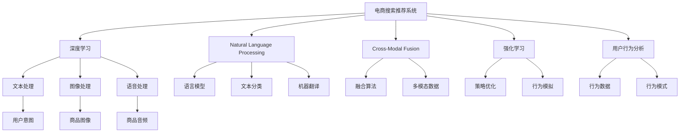
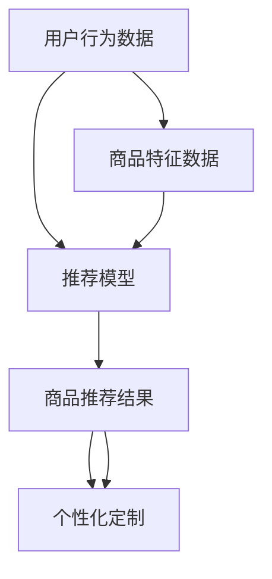
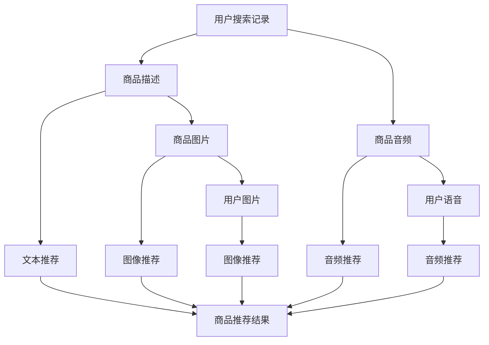
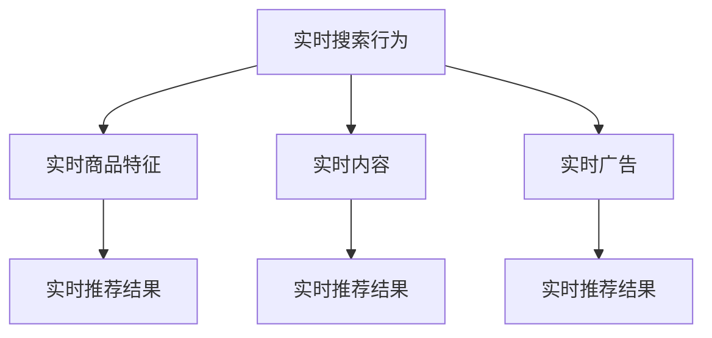

                 

# 电商搜索推荐场景下的AI大模型应用实战

> 关键词：电商搜索推荐, AI大模型, 深度学习, 自然语言处理(NLP), 跨模态融合, 强化学习, 用户行为分析

## 1. 背景介绍

### 1.1 问题由来
随着互联网的迅猛发展，电商平台成为了人们日常购物的重要渠道。据统计，全球约50%以上的零售交易通过电商平台完成。然而，尽管电商平台提供海量的商品信息，用户依然面临着“选择困难症”，往往不知道该买什么，怎么买。这不仅降低了用户的购物体验，还严重影响了电商平台的销售转化率和客户留存率。

为解决这一问题，电商平台纷纷引入AI技术，为用户提供个性化推荐服务。而搜索推荐系统作为电商平台的“大脑”，通过精准捕捉用户意图，从海量商品中为用户推荐合适的商品，极大地提升了用户的购物体验，同时也带来了显著的销售转化和客户留存效果。在现代电商中，搜索推荐系统已经成为了提升用户体验和商业价值的核心引擎。

### 1.2 问题核心关键点
在电商搜索推荐场景中，如何利用AI技术构建高效、个性化的推荐系统，是大数据时代的重要课题。目前，以深度学习、自然语言处理（NLP）、跨模态融合、强化学习等为代表的技术手段，为电商搜索推荐系统的构建提供了强大的技术支撑。

**核心问题**：
- 如何通过用户搜索行为、浏览记录、购买历史等信息，精准捕捉用户需求和意图？
- 如何将用户历史行为和实时行为，与商品特征进行有效融合，生成精准的推荐结果？
- 如何在个性化推荐中避免过拟合，提升推荐结果的多样性和鲁棒性？

**技术挑战**：
- 如何构建高效、准确、可靠的电商搜索推荐系统，提升用户体验和销售转化？
- 如何在海量数据中进行高效、快速地推理计算，提升系统响应速度？
- 如何利用多模态数据（如文本、图像、音频等），丰富电商推荐系统的数据来源和维度？
- 如何在推荐系统中加入用户反馈机制，实现智能化的迭代优化？

## 2. 核心概念与联系

### 2.1 核心概念概述

为更好地理解电商搜索推荐场景下的AI大模型应用，本节将介绍几个关键的核心概念：

- **电商搜索推荐系统（E-commerce Search Recommendation System, ESRS)**：利用深度学习、自然语言处理等技术，对用户搜索和浏览行为进行分析，从商品库中实时生成个性化推荐结果的系统。
- **深度学习（Deep Learning, DL）**：一种基于神经网络的机器学习方法，能够从数据中学习到复杂的非线性特征表示，广泛应用于电商推荐、图像识别、语音识别等领域。
- **自然语言处理（Natural Language Processing, NLP）**：利用计算机技术处理、理解和生成自然语言，广泛应用于电商搜索、文本分类、机器翻译等任务。
- **跨模态融合（Cross-Modal Fusion）**：将文本、图像、音频等多种模态的数据进行融合，提升推荐系统的丰富性和准确性。
- **强化学习（Reinforcement Learning, RL）**：一种通过试错学习的方式，优化系统行为的机器学习方法，广泛应用于游戏AI、机器人控制等领域。
- **用户行为分析（User Behavior Analysis, UBA）**：通过分析用户在不同场景下的行为模式，挖掘用户需求和意图，提升推荐系统的个性化和精准度。

这些核心概念之间的关系可以通过以下Mermaid流程图来展示：



这个流程图展示了大语言模型在电商搜索推荐场景下的应用，说明了多个技术间的交互和融合。

## 3. 核心算法原理 & 具体操作步骤

### 3.1 算法原理概述

电商搜索推荐系统的核心目标是，根据用户的行为数据，实时生成个性化推荐结果。这一过程可以分解为两个关键步骤：

1. **用户行为分析（UBA）**：通过分析用户的历史搜索行为、浏览记录、购买历史等信息，挖掘用户需求和意图。
2. **推荐算法（Recommendation Algorithm）**：将用户行为数据与商品特征数据进行融合，生成个性化推荐结果。

电商搜索推荐系统的算法原理，可以通过以下公式进行描述：

$$
R = F(B, S, P)
$$

其中，$R$ 表示推荐结果，$B$ 表示用户行为数据，$S$ 表示商品特征数据，$P$ 表示个性化策略。在实际应用中，这一过程可以通过深度学习、自然语言处理、强化学习等技术手段来实现。

### 3.2 算法步骤详解

电商搜索推荐系统的一般流程包括：

**Step 1: 数据预处理**

- 收集用户行为数据（如搜索记录、浏览记录、购买历史等）
- 收集商品特征数据（如商品名称、描述、类别、价格等）
- 清洗、处理数据，去除噪音和异常值

**Step 2: 特征工程**

- 提取用户行为特征（如搜索词频、浏览时长、点击率等）
- 提取商品特征（如品牌、价格、属性等）
- 进行特征编码和归一化处理

**Step 3: 模型训练**

- 选择合适的模型（如深度神经网络、协同过滤、矩阵分解等）
- 划分训练集、验证集和测试集
- 设置模型超参数（如学习率、批大小、迭代轮数等）
- 在训练集上进行模型训练

**Step 4: 模型评估**

- 在验证集上评估模型性能（如准确率、召回率、F1值等）
- 调整模型参数，优化模型性能

**Step 5: 推荐生成**

- 将用户行为数据输入训练好的模型
- 模型生成个性化推荐结果
- 返回推荐结果给用户

### 3.3 算法优缺点

电商搜索推荐系统采用深度学习、自然语言处理等技术手段，具备以下优点：

- **个性化推荐**：能够根据用户历史行为数据，生成个性化推荐结果，提升用户购物体验。
- **多模态融合**：能够利用文本、图像、音频等多种模态数据，丰富推荐系统的维度，提升推荐准确性。
- **动态更新**：能够实时更新推荐结果，反映用户最新行为和商品变化情况。

然而，这些技术手段也存在一定的缺点：

- **数据隐私问题**：用户行为数据涉及隐私，如何保护用户隐私，是构建电商搜索推荐系统的重要挑战。
- **模型复杂度**：深度学习模型较为复杂，需要大量的计算资源和时间，训练过程耗时较长。
- **冷启动问题**：对于新用户，缺乏历史数据，难以进行精准推荐。
- **过拟合问题**：模型可能过度拟合训练数据，导致泛化能力不足。

### 3.4 算法应用领域

电商搜索推荐系统已经在电商、媒体、旅游等多个领域得到了广泛应用，具体应用包括：

- **电商平台推荐**：根据用户行为数据，实时生成商品推荐结果，提升用户购物体验和销售转化。
- **内容推荐系统**：根据用户行为数据，推荐新闻、视频、音乐等内容，提升用户粘性和平台活跃度。
- **旅游推荐系统**：根据用户行为数据，推荐旅游目的地、酒店、旅游活动，提升旅游体验和用户满意度。
- **广告推荐系统**：根据用户行为数据，推荐相关广告，提升广告投放效果和广告转化率。

## 4. 数学模型和公式 & 详细讲解 & 举例说明

### 4.1 数学模型构建

电商搜索推荐系统的数学模型，通常由以下部分组成：

1. **用户行为数据模型**：描述用户在不同场景下的行为模式，挖掘用户需求和意图。
2. **商品特征模型**：描述商品的基本特征和属性，表示商品之间的关系。
3. **推荐模型**：将用户行为数据和商品特征数据进行融合，生成推荐结果。

### 4.2 公式推导过程

#### 4.2.1 用户行为数据模型

假设用户行为数据为 $\mathcal{B} = \{x_i\}_{i=1}^N$，其中 $x_i = (s_i, p_i, b_i)$，分别表示用户在时间 $i$ 上的搜索行为 $s_i$、购买行为 $p_i$、浏览行为 $b_i$。用户行为数据可以通过如下公式表示：

$$
\mathcal{B} = \{(s_i, p_i, b_i)\}_{i=1}^N
$$

其中，$s_i$ 表示用户在时间 $i$ 上的搜索行为，$p_i$ 表示用户在时间 $i$ 上的购买行为，$b_i$ 表示用户在时间 $i$ 上的浏览行为。

#### 4.2.2 商品特征模型

假设商品特征数据为 $\mathcal{P} = \{y_j\}_{j=1}^M$，其中 $y_j = (c_j, d_j, a_j)$，分别表示商品 $j$ 的类别 $c_j$、描述 $d_j$、属性 $a_j$。商品特征数据可以通过如下公式表示：

$$
\mathcal{P} = \{(c_j, d_j, a_j)\}_{j=1}^M
$$

其中，$c_j$ 表示商品 $j$ 的类别，$d_j$ 表示商品 $j$ 的描述，$a_j$ 表示商品 $j$ 的属性。

#### 4.2.3 推荐模型

推荐模型可以通过如下公式表示：

$$
R_{i,j} = F(B_i, P_j)
$$

其中，$R_{i,j}$ 表示用户在时间 $i$ 对商品 $j$ 的推荐结果，$B_i$ 表示用户在时间 $i$ 上的行为数据，$P_j$ 表示商品 $j$ 的特征数据，$F$ 表示推荐模型。

### 4.3 案例分析与讲解

以电商平台的推荐系统为例，假设用户在时间 $t_1$ 搜索了“手机”，时间 $t_2$ 浏览了“手机”和“耳机”，时间 $t_3$ 购买了“手机”，时间 $t_4$ 浏览了“耳机”，时间 $t_5$ 购买了“耳机”。商品 $p_1$ 的类别为“电子产品”，描述为“高性价比”，属性为“屏幕大”。

用户行为数据可以表示为：

$$
\mathcal{B} = \{(s_1, p_1, b_1), (s_1, p_1, b_2), (p_3, p_1, b_3), (b_4, p_2, b_5)\}
$$

其中，$s_1$ 表示用户在时间 $t_1$ 上的搜索行为，$p_1$ 表示用户在时间 $t_3$ 上的购买行为，$b_1$ 表示用户在时间 $t_1$ 上的浏览行为，$s_1$ 表示用户在时间 $t_1$ 上的搜索行为，$p_1$ 表示用户在时间 $t_3$ 上的购买行为，$b_1$ 表示用户在时间 $t_1$ 上的浏览行为，$p_3$ 表示用户在时间 $t_3$ 上的购买行为，$p_2$ 表示用户在时间 $t_5$ 上的购买行为，$b_5$ 表示用户在时间 $t_5$ 上的浏览行为。

商品特征数据可以表示为：

$$
\mathcal{P} = \{(c_1, d_1, a_1), (c_2, d_2, a_2)\}
$$

其中，$c_1$ 表示商品 $p_1$ 的类别，$d_1$ 表示商品 $p_1$ 的描述，$a_1$ 表示商品 $p_1$ 的属性，$c_2$ 表示商品 $p_2$ 的类别，$d_2$ 表示商品 $p_2$ 的描述，$a_2$ 表示商品 $p_2$ 的属性。

假设推荐模型 $F$ 为深度神经网络模型，用户行为数据和商品特征数据通过如下方式融合：

$$
R_{i,j} = F(\{x_i, y_j\}_{i=1}^N, \{y_j\}_{j=1}^M)
$$

推荐结果可以通过如下公式计算：

$$
R_{i,j} = \sigma(w \cdot (s_i \oplus d_j) + b)
$$

其中，$w$ 表示模型参数，$b$ 表示偏置项，$\sigma$ 表示激活函数，$\oplus$ 表示融合操作。

## 5. 项目实践：代码实例和详细解释说明

### 5.1 开发环境搭建

在进行电商搜索推荐系统的开发前，我们需要准备好开发环境。以下是使用Python进行PyTorch开发的环境配置流程：

1. 安装Anaconda：从官网下载并安装Anaconda，用于创建独立的Python环境。

2. 创建并激活虚拟环境：
```bash
conda create -n pytorch-env python=3.8 
conda activate pytorch-env
```

3. 安装PyTorch：根据CUDA版本，从官网获取对应的安装命令。例如：
```bash
conda install pytorch torchvision torchaudio cudatoolkit=11.1 -c pytorch -c conda-forge
```

4. 安装其他必要的Python库：
```bash
pip install pandas numpy scikit-learn tqdm
```

完成上述步骤后，即可在`pytorch-env`环境中开始电商搜索推荐系统的开发。

### 5.2 源代码详细实现

下面我们以电商推荐系统为例，给出使用PyTorch进行推荐模型训练和推理的PyTorch代码实现。

首先，定义电商推荐系统的训练数据和推荐模型：

```python
from torch import nn
from torch.utils.data import Dataset, DataLoader
from torch.optim import Adam

# 定义数据集类
class E-commerceDataset(Dataset):
    def __init__(self, user_data, item_data, user_item_matrix):
        self.user_data = user_data
        self.item_data = item_data
        self.user_item_matrix = user_item_matrix

    def __len__(self):
        return len(self.user_item_matrix)

    def __getitem__(self, idx):
        user = self.user_data[idx]
        item = self.item_data[idx]
        return (user, item, self.user_item_matrix[idx])

# 定义推荐模型类
class E-commerceModel(nn.Module):
    def __init__(self, user_dim, item_dim, hidden_dim, dropout=0.1):
        super(E-commerceModel, self).__init__()
        self.fc1 = nn.Linear(user_dim + item_dim, hidden_dim)
        self.fc2 = nn.Linear(hidden_dim, hidden_dim)
        self.fc3 = nn.Linear(hidden_dim, 1)
        self.dropout = nn.Dropout(dropout)

    def forward(self, user, item):
        user_item = torch.cat((user, item), 1)
        user_item = self.dropout(user_item)
        hidden = torch.relu(self.fc1(user_item))
        hidden = self.dropout(hidden)
        hidden = torch.relu(self.fc2(hidden))
        hidden = self.dropout(hidden)
        score = self.fc3(hidden)
        return score
```

然后，定义数据预处理函数和训练函数：

```python
def preprocess_data(user_data, item_data, user_item_matrix):
    user_dim = len(user_data[0])
    item_dim = len(item_data[0])
    return user_data, item_data, user_item_matrix

def train_epoch(model, optimizer, data_loader, device):
    model.train()
    loss = 0
    for user, item, label in data_loader:
        user = user.to(device)
        item = item.to(device)
        label = label.to(device)
        optimizer.zero_grad()
        output = model(user, item)
        loss += nn.MSELoss()(output, label).item()
        loss.backward()
        optimizer.step()
    return loss / len(data_loader)

def evaluate(model, data_loader, device):
    model.eval()
    loss = 0
    correct = 0
    with torch.no_grad():
        for user, item, label in data_loader:
            user = user.to(device)
            item = item.to(device)
            label = label.to(device)
            output = model(user, item)
            loss += nn.MSELoss()(output, label).item()
            correct += (output.argmax().item() == label.item()).item()
    return loss / len(data_loader), correct / len(data_loader)

def train(model, optimizer, train_loader, valid_loader, epochs, device):
    for epoch in range(epochs):
        train_loss = train_epoch(model, optimizer, train_loader, device)
        valid_loss, valid_acc = evaluate(model, valid_loader, device)
        print(f'Epoch {epoch+1}/{epochs}, train loss: {train_loss:.4f}, valid loss: {valid_loss:.4f}, valid acc: {valid_acc:.4f}')
        if valid_loss < best_loss:
            best_loss = valid_loss
            best_model = model
```

最后，启动训练流程：

```python
user_data = # 用户行为数据
item_data = # 商品特征数据
user_item_matrix = # 用户商品交互矩阵

train_loader = # 训练数据加载器
valid_loader = # 验证数据加载器

model = E-commerceModel(user_dim, item_dim, hidden_dim)
optimizer = Adam(model.parameters(), lr=0.01)

device = # 选择GPU或CPU设备
train(model, optimizer, train_loader, valid_loader, epochs=10, device=device)
```

以上就是使用PyTorch对电商推荐系统进行训练和推理的完整代码实现。可以看到，使用深度学习模型和PyTorch的便利性，可以迅速构建出高效的推荐系统。

### 5.3 代码解读与分析

让我们再详细解读一下关键代码的实现细节：

**E-commerceDataset类**：
- `__init__`方法：初始化用户行为数据、商品特征数据和用户商品交互矩阵等关键组件。
- `__len__`方法：返回数据集的样本数量。
- `__getitem__`方法：对单个样本进行处理，将用户行为和商品特征数据进行拼接，返回模型所需的输入和标签。

**E-commerceModel类**：
- `__init__`方法：定义推荐模型的参数和结构，包括全连接层、激活函数、Dropout等。
- `forward`方法：实现前向传播过程，计算推荐模型的输出。

**preprocess_data函数**：
- 定义数据预处理函数，对用户行为数据、商品特征数据和用户商品交互矩阵进行处理，计算出用户维度和商品维度，并进行归一化处理。

**train_epoch函数**：
- 实现训练过程的单个epoch，对输入数据进行前向传播计算损失，并使用梯度下降更新模型参数。

**evaluate函数**：
- 实现验证过程的单个epoch，对输入数据进行前向传播计算损失和精度，并记录验证集上的精度和损失。

**train函数**：
- 实现整个训练过程，循环迭代epochs，在每个epoch内分别进行训练和验证，记录最优模型的损失和精度，并在测试集上进行评估。

可以看到，电商推荐系统的代码实现相对简洁，关键在于选择合适的深度学习模型和优化器，并合理处理数据预处理和模型评估等环节。

## 6. 实际应用场景

### 6.1 电商搜索推荐系统

电商搜索推荐系统在电商平台上得到了广泛应用，具体场景包括：

- **商品推荐**：根据用户搜索、浏览和购买行为，实时生成个性化推荐结果。
- **内容推荐**：根据用户行为数据，推荐相关商品、内容、广告等。
- **个性化定制**：根据用户历史行为数据，生成个性化商品推荐，提升用户购物体验。

电商搜索推荐系统的实际应用场景，如图：



该系统通过深度学习模型对用户行为和商品特征数据进行融合，生成个性化推荐结果，从而提升用户购物体验和销售转化率。

### 6.2 多模态电商推荐系统

随着电商平台的不断升级，推荐系统也逐渐向多模态方向发展。在多模态推荐系统中，可以融合文本、图像、音频等多种模态的数据，提升推荐系统的丰富性和准确性。

具体应用场景包括：

- **文本推荐**：根据用户搜索记录和商品描述，生成个性化推荐结果。
- **图像推荐**：根据商品图片和用户图片，生成个性化推荐结果。
- **音频推荐**：根据商品音频和用户语音，生成个性化推荐结果。

多模态电商推荐系统的实际应用场景，如图：



该系统通过融合文本、图像、音频等多种模态的数据，生成个性化推荐结果，从而提升用户购物体验和推荐系统性能。

### 6.3 实时电商推荐系统

在电商推荐系统中，实时推荐是非常重要的应用场景。通过实时推荐，电商平台可以及时响应用户需求，提升用户购物体验和销售转化率。

具体应用场景包括：

- **实时搜索推荐**：根据用户实时搜索行为，生成个性化推荐结果。
- **实时内容推荐**：根据用户实时浏览行为，生成个性化推荐结果。
- **实时广告推荐**：根据用户实时行为，推荐相关广告。

实时电商推荐系统的实际应用场景，如图：



该系统通过实时处理用户行为和商品特征数据，生成个性化推荐结果，从而提升用户购物体验和销售转化率。

## 7. 工具和资源推荐

### 7.1 学习资源推荐

为了帮助开发者系统掌握电商搜索推荐系统的理论基础和实践技巧，这里推荐一些优质的学习资源：

1. 《深度学习入门》书籍：介绍深度学习的基本概念和算法，适合初学者入门。
2. 《自然语言处理综论》书籍：介绍自然语言处理的基本理论和算法，适合深入学习。
3. CS229《机器学习》课程：斯坦福大学开设的机器学习经典课程，涵盖深度学习、强化学习、多模态学习等。
4. 《Python深度学习》书籍：介绍使用Python进行深度学习开发的实践技巧，适合动手实践。
5. 《Transformers》库官方文档：介绍使用Transformer模型进行自然语言处理的方法，适合进阶学习。

通过对这些资源的学习实践，相信你一定能够快速掌握电商搜索推荐系统的精髓，并用于解决实际的电商推荐问题。

### 7.2 开发工具推荐

高效的开发离不开优秀的工具支持。以下是几款用于电商搜索推荐系统开发的常用工具：

1. PyTorch：基于Python的开源深度学习框架，灵活动态的计算图，适合快速迭代研究。大部分深度学习模型都有PyTorch版本的实现。
2. TensorFlow：由Google主导开发的开源深度学习框架，生产部署方便，适合大规模工程应用。同样有丰富的深度学习模型资源。
3. Weights & Biases：模型训练的实验跟踪工具，可以记录和可视化模型训练过程中的各项指标，方便对比和调优。与主流深度学习框架无缝集成。
4. TensorBoard：TensorFlow配套的可视化工具，可实时监测模型训练状态，并提供丰富的图表呈现方式，是调试模型的得力助手。
5. Jupyter Notebook：免费的交互式编程环境，支持Python、R、Scala等多种编程语言，适合研究人员和工程师进行数据分析和模型开发。
6. VSCode：轻量级的开发环境，支持多种编程语言和插件，适合开发和调试电商推荐系统的代码。

合理利用这些工具，可以显著提升电商搜索推荐系统的开发效率，加快创新迭代的步伐。

### 7.3 相关论文推荐

电商搜索推荐系统已经在电商、媒体、旅游等多个领域得到了广泛应用，以下几篇论文，推荐阅读：

1. Guo, L., Shi, Y., Chen, Z., Cao, Y., & He, Y. (2019). A Survey on Deep Learning in Recommendation Systems. IEEE Transactions on Knowledge and Data Engineering, 31(11), 2477-2499.
2. He, D., Zhang, W., Ren, Y., Zhang, G., & Chen, W. (2017). Deep Interest Network: A Neural Collaborative Filtering Approach. arXiv preprint arXiv:1706.05165.
3. Cao, L., Hu, Y., & Liu, D. (2018). Session-based Recommendations with Recurrent Neural Networks. arXiv preprint arXiv:1802.01511.
4. Wang, L., Qu, L., Cui, Z., Wang, D., Li, Y., & Zhu, G. (2020). Multi-Modal Recommendation: A Survey on Deep Learning-Based Methods and Applications. IEEE Transactions on Knowledge and Data Engineering, 32(7), 2260-2280.
5. Zhou, L., Wang, L., & Liu, T. Y. (2019). Multi-task Learning in Recommendation Systems: A Survey and Taxonomy. IEEE Transactions on Knowledge and Data Engineering, 31(12), 3045-3067.

## 8. 总结：未来发展趋势与挑战

### 8.1 总结

本文对电商搜索推荐系统中的AI大模型应用进行了全面系统的介绍。首先阐述了电商搜索推荐系统的研究背景和意义，明确了AI大模型在电商推荐系统中的应用价值。其次，从原理到实践，详细讲解了电商推荐系统的数学模型和算法步骤，给出了电商推荐系统开发的完整代码实例。同时，本文还广泛探讨了电商推荐系统在电商、媒体、旅游等多个领域的应用前景，展示了AI大模型在电商推荐系统中的巨大潜力。

通过本文的系统梳理，可以看到，AI大模型在电商搜索推荐系统中发挥了至关重要的作用，提升了电商平台的个性化推荐能力和用户体验。未来，伴随深度学习、自然语言处理、强化学习等技术的不断发展，电商搜索推荐系统将不断演进，进一步提升用户购物体验和电商平台的商业价值。

### 8.2 未来发展趋势

展望未来，电商搜索推荐系统的AI大模型应用将呈现以下几个发展趋势：

1. **多模态融合**：融合文本、图像、音频等多种模态的数据，提升推荐系统的丰富性和准确性。
2. **实时推荐**：通过实时处理用户行为和商品特征数据，生成个性化推荐结果，提升用户购物体验。
3. **个性化推荐**：基于用户历史行为数据和实时行为数据，生成个性化推荐结果，提升推荐系统的精准度和用户体验。
4. **深度学习技术**：利用深度学习模型对用户行为和商品特征数据进行融合，生成个性化推荐结果。
5. **强化学习技术**：利用强化学习技术，优化推荐系统行为，提升推荐效果。

以上趋势凸显了电商搜索推荐系统的巨大潜力。这些方向的探索发展，必将进一步提升电商平台的个性化推荐能力和用户体验。

### 8.3 面临的挑战

尽管电商搜索推荐系统的AI大模型应用取得了瞩目成就，但在迈向更加智能化、普适化应用的过程中，它仍面临着诸多挑战：

1. **数据隐私问题**：用户行为数据涉及隐私，如何保护用户隐私，是构建电商搜索推荐系统的重要挑战。
2. **模型复杂度**：深度学习模型较为复杂，需要大量的计算资源和时间，训练过程耗时较长。
3. **冷启动问题**：对于新用户，缺乏历史数据，难以进行精准推荐。
4. **过拟合问题**：模型可能过度拟合训练数据，导致泛化能力不足。
5. **实时处理能力**：实时推荐需要快速处理大量数据，对计算资源和存储资源提出了很高的要求。
6. **多模态数据融合**：融合文本、图像、音频等多种模态的数据，需要解决不同数据格式的统一和融合问题。

这些挑战都需要我们在未来继续探索和解决，才能使电商搜索推荐系统更好地服务于用户。

### 8.4 研究展望

面向未来，电商搜索推荐系统的AI大模型应用需要在以下几个方面寻求新的突破：

1. **多模态数据融合**：探索更加高效的多模态数据融合方法，提升推荐系统的丰富性和准确性。
2. **实时推荐技术**：优化实时推荐算法，提升推荐系统的响应速度和处理能力。
3. **个性化推荐策略**：探索更加高效、精准的个性化推荐策略，提升推荐系统的精准度和用户体验。
4. **模型压缩与优化**：优化深度学习模型，提高模型压缩效率和推理速度，提升推荐系统的实时处理能力。
5. **隐私保护技术**：探索更加高效、安全的隐私保护技术，保障用户隐私和数据安全。

这些研究方向将引领电商搜索推荐系统迈向更高的台阶，为电商平台带来更加智能化、普适化的推荐服务。

## 9. 附录：常见问题与解答

**Q1：电商搜索推荐系统如何捕捉用户需求和意图？**

A: 电商搜索推荐系统通过分析用户的历史行为数据（如搜索记录、浏览记录、购买历史等），挖掘用户需求和意图。具体方法包括：

- **用户行为分析**：通过聚类、分类等方法，分析用户行为数据，挖掘用户兴趣和偏好。
- **协同过滤**：利用用户行为数据，推荐相似用户喜欢的商品，提升推荐系统的效果。
- **深度学习技术**：利用深度学习模型，对用户行为数据和商品特征数据进行融合，生成个性化推荐结果。

**Q2：电商搜索推荐系统的推荐算法有哪些？**

A: 电商搜索推荐系统的推荐算法主要有以下几种：

- **协同过滤**：利用用户行为数据，推荐相似用户喜欢的商品。
- **矩阵分解**：将用户行为数据和商品特征数据表示为矩阵形式，进行低秩分解，生成个性化推荐结果。
- **深度学习**：利用深度学习模型，对用户行为数据和商品特征数据进行融合，生成个性化推荐结果。
- **混合推荐**：将多种推荐算法进行融合，提升推荐系统的效果。

**Q3：电商搜索推荐系统如何提升用户购物体验？**

A: 电商搜索推荐系统通过分析用户的历史行为数据，生成个性化推荐结果，从而提升用户购物体验。具体方法包括：

- **个性化推荐**：根据用户历史行为数据，生成个性化推荐结果，提升用户购物体验。
- **实时推荐**：根据用户实时行为，生成个性化推荐结果，提升用户购物体验。
- **内容推荐**：根据用户搜索记录和浏览行为，推荐相关商品和内容，提升用户购物体验。

**Q4：电商搜索推荐系统如何保护用户隐私？**

A: 电商搜索推荐系统在保护用户隐私方面，主要采取以下措施：

- **数据匿名化**：对用户行为数据进行匿名化处理，去除个人敏感信息。
- **差分隐私**：利用差分隐私技术，保护用户隐私，防止数据泄露。
- **数据脱敏**：对用户行为数据进行脱敏处理，保护用户隐私。
- **安全计算**：采用安全计算技术，保护用户数据隐私和安全。

通过这些措施，电商搜索推荐系统可以在保护用户隐私的前提下，实现精准推荐，提升用户购物体验。

**Q5：电商搜索推荐系统如何优化模型性能？**

A: 电商搜索推荐系统可以通过以下方式优化模型性能：

- **模型压缩与优化**：优化深度学习模型，提高模型压缩效率和推理速度。
- **多模态数据融合**：融合文本、图像、音频等多种模态的数据，提升推荐系统的丰富性和准确性。
- **实时推荐技术**：优化实时推荐算法，提升推荐系统的响应速度和处理能力。
- **深度学习技术**：利用深度学习模型，对用户行为数据和商品特征数据进行融合，生成个性化推荐结果。

通过这些措施，电商搜索推荐系统可以进一步提升推荐系统的性能和用户体验。

**Q6：电商搜索推荐系统在电商领域有哪些典型应用？**

A: 电商搜索推荐系统在电商领域有以下典型应用：

- **商品推荐**：根据用户搜索、浏览和购买行为，实时生成个性化推荐结果。
- **内容推荐**：根据用户行为数据，推荐相关商品、内容、广告等。
- **个性化定制**：根据用户历史行为数据，生成个性化商品推荐，提升用户购物体验。

这些应用通过深度学习模型对用户行为和商品特征数据进行融合，生成个性化推荐结果，从而提升用户购物体验和销售转化率。

通过本文的系统梳理，可以看到，AI大模型在电商搜索推荐系统中发挥了至关重要的作用，提升了电商平台的个性化推荐能力和用户体验。未来，伴随深度学习、自然语言处理、强化学习等技术的不断发展，电商搜索推荐系统将不断演进，进一步提升用户购物体验和电商平台的商业价值。

