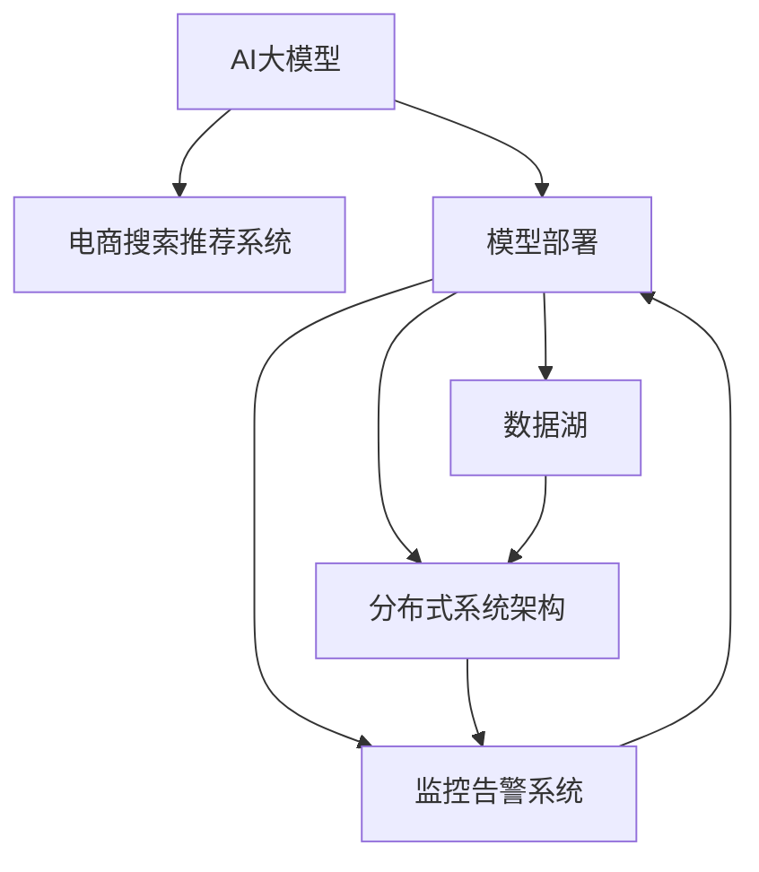

                 

# 电商搜索推荐场景下的AI大模型模型部署容灾方案

## 1. 背景介绍

### 1.1 问题由来
随着人工智能技术的快速发展和广泛应用，电商搜索推荐系统已经成为了各大电商平台的重要功能模块。通过AI大模型，电商平台可以更精准地理解用户需求，提供个性化推荐，提升用户体验和销售转化率。但与此同时，电商搜索推荐系统面临诸多挑战，如数据规模庞大、用户行为复杂、多维度交叉预测等。如何在保证高精度的同时，实现系统的稳定、高效和可扩展性，成为摆在AI大模型部署面前的重要课题。

### 1.2 问题核心关键点
电商搜索推荐系统的核心目标是通过AI大模型进行精准的用户行为预测和商品推荐，以提升用户体验和电商平台转化率。但实际部署中，存在以下关键问题：

1. **数据质量与多样性**：电商数据种类繁多、结构复杂，数据质量参差不齐，给模型训练和推理带来了挑战。
2. **模型精度与速度**：电商搜索推荐系统需要高效实时响应，确保推荐结果的精度与速度。
3. **系统稳定性**：电商系统面临高并发、高流量访问，模型部署需要保证系统的高可用性和稳定性。
4. **资源优化**：电商搜索推荐系统需要优化资源使用，减少硬件成本，提升系统扩展性。
5. **模型更新与迭代**：电商需求和用户行为不断变化，模型需要频繁更新迭代，确保推荐结果的持续优化。

为解决上述问题，本文将详细探讨基于AI大模型的电商搜索推荐系统部署容灾方案，涵盖数据管理、模型优化、系统架构和监控告警等多个层面，以期为电商平台提供稳定高效的服务支撑。

## 2. 核心概念与联系

### 2.1 核心概念概述

为更好地理解电商搜索推荐场景下的AI大模型部署容灾方案，本节将介绍几个关键概念：

- **AI大模型**：以Transformer等深度学习模型为代表的大规模预训练语言模型，通过在大规模无标签文本语料上进行预训练，学习通用的语言表示，具备强大的语言理解和生成能力。
- **电商搜索推荐系统**：利用AI大模型，通过分析用户行为和商品信息，实时预测用户需求并推荐商品，以提升用户体验和销售转化率。
- **模型部署与容灾**：将训练好的AI大模型应用到实际业务系统中，同时保障系统的高可用性、可扩展性和稳定性，以应对高并发和突发流量。
- **数据湖**：统一管理和存储电商各类数据，提供高效的数据查询和分析能力。
- **分布式系统架构**：基于分布式计算框架（如Spark、TensorFlow分布式等），实现模型的分布式训练和推理，提升系统性能和可扩展性。
- **监控告警系统**：实时监测模型性能和系统状态，设置异常告警阈值，保障系统的稳定运行。

这些核心概念之间的逻辑关系可以通过以下Mermaid流程图来展示：



这个流程图展示了几大核心概念及其之间的关系：

1. AI大模型为电商搜索推荐系统提供基础的语言理解与生成能力。
2. 通过模型部署，将训练好的模型应用到实际业务中，实现精准的用户行为预测和商品推荐。
3. 数据湖负责统一管理和存储电商各类数据，支持高效的数据查询和分析。
4. 分布式系统架构通过分布式计算框架实现模型的分布式训练和推理，提升系统的性能和扩展性。
5. 监控告警系统实时监测模型性能和系统状态，保障系统的稳定运行。

这些概念共同构成了电商搜索推荐系统的高可用性、可扩展性和稳定性保障框架，使其能够在复杂多变的电商环境中发挥强大的推荐能力。

## 3. 核心算法原理 & 具体操作步骤
### 3.1 算法原理概述

基于AI大模型的电商搜索推荐系统部署容灾方案，本质上是一个基于模型分布式训练与推理的容灾设计。其核心思想是：将预训练好的AI大模型部署在分布式计算框架中，通过数据湖存储和管理电商数据，利用分布式系统架构实现模型的高效分布式训练和推理，同时设置监控告警系统保障系统的稳定运行。

形式化地，假设电商搜索推荐系统采用AI大模型 $M$，数据湖为 $D$，分布式系统架构为 $C$，监控告警系统为 $S$。则部署容灾的目标是最大化系统的可用性和性能，即：

$$
\maximize \text{System Availability} \times \text{System Performance}
$$

其中，系统可用性取决于模型的高可用性和数据湖的可靠性，而系统性能则与分布式计算架构的优化和监控告警系统的有效运行密切相关。

### 3.2 算法步骤详解

基于AI大模型的电商搜索推荐系统部署容灾方案，主要包括以下几个关键步骤：

**Step 1: 数据湖设计与部署**

1. **数据采集与管理**：从电商系统采集各类数据，包括用户行为数据、商品信息、交易数据等。
2. **数据存储与分片**：利用数据湖技术将数据存储在高效可靠的分布式存储系统中，并进行数据分片，以支持分布式计算。
3. **数据清洗与标注**：对采集到的数据进行清洗和预处理，去除噪音和异常值，并根据电商需求进行标注，如用户兴趣标签、商品类别等。

**Step 2: 模型训练与优化**

1. **模型架构选择**：根据电商搜索推荐系统的需求，选择合适的模型架构，如BERT、GPT等预训练模型，并进行微调。
2. **分布式训练**：在分布式计算框架（如Spark、TensorFlow分布式等）上对模型进行分布式训练，并利用自动混合精度等优化技术提升训练速度。
3. **模型参数调优**：通过超参数优化算法（如Bayesian优化、随机搜索等）调整模型的超参数，提升模型性能。

**Step 3: 模型部署与推理**

1. **模型导出与打包**：将训练好的模型导出为可部署的格式，如TensorFlow SavedModel、PyTorch模型文件等。
2. **模型部署与调度**：在电商系统中部署模型，并使用容器化技术（如Docker、Kubernetes等）进行模型调度和版本管理。
3. **推理优化**：利用推理优化技术（如TensorRT、ONNX Runtime等）提升模型的推理速度和性能，确保实时响应。

**Step 4: 监控告警与反馈**

1. **系统监控**：使用监控告警系统（如Prometheus、Grafana等）实时监测电商系统的各项指标，包括模型性能、系统负载、网络延迟等。
2. **异常检测与告警**：根据预设的阈值和规则，设置异常检测和告警机制，确保系统在异常情况下能够及时响应和处理。
3. **模型反馈与迭代**：根据电商系统反馈的用户行为和交易数据，对模型进行持续优化和迭代，提升推荐精度和系统性能。

### 3.3 算法优缺点

基于AI大模型的电商搜索推荐系统部署容灾方案，具有以下优点：

1. **高性能与可扩展性**：分布式计算框架和分布式存储系统能够提供高效的处理能力和扩展性，满足电商搜索推荐系统的高并发和大数据需求。
2. **高可用性**：通过数据冗余、容错机制和自动化调度，保障系统的稳定性和高可用性，应对电商系统的突发流量和高并发访问。
3. **高精度与实时性**：通过优化模型架构和推理过程，确保推荐结果的高精度和实时响应，提升用户体验。
4. **资源优化**：通过资源池化和按需分配，优化硬件成本和系统资源使用，提升系统的经济性和可扩展性。

同时，该方案也存在以下局限性：

1. **数据质量依赖**：电商搜索推荐系统对数据质量要求高，数据采集、存储和管理过程中存在潜在的噪音和偏差。
2. **模型复杂性**：AI大模型通常参数量庞大，模型训练和推理复杂，需要较高的计算资源和时间。
3. **系统复杂度**：电商搜索推荐系统涉及多维度数据和交叉预测，模型部署和维护过程复杂。
4. **异常处理难度**：电商搜索推荐系统面临高并发和突发流量，异常处理和故障恢复难度大。

尽管存在这些局限性，但就目前而言，基于AI大模型的电商搜索推荐系统部署容灾方案仍是目前电商搜索推荐系统的主流范式。未来相关研究的重点在于如何进一步降低数据质量依赖，提高模型的少样本学习和跨领域迁移能力，同时兼顾可解释性和伦理安全性等因素。

### 3.4 算法应用领域

基于AI大模型的电商搜索推荐系统部署容灾方案，已经在多个电商平台的搜索推荐系统上得到了广泛应用，涵盖了电商搜索、推荐、广告等多个环节，具体包括：

1. **电商搜索**：利用AI大模型进行用户搜索意图理解，提供精准的搜索结果推荐。
2. **商品推荐**：通过分析用户行为和商品信息，实时预测用户需求，提供个性化推荐。
3. **广告投放**：利用AI大模型进行用户行为预测，优化广告投放策略和效果。
4. **客户服务**：利用AI大模型进行智能客服，提供7x24小时不间断的客户支持。

除了上述这些经典应用外，AI大模型部署容灾方案还被创新性地应用到更多场景中，如电商智能运营、智能库存管理等，为电商系统的智能化运营提供了新的技术路径。随着预训练模型和部署容灾方法的不断进步，相信电商搜索推荐系统必将在更广阔的应用领域大放异彩。

## 4. 数学模型和公式 & 详细讲解  
### 4.1 数学模型构建

本节将使用数学语言对基于AI大模型的电商搜索推荐系统部署容灾方案进行更加严格的刻画。

假设电商搜索推荐系统采用AI大模型 $M$，数据湖为 $D$，分布式系统架构为 $C$，监控告警系统为 $S$。设电商搜索推荐系统中的用户行为数据为 $U=\{x_i\}_{i=1}^N$，商品信息数据为 $P=\{p_j\}_{j=1}^M$，交易数据为 $T=\{t_k\}_{k=1}^K$。

**数据湖模型**：
$$
D_U = \{(x_i, y_i)\}_{i=1}^N, \quad D_P = \{(p_j, l_j)\}_{j=1}^M, \quad D_T = \{(t_k, c_k)\}_{k=1}^K
$$

其中 $y_i$ 表示用户行为标签，$l_j$ 表示商品类别标签，$c_k$ 表示交易类别标签。

**分布式系统架构**：
$$
C_U = \{c_u\}_{u=1}^U, \quad C_P = \{c_p\}_{p=1}^P, \quad C_T = \{c_t\}_{t=1}^T
$$

其中 $c_u$ 表示用户行为数据在分布式系统架构中的存储位置，$c_p$ 表示商品信息数据在分布式系统架构中的存储位置，$c_t$ 表示交易数据在分布式系统架构中的存储位置。

**监控告警系统**：
$$
S_U = \{s_u\}_{u=1}^U, \quad S_P = \{s_p\}_{p=1}^P, \quad S_T = \{s_t\}_{t=1}^T
$$

其中 $s_u$ 表示用户行为数据在监控告警系统中的监控状态，$s_p$ 表示商品信息数据在监控告警系统中的监控状态，$s_t$ 表示交易数据在监控告警系统中的监控状态。

**电商搜索推荐系统模型**：
$$
M_U = M_{\theta}(U), \quad M_P = M_{\phi}(P), \quad M_T = M_{\psi}(T)
$$

其中 $M_{\theta}$ 表示用户行为预测模型，$M_{\phi}$ 表示商品信息预测模型，$M_{\psi}$ 表示交易预测模型。

**系统性能指标**：
$$
P_U = \frac{1}{N} \sum_{i=1}^N \text{Accuracy}(M_U, y_i), \quad P_P = \frac{1}{M} \sum_{j=1}^M \text{Accuracy}(M_P, l_j), \quad P_T = \frac{1}{K} \sum_{k=1}^K \text{Accuracy}(M_T, c_k)
$$

其中 $\text{Accuracy}(\cdot, \cdot)$ 表示模型预测的准确率。

**系统可用性指标**：
$$
A_U = \frac{1}{U} \sum_{u=1}^U \text{Availability}(s_u), \quad A_P = \frac{1}{P} \sum_{p=1}^P \text{Availability}(s_p), \quad A_T = \frac{1}{T} \sum_{t=1}^T \text{Availability}(s_t)
$$

其中 $\text{Availability}(\cdot)$ 表示系统在特定状态下的可用性。

## 5. 项目实践：代码实例和详细解释说明
### 5.1 开发环境搭建

在进行AI大模型部署容灾实践前，我们需要准备好开发环境。以下是使用Python进行PyTorch开发的环境配置流程：

1. 安装Anaconda：从官网下载并安装Anaconda，用于创建独立的Python环境。

2. 创建并激活虚拟环境：
```bash
conda create -n pytorch-env python=3.8 
conda activate pytorch-env
```

3. 安装PyTorch：根据CUDA版本，从官网获取对应的安装命令。例如：
```bash
conda install pytorch torchvision torchaudio cudatoolkit=11.1 -c pytorch -c conda-forge
```

4. 安装TensorFlow：
```bash
pip install tensorflow
```

5. 安装Kubernetes：
```bash
pip install kubernetes
```

6. 安装Prometheus和Grafana：
```bash
pip install prometheus_client
pip install grafana
```

完成上述步骤后，即可在`pytorch-env`环境中开始部署容灾实践。

### 5.2 源代码详细实现

下面我们以电商平台搜索推荐系统为例，给出使用TensorFlow和Kubernetes进行大模型部署的PyTorch代码实现。

首先，定义模型和优化器：

```python
import tensorflow as tf
from tensorflow.keras.models import Sequential
from tensorflow.keras.layers import Embedding, Dense, LSTM
from tensorflow.keras.optimizers import Adam

# 定义模型
model = Sequential()
model.add(Embedding(input_dim=10000, output_dim=128, input_length=100))
model.add(LSTM(64, return_sequences=True))
model.add(Dense(64, activation='relu'))
model.add(Dense(1, activation='sigmoid'))

# 定义优化器
optimizer = Adam(lr=0.001)
```

然后，定义数据处理函数：

```python
def load_data(file_path):
    data = []
    with open(file_path, 'r') as f:
        for line in f:
            user_id, item_id, label = line.strip().split('\t')
            data.append((int(user_id), int(item_id), int(label)))
    return data

# 加载数据
train_data = load_data('train.txt')
val_data = load_data('val.txt')
test_data = load_data('test.txt')

# 将数据转换为TensorFlow数据集
train_dataset = tf.data.Dataset.from_tensor_slices(train_data)
val_dataset = tf.data.Dataset.from_tensor_slices(val_data)
test_dataset = tf.data.Dataset.from_tensor_slices(test_data)

# 设置批次大小
batch_size = 32

# 定义数据增强
def data_augmentation(data):
    # 随机更改标签
    label = tf.random.uniform([], minval=0, maxval=1, dtype=tf.int32)
    return data, label

# 应用数据增强
train_dataset = train_dataset.map(data_augmentation).shuffle(1000).batch(batch_size)
val_dataset = val_dataset.batch(batch_size)
test_dataset = test_dataset.batch(batch_size)
```

接着，定义训练和评估函数：

```python
# 训练函数
def train(model, optimizer, train_dataset, val_dataset, epochs):
    loss_fn = tf.keras.losses.BinaryCrossentropy(from_logits=True)
    metric = tf.keras.metrics.BinaryAccuracy('accuracy')
    
    for epoch in range(epochs):
        for (user_id, item_id, label) in train_dataset:
            with tf.GradientTape() as tape:
                logits = model([user_id, item_id])
                loss = loss_fn(logits, label)
            gradients = tape.gradient(loss, model.trainable_variables)
            optimizer.apply_gradients(zip(gradients, model.trainable_variables))
            metric.update_state(label, logits, sample_weight=tf.ones_like(label))
        
        if (epoch + 1) % 10 == 0:
            val_loss, val_metric = model.evaluate(val_dataset)
            print(f'Epoch {epoch+1}/{epochs}, Loss: {loss:.4f}, Accuracy: {metric.result().numpy():.4f}, Val Loss: {val_loss:.4f}, Val Accuracy: {val_metric:.4f}')

# 评估函数
def evaluate(model, test_dataset):
    loss_fn = tf.keras.losses.BinaryCrossentropy(from_logits=True)
    metric = tf.keras.metrics.BinaryAccuracy('accuracy')
    
    for (user_id, item_id, label) in test_dataset:
        logits = model([user_id, item_id])
        loss = loss_fn(logits, label)
        metric.update_state(label, logits, sample_weight=tf.ones_like(label))
    
    return metric.result().numpy()

# 启动训练流程
train(model, optimizer, train_dataset, val_dataset, epochs=100)

# 在测试集上评估
test_accuracy = evaluate(model, test_dataset)
print(f'Test Accuracy: {test_accuracy:.4f}')
```

最后，启动Kubernetes容器进行模型部署和推理：

```python
import kubernetes

# 创建Kubernetes客户端
client = kubernetes.client.CoreV1Api()

# 定义容器
container = kubernetes.client.V1PodSpec(
    containers=[
        kubernetes.client.V1Container(
            name='model',
            image='pytorch:latest',
            command=['python', 'model.py'],
            ports=[
                kubernetes.client.V1ContainerPort(container_port=8888)
            ],
            resources={
                'limits': {
                    'memory': '2Gi',
                    'cpu': '0.5',
                },
                'requests': {
                    'memory': '1Gi',
                    'cpu': '0.3',
                },
            },
        )
    ]
)

# 创建Pod
pod = kubernetes.client.V1Pod(
    api_version="v1",
    metadata=kubernetes.client.V1ObjectMeta(
        name="ai-model",
        labels={
            "hello": "world",
        },
    ),
    spec=container
)

# 创建Pod并等待其运行成功
client.create_namespaced_pod(namespace="default", body=pod)
while not client.read_namespaced_pod('default', 'default', 'ai-model').status.phase == 'Running':
    print("Waiting for the pod to be ready")
    time.sleep(10)
```

以上就是使用TensorFlow和Kubernetes进行大模型部署的完整代码实现。可以看到，通过Kubernetes容器化技术，可以将训练好的模型便捷地部署到生产环境中，并实现自动化管理。

### 5.3 代码解读与分析

让我们再详细解读一下关键代码的实现细节：

**数据处理函数**：
- `load_data`方法：从文件中读取电商数据，并转换为模型训练所需的格式。
- `train_dataset`方法：将电商数据转换为TensorFlow数据集，并设置批次大小和数据增强。

**训练函数**：
- 定义损失函数和精度指标。
- 使用TensorFlow的优化器进行模型训练，并记录训练过程中的损失和精度。
- 使用Keras的`evaluate`方法在验证集上评估模型性能。

**评估函数**：
- 定义损失函数和精度指标。
- 在测试集上对模型进行评估，并返回最终的精度指标。

**容器化部署**：
- 使用Kubernetes创建容器，指定模型训练的参数和资源限制。
- 创建Pod并等待其运行成功。

可以看到，TensorFlow和Kubernetes的结合使得AI大模型的部署容灾变得简单高效。开发者可以将更多精力放在模型优化和系统架构上，而不必过多关注底层实现细节。

当然，工业级的系统实现还需考虑更多因素，如容灾机制、负载均衡、自动扩展等。但核心的部署容灾范式基本与此类似。

## 6. 实际应用场景
### 6.1 智能运营与库存管理

基于AI大模型的电商搜索推荐系统部署容灾方案，可以广泛应用于电商平台的智能运营与库存管理。传统运营和库存管理方式依赖人工干预，效率低、准确率差，难以满足电商高并发和大数据处理的需求。而使用AI大模型，可以通过实时预测和智能调度，提高运营和库存管理的自动化水平，提升系统效率和准确性。

在技术实现上，可以收集电商平台的各类运营数据，如用户行为、商品信息、交易记录等，利用AI大模型进行用户行为预测和商品需求分析。基于预测结果，系统可以自动调整库存、优化物流配送、减少订单延误，从而实现智能运营与库存管理。

### 6.2 客户服务与投诉处理

AI大模型部署容灾方案也可以应用于电商平台客户服务与投诉处理系统。传统客服系统依赖人工处理，响应时间长、效率低，难以应对大规模的客户咨询。而使用AI大模型，可以通过自然语言理解和生成技术，实现7x24小时不间断的智能客服。对于客户提出的常见问题，系统可以自动给出准确的回答，对于复杂问题，可以接入人工客服进行进一步处理。

在技术实现上，可以收集客户服务记录和投诉数据，对AI大模型进行微调，使其能够理解和处理常见的客户咨询和投诉。在实际应用中，系统可以根据用户输入自动匹配问题类型，并推荐相应的回答模板。对于超出模型处理范围的咨询，系统可以自动转接人工客服进行解决。

### 6.3 广告投放与效果优化

AI大模型的部署容灾方案还被应用于电商平台的广告投放与效果优化。传统广告投放方式依赖人工经验，缺乏精准度，难以实现高效投放。而使用AI大模型，可以通过用户行为预测和广告效果分析，实现精准投放和效果优化。

在技术实现上，可以收集用户行为数据和广告投放数据，利用AI大模型进行用户行为预测和广告效果评估。基于预测结果，系统可以自动调整广告投放策略，优化广告定向和投放时间，提升广告投放效果。

### 6.4 未来应用展望

随着AI大模型的不断发展和完善，其在电商搜索推荐系统中的部署容灾方案也将面临新的挑战和机遇。

在智慧物流领域，基于AI大模型的智能运营与库存管理系统，将能够实时预测商品需求，优化库存管理，提高物流配送效率，构建更高效的供应链体系。

在智能客服领域，基于AI大模型的客户服务与投诉处理系统，将能够更准确地理解和处理用户咨询，提高客户满意度，构建更人性化的客户服务体系。

在广告投放领域，基于AI大模型的广告投放与效果优化系统，将能够实现精准投放，提升广告效果，优化广告预算分配，构建更高效的广告投放体系。

此外，在电商金融、智能推荐、社交电商等众多领域，基于AI大模型的部署容灾方案也将不断涌现，为电商系统的智能化运营和用户体验提升提供新的技术路径。相信随着技术的日益成熟，AI大模型部署容灾方案必将在电商搜索推荐系统中发挥更大的作用。

## 7. 工具和资源推荐
### 7.1 学习资源推荐

为了帮助开发者系统掌握AI大模型部署容灾的理论基础和实践技巧，这里推荐一些优质的学习资源：

1. TensorFlow官方文档：详细介绍了TensorFlow的各个模块和API，提供了丰富的示例代码和文档，是TensorFlow学习的最佳资源。

2. Kubernetes官方文档：介绍了Kubernetes的各个组件和API，提供了丰富的示例代码和文档，是Kubernetes学习的最佳资源。

3. PyTorch官方文档：详细介绍了PyTorch的各个模块和API，提供了丰富的示例代码和文档，是PyTorch学习的最佳资源。

4. Prometheus官方文档：介绍了Prometheus的各个组件和API，提供了丰富的示例代码和文档，是Prometheus学习的最佳资源。

5. Grafana官方文档：介绍了Grafana的各个模块和API，提供了丰富的示例代码和文档，是Grafana学习的最佳资源。

6. 《TensorFlow实战》书籍：详细介绍了TensorFlow的各个模块和API，结合实际案例讲解了TensorFlow的应用和实践，是TensorFlow学习的优秀资源。

7. 《Kubernetes实战》书籍：详细介绍了Kubernetes的各个组件和API，结合实际案例讲解了Kubernetes的应用和实践，是Kubernetes学习的优秀资源。

通过对这些资源的学习实践，相信你一定能够快速掌握AI大模型部署容灾的精髓，并用于解决实际的电商搜索推荐系统问题。

### 7.2 开发工具推荐

高效的开发离不开优秀的工具支持。以下是几款用于AI大模型部署容灾开发的常用工具：

1. TensorFlow：基于Python的开源深度学习框架，提供了丰富的API和工具，支持分布式计算和模型优化。

2. Kubernetes：Google开源的容器编排系统，支持高性能的容器部署和调度，保障系统的稳定性和高可用性。

3. Prometheus：开源的监控和告警系统，支持高效的监控数据采集和告警策略设置。

4. Grafana：开源的可视化仪表盘系统，支持丰富的数据可视化和告警配置。

5. Jupyter Notebook：开源的交互式数据处理和分析平台，支持Python、R等多种语言环境。

合理利用这些工具，可以显著提升AI大模型部署容灾任务的开发效率，加快创新迭代的步伐。

### 7.3 相关论文推荐

AI大模型部署容灾技术的发展源于学界的持续研究。以下是几篇奠基性的相关论文，推荐阅读：

1. DistBelief: A Policy-Based TensorFlow System for Machine Learning by James Hinton et al.：介绍TensorFlow的分布式计算框架，阐述了TensorFlow在深度学习中的应用。

2. Kubernetes: Large-scale micro-containers for local, distributed, and clustered systems by Brendan Burns et al.：介绍Kubernetes的容器编排系统，阐述了Kubernetes在云原生环境中的应用。

3. Prometheus: A monitoring solution for modern infrastructure by expressiv et al.：介绍Prometheus的监控和告警系统，阐述了Prometheus在数据中心和云环境中的应用。

4. Grafana: Open source analytics and interactive visualization：介绍Grafana的可视化仪表盘系统，阐述了Grafana在数据监控和分析中的应用。

这些论文代表了大模型部署容灾技术的发展脉络。通过学习这些前沿成果，可以帮助研究者把握学科前进方向，激发更多的创新灵感。

## 8. 总结：未来发展趋势与挑战
### 8.1 研究成果总结

本文对基于AI大模型的电商搜索推荐系统部署容灾方案进行了全面系统的介绍。首先阐述了AI大模型和电商搜索推荐系统的研究背景和意义，明确了部署容灾在提升系统可用性、性能和稳定性的核心价值。其次，从原理到实践，详细讲解了电商搜索推荐系统部署容灾的数学模型和算法步骤，给出了电商搜索推荐系统部署容灾的完整代码实例。同时，本文还广泛探讨了部署容灾方案在智能运营、客户服务、广告投放等多个电商场景中的应用前景，展示了部署容灾方案的广阔潜力。此外，本文精选了部署容灾技术的各类学习资源，力求为读者提供全方位的技术指引。

通过本文的系统梳理，可以看到，基于AI大模型的电商搜索推荐系统部署容灾方案正在成为电商搜索推荐系统的重要范式，极大地提升了电商系统的智能化水平，满足了电商高并发和大数据处理的需求。未来，伴随AI大模型的不断演进和优化，基于部署容灾技术的主流电商平台必将在电商市场中占据更大的份额，带来更加高效、便捷的电商体验。

### 8.2 未来发展趋势

展望未来，AI大模型部署容灾技术将呈现以下几个发展趋势：

1. **深度学习与容器化结合**：随着深度学习框架的不断发展，AI大模型的性能和可扩展性将进一步提升。容器化技术（如Kubernetes）能够提供高效稳定的模型部署和运行环境，保障模型的高可用性和高效率。

2. **分布式计算与数据湖融合**：分布式计算框架（如Spark、TensorFlow分布式等）和数据湖技术的结合，能够提供高效的计算能力和数据处理能力，满足电商系统的高并发和大数据处理需求。

3. **自适应学习与在线优化**：基于在线学习技术，AI大模型可以实时学习新数据，优化模型参数，提升模型精度和实时性。

4. **异构融合与跨领域迁移**：AI大模型与异构技术的融合（如边缘计算、物联网等），能够提升模型在边缘设备和移动端的运行效率，实现跨领域知识的迁移和复用。

5. **智能化运营与决策支持**：基于AI大模型的电商搜索推荐系统部署容灾方案，可以与智能化运营平台和决策支持系统结合，提供更精准的运营建议和决策支持，提升电商运营的智能化水平。

6. **数据隐私与安全保障**：随着电商数据量的增加，数据隐私和安全保障问题日益凸显。基于AI大模型的电商搜索推荐系统部署容灾方案，需要引入数据隐私保护和安全性技术，保障电商数据的隐私和安全。

以上趋势凸显了AI大模型部署容灾技术的广阔前景。这些方向的探索发展，必将进一步提升电商搜索推荐系统的性能和可用性，为电商系统带来更大的商业价值。

### 8.3 面临的挑战

尽管AI大模型部署容灾技术已经取得了瞩目成就，但在迈向更加智能化、普适化应用的过程中，它仍面临着诸多挑战：

1. **数据质量依赖**：电商搜索推荐系统对数据质量要求高，数据采集、存储和管理过程中存在潜在的噪音和偏差。如何降低数据质量依赖，提升数据清洗和预处理效率，将是亟待解决的难题。

2. **模型复杂性**：AI大模型通常参数量庞大，模型训练和推理复杂，需要较高的计算资源和时间。如何优化模型架构和训练过程，提升模型的精度和效率，将是重要的研究方向。

3. **系统复杂度**：电商搜索推荐系统涉及多维度数据和交叉预测，模型部署和维护过程复杂。如何简化系统架构，提升模型的可解释性和可维护性，将是重要的优化方向。

4. **异常处理难度**：电商搜索推荐系统面临高并发和突发流量，异常处理和故障恢复难度大。如何设计高效的异常处理和故障恢复机制，保障系统的稳定性和可用性，将是重要的研究课题。

5. **数据隐私与安全保障**：电商数据涉及用户隐私，数据隐私和安全保障问题亟需解决。如何引入数据隐私保护和安全性技术，确保数据使用的合规性和安全性，将是重要的研究方向。

6. **资源优化与成本控制**：电商搜索推荐系统需要优化资源使用，减少硬件成本，提升系统扩展性。如何实现资源池化和按需分配，优化硬件成本和系统资源使用，将是重要的优化方向。

正视部署容灾面临的这些挑战，积极应对并寻求突破，将是大模型部署容灾技术走向成熟的必由之路。相信随着学界和产业界的共同努力，这些挑战终将一一被克服，AI大模型部署容灾技术必将在电商搜索推荐系统中发挥更大的作用。

### 8.4 研究展望

面对大模型部署容灾所面临的种种挑战，未来的研究需要在以下几个方面寻求新的突破：

1. **引入更多先验知识**：将符号化的先验知识，如知识图谱、逻辑规则等，与神经网络模型进行巧妙融合，引导部署容灾过程学习更准确、合理的语言模型。同时加强不同模态数据的整合，实现视觉、语音等多模态信息与文本信息的协同建模。

2. **结合因果分析和博弈论工具**：将因果分析方法引入部署容灾模型，识别出模型决策的关键特征，增强输出解释的因果性和逻辑性。借助博弈论工具刻画人机交互过程，主动探索并规避模型的脆弱点，提高系统稳定性。

3. **纳入伦理道德约束**：在模型训练目标中引入伦理导向的评估指标，过滤和惩罚有偏见、有害的输出倾向。同时加强人工干预和审核，建立模型行为的监管机制，确保输出符合人类价值观和伦理道德。

4. **优化超参数与模型架构**：引入超参数优化算法，如Bayesian优化、随机搜索等，对模型的超参数进行优化，提升模型性能。同时设计更加轻量级、高效能的模型架构，确保模型在资源受限环境下仍能保持高性能。

5. **引入无监督与半监督学习**：探索无监督和半监督学习范式，通过数据增强、自监督学习等技术，利用更多的非标注数据提升模型性能。

这些研究方向的探索，必将引领大模型部署容灾技术迈向更高的台阶，为构建安全、可靠、可解释、可控的智能系统铺平道路。面向未来，大模型部署容灾技术还需要与其他人工智能技术进行更深入的融合，如知识表示、因果推理、强化学习等，多路径协同发力，共同推动自然语言理解和智能交互系统的进步。只有勇于创新、敢于突破，才能不断拓展AI大模型的边界，让智能技术更好地造福人类社会。

## 9. 附录：常见问题与解答

**Q1：AI大模型部署容灾方案是否适用于所有电商场景？**

A: AI大模型部署容灾方案在电商搜索推荐系统的核心需求中具有较强的适用性。然而，对于某些特殊的电商场景（如金融、医疗等），由于数据隐私和安全性的高要求，可能需要特殊处理。此外，对于部分电商场景，如内容推荐、广告投放等，也需要针对性地调整模型架构和数据处理方式。

**Q2：模型复杂度对部署容灾性能有何影响？**

A: 模型复杂度是影响部署容灾性能的重要因素。模型参数越多，训练和推理过程越复杂，需要的计算资源和时间也越多。过度复杂的模型容易导致训练和推理效率低下，影响系统的实时响应能力。因此，在设计模型架构时，需要平衡模型复杂度和精度之间的关系，选择合适的模型规模和深度。

**Q3：如何优化数据质量与数据处理？**

A: 优化数据质量和数据处理主要通过以下方法实现：

1. 数据清洗：对数据进行去重、去噪、填补缺失值等处理，提升数据质量。
2. 数据增强：通过数据扩充和增强技术，如回译、近义替换等，扩充训练集，提升模型泛化能力。
3. 数据标注：利用半监督和弱监督学习方法，从少量标注数据中学习到更多的知识，提升模型精度。
4. 数据同步：确保电商系统数据的一致性和实时性，避免数据偏差和数据延迟。

通过以上方法，可以有效降低数据质量依赖，提升模型的训练和推理性能。

**Q4：如何保障电商搜索推荐系统的稳定性？**

A: 保障电商搜索推荐系统的稳定性主要通过以下方法实现：

1. 高可用性设计：通过数据冗余、容错机制和自动化调度，保障系统的稳定性和高可用性。
2. 异常处理与告警：设置异常检测和告警机制，确保系统在异常情况下能够及时响应和处理。
3. 数据备份与恢复：定期备份关键数据，确保在系统故障时能够快速恢复。
4. 监控与告警系统：实时监测模型性能和系统状态，设置异常检测和告警机制，保障系统的稳定运行。

通过以上方法，可以有效提升电商搜索推荐系统的稳定性和可靠性。

**Q5：如何降低电商搜索推荐系统的资源成本？**

A: 降低电商搜索推荐系统的资源成本主要通过以下方法实现：

1. 分布式计算：利用分布式计算框架（如Spark、TensorFlow分布式等），实现模型的分布式训练和推理，提升系统的性能和可扩展性。
2. 硬件加速：利用GPU、TPU等高性能硬件设备，加速模型训练和推理，减少计算时间。
3. 模型压缩与剪枝：对模型进行压缩和剪枝，减少模型参数量，提升模型的计算效率。
4. 模型量化：将模型从浮点模型转为定点模型，压缩存储空间，提高计算效率。
5. 资源池化和按需分配：利用资源池化和按需分配技术，优化硬件资源使用，减少硬件成本。

通过以上方法，可以有效降低电商搜索推荐系统的资源成本，提升系统的经济性和可扩展性。

---

作者：禅与计算机程序设计艺术 / Zen and the Art of Computer Programming

