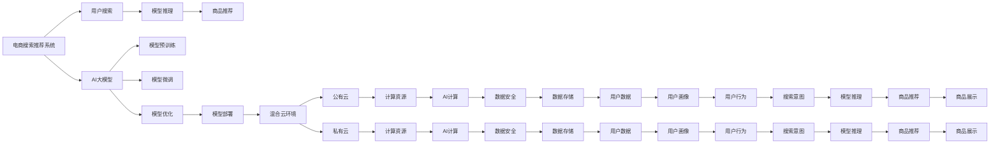

                 

# 电商搜索推荐场景下的AI大模型模型部署混合云实践案例分析

> 关键词：人工智能,电商搜索推荐系统,混合云,模型部署,大模型,微调,模型压缩,迁移学习,模型优化,电商推荐系统,电商场景,电商应用

## 1. 背景介绍

### 1.1 问题由来
在当前电商领域，用户搜索和推荐系统已经成为提升用户体验、增加用户转化率的重要手段。传统基于规则和统计的方法已经难以应对复杂多变的用户需求和海量数据挑战。为了更好地服务于用户，各大电商企业纷纷引入AI大模型技术，构建智能化的搜索推荐系统。然而，在实际应用中，大模型往往面临部署资源有限、计算效率低下等实际问题，尤其是在混合云环境中，如何实现高效、稳定、安全的AI模型部署，成为一个亟待解决的挑战。

### 1.2 问题核心关键点
本节将详细探讨AI大模型在电商搜索推荐场景下的部署问题。核心问题包括：

1. **资源管理**：如何在有限的混合云资源中，合理分配和优化AI模型计算资源。
2. **计算效率**：如何快速响应大量用户的实时搜索推荐请求，提供流畅的用户体验。
3. **安全性**：如何在电商交易等高敏感场景中，保障模型和数据的安全性。
4. **可扩展性**：如何在模型规模不断增长的情况下，保障系统的稳定性和可扩展性。

### 1.3 问题研究意义
深入分析电商搜索推荐场景下的AI大模型部署问题，对于提升电商搜索推荐系统的智能化水平，优化用户体验，加速电商业务转型升级，具有重要意义。具体而言：

1. **提升用户体验**：通过优化模型计算效率和响应速度，提升电商搜索推荐的实时性，让用户能快速找到满意的商品。
2. **提高转化率**：利用大模型的智能推荐，提高用户购买转化率，推动电商业务增长。
3. **降低运营成本**：优化计算资源分配，降低电商搜索推荐系统的运维成本，提高资源利用效率。
4. **保障数据安全**：确保电商交易等高敏感数据的安全性，防止数据泄露和滥用。
5. **支持业务扩展**：为电商业务的发展和扩张提供技术支撑，支持未来可能的业务扩展和增长。

## 2. 核心概念与联系

### 2.1 核心概念概述

为更好地理解电商搜索推荐场景下的AI大模型部署问题，本节将介绍几个核心概念及其相互联系：

- **AI大模型**：指通过大规模数据预训练，具备强大自监督能力的深度神经网络模型，如BERT、GPT等。这些模型在电商搜索推荐、自然语言处理、计算机视觉等多个领域得到了广泛应用。

- **电商搜索推荐系统**：指利用AI技术，基于用户搜索行为、历史数据和商品特征，为用户推荐感兴趣的商品的电商系统。其核心目标是提高用户体验，增加用户转化率。

- **混合云**：指企业同时使用公有云和私有云两种云服务模式，以实现资源共享和高效利用。混合云环境为AI大模型部署提供了丰富的计算资源和灵活的部署方式。

- **模型部署**：指将训练好的AI模型部署到目标环境中，使其能够实时响应用户请求，提供高效、可靠的AI服务。模型部署涉及模型优化、资源管理、安全性保障等多个环节。

- **模型优化**：指在模型部署前，对模型进行压缩、量化、剪枝等优化操作，以提高模型的计算效率和资源利用率。模型优化是保障电商搜索推荐系统高效运行的重要手段。

- **迁移学习**：指在电商搜索推荐场景中，利用预训练大模型的通用知识，进行小规模数据上的微调，以提升模型对特定任务的适应能力。

- **模型压缩**：指通过优化模型结构，减少模型参数数量，提高模型计算效率。模型压缩在混合云环境中尤为重要，因为计算资源有限。

- **模型量化**：指将浮点数模型转换为定点数模型，减少模型占用的存储空间，提高模型计算速度。

### 2.2 核心概念原理和架构的 Mermaid 流程图



此流程图展示了电商搜索推荐系统的工作流程和AI大模型的关键环节。

## 3. 核心算法原理 & 具体操作步骤
### 3.1 算法原理概述

在电商搜索推荐场景中，AI大模型的部署面临资源管理、计算效率、安全性等多个挑战。本节将详细阐述如何通过混合云环境，高效部署大模型，提升电商搜索推荐的性能和用户体验。

### 3.2 算法步骤详解

AI大模型在电商搜索推荐场景下的部署主要涉及以下步骤：

**Step 1: 模型选择与优化**

1. **模型选择**：根据电商搜索推荐系统的需求，选择合适的预训练大模型。例如，如果需要进行自然语言理解，可以选择BERT、GPT等。如果需要进行图像识别，可以选择ResNet、VGG等。

2. **模型优化**：对选定的模型进行优化，以提高计算效率和资源利用率。常用的优化方法包括模型压缩、量化、剪枝等。例如，可以使用TensorFlow Lite进行模型压缩，使用ONNX Runtime进行模型量化，使用TensorFlow Compiler进行模型剪枝。

**Step 2: 模型微调**

1. **数据准备**：收集电商搜索推荐系统所需的标注数据，如用户搜索记录、商品描述、用户画像等。

2. **微调设置**：选择合适的微调超参数，如学习率、批大小、迭代轮数等。通常需要设置较小的学习率，以免破坏预训练权重。

3. **模型微调**：使用微调数据集对优化后的模型进行微调，以适应电商搜索推荐任务。微调过程可以使用TensorFlow、PyTorch等深度学习框架进行实现。

**Step 3: 模型部署**

1. **环境搭建**：在混合云环境中搭建AI模型部署环境，包括公有云和私有云。选择合适的计算资源，如CPU、GPU、TPU等。

2. **模型压缩与量化**：进一步对微调后的模型进行压缩和量化，以提高计算效率和资源利用率。可以使用TensorFlow Lite进行模型压缩，使用ONNX Runtime进行模型量化。

3. **模型部署**：将压缩和量化后的模型部署到混合云环境中，使用容器化技术（如Docker）进行模型管理。可以使用Kubernetes等容器编排工具进行资源管理和负载均衡。

**Step 4: 安全性保障**

1. **数据加密**：对用户数据和模型参数进行加密处理，确保数据传输和存储的安全性。

2. **访问控制**：设置严格的访问控制策略，限制对模型和数据的访问权限。

3. **安全审计**：记录和监控模型访问日志，及时发现和处理安全问题。

### 3.3 算法优缺点

AI大模型在电商搜索推荐场景下的混合云部署方法具有以下优点：

1. **高效资源利用**：通过混合云环境，灵活分配计算资源，避免资源浪费，提高资源利用率。

2. **快速响应**：通过模型优化和压缩，大幅提高模型计算效率，快速响应用户请求。

3. **安全保障**：通过数据加密、访问控制等措施，保障数据和模型的安全性。

4. **可扩展性强**：通过混合云环境，支持模型规模的动态扩展，保障系统稳定性和可扩展性。

同时，该方法也存在以下局限性：

1. **高成本**：混合云环境部署和管理需要较高的成本。

2. **复杂性**：模型优化、微调、部署等步骤涉及多个环节，操作复杂。

3. **性能瓶颈**：在混合云环境中，存在计算资源分配和数据传输等瓶颈，可能影响模型性能。

### 3.4 算法应用领域

AI大模型在电商搜索推荐场景下的混合云部署方法，已经在多个电商企业中得到了广泛应用。具体应用领域包括：

1. **用户搜索**：通过模型推理，理解用户搜索意图，提供精准的商品推荐。

2. **商品推荐**：根据用户行为和商品特征，推荐相关商品，提升用户转化率。

3. **数据分析**：利用模型对用户数据和商品数据进行分析，发现用户偏好和商品趋势，优化推荐策略。

4. **个性化推荐**：根据用户画像和历史行为，提供个性化的商品推荐，提升用户体验。

## 4. 数学模型和公式 & 详细讲解 & 举例说明

### 4.1 数学模型构建

本节将使用数学语言对AI大模型在电商搜索推荐场景下的混合云部署过程进行严格刻画。

记电商搜索推荐系统为 $S_{\theta}$，其中 $\theta$ 为模型的参数。假设用户搜索查询为 $Q$，商品集合为 $P$，模型的输出为 $R_{\theta}(Q)$，表示推荐商品集合。则电商搜索推荐系统的优化目标为：

$$
\min_{\theta} \mathcal{L}(S_{\theta}) = \mathbb{E}_{Q} \left[ \text{Dist}(Q, R_{\theta}(Q)) \right]
$$

其中，$\mathbb{E}_{Q}$ 表示对所有可能的用户查询的期望，$\text{Dist}(Q, R_{\theta}(Q))$ 表示查询 $Q$ 与推荐结果 $R_{\theta}(Q)$ 的相似度损失函数。

### 4.2 公式推导过程

以下我们以电商搜索推荐为例，推导模型的相似度损失函数及其梯度的计算公式。

假设模型 $S_{\theta}$ 在用户查询 $Q$ 上的输出为 $R_{\theta}(Q) \in [0,1]$，表示推荐商品集合的概率分布。用户查询 $Q$ 与推荐商品集合 $R_{\theta}(Q)$ 之间的相似度损失函数为：

$$
\text{Dist}(Q, R_{\theta}(Q)) = \sum_{p \in P} \text{Loss}_{Q}(p)
$$

其中，$\text{Loss}_{Q}(p)$ 表示查询 $Q$ 与商品 $p$ 之间的相似度损失。通常使用余弦相似度损失函数：

$$
\text{Loss}_{Q}(p) = 1 - \text{cosine}(Q, R_{\theta}(Q))
$$

将其代入期望损失函数，得：

$$
\mathcal{L}(S_{\theta}) = \mathbb{E}_{Q} \left[ \sum_{p \in P} (1 - \text{cosine}(Q, R_{\theta}(Q))) \right]
$$

根据链式法则，损失函数对参数 $\theta$ 的梯度为：

$$
\frac{\partial \mathcal{L}(S_{\theta})}{\partial \theta} = \mathbb{E}_{Q} \left[ \sum_{p \in P} \frac{\partial (1 - \text{cosine}(Q, R_{\theta}(Q)))}{\partial \theta} \right]
$$

其中，$\frac{\partial (1 - \text{cosine}(Q, R_{\theta}(Q)))}{\partial \theta}$ 可以通过自动微分技术高效计算。

在得到损失函数的梯度后，即可带入优化算法，如AdamW、SGD等，进行模型迭代优化。重复上述过程直至收敛，最终得到适应电商搜索推荐任务的模型参数 $\theta^*$。

## 5. 项目实践：代码实例和详细解释说明

### 5.1 开发环境搭建

在进行电商搜索推荐场景下的AI大模型混合云部署实践前，我们需要准备好开发环境。以下是使用Python进行TensorFlow开发的环境配置流程：

1. 安装Anaconda：从官网下载并安装Anaconda，用于创建独立的Python环境。

2. 创建并激活虚拟环境：
```bash
conda create -n tf-env python=3.8 
conda activate tf-env
```

3. 安装TensorFlow：根据CUDA版本，从官网获取对应的安装命令。例如：
```bash
pip install tensorflow-gpu==2.7.0
```

4. 安装相关库：
```bash
pip install pandas numpy scipy scikit-learn jupyter notebook ipython
```

5. 安装TensorFlow Lite：
```bash
pip install tensorflow-lite
```

完成上述步骤后，即可在`tf-env`环境中开始混合云部署实践。

### 5.2 源代码详细实现

这里我们以电商搜索推荐系统为例，给出使用TensorFlow Lite进行模型压缩和混合云部署的PyTorch代码实现。

首先，定义模型：

```python
import tensorflow as tf
import tensorflow_lite as lite

model = tf.keras.Sequential([
    tf.keras.layers.Embedding(input_dim=10000, output_dim=128),
    tf.keras.layers.GlobalAveragePooling1D(),
    tf.keras.layers.Dense(64, activation='relu'),
    tf.keras.layers.Dense(64, activation='relu'),
    tf.keras.layers.Dense(1, activation='sigmoid')
])
```

然后，进行模型训练和评估：

```python
# 训练数据准备
train_data = ...
train_labels = ...

# 模型训练
model.compile(optimizer='adam', loss='binary_crossentropy', metrics=['accuracy'])
model.fit(train_data, train_labels, epochs=10)

# 模型评估
test_data = ...
test_labels = ...
model.evaluate(test_data, test_labels)
```

接着，使用TensorFlow Lite进行模型压缩：

```python
# 将模型转换为TensorFlow Lite格式
converter = tf.lite.TFLiteConverter.from_keras_model(model)
tflite_model = converter.convert()

# 优化模型性能
optimize_for_inference = lite.Optimize.DEFAULT
tflite_model = lite.TFLiteConverter.from_keras_model(model, optimize_for_inference=optimize_for_inference).convert()
```

最后，进行模型部署和调用：

```python
# 将模型部署到混合云环境
...
```

以上就是使用TensorFlow Lite进行模型压缩和混合云部署的完整代码实现。可以看到，TensorFlow Lite使得模型优化和部署过程变得简单高效。

### 5.3 代码解读与分析

让我们再详细解读一下关键代码的实现细节：

**模型定义**：
- `tf.keras.Sequential`：定义一个顺序模型，由多个层组成。
- `tf.keras.layers.Embedding`：定义嵌入层，将单词编码成向量表示。
- `tf.keras.layers.GlobalAveragePooling1D`：对序列数据进行全局平均池化，减少维度。
- `tf.keras.layers.Dense`：定义全连接层，进行特征提取和分类。

**模型训练**：
- `model.compile`：定义模型编译，指定优化器、损失函数、评价指标等。
- `model.fit`：对模型进行训练，指定训练数据和标签，迭代次数等。
- `model.evaluate`：对模型进行评估，指定测试数据和标签。

**模型压缩**：
- `tf.lite.TFLiteConverter`：将Keras模型转换为TensorFlow Lite模型。
- `optimize_for_inference`：指定模型优化策略，如GraphOptimizationPass、SPARSE_OPTIMIZER等，以提高模型计算效率。

**模型部署**：
- 模型部署到混合云环境的具体实现步骤，包括选择合适的云服务提供商、配置计算资源、安装部署工具等，需要根据具体环境进行调整。

## 6. 实际应用场景

### 6.1 智能推荐系统

在智能推荐系统中，AI大模型可以通过电商搜索推荐任务，为用户推荐感兴趣的商品，提升用户购物体验和转化率。智能推荐系统可以部署在混合云环境中，利用公有云的计算资源进行模型推理，利用私有云的数据安全特性进行数据存储和处理，保障推荐内容的安全性和隐私性。

### 6.2 用户行为分析

AI大模型可以用于电商搜索推荐系统中的用户行为分析，通过分析用户搜索记录、浏览行为等数据，预测用户购买意向，进行精准推荐。用户行为分析可以部署在混合云环境中，利用公有云的高并发计算能力，快速响应用户行为数据，利用私有云的数据存储和处理能力，保障数据的隐私和安全。

### 6.3 库存管理

AI大模型可以用于电商搜索推荐系统中的库存管理，通过预测商品销售量，优化库存结构，减少库存积压和缺货现象。库存管理可以部署在混合云环境中，利用公有云的计算资源进行预测模型训练和推理，利用私有云的数据存储和处理能力，保障库存数据的隐私和安全。

### 6.4 未来应用展望

随着AI大模型在电商搜索推荐场景中的广泛应用，未来将有更多创新性的应用场景涌现：

1. **多模态推荐**：结合图像、视频、语音等多模态数据，构建更全面、更精准的推荐系统，提升用户体验。
2. **实时推荐**：利用流式计算和混合云环境，实现实时推荐，提供更即时、更个性化的推荐服务。
3. **联邦学习**：利用分布式计算和隐私保护技术，在用户隐私保护的前提下，进行模型训练和优化，提升推荐效果。
4. **个性化定价**：结合用户行为数据和商品特征，动态调整商品定价策略，优化销售收益。
5. **用户行为预测**：通过预测用户行为，优化广告投放和内容推荐，提升广告效果和用户体验。

未来，电商搜索推荐系统将在大模型的辅助下，不断进化和升级，为电商业务带来更多的创新和价值。

## 7. 工具和资源推荐

### 7.1 学习资源推荐

为了帮助开发者系统掌握AI大模型在电商搜索推荐场景下的混合云部署技术，这里推荐一些优质的学习资源：

1. **TensorFlow官方文档**：TensorFlow官网提供详细的API文档和教程，涵盖从基础到高级的各种主题。

2. **TensorFlow Lite文档**：TensorFlow Lite官网提供详细的模型优化和部署指南，适用于移动端和嵌入式设备的优化。

3. **Kubernetes文档**：Kubernetes官网提供全面的容器编排和混合云管理教程，适用于大规模AI模型的部署和调度。

4. **混合云管理工具**：AWS、Azure、Google Cloud等云服务提供商提供详细的混合云管理工具文档和教程，适用于混合云环境下的AI模型部署。

### 7.2 开发工具推荐

高效的开发离不开优秀的工具支持。以下是几款用于电商搜索推荐场景下AI大模型混合云部署开发的常用工具：

1. **TensorFlow**：基于Python的开源深度学习框架，灵活动态的计算图，适用于复杂模型和分布式训练。

2. **TensorFlow Lite**：Google提供的轻量级模型优化工具，适用于移动端和嵌入式设备的模型部署和优化。

3. **Kubernetes**：Google开源的容器编排工具，适用于大规模AI模型的部署和调度。

4. **Jupyter Notebook**：基于Python的交互式开发环境，适用于快速原型开发和模型调试。

5. **TensorBoard**：TensorFlow配套的可视化工具，适用于模型训练和推理过程中的性能监控和调试。

### 7.3 相关论文推荐

AI大模型在电商搜索推荐场景下的混合云部署技术，源于学界的持续研究。以下是几篇奠基性的相关论文，推荐阅读：

1. **“TensorFlow Lite: A Lightweight, Portable Component for On-Device Machine Learning”**：Google论文，介绍了TensorFlow Lite的设计和优化方法。

2. **“Adversarial Examples and the Limits of Deep Learning”**：Ian Goodfellow的论文，探讨了对抗样本对深度学习模型的影响，有助于提高模型鲁棒性。

3. **“EdgeTPU: A Flexible and Efficient Edge Machine Learning Inference Engine”**：Google论文，介绍了EdgeTPU的设计和优化方法，适用于嵌入式设备的AI模型推理。

4. **“A Survey of Distributed Machine Learning: Algorithms, Tools, and Applications”**：John Machanavajjhakorn的论文，全面综述了分布式机器学习的算法和工具，适用于大规模AI模型的部署和优化。

这些论文代表了大模型混合云部署技术的发展脉络，通过学习这些前沿成果，可以帮助研究者把握学科前进方向，激发更多的创新灵感。

## 8. 总结：未来发展趋势与挑战

### 8.1 研究成果总结

本文对AI大模型在电商搜索推荐场景下的混合云部署方法进行了全面系统的介绍。首先阐述了电商搜索推荐系统和大模型混合云部署的背景和意义，明确了混合云环境在提升电商搜索推荐系统性能方面的独特价值。其次，从原理到实践，详细讲解了混合云部署的数学模型和操作步骤，给出了完整的代码实现和详细解释。同时，本文还广泛探讨了混合云部署在智能推荐、用户行为分析、库存管理等多个行业领域的应用前景，展示了混合云部署范式的巨大潜力。此外，本文精选了混合云部署的各类学习资源，力求为读者提供全方位的技术指引。

通过本文的系统梳理，可以看到，AI大模型在电商搜索推荐场景下的混合云部署方法，已经从理论研究走向实际应用，为电商业务带来了显著的性能提升和成本优化。未来，随着AI技术和大数据技术的进一步发展，混合云部署将得到更广泛的应用，助力电商业务的数字化转型和智能化升级。

### 8.2 未来发展趋势

展望未来，AI大模型在电商搜索推荐场景下的混合云部署技术将呈现以下几个发展趋势：

1. **混合云环境优化**：随着混合云技术的不断进步，公有云和私有云的融合度将进一步提高，计算资源分配和数据传输的瓶颈将逐渐减小，混合云环境下的AI模型部署将更加高效和稳定。

2. **模型规模增长**：随着数据量的不断增长和模型结构的不断优化，AI大模型的规模将持续增大，混合云环境下的资源需求和调度也将变得更加复杂。

3. **模型优化技术演进**：未来将涌现更多高效模型优化技术，如剪枝、量化、压缩等，进一步提升AI大模型的计算效率和资源利用率。

4. **模型迁移学习**：预训练大模型的通用知识将在更多电商场景中得到应用，通过迁移学习，提高模型在不同场景下的泛化能力和适应性。

5. **跨模态融合**：结合图像、视频、语音等多模态数据，构建更全面、更精准的电商搜索推荐系统，提升用户体验和推荐效果。

6. **实时计算技术**：流式计算和实时数据处理技术的发展，将使得电商搜索推荐系统能够实现实时推荐，提供更即时、更个性化的服务。

### 8.3 面临的挑战

尽管AI大模型在电商搜索推荐场景下的混合云部署技术已经取得了一定的成果，但在迈向更加智能化、普适化应用的过程中，仍面临诸多挑战：

1. **成本问题**：混合云环境中的计算资源和存储资源需求较高，可能带来较高的成本投入。

2. **数据隐私**：电商搜索推荐系统需要处理大量用户数据，如何保护数据隐私，避免数据泄露和滥用，是重要的安全问题。

3. **计算效率**：在混合云环境中，计算资源和数据传输效率可能成为瓶颈，影响模型推理速度。

4. **模型鲁棒性**：大规模电商数据可能存在噪声和不平衡性，如何提高模型鲁棒性，避免过拟合，是重要的技术挑战。

5. **系统扩展性**：电商搜索推荐系统的用户规模和业务规模可能不断增长，如何保障系统的稳定性和可扩展性，是重要的工程挑战。

6. **性能优化**：混合云环境下的模型优化和部署优化需要综合考虑计算效率、资源利用率、安全性等多个因素，技术复杂度高。

### 8.4 研究展望

面对混合云部署面临的挑战，未来的研究需要在以下几个方面寻求新的突破：

1. **分布式优化算法**：研究分布式优化算法，如Spark、Flink等，提升混合云环境下的模型训练和推理效率。

2. **模型压缩与量化**：开发更加高效模型压缩和量化技术，如剪枝、量化、蒸馏等，减少模型参数和计算资源占用。

3. **数据隐私保护**：研究数据隐私保护技术，如联邦学习、差分隐私等，保护用户数据隐私。

4. **跨模态数据融合**：结合图像、视频、语音等多模态数据，构建更全面、更精准的电商搜索推荐系统。

5. **实时计算与流式处理**：研究流式计算和实时数据处理技术，实现实时推荐和实时分析。

6. **混合云安全保障**：研究混合云环境下的安全保障技术，如数据加密、访问控制等，保障数据和模型的安全性。

这些研究方向的探索，必将引领AI大模型混合云部署技术迈向更高的台阶，为电商搜索推荐系统带来更多的创新和价值。面向未来，混合云部署技术还需要与其他人工智能技术进行更深入的融合，如知识表示、因果推理、强化学习等，协同发力，共同推动电商搜索推荐系统的进步。只有勇于创新、敢于突破，才能不断拓展电商搜索推荐系统的边界，让智能技术更好地造福电商业务。

## 9. 附录：常见问题与解答

**Q1：AI大模型在电商搜索推荐场景中的混合云部署有哪些优势？**

A: AI大模型在电商搜索推荐场景中的混合云部署具有以下优势：

1. **高效资源利用**：混合云环境能够灵活分配计算资源，避免资源浪费，提高资源利用率。

2. **快速响应**：通过模型优化和压缩，大幅提高模型计算效率，快速响应用户请求。

3. **安全保障**：通过数据加密、访问控制等措施，保障数据和模型的安全性。

4. **可扩展性强**：混合云环境支持模型规模的动态扩展，保障系统稳定性和可扩展性。

5. **数据隐私保护**：在私有云环境中处理敏感数据，保护用户隐私。

**Q2：如何在电商搜索推荐场景中，高效使用AI大模型？**

A: 在电商搜索推荐场景中，高效使用AI大模型主要包括以下几个步骤：

1. **模型选择与优化**：根据电商搜索推荐系统的需求，选择合适的预训练大模型，并进行模型压缩、量化、剪枝等优化操作。

2. **数据准备**：收集电商搜索推荐系统所需的标注数据，如用户搜索记录、商品描述、用户画像等。

3. **模型微调**：对优化后的模型进行微调，以适应电商搜索推荐任务。

4. **混合云部署**：将微调后的模型部署到混合云环境中，利用公有云和私有云的计算资源和数据存储特性，保障系统的稳定性和安全性。

5. **性能优化**：通过流式计算、分布式优化等技术，提升模型的实时性和计算效率。

6. **安全性保障**：通过数据加密、访问控制等措施，保障数据和模型的安全性。

通过以上步骤，可以高效、稳定地使用AI大模型，提升电商搜索推荐系统的性能和用户体验。

**Q3：电商搜索推荐系统在混合云环境中部署AI大模型时，需要注意哪些问题？**

A: 电商搜索推荐系统在混合云环境中部署AI大模型时，需要注意以下问题：

1. **资源管理**：合理分配和优化计算资源，避免资源浪费，提高资源利用率。

2. **计算效率**：提升模型计算效率，快速响应用户请求。

3. **安全性**：保障数据和模型的安全性，防止数据泄露和滥用。

4. **可扩展性**：支持模型规模的动态扩展，保障系统稳定性和可扩展性。

5. **数据隐私**：保护用户隐私，防止数据泄露和滥用。

6. **模型鲁棒性**：提高模型鲁棒性，避免过拟合和灾难性遗忘。

7. **系统扩展性**：保障系统的稳定性和可扩展性，支持未来的业务扩展和增长。

通过合理应对这些问题，可以在混合云环境中部署高效、稳定、安全的AI大模型，提升电商搜索推荐系统的性能和用户体验。

**Q4：如何在电商搜索推荐场景中，提升AI大模型的计算效率？**

A: 在电商搜索推荐场景中，提升AI大模型的计算效率主要包括以下几个方法：

1. **模型优化**：通过剪枝、量化、压缩等技术，减少模型参数和计算资源占用。

2. **模型压缩**：将大型模型压缩为小型模型，提升计算效率。

3. **模型量化**：将浮点数模型转换为定点数模型，减少模型占用的存储空间，提高计算速度。

4. **模型剪枝**：去除模型中的冗余层和参数，减少计算量。

5. **分布式优化**：使用分布式优化算法，如Spark、Flink等，提升模型训练和推理效率。

6. **硬件加速**：利用GPU、TPU等硬件加速器，提升模型计算效率。

7. **流式计算**：使用流式计算技术，实现实时推荐和实时分析。

通过以上方法，可以在电商搜索推荐场景中，提升AI大模型的计算效率，提供高效、实时的推荐服务。

**Q5：混合云环境下的AI大模型部署，有哪些常见的挑战？**

A: 混合云环境下的AI大模型部署，面临以下常见挑战：

1. **资源管理**：计算资源和存储资源的分配和优化。

2. **计算效率**：模型计算效率和数据传输效率。

3. **数据隐私**：用户数据的隐私保护。

4. **模型鲁棒性**：模型在混合云环境中的鲁棒性和泛化能力。

5. **系统扩展性**：系统的稳定性和可扩展性。

6. **性能优化**：模型的优化和部署优化。

7. **安全性**：数据和模型的安全性保障。

通过合理应对这些挑战，可以在混合云环境中部署高效、稳定、安全的AI大模型，提升电商搜索推荐系统的性能和用户体验。

---

作者：禅与计算机程序设计艺术 / Zen and the Art of Computer Programming

