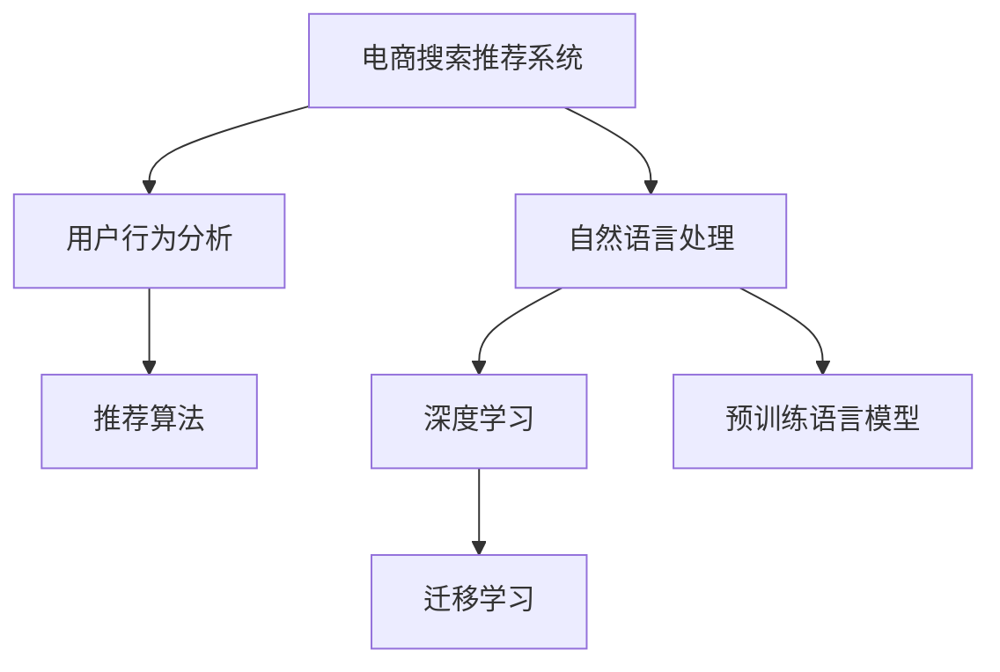

                 

# 电商搜索推荐效果优化中的AI大模型方法论

> 关键词：电商搜索,推荐系统,用户行为分析,AI大模型,深度学习,自然语言处理(NLP),内容推荐,交易转化率,用户满意度

## 1. 背景介绍

### 1.1 问题由来

在电商领域，用户搜索和推荐系统是驱动销售的关键。传统的方法主要依赖于规则、统计、关键词匹配等技术，但这些方法往往难以捕捉用户复杂的购买意图和行为模式。近年来，随着深度学习和大模型的兴起，通过学习用户的历史行为和背景信息，结合商品特征和市场动态，AI大模型在电商搜索推荐系统中的应用越来越广泛。

AI大模型通过大量数据训练，学习到了丰富的语言表示和用户行为模式，能够提供更加个性化和精准的推荐。例如，基于大模型的自然语言处理(NLP)技术可以解析用户查询的语义信息，结合用户的历史行为数据，提升推荐系统的效果。具体来说，大模型可以应用于：

- 搜索意图理解：通过自然语言理解(NLU)技术，解析用户查询意图，为推荐提供精准输入。
- 用户画像构建：利用用户交互数据，构建精准的用户画像，为推荐提供依据。
- 商品关联推荐：基于用户行为和商品特征，学习商品间的关联关系，实现更精准的商品推荐。

然而，随着模型规模和数据量的不断增大，如何高效优化搜索推荐效果、提升用户体验和交易转化率，成为电商领域面临的一大挑战。基于AI大模型的方法论，旨在通过深入挖掘用户行为和语义信息，实现搜索推荐的个性化、多样化，促进用户满意度和销售转化。

### 1.2 问题核心关键点

大模型方法论的核心在于如何高效利用用户数据，结合模型学到的知识和特征，优化电商搜索推荐系统。关键点包括：

- 数据利用效率：如何更高效地利用用户行为数据，提升模型效果。
- 用户意图解析：如何准确解析用户查询意图，匹配合适的商品。
- 个性化推荐：如何构建精准的用户画像，实现个性化推荐。
- 推荐效果评估：如何衡量推荐系统的性能，优化推荐策略。

## 2. 核心概念与联系

### 2.1 核心概念概述

为更好地理解电商搜索推荐系统中的大模型方法论，本节将介绍几个密切相关的核心概念：

- **电商搜索推荐系统(E-commerce Search and Recommendation System, ESRS)**：旨在通过用户查询和行为数据，推荐合适的商品，提升用户满意度和购买转化。系统通常由搜索和推荐两个子模块构成。
- **自然语言处理(Natural Language Processing, NLP)**：通过分析、理解、生成自然语言文本，实现信息检索、机器翻译、自动问答等任务。NLP技术在大模型中的应用，可以提升搜索推荐系统的智能化水平。
- **用户行为分析(User Behavior Analysis, UBA)**：通过分析用户的点击、浏览、购买等行为数据，构建用户画像，为推荐提供依据。
- **推荐算法(Recommendation Algorithm)**：结合用户画像和商品特征，通过各类推荐算法，如协同过滤、基于内容的推荐、混合推荐等，生成推荐结果。
- **深度学习(Deep Learning)**：一种通过多层神经网络模拟人脑思考过程的机器学习技术，广泛应用于图像识别、自然语言处理、推荐系统等领域。
- **预训练语言模型(Pre-trained Language Model)**：通过大规模无标签文本数据预训练的模型，具备强大的语言理解能力，可以用于各种NLP任务，如情感分析、问答、生成等。
- **迁移学习(Transfer Learning)**：通过将预训练模型应用于新的领域，实现快速模型适配。

这些核心概念之间的逻辑关系可以通过以下Mermaid流程图来展示：



这个流程图展示了大模型方法论的核心概念及其之间的关系：

1. 电商搜索推荐系统通过NLP和UBA技术，学习用户行为和语义信息，构建推荐模型。
2. 深度学习和大模型技术，提供了强大的语言理解和表示能力。
3. 迁移学习将预训练模型应用于新的电商领域，提升推荐效果。
4. 推荐算法在模型的基础上，结合商品特征，生成推荐结果。

这些概念共同构成了电商搜索推荐系统的大模型方法论，为其智能化和高效化提供了技术支持。

## 3. 核心算法原理 & 具体操作步骤
### 3.1 算法原理概述

大模型在电商搜索推荐中的应用，主要基于深度学习和迁移学习范式。其核心思想是：将预训练的深度模型作为基础，通过迁移学习和微调，适应电商领域的具体任务，提升推荐效果。

具体来说，大模型方法论的算法原理如下：

- **数据预处理**：收集和清洗电商用户的行为数据、商品特征数据和文本数据，转化为模型输入。
- **预训练模型选择**：选择合适的深度学习模型（如BERT、GPT等）作为初始化参数，利用大规模无标签文本数据进行预训练。
- **微调模型训练**：在电商用户数据和商品数据上，对预训练模型进行微调，适应电商领域的特定需求。
- **推荐模型优化**：在微调后的模型基础上，应用各类推荐算法，生成推荐结果，并进行优化。

### 3.2 算法步骤详解

基于大模型的方法论，电商搜索推荐系统的算法步骤包括：

**Step 1: 数据准备**
- 收集电商用户的行为数据、商品特征数据和文本数据。
- 清洗、去重、转换数据格式，确保数据的质量和一致性。

**Step 2: 预训练模型初始化**
- 选择合适的预训练模型，如BERT、GPT等。
- 在大规模无标签文本数据上进行预训练，获取通用语言表示。

**Step 3: 微调模型训练**
- 在电商用户数据和商品数据上，对预训练模型进行微调。
- 设计合适的损失函数和优化器，如交叉熵、AdamW等。
- 设置微调超参数，如学习率、批次大小、迭代轮数等。

**Step 4: 推荐模型构建**
- 在微调后的模型基础上，构建推荐模型。
- 应用各类推荐算法，如协同过滤、基于内容的推荐、混合推荐等。
- 优化推荐算法参数，提高推荐效果。

**Step 5: 模型评估与迭代**
- 在测试集上评估推荐模型的性能，如点击率、转化率等指标。
- 根据评估结果，调整模型参数和算法策略，进行模型迭代优化。
- 实时收集用户反馈数据，持续优化推荐策略。

### 3.3 算法优缺点

大模型在电商搜索推荐中的应用，具有以下优点：

- **高效泛化能力**：大模型能够高效利用用户数据，提升推荐模型的泛化能力。
- **精度高**：基于深度学习的模型，能够学习复杂的用户行为和商品关联关系，提高推荐精度。
- **易于集成**：利用大模型构建的推荐系统，可以与电商平台无缝集成，提升用户体验。
- **鲁棒性强**：大模型在处理用户查询和行为数据时，具有较强的鲁棒性和适应性。

同时，大模型方法论也存在一些缺点：

- **计算成本高**：大模型的训练和微调需要大量的计算资源和存储资源。
- **模型复杂度大**：大模型参数量庞大，增加了模型的复杂度和维护难度。
- **数据依赖性强**：大模型需要大量的标注数据进行微调，数据获取成本较高。
- **黑盒性质**：大模型的决策过程难以解释，用户难以理解推荐依据。

尽管存在这些局限，但大模型方法论仍是大数据时代电商推荐系统的重要技术手段。未来相关研究的方向在于如何优化数据利用效率，降低计算成本，提高模型的可解释性和鲁棒性。

### 3.4 算法应用领域

大模型方法论在电商搜索推荐系统的应用领域非常广泛，主要涵盖以下方面：

- **商品推荐**：基于用户的历史行为和商品特征，生成个性化推荐。
- **搜索意图理解**：解析用户查询的语义信息，提供精准的商品推荐。
- **个性化推荐策略优化**：利用用户画像和推荐结果，优化推荐策略。
- **用户行为分析**：分析用户点击、浏览、购买等行为数据，构建用户画像。
- **内容推荐**：结合用户画像和商品内容，生成内容相关推荐。
- **广告投放优化**：利用用户行为数据，优化广告投放策略，提升广告效果。

除了这些主要应用场景外，大模型方法论还被创新性地应用于商品评价分析、库存管理、供应链优化等多个领域，为电商平台的运营提供了强有力的技术支持。

## 4. 数学模型和公式 & 详细讲解  
### 4.1 数学模型构建

大模型方法论的核心数学模型包括用户行为表示模型、商品特征表示模型、推荐模型等。以下以用户行为表示模型为例，介绍模型的构建过程。

假设电商用户的历史行为数据为 $\mathcal{U}=\{(u_i,b_i)\}_{i=1}^N$，其中 $u_i$ 为用户的ID，$b_i$ 为用户的点击行为序列。

定义用户行为表示模型 $F_u$，将用户的点击行为序列 $b_i$ 映射到一个低维向量 $f(u_i)$，该向量能够捕捉用户的行为模式和偏好。设用户行为表示模型的参数为 $\theta_u$，则模型的目标是最小化用户行为序列与映射向量之间的差异：

$$
\min_{\theta_u} \sum_{i=1}^N \|\mathbf{b}_i - F_u(b_i; \theta_u)\|^2
$$

其中，$\mathbf{b}_i$ 为点击行为序列 $b_i$ 的向量表示，$F_u$ 为用户行为表示模型。

### 4.2 公式推导过程

用户行为表示模型的推导过程如下：

1. **行为序列嵌入**：将用户的点击行为序列 $b_i$ 转换为一个向量 $\mathbf{b}_i$，可以采用基于位置的向量表示方法（如TF-IDF、词向量等）或基于内容的向量表示方法（如BERT、GPT等）。

2. **用户行为映射**：利用用户行为表示模型 $F_u$，将用户行为向量 $\mathbf{b}_i$ 映射为一个低维向量 $f(u_i)$。具体实现可以使用线性变换或深度神经网络等方法。

3. **优化目标函数**：最小化用户行为向量 $f(u_i)$ 与行为序列向量 $\mathbf{b}_i$ 的差异，即优化目标函数：

$$
\min_{\theta_u} \sum_{i=1}^N \|\mathbf{b}_i - F_u(b_i; \theta_u)\|^2
$$

通过上述过程，用户行为表示模型能够学习到用户的点击行为模式和偏好，为推荐模型的训练提供依据。

### 4.3 案例分析与讲解

以某电商平台的商品推荐系统为例，分析大模型方法论在其中的应用。

假设平台有数百万用户，每名用户每天平均产生数十个点击行为。平台收集这些点击行为数据，利用大模型进行用户行为表示和推荐模型训练。

**用户行为表示**：
- 首先，收集每个用户的点击行为序列。
- 利用BERT模型对每个用户的点击行为进行预训练，得到一个向量表示。
- 通过平均池化或最大池化，将用户的所有点击行为向量聚合成一个低维用户向量。

**商品特征表示**：
- 对于每件商品，提取商品的标题、描述、类别、价格等信息。
- 利用BERT模型对商品信息进行预训练，得到商品的向量表示。
- 通过多层全连接神经网络，将商品向量映射为低维商品特征向量。

**推荐模型训练**：
- 基于用户行为表示和商品特征表示，构建推荐模型。
- 应用协同过滤、基于内容的推荐等算法，生成推荐结果。
- 利用交叉熵等损失函数，优化推荐模型的参数。
- 在测试集上评估推荐效果，如点击率、转化率等指标。

通过大模型方法论，平台能够高效利用用户行为数据，学习用户的兴趣偏好，结合商品特征，生成精准的商品推荐，提升用户满意度和交易转化率。

## 5. 项目实践：代码实例和详细解释说明
### 5.1 开发环境搭建

在进行电商搜索推荐系统的开发前，我们需要准备好开发环境。以下是使用Python进行TensorFlow开发的环境配置流程：

1. 安装Anaconda：从官网下载并安装Anaconda，用于创建独立的Python环境。

2. 创建并激活虚拟环境：
```bash
conda create -n tensorflow-env python=3.8 
conda activate tensorflow-env
```

3. 安装TensorFlow：根据CUDA版本，从官网获取对应的安装命令。例如：
```bash
pip install tensorflow tensorflow-gpu tensorflow-io
```

4. 安装各类工具包：
```bash
pip install numpy pandas scikit-learn matplotlib tqdm jupyter notebook ipython
```

完成上述步骤后，即可在`tensorflow-env`环境中开始开发。

### 5.2 源代码详细实现

下面我们以电商搜索推荐系统的用户行为表示模块为例，给出使用TensorFlow进行代码实现。

首先，定义用户行为表示模型的类：

```python
from tensorflow.keras.layers import Input, Embedding, Dense, GlobalAveragePooling1D
from tensorflow.keras.models import Model

class UserBehaviorModel(Model):
    def __init__(self, embedding_dim=64):
        super(UserBehaviorModel, self).__init__()
        self.embedding = Embedding(input_dim=vocab_size, output_dim=embedding_dim)
        self.dense = Dense(embedding_dim, activation='relu')
        self.pooling = GlobalAveragePooling1D()
    
    def call(self, inputs):
        x = self.embedding(inputs)
        x = self.dense(x)
        x = self.pooling(x)
        return x
```

然后，定义模型训练的代码：

```python
from tensorflow.keras.optimizers import Adam
from tensorflow.keras.losses import MeanSquaredError
from tensorflow.keras.metrics import MeanAbsoluteError

# 构建数据生成器
train_generator = ...
test_generator = ...

# 定义模型
model = UserBehaviorModel()

# 定义优化器和损失函数
optimizer = Adam(lr=0.001)
loss = MeanSquaredError()

# 定义评估指标
mae = MeanAbsoluteError()

# 编译模型
model.compile(optimizer=optimizer, loss=loss, metrics=[mae])

# 训练模型
model.fit(train_generator, epochs=10, validation_data=test_generator)
```

最后，评估模型效果并输出结果：

```python
# 在测试集上评估模型
test_loss, test_mae = model.evaluate(test_generator)
print(f'Test Loss: {test_loss:.4f}, Test MAE: {test_mae:.4f}')

# 打印模型输出
inputs = test_generator[0][0]
outputs = model(inputs)
print(outputs)
```

以上就是使用TensorFlow进行电商搜索推荐系统的用户行为表示模块的完整代码实现。可以看到，借助TensorFlow的模块化设计，我们可以很方便地实现用户行为表示模型的训练和评估。

### 5.3 代码解读与分析

让我们再详细解读一下关键代码的实现细节：

**UserBehaviorModel类**：
- `__init__`方法：初始化模型参数，包括嵌入层、全连接层和池化层。
- `call`方法：定义模型的前向传播过程，将输入转化为低维向量。

**模型训练**：
- 使用数据生成器（如`train_generator`）对模型进行训练，设定训练轮数为10。
- 定义优化器和损失函数，如Adam优化器和均方误差损失。
- 定义评估指标，如平均绝对误差（MAE）。
- 编译模型，指定优化器、损失函数和评估指标。
- 调用`fit`方法进行模型训练，在测试集上进行评估。

**模型输出**：
- 通过`evaluate`方法评估模型性能，输出损失和评估指标。
- 利用测试集输入，调用`call`方法生成输出向量。

通过上述代码实现，我们能够高效地构建和训练用户行为表示模型，为电商搜索推荐系统的推荐模型提供精准的用户行为输入。

当然，实际应用中还需要针对具体场景进行优化和调整。例如，可以结合深度学习框架的特点，进一步设计更加复杂的模型结构，引入先验知识等。但核心的代码实现流程与上述类似。

## 6. 实际应用场景
### 6.1 智能客服系统

电商平台的智能客服系统通过深度学习和大模型技术，提升了客服的响应速度和质量。具体来说，智能客服系统通过分析用户的历史咨询记录和实时对话数据，利用大模型预测用户意图，自动回复常见问题，解决用户的查询需求。

在技术实现上，可以收集历史客服咨询数据，构建标注数据集，对BERT等大模型进行微调，使其具备语义理解和生成能力。微调后的模型能够根据用户查询，自动匹配回答模板，生成自然流畅的回复。对于复杂或个性化的问题，智能客服系统能够将用户查询转发给人工客服，实现人机协同，提升用户满意度。

### 6.2 个性化推荐系统

个性化推荐系统通过深度学习和大模型技术，实现了商品推荐、内容推荐等功能的智能化。系统利用用户行为数据和商品特征数据，构建用户画像，结合预训练语言模型，生成精准的推荐结果。

具体来说，可以构建基于BERT的推荐模型，利用用户行为序列进行预训练，得到用户行为向量。同时，对商品信息进行预训练，得到商品特征向量。结合用户行为向量和商品特征向量，应用协同过滤、基于内容的推荐等算法，生成个性化推荐。此外，还可以结合用户反馈数据，持续优化推荐策略，提升推荐效果。

### 6.3 用户行为分析

电商平台的运营需要深入了解用户行为，才能制定精准的营销策略。利用深度学习和大模型技术，可以构建用户行为分析系统，解析用户的点击、浏览、购买等行为数据，生成用户画像。

具体来说，可以构建基于LSTM的用户行为分析模型，对用户的历史行为数据进行建模，得到用户行为序列向量。同时，对用户的行为序列进行预训练，得到用户行为向量。结合用户行为向量和行为序列向量，应用推荐模型，生成个性化推荐。此外，还可以结合用户反馈数据，实时调整推荐策略，提升用户满意度。

### 6.4 未来应用展望

随着深度学习和大模型技术的不断发展，电商搜索推荐系统将迎来更多的应用场景。未来，大模型方法论将进一步拓展，具体应用领域包括：

- **多模态推荐**：结合图像、视频、语音等多模态数据，提升推荐系统的智能化水平。
- **多领域推荐**：应用于不同类型的电商领域，如服装、家居、数码等，提升推荐效果。
- **实时推荐**：结合实时数据，实时生成推荐结果，提升用户购物体验。
- **跨领域迁移**：将电商领域的推荐模型应用于其他领域，如旅游、酒店、金融等，提升推荐系统的通用性和泛化能力。

未来，基于大模型的方法论将推动电商搜索推荐系统的不断创新和升级，为电商平台带来更高的商业价值和用户满意度。

## 7. 工具和资源推荐
### 7.1 学习资源推荐

为了帮助开发者系统掌握电商搜索推荐系统中的大模型方法论，这里推荐一些优质的学习资源：

1. 《深度学习理论与实践》：介绍深度学习的理论和实践，适合初学者和中级开发者学习。
2. 《自然语言处理综论》：全面介绍自然语言处理的基本概念和技术，涵盖词向量、情感分析、文本分类等任务。
3. 《推荐系统实践》：讲解推荐系统的原理和实践方法，结合电商平台的推荐场景，进行深入分析。
4. 《电商数据科学》：介绍电商数据科学的理论和技术，涵盖用户行为分析、推荐系统、广告投放等应用。
5. 《TensorFlow官方文档》：TensorFlow的官方文档，提供丰富的教程、代码示例和API文档，适合深度学习开发者的学习。

通过对这些资源的学习实践，相信你一定能够全面掌握电商搜索推荐系统中的大模型方法论，并应用于实际开发中。

### 7.2 开发工具推荐

高效的开发离不开优秀的工具支持。以下是几款用于电商搜索推荐系统开发的常用工具：

1. TensorFlow：由Google主导开发的深度学习框架，生产部署方便，适合大规模工程应用。
2. PyTorch：基于Python的开源深度学习框架，灵活动态的计算图，适合快速迭代研究。
3. Keras：基于TensorFlow的高层次API，适合快速构建和训练深度学习模型。
4. Weights & Biases：模型训练的实验跟踪工具，可以记录和可视化模型训练过程中的各项指标，方便对比和调优。
5. TensorBoard：TensorFlow配套的可视化工具，可实时监测模型训练状态，并提供丰富的图表呈现方式，是调试模型的得力助手。

合理利用这些工具，可以显著提升电商搜索推荐系统的开发效率，加快创新迭代的步伐。

### 7.3 相关论文推荐

大模型方法论在电商搜索推荐系统的应用源于学界的持续研究。以下是几篇奠基性的相关论文，推荐阅读：

1. Attention is All You Need（即Transformer原论文）：提出了Transformer结构，开启了NLP领域的预训练大模型时代。
2. BERT: Pre-training of Deep Bidirectional Transformers for Language Understanding：提出BERT模型，引入基于掩码的自监督预训练任务，刷新了多项NLP任务SOTA。
3. Recommendation Systems for Personalized Search and Commerce：介绍电商搜索推荐系统的原理和应用，提供了多个实际案例。
4. Adaptive Autoencoders for Personalized Recommendations：提出基于自适应自动编码器的推荐方法，提升了推荐系统的个性化水平。
5. Deep Reinforcement Learning in Recommendation Systems：将强化学习引入推荐系统，优化推荐策略，提高推荐效果。

这些论文代表了大模型方法论的发展脉络。通过学习这些前沿成果，可以帮助研究者把握学科前进方向，激发更多的创新灵感。

## 8. 总结：未来发展趋势与挑战

### 8.1 总结

本文对电商搜索推荐系统中的大模型方法论进行了全面系统的介绍。首先阐述了电商搜索推荐系统的发展背景和研究意义，明确了大模型方法论在其中的重要地位。其次，从原理到实践，详细讲解了大模型在电商推荐中的应用，包括用户行为表示、商品特征表示、推荐模型优化等。最后，介绍了大模型在实际应用中的具体案例，展示了其带来的显著效果。

通过本文的系统梳理，可以看到，基于大模型的电商搜索推荐系统能够高效利用用户数据，学习复杂的用户行为和商品关联关系，提升推荐系统的智能化和精准化。未来，随着大模型技术的发展和普及，电商搜索推荐系统必将在更多的应用场景中发挥重要作用，为电商平台的运营带来更高的商业价值和用户满意度。

### 8.2 未来发展趋势

展望未来，电商搜索推荐系统中的大模型方法论将呈现以下几个发展趋势：

1. **多模态数据融合**：结合图像、视频、语音等多模态数据，提升推荐系统的智能化水平。
2. **实时推荐**：结合实时数据，实时生成推荐结果，提升用户购物体验。
3. **多领域推荐**：应用于不同类型的电商领域，如服装、家居、数码等，提升推荐效果。
4. **跨领域迁移**：将电商领域的推荐模型应用于其他领域，如旅游、酒店、金融等，提升推荐系统的通用性和泛化能力。
5. **深度学习与强化学习的结合**：将强化学习引入推荐系统，优化推荐策略，提高推荐效果。
6. **用户意图解析**：利用自然语言处理技术，解析用户查询的语义信息，提升推荐精准度。

以上趋势凸显了大模型方法论在电商搜索推荐系统中的广阔前景。这些方向的探索发展，必将进一步提升推荐系统的性能和应用范围，为电商平台的运营带来更高的商业价值和用户满意度。

### 8.3 面临的挑战

尽管大模型方法论在电商搜索推荐系统中取得了显著成效，但在迈向更加智能化、高效化应用的过程中，仍面临诸多挑战：

1. **计算资源瓶颈**：大模型的训练和微调需要大量的计算资源，可能对电商平台的运营带来成本压力。
2. **模型复杂度**：大模型参数量庞大，增加了模型的复杂度和维护难度。
3. **数据依赖性强**：大模型需要大量的标注数据进行微调，数据获取成本较高。
4. **模型鲁棒性**：大模型在处理用户查询和行为数据时，可能存在一定的偏差和误判。
5. **可解释性**：大模型的决策过程难以解释，用户难以理解推荐依据。

尽管存在这些挑战，但大模型方法论仍是大数据时代电商推荐系统的重要技术手段。未来相关研究的方向在于如何优化数据利用效率，降低计算成本，提高模型的可解释性和鲁棒性。

### 8.4 研究展望

面对大模型方法论面临的种种挑战，未来的研究需要在以下几个方面寻求新的突破：

1. **优化数据利用效率**：如何更高效地利用用户行为数据，提升模型效果。
2. **改进推荐算法**：引入深度学习和强化学习技术，优化推荐算法，提升推荐效果。
3. **提升模型可解释性**：利用可解释性技术，增强模型的透明性，让用户理解推荐依据。
4. **融合多领域知识**：结合领域知识库和专家规则，增强推荐模型的泛化能力。
5. **跨领域迁移学习**：将电商领域的推荐模型应用于其他领域，提升推荐系统的通用性和泛化能力。

这些研究方向的探索，必将引领大模型方法论在电商搜索推荐系统中的应用走向成熟，为电商平台带来更高的商业价值和用户满意度。

## 9. 附录：常见问题与解答

**Q1：大模型在电商推荐中的应用是否会增加系统复杂度？**

A: 大模型在电商推荐中的应用，虽然带来了一定的复杂度，但通过合理的模型设计和参数调整，可以显著提升推荐效果。具体来说，大模型可以学习用户行为和商品关联关系，提升推荐模型的泛化能力和精准度。同时，大模型在处理用户查询和行为数据时，具有较强的鲁棒性和适应性。尽管存在一定的计算资源和模型复杂度问题，但通过合理的资源优化和模型优化，可以解决这些问题。

**Q2：电商推荐系统如何实现多模态融合？**

A: 电商推荐系统中的多模态融合可以通过以下方式实现：
1. 数据预处理：将不同类型的模态数据进行清洗和转换，确保数据的一致性和完整性。
2. 特征表示：利用深度学习模型，如CNN、RNN等，对不同类型的模态数据进行特征提取和表示。
3. 融合策略：通过加权平均、级联网络、多任务学习等策略，将不同类型的模态数据进行融合，生成最终的推荐结果。
4. 模型训练：在融合后的多模态数据上，对推荐模型进行训练，优化融合策略，提升推荐效果。

**Q3：如何评估电商推荐系统的性能？**

A: 电商推荐系统的性能评估可以通过以下几个指标进行衡量：
1. 点击率（Click-Through Rate, CTR）：用户点击推荐商品的概率。
2. 转化率（Conversion Rate, CR）：用户购买推荐商品的概率。
3. 相关度（Relevance）：推荐商品与用户兴趣的相关度。
4. 多样性（Diversity）：推荐商品的多样性，避免推荐过于集中。
5. 覆盖率（Coverage）：推荐商品的种类覆盖率，避免推荐范围过窄。
6. 延迟（Latency）：推荐系统的响应时间，影响用户体验。

这些指标可以通过A/B测试、用户反馈调查等方式进行评估和优化。

**Q4：电商推荐系统如何利用用户行为数据？**

A: 电商推荐系统可以利用用户行为数据进行以下方面：
1. 用户画像构建：通过分析用户的点击、浏览、购买等行为数据，构建精准的用户画像，为推荐提供依据。
2. 用户行为表示：利用深度学习模型，如BERT、LSTM等，对用户行为序列进行建模，得到用户行为向量。
3. 推荐模型训练：结合用户行为向量、商品特征向量等数据，应用各类推荐算法，生成个性化推荐。
4. 实时推荐优化：结合实时数据，实时生成推荐结果，提升用户购物体验。
5. 用户行为预测：利用用户行为数据，预测用户未来的行为，优化推荐策略。

通过用户行为数据的深入利用，电商推荐系统能够提升推荐模型的个性化和精准化水平，促进用户满意度和销售转化。

**Q5：电商推荐系统如何提升用户满意度？**

A: 电商推荐系统可以通过以下方式提升用户满意度：
1. 个性化推荐：利用用户行为数据和商品特征数据，构建个性化推荐模型，生成精准的推荐结果。
2. 用户意图解析：利用自然语言处理技术，解析用户查询的语义信息，提升推荐精准度。
3. 实时推荐：结合实时数据，实时生成推荐结果，提升用户购物体验。
4. 用户反馈机制：引入用户反馈机制，收集用户对推荐结果的反馈信息，实时调整推荐策略。
5. 多渠道推荐：利用不同的推荐渠道，如邮件、短信、APP等，提升推荐效果。

通过提升推荐系统的个性化、精准化和实时化水平，电商推荐系统能够更好地满足用户需求，提升用户满意度和购物体验。

---

作者：禅与计算机程序设计艺术 / Zen and the Art of Computer Programming

