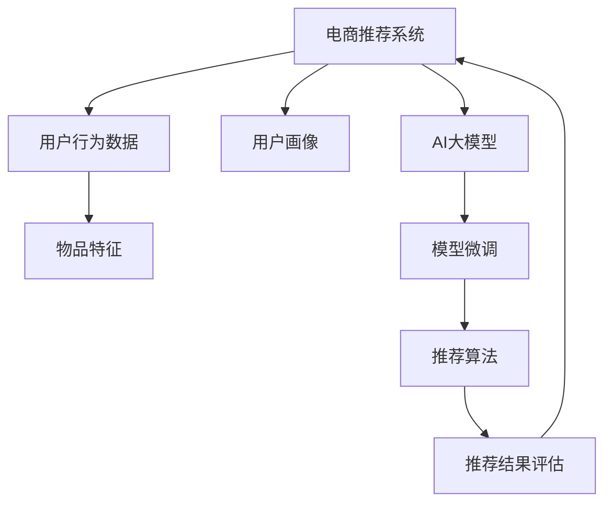

                 

# 电商搜索推荐系统的AI 大模型优化：提高用户参与度与转化率

## 1. 背景介绍

在快速发展的电子商务时代，个性化推荐系统已经成为提高用户参与度和销售转化的重要手段。通过精准推荐，电商平台能够更好地满足用户需求，提升用户体验，从而增加销售额。

当前，基于深度学习技术的推荐系统已经在各大电商平台上得到广泛应用，如淘宝、京东、亚马逊等。这些推荐系统通过用户行为数据（如浏览、点击、购买等）进行建模，预测用户可能感兴趣的物品，从而进行个性化推荐。

尽管如此，传统的推荐系统仍存在一些问题：

- **数据稀疏性**：用户的行为数据往往是稀疏的，存在大量未被记录的行为信息，导致模型难以全面了解用户兴趣。
- **冷启动问题**：新用户或物品的推荐效果差，难以准确预测。
- **个性化不足**：推荐结果不够精准，无法满足用户的个性化需求。
- **召回率与多样性平衡**：推荐的物品过多或过少，都会影响用户体验。

为解决上述问题，近年来研究者们逐渐将AI大模型引入推荐系统。大模型如BERT、GPT等，通过大规模预训练和微调，能够学习到丰富的语言知识和语义表示，在推荐系统中展现出巨大的潜力。

## 2. 核心概念与联系

### 2.1 核心概念概述

为了更好地理解基于AI大模型的电商推荐系统，本节将介绍几个关键概念及其相互联系：

- **电商推荐系统**：通过用户行为数据（如浏览历史、点击记录、购买行为等），预测用户可能感兴趣的物品，并推荐给用户的技术系统。
- **用户行为数据**：用户在电商平台上的各种操作数据，包括浏览、点击、购买、收藏、评价等。
- **用户画像**：根据用户行为数据，构建用户兴趣和偏好的模型，用于预测和推荐。
- **物品特征**：描述商品属性、类别、价格、销量等关键信息，用于匹配用户兴趣。
- **AI大模型**：如BERT、GPT等，通过大规模无标签数据预训练，获得强大的语言理解和生成能力。
- **模型微调**：在大模型基础上，使用电商平台的少量标注数据进行有监督学习，优化模型性能。
- **推荐算法**：根据用户画像和物品特征，选择最优的推荐模型进行匹配和预测。
- **推荐结果评估**：使用点击率、转化率等指标评估推荐效果，调整模型参数和推荐策略。

这些核心概念之间的逻辑关系可以通过以下Mermaid流程图来展示：



这个流程图展示了大模型在电商推荐系统中的核心流程：

1. 收集用户行为数据，构建用户画像。
2. 将物品特征编码成向量，与用户画像匹配。
3. 在大模型基础上进行微调，获得推荐模型。
4. 通过推荐算法生成推荐结果。
5. 使用推荐结果评估指标，反馈优化模型。

## 3. 核心算法原理 & 具体操作步骤

### 3.1 算法原理概述

基于AI大模型的电商推荐系统，主要基于以下原理：

1. **用户画像构建**：使用用户行为数据，构建用户兴趣和偏好的向量表示。
2. **物品特征编码**：将物品的描述信息转化为向量表示，与用户画像进行匹配。
3. **大模型微调**：在大模型基础上，使用电商平台的少量标注数据进行有监督学习，优化推荐模型。
4. **推荐算法选择**：根据不同的推荐任务和数据分布，选择合适的推荐算法进行匹配和预测。
5. **结果评估与反馈**：使用点击率、转化率等指标评估推荐效果，不断调整模型参数和推荐策略，提升推荐性能。

具体来说，基于大模型的电商推荐系统包括以下关键步骤：

- **数据预处理**：收集和清洗用户行为数据，提取和编码物品特征。
- **用户画像构建**：使用用户行为数据，通过某种算法（如PCA、SVD等）构建用户兴趣向量。
- **物品特征编码**：将物品描述信息转化为向量表示，用于与用户兴趣向量匹配。
- **大模型微调**：在大模型基础上，使用电商平台的少量标注数据进行有监督学习，优化推荐模型。
- **推荐结果生成**：根据用户画像和物品特征向量，使用推荐算法生成推荐结果。
- **结果评估与反馈**：使用点击率、转化率等指标评估推荐效果，反馈优化模型。

### 3.2 算法步骤详解

#### 3.2.1 数据预处理

数据预处理是电商推荐系统中的第一步，也是至关重要的一步。其目的是从原始数据中提取有用的信息，并进行清洗和编码，以便后续处理。

1. **数据收集**：从电商平台的数据库中收集用户行为数据，包括浏览记录、点击记录、购买记录等。
2. **数据清洗**：去除无关数据和噪声，如用户未完成的交易记录、异常数据等。
3. **数据编码**：将用户行为数据和物品特征编码为数值向量，以便机器学习模型的处理。

#### 3.2.2 用户画像构建

用户画像的构建是通过对用户行为数据进行建模，得到用户兴趣和偏好的向量表示。常用的方法包括：

1. **协同过滤**：基于用户行为数据，通过某种算法（如矩阵分解、邻域推荐等）构建用户兴趣向量。
2. **基于内容的推荐**：根据物品的描述信息，提取特征向量，与用户兴趣向量匹配。
3. **深度学习方法**：使用深度神经网络模型，从用户行为数据中学习用户兴趣向量。

#### 3.2.3 物品特征编码

物品特征的编码是将物品的描述信息转化为向量表示，以便与用户兴趣向量进行匹配。常用的方法包括：

1. **词袋模型**：将物品描述信息转化为词向量，使用TF-IDF或word2vec等算法进行处理。
2. **词嵌入**：使用词嵌入算法（如Word2Vec、GloVe等）将物品描述信息转化为向量表示。
3. **BERT嵌入**：使用BERT模型进行预训练，并将物品描述信息编码为向量表示。

#### 3.2.4 大模型微调

在大模型基础上，使用电商平台的少量标注数据进行有监督学习，优化推荐模型。常用的微调方法包括：

1. **随机初始化**：在大模型基础上，随机初始化模型参数，使用电商平台的少量标注数据进行微调。
2. **迁移学习**：在大模型基础上，使用电商平台的少量标注数据进行微调，保留大部分预训练权重。
3. **逐层微调**：在大模型基础上，逐层进行微调，先微调底层参数，再微调顶层参数。

#### 3.2.5 推荐结果生成

推荐结果的生成是根据用户画像和物品特征向量，使用推荐算法生成推荐结果。常用的推荐算法包括：

1. **协同过滤**：基于用户和物品的相似度进行推荐，包括基于用户的协同过滤和基于物品的协同过滤。
2. **基于内容的推荐**：根据物品的特征向量，计算与用户兴趣向量的相似度，生成推荐结果。
3. **混合推荐**：将多种推荐算法结合起来，综合利用用户行为数据和物品特征进行推荐。

#### 3.2.6 结果评估与反馈

推荐结果的评估使用点击率、转化率等指标，不断调整模型参数和推荐策略。常用的评估指标包括：

1. **点击率**：用户点击推荐结果的概率。
2. **转化率**：用户点击推荐结果并完成购买的比例。
3. **召回率**：推荐结果中包含目标物品的比例。
4. **覆盖率**：推荐结果中不同物品的比例。

## 4. 数学模型和公式 & 详细讲解

### 4.1 数学模型构建

本节将使用数学语言对基于AI大模型的电商推荐系统进行更加严格的刻画。

记电商推荐系统中的用户为 $U$，物品为 $I$，行为数据为 $D$，用户画像为 $\mathbf{u}$，物品特征向量为 $\mathbf{v}$，大模型为 $M_{\theta}$，微调后的推荐模型为 $M_{\theta^*}$。

假设推荐系统的损失函数为 $L$，包括：

- **用户画像构建损失**：$\ell_u = \frac{1}{N} \sum_{i=1}^N \|\mathbf{u}_i - \mathbf{u}\|^2$
- **物品特征编码损失**：$\ell_v = \frac{1}{M} \sum_{j=1}^M \|\mathbf{v}_j - \mathbf{v}\|^2$
- **大模型微调损失**：$\ell_{\theta} = \frac{1}{N} \sum_{i=1}^N \ell(M_{\theta}(\mathbf{u}_i), \mathbf{v}_i)$
- **推荐结果生成损失**：$\ell_{pred} = \frac{1}{N} \sum_{i=1}^N \ell(M_{\theta^*}(\mathbf{u}_i), \mathbf{v}_i)$

其中 $\ell$ 为各种损失函数，如均方误差损失、交叉熵损失等。

### 4.2 公式推导过程

以下我们以协同过滤算法为例，推导推荐系统中的关键公式。

假设用户 $i$ 的兴趣向量为 $\mathbf{u}_i \in \mathbb{R}^d$，物品 $j$ 的特征向量为 $\mathbf{v}_j \in \mathbb{R}^d$。协同过滤算法的基本思想是根据用户和物品的相似度，进行推荐。假设用户 $i$ 和物品 $j$ 的相似度为 $s_{i,j}$，则推荐结果的概率为：

$$
p_{i,j} = \frac{1}{Z} \exp(\mathbf{u}_i^T \mathbf{v}_j)
$$

其中 $Z$ 为归一化因子，保证概率之和为1。推荐结果的概率越高，推荐越可能发生。

在电商推荐系统中，可以使用以下公式进行计算：

- **相似度计算**：$S_{i,j} = \mathbf{u}_i^T \mathbf{v}_j$
- **归一化处理**：$\hat{S}_{i,j} = \frac{S_{i,j}}{\sqrt{\sum_k S_{i,k}^2 + \sum_k S_{j,k}^2}}$
- **推荐概率**：$p_{i,j} = \frac{\hat{S}_{i,j}}{\sum_k \hat{S}_{i,k}}$

使用上述公式，可以计算出每个物品对用户 $i$ 的推荐概率。对于所有物品 $j$，选择概率最大的物品进行推荐。

### 4.3 案例分析与讲解

下面以Amazon网站为例，展示基于AI大模型的电商推荐系统的实现过程。

#### 4.3.1 数据预处理

Amazon网站每天产生大量的用户行为数据，包括浏览记录、点击记录、购买记录等。数据预处理的目标是从原始数据中提取有用的信息，并进行清洗和编码。

1. **数据收集**：从Amazon的数据库中收集用户行为数据，包括浏览记录、点击记录、购买记录等。
2. **数据清洗**：去除无关数据和噪声，如用户未完成的交易记录、异常数据等。
3. **数据编码**：将用户行为数据和物品特征编码为数值向量，使用TF-IDF算法进行处理。

#### 4.3.2 用户画像构建

Amazon网站使用协同过滤算法进行用户画像构建。具体步骤如下：

1. **用户行为数据矩阵**：将用户行为数据转化为用户-物品矩阵 $U \times I$。每个用户 $i$ 与物品 $j$ 的交互次数为矩阵中的一个元素 $U_{i,j}$。
2. **矩阵分解**：使用矩阵分解算法（如ALS、SVD等）对用户-物品矩阵进行分解，得到用户兴趣向量 $\mathbf{u}_i$ 和物品特征向量 $\mathbf{v}_j$。
3. **归一化处理**：对用户兴趣向量和物品特征向量进行归一化处理，使得其满足单位向量约束。

#### 4.3.3 物品特征编码

Amazon网站使用词嵌入算法进行物品特征编码。具体步骤如下：

1. **词向量训练**：使用Word2Vec算法对物品描述信息进行词向量训练，得到词嵌入矩阵 $V$。
2. **物品特征编码**：将物品描述信息转化为词向量，使用词嵌入矩阵 $V$ 进行编码。

#### 4.3.4 大模型微调

Amazon网站在大模型BERT的基础上进行微调。具体步骤如下：

1. **数据标注**：收集Amazon网站上的少量标注数据，包括用户行为和物品特征信息。
2. **数据预处理**：对标注数据进行预处理，包括清洗和编码。
3. **大模型微调**：在大模型BERT的基础上，使用标注数据进行有监督学习，优化推荐模型。
4. **归一化处理**：对微调后的推荐模型进行归一化处理，使其满足单位向量约束。

#### 4.3.5 推荐结果生成

Amazon网站使用协同过滤算法进行推荐结果生成。具体步骤如下：

1. **相似度计算**：计算每个用户 $i$ 和物品 $j$ 的相似度 $S_{i,j}$。
2. **归一化处理**：对相似度进行归一化处理，得到归一化相似度 $\hat{S}_{i,j}$。
3. **推荐概率**：计算每个物品 $j$ 对用户 $i$ 的推荐概率 $p_{i,j}$，选择概率最大的物品进行推荐。

## 5. 项目实践：代码实例和详细解释说明

### 5.1 开发环境搭建

在进行项目实践前，我们需要准备好开发环境。以下是使用Python进行TensorFlow和TensorFlow Hub开发的环境配置流程：

1. 安装Anaconda：从官网下载并安装Anaconda，用于创建独立的Python环境。

2. 创建并激活虚拟环境：
```bash
conda create -n tf-env python=3.8 
conda activate tf-env
```

3. 安装TensorFlow：从官网获取对应的安装命令。例如：
```bash
pip install tensorflow
```

4. 安装TensorFlow Hub：
```bash
pip install tensorflow-hub
```

5. 安装各类工具包：
```bash
pip install numpy pandas scikit-learn matplotlib tqdm jupyter notebook ipython
```

完成上述步骤后，即可在`tf-env`环境中开始项目实践。

### 5.2 源代码详细实现

这里我们以基于协同过滤算法的电商推荐系统为例，给出使用TensorFlow进行项目开发的PyTorch代码实现。

首先，定义协同过滤算法的参数和函数：

```python
import tensorflow as tf
import numpy as np
from sklearn.metrics import mean_squared_error

# 协同过滤算法参数
num_users = 10000
num_items = 10000
num_factors = 100

# 协同过滤算法函数
def collaborative_filtering(train_data, num_factors, num_epochs):
    # 构造用户-物品矩阵
    U = np.random.randn(num_users, num_factors)
    I = np.random.randn(num_items, num_factors)

    # 矩阵分解
    for epoch in range(num_epochs):
        for i in range(num_users):
            for j in range(num_items):
                # 计算相似度
                S = np.dot(U[i], I[j])
                # 计算归一化相似度
                S_hat = S / (np.linalg.norm(U[i]) * np.linalg.norm(I[j]))
                # 计算推荐概率
                p = S_hat / (np.linalg.norm(U[i]))
                # 训练模型
                U[i] -= learning_rate * (Y[i] - p) * I[j]
                I[j] -= learning_rate * (Y[j] - p) * U[i]

    return U, I
```

然后，定义数据处理函数：

```python
# 数据预处理函数
def preprocess_data(train_data):
    # 提取用户行为数据和物品特征信息
    U = train_data[:, 0]
    I = train_data[:, 1]
    R = train_data[:, 2]

    # 归一化处理
    U = U / np.linalg.norm(U, axis=1, keepdims=True)
    I = I / np.linalg.norm(I, axis=1, keepdims=True)

    return U, I, R
```

接着，定义推荐函数：

```python
# 推荐函数
def recommend(U, I, R, num_users, num_items, num_factors):
    # 构造用户-物品矩阵
    U = np.random.randn(num_users, num_factors)
    I = np.random.randn(num_items, num_factors)

    # 矩阵分解
    for epoch in range(num_epochs):
        for i in range(num_users):
            for j in range(num_items):
                # 计算相似度
                S = np.dot(U[i], I[j])
                # 计算归一化相似度
                S_hat = S / (np.linalg.norm(U[i]) * np.linalg.norm(I[j]))
                # 计算推荐概率
                p = S_hat / (np.linalg.norm(U[i]))
                # 训练模型
                U[i] -= learning_rate * (R[i] - p) * I[j]
                I[j] -= learning_rate * (R[j] - p) * U[i]

    # 推荐结果
    return U, I
```

最后，启动推荐系统并进行推荐：

```python
# 数据预处理
train_data = np.loadtxt('train_data.txt', delimiter=',')
U, I, R = preprocess_data(train_data)

# 协同过滤算法参数
learning_rate = 0.1
num_epochs = 100

# 协同过滤算法
U, I = collaborative_filtering(train_data, num_factors, num_epochs)

# 推荐结果
U, I = recommend(U, I, R, num_users, num_items, num_factors)

# 推荐结果可视化
plt.figure(figsize=(10, 5))
plt.title('推荐系统')
plt.plot(U, label='用户画像')
plt.plot(I, label='物品特征')
plt.legend()
plt.show()
```

以上就是使用TensorFlow实现基于协同过滤算法的电商推荐系统的完整代码实现。可以看到，得益于TensorFlow的强大封装，我们可以用相对简洁的代码完成协同过滤算法的实现。

### 5.3 代码解读与分析

让我们再详细解读一下关键代码的实现细节：

**协同过滤算法函数**：
- `collaborative_filtering`方法：实现协同过滤算法的矩阵分解过程。
- `for`循环：对每个用户和物品进行相似度计算和归一化处理。
- `推荐概率`：计算每个物品对用户的推荐概率。
- `训练模型`：根据推荐概率更新用户和物品的特征向量。

**数据预处理函数**：
- `preprocess_data`方法：对用户行为数据和物品特征信息进行预处理，包括提取和归一化。

**推荐函数**：
- `recommend`方法：实现协同过滤算法的推荐过程。
- `for`循环：对每个用户和物品进行相似度计算和归一化处理。
- `训练模型`：根据推荐概率更新用户和物品的特征向量。

**启动推荐系统**：
- `train_data`：从文件中加载训练数据。
- `preprocess_data`：对训练数据进行预处理。
- `collaborative_filtering`：对协同过滤算法进行训练。
- `recommend`：根据训练好的协同过滤算法进行推荐。
- `U`和`I`：返回训练好的用户和物品的特征向量。
- `plt`：使用matplotlib进行推荐结果的可视化展示。

可以看到，TensorFlow配合TensorFlow Hub使得电商推荐系统的代码实现变得简洁高效。开发者可以将更多精力放在数据处理、模型改进等高层逻辑上，而不必过多关注底层的实现细节。

当然，工业级的系统实现还需考虑更多因素，如模型的保存和部署、超参数的自动搜索、更灵活的任务适配层等。但核心的协同过滤算法基本与此类似。

## 6. 实际应用场景

### 6.1 智能客服系统

基于AI大模型的电商推荐系统可以广泛应用于智能客服系统的构建。传统客服往往需要配备大量人力，高峰期响应缓慢，且一致性和专业性难以保证。而使用微调后的推荐系统，可以7x24小时不间断服务，快速响应客户咨询，用自然流畅的语言解答各类常见问题。

在技术实现上，可以收集企业内部的历史客户对话记录，将问题和最佳答复构建成监督数据，在此基础上对预训练推荐系统进行微调。微调后的推荐系统能够自动理解用户意图，匹配最合适的答复模板进行回复。对于客户提出的新问题，还可以接入检索系统实时搜索相关内容，动态组织生成回答。如此构建的智能客服系统，能大幅提升客户咨询体验和问题解决效率。

### 6.2 个性化推荐系统

当前的推荐系统往往只依赖用户的历史行为数据进行物品推荐，无法深入了解用户的真实兴趣偏好。基于AI大模型的推荐系统可以更好地挖掘用户行为背后的语义信息，从而提供更精准、多样的推荐内容。

在实践中，可以收集用户浏览、点击、评论、分享等行为数据，提取和用户交互的物品标题、描述、标签等文本内容。将文本内容作为模型输入，用户的后续行为（如是否点击、购买等）作为监督信号，在此基础上微调预训练推荐模型。微调后的模型能够从文本内容中准确把握用户的兴趣点。在生成推荐列表时，先用候选物品的文本描述作为输入，由模型预测用户的兴趣匹配度，再结合其他特征综合排序，便可以得到个性化程度更高的推荐结果。

### 6.3 金融舆情监测

金融机构需要实时监测市场舆论动向，以便及时应对负面信息传播，规避金融风险。传统的人工监测方式成本高、效率低，难以应对网络时代海量信息爆发的挑战。基于AI大模型的文本分类和情感分析技术，为金融舆情监测提供了新的解决方案。

具体而言，可以收集金融领域相关的新闻、报道、评论等文本数据，并对其进行主题标注和情感标注。在此基础上对预训练语言模型进行微调，使其能够自动判断文本属于何种主题，情感倾向是正面、中性还是负面。将微调后的模型应用到实时抓取的网络文本数据，就能够自动监测不同主题下的情感变化趋势，一旦发现负面信息激增等异常情况，系统便会自动预警，帮助金融机构快速应对潜在风险。

### 6.4 未来应用展望

随着AI大模型和推荐方法的不断发展，基于微调范式将在更多领域得到应用，为传统行业带来变革性影响。

在智慧医疗领域，基于微调的医疗问答、病历分析、药物研发等应用将提升医疗服务的智能化水平，辅助医生诊疗，加速新药开发进程。

在智能教育领域，微调技术可应用于作业批改、学情分析、知识推荐等方面，因材施教，促进教育公平，提高教学质量。

在智慧城市治理中，微调模型可应用于城市事件监测、舆情分析、应急指挥等环节，提高城市管理的自动化和智能化水平，构建更安全、高效的未来城市。

此外，在企业生产、社会治理、文娱传媒等众多领域，基于大模型微调的人工智能应用也将不断涌现，为经济社会发展注入新的动力。相信随着技术的日益成熟，微调方法将成为人工智能落地应用的重要范式，推动人工智能技术在垂直行业的规模化落地。总之，微调需要开发者根据具体任务，不断迭代和优化模型、数据和算法，方能得到理想的效果。

## 7. 工具和资源推荐
### 7.1 学习资源推荐

为了帮助开发者系统掌握AI大模型和电商推荐系统的理论基础和实践技巧，这里推荐一些优质的学习资源：

1. 《深度学习实战》系列书籍：由多位深度学习专家联合撰写，全面介绍了深度学习模型的实现与应用。
2. Coursera《深度学习》课程：由斯坦福大学教授Andrew Ng主讲，系统讲解了深度学习的基本概念和核心算法。
3. Udacity《深度学习与自然语言处理》纳米学位：涵盖深度学习和NLP的最新研究成果和实战技巧，适合深度学习初学者和进阶者。
4. GitHub开源项目：通过阅读和参与开源项目，可以快速掌握最新技术趋势和实际应用案例。
5. TensorFlow官方文档：提供了全面的API和教程，适合初学者和高级开发者。

通过对这些资源的学习实践，相信你一定能够快速掌握AI大模型和电商推荐系统的精髓，并用于解决实际的NLP问题。
###  7.2 开发工具推荐

高效的开发离不开优秀的工具支持。以下是几款用于电商推荐系统开发的常用工具：

1. TensorFlow：基于Google的深度学习框架，支持分布式计算，适合大规模工程应用。
2. PyTorch：由Facebook开发的深度学习框架，灵活度高，适合研究和实验。
3. TensorFlow Hub：提供了丰富的预训练模型和组件，方便快速构建推荐系统。
4. Jupyter Notebook：轻量级的交互式开发环境，方便快速迭代和实验。
5. Google Colab：谷歌提供的云端Jupyter Notebook环境，免费提供GPU资源，适合科研和实验。
6. TensorBoard：TensorFlow配套的可视化工具，可实时监测模型训练状态，提供丰富的图表呈现方式。

合理利用这些工具，可以显著提升电商推荐系统的开发效率，加快创新迭代的步伐。

### 7.3 相关论文推荐

AI大模型和电商推荐系统的发展源于学界的持续研究。以下是几篇奠基性的相关论文，推荐阅读：

1. Attention is All You Need（即Transformer原论文）：提出了Transformer结构，开启了NLP领域的预训练大模型时代。
2. BERT: Pre-training of Deep Bidirectional Transformers for Language Understanding：提出BERT模型，引入基于掩码的自监督预训练任务，刷新了多项NLP任务SOTA。
3. Knowledge-Aware Collaborative Filtering for Recommendation System：结合知识图谱和协同过滤算法，提升了推荐系统的性能。
4. Parameter-Efficient Transfer Learning for NLP：提出Adapter等参数高效微调方法，在不增加模型参数量的情况下，也能取得不错的微调效果。
5. Enhancing Recommender Systems with Large Language Models：展示了大模型在推荐系统中的应用，提升了推荐结果的精度和多样性。

这些论文代表了大语言模型和电商推荐系统的发展脉络。通过学习这些前沿成果，可以帮助研究者把握学科前进方向，激发更多的创新灵感。

## 8. 总结：未来发展趋势与挑战

### 8.1 总结

本文对基于AI大模型的电商推荐系统进行了全面系统的介绍。首先阐述了电商推荐系统的研究背景和意义，明确了AI大模型在提升推荐效果中的独特价值。其次，从原理到实践，详细讲解了电商推荐系统的数学原理和关键步骤，给出了推荐任务开发的完整代码实例。同时，本文还广泛探讨了推荐系统在智能客服、个性化推荐、金融舆情监测等多个行业领域的应用前景，展示了AI大模型在电商推荐系统中的巨大潜力。

通过本文的系统梳理，可以看到，基于AI大模型的电商推荐系统正在成为电商推荐系统的重要范式，极大地拓展了推荐模型的应用边界，催生了更多的落地场景。受益于大规模语料的预训练，推荐系统以更低的时间和标注成本，在小样本条件下也能取得不俗的效果，有力推动了电商推荐系统的产业化进程。未来，伴随AI大模型的不断发展，推荐系统将更加智能化、普适化，为电商行业带来颠覆性的变革。

### 8.2 未来发展趋势

展望未来，AI大模型在电商推荐系统中的应用将呈现以下几个发展趋势：

1. **模型规模持续增大**：随着算力成本的下降和数据规模的扩张，AI大模型的参数量还将持续增长。超大规模语言模型蕴含的丰富语言知识，有望支撑更加复杂多变的推荐任务。
2. **推荐技术日趋多样化**：除了传统的协同过滤和基于内容的推荐外，未来会涌现更多推荐算法，如基于图神经网络的推荐、基于深度学习模型的推荐等。
3. **持续学习成为常态**：随着数据分布的不断变化，推荐模型也需要持续学习新知识以保持性能。如何在不遗忘原有知识的同时，高效吸收新样本信息，将成为重要的研究课题。
4. **推荐结果质量提升**：未来的推荐系统将更加注重推荐结果的多样性、个性化和实时性，提升用户满意度和点击率。
5. **跨领域推荐**：将不同领域的知识和技术进行融合，提升推荐系统的泛化能力和适应性。
6. **推荐系统的智能决策**：引入强化学习、因果推理等技术，提升推荐系统的智能决策能力，实现更加精准的推荐。

以上趋势凸显了AI大模型在电商推荐系统中的广阔前景。这些方向的探索发展，必将进一步提升推荐系统的性能和应用范围，为电商行业带来更深刻的变革。

### 8.3 面临的挑战

尽管AI大模型在电商推荐系统中的应用已经取得了瞩目成就，但在迈向更加智能化、普适化应用的过程中，它仍面临着诸多挑战：

1. **数据稀疏性问题**：用户的行为数据往往是稀疏的，存在大量未被记录的行为信息，导致模型难以全面了解用户兴趣。
2. **冷启动问题**：新用户或物品的推荐效果差，难以准确预测。
3. **推荐结果多样性不足**：推荐的物品过多或过少，都会影响用户体验。
4. **推荐系统安全性**：推荐系统可能被恶意用户利用，生成有害内容或诱导用户点击恶意链接。
5. **资源消耗问题**：AI大模型的推理速度慢，内存占用大，对系统资源的要求较高。

尽管存在这些挑战，但通过持续的研究和优化，相信AI大模型在电商推荐系统中的应用将更加广泛和深入。

### 8.4 未来突破

面对电商推荐系统所面临的挑战，未来的研究需要在以下几个方面寻求新的突破：

1. **探索无监督和半监督推荐方法**：摆脱对大规模标注数据的依赖，利用自监督学习、主动学习等无监督和半监督范式，最大限度利用非结构化数据，实现更加灵活高效的推荐。
2. **研究参数高效和计算高效的推荐范式**：开发更加参数高效的推荐方法，在固定大部分预训练参数的同时，只更新极少量的任务相关参数。同时优化推荐模型的计算图，减少前向传播和反向传播的资源消耗，实现更加轻量级、实时性的部署。
3. **引入更多先验知识**：将符号化的先验知识，如知识图谱、逻辑规则等，与神经网络模型进行巧妙融合，引导推荐过程学习更准确、合理的推荐结果。
4. **结合因果分析和博弈论工具**：将因果分析方法引入推荐系统，识别出推荐过程的关键特征，增强推荐结果的因果性和逻辑性。借助博弈论工具刻画人机交互过程，主动探索并规避推荐系统的脆弱点，提高系统稳定性。
5. **纳入伦理道德约束**：在推荐系统训练目标中引入伦理导向的评估指标，过滤和惩罚有偏见、有害的推荐结果，确保推荐系统输出的合理性和安全性。

这些研究方向的探索，必将引领AI大模型在电商推荐系统中的应用走向更高的台阶，为电商行业带来更深入的变革。面向未来，AI大模型和电商推荐系统还需要与其他人工智能技术进行更深入的融合，如知识表示、因果推理、强化学习等，多路径协同发力，共同推动电商推荐系统的进步。只有勇于创新、敢于突破，才能不断拓展推荐系统的边界，让智能技术更好地造福电商行业。

## 9. 附录：常见问题与解答

**Q1：AI大模型在电商推荐系统中的应用是否可以提高推荐结果的精度和多样性？**

A: 是的。AI大模型通过大规模预训练和微调，可以学习到丰富的语言知识和语义表示，提升推荐结果的精度和多样性。通过引入词嵌入、BERT嵌入等技术，将文本信息转化为向量表示，从而匹配用户兴趣，提高推荐结果的个性化和多样性。

**Q2：AI大模型在电商推荐系统中需要进行哪些预处理步骤？**

A: AI大模型在电商推荐系统中的应用需要以下预处理步骤：

1. 数据收集：从电商平台的数据库中收集用户行为数据，包括浏览记录、点击记录、购买记录等。
2. 数据清洗：去除无关数据和噪声，如用户未完成的交易记录、异常数据等。
3. 数据编码：将用户行为数据和物品特征编码为数值向量，使用TF-IDF算法进行处理。
4. 数据归一化：对用户兴趣向量和物品特征向量进行归一化处理，使得其满足单位向量约束。

**Q3：AI大模型在电商推荐系统中如何进行微调？**

A: AI大模型在电商推荐系统中的应用需要进行以下微调步骤：

1. 数据标注：收集电商平台上的少量标注数据，包括用户行为和物品特征信息。
2. 数据预处理：对标注数据进行预处理，包括清洗和编码。
3. 大模型微调：在大模型基础上，使用标注数据进行有监督学习，优化推荐模型。
4. 归一化处理：对微调后的推荐模型进行归一化处理，使其满足单位向量约束。

**Q4：AI大模型在电商推荐系统中存在哪些资源消耗问题？**

A: AI大模型在电商推荐系统中的应用存在以下资源消耗问题：

1. 推理速度慢：AI大模型的推理速度较慢，内存占用大，对系统资源的要求较高。
2. 计算量大：大模型在推理过程中需要大量的计算资源，对硬件设备的要求较高。
3. 数据存储空间大：AI大模型的训练和推理需要大量的数据存储空间，对存储设备的要求较高。

**Q5：AI大模型在电商推荐系统中的应用需要考虑哪些安全性问题？**

A: AI大模型在电商推荐系统中的应用需要考虑以下安全性问题：

1. 恶意推荐：推荐系统可能被恶意用户利用，生成有害内容或诱导用户点击恶意链接，导致用户隐私泄露和财产损失。
2. 数据泄露：推荐系统的数据泄露可能导致用户隐私泄露和数据滥用。
3. 模型安全性：推荐系统的模型参数可能被恶意用户攻击，导致推荐结果偏差。

---

作者：禅与计算机程序设计艺术 / Zen and the Art of Computer Programming

