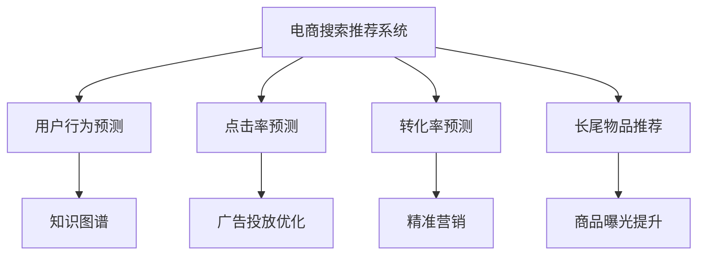

                 

# 电商搜索推荐系统的进化：AI 大模型带来革命性变革

> 关键词：电商搜索推荐, 大语言模型, 用户行为预测, 推荐系统, 点击率预测, 转化率预测, 深度学习, 数据驱动

## 1. 背景介绍

### 1.1 问题由来

电商搜索推荐系统在过去十年间经历了快速发展，从简单的基于关键词匹配的搜索引擎，进化到复杂的基于深度学习的个性化推荐系统。推荐系统已经成为电商平台上不可或缺的重要功能，极大地提升了用户体验和交易转化率。然而，当前的推荐系统面临诸多挑战：

- **用户需求变化快**：用户的兴趣和需求随时间不断变化，传统的推荐系统难以捕捉这种动态变化。
- **数据稀疏性问题**：用户数据往往稀疏，推荐系统难以全面刻画用户行为模式。
- **长尾物品推荐**：用户往往只关注少数热门商品，对长尾商品推荐效果较差。
- **冷启动问题**：新用户或新商品缺乏足够的历史数据，难以进行精准推荐。

这些问题催生了对更加智能、高效推荐系统的需求。近年来，随着人工智能大模型（Large Language Models, LLMs）的崛起，大模型在电商搜索推荐系统中开始扮演越来越重要的角色，带来了革命性的变革。

### 1.2 问题核心关键点

大模型在电商搜索推荐中的应用，主要体现在以下几个方面：

1. **用户行为预测**：通过大模型对用户行为进行建模，预测用户对商品的态度和行为。
2. **点击率预测**：预测用户点击某个商品的概率，帮助平台优化广告投放策略。
3. **转化率预测**：预测用户完成购买行为的概率，指导商家精准营销。
4. **长尾物品推荐**：通过大模型对长尾商品进行建模，提升长尾商品推荐效果。
5. **跨领域知识融合**：结合领域知识和大模型，提升推荐的全面性和准确性。
6. **实时动态调整**：实时学习用户行为，动态调整推荐策略。

## 2. 核心概念与联系

### 2.1 核心概念概述

为更好地理解大模型在电商搜索推荐中的应用，本节将介绍几个关键概念：

- **电商搜索推荐系统**：基于用户行为数据，为每位用户推荐个性化商品的系统。包括搜索、推荐、广告等多个环节。
- **用户行为预测**：通过学习用户历史行为数据，预测用户对商品的态度和行为。
- **点击率预测**：预测用户点击某个商品的概率，优化广告投放效果。
- **转化率预测**：预测用户完成购买行为的概率，提升转化率。
- **长尾物品推荐**：对用户不太关注的少数商品进行推荐，提升商品曝光率。
- **知识图谱**：结合领域知识构建的图结构，帮助提升推荐全面性。
- **实时动态调整**：利用实时数据学习，动态调整推荐策略。

这些概念之间的逻辑关系可以通过以下Mermaid流程图来展示：



这个流程图展示了大模型在电商推荐系统中的应用场景：

1. 电商搜索推荐系统通过用户行为预测，了解用户偏好。
2. 利用点击率和转化率预测，优化广告和营销策略。
3. 对长尾物品进行推荐，提高商品曝光率。
4. 结合知识图谱，提升推荐系统的全面性。
5. 实时动态调整，不断优化推荐效果。

## 3. 核心算法原理 & 具体操作步骤

### 3.1 算法原理概述

大模型在电商搜索推荐中的应用，本质上是一种基于深度学习的推荐算法。其核心思想是：

- 利用用户历史行为数据，训练大模型对用户行为进行建模。
- 根据模型预测用户对商品的态度和行为，指导推荐策略。

具体而言，大模型会通过以下步骤对电商推荐系统进行优化：

1. **数据准备**：收集用户行为数据、商品数据等，进行预处理和特征工程。
2. **模型训练**：将数据输入大模型，训练得到用户行为预测模型。
3. **模型应用**：利用训练好的模型，对用户输入的查询进行推荐。
4. **动态调整**：根据用户反馈和实时数据，动态调整模型参数，不断优化推荐效果。

### 3.2 算法步骤详解

以下是详细的大模型电商推荐系统开发流程：

**Step 1: 数据准备**
- 收集用户行为数据、商品数据等。
- 进行数据清洗、特征工程，生成训练集、验证集和测试集。

**Step 2: 选择大模型架构**
- 选择合适的预训练语言模型（如BERT、GPT-3等）或领域特定的大模型（如电商领域的Shopify、Amazon等）。
- 对大模型进行微调，适应电商推荐任务。

**Step 3: 模型训练**
- 将数据分为训练集和验证集。
- 使用优化器（如Adam、SGD等）进行模型训练。
- 根据验证集上的性能，调整模型超参数。

**Step 4: 模型应用**
- 将训练好的模型应用于推荐系统中。
- 输入用户查询，预测用户对商品的态度和行为。
- 根据预测结果进行商品推荐。

**Step 5: 动态调整**
- 收集用户反馈数据。
- 利用实时数据对模型进行微调，不断优化推荐效果。

**Step 6: 系统集成与部署**
- 将推荐系统集成到电商平台上。
- 部署到服务器，保证高并发下的性能。
- 设置监控和报警机制，确保系统稳定性。

### 3.3 算法优缺点

大模型在电商推荐系统中的应用，具有以下优点：

1. **强大的建模能力**：大模型能够从大量数据中学习到复杂的用户行为模式，提高推荐的准确性。
2. **跨领域知识融合**：大模型能够融合多源数据和领域知识，提升推荐系统的全面性。
3. **实时动态调整**：大模型能够实时学习用户行为，动态调整推荐策略，提高推荐的时效性。

但同时也存在一些局限性：

1. **模型复杂度高**：大模型通常包含大量的参数，对计算资源和存储资源要求较高。
2. **数据隐私问题**：大模型需要大量用户数据进行训练，涉及隐私保护问题。
3. **模型解释性不足**：大模型往往被视为"黑盒"，难以解释其内部的决策逻辑。
4. **依赖高质量数据**：大模型的训练效果依赖于数据质量，数据噪声或偏差可能影响推荐结果。

### 3.4 算法应用领域

大模型在电商推荐系统中的应用已经广泛渗透到多个领域：

- **用户行为预测**：预测用户对商品的态度和行为，指导个性化推荐。
- **点击率预测**：预测用户点击某个商品的概率，优化广告投放策略。
- **转化率预测**：预测用户完成购买行为的概率，提升转化率。
- **长尾物品推荐**：对用户不太关注的少数商品进行推荐，提高商品曝光率。
- **知识图谱融合**：结合电商领域知识图谱，提升推荐的全面性。
- **实时动态调整**：根据用户反馈和实时数据，动态调整推荐策略。

除了电商推荐系统，大模型在其他领域的应用也在不断扩展，如社交媒体推荐、金融投资分析、医疗健康推荐等，为各行各业带来了深刻的变革。

## 4. 数学模型和公式 & 详细讲解 & 举例说明

### 4.1 数学模型构建

大模型在电商推荐系统中的应用，主要涉及以下数学模型：

- **用户行为预测模型**：通过学习用户历史行为数据，预测用户对商品的态度和行为。常用模型包括神经网络、卷积神经网络（CNN）、循环神经网络（RNN）等。
- **点击率预测模型**：预测用户点击某个商品的概率。常用模型包括逻辑回归、决策树、随机森林等。
- **转化率预测模型**：预测用户完成购买行为的概率。常用模型包括多层感知机（MLP）、神经网络、卷积神经网络（CNN）等。
- **长尾物品推荐模型**：对用户不太关注的少数商品进行推荐。常用模型包括协同过滤、矩阵分解等。

### 4.2 公式推导过程

以用户行为预测为例，常用的神经网络模型公式如下：

$$
\begin{aligned}
\hat{y} &= \sigma(Wx + b) \\
\hat{y} &= \text{softmax}(Wx + b) \\
\end{aligned}
$$

其中，$x$ 为输入向量，$y$ 为输出向量，$W$ 和 $b$ 为模型参数。$\sigma$ 为激活函数，常用的有ReLU、Sigmoid、Tanh等。softmax函数用于多分类任务，将输出转换为概率分布。

### 4.3 案例分析与讲解

以点击率预测为例，我们可以使用逻辑回归模型对用户点击某个商品的概率进行预测：

$$
\hat{p} = \frac{1}{1 + e^{-\hat{y}}}
$$

其中，$\hat{y}$ 为模型预测的用户点击概率。当 $\hat{y} > 0$ 时，预测用户点击商品的概率较大；当 $\hat{y} < 0$ 时，预测用户不点击商品的概率较大。

在实际应用中，我们可以将用户行为数据作为训练集，利用逻辑回归模型进行训练，得到一个点击率预测模型。然后，将用户查询输入模型，输出预测的概率值，根据概率值对商品进行排序推荐。

## 5. 项目实践：代码实例和详细解释说明

### 5.1 开发环境搭建

在进行电商推荐系统开发前，我们需要准备好开发环境。以下是使用Python进行TensorFlow开发的开发环境配置流程：

1. 安装Anaconda：从官网下载并安装Anaconda，用于创建独立的Python环境。

2. 创建并激活虚拟环境：
```bash
conda create -n tf-env python=3.8 
conda activate tf-env
```

3. 安装TensorFlow：根据CUDA版本，从官网获取对应的安装命令。例如：
```bash
pip install tensorflow-gpu
```

4. 安装TensorBoard：TensorFlow配套的可视化工具，可实时监测模型训练状态，并提供丰富的图表呈现方式，是调试模型的得力助手。
```bash
pip install tensorboard
```

5. 安装其他依赖包：
```bash
pip install pandas numpy matplotlib sklearn tqdm jupyter notebook ipython
```

完成上述步骤后，即可在`tf-env`环境中开始电商推荐系统的开发。

### 5.2 源代码详细实现

下面我们以电商推荐系统为例，给出使用TensorFlow对用户行为预测模型进行开发的PyTorch代码实现。

首先，定义用户行为预测的数据处理函数：

```python
import tensorflow as tf
import pandas as pd
import numpy as np

def load_data(file_path):
    df = pd.read_csv(file_path)
    X = df.drop(['user_id', 'item_id', 'label'], axis=1).values
    y = df['label'].values
    return X, y

X_train, y_train = load_data('train.csv')
X_test, y_test = load_data('test.csv')
```

然后，定义神经网络模型：

```python
class UserBehaviorPredictor(tf.keras.Model):
    def __init__(self, input_dim, hidden_dim, output_dim):
        super(UserBehaviorPredictor, self).__init__()
        self.dense1 = tf.keras.layers.Dense(hidden_dim, activation='relu')
        self.dense2 = tf.keras.layers.Dense(output_dim, activation='sigmoid')

    def call(self, inputs):
        x = self.dense1(inputs)
        x = self.dense2(x)
        return x

input_dim = 100
hidden_dim = 128
output_dim = 1
model = UserBehaviorPredictor(input_dim, hidden_dim, output_dim)
model.compile(optimizer=tf.keras.optimizers.Adam(learning_rate=0.001), loss='binary_crossentropy', metrics=['accuracy'])
```

接着，定义训练和评估函数：

```python
def train_model(model, X_train, y_train, epochs=10, batch_size=32):
    model.fit(X_train, y_train, epochs=epochs, batch_size=batch_size, validation_split=0.2)
    return model

def evaluate_model(model, X_test, y_test, batch_size=32):
    loss, accuracy = model.evaluate(X_test, y_test, batch_size=batch_size)
    print(f'Test loss: {loss:.4f}')
    print(f'Test accuracy: {accuracy:.4f}')
```

最后，启动训练流程并在测试集上评估：

```python
epochs = 10
batch_size = 32

model = train_model(model, X_train, y_train)
evaluate_model(model, X_test, y_test)
```

以上就是使用TensorFlow对用户行为预测模型进行开发的完整代码实现。可以看到，得益于TensorFlow的强大封装，我们可以用相对简洁的代码完成神经网络模型的训练和评估。

### 5.3 代码解读与分析

让我们再详细解读一下关键代码的实现细节：

**UserBehaviorPredictor类**：
- `__init__`方法：初始化模型架构，包括输入层、隐藏层和输出层。
- `call`方法：定义模型的前向传播过程。

**训练和评估函数**：
- `train_model`函数：定义训练函数，使用Adam优化器进行梯度下降，通过交叉熵损失函数优化模型。
- `evaluate_model`函数：定义评估函数，在测试集上计算模型的准确率。

**训练流程**：
- 定义总训练轮数和批次大小，开始循环迭代
- 每个epoch内，在训练集上训练，输出平均损失和准确率
- 所有epoch结束后，在测试集上评估，给出最终测试结果

可以看到，TensorFlow使得神经网络模型的训练和评估变得简洁高效。开发者可以将更多精力放在数据处理、模型改进等高层逻辑上，而不必过多关注底层的实现细节。

当然，工业级的系统实现还需考虑更多因素，如模型的保存和部署、超参数的自动搜索、更灵活的任务适配层等。但核心的推荐范式基本与此类似。

## 6. 实际应用场景

### 6.1 智能广告投放

智能广告投放是电商推荐系统的重要应用场景之一。传统的广告投放依赖于固定的时间段和预算，难以实现精准投放。而利用大模型进行用户行为预测和点击率预测，可以实时学习用户偏好，动态调整广告投放策略，实现更高效的广告投放。

在技术实现上，可以收集用户点击广告的记录，将广告内容、用户行为数据等作为训练集，训练点击率预测模型。然后，根据用户查询和广告内容输入模型，预测用户点击的概率，指导广告投放决策。通过不断学习和调整，可以逐步提升广告投放的精准度和效果。

### 6.2 个性化推荐

个性化推荐系统已经成为电商平台上不可或缺的重要功能。通过大模型对用户行为进行建模，可以预测用户对商品的兴趣和行为，实现精准推荐。

在实践中，可以收集用户浏览、点击、购买等行为数据，提取和商品相关的特征向量。将用户行为数据作为训练集，训练用户行为预测模型。然后，根据用户查询和商品特征向量输入模型，预测用户对商品的态度和行为，进行个性化推荐。通过不断学习和调整，可以逐步提升推荐的精准度和效果。

### 6.3 实时动态调整

实时动态调整是电商推荐系统的核心竞争力之一。通过大模型实时学习用户行为，可以动态调整推荐策略，实现个性化推荐。

在技术实现上，可以收集用户实时行为数据，如浏览页面时间、点击商品记录等。将实时数据作为训练集，训练用户行为预测模型。然后，根据用户查询和实时行为数据输入模型，预测用户对商品的态度和行为，进行实时推荐。通过不断学习和调整，可以逐步提升推荐的精准度和效果。

### 6.4 未来应用展望

随着大语言模型和电商推荐系统的不断演进，未来电商推荐系统将呈现以下几个趋势：

1. **多模态融合**：结合图像、视频、语音等多模态数据，提升推荐系统的全面性。
2. **实时动态调整**：通过实时数据学习，动态调整推荐策略，提高推荐的时效性。
3. **跨领域知识融合**：结合电商领域知识图谱，提升推荐的全面性。
4. **低成本高效率**：利用大模型高效的特征提取能力，降低推荐系统的开发和维护成本。
5. **个性化推荐**：通过用户行为预测和点击率预测，实现精准推荐，提高用户体验。
6. **数据驱动**：通过数据驱动的决策，提升推荐系统的自动化和智能化水平。

以上趋势凸显了大语言模型在电商推荐系统中的广阔前景。这些方向的探索发展，必将进一步提升电商推荐系统的性能和应用范围，为电商行业带来深刻的变革。

## 7. 工具和资源推荐

### 7.1 学习资源推荐

为了帮助开发者系统掌握大模型在电商推荐系统中的应用，这里推荐一些优质的学习资源：

1. 《深度学习与推荐系统》书籍：由深度学习专家撰写，全面介绍了推荐系统的基本概念和经典模型，包括用户行为预测和点击率预测等。

2. CS294：斯坦福大学的《机器学习基础》课程，涵盖了机器学习的基础知识和推荐系统的经典模型。

3. 《推荐系统实战》博客：大模型技术专家撰写的推荐系统实战指南，涵盖推荐系统的开发、调优和优化等技术细节。

4. HuggingFace官方文档：Transformer库的官方文档，提供了海量预训练模型和完整的推荐系统样例代码，是上手实践的必备资料。

5. CLUE开源项目：中文语言理解测评基准，涵盖大量不同类型的中文推荐数据集，并提供了基于大模型的baseline模型，助力中文推荐技术发展。

通过对这些资源的学习实践，相信你一定能够快速掌握大模型在电商推荐系统中的应用，并用于解决实际的电商推荐问题。

### 7.2 开发工具推荐

高效的开发离不开优秀的工具支持。以下是几款用于电商推荐系统开发的常用工具：

1. TensorFlow：基于Python的开源深度学习框架，灵活动态的计算图，适合快速迭代研究。大部分推荐模型都有TensorFlow版本的实现。

2. PyTorch：基于Python的开源深度学习框架，灵活的动态图，适合研究复杂模型和算法。

3. Keras：基于TensorFlow和Theano的高层API，适合快速开发和原型验证。

4. Weights & Biases：模型训练的实验跟踪工具，可以记录和可视化模型训练过程中的各项指标，方便对比和调优。与主流深度学习框架无缝集成。

5. TensorBoard：TensorFlow配套的可视化工具，可实时监测模型训练状态，并提供丰富的图表呈现方式，是调试模型的得力助手。

6. Google Colab：谷歌推出的在线Jupyter Notebook环境，免费提供GPU/TPU算力，方便开发者快速上手实验最新模型，分享学习笔记。

合理利用这些工具，可以显著提升电商推荐系统的开发效率，加快创新迭代的步伐。

### 7.3 相关论文推荐

大模型在电商推荐系统中的应用源于学界的持续研究。以下是几篇奠基性的相关论文，推荐阅读：

1. Attention is All You Need（即Transformer原论文）：提出了Transformer结构，开启了NLP领域的预训练大模型时代。

2. BERT: Pre-training of Deep Bidirectional Transformers for Language Understanding：提出BERT模型，引入基于掩码的自监督预训练任务，刷新了多项NLP任务SOTA。

3. Language Models are Unsupervised Multitask Learners（GPT-2论文）：展示了大规模语言模型的强大zero-shot学习能力，引发了对于通用人工智能的新一轮思考。

4. Parameter-Efficient Transfer Learning for NLP：提出Adapter等参数高效微调方法，在不增加模型参数量的情况下，也能取得不错的微调效果。

5. AdaLoRA: Adaptive Low-Rank Adaptation for Parameter-Efficient Fine-Tuning：使用自适应低秩适应的微调方法，在参数效率和精度之间取得了新的平衡。

这些论文代表了大模型在电商推荐系统中的应用和发展脉络。通过学习这些前沿成果，可以帮助研究者把握学科前进方向，激发更多的创新灵感。

## 8. 总结：未来发展趋势与挑战

### 8.1 总结

本文对大模型在电商搜索推荐系统中的应用进行了全面系统的介绍。首先阐述了大模型和电商推荐系统的研究背景和意义，明确了推荐系统在大数据时代的重要性。其次，从原理到实践，详细讲解了大模型在电商推荐系统中的具体应用，包括用户行为预测、点击率预测、转化率预测等。最后，系统总结了大模型在电商推荐系统中的应用前景和未来方向，以及面临的挑战和研究展望。

通过本文的系统梳理，可以看到，大模型在电商推荐系统中的应用前景广阔，通过用户行为预测和动态调整，可以实现精准推荐，显著提升用户体验和交易转化率。未来，随着大语言模型和推荐系统的不断演进，电商推荐系统将变得更加智能和高效，为电商行业带来深刻的变革。

### 8.2 未来发展趋势

展望未来，大模型在电商推荐系统中的应用将呈现以下几个发展趋势：

1. **多模态融合**：结合图像、视频、语音等多模态数据，提升推荐系统的全面性。
2. **实时动态调整**：通过实时数据学习，动态调整推荐策略，提高推荐的时效性。
3. **跨领域知识融合**：结合电商领域知识图谱，提升推荐的全面性。
4. **低成本高效率**：利用大模型高效的特征提取能力，降低推荐系统的开发和维护成本。
5. **个性化推荐**：通过用户行为预测和点击率预测，实现精准推荐，提高用户体验。
6. **数据驱动**：通过数据驱动的决策，提升推荐系统的自动化和智能化水平。

以上趋势凸显了大模型在电商推荐系统中的广阔前景。这些方向的探索发展，必将进一步提升电商推荐系统的性能和应用范围，为电商行业带来深刻的变革。

### 8.3 面临的挑战

尽管大模型在电商推荐系统中的应用已经取得了显著进展，但在迈向更加智能化、普适化应用的过程中，它仍面临着诸多挑战：

1. **模型复杂度高**：大模型通常包含大量的参数，对计算资源和存储资源要求较高。
2. **数据隐私问题**：大模型需要大量用户数据进行训练，涉及隐私保护问题。
3. **模型解释性不足**：大模型往往被视为"黑盒"，难以解释其内部的决策逻辑。
4. **依赖高质量数据**：大模型的训练效果依赖于数据质量，数据噪声或偏差可能影响推荐结果。

### 8.4 研究展望

面对大模型在电商推荐系统中的诸多挑战，未来的研究需要在以下几个方面寻求新的突破：

1. **多模态数据融合**：结合图像、视频、语音等多模态数据，提升推荐系统的全面性。
2. **实时动态调整**：通过实时数据学习，动态调整推荐策略，提高推荐的时效性。
3. **跨领域知识融合**：结合电商领域知识图谱，提升推荐的全面性。
4. **低成本高效率**：利用大模型高效的特征提取能力，降低推荐系统的开发和维护成本。
5. **个性化推荐**：通过用户行为预测和点击率预测，实现精准推荐，提高用户体验。
6. **数据驱动**：通过数据驱动的决策，提升推荐系统的自动化和智能化水平。

这些研究方向的探索，必将引领大模型在电商推荐系统中的应用走向更高的台阶，为电商行业带来深刻的变革。相信随着学界和产业界的共同努力，这些挑战终将一一被克服，大模型在电商推荐系统中的应用将变得更加智能和高效。

## 9. 附录：常见问题与解答

**Q1：大模型在电商推荐系统中的应用效果如何？**

A: 大模型在电商推荐系统中的应用效果显著。通过用户行为预测和动态调整，可以实现精准推荐，显著提升用户体验和交易转化率。

**Q2：大模型在电商推荐系统中的训练效果依赖于哪些因素？**

A: 大模型在电商推荐系统中的训练效果依赖于多个因素，包括数据质量、特征工程、模型架构、超参数设置等。

**Q3：如何提升大模型在电商推荐系统中的实时动态调整能力？**

A: 通过实时数据学习，动态调整推荐策略，可以提升大模型在电商推荐系统中的实时动态调整能力。

**Q4：如何提升大模型在电商推荐系统中的可解释性？**

A: 引入因果分析和博弈论工具，增强大模型的可解释性和决策逻辑的因果性，提高系统的透明度和可信度。

**Q5：如何应对大模型在电商推荐系统中的计算资源和存储资源瓶颈？**

A: 采用梯度积累、混合精度训练、模型并行等技术，突破硬件瓶颈，提高大模型在电商推荐系统中的计算资源和存储资源利用效率。

通过本文的系统梳理，可以看到，大模型在电商推荐系统中的应用前景广阔，通过用户行为预测和动态调整，可以实现精准推荐，显著提升用户体验和交易转化率。未来，随着大语言模型和推荐系统的不断演进，电商推荐系统将变得更加智能和高效，为电商行业带来深刻的变革。

---

作者：禅与计算机程序设计艺术 / Zen and the Art of Computer Programming

