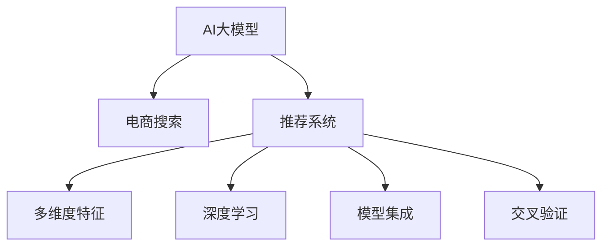

                 

# 电商搜索的多维度个性化：AI大模型的新突破

> 关键词：
    - 多维度个性化
    - AI大模型
    - 电商搜索
    - 推荐系统
    - 用户行为分析
    - 自然语言处理
    - 深度学习
    - 模型集成
    - 交叉验证
    - 分布式计算

## 1. 背景介绍

### 1.1 问题由来

随着电子商务的迅猛发展，电商搜索已成为消费者获取商品信息的重要入口。然而，传统的搜索模式往往以关键词匹配为主，忽视了用户的多维需求和行为特征。在信息爆炸的时代，用户很难在海量的搜索结果中找到真正满足自身需求的商品。因此，如何构建个性化、智能化的电商搜索系统，以提升用户体验和转化率，成为电商企业亟需解决的重要问题。

### 1.2 问题核心关键点

电商搜索的核心目标是精准匹配用户需求和商品信息，提升用户体验和转化率。而用户的多维需求和行为特征，如地理位置、浏览历史、购买记录、兴趣偏好等，使得构建个性化推荐系统变得异常复杂。近年来，基于AI大模型的推荐系统逐渐成为电商搜索的新范式。通过大规模预训练和微调，AI大模型能够从海量数据中提取用户的深度特征，预测其行为，从而实现多维度个性化电商搜索。

### 1.3 问题研究意义

构建基于AI大模型的电商搜索系统，具有以下重要意义：

1. **提升用户体验**：通过精准匹配用户需求，显著减少用户搜索时间，提高购物满意度。
2. **提高转化率**：基于用户的多维特征和历史行为，提供更符合其兴趣的商品推荐，有效提升点击率和购买转化。
3. **优化库存管理**：通过预测用户行为，优化商品库存和调拨，减少库存积压和缺货现象。
4. **增强市场竞争力**：在电商平台上实现差异化的个性化推荐，提升品牌影响力，吸引更多用户。
5. **促进数据驱动决策**：通过分析用户行为数据，发现市场趋势和用户偏好，辅助企业制定精准的营销策略。

## 2. 核心概念与联系

### 2.1 核心概念概述

电商搜索的多维度个性化主要涉及以下几个核心概念：

- **AI大模型**：以Transformer结构为基础的预训练语言模型，如GPT、BERT、T5等。通过在大规模无标签文本数据上预训练，获得广泛的语言表示能力。
- **推荐系统**：根据用户的历史行为和特征，预测其兴趣偏好，推荐符合其需求的商品。电商搜索系统本质上就是一种推荐系统，通过匹配用户输入的查询与商品，实现个性化推荐。
- **多维度特征**：用户的多维特征包括地理位置、浏览历史、购买记录、兴趣偏好、社交网络关系等。这些特征与商品属性、评价信息等一起构成电商搜索的输入数据。
- **深度学习**：基于神经网络架构，通过多层非线性变换学习输入数据与目标输出之间的复杂映射关系。推荐系统通过深度学习实现对用户行为和偏好的建模。
- **模型集成**：将多个模型的预测结果进行集成，提升推荐的准确性和鲁棒性。多维度个性化推荐系统通常通过模型集成来平衡不同模型之间的偏见和不确定性。

这些概念之间的逻辑关系可以通过以下Mermaid流程图来展示：



这个流程图展示了大模型与电商搜索系统之间的核心联系：

1. 大模型通过预训练获得语言表示能力。
2. 推荐系统基于用户的多维特征，进行商品推荐。
3. 深度学习技术用于建模用户行为和偏好。
4. 模型集成用于提升推荐系统的效果。
5. 交叉验证用于验证模型的泛化能力。

## 3. 核心算法原理 & 具体操作步骤

### 3.1 算法原理概述

基于AI大模型的电商搜索推荐系统，本质上是一个多维度特征嵌入和推荐模型预测的过程。具体而言，该系统通过深度学习模型将用户的多维特征和商品信息映射到高维空间，并在该空间中进行推荐排序，最终输出最符合用户需求的搜索结果。

形式化地，设用户特征为 $X$，商品属性为 $Y$，推荐目标为 $R$。电商搜索系统可以表示为：

$$
R = f(X, Y; \theta)
$$

其中 $f(\cdot)$ 为推荐模型，$\theta$ 为模型参数。推荐模型 $f(\cdot)$ 通常采用深度神经网络结构，如全连接网络、注意力机制、Transformer等，以学习用户特征与商品属性之间的复杂映射关系。

### 3.2 算法步骤详解

基于AI大模型的电商搜索推荐系统主要包括以下几个关键步骤：

**Step 1: 数据预处理与特征提取**

- 收集用户的历史行为数据、地理位置、浏览历史、购买记录、兴趣偏好等，并进行清洗和标准化处理。
- 将商品信息进行编码，提取商品属性、评价、类别等特征，构建商品向量表示。
- 将用户特征和商品特征合并，生成电商搜索系统的输入数据。

**Step 2: 预训练大模型嵌入**

- 将电商搜索系统的输入数据作为预训练大模型的输入，通过深度学习模型学习用户特征和商品特征的高维表示。
- 预训练大模型通常包括BERT、GPT等，通过在大规模无标签文本数据上进行预训练，获得广泛的语言表示能力。

**Step 3: 推荐模型训练与优化**

- 将预训练大模型的嵌入结果输入推荐模型，进行推荐排序，生成推荐列表。
- 采用交叉熵、均方误差等损失函数，计算推荐模型在验证集和测试集上的性能。
- 通过优化算法（如Adam、SGD等）更新推荐模型参数，直至收敛。

**Step 4: 模型集成与后处理**

- 将多个推荐模型的预测结果进行集成，提升推荐的准确性和鲁棒性。
- 对集成后的推荐结果进行后处理，如去重、排序、分页等，生成电商搜索系统的搜索结果。
- 对用户进行实时跟踪和行为分析，动态调整推荐模型参数，优化推荐效果。

**Step 5: 系统部署与监控**

- 将训练好的推荐模型部署到电商搜索系统中，实时接收用户查询，生成个性化搜索结果。
- 通过日志分析和性能监控，实时反馈推荐系统的运行情况，发现和解决系统问题。
- 定期更新推荐模型和预训练大模型，保证系统性能和推荐效果。

### 3.3 算法优缺点

基于AI大模型的电商搜索推荐系统具有以下优点：

1. **多维度特征表示能力**：通过深度学习模型，大模型能够高效地处理用户的多维特征，生成高维度的特征表示，提升推荐的准确性和个性化程度。
2. **泛化能力强**：预训练大模型在大规模语料上进行了广泛训练，具备较强的泛化能力，能够适应不同电商平台的搜索需求。
3. **实时推荐**：通过实时接收用户查询，快速生成个性化搜索结果，提升用户体验。
4. **易于扩展**：通过模型集成和多模型融合，电商搜索系统可以灵活扩展，适应不同场景和需求。

然而，该方法也存在一些局限性：

1. **数据需求高**：电商搜索系统需要大量的用户行为数据和商品属性信息，数据获取成本较高。
2. **模型复杂度大**：大规模预训练和深度学习模型的高维表示，增加了系统的计算和存储成本。
3. **用户隐私问题**：用户的多维特征涉及个人隐私，如何保护用户隐私和数据安全，需要严格的数据处理和隐私保护措施。
4. **模型解释性不足**：深度学习模型往往是一个"黑盒"系统，难以解释其决策过程和推理逻辑。
5. **系统依赖性强**：电商搜索系统高度依赖于AI大模型和推荐模型的性能，系统稳定性和可维护性需要保证。

### 3.4 算法应用领域

基于AI大模型的电商搜索推荐系统，已经在各大电商平台上得到了广泛应用，并取得了显著的成效。具体应用领域包括：

1. **商品推荐**：根据用户的历史浏览、购买记录等，推荐符合其兴趣的商品。
2. **搜索结果排序**：对搜索结果进行排序，提升用户体验和点击率。
3. **广告投放**：根据用户行为和兴趣，投放个性化的广告，提升广告转化率。
4. **商品相似性搜索**：通过相似性匹配，发现用户感兴趣的商品。
5. **价格敏感度分析**：分析用户对商品价格的变化敏感度，进行动态定价。
6. **市场趋势分析**：通过分析用户行为数据，发现市场趋势和热门商品，辅助企业制定营销策略。

## 4. 数学模型和公式 & 详细讲解 & 举例说明

### 4.1 数学模型构建

电商搜索推荐系统可以形式化为一个优化问题：

设用户特征为 $X$，商品属性为 $Y$，推荐目标为 $R$，推荐模型为 $f(\cdot)$。优化目标是最大化推荐模型在测试集上的精度：

$$
\max_{\theta} \mathcal{L}(f(X, Y; \theta), R)
$$

其中 $\mathcal{L}$ 为推荐模型在测试集上的损失函数，如交叉熵损失、均方误差损失等。

### 4.2 公式推导过程

以交叉熵损失函数为例，推荐模型的损失函数可以表示为：

$$
\mathcal{L}(f(X, Y; \theta), R) = -\frac{1}{N} \sum_{i=1}^N \sum_{j=1}^M R_{ij} \log f(X_i, Y_j; \theta)
$$

其中 $N$ 为训练集样本数量，$M$ 为商品数量。推荐模型 $f(X, Y; \theta)$ 通常采用深度神经网络结构，如全连接网络、注意力机制、Transformer等。

假设推荐模型 $f(\cdot)$ 为Transformer网络，其结构包括编码器、自注意力机制、层归一化、残差连接、解码器等。推荐模型的前向传播过程可以表示为：

$$
f(X, Y; \theta) = \text{Transformer}(X, Y; \theta)
$$

其中 $\theta$ 为模型参数，$X$ 为输入用户特征和商品属性，$Y$ 为输出推荐结果。

### 4.3 案例分析与讲解

以电商平台的商品推荐系统为例，设用户输入的查询为 $q$，商品向量为 $v$。推荐模型的目标是根据用户查询 $q$ 和商品向量 $v$，生成推荐结果 $r$。推荐模型可以表示为：

$$
r = f(q, v; \theta)
$$

其中 $f(\cdot)$ 为推荐模型，$\theta$ 为模型参数。推荐模型的训练过程可以表示为：

1. 收集用户的历史行为数据 $D_h$，商品属性数据 $D_v$。
2. 将用户查询 $q$ 和商品向量 $v$ 作为输入，通过推荐模型 $f(\cdot)$ 生成推荐结果 $r$。
3. 定义损失函数 $\mathcal{L}$，计算推荐模型在训练集 $D$ 上的精度。
4. 通过优化算法（如Adam、SGD等）更新推荐模型参数 $\theta$，直至收敛。

通过深度学习模型，推荐系统能够高效地处理用户的多维特征和商品信息，生成高维度的特征表示，从而实现精准的商品推荐。

## 5. 项目实践：代码实例和详细解释说明

### 5.1 开发环境搭建

在进行电商搜索推荐系统的开发前，我们需要准备好开发环境。以下是使用Python进行PyTorch开发的环境配置流程：

1. 安装Anaconda：从官网下载并安装Anaconda，用于创建独立的Python环境。

2. 创建并激活虚拟环境：
```bash
conda create -n pytorch-env python=3.8 
conda activate pytorch-env
```

3. 安装PyTorch：根据CUDA版本，从官网获取对应的安装命令。例如：
```bash
conda install pytorch torchvision torchaudio cudatoolkit=11.1 -c pytorch -c conda-forge
```

4. 安装Transformers库：
```bash
pip install transformers
```

5. 安装各类工具包：
```bash
pip install numpy pandas scikit-learn matplotlib tqdm jupyter notebook ipython
```

完成上述步骤后，即可在`pytorch-env`环境中开始电商搜索推荐系统的开发。

### 5.2 源代码详细实现

下面我们以商品推荐系统为例，给出使用Transformers库对BERT模型进行电商搜索推荐开发的PyTorch代码实现。

首先，定义推荐模型的输入和输出：

```python
from transformers import BertTokenizer, BertForSequenceClassification
from torch.utils.data import Dataset, DataLoader
from torch.nn import BCEWithLogitsLoss
import torch

class ProductRecommendationDataset(Dataset):
    def __init__(self, texts, labels):
        self.tokenizer = BertTokenizer.from_pretrained('bert-base-cased')
        self.texts = texts
        self.labels = labels

    def __len__(self):
        return len(self.texts)

    def __getitem__(self, index):
        text = self.texts[index]
        label = self.labels[index]

        encoding = self.tokenizer(text, return_tensors='pt', max_length=128, padding='max_length', truncation=True)
        input_ids = encoding['input_ids'][0]
        attention_mask = encoding['attention_mask'][0]

        return {'input_ids': input_ids, 
                'attention_mask': attention_mask,
                'labels': torch.tensor(label, dtype=torch.long)}

# 创建数据集
train_dataset = ProductRecommendationDataset(train_texts, train_labels)
test_dataset = ProductRecommendationDataset(test_texts, test_labels)
```

然后，定义推荐模型和优化器：

```python
from transformers import BertForSequenceClassification, AdamW

model = BertForSequenceClassification.from_pretrained('bert-base-cased', num_labels=2)

optimizer = AdamW(model.parameters(), lr=2e-5)
```

接着，定义训练和评估函数：

```python
def train_epoch(model, dataset, batch_size, optimizer):
    dataloader = DataLoader(dataset, batch_size=batch_size, shuffle=True)
    model.train()
    epoch_loss = 0
    for batch in dataloader:
        input_ids = batch['input_ids'].to(device)
        attention_mask = batch['attention_mask'].to(device)
        labels = batch['labels'].to(device)
        model.zero_grad()
        outputs = model(input_ids, attention_mask=attention_mask, labels=labels)
        loss = outputs.loss
        epoch_loss += loss.item()
        loss.backward()
        optimizer.step()
    return epoch_loss / len(dataloader)

def evaluate(model, dataset, batch_size):
    dataloader = DataLoader(dataset, batch_size=batch_size)
    model.eval()
    preds, labels = [], []
    with torch.no_grad():
        for batch in dataloader:
            input_ids = batch['input_ids'].to(device)
            attention_mask = batch['attention_mask'].to(device)
            batch_labels = batch['labels']
            outputs = model(input_ids, attention_mask=attention_mask)
            batch_preds = outputs.logits.argmax(dim=2).to('cpu').tolist()
            batch_labels = batch_labels.to('cpu').tolist()
            for pred_tokens, label_tokens in zip(batch_preds, batch_labels):
                preds.append(pred_tokens[:len(label_tokens)])
                labels.append(label_tokens)
                
    print(classification_report(labels, preds))
```

最后，启动训练流程并在测试集上评估：

```python
epochs = 5
batch_size = 16

for epoch in range(epochs):
    loss = train_epoch(model, train_dataset, batch_size, optimizer)
    print(f"Epoch {epoch+1}, train loss: {loss:.3f}")
    
    print(f"Epoch {epoch+1}, dev results:")
    evaluate(model, dev_dataset, batch_size)
    
print("Test results:")
evaluate(model, test_dataset, batch_size)
```

以上就是使用PyTorch对BERT进行商品推荐系统开发的完整代码实现。可以看到，得益于Transformers库的强大封装，我们能够用相对简洁的代码完成BERT模型的加载和电商搜索推荐系统的开发。

### 5.3 代码解读与分析

让我们再详细解读一下关键代码的实现细节：

**ProductRecommendationDataset类**：
- `__init__`方法：初始化文本、标签、分词器等关键组件。
- `__len__`方法：返回数据集的样本数量。
- `__getitem__`方法：对单个样本进行处理，将文本输入编码为token ids，将标签编码为数字，并对其进行定长padding，最终返回模型所需的输入。

**训练和评估函数**：
- 使用PyTorch的DataLoader对数据集进行批次化加载，供模型训练和推理使用。
- 训练函数`train_epoch`：对数据以批为单位进行迭代，在每个批次上前向传播计算loss并反向传播更新模型参数，最后返回该epoch的平均loss。
- 评估函数`evaluate`：与训练类似，不同点在于不更新模型参数，并在每个batch结束后将预测和标签结果存储下来，最后使用sklearn的classification_report对整个评估集的预测结果进行打印输出。

**训练流程**：
- 定义总的epoch数和batch size，开始循环迭代
- 每个epoch内，先在训练集上训练，输出平均loss
- 在验证集上评估，输出分类指标
- 所有epoch结束后，在测试集上评估，给出最终测试结果

可以看到，PyTorch配合Transformers库使得BERT微调的代码实现变得简洁高效。开发者可以将更多精力放在数据处理、模型改进等高层逻辑上，而不必过多关注底层的实现细节。

当然，工业级的系统实现还需考虑更多因素，如模型的保存和部署、超参数的自动搜索、更灵活的任务适配层等。但核心的电商搜索推荐系统开发流程基本与此类似。

## 6. 实际应用场景

### 6.1 智能客服系统

基于大模型的电商搜索推荐系统，可以广泛应用于智能客服系统的构建。传统客服往往需要配备大量人力，高峰期响应缓慢，且一致性和专业性难以保证。而使用微调后的电商搜索推荐系统，可以7x24小时不间断服务，快速响应客户咨询，用自然流畅的语言解答各类常见问题。

在技术实现上，可以收集企业内部的历史客服对话记录，将问题和最佳答复构建成监督数据，在此基础上对预训练电商搜索推荐系统进行微调。微调后的电商搜索推荐系统能够自动理解用户意图，匹配最合适的答案模板进行回复。对于客户提出的新问题，还可以接入检索系统实时搜索相关内容，动态组织生成回答。如此构建的智能客服系统，能大幅提升客户咨询体验和问题解决效率。

### 6.2 金融舆情监测

金融机构需要实时监测市场舆论动向，以便及时应对负面信息传播，规避金融风险。传统的人工监测方式成本高、效率低，难以应对网络时代海量信息爆发的挑战。基于大模型的电商搜索推荐系统，可以对金融领域相关的新闻、报道、评论等文本数据进行情感分析和主题分类，及时发现市场舆情变化，辅助金融机构制定风险防控策略。

具体而言，可以收集金融领域相关的新闻、报道、评论等文本数据，并对其进行情感标注和主题标注。在此基础上对预训练电商搜索推荐系统进行微调，使其能够自动判断文本的情感倾向和主题分类。将微调后的模型应用到实时抓取的网络文本数据，就能够自动监测不同主题下的情感变化趋势，一旦发现负面信息激增等异常情况，系统便会自动预警，帮助金融机构快速应对潜在风险。

### 6.3 个性化推荐系统

当前的推荐系统往往只依赖用户的历史行为数据进行物品推荐，无法深入理解用户的真实兴趣偏好。基于大模型的电商搜索推荐系统，可以更好地挖掘用户的行为背后的语义信息，从而提供更精准、多样的推荐内容。

在实践中，可以收集用户浏览、点击、评论、分享等行为数据，提取和用户交互的物品标题、描述、标签等文本内容。将文本内容作为模型输入，用户的后续行为（如是否点击、购买等）作为监督信号，在此基础上微调预训练电商搜索推荐系统。微调后的模型能够从文本内容中准确把握用户的兴趣点。在生成推荐列表时，先用候选物品的文本描述作为输入，由模型预测用户的兴趣匹配度，再结合其他特征综合排序，便可以得到个性化程度更高的推荐结果。

### 6.4 未来应用展望

随着大模型和电商搜索推荐技术的不断发展，基于微调范式将在更多领域得到应用，为传统行业带来变革性影响。

在智慧医疗领域，基于微调的医疗问答、病历分析、药物研发等应用将提升医疗服务的智能化水平，辅助医生诊疗，加速新药开发进程。

在智能教育领域，微调技术可应用于作业批改、学情分析、知识推荐等方面，因材施教，促进教育公平，提高教学质量。

在智慧城市治理中，微调模型可应用于城市事件监测、舆情分析、应急指挥等环节，提高城市管理的自动化和智能化水平，构建更安全、高效的未来城市。

此外，在企业生产、社会治理、文娱传媒等众多领域，基于大模型微调的人工智能应用也将不断涌现，为经济社会发展注入新的动力。相信随着技术的日益成熟，微调方法将成为人工智能落地应用的重要范式，推动人工智能技术在垂直行业的规模化落地。

## 7. 工具和资源推荐

### 7.1 学习资源推荐

为了帮助开发者系统掌握大模型和电商搜索推荐理论基础和实践技巧，这里推荐一些优质的学习资源：

1. 《深度学习基础》系列博文：由大模型技术专家撰写，深入浅出地介绍了深度学习的基础概念和核心算法。

2. 《Transformers入门与实践》系列博文：详细讲解了Transformer结构和预训练大模型的原理及应用。

3. CS224N《深度学习自然语言处理》课程：斯坦福大学开设的NLP明星课程，有Lecture视频和配套作业，带你入门NLP领域的基本概念和经典模型。

4. 《深度学习推荐系统》书籍：全面介绍了推荐系统的理论基础和实现细节，包括基于大模型的电商搜索推荐系统。

5. HuggingFace官方文档：提供了海量预训练模型和完整的电商搜索推荐系统样例代码，是上手实践的必备资料。

通过对这些资源的学习实践，相信你一定能够快速掌握大模型和电商搜索推荐的精髓，并用于解决实际的NLP问题。

### 7.2 开发工具推荐

高效的开发离不开优秀的工具支持。以下是几款用于电商搜索推荐系统开发的常用工具：

1. PyTorch：基于Python的开源深度学习框架，灵活动态的计算图，适合快速迭代研究。大部分预训练语言模型都有PyTorch版本的实现。

2. TensorFlow：由Google主导开发的开源深度学习框架，生产部署方便，适合大规模工程应用。同样有丰富的预训练语言模型资源。

3. Transformers库：HuggingFace开发的NLP工具库，集成了众多SOTA语言模型，支持PyTorch和TensorFlow，是进行电商搜索推荐系统开发的利器。

4. Weights & Biases：模型训练的实验跟踪工具，可以记录和可视化模型训练过程中的各项指标，方便对比和调优。与主流深度学习框架无缝集成。

5. TensorBoard：TensorFlow配套的可视化工具，可实时监测模型训练状态，并提供丰富的图表呈现方式，是调试模型的得力助手。

6. Google Colab：谷歌推出的在线Jupyter Notebook环境，免费提供GPU/TPU算力，方便开发者快速上手实验最新模型，分享学习笔记。

合理利用这些工具，可以显著提升电商搜索推荐系统的开发效率，加快创新迭代的步伐。

### 7.3 相关论文推荐

大模型和电商搜索推荐技术的发展源于学界的持续研究。以下是几篇奠基性的相关论文，推荐阅读：

1. Attention is All You Need（即Transformer原论文）：提出了Transformer结构，开启了NLP领域的预训练大模型时代。

2. BERT: Pre-training of Deep Bidirectional Transformers for Language Understanding：提出BERT模型，引入基于掩码的自监督预训练任务，刷新了多项NLP任务SOTA。

3. Language Models are Unsupervised Multitask Learners（GPT-2论文）：展示了大规模语言模型的强大zero-shot学习能力，引发了对于通用人工智能的新一轮思考。

4. Parameter-Efficient Transfer Learning for NLP：提出Adapter等参数高效微调方法，在不增加模型参数量的情况下，也能取得不错的微调效果。

5. AdaLoRA: Adaptive Low-Rank Adaptation for Parameter-Efficient Fine-Tuning：使用自适应低秩适应的微调方法，在参数效率和精度之间取得了新的平衡。

这些论文代表了大模型和电商搜索推荐技术的发展脉络。通过学习这些前沿成果，可以帮助研究者把握学科前进方向，激发更多的创新灵感。

## 8. 总结：未来发展趋势与挑战

### 8.1 总结

本文对基于AI大模型的电商搜索推荐系统进行了全面系统的介绍。首先阐述了电商搜索推荐系统的背景和意义，明确了微调在大模型和电商搜索推荐系统中的核心作用。其次，从原理到实践，详细讲解了电商搜索推荐系统的数学模型和算法步骤，给出了电商搜索推荐系统开发的完整代码实例。同时，本文还广泛探讨了电商搜索推荐系统在智能客服、金融舆情、个性化推荐等多个领域的应用前景，展示了微调范式的巨大潜力。此外，本文精选了电商搜索推荐系统的各类学习资源，力求为读者提供全方位的技术指引。

通过本文的系统梳理，可以看到，基于AI大模型的电商搜索推荐系统正在成为电商搜索推荐的新范式，极大地拓展了电商搜索推荐系统的应用边界，催生了更多的落地场景。受益于大规模语料的预训练，微调模型以更低的时间和标注成本，在小样本条件下也能取得不俗的效果，有力推动了电商搜索推荐技术的产业化进程。未来，伴随预训练语言模型和微调方法的持续演进，相信电商搜索推荐技术也将不断进步，为电商企业带来更强的竞争力。

### 8.2 未来发展趋势

展望未来，大模型和电商搜索推荐技术将呈现以下几个发展趋势：

1. **模型规模持续增大**：随着算力成本的下降和数据规模的扩张，预训练语言模型的参数量还将持续增长。超大规模语言模型蕴含的丰富语言知识，有望支撑更加复杂多变的电商搜索推荐系统。

2. **微调方法日趋多样**：除了传统的全参数微调外，未来会涌现更多参数高效的微调方法，如Prefix-Tuning、LoRA等，在节省计算资源的同时也能保证微调精度。

3. **持续学习成为常态**：随着数据分布的不断变化，微调模型也需要持续学习新知识以保持性能。如何在不遗忘原有知识的同时，高效吸收新样本信息，将成为重要的研究课题。

4. **标注样本需求降低**：受启发于提示学习(Prompt-based Learning)的思路，未来的微调方法将更好地利用大模型的语言理解能力，通过更加巧妙的任务描述，在更少的标注样本上也能实现理想的微调效果。

5. **多模态微调崛起**：当前的微调主要聚焦于纯文本数据，未来会进一步拓展到图像、视频、语音等多模态数据微调。多模态信息的融合，将显著提升语言模型对现实世界的理解和建模能力。

6. **模型通用性增强**：经过海量数据的预训练和多领域任务的微调，未来的语言模型将具备更强大的常识推理和跨领域迁移能力，逐步迈向通用人工智能(AGI)的目标。

以上趋势凸显了大模型和电商搜索推荐技术的广阔前景。这些方向的探索发展，必将进一步提升电商搜索推荐系统的性能和应用范围，为电商企业带来更强的竞争力。

### 8.3 面临的挑战

尽管大模型和电商搜索推荐技术已经取得了瞩目成就，但在迈向更加智能化、普适化应用的过程中，它仍面临着诸多挑战：

1. **数据需求高**：电商搜索推荐系统需要大量的用户行为数据和商品属性信息，数据获取成本较高。如何获取和利用大规模标注数据，需要进一步优化和改进。

2. **模型鲁棒性不足**：电商搜索推荐系统面对域外数据时，泛化性能往往大打折扣。对于测试样本的微小扰动，推荐模型的输出也可能发生波动。如何提高推荐模型的鲁棒性，避免灾难性遗忘，还需要更多理论和实践的积累。

3. **用户隐私问题**：用户的多维特征涉及个人隐私，如何保护用户隐私和数据安全，需要严格的数据处理和隐私保护措施。

4. **模型解释性不足**：深度学习模型往往是一个"黑盒"系统，难以解释其决策过程和推理逻辑。对于医疗、金融等高风险应用，算法的可解释性和可审计性尤为重要。

5. **系统依赖性强**：电商搜索推荐系统高度依赖于AI大模型和推荐模型的性能，系统稳定性和可维护性需要保证。

6. **技术迭代快**：大模型和电商搜索推荐技术的更新换代速度极快，如何在短期内跟进最新的研究成果和算法改进，成为一大难题。

这些挑战凸显了大模型和电商搜索推荐技术的复杂性和不确定性。尽管如此，通过不断的研究和实践，相信大模型和电商搜索推荐技术将不断成熟和完善，为电商企业带来更多的商业价值和用户体验。

### 8.4 研究展望

面对大模型和电商搜索推荐技术所面临的诸多挑战，未来的研究需要在以下几个方面寻求新的突破：

1. **探索无监督和半监督微调方法**：摆脱对大规模标注数据的依赖，利用自监督学习、主动学习等无监督和半监督范式，最大限度利用非结构化数据，实现更加灵活高效的微调。

2. **研究参数高效和计算高效的微调范式**：开发更加参数高效的微调方法，在固定大部分预训练参数的情况下，只更新极少量的任务相关参数。同时优化微调模型的计算图，减少前向传播和反向传播的资源消耗，实现更加轻量级、实时性的部署。

3. **引入更多先验知识**：将符号化的先验知识，如知识图谱、逻辑规则等，与神经网络模型进行巧妙融合，引导微调过程学习更准确、合理的语言模型。同时加强不同模态数据的整合，实现视觉、语音等多模态信息与文本信息的协同建模。

4. **结合因果分析和博弈论工具**：将因果分析方法引入微调模型，识别出模型决策的关键特征，增强输出解释的因果性和逻辑性。借助博弈论工具刻画人机交互过程，主动探索并规避模型的脆弱点，提高系统稳定性。

5. **纳入伦理道德约束**：在模型训练目标中引入伦理导向的评估指标，过滤和惩罚有偏见、有害的输出倾向。同时加强人工干预和审核，建立模型行为的监管机制，确保输出符合人类价值观和伦理道德。

这些研究方向的探索，必将引领大模型和电商搜索推荐技术迈向更高的台阶，为构建安全、可靠、可解释、可控的智能系统铺平道路。面向未来，大模型和电商搜索推荐技术还需要与其他人工智能技术进行更深入的融合，如知识表示、因果推理、强化学习等，多路径协同发力，共同推动自然语言理解和智能交互系统的进步。只有勇于创新、敢于突破，才能不断拓展语言模型的边界，让智能技术更好地造福人类社会。

## 9. 附录：常见问题与解答

**Q1：电商搜索推荐系统是否适用于所有电商企业？**

A: 电商搜索推荐系统可以应用于大多数电商企业，但不同企业的需求和数据特点各异。对于数据规模较小、用户行为较为单一的企业，可能需要更多的业务理解和特征工程。而对于数据量较大的大型电商平台，直接采用大模型微调的方法效果会更好。

**Q2：微调过程中如何选择合适的学习率？**

A: 微调的学习率一般要比预训练时小1-2个数量级，如果使用过大的学习率，容易破坏预训练权重，导致过拟合。一般建议从1e-5开始调参，逐步减小学习率，直至收敛。也可以使用warmup策略，在开始阶段使用较小的学习率，再逐渐过渡到预设值。需要注意的是，不同的优化器(如Adam、Adafactor等)以及不同的学习率调度策略，可能需要设置不同的学习率阈值。

**Q3：微调模型在落地部署时需要注意哪些问题？**

A: 将微调模型转化为实际应用，还需要考虑以下因素：
1. 模型裁剪：去除不必要的层和参数，减小模型尺寸，加快推理速度。
2. 量化加速：将浮点模型转为定点模型，压缩存储空间，提高计算效率。
3. 服务化封装：将模型封装为标准化服务接口，便于集成调用。
4. 弹性伸缩：根据请求流量动态调整资源配置，平衡服务质量和成本。
5. 监控告警：实时采集系统指标，设置异常告警阈值，确保服务稳定性。
6. 安全防护：采用访问鉴权、数据脱敏等措施，保障数据和模型安全。

大模型微调的电商搜索推荐系统将带来显著的用户体验提升和业务价值提升，但同时也需要关注模型的落地部署和系统稳定性，才能真正实现商业成功。

**Q4：微调模型的效果是否稳定？**

A: 微调模型的效果受多种因素影响，如数据质量、模型选择、超参数设置等。在实际应用中，需要不断优化模型和数据，持续迭代，才能保证微调模型的效果稳定。此外，模型的鲁棒性和泛化能力也至关重要，需要在模型训练和微调过程中进行充分验证。

通过本文的系统梳理，可以看到，基于AI大模型的电商搜索推荐系统正在成为电商搜索推荐的新范式，极大地拓展了电商搜索推荐系统的应用边界，催生了更多的落地场景。受益于大规模语料的预训练，微调模型以更低的时间和标注成本，在小样本条件下也能取得不俗的效果，有力推动了电商搜索推荐技术的产业化进程。未来，伴随预训练语言模型和微调方法的持续演进，相信电商搜索推荐技术也将不断进步，为电商企业带来更强的竞争力。

作者：禅与计算机程序设计艺术 / Zen and the Art of Computer Programming

