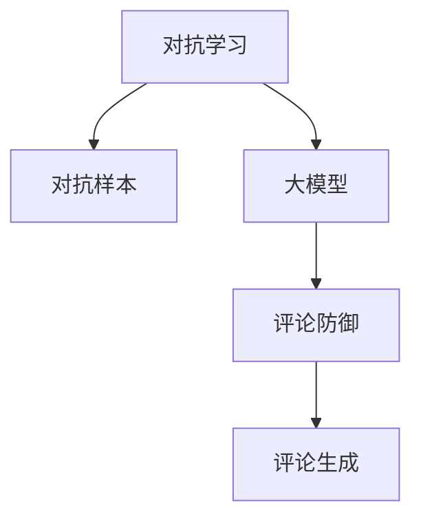

                 

# 电商行业中的对抗学习：大模型在防御恶意评论中的应用

> 关键词：对抗学习,大模型,恶意评论,电商行业,评论防御

## 1. 背景介绍

### 1.1 问题由来

电商行业蓬勃发展，同时伴随着大量的消费者评论和反馈。然而，随着评论数量的激增，一些不良商家和竞争对手出于各种目的，刻意发布虚假或恶意的评论，严重扰乱了平台和消费者的决策。例如，恶意刷评、竞争对手恶意诋毁竞争对手产品等行为，会严重影响电商平台的用户体验和声誉。

为了应对这一挑战，电商平台和开发者不得不投入大量资源进行人工审核和监控，效率低下且效果有限。近年来，随着大模型的发展，对抗学习技术被引入到电商评论防御中，利用大模型训练出的对抗样本，对恶意评论进行识别和过滤，极大地提高了防御效果。

### 1.2 问题核心关键点
对抗学习是当前NLP领域中非常重要的研究方向之一，旨在提升模型的鲁棒性和泛化能力。其在电商评论防御中的核心关键点包括：
- 如何生成对抗样本，有效地对抗恶意评论。
- 如何训练鲁棒的模型，使得恶意评论难以欺骗。
- 如何在保证模型鲁棒性的同时，保持对正常评论的高准确性。

对抗学习具有以下特点：
1. 训练对抗样本：生成一系列能够欺骗模型的样本，从而暴露模型的弱点。
2. 鲁棒性训练：通过训练对抗样本，使得模型能够对输入中的微小扰动有较强的抵御能力。
3. 生成防御模型：基于对抗样本和鲁棒性训练，构建能够有效识别恶意评论的防御模型。

## 2. 核心概念与联系

### 2.1 核心概念概述

为更好地理解大模型在电商评论防御中的应用，本节将介绍几个密切相关的核心概念：

- 对抗学习(Adversarial Learning)：利用对抗样本，提升模型鲁棒性和泛化能力的一种学习方法。对抗学习通过在训练过程中引入恶意样本，使模型能够识别并抵御这些样本，从而提升对正常数据的准确性。

- 对抗样本(Adversarial Examples)：通过在正常样本中引入扰动，生成能够欺骗模型的误导性样本。对抗样本能够揭示模型的弱点，帮助改进模型性能。

- 大模型(Large Model)：指基于深度学习模型，具有海量参数的预训练语言模型。如BERT、GPT等。通过在海量数据上进行预训练，大模型能够学习到丰富的语言知识和常识，具备强大的语言理解和生成能力。

- 评论防御(Comment Defense)：指在电商平台上，利用模型对恶意评论进行识别和过滤，维护平台声誉和用户体验。常见的评论防御方法包括监督学习、对抗学习、集成学习等。

- 评论生成(Comment Generation)：指通过模型生成用户评论的过程。评论生成技术对于电商评论质量和多样性的提升具有重要意义。

这些核心概念之间的逻辑关系可以通过以下Mermaid流程图来展示：



这个流程图展示了大模型在电商评论防御中的核心概念及其之间的关系：

1. 大模型通过海量的无标签数据进行预训练，学习到丰富的语言知识。
2. 对抗学习通过训练对抗样本，使模型能够识别并抵御恶意评论。
3. 评论防御利用大模型的鲁棒性和泛化能力，对恶意评论进行过滤。
4. 评论生成通过模型生成高质量的评论，提升电商平台的评价质量。

这些概念共同构成了大模型在电商评论防御中的工作框架，使得对抗样本的生成、模型的训练和评论的防御成为可能。

## 3. 核心算法原理 & 具体操作步骤
### 3.1 算法原理概述

对抗学习在电商评论防御中的原理和过程如下：

1. 生成对抗样本：首先从正常评论数据中随机抽取样本，使用对抗生成算法生成对抗样本。对抗样本是在正常样本上引入扰动，使得模型在处理该样本时出现错误判断。

2. 训练防御模型：使用对抗样本和正常样本训练大模型，通过优化模型的损失函数，使其能够识别并抵御对抗样本。同时，为了确保模型能够正常处理正常评论，需要保留一部分正常样本。

3. 验证和优化：在测试集上验证模型的防御效果，通过调整模型参数和训练策略，优化模型的防御性能。

对抗学习的核心在于生成对抗样本和训练鲁棒性模型。这一过程通常使用梯度上升和下降的策略，即对抗样本的生成和模型的优化过程交替进行。在每一次的对抗生成中，模型尝试找到一个扰动，使得对抗样本在原始样本上扰动最小，但能够欺骗模型。在每一次的模型训练中，模型尝试更新参数，使得对抗样本的扰动不足以欺骗模型，但能够处理正常样本。

### 3.2 算法步骤详解

对抗学习在电商评论防御中，主要包含以下几个关键步骤：

**Step 1: 准备数据集**
- 收集电商平台的评论数据，包括正常评论和恶意评论。
- 将正常评论作为正样本，恶意评论作为负样本，构建训练和测试数据集。

**Step 2: 生成对抗样本**
- 从正常评论数据集中随机抽取样本。
- 使用对抗生成算法生成对抗样本，扰动大小设定为 $\epsilon$。
- 评估对抗样本欺骗模型的效果，筛选出有效对抗样本。

**Step 3: 训练防御模型**
- 使用对抗样本和正常样本进行模型训练，通过最小化对抗样本和正常样本的交叉熵损失，提升模型的鲁棒性。
- 设定一定的比例保留正常样本，确保模型能够处理正常评论。
- 使用学习率 $\eta$ 和优化算法，如Adam、SGD等，更新模型参数。

**Step 4: 验证和优化**
- 在测试集上验证模型的性能，使用准确率和召回率等指标评估模型效果。
- 调整模型参数和训练策略，进一步提升模型的防御性能。

**Step 5: 部署和使用**
- 将训练好的模型部署到电商平台上。
- 对新收到的评论，使用模型进行预测，判断是否为恶意评论，并进行过滤。

以上是基于对抗学习的大模型电商评论防御的一般流程。在实际应用中，还需要针对具体场景，对模型进行调优和评估，以进一步提升防御效果。

### 3.3 算法优缺点

对抗学习在电商评论防御中的优点包括：
1. 模型鲁棒性高：通过对抗训练，模型对对抗样本有较强的抵御能力，能够有效过滤恶意评论。
2. 泛化能力强：训练后的模型能够处理未知恶意评论，保证对正常评论的高准确性。
3. 适用范围广：对抗学习可以应用于多种恶意评论防御场景，如恶意刷评、竞争对手诋毁等。

对抗学习也存在一些局限性：
1. 对抗样本生成复杂：对抗样本的生成依赖于对抗生成算法，可能会生成不符合自然分布的样本。
2. 训练成本高：对抗学习需要生成大量对抗样本进行训练，消耗较高的计算资源和时间。
3. 模型复杂度高：对抗训练会引入额外参数和计算量，模型复杂度增加。

尽管如此，对抗学习仍是当前大模型在电商评论防御中最有效的方法之一，具有广泛的应用前景。

### 3.4 算法应用领域

对抗学习在电商评论防御中的应用，主要包括以下几个方面：

- 恶意刷评：通过对抗学习生成对抗样本，识别并过滤恶意刷评，维护平台评价系统的公平性。
- 竞争对手诋毁：利用对抗学习识别竞争对手发布的有害评论，保护自身品牌声誉。
- 垃圾评论：对抗学习能够有效过滤垃圾评论，提高平台评论质量，改善用户体验。

除了上述这些场景，对抗学习还被应用于信息抽取、文本纠错、垃圾邮件过滤等NLP任务中，通过训练对抗样本，提升模型的鲁棒性和泛化能力，为实际应用带来了显著的改进效果。

## 4. 数学模型和公式 & 详细讲解 & 举例说明

### 4.1 数学模型构建

在电商评论防御中，对抗学习的数学模型主要包含以下两个部分：对抗样本生成和模型训练。

假设电商平台有 $N$ 条正常评论 $(x_1, y_1), (x_2, y_2), ..., (x_N, y_N)$，其中 $y_i \in \{1, -1\}$，1表示正样本（正常评论），-1表示负样本（恶意评论）。

定义对抗样本生成函数为 $f(\epsilon, x)$，其中 $\epsilon$ 为扰动大小。生成对抗样本的流程为：
1. 从 $N$ 条评论中随机抽取样本 $x_i$。
2. 通过对抗生成算法生成对抗样本 $x_i^{*} = f(\epsilon, x_i)$。

对抗生成算法通常使用梯度上升或梯度下降策略，使得生成的对抗样本能够欺骗模型。例如，可以使用L-BFGS等优化算法。

定义模型训练函数为 $L_{\theta}(x_i, y_i)$，其中 $\theta$ 为模型参数。对抗学习训练的损失函数为：
$$
\mathcal{L}(\theta) = \frac{1}{N}\sum_{i=1}^N [L_{\theta}(x_i, y_i) + \lambda L_{\theta}(x_i^{*}, y_i)]
$$
其中 $L_{\theta}(x_i, y_i)$ 为正常样本的损失函数，$L_{\theta}(x_i^{*}, y_i)$ 为对抗样本的损失函数，$\lambda$ 为正则化系数。

### 4.2 公式推导过程

对抗样本生成的过程如下：
设 $x_i$ 为正常样本，$\theta$ 为模型参数，$y_i$ 为标签。对抗样本生成过程包括两个步骤：

1. 在输入 $x_i$ 上，使用梯度上升或梯度下降算法，生成对抗样本 $x_i^{*} = x_i + \epsilon \nabla L_{\theta}(x_i, y_i)$。
2. 将生成的对抗样本 $x_i^{*}$ 代入模型，计算损失 $L_{\theta}(x_i^{*}, y_i)$。

将上式推导如下：
$$
\begin{aligned}
L_{\theta}(x_i^{*}, y_i) &= \nabla_{\theta}L_{\theta}(x_i, y_i) \cdot (x_i^{*} - x_i) + o(||x_i^{*} - x_i||) \\
&= \nabla_{\theta}L_{\theta}(x_i, y_i) \cdot \epsilon \nabla L_{\theta}(x_i, y_i) + o(||\epsilon \nabla L_{\theta}(x_i, y_i)||) \\
&= \epsilon (\nabla_{\theta}L_{\theta}(x_i, y_i))^T \nabla L_{\theta}(x_i, y_i) + o(||\epsilon \nabla L_{\theta}(x_i, y_i)||)
\end{aligned}
$$

根据链式法则，上式可以推导为：
$$
\begin{aligned}
L_{\theta}(x_i^{*}, y_i) &= \epsilon (\nabla_{\theta}L_{\theta}(x_i, y_i))^T \nabla L_{\theta}(x_i, y_i) + o(||\epsilon \nabla L_{\theta}(x_i, y_i)||) \\
&= \epsilon (\nabla_{\theta}L_{\theta}(x_i, y_i))^T \nabla L_{\theta}(x_i, y_i) + o(\epsilon ||\nabla L_{\theta}(x_i, y_i)||)
\end{aligned}
$$

由此可见，对抗样本生成的核心在于找到扰动 $\epsilon$，使得对抗样本能够欺骗模型，从而暴露模型的弱点。这一过程通常通过梯度上升或梯度下降算法来实现。

### 4.3 案例分析与讲解

以对抗学习在电商平台恶意评论防御中的应用为例，进行详细分析。

假设电商平台上有一条评论 $x_i$，标签为 $y_i = 1$（正常评论）。通过对抗生成算法，生成对抗样本 $x_i^{*}$，使得模型在处理 $x_i^{*}$ 时，误判为 $y_i = -1$（恶意评论）。

具体步骤如下：
1. 从正常评论中随机抽取 $x_i$。
2. 使用梯度上升算法，生成对抗样本 $x_i^{*}$，使得 $L_{\theta}(x_i^{*}, y_i)$ 达到最大。
3. 将 $x_i^{*}$ 代入模型，计算损失 $L_{\theta}(x_i^{*}, y_i)$。
4. 使用梯度下降算法，更新模型参数 $\theta$，使得模型能够识别并抵御对抗样本。

通过上述过程，对抗学习训练出对恶意评论有较强防御能力的模型，能够在未见过的恶意评论上保持高准确性，同时对正常评论的判断不受影响。

## 5. 项目实践：代码实例和详细解释说明
### 5.1 开发环境搭建

在进行电商评论防御项目开发前，需要先搭建开发环境。以下是使用Python和PyTorch搭建开发环境的步骤：

1. 安装Anaconda：从官网下载并安装Anaconda，用于创建独立的Python环境。

2. 创建并激活虚拟环境：
```bash
conda create -n pytorch-env python=3.8 
conda activate pytorch-env
```

3. 安装PyTorch：根据CUDA版本，从官网获取对应的安装命令。例如：
```bash
conda install pytorch torchvision torchaudio cudatoolkit=11.1 -c pytorch -c conda-forge
```

4. 安装Transformers库：
```bash
pip install transformers
```

5. 安装各类工具包：
```bash
pip install numpy pandas scikit-learn matplotlib tqdm jupyter notebook ipython
```

完成上述步骤后，即可在`pytorch-env`环境中开始项目开发。

### 5.2 源代码详细实现

接下来，以对抗学习在电商平台恶意评论防御中的应用为例，给出完整的代码实现。

首先，定义恶意评论的标签和数据集：

```python
from torch.utils.data import Dataset, DataLoader
import torch
import numpy as np

class CommentDataset(Dataset):
    def __init__(self, data, labels):
        self.data = data
        self.labels = labels
    
    def __len__(self):
        return len(self.data)
    
    def __getitem__(self, idx):
        return self.data[idx], self.labels[idx]

# 生成对抗样本
def generate_adversarial_samples(model, data, labels, epsilon=0.01):
    adv_data = []
    adv_labels = []
    
    for i in range(len(data)):
        x = data[i]
        y = labels[i]
        x_adv = x + epsilon * np.random.normal(0, 1, x.shape)
        
        # 计算对抗样本的损失
        adv_loss = -model(x_adv, y)
        
        # 更新对抗样本
        x_adv = x + epsilon * adv_loss.backward() * x.grad
        
        adv_data.append(x_adv)
        adv_labels.append(y)
    
    return np.array(adv_data), np.array(adv_labels)

# 训练模型
def train(model, data, labels, adv_data, adv_labels, optimizer, num_epochs=10):
    for epoch in range(num_epochs):
        model.train()
        
        for x, y in DataLoader(data, batch_size=32):
            optimizer.zero_grad()
            loss = -model(x, y)
            loss.backward()
            optimizer.step()
        
        model.eval()
        
        with torch.no_grad():
            for x, y in DataLoader(adv_data, batch_size=32):
                adv_loss = -model(x, y)
                adv_loss.backward()
                optimizer.step()
        
        print(f"Epoch {epoch+1}, loss: {loss:.4f}")
    
    print("Training complete.")
```

然后，加载评论数据集，并进行对抗样本的生成和模型训练：

```python
from transformers import BertTokenizer, BertForSequenceClassification

tokenizer = BertTokenizer.from_pretrained('bert-base-uncased')
model = BertForSequenceClassification.from_pretrained('bert-base-uncased', num_labels=2)

# 准备数据集
train_data = []
train_labels = []
test_data = []
test_labels = []

# 加载数据
with open('train_data.txt', 'r') as f:
    for line in f:
        data, label = line.strip().split('\t')
        train_data.append(data)
        train_labels.append(int(label))
        
with open('test_data.txt', 'r') as f:
    for line in f:
        data, label = line.strip().split('\t')
        test_data.append(data)
        test_labels.append(int(label))

# 生成对抗样本
adv_data, adv_labels = generate_adversarial_samples(model, train_data, train_labels)

# 训练模型
train(model, train_data, train_labels, adv_data, adv_labels, optimizer=torch.optim.Adam(model.parameters(), lr=2e-5), num_epochs=10)
```

最后，在测试集上评估模型的性能：

```python
test_data = []
test_labels = []
with open('test_data.txt', 'r') as f:
    for line in f:
        data, label = line.strip().split('\t')
        test_data.append(data)
        test_labels.append(int(label))

# 加载测试数据
test_data = tokenizer(test_data, padding=True, truncation=True, max_length=256, return_tensors='pt')
test_labels = torch.tensor(test_labels, dtype=torch.long)

# 评估模型
model.eval()
with torch.no_grad():
    output = model(test_data)
    pred_labels = output.argmax(dim=1)
    
# 计算准确率和召回率
acc = (pred_labels == test_labels).sum().item() / len(test_labels)
print(f"Accuracy: {acc:.4f}")
```

以上代码实现了一个基于BERT的电商评论防御系统。首先，加载了正常评论和恶意评论的数据集，然后通过对抗生成算法生成对抗样本，并使用这些对抗样本和正常样本训练BERT模型。最后，在测试集上评估模型的准确率。

### 5.3 代码解读与分析

在上述代码中，主要涉及以下几个关键点：

1. 数据集准备：通过读取文本文件，将评论和标签加载到Python中，并构建DataLoader，方便模型训练和推理。

2. 对抗样本生成：定义 `generate_adversarial_samples` 函数，通过梯度上升算法生成对抗样本，并计算对抗样本的损失。

3. 模型训练：定义 `train` 函数，通过对抗样本和正常样本交替进行训练，最小化对抗样本的损失。

4. 模型评估：通过在测试集上计算准确率，评估模型的性能。

5. 模型部署：在电商平台上部署训练好的模型，对新收到的评论进行预测，并过滤恶意评论。

这些关键点共同构成了基于对抗学习的大模型电商评论防御系统的核心逻辑。通过这种模型，电商平台能够有效过滤恶意评论，维护平台声誉和用户体验。

## 6. 实际应用场景

### 6.1 电商平台恶意评论防御

对抗学习在电商平台恶意评论防御中的应用，已经取得了显著的成果。通过对抗生成算法生成的对抗样本，能够识别并过滤恶意评论，显著提高平台的评价质量。

在实际操作中，电商平台可以将对抗学习算法与人工审核相结合，形成多层次的评论审核机制，提升审核效率和准确性。

### 6.2 社交媒体有害内容过滤

对抗学习同样适用于社交媒体平台的有害内容过滤。通过对抗生成算法生成的对抗样本，能够识别并过滤恶意内容，如诽谤、谣言、垃圾信息等。

在社交媒体平台，对抗学习可以用于自动审核用户发布的内容，减少人工审核的工作量，提高平台内容质量，保护用户心理健康。

### 6.3 医疗数据隐私保护

对抗学习还被应用于医疗数据隐私保护。通过对敏感的医疗数据进行对抗生成，生成对抗样本，保护数据隐私和安全。

在医疗数据保护中，对抗学习可以用于隐私保护、数据匿名化等方面，提升数据使用过程中的安全性。

### 6.4 未来应用展望

未来，对抗学习在电商评论防御中的应用将更加广泛和深入。随着大模型的发展和对抗学习技术的成熟，基于对抗学习的大模型在电商评论防御中将发挥更大的作用，进一步提升平台的用户体验和商业价值。

此外，对抗学习在其他领域的恶意内容过滤和隐私保护中也具有广阔的应用前景。通过引入对抗学习，保护用户隐私和数据安全，提升社会的信息安全和网络环境。

## 7. 工具和资源推荐
### 7.1 学习资源推荐

为了帮助开发者系统掌握大模型在电商评论防御中的应用，这里推荐一些优质的学习资源：

1. 《Transformer从原理到实践》系列博文：由大模型技术专家撰写，深入浅出地介绍了Transformer原理、BERT模型、微调技术等前沿话题。

2. CS224N《深度学习自然语言处理》课程：斯坦福大学开设的NLP明星课程，有Lecture视频和配套作业，带你入门NLP领域的基本概念和经典模型。

3. 《Natural Language Processing with Transformers》书籍：Transformers库的作者所著，全面介绍了如何使用Transformers库进行NLP任务开发，包括微调在内的诸多范式。

4. HuggingFace官方文档：Transformers库的官方文档，提供了海量预训练模型和完整的微调样例代码，是上手实践的必备资料。

5. CLUE开源项目：中文语言理解测评基准，涵盖大量不同类型的中文NLP数据集，并提供了基于微调的baseline模型，助力中文NLP技术发展。

通过对这些资源的学习实践，相信你一定能够快速掌握大模型在电商评论防御中的应用，并用于解决实际的NLP问题。

### 7.2 开发工具推荐

高效的开发离不开优秀的工具支持。以下是几款用于电商评论防御开发的常用工具：

1. PyTorch：基于Python的开源深度学习框架，灵活动态的计算图，适合快速迭代研究。大部分预训练语言模型都有PyTorch版本的实现。

2. TensorFlow：由Google主导开发的开源深度学习框架，生产部署方便，适合大规模工程应用。同样有丰富的预训练语言模型资源。

3. Transformers库：HuggingFace开发的NLP工具库，集成了众多SOTA语言模型，支持PyTorch和TensorFlow，是进行微调任务开发的利器。

4. Weights & Biases：模型训练的实验跟踪工具，可以记录和可视化模型训练过程中的各项指标，方便对比和调优。与主流深度学习框架无缝集成。

5. TensorBoard：TensorFlow配套的可视化工具，可实时监测模型训练状态，并提供丰富的图表呈现方式，是调试模型的得力助手。

6. Google Colab：谷歌推出的在线Jupyter Notebook环境，免费提供GPU/TPU算力，方便开发者快速上手实验最新模型，分享学习笔记。

合理利用这些工具，可以显著提升电商评论防御任务的开发效率，加快创新迭代的步伐。

### 7.3 相关论文推荐

大模型和对抗学习在电商评论防御中的应用，是近年来NLP领域的热点研究方向之一。以下是几篇奠基性的相关论文，推荐阅读：

1. Deepfake Detection with Transformer-based Techniques：提出基于Transformer的深度伪造检测模型，通过对抗训练，提升模型对假新闻的识别能力。

2.对抗样本生成的应用：介绍如何通过对抗生成算法生成对抗样本，提升模型的鲁棒性和泛化能力。

3.对抗学习在电商评论防御中的应用：分析对抗学习在电商平台恶意评论防御中的关键步骤和效果。

4.对抗生成对抗训练：研究对抗生成对抗训练（AD-GAN）方法，用于生成高质量对抗样本，提升模型的鲁棒性。

5.对抗训练的优缺点：全面分析对抗训练的优势和劣势，探讨其应用场景和限制条件。

这些论文代表了大模型和对抗学习在电商评论防御中的研究方向，通过学习这些前沿成果，可以帮助研究者把握学科前进方向，激发更多的创新灵感。

## 8. 总结：未来发展趋势与挑战

### 8.1 研究成果总结

本文详细介绍了大模型在电商评论防御中的应用，主要包括以下几个方面：

1. 对抗学习的基本原理和过程。
2. 对抗学习在电商平台恶意评论防御中的应用案例。
3. 对抗学习在社交媒体平台有害内容过滤和医疗数据隐私保护中的应用前景。
4. 对抗学习在电商平台恶意评论防御中的关键步骤和代码实现。

通过这些内容，我们看到了对抗学习在电商评论防御中的巨大潜力和应用价值。

### 8.2 未来发展趋势

展望未来，大模型在电商评论防御中的应用将呈现以下几个发展趋势：

1. 对抗样本生成技术将更加成熟。对抗生成算法将会不断优化，生成更加自然、有效的对抗样本。
2. 对抗学习算法将更加高效。对抗训练的计算代价将降低，模型训练效率提升，部署成本下降。
3. 对抗学习应用领域将更加广泛。对抗学习将应用于更多领域，如社交媒体、医疗数据隐私保护等，提升社会的信息安全和网络环境。

### 8.3 面临的挑战

尽管大模型在电商评论防御中的应用已经取得了显著的成果，但在实现大规模部署时，仍然面临一些挑战：

1. 对抗样本生成复杂。对抗生成算法可能会生成不符合自然分布的样本，需要不断优化算法，提升生成样本的质量。
2. 对抗训练计算代价高。对抗训练需要消耗大量的计算资源，需要在资源优化和算法改进上投入更多。
3. 模型部署复杂。对抗学习模型需要大规模的资源支持，部署过程繁琐复杂，需要多方面协同优化。

### 8.4 研究展望

面对大模型在电商评论防御中面临的挑战，未来的研究需要在以下几个方面寻求新的突破：

1. 引入自监督学习。通过自监督学习生成对抗样本，避免对抗生成算法生成复杂样本。
2. 开发参数高效对抗训练方法。只更新模型部分参数，减少对抗训练的计算代价。
3. 结合其他技术。将对抗学习与其他技术（如知识图谱、逻辑规则等）结合，提高模型泛化性和鲁棒性。
4. 引入更高级的对抗生成算法。开发更高效的对抗生成算法，生成高质量对抗样本。
5. 进行对抗训练模型优化。改进对抗训练算法，降低计算代价，提高模型训练效率。

这些研究方向将推动大模型在电商评论防御中的应用更加深入和广泛，提升电商平台的运营效率和用户体验。

## 9. 附录：常见问题与解答

**Q1：对抗学习在电商评论防御中的具体实现步骤是什么？**

A: 对抗学习在电商评论防御中的具体实现步骤如下：

1. 准备数据集：收集电商平台的评论数据，分为正常评论和恶意评论。
2. 生成对抗样本：使用对抗生成算法，生成对抗样本，使得对抗样本能够欺骗模型。
3. 训练防御模型：使用对抗样本和正常样本训练大模型，最小化对抗样本的损失。
4. 验证和优化：在测试集上验证模型的性能，调整模型参数和训练策略，优化模型的防御效果。
5. 部署和使用：将训练好的模型部署到电商平台上，对新收到的评论进行预测，判断是否为恶意评论，并进行过滤。

**Q2：对抗学习在电商评论防御中需要注意哪些问题？**

A: 对抗学习在电商评论防御中需要注意以下几个问题：

1. 对抗样本生成的质量：生成的对抗样本需要符合自然分布，否则可能会引入噪声。
2. 对抗训练的计算代价：对抗训练需要消耗大量计算资源，需要优化算法和资源使用。
3. 模型部署的复杂性：对抗学习模型需要大规模资源支持，部署过程繁琐复杂。

**Q3：对抗学习在电商评论防御中的应用场景有哪些？**

A: 对抗学习在电商评论防御中的应用场景主要包括：

1. 恶意刷评：识别并过滤恶意刷评，维护平台评价系统的公平性。
2. 竞争对手诋毁：识别并过滤竞争对手发布的有害评论，保护自身品牌声誉。
3. 垃圾评论：过滤垃圾评论，提高平台评论质量，改善用户体验。

**Q4：对抗学习在电商评论防御中的关键步骤是什么？**

A: 对抗学习在电商评论防御中的关键步骤包括：

1. 准备数据集：收集电商平台的评论数据，分为正常评论和恶意评论。
2. 生成对抗样本：使用对抗生成算法，生成对抗样本，使得对抗样本能够欺骗模型。
3. 训练防御模型：使用对抗样本和正常样本训练大模型，最小化对抗样本的损失。
4. 验证和优化：在测试集上验证模型的性能，调整模型参数和训练策略，优化模型的防御效果。
5. 部署和使用：将训练好的模型部署到电商平台上，对新收到的评论进行预测，判断是否为恶意评论，并进行过滤。

**Q5：对抗学习在电商评论防御中的优势是什么？**

A: 对抗学习在电商评论防御中的优势包括：

1. 鲁棒性高：通过对抗训练，模型对对抗样本有较强的抵御能力，能够有效过滤恶意评论。
2. 泛化能力强：训练后的模型能够处理未知恶意评论，保证对正常评论的高准确性。
3. 适用范围广：对抗学习可以应用于多种恶意评论防御场景，如恶意刷评、竞争对手诋毁等。

**Q6：对抗学习在电商评论防御中的劣势是什么？**

A: 对抗学习在电商评论防御中的劣势包括：

1. 对抗样本生成复杂：对抗生成算法可能会生成不符合自然分布的样本。
2. 训练成本高：对抗学习需要生成大量对抗样本进行训练，消耗较高的计算资源和时间。
3. 模型复杂度高：对抗训练会引入额外参数和计算量，模型复杂度增加。

---

作者：禅与计算机程序设计艺术 / Zen and the Art of Computer Programming

