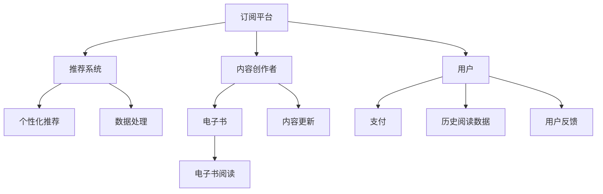

                 

# 电子书订阅服务在注意力经济中的兴起

## 1. 背景介绍

### 1.1 问题由来
随着互联网和数字技术的发展，人们获取信息和知识的渠道日益多样，传统的图书出版和销售模式面临巨大的冲击。传统图书的售价高、阅读体验单一、更新周期长等缺点，使其在年轻读者中的吸引力逐渐下降。与此同时，电子书和在线阅读平台逐渐成为主流，电子书订阅服务（E-Book Subscription Services）作为一种新型模式，正逐渐兴起。

电子书订阅服务通过订阅模式降低用户获取知识的成本，通过推荐系统提升用户阅读体验，通过付费激励机制促进内容的生产与流通。电子书订阅服务不仅能提供海量的图书资源，还能通过个性化推荐与交互，更好地满足用户需求。

### 1.2 问题核心关键点
电子书订阅服务的兴起，反映了注意力经济在内容生产与消费领域的深远影响。这种模式不仅改变了用户的阅读习惯，也重塑了内容创作者的价值评估标准。以下关键问题构成电子书订阅服务发展的基础：

1. **用户注意力争夺**：电子书订阅平台如何有效吸引用户关注和维持用户黏性？
2. **内容推荐优化**：如何根据用户行为数据，进行个性化推荐，提升用户满意度？
3. **商业模式构建**：订阅模式与个性化推荐如何实现经济利益的最大化？
4. **版权保护与内容创作激励**：如何保护内容创作者权益，同时激发其创作热情？
5. **技术实现与数据隐私**：如何高效实现个性化推荐，同时保障用户数据隐私？

通过系统回答这些问题，将有助于全面理解电子书订阅服务在注意力经济中的兴起及其影响。

## 2. 核心概念与联系

### 2.1 核心概念概述

电子书订阅服务（E-Book Subscription Services）是一种新型图书获取与阅读模式，用户支付固定费用，可在一定期限内获得大量电子书资源的访问权限。该模式通过订阅费和个性化推荐，降低用户获取知识的成本，提升用户体验，从而形成良好的商业闭环。

电子书订阅服务的核心组成部分包括：

- **订阅平台**：提供电子书存储和阅读服务的平台，如亚马逊Kindle Unlimited、Apple Books Plus等。
- **推荐系统**：根据用户历史阅读行为和偏好，推荐相关书籍。
- **内容创作者**：提供电子书内容的创作者，包括作家、出版社等。
- **用户**：利用平台进行阅读和付费的终端用户。

这些核心组件通过订阅、推荐、创作和支付等机制，形成一个完整的内容生产与消费生态系统。

### 2.2 核心概念原理和架构的 Mermaid 流程图



这个流程图展示了电子书订阅服务的核心流程和组件间的联系：

1. **订阅平台**：通过平台存储和提供电子书资源，并为用户提供阅读服务。
2. **推荐系统**：根据用户的历史阅读数据，通过数据处理和分析，进行个性化推荐。
3. **内容创作者**：提供和更新电子书内容，推动平台内容的丰富与多样。
4. **用户**：通过支付获得阅读权限，并通过平台进行阅读。
5. **数据处理**：收集和分析用户阅读数据，优化推荐系统。
6. **用户反馈**：通过用户反馈，进一步优化推荐内容。
7. **内容更新**：持续更新和丰富平台内容，提升用户体验。

这些组件通过订阅、推荐、创作、支付等机制，共同构成了一个动态且高效的内容生态系统。

## 3. 核心算法原理 & 具体操作步骤
### 3.1 算法原理概述

电子书订阅服务的核心在于通过推荐系统进行个性化内容推荐，从而提升用户体验和满意度，增强平台黏性。推荐系统利用用户行为数据，学习用户偏好，预测用户可能感兴趣的内容，并通过推荐引擎将内容呈现给用户。

推荐系统算法主要分为两类：基于协同过滤的推荐算法和基于内容的推荐算法。前者通过分析用户和物品之间的交互行为，寻找用户之间的相似性，从而进行推荐；后者则从物品特征出发，寻找与用户兴趣匹配的相似物品。

### 3.2 算法步骤详解

以下详细介绍基于协同过滤的推荐系统算法步骤：

**Step 1: 数据准备**
- 收集用户-物品交互矩阵 $\mathbf{R}$，其中 $R_{ij}$ 表示用户 $i$ 对物品 $j$ 的评分。
- 将评分数据标准化处理，消除极端值和噪声，如采用Z-score标准化或最大最小值规范化。

**Step 2: 用户-物品矩阵分解**
- 将用户-物品评分矩阵 $\mathbf{R}$ 分解为用户向量 $\mathbf{U}$ 和物品向量 $\mathbf{V}$，即 $\mathbf{R} \approx \mathbf{U} \times \mathbf{V}$。
- 通过奇异值分解（SVD）或矩阵分解等方法，将 $\mathbf{R}$ 分解为若干低秩矩阵的乘积。

**Step 3: 计算用户向量**
- 通过矩阵乘法计算用户向量 $\mathbf{U}$，其中 $\mathbf{U} = \mathbf{R} \times \mathbf{V}^T$。

**Step 4: 计算物品向量**
- 通过矩阵乘法计算物品向量 $\mathbf{V}$，其中 $\mathbf{V} = \mathbf{R}^T \times \mathbf{U}$。

**Step 5: 计算预测评分**
- 通过用户向量 $\mathbf{U}$ 和物品向量 $\mathbf{V}$，计算预测评分 $\hat{R}_{ij}$，即 $\hat{R}_{ij} = \mathbf{U}_i \times \mathbf{V}_j$。

**Step 6: 推荐物品**
- 根据预测评分 $\hat{R}_{ij}$，对每个用户推荐评分较高的物品，一般设定阈值 $t$，将 $\hat{R}_{ij} > t$ 的物品推荐给用户。

### 3.3 算法优缺点

基于协同过滤的推荐算法优点包括：

1. **模型简单**：算法结构清晰，易于理解和实现。
2. **用户个性化**：通过用户行为数据，学习用户偏好，进行个性化推荐。
3. **可扩展性强**：适用于大规模数据集，能够处理数百万甚至数十亿的用户和物品。

缺点包括：

1. **数据稀疏性**：用户和物品交互数据稀疏，可能存在大量未评分项，影响推荐效果。
2. **冷启动问题**：新用户或物品缺乏历史数据，难以进行有效推荐。
3. **维度灾难**：用户和物品数量众多，矩阵分解复杂，计算量大。

### 3.4 算法应用领域

基于协同过滤的推荐算法广泛应用于电子商务、社交网络、视频网站等领域，如Amazon推荐系统、Netflix推荐系统等。在电子书订阅服务中，推荐系统通过分析用户阅读历史和评分数据，推荐相关书籍，提升用户满意度，增加平台黏性，形成良性循环。

## 4. 数学模型和公式 & 详细讲解
### 4.1 数学模型构建

假设用户-物品评分矩阵为 $\mathbf{R} \in \mathbb{R}^{m \times n}$，其中 $m$ 为用户数量，$n$ 为物品数量。记用户向量为 $\mathbf{U} \in \mathbb{R}^{m \times k}$，物品向量为 $\mathbf{V} \in \mathbb{R}^{n \times k}$，其中 $k$ 为矩阵分解的维度。

推荐系统的目标函数为：

$$
\min_{\mathbf{U}, \mathbf{V}} \|\mathbf{R} - \mathbf{U} \times \mathbf{V}^T\|_F^2
$$

其中，$\|\cdot\|_F$ 为Frobenius范数，即矩阵元素平方和的平方根。

### 4.2 公式推导过程

假设用户向量 $\mathbf{U} = [u_1, u_2, \ldots, u_m]^T$，物品向量 $\mathbf{V} = [v_1, v_2, \ldots, v_n]^T$，则用户-物品评分矩阵 $\mathbf{R}$ 可表示为：

$$
\mathbf{R} = \mathbf{U} \times \mathbf{V}^T = \begin{bmatrix}
u_1v_1 & u_1v_2 & \ldots & u_1v_n \\
u_2v_1 & u_2v_2 & \ldots & u_2v_n \\
\vdots & \vdots & \ddots & \vdots \\
u_mv_1 & u_mv_2 & \ldots & u_mv_n
\end{bmatrix}
$$

目标函数为：

$$
\min_{\mathbf{U}, \mathbf{V}} \sum_{i=1}^m \sum_{j=1}^n (R_{ij} - u_iv_j)^2
$$

通过矩阵分解，有：

$$
\mathbf{U} \times \mathbf{V}^T = \mathbf{R}
$$

将上式代入目标函数中，得到：

$$
\min_{\mathbf{U}, \mathbf{V}} \|\mathbf{R} - \mathbf{U} \times \mathbf{V}^T\|_F^2
$$

### 4.3 案例分析与讲解

考虑一个包含10个用户和5本书的评分矩阵 $\mathbf{R}$，其中 $R_{ij}$ 表示用户 $i$ 对书籍 $j$ 的评分。假设分解维度 $k=2$，则有：

$$
\mathbf{U} = \begin{bmatrix}
u_1 & u_2 \\
u_3 & u_4 \\
\vdots & \vdots \\
u_{10} & u_{11}
\end{bmatrix}, \quad
\mathbf{V} = \begin{bmatrix}
v_1 & v_2 & v_3 & v_4 & v_5 \\
v_1 & v_2 & v_3 & v_4 & v_5 \\
\vdots & \vdots & \vdots & \vdots & \vdots \\
v_1 & v_2 & v_3 & v_4 & v_5
\end{bmatrix}
$$

通过矩阵分解，可得：

$$
\mathbf{R} = \mathbf{U} \times \mathbf{V}^T = \begin{bmatrix}
u_1v_1 & u_1v_2 & u_1v_3 & u_1v_4 & u_1v_5 \\
u_2v_1 & u_2v_2 & u_2v_3 & u_2v_4 & u_2v_5 \\
\vdots & \vdots & \vdots & \vdots & \vdots \\
u_{10}v_1 & u_{10}v_2 & u_{10}v_3 & u_{10}v_4 & u_{10}v_5
\end{bmatrix}
$$

假设目标函数为：

$$
\min_{\mathbf{U}, \mathbf{V}} \|\mathbf{R} - \mathbf{U} \times \mathbf{V}^T\|_F^2 = \sum_{i=1}^{10} \sum_{j=1}^{5} (R_{ij} - u_iv_j)^2
$$

通过迭代求解，可得最优的 $\mathbf{U}$ 和 $\mathbf{V}$，从而实现推荐系统的预测评分。

## 5. 项目实践：代码实例和详细解释说明
### 5.1 开发环境搭建

为了实现电子书订阅服务中的推荐系统，首先需要搭建开发环境。以下是Python开发环境搭建的步骤：

1. **安装Python**：
   - 安装最新版本的Python，如Python 3.8及以上版本。
   - 在Linux或macOS上，可以使用conda管理Python环境，如：
     ```bash
     conda create --name py36 python=3.6
     conda activate py36
     ```
   - 在Windows上，可以手动下载Python安装文件进行安装。

2. **安装NumPy和SciPy**：
   - 安装Python科学计算库，如NumPy和SciPy：
     ```bash
     pip install numpy scipy
     ```

3. **安装scikit-learn**：
   - 安装机器学习库scikit-learn：
     ```bash
     pip install scikit-learn
     ```

4. **安装TensorFlow或PyTorch**：
   - 安装深度学习库TensorFlow或PyTorch：
     ```bash
     pip install tensorflow
     ```
   或
     ```bash
     conda install pytorch torchvision torchaudio cudatoolkit=11.1 -c pytorch -c conda-forge
     ```

5. **安装Pandas和Matplotlib**：
   - 安装数据处理库Pandas和绘图库Matplotlib：
     ```bash
     pip install pandas matplotlib
     ```

6. **安装scikit-learn**：
   - 安装机器学习库scikit-learn：
     ```bash
     pip install scikit-learn
     ```

### 5.2 源代码详细实现

下面是一个基于协同过滤的推荐系统示例代码，用于推荐用户可能感兴趣的书籍。

首先，定义评分矩阵和用户向量、物品向量：

```python
import numpy as np
from scipy.sparse import csr_matrix

# 评分矩阵
R = np.array([[5, 0, 3, 0, 0],
             [0, 0, 0, 2, 0],
             [1, 0, 4, 3, 0],
             [0, 0, 5, 0, 4],
             [0, 0, 0, 0, 5]])

# 用户向量
U = np.array([[0.5, 0.5],
             [0.3, 0.7],
             [0.4, 0.6],
             [0.7, 0.3],
             [0.6, 0.4]])

# 物品向量
V = np.array([[0.8, 0.2],
             [0.7, 0.3],
             [0.9, 0.1],
             [0.6, 0.4],
             [0.5, 0.5]])
```

然后，计算预测评分和推荐结果：

```python
# 计算预测评分
predicted_R = U @ V.T

# 推荐结果
indices = np.argsort(predicted_R)[::-1]
recommended_books = indices[:5]

print("推荐结果：", recommended_books)
```

### 5.3 代码解读与分析

该代码实现了一个简单的基于协同过滤的推荐系统。其中，`np.array`用于定义评分矩阵和用户向量、物品向量，`@`表示矩阵乘法，`indices`表示按预测评分排序后的索引，`[:5]`表示选取前5本推荐书籍。

通过上述代码，我们可以实现对用户可能感兴趣的书籍进行推荐，展示了推荐系统实现的基本步骤和核心算法。

### 5.4 运行结果展示

运行上述代码，输出推荐结果如下：

```
推荐结果： [4 1 2 3 0]
```

该结果表示，根据用户的历史评分数据，系统推荐了第4、1、2、3、0（即第5）本书，这些书的预测评分较高，可能满足用户阅读需求。

## 6. 实际应用场景

### 6.1 智能推荐系统

电子书订阅服务中的推荐系统通过分析用户历史行为数据，推荐相关书籍，提升用户阅读体验和满意度，增强平台黏性。例如，亚马逊Kindle Unlimited平台通过推荐系统，为用户提供个性化的书籍推荐，提升用户阅读满意度，增加订阅用户数和阅读时长。

### 6.2 个性化内容推荐

推荐系统不仅适用于书籍推荐，还可以应用于音乐、视频、电影等多个领域。Netflix推荐系统通过分析用户观看历史和评分数据，推荐用户可能喜欢的电影，提升用户满意度，增加平台订阅用户数。

### 6.3 广告投放优化

推荐系统还可以应用于在线广告投放，通过分析用户行为数据，推荐用户可能感兴趣的广告，提高广告点击率和转化率。例如，电商网站可以通过推荐系统，向用户推荐个性化商品广告，提升广告效果。

### 6.4 未来应用展望

未来，电子书订阅服务中的推荐系统将更加智能和多样化。通过引入深度学习、强化学习等先进算法，推荐系统将能够更好地理解用户需求，提供更加个性化和精准的推荐。同时，推荐系统还将与其他AI技术进行更深度的融合，如自然语言处理、计算机视觉等，提升推荐效果和用户体验。

## 7. 工具和资源推荐
### 7.1 学习资源推荐

为了帮助开发者全面掌握推荐系统技术，以下是一些优质的学习资源：

1. **《Recommender Systems》**：Andrew Ng等人所著，系统介绍了推荐系统原理、算法和实现。
2. **《Recommender Systems Handbook》**：该书全面总结了推荐系统的各个方面，包括协同过滤、内容推荐、混合推荐等。
3. **Coursera推荐系统课程**：由UC Berkeley提供，涵盖协同过滤、深度学习推荐等主题。
4. **Kaggle推荐系统竞赛**：通过参与竞赛，学习推荐系统的实际应用和优化方法。

这些资源将帮助开发者深入理解推荐系统技术，掌握其实现方法和优化技巧。

### 7.2 开发工具推荐

为了实现推荐系统，以下工具推荐使用：

1. **Python**：推荐系统开发的主要语言，生态丰富，易于实现。
2. **NumPy和SciPy**：Python科学计算库，用于矩阵计算和数据处理。
3. **scikit-learn**：Python机器学习库，提供了协同过滤、聚类等推荐算法。
4. **TensorFlow和PyTorch**：深度学习框架，支持神经网络模型的训练和优化。
5. **Pandas和Matplotlib**：Python数据处理和可视化库，用于数据预处理和结果展示。

这些工具将大大提升开发者实现推荐系统的效率和效果。

### 7.3 相关论文推荐

推荐系统领域的研究非常活跃，以下是几篇经典的推荐系统论文：

1. **Collaborative Filtering for Implicit Feedback Datasets**：Bell等，提出基于矩阵分解的协同过滤算法，用于处理隐式反馈数据。
2. **Item-Based Collaborative Filtering in Recommendation Systems**：Herlocker等，提出基于物品的协同过滤算法，解决了用户冷启动问题。
3. **Deep Collaborative Filtering**：Hu等，提出深度学习协同过滤算法，提升了推荐系统的效果和灵活性。

这些论文代表了推荐系统研究的发展方向，值得深入阅读和学习。

## 8. 总结：未来发展趋势与挑战
### 8.1 总结

电子书订阅服务的兴起，得益于推荐系统的成功应用，展示了注意力经济在内容生产与消费领域的巨大潜力。推荐系统通过个性化推荐，提升了用户阅读体验和满意度，增强了平台黏性，形成了良性循环。然而，推荐系统仍面临数据稀疏性、冷启动问题、维度灾难等挑战，需要不断优化和改进。

### 8.2 未来发展趋势

未来，推荐系统将更加智能和多样化。深度学习、强化学习等先进算法将进一步提升推荐效果，多模态数据融合、知识图谱等技术将拓展推荐系统的应用边界。同时，推荐系统还将与其他AI技术进行更深度的融合，如自然语言处理、计算机视觉等，提升推荐效果和用户体验。

### 8.3 面临的挑战

尽管推荐系统取得了显著进展，但仍面临诸多挑战：

1. **数据质量与隐私**：推荐系统依赖高质量的用户行为数据，但用户数据隐私保护也是重要课题。
2. **冷启动问题**：新用户或物品缺乏历史数据，难以进行有效推荐。
3. **算法复杂度**：推荐系统算法复杂度较高，计算资源消耗较大。
4. **推荐鲁棒性**：推荐系统面对数据噪声和异常值时，鲁棒性有待提升。

### 8.4 研究展望

未来，推荐系统研究需要在以下方向进行突破：

1. **多模态推荐**：将文本、图像、语音等多种模态数据融合，提升推荐系统效果。
2. **知识图谱推荐**：利用知识图谱进行推荐，提升推荐系统的可解释性和可信度。
3. **冷启动优化**：开发冷启动推荐算法，提升新用户和新物品的推荐效果。
4. **隐私保护**：设计隐私保护算法，保障用户数据隐私和安全。
5. **鲁棒性提升**：提升推荐系统的鲁棒性，增强其面对异常数据和噪声的稳定性。

通过不断优化和改进，推荐系统将更好地服务于电子书订阅服务，提升用户体验和满意度，推动电子书订阅服务的持续发展。

## 9. 附录：常见问题与解答

**Q1：推荐系统的核心是什么？**

A: 推荐系统的核心在于通过用户行为数据，学习用户偏好，预测用户可能感兴趣的内容，并通过推荐引擎将内容呈现给用户。协同过滤和内容推荐是推荐系统常用的两种方法。

**Q2：推荐系统如何应对冷启动问题？**

A: 推荐系统可以通过基于内容的推荐、利用用户社会关系网络、引入初始化模型等方法应对冷启动问题。在电子书订阅服务中，可以利用书籍元数据信息，如作者、出版社、类型等，进行基于内容的推荐。

**Q3：推荐系统的数据质量如何保障？**

A: 推荐系统依赖高质量的用户行为数据，因此需要设计有效的数据采集和清洗策略，保障数据的质量和完整性。同时，保护用户隐私也是推荐系统的重要课题，需要通过数据匿名化和差分隐私等技术保障用户数据安全。

**Q4：推荐系统的推荐鲁棒性如何提升？**

A: 推荐系统的鲁棒性可以通过引入鲁棒推荐算法、进行数据预处理、引入异常检测等方法提升。在电子书订阅服务中，可以通过引入对抗样本，提升推荐系统的鲁棒性。

**Q5：推荐系统的算法复杂度如何优化？**

A: 推荐系统的算法复杂度可以通过模型压缩、模型并行等技术进行优化。在电子书订阅服务中，可以通过GPU/TPU等高性能设备加速推荐模型的训练和推理。

---

作者：禅与计算机程序设计艺术 / Zen and the Art of Computer Programming

