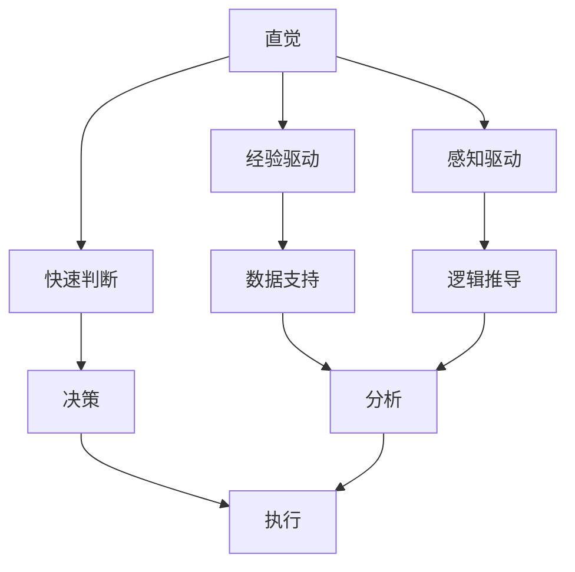

                 

# 直觉vs分析：两种思维模式的博弈

在复杂多变的IT领域中，直觉与分析这两种思维模式扮演着不同的角色，推动着技术的进步和创新。本文将深入探讨这两种思维模式的特点、优势、局限性以及它们在实际应用中的博弈与融合。

## 1. 背景介绍

### 1.1 问题由来
在软件开发、算法设计、项目管理等领域，直觉与分析这两种思维方式频繁出现。直觉往往基于经验和直觉，快速作出决策；分析则基于数据和逻辑，逐步推导出结论。这两种思维方式的博弈，关系到决策的科学性和有效性，影响着产品的成功与否。

### 1.2 问题核心关键点
直觉与分析的核心区别在于决策方式的不同：
- **直觉**：基于经验、直觉和感知，快速作出判断，适合处理复杂且多变的问题，但可能导致失误。
- **分析**：依赖数据、逻辑和推理，逐步推导，适合处理结构化且可量化的问题，但可能导致决策迟缓。

本文将重点探讨如何通过合理的思维模式切换，实现直觉与分析的有效结合，提高决策的科学性和准确性。

## 2. 核心概念与联系

### 2.1 核心概念概述

为了更好地理解直觉与分析的博弈，我们首先需要定义一些核心概念：

- **直觉**：基于个人经验、直觉和感知，快速作出判断和决策。
- **分析**：依赖数据、逻辑和推理，逐步推导结论。
- **决策过程**：根据问题特性和决策者特点，选择合适的思维方式，进行决策。

这些核心概念之间的逻辑关系可以通过以下Mermaid流程图来展示：



这个流程图展示了直觉与分析的基本工作流程：

1. 直觉通过经验和感知快速判断问题，提供初步决策。
2. 分析通过数据和逻辑推导，逐步验证和优化初步决策。
3. 最终，直觉与分析的结合为问题提供更为科学和准确的解决方案。

## 3. 核心算法原理 & 具体操作步骤

### 3.1 算法原理概述

直觉与分析的博弈，本质上是一个决策过程的优化问题。决策者需要在直觉和分析之间找到平衡，既要快速响应变化，又要确保决策的科学性。

形式化地，假设问题 $P$ 存在两种可能的决策 $D_1$ 和 $D_2$，其中 $D_1$ 基于直觉，$D_2$ 基于分析。决策的质量由两个指标衡量：快速性和准确性，分别用 $R$ 和 $A$ 表示。我们的目标是找到一个决策路径 $P$，使得 $P$ 在 $R$ 和 $A$ 上的综合评分最高。

### 3.2 算法步骤详解

基于上述决策框架，直觉与分析的博弈过程可以分为以下几个关键步骤：

**Step 1: 问题定义**
- 明确问题 $P$ 的具体目标和需求。
- 根据问题特点，确定直觉和分析的权重，设定快速性和准确性的评估标准。

**Step 2: 直觉判断**
- 根据问题特性和个人经验，快速作出直觉判断 $D_1$。
- 记录直觉判断的过程和依据，便于后续验证和分析。

**Step 3: 数据分析**
- 收集相关数据，进行初步分析和验证。
- 使用统计方法、机器学习模型等工具，对数据进行深入分析。
- 在分析过程中，不断调整直觉判断，优化决策。

**Step 4: 决策验证**
- 使用模拟实验、小规模测试等手段，验证直觉判断和分析结果的准确性。
- 根据验证结果，调整直觉和分析的权重，优化决策路径。
- 在验证过程中，确保数据的质量和多样性，避免数据偏差。

**Step 5: 综合决策**
- 将直觉判断和分析结果综合考虑，作出最终决策 $D$。
- 记录综合决策的过程和依据，形成决策文档。

通过以上步骤，直觉与分析的博弈过程可以系统化地进行，确保决策的科学性和有效性。

### 3.3 算法优缺点

基于直觉与分析的博弈方法具有以下优点：
1. 快速响应变化。直觉判断能够快速处理复杂且多变的问题，适应性强。
2. 科学性保障。分析过程通过数据和逻辑推导，确保决策的科学性和准确性。
3. 综合优化。将直觉和分析结合，兼顾快速性和准确性，提升决策效果。

同时，该方法也存在一定的局限性：
1. 依赖数据质量。数据分析的效果很大程度上取决于数据的完整性和质量，数据偏差可能导致错误决策。
2. 可能产生过度依赖。过度依赖分析可能导致决策迟缓，失去快速响应的优势。
3. 直觉的局限性。直觉判断易受个人情绪、经验的影响，可能导致误判。

尽管存在这些局限性，但就目前而言，直觉与分析的博弈方法仍是最主流且有效的决策方式。未来相关研究的重点在于如何进一步降低数据分析对直觉的依赖，提高直觉的科学性和可控性，同时兼顾快速性和准确性。

### 3.4 算法应用领域

直觉与分析的博弈方法在多个领域都有广泛的应用：

- **软件开发**：在敏捷开发过程中，快速迭代和数据分析的结合，帮助团队快速响应需求变化。
- **算法设计**：在机器学习模型选择和参数调优时，通过直觉和数据分析，提升模型性能。
- **项目管理**：在项目进度和风险管理中，结合直觉和数据分析，实现资源最优配置。
- **产品运营**：在用户行为分析和市场推广时，通过直觉和数据分析，制定科学有效的策略。
- **市场营销**：在广告投放和用户获取时，利用直觉和数据分析，优化投放效果。

此外，在医疗、金融、教育等众多领域，直觉与分析的博弈方法也有着广泛的应用前景。通过合理切换和结合直觉与分析，可以在不同场景下提升决策的科学性和有效性，推动技术创新和产业发展。

## 4. 数学模型和公式 & 详细讲解 & 举例说明

### 4.1 数学模型构建

为了更加严格地描述直觉与分析的博弈过程，我们可以使用数学语言进行建模。

设问题 $P$ 存在两种可能的决策 $D_1$ 和 $D_2$，其中 $D_1$ 基于直觉，$D_2$ 基于分析。决策的质量由两个指标衡量：快速性 $R$ 和准确性 $A$。假设 $R$ 和 $A$ 均取值在 $[0,1]$ 之间，且 $R$ 和 $A$ 之间存在相关性 $\rho$。

目标函数为最大化综合评分 $Z$：

$$
Z = \lambda R + (1-\lambda) A
$$

其中 $\lambda$ 为直觉判断的权重，$1-\lambda$ 为分析判断的权重。$\lambda$ 的取值应在 $[0,1]$ 之间，根据问题特点和决策者的偏好进行调整。

### 4.2 公式推导过程

根据目标函数 $Z$，可以定义最优决策的判断条件：

$$
Z = \max\limits_{D_1, D_2} (\lambda R + (1-\lambda) A)
$$

将 $R$ 和 $A$ 代入公式，得到：

$$
\max\limits_{D_1, D_2} (\lambda R + (1-\lambda) A)
$$

通过求解上述优化问题，可以确定最优的决策路径 $P$。

### 4.3 案例分析与讲解

假设问题 $P$ 是一个市场推广活动，需要决定广告投放的策略 $D_1$ 或 $D_2$。直觉判断 $D_1$ 基于市场经验和直觉，分析判断 $D_2$ 基于数据分析和逻辑推导。

设直觉判断的快速性为 $R_1=0.9$，准确性为 $A_1=0.7$；分析判断的快速性为 $R_2=0.6$，准确性为 $A_2=0.95$。假设 $\lambda=0.6$。

代入公式，计算综合评分 $Z$：

$$
Z = 0.6 \times 0.9 + 0.4 \times 0.95 = 0.85
$$

因此，选择 $D_2$ 基于分析判断，可以获得更高的综合评分。

## 5. 项目实践：代码实例和详细解释说明

### 5.1 开发环境搭建

在进行直觉与分析的博弈实践前，我们需要准备好开发环境。以下是使用Python进行Pandas开发的环境配置流程：

1. 安装Anaconda：从官网下载并安装Anaconda，用于创建独立的Python环境。

2. 创建并激活虚拟环境：
```bash
conda create -n pandas-env python=3.8 
conda activate pandas-env
```

3. 安装Pandas：使用pip安装Pandas库：
```bash
pip install pandas
```

4. 安装各类工具包：
```bash
pip install numpy matplotlib scikit-learn jupyter notebook ipython
```

完成上述步骤后，即可在`pandas-env`环境中开始博弈实践。

### 5.2 源代码详细实现

下面以市场推广活动决策为例，给出使用Pandas库进行直觉与分析博弈的PyTorch代码实现。

首先，定义决策的快速性和准确性：

```python
import pandas as pd

# 定义决策的快速性和准确性
intuition = pd.DataFrame({
    'R': [0.9],
    'A': [0.7]
})
analysis = pd.DataFrame({
    'R': [0.6],
    'A': [0.95]
})
```

然后，定义目标函数和最优决策判断条件：

```python
# 定义目标函数
lambda_value = 0.6
target_function = lambda_value * intuition['R'] + (1 - lambda_value) * analysis['A']

# 判断最优决策
best_decision = target_function.max()
best_decision_index = target_function.idxmax()
```

最后，输出最优决策和综合评分：

```python
# 输出最优决策和综合评分
print(f"最优决策：{best_decision_index}")
print(f"综合评分：{best_decision}")
```

以上就是使用Pandas库对直觉与分析博弈过程的完整代码实现。可以看到，Pandas库通过数据表的形式，方便地表达了决策的快速性和准确性，并给出了最优决策的判断条件。

### 5.3 代码解读与分析

让我们再详细解读一下关键代码的实现细节：

**Pandas库的DataFrame类**：
- `pd.DataFrame`方法：创建数据表，用于存储决策的快速性和准确性。
- `index`属性：用于指定数据表索引，方便通过索引获取最优决策。

**目标函数的计算**：
- 通过 `lambda_value` 和决策的快速性和准确性，计算综合评分 $Z$。
- 使用 `max` 和 `idxmax` 方法，判断最优决策。

**综合评分的输出**：
- 使用 `print` 函数，将最优决策和综合评分输出到控制台。

可以看出，Pandas库使得决策过程的表达和计算变得简洁高效。通过数据表的形式，开发者可以将直觉和分析的不同维度清晰地表示出来，并进行综合评估。

当然，在工业级的系统实现中，还需要考虑更多因素，如决策的可视化展示、决策过程的日志记录、决策结果的自动生成等。但核心的博弈范式基本与此类似。

## 6. 实际应用场景

### 6.1 智能客服系统

在智能客服系统中，直觉与分析的博弈可以应用于客户问题处理和知识库更新。客服系统通常通过自然语言处理(NLP)技术，自动分析用户输入，生成问题类别。但用户输入往往复杂多变，NLP技术的理解能力有限，因此需要结合客服经验，进行快速判断和处理。

在实际应用中，可以结合客服人员的历史处理记录，使用数据分析方法，自动更新知识库。同时，当系统无法准确处理时，客服人员可以通过直觉判断，快速提供解决方案，并更新系统知识库，提升系统的智能水平。

### 6.2 金融舆情监测

在金融舆情监测中，直觉与分析的博弈可以应用于情感分析和异常检测。金融舆情往往涉及大量的非结构化数据，如新闻、评论、社交媒体等。情感分析需要快速判断舆情情绪，异常检测需要识别舆情波动。

在实际应用中，可以使用数据分析方法，自动分析舆情情绪和波动趋势。但数据分析过程可能存在数据偏差，因此需要结合分析师的经验，进行快速判断和验证。同时，根据情感分析和异常检测的结果，及时调整舆情监测策略，提升系统的及时性和准确性。

### 6.3 个性化推荐系统

在个性化推荐系统中，直觉与分析的博弈可以应用于用户行为分析和推荐算法优化。推荐系统通常依赖用户的历史行为数据进行推荐，但用户的兴趣和行为往往复杂多变，需要快速作出决策。

在实际应用中，可以使用数据分析方法，自动分析用户的行为模式和兴趣点。但数据分析过程可能存在数据偏差，因此需要结合推荐工程师的经验，进行快速判断和优化。同时，根据用户行为分析和推荐算法的结果，及时调整推荐策略，提升系统的推荐效果。

### 6.4 未来应用展望

随着直觉与分析博弈方法的不断发展，它在更多领域将得到应用，为技术创新和产业发展提供新的动力。

在智慧医疗领域，直觉与分析的博弈可以应用于临床决策和诊断辅助。医疗数据往往涉及敏感信息，需要快速判断和处理，结合医生的经验，提升诊断准确性和治疗效果。

在智能教育领域，直觉与分析的博弈可以应用于学生评估和教学优化。学生评估需要快速判断学习效果，教学优化需要识别教学问题。结合教师的经验，提升评估的科学性和教学的有效性。

在智慧城市治理中，直觉与分析的博弈可以应用于应急响应和资源分配。城市应急响应需要快速判断和决策，资源分配需要优化资源利用效率。结合应急管理者的经验，提升应急响应的及时性和资源分配的合理性。

此外，在企业生产、社会治理、文娱传媒等众多领域，直觉与分析的博弈方法也将不断涌现，为经济社会发展注入新的活力。相信随着技术的日益成熟，博弈方法将成为决策科学化和智能化的重要手段，推动人工智能技术向更广阔的领域加速渗透。

## 7. 工具和资源推荐

### 7.1 学习资源推荐

为了帮助开发者系统掌握直觉与分析的博弈理论基础和实践技巧，这里推荐一些优质的学习资源：

1. 《决策科学导论》书籍：全面介绍了决策理论的基本概念和方法，包括直觉与分析的博弈模型。

2. 《数据分析实战》课程：由数据科学家开设的在线课程，讲解数据分析的基本方法和实际应用，有助于理解直觉与分析的博弈。

3. 《Python数据分析入门》书籍：介绍Python数据分析的基本工具和技术，适合初学者和进阶者。

4. HuggingFace官方文档：介绍自然语言处理库HuggingFace的使用方法，涵盖数据分析和博弈模型。

5. Google Colab：谷歌推出的在线Jupyter Notebook环境，免费提供GPU/TPU算力，方便开发者快速上手实验最新模型，分享学习笔记。

通过对这些资源的学习实践，相信你一定能够快速掌握直觉与分析的博弈精髓，并用于解决实际的决策问题。

### 7.2 开发工具推荐

高效的开发离不开优秀的工具支持。以下是几款用于直觉与分析博弈开发的常用工具：

1. Python：作为一种通用的编程语言，Python拥有丰富的科学计算和数据分析库，是进行博弈模型开发的基础。

2. Pandas：用于数据处理和分析的强大库，支持数据表操作、数据清洗等常用功能。

3. NumPy：用于科学计算和数值分析的基础库，提供高效的数组操作和数学函数。

4. Scikit-learn：用于机器学习和数据分析的库，提供丰富的算法和工具。

5. Matplotlib：用于数据可视化的库，支持多种图表类型。

6. Jupyter Notebook：支持交互式编程和数据可视化的工具，适合进行博弈模型的实践和演示。

合理利用这些工具，可以显著提升直觉与分析博弈任务的开发效率，加快创新迭代的步伐。

### 7.3 相关论文推荐

直觉与分析的博弈方法源于学界的持续研究。以下是几篇奠基性的相关论文，推荐阅读：

1. "Analyzing the Decision Process" by Howard Raiffa and Robert Shlaifer：介绍了决策理论的基本概念和方法，强调了直觉与分析的博弈模型。

2. "Data Mining for Statistical Learning" by Trevor Hastie, Robert Tibshirani and Jerome Friedman：介绍了数据挖掘和统计学习的技术，涵盖了数据分析和博弈模型的应用。

3. "Algorithmic Trading: Winning Strategies and Their Rationale" by Ernest R. Chan：介绍了算法交易的方法和策略，强调了直觉与分析的博弈在金融领域的应用。

4. "Machine Learning Yearning" by Andrew Ng：介绍了机器学习的实践技巧，包括数据分析和博弈模型的优化。

5. "Adaptive Decision Making" by Peter J. Fleming：介绍了自适应决策方法，强调了博弈模型的实际应用和优化。

这些论文代表了大博弈理论的发展脉络。通过学习这些前沿成果，可以帮助研究者把握学科前进方向，激发更多的创新灵感。

## 8. 总结：未来发展趋势与挑战

### 8.1 总结

本文对直觉与分析的博弈方法进行了全面系统的介绍。首先阐述了直觉与分析的博弈过程，明确了决策方式的选择标准。其次，从原理到实践，详细讲解了直觉与分析博弈的过程和步骤，给出了博弈任务开发的完整代码实例。同时，本文还广泛探讨了博弈方法在多个行业领域的应用前景，展示了博弈范式的巨大潜力。此外，本文精选了博弈方法的各类学习资源，力求为读者提供全方位的技术指引。

通过本文的系统梳理，可以看到，直觉与分析的博弈方法在复杂多变的决策过程中，能够提供科学性和有效性的保障，提升决策的准确性和及时性。通过合理切换和结合直觉与分析，可以在不同场景下提升决策的科学性和有效性，推动技术创新和产业发展。

### 8.2 未来发展趋势

展望未来，直觉与分析的博弈方法将呈现以下几个发展趋势：

1. 数据驱动决策。随着大数据和AI技术的发展，数据的获取和处理能力将大幅提升，决策过程将更多依赖数据分析和算法优化。

2. 智能决策支持。借助AI技术，决策过程将变得更加智能化，决策支持系统将能够自动分析数据，提供决策建议。

3. 跨领域应用。直觉与分析的博弈方法将在更多领域得到应用，如医疗、金融、教育等，提升各个领域的决策科学性和效率。

4. 用户参与决策。通过用户反馈和参与，决策过程将更加透明和可控，提升决策的民主化和公正性。

5. 持续优化决策。借助AI技术和数据积累，决策过程将不断优化，提升决策的准确性和时效性。

以上趋势凸显了直觉与分析博弈方法的广泛应用前景。这些方向的探索发展，必将进一步提升决策的科学性和有效性，推动人工智能技术向更广阔的领域加速渗透。

### 8.3 面临的挑战

尽管直觉与分析的博弈方法已经取得了显著成就，但在迈向更加智能化、普适化应用的过程中，它仍面临着诸多挑战：

1. 数据质量和多样性。博弈过程依赖数据的质量和多样性，数据偏差可能导致错误决策。如何提高数据质量和多样性，是一个重要挑战。

2. 决策透明性。博弈过程中，数据和算法的选择、参数的调整等环节往往缺乏透明度，可能导致决策的可解释性不足。如何提高博弈过程的透明性，增强决策的可解释性，是需要重点解决的问题。

3. 算法公平性和偏见。博弈过程中，算法的选择和优化可能导致决策偏见和公平性问题。如何设计公平、无偏见的博弈模型，是一个重要研究方向。

4. 实时性和资源限制。博弈过程需要高效计算和存储，数据量和计算复杂度往往较高。如何降低计算成本，提升实时性，是另一个重要挑战。

5. 人机协同。博弈过程需要人机协同，如何设计高效的人机交互界面，增强人机协同的效率和效果，是一个重要研究方向。

以上挑战凸显了博弈方法在实际应用中的复杂性和挑战性，需要通过不断的技术进步和优化，才能实现更加科学、可靠、高效的决策过程。

### 8.4 研究展望

面对博弈方法面临的挑战，未来的研究需要在以下几个方面寻求新的突破：

1. 数据增强和数据清洗。通过数据增强和数据清洗技术，提升博弈模型的数据质量和多样性，减少数据偏差。

2. 算法透明性和可解释性。通过算法透明性和可解释性技术，提升博弈模型的透明性和可解释性，增强决策的公正性和可信度。

3. 公平博弈模型。设计公平、无偏见的博弈模型，减少决策中的偏见和公平性问题，提升决策的公平性和公正性。

4. 高效计算和存储。通过高效计算和存储技术，降低博弈模型的计算成本，提升实时性和资源利用效率。

5. 人机协同优化。通过人机协同优化技术，设计高效的人机交互界面，增强人机协同的效率和效果。

这些研究方向的研究进展，将进一步提升博弈方法的科学性和可靠性，推动博弈方法在各个领域的广泛应用。

## 9. 附录：常见问题与解答

**Q1：直觉与分析的博弈方法适用于所有决策场景吗？**

A: 直觉与分析的博弈方法在大多数决策场景下都能取得不错的效果，特别是在数据量较小、问题复杂多变的场景中。但对于一些结构化且可量化的决策场景，过度依赖数据分析可能导致决策迟缓，无法快速响应变化。此时需要结合直觉和分析，综合决策。

**Q2：如何平衡直觉与分析的博弈方法中的快速性和准确性？**

A: 平衡直觉与分析的博弈方法中的快速性和准确性，需要根据问题特点和决策者的偏好进行调整。一般建议从快速决策入手，使用直觉判断初步作出决策，再通过数据分析验证和优化决策。在数据分析过程中，不断调整直觉和分析的权重，确保决策的科学性和准确性。

**Q3：直觉与分析的博弈方法在实际应用中需要注意哪些问题？**

A: 在实际应用中，直觉与分析的博弈方法需要注意以下问题：
1. 数据质量：确保数据的完整性和多样性，避免数据偏差。
2. 决策透明性：提高博弈过程的透明性，增强决策的可解释性。
3. 公平性：设计公平、无偏见的博弈模型，减少决策偏见。
4. 实时性：优化计算和存储，降低博弈模型的计算成本，提升实时性。
5. 人机协同：设计高效的人机交互界面，增强人机协同的效率和效果。

通过合理处理这些问题，可以最大限度地发挥直觉与分析博弈方法的潜力，提升决策的科学性和有效性。

**Q4：如何设计高效的人机协同博弈模型？**

A: 设计高效的人机协同博弈模型，需要考虑以下几个关键因素：
1. 界面设计：设计直观、易用的界面，方便人机交互。
2. 反馈机制：设计反馈机制，及时将博弈结果和决策建议展示给决策者，便于决策者作出决策。
3. 知识库：构建知识库，存储经验、规则和专家知识，辅助决策。
4. 动态更新：根据决策结果和用户反馈，动态更新模型参数和知识库，提升决策效果。
5. 用户培训：对决策者进行培训，提高其使用博弈模型的能力和水平。

通过合理设计人机协同博弈模型，可以提升博弈过程的效率和效果，增强决策的科学性和可靠性。

---

作者：禅与计算机程序设计艺术 / Zen and the Art of Computer Programming

