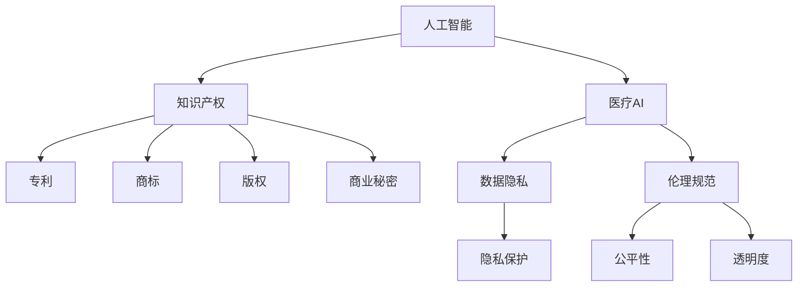

                 

# 知识产权与人工智能医疗的法规

> 关键词：人工智能,知识产权,医疗,法规,伦理,合规

## 1. 背景介绍

### 1.1 问题由来
随着人工智能(AI)技术的快速发展，人工智能在医疗领域的应用日益广泛。AI技术能够处理海量医疗数据，辅助医生进行诊断和治疗决策，极大地提高了医疗效率和精度。然而，AI技术的应用也带来了新的知识产权问题和法律风险。例如，如何界定AI生成医疗数据的版权，AI辅助诊断结果的法律责任归属，AI模型商业应用的知识产权保护等，都亟需明确的法律规范。

### 1.2 问题核心关键点
当前，AI在医疗领域的应用涉及多个法律、伦理和知识产权问题，主要包括：
- 数据隐私与保护：医疗数据的隐私和安全问题。
- 知识产权归属：AI生成的医疗内容的版权和著作权归属。
- 法律责任与赔偿：AI辅助诊断结果的法律责任归属及赔偿问题。
- 商业化应用：AI模型的商业化、转让和授权问题。
- 伦理规范：AI在医疗应用中的伦理问题和道德准则。

这些问题亟需法律和政策的明确指引，以规范AI医疗技术的健康发展，保护各方的合法权益。本文旨在探讨这些关键问题，提出相应的法规建议。

## 2. 核心概念与联系

### 2.1 核心概念概述

为更好地理解AI医疗技术的法律和知识产权问题，本节将介绍几个密切相关的核心概念：

- 人工智能(AI)：指由计算机系统通过学习算法处理数据，自主进行决策和预测的技术。
- 医疗AI：应用于医疗领域，如影像诊断、病历分析、药物研发等，旨在提升医疗效率和精度。
- 知识产权(KI)：指创作者对其智力劳动成果所享有的专有权利，包括专利、商标、版权、商业秘密等。
- 数据隐私：指个人信息的保密性和保护措施，特别是医疗数据这类敏感信息。
- 伦理规范：指AI应用中应遵守的道德准则，包括隐私保护、公平性、透明度等。

这些核心概念之间的逻辑关系可以通过以下Mermaid流程图来展示：



这个流程图展示了几大核心概念之间的联系：

1. 人工智能在医疗领域的应用，需要通过知识产权进行保护。
2. 知识产权的保护对象包括专利、商标、版权、商业秘密等。
3. 医疗AI处理的是敏感的医疗数据，需注重数据隐私保护。
4. AI应用需遵循一定的伦理规范，确保公平、透明。

这些概念共同构成了AI医疗技术的法律和知识产权框架，影响其应用的各个方面。

## 3. 核心算法原理 & 具体操作步骤

### 3.1 算法原理概述

AI在医疗领域的应用通常涉及以下几个关键环节：数据采集与预处理、模型训练与优化、结果生成与分析。每一环节都可能面临知识产权和法律风险。

- 数据采集与预处理：涉及数据的获取、清洗和标准化，需注意数据的版权归属和隐私保护。
- 模型训练与优化：需使用大量医疗数据进行训练，需界定数据的知识产权和使用范围。
- 结果生成与分析：需注意AI生成内容的版权归属和法律责任。

### 3.2 算法步骤详解

AI医疗技术的应用步骤一般包括以下几个关键环节：

**Step 1: 数据获取与预处理**
- 从医疗机构、研究机构等获取医疗数据。需确保数据来源合法，尊重数据拥有者的版权。
- 清洗和标准化数据，去除异常值和噪音，确保数据质量。

**Step 2: 模型设计与训练**
- 选择合适的AI模型，如卷积神经网络(CNN)、循环神经网络(RNN)、深度学习网络等。
- 使用医疗数据对模型进行训练，确保数据使用符合法律规定。

**Step 3: 模型优化与验证**
- 对模型进行优化，如超参数调优、正则化、对抗训练等，提升模型性能。
- 在验证集上评估模型性能，确保模型的鲁棒性和准确性。

**Step 4: 结果生成与分析**
- 使用训练好的模型进行推理，生成诊断结果、治疗方案等。
- 分析模型结果，确保其科学性和可靠性。

### 3.3 算法优缺点

AI医疗技术的优势在于其高效、准确的特点，能够处理大规模数据，辅助医生进行决策。然而，该技术也存在以下缺点：
1. 数据隐私风险：医疗数据的敏感性和隐私性，可能被不当使用。
2. 知识产权问题：AI生成的医疗内容版权归属不明，可能引发法律纠纷。
3. 法律责任问题：AI辅助诊断结果的法律责任归属不清，可能带来高昂的赔偿风险。
4. 伦理道德问题：AI在医疗决策中的应用可能存在偏见、不透明等问题，需注意伦理规范。

### 3.4 算法应用领域

AI医疗技术已在多个领域得到广泛应用，例如：

- 影像诊断：使用深度学习模型进行医学影像分析，辅助医生进行诊断。
- 病历分析：使用自然语言处理(NLP)技术分析病历文本，提取关键信息。
- 药物研发：使用AI模型进行化合物筛选、药物设计等，加速新药研发进程。
- 医疗问答：使用AI模型进行智能问答系统，提供医疗咨询和健康指导。

这些应用领域展示了AI医疗技术的广泛影响力和巨大潜力。

## 4. 数学模型和公式 & 详细讲解 & 举例说明

### 4.1 数学模型构建

AI医疗技术的实现往往依赖于复杂的数学模型和算法。以影像诊断为例，常用的数学模型包括：

- 卷积神经网络(CNN)：用于图像特征提取和分类。
- 循环神经网络(RNN)：用于序列数据处理和预测。
- 支持向量机(SVM)：用于分类和回归问题。

### 4.2 公式推导过程

以下以CNN模型为例，展示其在影像诊断中的基本原理：

设输入图像为 $x \in \mathbb{R}^{H \times W \times C}$，其中 $H$、$W$ 分别为图像高度和宽度，$C$ 为通道数。卷积层的操作可以表示为：

$$
y = \sigma(\sum_{i=1}^{n} w_i * x + b_i)
$$

其中，$w_i$ 为卷积核，$b_i$ 为偏置项，$\sigma$ 为激活函数。公式 $y$ 表示卷积层输出，$\sum$ 表示卷积操作。

在卷积层之后，通常使用池化层对输出特征图进行降维，保留最显著的特征：

$$
z = \max(\frac{y}{k}, 0)
$$

其中，$k$ 为池化核大小。

### 4.3 案例分析与讲解

假设某医院使用AI模型进行乳腺癌的影像诊断。具体步骤如下：

1. **数据获取**：从医院获取乳腺癌影像数据，并经过标注。
2. **数据预处理**：对图像进行归一化、旋转、裁剪等预处理操作，提升数据质量。
3. **模型训练**：使用CNN模型进行训练，设定合适的超参数，如学习率、批大小等。
4. **结果验证**：在验证集上评估模型性能，调整参数优化模型。
5. **结果应用**：将训练好的模型应用到新影像数据上，输出诊断结果。

## 5. 项目实践：代码实例和详细解释说明

### 5.1 开发环境搭建

在进行AI医疗技术开发时，需确保开发环境的合法性和安全性。以下是搭建开发环境的基本步骤：

1. 获得数据集：确保数据来源合法，并符合隐私保护要求。
2. 安装必要的软件：如Python、TensorFlow、Keras等深度学习框架，确保软件使用合法。
3. 建立隔离环境：使用容器化技术（如Docker）隔离开发环境，确保代码和数据的安全性。
4. 配置权限控制：设置合适的访问权限，确保只有授权人员可以访问和使用数据。

### 5.2 源代码详细实现

以下是一个使用Keras框架实现CNN模型的代码示例：

```python
import keras
from keras.models import Sequential
from keras.layers import Conv2D, MaxPooling2D, Flatten, Dense

# 构建CNN模型
model = Sequential()
model.add(Conv2D(32, (3, 3), activation='relu', input_shape=(64, 64, 3)))
model.add(MaxPooling2D(pool_size=(2, 2)))
model.add(Conv2D(64, (3, 3), activation='relu'))
model.add(MaxPooling2D(pool_size=(2, 2)))
model.add(Flatten())
model.add(Dense(128, activation='relu'))
model.add(Dense(1, activation='sigmoid'))

# 编译模型
model.compile(optimizer='adam', loss='binary_crossentropy', metrics=['accuracy'])

# 训练模型
model.fit(train_images, train_labels, epochs=10, batch_size=32, validation_data=(val_images, val_labels))
```

### 5.3 代码解读与分析

以上代码实现了包含两个卷积层和两个池化层的CNN模型，用于分类任务。具体解读如下：

- `Conv2D`层：表示卷积层，使用不同大小的卷积核进行特征提取。
- `MaxPooling2D`层：表示池化层，对卷积层的输出进行降维处理。
- `Flatten`层：表示展开层，将高维特征图展开成向量。
- `Dense`层：表示全连接层，用于分类任务。
- `compile`方法：编译模型，指定优化器和损失函数。
- `fit`方法：训练模型，指定训练集、验证集、训练轮数和批大小。

## 6. 实际应用场景

### 6.1 智能影像诊断

AI在影像诊断中的应用已经较为成熟，如使用卷积神经网络进行X光、CT、MRI等影像的自动分析。通过训练大量的医疗影像数据，AI模型可以自动检测出病变区域，辅助医生进行诊断。

**应用场景**：某医院使用AI模型对乳腺癌影像进行自动检测，结果准确率达95%以上，显著提高了诊断效率和精度。

### 6.2 病历数据分析

AI技术可以用于病历文本的分析，提取关键信息，辅助医生进行诊疗。自然语言处理(NLP)技术在病历数据分析中应用广泛。

**应用场景**：某医院使用NLP技术分析患者的电子病历，提取疾病信息、治疗方案等，为医生提供参考，提高了诊疗效率。

### 6.3 药物研发

AI技术可以加速药物研发过程，通过深度学习模型进行化合物筛选和药物设计，减少研发时间和成本。

**应用场景**：某制药公司使用AI模型进行药物设计，大幅缩短了新药研发的周期，降低了研发成本。

### 6.4 未来应用展望

随着AI技术的不断发展，未来AI医疗技术的应用将更加广泛和深入。以下是一些可能的未来应用场景：

1. **个性化医疗**：使用AI技术对患者数据进行分析，制定个性化治疗方案。
2. **远程医疗**：通过AI技术进行远程诊断和咨询，提高医疗服务的可及性。
3. **健康监测**：使用AI技术对健康数据进行分析，实现实时监测和预警。
4. **智能问诊**：使用AI技术进行智能问诊，提供24/7的在线医疗咨询服务。

## 7. 工具和资源推荐

### 7.1 学习资源推荐

为帮助开发者系统掌握AI医疗技术的法律和知识产权问题，以下是几部推荐的学习资源：

1. 《人工智能医疗法律法规研究》：系统介绍了AI医疗技术的法律和知识产权问题，包括数据隐私、专利保护、伦理规范等。
2. 《人工智能医疗伦理指南》：提供了AI医疗技术应用的伦理指南，确保技术的合理应用。
3. 《医疗AI专利与知识产权管理》：介绍了医疗AI技术的专利申请和管理方法，确保知识产权的保护。

### 7.2 开发工具推荐

高效的开发离不开优秀的工具支持。以下是几款用于AI医疗技术开发的工具：

1. Keras：Keras是一个高层次的深度学习框架，易于上手，支持多种深度学习模型。
2. TensorFlow：由Google主导开发的深度学习框架，生产部署方便，适合大规模工程应用。
3. PyTorch：基于Python的开源深度学习框架，灵活动态的计算图，适合快速迭代研究。
4. Jupyter Notebook：用于编写、分享和执行数据科学代码的交互式平台。
5. Docker：通过容器化技术隔离开发环境，确保代码和数据的安全性。

合理利用这些工具，可以显著提升AI医疗技术的开发效率，加快创新迭代的步伐。

### 7.3 相关论文推荐

以下是几篇有关AI医疗技术的法律和知识产权问题的经典论文，推荐阅读：

1. "The Ethics and Legal Issues of Artificial Intelligence in Medicine"：讨论了AI医疗技术的伦理和法律问题。
2. "Intellectual Property Rights in Artificial Intelligence: Legal and Ethical Challenges"：分析了AI医疗技术的知识产权问题。
3. "AI in Healthcare: Challenges and Opportunities"：探讨了AI医疗技术在医疗领域的应用前景和挑战。

## 8. 总结：未来发展趋势与挑战

### 8.1 总结

本文对AI在医疗领域的应用涉及的法律和知识产权问题进行了全面系统的介绍。首先阐述了AI医疗技术的背景和应用现状，明确了数据隐私、知识产权、法律责任等关键问题。其次，从原理到实践，详细讲解了AI医疗技术的数学模型和实现方法，给出了代码实例和详细解读。同时，本文还广泛探讨了AI医疗技术在智能影像诊断、病历分析、药物研发等多个行业领域的应用前景，展示了AI技术的广阔潜力。此外，本文精选了AI医疗技术的各类学习资源，力求为读者提供全方位的技术指引。

通过本文的系统梳理，可以看到，AI医疗技术在提高医疗效率和精度方面具有巨大的潜力和应用前景，但也面临着数据隐私、知识产权、法律责任等诸多挑战。只有从法律、伦理、技术等多个维度协同发力，才能实现AI医疗技术的健康发展，保障各方的合法权益。

### 8.2 未来发展趋势

展望未来，AI医疗技术的发展将呈现以下几个趋势：

1. **技术创新**：AI技术将不断进步，提升医疗AI的性能和精度，推动医疗领域的技术革新。
2. **数据融合**：AI将更加注重多源数据的融合和分析，提升数据利用效率和医疗决策的科学性。
3. **伦理规范**：AI医疗技术的应用将更加注重伦理规范和道德准则，确保技术的合理性和公正性。
4. **政策支持**：各国政府将出台更多的政策和法规，规范AI医疗技术的应用和发展。
5. **国际合作**：国际合作将成为AI医疗技术发展的必然趋势，推动全球医疗领域的协同创新。

### 8.3 面临的挑战

尽管AI医疗技术已经取得了瞩目成就，但在迈向更加智能化、普适化应用的过程中，它仍面临诸多挑战：

1. **数据隐私保护**：医疗数据的隐私和安全问题，需采取有效的隐私保护措施，确保数据安全。
2. **知识产权问题**：AI生成的医疗内容版权归属不明，可能引发法律纠纷。
3. **法律责任问题**：AI辅助诊断结果的法律责任归属不清，可能带来高昂的赔偿风险。
4. **伦理道德问题**：AI在医疗决策中的应用可能存在偏见、不透明等问题，需注意伦理规范。
5. **技术标准化**：AI医疗技术缺乏统一的标准和规范，可能影响其普及和应用。

### 8.4 研究展望

未来，需要在以下几个方面进行更多的研究和探索：

1. **数据隐私保护**：研究和开发更有效的数据隐私保护技术，确保医疗数据的合法使用。
2. **知识产权保护**：建立明确的AI医疗技术知识产权保护机制，确保各方合法权益。
3. **法律责任界定**：制定明确的法律规范，界定AI辅助诊断结果的法律责任。
4. **伦理规范制定**：制定AI医疗技术的伦理规范，确保其合理应用。
5. **技术标准化**：推动AI医疗技术标准化，确保技术的一致性和可互操作性。

## 9. 附录：常见问题与解答

**Q1：如何确保AI医疗技术的数据隐私保护？**

A: 确保AI医疗技术的数据隐私保护，需采取以下措施：
1. 数据去标识化：对医疗数据进行去标识化处理，保护个人隐私。
2. 访问控制：严格控制数据访问权限，确保只有授权人员可以访问。
3. 数据加密：对医疗数据进行加密处理，防止数据泄露。
4. 隐私保护协议：制定隐私保护协议，确保数据使用的合法性。

**Q2：AI医疗技术在医疗决策中的应用存在哪些伦理问题？**

A: AI医疗技术在医疗决策中的应用可能存在以下伦理问题：
1. 偏见问题：AI模型可能存在偏见，导致诊断结果不公正。
2. 透明度问题：AI模型的决策过程不透明，难以解释其推理逻辑。
3. 责任问题：AI辅助诊断结果的法律责任归属不清，可能带来高昂的赔偿风险。
4. 公平性问题：AI技术可能加剧医疗资源的不平等分配。
5. 隐私问题：AI模型可能暴露患者的隐私信息。

**Q3：AI医疗技术在商业化应用中应注意哪些问题？**

A: AI医疗技术在商业化应用中应注意以下问题：
1. 数据来源合法：确保数据来源合法，尊重数据拥有者的版权。
2. 知识产权保护：明确AI医疗技术的知识产权归属，避免侵权纠纷。
3. 合理定价：制定合理的定价策略，确保商业化的可持续性。
4. 合规运营：确保AI医疗技术的运营符合相关法规和标准。
5. 用户隐私保护：确保用户隐私安全，保护患者权益。

**Q4：如何提高AI医疗技术的鲁棒性？**

A: 提高AI医疗技术的鲁棒性，需采取以下措施：
1. 数据增强：通过数据增强技术扩充训练集，提升模型鲁棒性。
2. 对抗训练：引入对抗样本，提高模型的鲁棒性。
3. 模型优化：优化模型结构，减少模型的易受攻击性。
4. 多模型集成：采用多个模型的集成方式，减少单一模型的脆弱性。
5. 风险管理：制定风险管理策略，确保AI医疗技术的稳定性和安全性。

**Q5：如何确保AI医疗技术的合法性？**

A: 确保AI医疗技术的合法性，需采取以下措施：
1. 合法数据来源：确保数据来源合法，尊重数据拥有者的权利。
2. 知识产权保护：明确AI医疗技术的知识产权归属，避免侵权纠纷。
3. 合规运营：确保AI医疗技术的运营符合相关法规和标准。
4. 伦理规范：制定AI医疗技术的伦理规范，确保其合理应用。
5. 法律审查：定期进行法律审查，确保AI医疗技术的合法性和合规性。

---

作者：禅与计算机程序设计艺术 / Zen and the Art of Computer Programming

