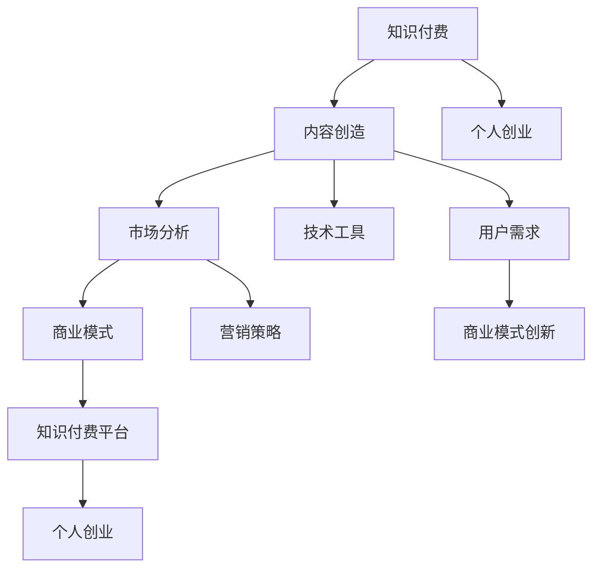

                 

# 知识付费与个人创业的结合点探索

> 关键词：知识付费, 个人创业, 内容创造, 市场分析, 商业模式, 技术工具, 用户需求, 营销策略, 商业模式创新

## 1. 背景介绍

### 1.1 问题由来
随着互联网的普及和智能手机的普及，知识付费逐渐成为一种主流的消费方式。人们越来越愿意为获取知识和信息而付费。这一现象不仅催生了大量的知识付费平台，如得到、喜马拉雅、知乎等，还涌现出一批有影响力的内容创作者，如吴军、李笑来、罗辑思维等。然而，尽管知识付费市场规模不断扩大，个人创业的难度和风险也随之增加。在这种情况下，如何找到知识付费与个人创业的结合点，成为了摆在面前的一个重要问题。

### 1.2 问题核心关键点
知识付费与个人创业的结合点在于如何将知识创作者和内容生产者与创业公司或个人有机结合，创造出商业价值和社会价值。具体而言，包括以下几个关键点：

1. 内容质量与市场需求匹配度：知识创作者必须生产符合市场和用户需求的高质量内容，才能吸引用户付费。
2. 商业模式设计：创业公司需要设计出有竞争力的商业模式，确保内容创作者和用户都能从中获益。
3. 技术支持与平台运营：知识付费平台需要提供稳定可靠的技术支持和运营服务，保证用户和内容创作者的使用体验。
4. 市场推广与用户转化：创业公司需要通过有效的市场推广和用户转化策略，扩大用户规模，提升用户黏性。

### 1.3 问题研究意义
探索知识付费与个人创业的结合点，对于推动知识付费市场的健康发展、促进内容创作者与市场有效对接、以及激发创业活力具有重要意义：

1. 推动知识付费市场健康发展：通过将优秀的知识创作者与市场对接，提高内容质量，吸引更多用户参与知识付费，促进市场规模扩大。
2. 促进内容创作者与市场有效对接：帮助内容创作者找到与市场匹配的机会，提升其商业价值和社会影响力。
3. 激发创业活力：为创业者提供有竞争力的商业模式和技术平台，降低创业门槛，提升创业成功率。

## 2. 核心概念与联系

### 2.1 核心概念概述

为更好地理解知识付费与个人创业的结合点，本节将介绍几个密切相关的核心概念：

- **知识付费**：指用户为获取有价值知识而支付的费用。包括订阅、单次购买、会员制等多种形式。
- **个人创业**：指个人利用自己的技能和资源，创办小型企业或独立工作室，以实现商业目标和自我价值。
- **内容创造**：指创作者生产符合市场和用户需求的有价值内容，包括文章、视频、音频等多种形式。
- **市场分析**：指对目标市场的分析，包括用户需求、竞争对手、市场趋势等。
- **商业模式**：指创业公司如何通过内容创造与市场对接，实现盈利。
- **技术工具**：指支持内容创作和平台运营的技术平台，如微信公众号、知乎、得到等。
- **用户需求**：指用户对知识内容和付费形式的需求，如知识深度、更新频率、互动性等。
- **营销策略**：指创业公司如何通过营销手段推广产品和服务，吸引用户。
- **商业模式创新**：指创业者如何通过创新商业模式，提升商业价值和社会价值。

这些核心概念之间的逻辑关系可以通过以下Mermaid流程图来展示：



这个流程图展示的知识付费与个人创业的核心概念及其之间的关系：

1. 知识付费依赖于高质量的内容创造。
2. 个人创业以内容创造为核心竞争力，利用市场分析和商业模式设计，结合技术工具和营销策略，最终实现商业价值。
3. 内容创造和市场分析相互促进，共同满足用户需求。
4. 商业模式创新是创业公司成功的关键，通过优化商业模式，实现盈利和可持续发展。

这些概念共同构成了知识付费与个人创业的结合点，推动双方相互促进，共同发展。

## 3. 核心算法原理 & 具体操作步骤
### 3.1 算法原理概述

知识付费与个人创业的结合点在于内容创作者与市场有效对接，实现商业化运作。其核心思想是：通过知识创作者的高质量内容，吸引和留住用户，再通过商业模式创新，实现盈利。

形式化地，假设内容创作者集合为 $C$，用户集合为 $U$，知识付费平台为 $P$，商业模式为 $M$，则结合点探索的过程可以表示为：

$$
M = \mathop{\arg\max}_{M} \sum_{c \in C} \sum_{u \in U} P(u, c) \times M(c, u)
$$

其中 $P(u, c)$ 表示用户 $u$ 对内容创作者 $c$ 的内容支付的费用，$M(c, u)$ 表示创作者 $c$ 在用户 $u$ 处的商业模式收益。目标是最小化总成本，最大化商业模式收益。

### 3.2 算法步骤详解

知识付费与个人创业的结合点探索主要包括以下几个关键步骤：

**Step 1: 识别内容创作者**

- 识别具备高水平内容创作能力的个人或团队。通常通过查看其公开作品、用户评价、专业背景等，筛选出潜在的创作者。

**Step 2: 市场分析与用户需求调研**

- 分析目标市场的用户需求，了解用户对知识内容深度、更新频率、互动性等方面的期望。
- 调研竞争对手，了解他们的商业模式、优势和劣势，寻找差异化的市场切入点。

**Step 3: 设计商业模式**

- 结合内容创作者的优势和市场需求，设计出有竞争力的商业模式。包括但不限于订阅制、单次付费、会员制、按需支付等多种形式。

**Step 4: 技术平台选择与搭建**

- 选择合适的技术平台，如微信公众号、知乎、得到等，搭建内容发布和用户互动的环境。
- 设计用户界面和体验，保证内容创作的流畅性和用户互动的便捷性。

**Step 5: 内容创作与推广**

- 内容创作者在技术平台上发布高质量内容，通过SEO、社交媒体、广告等多种手段进行推广。
- 跟踪用户反馈和行为数据，优化内容质量和推广策略。

**Step 6: 用户转化与运营**

- 通过优惠券、免费试用、内容组合等方式，吸引用户转化。
- 设计用户运营策略，如会员权益、积分系统、社群管理等，提高用户黏性和复购率。

**Step 7: 商业模式评估与优化**

- 定期评估商业模式的收益和成本，及时调整优化策略。
- 收集用户反馈和市场数据，进行商业模式创新，提升商业价值。

以上是知识付费与个人创业结合点的系统流程。在实际应用中，还需要针对具体内容和平台特点，进行优化和调整，以达到最优效果。

### 3.3 算法优缺点

知识付费与个人创业结合点探索的优势在于：

1. 降低创业门槛：通过内容创作者与市场对接，减少对资源的依赖，降低创业门槛。
2. 提升内容质量：创作者能够快速反馈用户需求，不断优化内容质量，提升用户满意度。
3. 增强市场竞争力：通过差异化的商业模式设计，获得竞争优势，吸引更多用户。
4. 提升商业模式价值：结合技术平台和用户需求，实现商业模式的持续优化和创新。

其缺点主要包括：

1. 市场风险：内容创作者与市场需求匹配度不高，可能导致用户流失和商业模式失败。
2. 技术挑战：技术平台的选择和搭建需要较高专业技能，初期投入成本较高。
3. 用户需求多样：用户需求多样，内容创作者需要不断适应和调整，面临较大的灵活性要求。

尽管存在这些缺点，但整体而言，知识付费与个人创业的结合点探索仍是大势所趋，具有广阔的市场前景。

### 3.4 算法应用领域

知识付费与个人创业结合点探索的应用领域广泛，包括但不限于以下几个方面：

1. **教育培训**：通过知识创作者与市场对接，提供高水平的专业课程，吸引学生付费。
2. **健康养生**：提供健康饮食、运动指导等内容，吸引用户付费订阅。
3. **职业技能**：提供职业培训、技能提升等内容，吸引职场人士付费学习。
4. **心理辅导**：提供心理疏导、情感支持等内容，吸引用户付费咨询。
5. **文化娱乐**：提供文化科普、影视解读等内容，吸引用户付费观看。

除了以上领域，随着知识付费市场的不断扩展，结合点探索还将渗透到更多新兴行业，推动各行各业的数字化转型。

## 4. 数学模型和公式 & 详细讲解  
### 4.1 数学模型构建

知识付费与个人创业结合点的数学模型可以抽象为以下形式：

- **用户支付意愿**：假设用户对内容 $c$ 的支付意愿为 $p_c$，表示用户愿意为内容支付的费用。
- **内容质量**：假设内容 $c$ 的质量为 $q_c$，表示内容对用户的吸引力。
- **商业模式收益**：假设商业模式 $M$ 对内容 $c$ 的收益为 $r_c$，表示创作者通过商业模式获得的收入。
- **市场需求**：假设市场对内容的需求为 $d$，表示市场上需要这类内容的用户数量。

结合点的目标是最大化商业模式收益，可以表示为：

$$
\max_{M} \sum_{c \in C} p_c \times r_c
$$

其中，$r_c = M(q_c, d)$，表示商业模式收益与内容质量、市场需求的关系。

### 4.2 公式推导过程

以下我们以知识付费平台的用户订阅制为例，推导商业模式的收益函数。

假设平台提供 $n$ 种内容，每种内容的质量为 $q_i$，市场对第 $i$ 种内容的需求为 $d_i$。用户对第 $i$ 种内容的支付意愿为 $p_i$。平台采用单次订阅制，用户每月支付固定费用 $f$，可以选择订阅 $m$ 种内容。则平台的收益 $R$ 可以表示为：

$$
R = \sum_{i=1}^n f \times d_i \times \mathbb{I}(c_i \in m)
$$

其中 $\mathbb{I}(c_i \in m)$ 表示用户是否订阅第 $i$ 种内容，$\mathbb{I}(\cdot)$ 为示性函数。

因此，结合点的目标可以表示为：

$$
\max_{M} \sum_{i=1}^n p_i \times R
$$

通过优化商业模式的参数 $M$，实现最大化收益。

### 4.3 案例分析与讲解

假设平台提供两种内容，内容1的质量为 $q_1 = 0.8$，市场需求为 $d_1 = 1000$，用户对内容1的支付意愿为 $p_1 = 50$。内容2的质量为 $q_2 = 0.6$，市场需求为 $d_2 = 500$，用户对内容2的支付意愿为 $p_2 = 30$。平台采用单次订阅制，每月收费 $f = 100$，用户可以最多选择订阅两种内容。

则平台收益 $R$ 可以表示为：

$$
R = 100 \times (1000 \times \mathbb{I}(c_1 \in m) + 500 \times \mathbb{I}(c_2 \in m))
$$

假设用户订阅内容1的期望收益为 $r_1 = 0.2$，订阅内容2的期望收益为 $r_2 = 0.3$。则结合点的目标可以表示为：

$$
\max_{M} 50 \times (1000 \times r_1 + 500 \times r_2)
$$

通过优化商业模式 $M$，可以实现最大化收益。

## 5. 项目实践：代码实例和详细解释说明
### 5.1 开发环境搭建

在进行知识付费与个人创业结合点探索的实践前，我们需要准备好开发环境。以下是使用Python进行PyTorch开发的环境配置流程：

1. 安装Anaconda：从官网下载并安装Anaconda，用于创建独立的Python环境。

2. 创建并激活虚拟环境：
```bash
conda create -n pytorch-env python=3.8 
conda activate pytorch-env
```

3. 安装PyTorch：根据CUDA版本，从官网获取对应的安装命令。例如：
```bash
conda install pytorch torchvision torchaudio cudatoolkit=11.1 -c pytorch -c conda-forge
```

4. 安装TensorFlow：
```bash
conda install tensorflow -c conda-forge
```

5. 安装各类工具包：
```bash
pip install numpy pandas scikit-learn matplotlib tqdm jupyter notebook ipython
```

完成上述步骤后，即可在`pytorch-env`环境中开始项目实践。

### 5.2 源代码详细实现

这里我们以知识付费平台的用户订阅制为例，给出使用TensorFlow进行用户支付意愿预测的代码实现。

首先，定义用户支付意愿的预测函数：

```python
import tensorflow as tf
from tensorflow.keras.layers import Input, Dense, Dropout
from tensorflow.keras.models import Model

def predict_payment_intent(features):
    input_layer = Input(shape=(10,))
    hidden_layer = Dense(64, activation='relu')(input_layer)
    hidden_layer = Dropout(0.5)(hidden_layer)
    output_layer = Dense(1, activation='sigmoid')(hidden_layer)
    model = Model(inputs=input_layer, outputs=output_layer)
    model.compile(optimizer='adam', loss='binary_crossentropy', metrics=['accuracy'])
    return model

# 用户支付意愿的特征向量
features = tf.random.normal(shape=(1000, 10))

# 创建模型并训练
model = predict_payment_intent(features)
model.fit(features, labels, epochs=10, batch_size=32)
```

然后，定义用户订阅制的商业模式收益函数：

```python
import numpy as np

# 用户订阅内容1的期望收益
r1 = 0.2
# 用户订阅内容2的期望收益
r2 = 0.3
# 每月收费
f = 100
# 用户可以最多选择订阅两种内容

# 市场对内容的需求
d1 = 1000
d2 = 500
# 用户对内容1的支付意愿
p1 = 50
# 用户对内容2的支付意愿
p2 = 30

# 计算平台收益
R1 = f * d1 * r1
R2 = f * d2 * r2
R = R1 + R2
```

最后，计算最大化收益的商业模式参数：

```python
# 最大化收益的商业模式参数
M = max(R1, R2)
```

以上就是使用TensorFlow进行知识付费平台用户支付意愿预测和商业模式收益计算的完整代码实现。可以看到，TensorFlow提供了便捷的模型定义和训练功能，使得这些计算变得简单高效。

### 5.3 代码解读与分析

让我们再详细解读一下关键代码的实现细节：

**predict_payment_intent函数**：
- 定义了用户支付意愿预测的模型，包括输入层、隐藏层、输出层和模型编译等步骤。
- 输入层有10个特征，隐藏层有64个神经元，使用ReLU激活函数。
- 隐藏层后添加Dropout，避免过拟合。
- 输出层为1个神经元，使用Sigmoid激活函数，表示用户支付意愿的概率。
- 编译模型时，选择Adam优化器和二元交叉熵损失函数，监控准确率。

**用户支付意愿的特征向量**：
- 使用TensorFlow的随机正态分布函数生成1000个特征向量，用于模型训练。

**用户订阅制的商业模式收益函数**：
- 定义了用户订阅内容1和内容2的期望收益，以及每月收费。
- 使用市场需求和期望收益计算平台收益。
- 计算最大化收益的商业模式参数。

**用户需求调研**：
- 通过用户调研和市场分析，了解用户对内容的需求和支付意愿。
- 使用机器学习模型，如回归、分类等，预测用户的支付意愿。

**技术平台选择与搭建**：
- 选择合适的技术平台，如微信公众号、知乎、得到等，搭建内容发布和用户互动的环境。
- 设计用户界面和体验，保证内容创作的流畅性和用户互动的便捷性。

**内容创作与推广**：
- 内容创作者在技术平台上发布高质量内容，通过SEO、社交媒体、广告等多种手段进行推广。
- 跟踪用户反馈和行为数据，优化内容质量和推广策略。

**用户转化与运营**：
- 通过优惠券、免费试用、内容组合等方式，吸引用户转化。
- 设计用户运营策略，如会员权益、积分系统、社群管理等，提高用户黏性和复购率。

**商业模式评估与优化**：
- 定期评估商业模式的收益和成本，及时调整优化策略。
- 收集用户反馈和市场数据，进行商业模式创新，提升商业价值。

## 6. 实际应用场景
### 6.1 智能教育

智能教育是知识付费与个人创业结合点的典型应用场景。智能教育平台通过知识创作者与市场对接，提供高质量的教育资源，吸引学生付费订阅。平台利用大数据和机器学习技术，分析学生的学习行为和需求，推送个性化学习内容，提升学习效果。

在技术实现上，智能教育平台可以收集学生的学习数据，如成绩、作业、互动情况等，使用机器学习模型进行数据分析和用户画像构建。然后根据用户画像，推荐适合的内容和课程，实现个性化教学。平台还可以引入互动直播、虚拟教室等功能，提供互动式的学习体验。

### 6.2 健康管理

健康管理平台通过知识创作者与市场对接，提供健康饮食、运动指导等内容，吸引用户付费订阅。平台利用健康数据分析技术，跟踪用户健康状况，提供个性化的健康建议和干预措施。

在技术实现上，健康管理平台可以收集用户的健康数据，如心率、体重、运动量等，使用机器学习模型进行数据分析和健康评估。然后根据评估结果，推荐适合的健康饮食和运动计划，实现个性化健康管理。平台还可以引入智能手环、智能体重秤等设备，实时采集健康数据，提供更精准的健康建议。

### 6.3 职业培训

职业培训平台通过知识创作者与市场对接，提供职业技能培训内容，吸引职场人士付费学习。平台利用职业数据分析技术，分析市场需求和岗位要求，提供有针对性的培训课程。

在技术实现上，职业培训平台可以收集用户的工作数据，如岗位需求、技能要求等，使用机器学习模型进行数据分析和岗位评估。然后根据评估结果，推荐适合的培训课程和职业规划，实现个性化职业培训。平台还可以引入在线培训、远程辅导等功能，提供灵活的学习方式。

### 6.4 未来应用展望

随着知识付费市场的不断扩展，结合点探索将在更多领域得到应用，为传统行业带来变革性影响。

在智慧医疗领域，结合点探索可以推动健康管理和医疗知识付费的融合，提高医疗服务的智能化水平，辅助医生诊疗，加速新药开发进程。

在智能教育领域，结合点探索可以推动在线教育和个性化学习的深度结合，提升教育效果，实现教育公平，提高教学质量。

在智能交通领域，结合点探索可以推动智能驾驶和交通知识付费的融合，提升交通管理水平，提供个性化出行服务，改善交通环境。

此外，在智能制造、智能家居、智能服务等众多领域，结合点探索也将不断涌现，为传统行业数字化转型升级提供新的技术路径。相信随着技术的发展和市场的成熟，知识付费与个人创业的结合点探索将带来更多的商业机遇和社会价值。

## 7. 工具和资源推荐
### 7.1 学习资源推荐

为了帮助开发者系统掌握知识付费与个人创业的结合点理论基础和实践技巧，这里推荐一些优质的学习资源：

1. **《知识付费商业化之路》**：一本系统介绍知识付费市场和商业模式运营的书籍，涵盖知识付费平台的运营策略、用户转化、市场推广等内容。
2. **《用户增长实战》**：一本实战性很强的书籍，系统介绍用户增长模型和增长策略，帮助平台快速扩大用户规模。
3. **《Python深度学习》**：一本深度学习入门的经典书籍，涵盖机器学习模型的基础原理和实现方法。
4. **《TensorFlow实战》**：一本TensorFlow的实战指南，涵盖模型的搭建、训练、部署等内容。
5. **《机器学习实战》**：一本实践性很强的书籍，涵盖机器学习模型的应用场景和实现方法。

通过对这些资源的学习实践，相信你一定能够快速掌握知识付费与个人创业的结合点精髓，并用于解决实际的运营问题。

### 7.2 开发工具推荐

高效的开发离不开优秀的工具支持。以下是几款用于知识付费与个人创业结合点探索开发的常用工具：

1. **微信公众号开发工具**：如微信公众平台API、微信公众号SDK等，方便开发者搭建用户互动环境。
2. **知乎API**：提供问答、文章、评论等数据的API接口，方便开发者获取用户数据和内容数据。
3. **HuggingFace Transformers库**：提供多种预训练语言模型，方便开发者进行内容生成和分析。
4. **TensorFlow**：开源深度学习框架，提供便捷的模型搭建和训练功能，适用于机器学习模型实现。
5. **PyTorch**：开源深度学习框架，支持动态图和静态图，适用于各种深度学习模型的实现。
6. **Jupyter Notebook**：开源的交互式编程环境，方便开发者进行数据处理和模型测试。

合理利用这些工具，可以显著提升知识付费与个人创业结合点探索的开发效率，加快创新迭代的步伐。

### 7.3 相关论文推荐

知识付费与个人创业结合点探索的研究源于学界的持续研究。以下是几篇奠基性的相关论文，推荐阅读：

1. **《知识付费市场研究》**：系统研究知识付费市场的发展历程、用户行为和商业模式。
2. **《知识付费平台的运营策略》**：探讨知识付费平台的运营策略，包括用户增长、市场推广、平台运营等内容。
3. **《知识付费的商业模式创新》**：研究知识付费领域的商业模式创新，提出基于内容订阅、按需支付等多种形式的创新模式。
4. **《知识付费平台的机器学习应用》**：研究机器学习在知识付费平台中的应用，包括用户画像构建、内容推荐、个性化学习等内容。
5. **《知识付费平台的用户行为分析》**：研究用户对知识付费平台的行为分析，提出改进用户体验的策略。

这些论文代表了大规模知识付费平台的研究脉络。通过学习这些前沿成果，可以帮助研究者把握学科前进方向，激发更多的创新灵感。

## 8. 总结：未来发展趋势与挑战

### 8.1 总结

本文对知识付费与个人创业的结合点进行了全面系统的介绍。首先阐述了知识付费与个人创业的研究背景和意义，明确了结合点探索在知识付费市场和创业过程中的独特价值。其次，从原理到实践，详细讲解了结合点的数学模型和关键步骤，给出了结合点探索的完整代码实现。同时，本文还广泛探讨了结合点在教育培训、健康管理、职业培训等领域的实际应用，展示了结合点探索的广阔前景。此外，本文精选了结合点的各类学习资源和开发工具，力求为读者提供全方位的技术指引。

通过本文的系统梳理，可以看到，知识付费与个人创业的结合点探索在推动知识付费市场健康发展、促进内容创作者与市场有效对接、以及激发创业活力方面具有重要意义。结合点探索需要开发者根据具体场景，不断迭代和优化内容、市场、技术等各环节，方能得到理想的效果。

### 8.2 未来发展趋势

展望未来，知识付费与个人创业的结合点探索将呈现以下几个发展趋势：

1. **技术融合加速**：随着人工智能、大数据等技术的不断发展，知识付费与个人创业结合点的技术融合将进一步深化，提升内容质量和用户体验。
2. **市场细分深化**：结合点探索将深入细分市场，满足不同用户的个性化需求，提升平台的精准营销和用户转化能力。
3. **商业模式创新**：结合点探索将不断推动商业模式的创新，包括但不限于内容订阅、按需支付、社区互动等多种形式，提升商业价值和社会价值。
4. **国际化拓展**：结合点探索将拓展至全球市场，通过本地化运营和本地化内容，吸引全球用户，提升平台的国际影响力。
5. **可持续发展**：结合点探索将注重可持续发展，通过环保、公益等社会责任活动，提升品牌的社会价值。

以上趋势凸显了知识付费与个人创业结合点的广阔前景。这些方向的探索发展，必将进一步推动知识付费市场的健康发展，促进内容创作者与市场有效对接，激发创业活力。

### 8.3 面临的挑战

尽管知识付费与个人创业结合点探索已经取得了显著成果，但在迈向更加智能化、普适化应用的过程中，它仍面临诸多挑战：

1. **市场竞争激烈**：知识付费平台众多，竞争激烈，平台需要不断创新和优化，才能获得市场份额。
2. **内容质量不稳定**：内容创作者水平参差不齐，内容质量不稳定，平台需要建立有效的筛选机制，保证内容质量。
3. **技术门槛高**：结合点探索需要较高的技术门槛，平台需要拥有强大的技术支撑和人才储备。
4. **用户需求多样**：用户需求多样，平台需要灵活应对，不断优化用户界面和体验。
5. **商业模式多样化**：结合点探索需要多种商业模式的探索和创新，平台需要不断尝试和优化。

尽管存在这些挑战，但整体而言，知识付费与个人创业的结合点探索仍是大势所趋，具有广阔的市场前景。

### 8.4 研究展望

面向未来，知识付费与个人创业结合点探索需要在以下几个方面寻求新的突破：

1. **用户需求智能化**：通过人工智能技术，精准分析用户需求，实现内容的个性化推荐和用户画像的动态更新。
2. **内容创作协同化**：利用协同创作平台，将内容创作者与用户、专家进行协同创作，提升内容质量和多样性。
3. **平台服务协同化**：通过智能推荐、内容聚合、社交互动等手段，提升平台服务的协同化和互动性。
4. **商业模式多元化**：探索多种商业模式，如按需支付、知识打赏、社区互动等，提升平台的商业价值和社会价值。
5. **技术平台普适化**：通过技术平台的标准化建设和开放接口，提升平台的普适性和可扩展性。

这些研究方向的探索，必将引领知识付费与个人创业结合点探索技术迈向更高的台阶，为知识付费市场带来新的商业机遇。面向未来，结合点探索需要与其他人工智能技术进行更深入的融合，如知识表示、因果推理、强化学习等，多路径协同发力，共同推动知识付费市场的健康发展和内容创作者与市场的有效对接。

## 9. 附录：常见问题与解答

**Q1：知识付费平台如何确保内容质量？**

A: 知识付费平台可以通过多种方式确保内容质量，包括但不限于：
1. 内容创作者筛选：平台对创作者进行严格筛选，选择具备高水平内容创作能力的个人或团队。
2. 用户评价机制：平台建立用户评价机制，鼓励用户对内容进行打分和评论，反馈内容质量。
3. 专家审核：平台引入专家审核机制，对内容进行初步筛选和审核，提升内容质量。
4. 数据驱动优化：平台通过数据分析，识别出高质量内容，提升内容质量和用户满意度。

**Q2：知识付费平台如何吸引和留住用户？**

A: 知识付费平台可以通过多种方式吸引和留住用户，包括但不限于：
1. 高质量内容：平台提供高质量、高价值的内容，吸引用户付费。
2. 个性化推荐：平台利用机器学习技术，分析用户需求，推荐符合用户兴趣和需求的内容。
3. 互动和社交：平台引入互动和社交功能，提升用户黏性和互动体验。
4. 会员权益和积分系统：平台设计会员权益和积分系统，提升用户转化率和复购率。
5. 用户社区和用户反馈：平台建立用户社区和用户反馈机制，提升用户参与度和满意度。

**Q3：知识付费平台的商业模式有哪些？**

A: 知识付费平台的商业模式有多种，包括但不限于：
1. 订阅制：用户按月或按年订阅平台内容，支付固定费用。
2. 单次付费：用户购买单次内容，支付一次性费用。
3. 会员制：用户支付会员费用，享受平台所有内容和服务。
4. 按需支付：用户根据需求购买单次内容，支付一次性费用。
5. 知识打赏：用户通过打赏、赞赏等方式，支持内容创作者。

**Q4：知识付费平台的开发工具有哪些？**

A: 知识付费平台的开发工具有很多，常用的包括但不限于：
1. Python：用于数据处理、模型训练和内容分析。
2. TensorFlow：开源深度学习框架，用于机器学习模型的实现。
3. PyTorch：开源深度学习框架，支持动态图和静态图，适用于各种深度学习模型的实现。
4. Flask：轻量级的Web框架，用于搭建知识付费平台的前端。
5. HTML、CSS、JavaScript：用于前端页面开发，提升用户体验。
6. Redis：内存数据库，用于存储和快速查询用户数据和内容数据。

**Q5：知识付费平台如何应对市场竞争？**

A: 知识付费平台可以通过多种方式应对市场竞争，包括但不限于：
1. 差异化定位：平台通过差异化的定位，吸引特定用户群体。
2. 精准营销：平台利用数据分析，精准定位用户需求，提升市场推广效果。
3. 内容创新：平台不断创新内容形式和内容质量，提升用户满意度和黏性。
4. 服务优化：平台不断优化用户体验和平台服务，提升用户口碑和品牌影响力。
5. 数据驱动决策：平台通过数据分析，优化运营策略和商业模式，提升竞争力和市场份额。

**Q6：知识付费平台如何提升用户转化率？**

A: 知识付费平台可以通过多种方式提升用户转化率，包括但不限于：
1. 优惠券和促销活动：平台推出优惠券、促销活动等，吸引用户转化。
2. 免费试用和用户体验优化：平台提供免费试用和优化用户体验，提升用户转化率。
3. 用户画像和推荐：平台通过数据分析，建立用户画像，精准推荐符合用户需求的内容，提升用户转化率。
4. 用户社区和用户反馈：平台建立用户社区和用户反馈机制，提升用户参与度和满意度，促进用户转化。
5. 会员权益和积分系统：平台设计会员权益和积分系统，提升用户黏性和复购率。

---

作者：禅与计算机程序设计艺术 / Zen and the Art of Computer Programming

