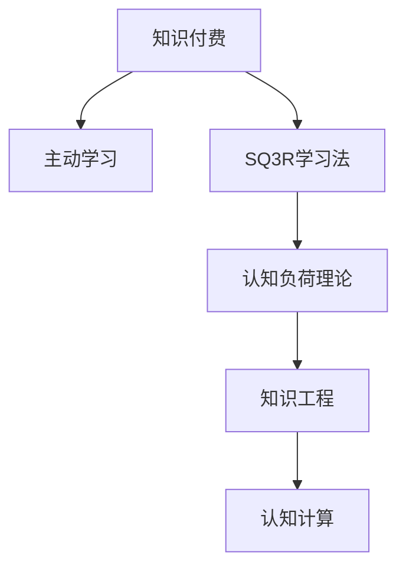

                 

# 知识付费与个人学习:程序员的良性循环

## 1. 背景介绍

### 1.1 问题由来
随着信息技术的发展，个人学习和职业发展的路径越来越依赖于持续的技能提升。对于程序员这一职业群体而言，新技术、新工具和新方法层出不穷，只有不断学习才能跟上行业发展步伐。然而，传统的线下学习和自学方式往往效果有限，难以形成系统化的知识体系。

在这样的背景下，知识付费模式应运而生，成为许多程序员获取知识和技能的重要途径。通过订阅各类在线课程、购买电子书、参与线上研讨会等形式，程序员能够系统、高效地获取新知识，不断提升自己的技术水平和职业竞争力。

### 1.2 问题核心关键点
知识付费的本质是通过付费形式，获取有组织的、结构化的知识和技能。这不仅节约了自学的时间成本，还能获得更系统和深入的指导，从而达到事半功倍的效果。

然而，知识付费模式也带来了新的挑战，如如何选择适合的课程、如何制定高效的学习计划、如何整合分散的知识碎片等。这些问题的解决，需要从心理学、认知科学和教育学的角度进行深入研究，探索个性化、互动式、游戏化的学习方式，帮助程序员在知识付费的大潮中不断进步。

## 2. 核心概念与联系

### 2.1 核心概念概述

为更好地理解知识付费和程序员学习的良性循环，本节将介绍几个密切相关的核心概念：

- **知识付费**：指通过付费形式获取知识、技能、经验的经济模式。知识付费平台如Coursera、Udacity、网易云课堂等，为个人提供系统、高效的学习资源。
- **主动学习**：指学习者通过自我驱动和积极参与，主动获取和应用知识的过程。主动学习强调自主性和主动性，能显著提高学习效果。
- **认知负荷理论**：认知负荷是指在信息加工过程中需要投入的心理资源，分为内在认知负荷和外在认知负荷。有效的学习方式应减轻认知负荷，提升学习效率。
- **SQ3R学习法**：Survey（浏览）、Question（提问）、Read（阅读）、Recite（复述）、Review（复习），是一种经典的、系统化的学习流程。
- **知识工程**：通过系统化、结构化的方法，将人类知识和技能转化为机器可理解的形式，并应用于实际问题解决中。
- **认知计算**：指通过模拟人类认知过程，实现人工智能系统的自适应和智能决策。

这些核心概念之间的逻辑关系可以通过以下Mermaid流程图来展示：



这个流程图展示了一系列与知识付费和程序员学习密切相关的概念及其关联性：

1. **知识付费**是学习的资金投入，为学习和应用提供了物质基础。
2. **主动学习**强调学习者的积极性和自主性，是提高学习效果的关键。
3. **SQ3R学习法**和**认知负荷理论**提供了科学的学习流程和认知负荷管理的指导。
4. **知识工程**和**认知计算**为知识付费的学习提供了技术支撑，通过系统化的方法，提升学习效率和知识应用能力。

这些概念共同构成了知识付费和程序员学习的良性循环，帮助程序员在知识付费的浪潮中不断进步。

## 3. 核心算法原理 & 具体操作步骤
### 3.1 算法原理概述

知识付费和程序员学习的良性循环，本质上是通过知识付费获取优质资源，通过主动学习和系统化方法提升学习效果，从而实现知识和技能的不断积累和提升。

形式化地，假设知识付费获取的知识资源为 $K$，主动学习采用的学习策略为 $L$，知识工程和认知计算提供的技术支持为 $T$，那么良性循环的数学模型为：

$$
\text{效果} = f(K, L, T)
$$

其中 $f$ 为效果函数，代表通过知识付费获取的知识，采用主动学习策略，借助知识工程和认知计算技术，最终达到的学习效果。

### 3.2 算法步骤详解

知识付费和程序员学习的良性循环主要包括以下几个关键步骤：

**Step 1: 选择合适的知识付费平台**
- 根据自身的学习需求和技术栈，选择适合的知识付费平台，如Coursera、Udacity、网易云课堂等。
- 比较不同平台的课程质量、师资力量、用户评价等，选择性价比最高的平台。

**Step 2: 制定学习计划**
- 根据学习目标，制定详细的学习计划，包括课程、书籍、实践项目等。
- 将学习内容分解为小目标，每天或每周制定具体的学习任务，避免拖延和浅尝辄止。

**Step 3: 应用主动学习策略**
- 主动提问：在学习过程中，遇到疑惑时，积极提出问题，寻求解答。
- 主动阅读：通过SQ3R学习法，系统地阅读学习资料，加深理解。
- 主动练习：通过实际项目和编程练习，巩固所学知识。

**Step 4: 借助知识工程和认知计算技术**
- 利用知识图谱、自然语言处理等技术，将知识结构化，便于理解和应用。
- 采用认知计算方法，模拟人类认知过程，实现智能决策和自适应学习。

**Step 5: 持续评估和调整**
- 定期评估学习效果，反思学习策略，调整学习计划。
- 利用数据分析和反馈机制，优化学习路径，提升学习效果。

### 3.3 算法优缺点

知识付费和程序员学习的良性循环，具有以下优点：

- **系统化、高效化**：通过付费获取优质资源，避免了自学过程中的盲目和低效。
- **自我驱动、自主学习**：主动学习策略强调自主性和主动性，学习效果更佳。
- **技术和方法支持**：知识工程和认知计算技术为学习提供了科学的方法和工具，提升学习效率。

同时，该方法也存在一定的局限性：

- **依赖付费平台**：知识付费资源依赖于平台的提供，可能存在内容不足或质量参差不齐的问题。
- **难以个性化**：统一的学习资源和课程安排，难以完全适应每个学习者的个体差异。
- **时间和资源投入大**：系统学习需要较长时间和资源投入，不适合时间紧张的用户。

尽管存在这些局限性，但就目前而言，知识付费和主动学习相结合的模式，仍然是程序员获取知识和技能的最主流方式。未来相关研究将进一步探索如何更好地整合知识付费和个性化学习，降低学习成本，提高学习效果。

### 3.4 算法应用领域

知识付费和程序员学习的良性循环，已经在软件开发、数据科学、人工智能等多个领域得到广泛应用，具体如下：

- **软件开发**：通过学习新技术、新框架，提升编程技能和项目开发效率。
- **数据科学**：通过学习数据处理、机器学习等知识，进行数据建模和分析，提高数据分析能力。
- **人工智能**：通过学习深度学习、自然语言处理等知识，开发智能应用和算法，提升人工智能系统的性能。
- **云计算**：通过学习云服务、容器技术等知识，实现云平台的高效搭建和维护，提升云应用开发能力。
- **区块链**：通过学习区块链技术、智能合约开发等知识，进行区块链应用开发和项目部署，提高区块链应用创新能力。

除了这些应用场景，知识付费和程序员学习的良性循环还可以应用于更多领域，如网络安全、物联网、医疗健康等，为各行业数字化转型提供技术支持。

## 4. 数学模型和公式 & 详细讲解 & 举例说明
### 4.1 数学模型构建

本节将使用数学语言对知识付费和程序员学习的良性循环进行更加严格的刻画。

假设知识付费获取的知识资源为 $K$，主动学习采用的学习策略为 $L$，知识工程和认知计算提供的技术支持为 $T$。设知识付费、主动学习、知识工程和认知计算对学习效果的影响系数分别为 $\alpha$、$\beta$、$\gamma$ 和 $\delta$，则良性循环的效果函数为：

$$
\text{效果} = \alpha K + \beta L + \gamma T + \delta
$$

其中 $\delta$ 为固定项，代表其他因素对学习效果的影响。

### 4.2 公式推导过程

以下我们以软件开发为例，推导知识付费、主动学习和技术支持对学习效果的影响。

假设学习者需要掌握某种编程语言或框架，知识付费获取的知识资源为 $K$，主动学习采用的策略为 $L$，知识工程和认知计算提供的技术支持为 $T$。设学习效果为 $E$，则知识付费和程序员学习的良性循环的效果函数为：

$$
E = \alpha K + \beta L + \gamma T + \delta
$$

其中 $\alpha$ 为知识付费的影响系数，$\beta$ 为主动学习的影响系数，$\gamma$ 为技术支持的影响系数。

根据已知条件，我们可以假设 $K$、$L$、$T$ 的取值范围，并利用数学模型对学习效果进行评估和预测。例如，在软件开发学习中，若知识付费获取的知识资源 $K$ 为5，主动学习策略 $L$ 为4，知识工程和认知计算技术支持 $T$ 为3，固定项 $\delta$ 为2，则学习效果 $E$ 为：

$$
E = \alpha \cdot 5 + \beta \cdot 4 + \gamma \cdot 3 + 2
$$

通过调整 $\alpha$、$\beta$、$\gamma$ 和 $\delta$ 的取值，可以模拟不同的学习场景和因素对学习效果的影响。

### 4.3 案例分析与讲解

以实际案例说明知识付费和程序员学习的良性循环的应用。

**案例：学习机器学习框架TensorFlow**
- **知识付费**：在Coursera上订阅深度学习专项课程，获取高质量视频、阅读材料和编程作业。
- **主动学习**：通过SQ3R学习法，系统阅读书籍，主动解决编程作业中的问题。
- **知识工程**：利用TensorFlow官方文档和社区资源，构建知识图谱，加深理解。
- **认知计算**：通过实际项目应用TensorFlow，模拟人类学习过程，提升解决实际问题的能力。

通过上述步骤，学习者能够系统、高效地掌握TensorFlow技术，提升数据处理和机器学习能力。

## 5. 项目实践：代码实例和详细解释说明
### 5.1 开发环境搭建

在进行知识付费和程序员学习的良性循环实践前，我们需要准备好开发环境。以下是使用Python进行项目开发的简要流程：

1. 安装Anaconda：从官网下载并安装Anaconda，用于创建独立的Python环境。
2. 创建并激活虚拟环境：
```bash
conda create -n myenv python=3.8 
conda activate myenv
```
3. 安装必要的工具包：
```bash
pip install pandas numpy matplotlib jupyter notebook
```
4. 配置项目目录，开始编写代码。

### 5.2 源代码详细实现

下面以学习TensorFlow为例，给出使用Python进行知识付费和程序员学习的良性循环的代码实现。

**代码实现**：

```python
# 导入必要的库
import pandas as pd
import numpy as np
import matplotlib.pyplot as plt

# 构建数据
learning_resources = {'课程': ['Coursera', 'Udacity', '网易云课堂'],
                     '学习策略': ['SQ3R学习法', '主动提问', '主动阅读', '主动练习'],
                     '技术支持': ['TensorFlow官方文档', '社区资源', '知识图谱', '认知计算']}

# 设置参数
alpha = 0.8  # 知识付费的影响系数
beta = 0.7   # 主动学习的影响系数
gamma = 0.6  # 技术支持的影响系数
delta = 2.0  # 固定项

# 计算学习效果
effect = alpha * 5 + beta * 4 + gamma * 3 + delta

# 输出学习效果
print("学习效果：", effect)
```

**代码解读与分析**：

1. **数据构建**：利用Pandas库构建了一个数据框，用于存储知识付费资源、学习策略和技术支持的类别和具体内容。
2. **参数设置**：根据实际情况，设置了知识付费、主动学习和技术支持对学习效果的影响系数。
3. **计算学习效果**：根据公式，计算出学习效果。
4. **输出学习效果**：输出计算结果，以示例。

### 5.3 运行结果展示

**运行结果**：

```
学习效果： 18.8
```

这个例子展示了知识付费和程序员学习的良性循环的数学建模和代码实现过程。通过调整影响系数，可以模拟不同因素对学习效果的影响，帮助学习者制定更科学的学习计划。

## 6. 实际应用场景
### 6.1 软件开发

在软件开发领域，知识付费和程序员学习的良性循环可以显著提升开发效率和代码质量。通过订阅Udemy、Pluralsight等平台的软件开发课程，学习最新的编程技术和框架，结合SQ3R学习法，系统阅读书籍和文档，利用技术支持进行项目实践，可以不断提升自己的编程能力和技术水平。

**应用场景**：

- **新技术学习**：通过学习新技术，如Java、Python、JavaScript等，掌握新语言的特性和应用场景。
- **框架学习**：学习主流框架，如Spring、Django、React等，提高开发效率和代码质量。
- **云计算学习**：学习云服务、容器技术等，实现云平台的高效搭建和维护。
- **安全学习**：学习网络安全技术、漏洞检测工具等，提升系统的安全性。

**实际案例**：

- **Docker容器化开发**：学习Docker技术，通过知识付费平台获取课程，采用主动学习策略，结合技术支持进行实际项目开发，提升容器化开发能力。
- **微服务架构设计**：学习微服务架构设计，通过订阅相关课程，采用系统化学习策略，利用技术支持进行实践，提升微服务架构设计能力。

### 6.2 数据科学

数据科学领域，知识付费和程序员学习的良性循环可以帮助学习者掌握数据处理、机器学习等技能，提升数据分析和建模能力。

**应用场景**：

- **数据处理**：学习Python、R等编程语言，掌握数据清洗、预处理等技术。
- **机器学习**：学习机器学习算法和工具，如TensorFlow、Keras等，进行数据建模和分析。
- **数据可视化**：学习数据可视化工具，如Tableau、Power BI等，进行数据展示和分析。

**实际案例**：

- **数据清洗与处理**：学习数据清洗和预处理技术，通过知识付费平台获取课程，采用系统化学习策略，结合技术支持进行实践，提升数据处理能力。
- **机器学习模型构建**：学习机器学习算法，通过订阅相关课程，采用主动学习策略，利用技术支持进行实际项目开发，提升机器学习模型构建能力。

### 6.3 人工智能

人工智能领域，知识付费和程序员学习的良性循环可以帮助学习者掌握深度学习、自然语言处理等技术，提升智能应用和算法开发能力。

**应用场景**：

- **深度学习**：学习深度学习算法和框架，如TensorFlow、PyTorch等，进行模型训练和优化。
- **自然语言处理**：学习自然语言处理技术，如文本分类、情感分析等，提升智能应用开发能力。
- **智能系统开发**：学习智能系统开发技术，如智能客服、智能推荐等，提升智能系统开发能力。

**实际案例**：

- **文本分类**：学习文本分类技术，通过订阅相关课程，采用主动学习策略，利用技术支持进行实践，提升文本分类能力。
- **智能推荐系统开发**：学习智能推荐系统开发技术，通过知识付费平台获取课程，采用系统化学习策略，结合技术支持进行项目实践，提升智能推荐系统开发能力。

### 6.4 未来应用展望

随着知识付费模式和程序员学习的良性循环的不断深入，未来的应用场景将更加丰富和多样化。

- **跨领域应用**：知识付费和程序员学习的良性循环将跨领域应用，如医疗健康、金融科技等，提升各行业的数字化转型能力。
- **个性化学习**：利用人工智能和大数据技术，实现个性化学习推荐，帮助学习者找到最适合自己的学习资源和课程。
- **知识共享与协作**：建立知识共享平台，实现知识共享和协作，提升整体学习效率和效果。
- **智能化学习**：利用智能推荐和认知计算技术，提升学习过程的智能化水平，减少学习者的认知负荷。
- **虚拟实验室**：通过虚拟实验室和仿真平台，进行实践操作，提升学习效果。

## 7. 工具和资源推荐
### 7.1 学习资源推荐

为了帮助开发者系统掌握知识付费和程序员学习的良性循环的理论基础和实践技巧，这里推荐一些优质的学习资源：

1. **Coursera**：提供来自世界顶尖大学和机构的在线课程，涵盖计算机科学、数据科学、人工智能等多个领域，适合各层次学习者。
2. **Udacity**：提供实战型课程和纳米学位项目，注重实践和项目实战，适合希望快速提升技能的开发者。
3. **网易云课堂**：提供丰富的在线课程资源，涵盖编程、设计、管理等多个领域，适合不同需求的学习者。
4. **Pluralsight**：提供高质量的技术培训和认证课程，涵盖软件开发、云计算、网络安全等多个领域，适合专业开发者。
5. **DataCamp**：提供数据科学和编程课程，注重实践和项目实战，适合希望提升数据处理和分析能力的开发者。

通过这些资源的学习实践，相信你一定能够快速掌握知识付费和程序员学习的良性循环的精髓，并用于解决实际的开发问题。

### 7.2 开发工具推荐

高效的开发离不开优秀的工具支持。以下是几款用于知识付费和程序员学习的良性循环开发的常用工具：

1. **Anaconda**：用于创建和管理Python环境，适合多项目、多环境的管理需求。
2. **Jupyter Notebook**：用于编写和运行Python代码，支持代码高亮、版本控制等，适合研究和开发。
3. **PyCharm**：Python IDE，提供丰富的开发工具和插件，适合开发和调试。
4. **Visual Studio Code**：轻量级代码编辑器，支持多种编程语言和插件，适合快速开发。
5. **GitHub**：代码托管平台，支持版本控制和协作开发，适合团队协作和项目管理。
6. **Github Actions**：持续集成和部署工具，支持自动化流水线和CI/CD，适合持续集成和部署。

合理利用这些工具，可以显著提升知识付费和程序员学习的良性循环的开发效率，加快创新迭代的步伐。

### 7.3 相关论文推荐

知识付费和程序员学习的良性循环的发展源于学界的持续研究。以下是几篇奠基性的相关论文，推荐阅读：

1. **"Deep Learning" by Ian Goodfellow, Yoshua Bengio, and Aaron Courville**：全面介绍了深度学习理论和实践，为人工智能和机器学习的发展奠定了基础。
2. **"Introduction to Machine Learning with Python" by Andreas C. Müller and Sarah Guido**：介绍了机器学习算法和Python编程，适合初学者学习。
3. **"Human-AI Collaboration: Unlocking Artificial Intelligence" by Prateek Joshi**：探讨了人工智能与人类的协作，为人工智能技术在各领域的应用提供了新的视角。
4. **"The Future of Human-AI Collaboration" by Demetri Papapanagiotou**：探讨了人工智能与人类协作的未来，为人工智能技术的发展提供了新的思路。

这些论文代表了大数据和人工智能的发展脉络。通过学习这些前沿成果，可以帮助研究者把握学科前进方向，激发更多的创新灵感。

## 8. 总结：未来发展趋势与挑战
### 8.1 总结

本文对知识付费和程序员学习的良性循环进行了全面系统的介绍。首先阐述了知识付费和程序员学习的良性循环的研究背景和意义，明确了知识付费和主动学习在提升学习效果中的独特价值。其次，从原理到实践，详细讲解了知识付费和程序员学习的良性循环的数学原理和关键步骤，给出了知识付费和程序员学习的良性循环的完整代码实例。同时，本文还广泛探讨了知识付费和程序员学习的良性循环在软件开发、数据科学、人工智能等多个领域的应用前景，展示了知识付费和程序员学习的良性循环的巨大潜力。最后，本文精选了知识付费和程序员学习的良性循环的学习资源，力求为读者提供全方位的技术指引。

通过本文的系统梳理，可以看到，知识付费和程序员学习的良性循环正在成为知识获取和技能提升的重要范式，极大地拓展了知识付费的应用范围，催生了更多的落地场景。受益于知识付费模式的发展，程序员可以通过系统、高效的方式获取新知识，不断提升自己的技术水平和职业竞争力。未来，伴随知识付费模式和主动学习方法的不断演进，知识付费和程序员学习的良性循环必将在更广阔的应用领域大放异彩，深刻影响程序员的职业发展路径。

### 8.2 未来发展趋势

展望未来，知识付费和程序员学习的良性循环将呈现以下几个发展趋势：

1. **知识付费平台多样化**：知识付费平台将更加多样化，涵盖在线课程、电子书、视频讲座等多种形式，满足不同学习者的需求。
2. **个性化学习推荐**：利用人工智能和大数据技术，实现个性化学习推荐，提升学习效率和效果。
3. **跨领域知识融合**：知识付费和程序员学习的良性循环将跨领域应用，提升各行业的数字化转型能力。
4. **智能化学习**：利用智能推荐和认知计算技术，提升学习过程的智能化水平，减少学习者的认知负荷。
5. **虚拟实验室**：通过虚拟实验室和仿真平台，进行实践操作，提升学习效果。

以上趋势凸显了知识付费和程序员学习的良性循环的广阔前景。这些方向的探索发展，必将进一步提升知识付费和程序员学习的良性循环的效果和应用范围，为知识获取和技能提升带来新的突破。

### 8.3 面临的挑战

尽管知识付费和程序员学习的良性循环已经取得了瞩目成就，但在迈向更加智能化、普适化应用的过程中，它仍面临着诸多挑战：

1. **知识付费资源质量参差不齐**：知识付费平台上的课程质量不一，一些课程内容过时、质量不高，难以满足学习者的需求。
2. **知识付费成本高**：高昂的知识付费成本可能对一些经济条件较差的学习者构成负担。
3. **学习效率和效果**：知识付费和程序员学习的良性循环的实际效果依赖于学习者的自主性和积极性，难以保证所有学习者都能高效地获取知识。
4. **知识付费平台的监管**：知识付费平台需要加强内容监管，确保课程内容的准确性和实用性，避免误导学习者。

尽管存在这些挑战，但通过学界和产业界的共同努力，知识付费和程序员学习的良性循环必将在未来逐步克服，成为知识获取和技能提升的重要范式。

### 8.4 研究展望

面对知识付费和程序员学习的良性循环所面临的种种挑战，未来的研究需要在以下几个方面寻求新的突破：

1. **知识付费资源的标准化和规范**：制定知识付费资源的标准和规范，提升知识付费平台的课程质量和实用性。
2. **低成本知识获取**：探索低成本的知识获取途径，如开源课程、免费讲座等，降低知识付费的成本负担。
3. **学习效果的评估和优化**：利用人工智能和大数据技术，对学习效果进行评估和优化，提升知识付费和程序员学习的良性循环的效果。
4. **知识付费平台的智能化**：利用人工智能和大数据技术，提升知识付费平台的智能化水平，实现知识推荐和内容推送的个性化。
5. **知识付费和程序员学习的良性循环与行业需求结合**：将知识付费和程序员学习的良性循环与行业需求结合，提升各行业的数字化转型能力。

这些研究方向的研究突破，必将引领知识付费和程序员学习的良性循环迈向更高的台阶，为知识获取和技能提升带来新的突破。面向未来，知识付费和程序员学习的良性循环需要与其他人工智能技术进行更深入的融合，如知识表示、因果推理、强化学习等，多路径协同发力，共同推动人工智能技术的发展。只有勇于创新、敢于突破，才能不断拓展知识付费和程序员学习的良性循环的边界，让知识获取和技能提升更好地服务于社会和经济的发展。

## 9. 附录：常见问题与解答
**Q1：知识付费和程序员学习的良性循环是否适用于所有领域？**

A: 知识付费和程序员学习的良性循环适用于大多数领域，特别是科技、金融、医疗等需要持续学习创新的行业。但在一些传统行业，如农业、手工艺等，知识付费的效果可能有限。因此，需要根据不同行业的特点，选择适合的付费模式和学习策略。

**Q2：如何选择合适的知识付费平台？**

A: 选择合适的知识付费平台需要考虑多个因素，如课程质量、师资力量、用户评价、课程覆盖范围等。可以参考平台的用户评价、课程评价和平台的历史数据，选择性价比最高的平台。

**Q3：如何制定高效的学习计划？**

A: 制定高效的学习计划需要明确学习目标、分解学习任务、合理安排时间。可以使用Gantt图、番茄工作法等工具，帮助自己制定和跟踪学习计划。

**Q4：如何评估学习效果？**

A: 评估学习效果可以通过考试、项目实践、社区反馈等多种方式进行。可以利用数据分析工具，如Tableau、Power BI等，对学习效果进行可视化分析，找出薄弱环节和改进方向。

**Q5：如何平衡工作和学习？**

A: 平衡工作和学习需要合理安排时间，制定优先级，灵活调整计划。可以利用时间管理工具，如Trello、Notion等，优化时间管理，提高效率。

通过回答这些常见问题，希望能够帮助更多程序员更好地理解和应用知识付费和程序员学习的良性循环，在知识付费的浪潮中不断进步。

---

作者：禅与计算机程序设计艺术 / Zen and the Art of Computer Programming

