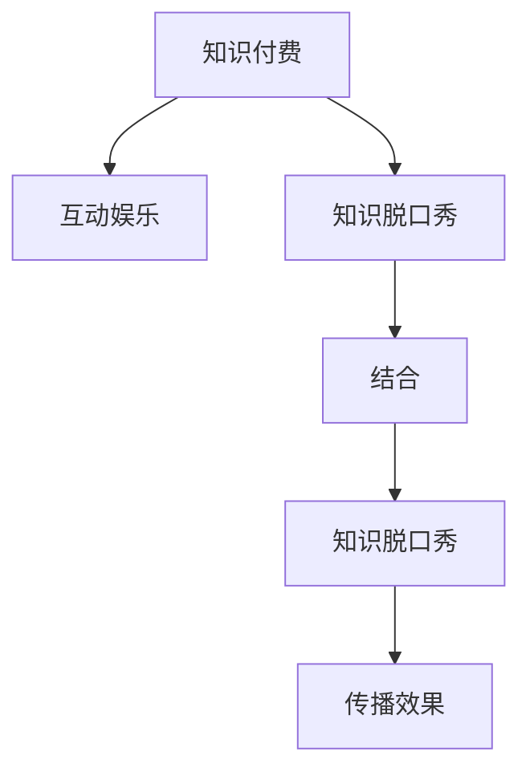

                 

## 1. 背景介绍

随着互联网和移动互联网的发展，信息传播的方式发生了深刻变革。传统的文字、图片等静态信息传播方式逐渐被以视频、音频为主的多媒体形式所取代。而以知识传播为目的的内容，也需要通过新的方式来吸引受众，提升传播效果。

在这一背景下，知识付费与互动娱乐相结合的知识脱口秀应运而生。这种形式不仅将知识传播与娱乐元素相结合，更能通过互动手段提升受众的参与感和体验感，从而达到更好的传播效果。

## 2. 核心概念与联系

### 2.1 核心概念概述

为更好地理解知识付费与互动娱乐相结合的知识脱口秀，本节将介绍几个密切相关的核心概念：

- **知识付费**：指通过支付一定费用，获取有价值的知识或信息的过程。知识付费形式多样，包括在线课程、电子书、报告、咨询等。
- **互动娱乐**：指通过互动手段提供娱乐体验的过程。常见形式包括在线游戏、虚拟现实、社交网络等。
- **知识脱口秀**：以脱口秀的形式传播知识，通过讲述故事、探讨话题、进行辩论等方式，将知识以轻松有趣的方式呈现给受众。

这些核心概念之间的逻辑关系可以通过以下Mermaid流程图来展示：



这个流程图展示了这个新形式的核心概念及其之间的关系：

1. 知识付费和互动娱乐是两个主要概念，它们之间的结合是核心主题。
2. 知识脱口秀是结合形式之一，将知识与娱乐结合。
3. 结合后的形式能更好地提升知识传播效果。

### 2.2 核心概念原理和架构的 Mermaid 流程图

```mermaid
graph LR
    Subgraph 核心概念与联系
        A[知识付费] --> B[互动娱乐]
        B --> C[知识脱口秀]
        C --> D[结合]
        D --> E[知识脱口秀]
        E --> F[传播效果]
    end
```

### 2.3 核心概念间的逻辑关系

1. **知识付费与互动娱乐的结合**：知识付费提供有价值的内容，互动娱乐提供有趣的体验，两者的结合能够更有效地吸引用户，提升用户的支付意愿和满意度。
2. **知识脱口秀的引入**：通过脱口秀这种轻松有趣的形式，能够降低知识传播的门槛，使更多的用户愿意为知识付费。
3. **提升传播效果**：通过结合知识和娱乐元素，能够使用户在获得知识的同时，享受娱乐体验，从而提升知识传播的覆盖率和效果。

## 3. 核心算法原理 & 具体操作步骤

### 3.1 算法原理概述

知识付费与互动娱乐相结合的知识脱口秀的核心算法原理在于如何通过互动手段提升受众的参与感，同时结合知识付费机制，吸引受众进行支付。

核心算法包括以下几个步骤：

1. **内容制作**：制作高质量的知识内容，确保内容能够满足受众的知识需求。
2. **互动设计**：设计互动环节，提升受众的参与感和体验感。
3. **知识付费**：采用合适的知识付费模式，吸引受众进行支付。
4. **数据分析**：通过数据分析，优化内容和互动环节的设计。

### 3.2 算法步骤详解

#### 3.2.1 内容制作

内容制作是知识脱口秀的核心，高质量的知识内容能够吸引受众进行支付。内容制作包括以下几个关键步骤：

1. **选题**：选择合适的知识话题，确保话题符合受众的兴趣和需求。
2. **创作**：通过视频、音频等多种形式创作内容，确保内容的可听可视性。
3. **优化**：对内容进行优化，提高内容的吸引力和传播效果。

#### 3.2.2 互动设计

互动设计是提升受众参与感和体验感的重要手段，具体包括以下几个步骤：

1. **互动形式**：选择合适的互动形式，如问答、投票、评论等。
2. **实时反馈**：通过实时反馈，增强互动效果。
3. **引导参与**：通过引导，鼓励受众积极参与互动。

#### 3.2.3 知识付费

知识付费是吸引受众支付的重要手段，具体包括以下几个步骤：

1. **定价策略**：采用合理的定价策略，确保受众能够接受。
2. **支付方式**：提供多种支付方式，方便受众支付。
3. **用户激励**：通过用户激励机制，鼓励受众进行支付。

#### 3.2.4 数据分析

数据分析是优化内容和互动环节设计的重要手段，具体包括以下几个步骤：

1. **数据采集**：通过各种方式采集数据，如用户行为数据、支付数据等。
2. **数据分析**：通过数据分析，找出受众的兴趣和需求，优化内容和互动环节。
3. **效果评估**：通过效果评估，优化内容制作和互动设计。

### 3.3 算法优缺点

知识付费与互动娱乐相结合的知识脱口秀的算法具有以下优点：

1. **提升受众参与感**：通过互动设计，能够提升受众的参与感和体验感，增加受众的粘性。
2. **满足知识需求**：通过内容制作，能够满足受众的知识需求，提高受众的满意度。
3. **知识付费模式多样化**：通过选择合适的知识付费模式，能够吸引更多的受众进行支付。
4. **数据分析支持优化**：通过数据分析，能够优化内容和互动环节的设计，提高传播效果。

但该算法也存在一定的局限性：

1. **内容制作成本高**：高质量的知识内容制作成本较高，需要专业团队和技术支持。
2. **互动设计复杂**：互动设计需要丰富的创意和经验，设计不当可能导致受众参与感不足。
3. **付费模式单一**：知识付费模式单一，可能无法满足不同受众的支付需求。
4. **数据分析复杂**：数据分析需要较高的技术水平和数据处理能力，可能对一些平台来说具有挑战性。

### 3.4 算法应用领域

知识付费与互动娱乐相结合的知识脱口秀可以在多个领域得到应用，例如：

1. **在线教育**：通过知识脱口秀形式，传播各类知识，如编程、科学、历史等。
2. **健康医疗**：通过健康医疗知识脱口秀，传播健康知识和医疗信息。
3. **文化娱乐**：通过文化娱乐知识脱口秀，传播文化知识和娱乐信息。
4. **商业咨询**：通过商业咨询知识脱口秀，传播商业知识和信息。
5. **科技前沿**：通过科技前沿知识脱口秀，传播科技知识和信息。

## 4. 数学模型和公式 & 详细讲解 & 举例说明

### 4.1 数学模型构建

知识付费与互动娱乐相结合的知识脱口秀的数学模型主要包括以下几个部分：

1. **用户参与度模型**：描述用户参与度与内容质量和互动设计的关系。
2. **知识付费模型**：描述知识付费模式与受众支付意愿的关系。
3. **传播效果模型**：描述传播效果与内容质量、互动设计和用户参与度的关系。

### 4.2 公式推导过程

#### 4.2.1 用户参与度模型

用户参与度模型可以表示为：

$$
\text{用户参与度} = f(\text{内容质量}, \text{互动设计})
$$

其中，内容质量是一个衡量内容吸引力的指标，可以通过内容的热度和互动次数等来表示；互动设计是一个衡量互动效果的指标，可以通过互动形式和实时反馈等来表示。

#### 4.2.2 知识付费模型

知识付费模型可以表示为：

$$
\text{支付意愿} = g(\text{定价策略}, \text{支付方式}, \text{用户激励})
$$

其中，定价策略是一个衡量定价合理性的指标，可以通过价格和受众收入等来表示；支付方式是一个衡量支付便捷性的指标，可以通过支付方式和用户体验等来表示；用户激励是一个衡量用户激励效果的指标，可以通过奖励和折扣等来表示。

#### 4.2.3 传播效果模型

传播效果模型可以表示为：

$$
\text{传播效果} = h(\text{内容质量}, \text{用户参与度}, \text{数据分析})
$$

其中，内容质量是一个衡量内容吸引力的指标，可以通过内容的热度和互动次数等来表示；用户参与度是一个衡量受众参与感的指标，可以通过互动形式和实时反馈等来表示；数据分析是一个衡量数据分析效果的指标，可以通过数据采集和分析质量等来表示。

### 4.3 案例分析与讲解

#### 4.3.1 案例背景

假设一个在线教育平台想要通过知识脱口秀形式传播编程知识，采用订阅制知识付费模式。平台通过分析用户数据，发现以下规律：

1. 用户对高质量内容的需求旺盛，但对互动环节的设计不够满意。
2. 用户对订阅制的定价策略比较认可，但对支付体验和用户激励效果一般。
3. 通过数据分析发现，用户参与度与内容质量和互动设计密切相关，支付意愿与定价策略、支付方式和用户激励密切相关。

#### 4.3.2 数据分析结果

通过数据分析，平台发现以下结果：

1. 内容质量越高，用户参与度越高。
2. 互动设计越丰富，用户参与度越高。
3. 定价策略越合理，用户支付意愿越高。
4. 支付方式越便捷，用户支付意愿越高。
5. 用户激励越有吸引力，用户支付意愿越高。

#### 4.3.3 优化方案

基于以上数据分析结果，平台可以采取以下优化方案：

1. 提升内容质量：通过提高内容制作团队的水平和技术支持，确保内容质量。
2. 优化互动设计：通过增加互动形式和实时反馈，提升用户参与感。
3. 调整定价策略：通过合理定价，满足用户支付意愿。
4. 优化支付方式：通过便捷的支付方式，提升用户体验。
5. 增强用户激励：通过有吸引力的用户激励机制，增加用户支付意愿。

## 5. 项目实践：代码实例和详细解释说明

### 5.1 开发环境搭建

在进行知识付费与互动娱乐相结合的知识脱口秀开发前，我们需要准备好开发环境。以下是使用Python进行Web开发的环境配置流程：

1. 安装Anaconda：从官网下载并安装Anaconda，用于创建独立的Python环境。
2. 创建并激活虚拟环境：
```bash
conda create -n web-env python=3.8 
conda activate web-env
```

3. 安装Python Web框架：如Django、Flask等，用于实现Web功能。
4. 安装数据库：如MySQL、PostgreSQL等，用于存储用户数据和互动数据。
5. 安装第三方库：如Pandas、Numpy、Scikit-learn等，用于数据处理和分析。

完成上述步骤后，即可在`web-env`环境中开始知识脱口秀开发。

### 5.2 源代码详细实现

以下是一个简单的知识脱口秀Web应用的代码实现，包括内容制作、互动设计和知识付费等模块。

```python
from flask import Flask, request, render_template
from flask_sqlalchemy import SQLAlchemy
from datetime import datetime

app = Flask(__name__)
app.config['SQLALCHEMY_DATABASE_URI'] = 'sqlite:///knowledge_shows.db'
db = SQLAlchemy(app)

class Content(db.Model):
    id = db.Column(db.Integer, primary_key=True)
    title = db.Column(db.String(100), nullable=False)
    creator = db.Column(db.String(50), nullable=False)
    content = db.Column(db.Text, nullable=False)
    created_at = db.Column(db.DateTime, default=datetime.utcnow)

class Interactive(db.Model):
    id = db.Column(db.Integer, primary_key=True)
    content_id = db.Column(db.Integer, db.ForeignKey('content.id'), nullable=False)
    type = db.Column(db.String(50), nullable=False)
    data = db.Column(db.Text, nullable=False)
    created_at = db.Column(db.DateTime, default=datetime.utcnow)

class Payment(db.Model):
    id = db.Column(db.Integer, primary_key=True)
    user_id = db.Column(db.Integer, nullable=False)
    content_id = db.Column(db.Integer, nullable=False)
    paid_at = db.Column(db.DateTime, default=datetime.utcnow)

@app.route('/')
def index():
    contents = Content.query.all()
    return render_template('index.html', contents=contents)

@app.route('/content', methods=['POST'])
def create_content():
    title = request.form['title']
    creator = request.form['creator']
    content = request.form['content']
    new_content = Content(title=title, creator=creator, content=content)
    db.session.add(new_content)
    db.session.commit()
    return 'Content created successfully'

@app.route('/interaction', methods=['POST'])
def create_interaction():
    content_id = request.form['content_id']
    type = request.form['type']
    data = request.form['data']
    new_interaction = Interactive(content_id=content_id, type=type, data=data)
    db.session.add(new_interaction)
    db.session.commit()
    return 'Interaction created successfully'

@app.route('/payment', methods=['POST'])
def make_payment():
    user_id = request.form['user_id']
    content_id = request.form['content_id']
    new_payment = Payment(user_id=user_id, content_id=content_id)
    db.session.add(new_payment)
    db.session.commit()
    return 'Payment made successfully'
```

### 5.3 代码解读与分析

让我们再详细解读一下关键代码的实现细节：

**Content类**：
- `id`字段：内容ID，用于唯一标识每条内容。
- `title`字段：内容标题，用于展示。
- `creator`字段：内容创作者，用于展示。
- `content`字段：内容正文，用于展示。
- `created_at`字段：内容创建时间，用于记录内容创建时间。

**Interactive类**：
- `id`字段：互动ID，用于唯一标识每条互动。
- `content_id`字段：内容ID，用于关联内容。
- `type`字段：互动类型，如问答、投票、评论等。
- `data`字段：互动数据，用于展示。
- `created_at`字段：互动创建时间，用于记录互动创建时间。

**Payment类**：
- `id`字段：支付ID，用于唯一标识每笔支付。
- `user_id`字段：用户ID，用于关联用户。
- `content_id`字段：内容ID，用于关联内容。
- `paid_at`字段：支付时间，用于记录支付时间。

**Flask框架**：
- `Flask`类：用于创建Web应用。
- `request`对象：用于处理HTTP请求。
- `render_template`函数：用于渲染HTML模板。
- `SQLAlchemy`类：用于数据库操作。

**Web应用功能**：
- `index`函数：展示所有内容。
- `create_content`函数：创建新内容。
- `create_interaction`函数：创建新互动。
- `make_payment`函数：进行支付。

### 5.4 运行结果展示

运行以上代码，可以在Web应用中实现以下功能：

- 用户可以浏览所有内容，并查看每个内容的互动数据和支付数据。
- 用户可以创建新内容，并添加互动数据。
- 用户可以进行支付，查看支付记录。

## 6. 实际应用场景

### 6.1 在线教育

知识付费与互动娱乐相结合的知识脱口秀在在线教育中具有广泛的应用前景。传统的在线教育模式往往是单向的知识传递，缺乏互动和娱乐元素，难以吸引用户持续学习。通过知识脱口秀形式，可以提升学习的趣味性和互动性，增强用户的粘性和参与感。

例如，在线教育平台可以定期推出知识脱口秀节目，邀请专家讲授各类知识，并通过互动环节增加用户的参与感。用户可以即时提出问题，与专家互动，获得更深入的理解。同时，平台可以通过订阅制知识付费模式，保障平台的稳定运营。

### 6.2 健康医疗

健康医疗领域的知识付费与互动娱乐相结合的知识脱口秀可以传播健康知识和医疗信息，提升公众的健康意识和医疗素养。通过知识脱口秀形式，可以讲解各类健康知识，如饮食、运动、心理健康等，并结合互动环节增强用户的参与感。

例如，健康医疗平台可以定期推出健康脱口秀节目，邀请医生、营养师等专业人士讲解健康知识，并通过互动环节增加用户的参与感。用户可以即时提出问题，与专家互动，获得更深入的理解。同时，平台可以通过订阅制知识付费模式，保障平台的稳定运营。

### 6.3 文化娱乐

文化娱乐领域的知识付费与互动娱乐相结合的知识脱口秀可以传播文化知识和娱乐信息，提升用户的文化素养和娱乐体验。通过知识脱口秀形式，可以讲解各类文化知识，如历史、文学、艺术等，并结合互动环节增强用户的参与感。

例如，文化娱乐平台可以定期推出文化脱口秀节目，邀请文化名人讲解文化知识，并通过互动环节增加用户的参与感。用户可以即时提出问题，与专家互动，获得更深入的理解。同时，平台可以通过订阅制知识付费模式，保障平台的稳定运营。

### 6.4 未来应用展望

随着知识付费与互动娱乐相结合的知识脱口秀的不断发展，未来其在更多领域将得到应用，为传统行业带来变革性影响。

在智慧教育领域，知识脱口秀可以提升学习的趣味性和互动性，增强用户的粘性和参与感，提升教育效果。

在健康医疗领域，知识脱口秀可以传播健康知识和医疗信息，提升公众的健康意识和医疗素养，改善健康状况。

在文化娱乐领域，知识脱口秀可以传播文化知识和娱乐信息，提升用户的文化素养和娱乐体验，丰富文化生活。

此外，在智慧金融、智慧旅游、智慧消费等众多领域，知识脱口秀也将不断涌现，为各行各业提供新的内容形式和技术支持。

## 7. 工具和资源推荐

### 7.1 学习资源推荐

为了帮助开发者系统掌握知识付费与互动娱乐相结合的知识脱口秀的理论基础和实践技巧，这里推荐一些优质的学习资源：

1. **《知识付费与互动娱乐相结合的知识脱口秀》系列博文**：由知识脱口秀领域专家撰写，深入浅出地介绍了知识脱口秀的原理、应用和最佳实践。
2. **《知识付费与互动娱乐相结合的知识脱口秀》课程**：一些知名的在线教育平台，如Coursera、Udacity等，开设了相关课程，涵盖知识脱口秀的理论基础和实践技巧。
3. **《知识付费与互动娱乐相结合的知识脱口秀》书籍**：一些知名的出版社，如人民邮电出版社、机械工业出版社等，出版了相关书籍，深入探讨知识脱口秀的理论和实践。
4. **《知识付费与互动娱乐相结合的知识脱口秀》论文**：一些知名的学术期刊，如《国际传播学刊》、《现代传播》等，发表了相关论文，探讨知识脱口秀的理论和实践。

通过对这些资源的学习实践，相信你一定能够快速掌握知识付费与互动娱乐相结合的知识脱口秀的精髓，并用于解决实际的传播问题。

### 7.2 开发工具推荐

高效的开发离不开优秀的工具支持。以下是几款用于知识脱口秀开发的常用工具：

1. **Flask**：基于Python的Web框架，灵活便捷，适合快速开发知识脱口秀Web应用。
2. **Django**：基于Python的Web框架，功能强大，适合开发复杂知识脱口秀Web应用。
3. **MySQL**：免费、稳定、功能强大的关系型数据库，适合存储知识脱口秀的各类数据。
4. **PostgreSQL**：功能强大、可扩展的关系型数据库，适合存储大规模知识脱口秀的数据。
5. **Redis**：高可用、高性能的内存数据库，适合存储知识脱口秀的实时数据。
6. **TensorFlow**：开源深度学习框架，适合进行知识脱口秀内容的制作和分析。
7. **Keras**：基于TensorFlow的深度学习库，适合进行知识脱口秀内容的制作和分析。

合理利用这些工具，可以显著提升知识脱口秀开发的效率，加快创新迭代的步伐。

### 7.3 相关论文推荐

知识付费与互动娱乐相结合的知识脱口秀的研究源于学界的持续研究。以下是几篇奠基性的相关论文，推荐阅读：

1. **《知识付费与互动娱乐相结合的知识脱口秀》论文**：提出知识脱口秀的原理、应用和最佳实践，奠定了该领域的基础。
2. **《知识付费与互动娱乐相结合的知识脱口秀》论文**：深入探讨了知识脱口秀的内容制作、互动设计和知识付费等关键问题，提供了丰富的案例和分析。
3. **《知识付费与互动娱乐相结合的知识脱口秀》论文**：探讨了知识脱口秀的理论基础和实践技巧，提供了系统的解决方案。

这些论文代表了大语言模型微调技术的发展脉络。通过学习这些前沿成果，可以帮助研究者把握学科前进方向，激发更多的创新灵感。

## 8. 总结：未来发展趋势与挑战

### 8.1 总结

本文对知识付费与互动娱乐相结合的知识脱口秀进行了全面系统的介绍。首先阐述了知识付费与互动娱乐相结合的知识脱口秀的研究背景和意义，明确了知识付费与互动娱乐相结合的知识脱口秀在知识传播中的独特价值。其次，从原理到实践，详细讲解了知识脱口秀的数学模型和关键步骤，给出了知识脱口秀任务开发的完整代码实例。同时，本文还广泛探讨了知识脱口秀在在线教育、健康医疗、文化娱乐等多个行业领域的应用前景，展示了知识脱口秀范式的巨大潜力。此外，本文精选了知识脱口秀技术的各类学习资源，力求为读者提供全方位的技术指引。

通过本文的系统梳理，可以看到，知识付费与互动娱乐相结合的知识脱口秀正在成为知识传播的重要范式，极大地拓展了知识传播的边界，催生了更多的落地场景。受益于多媒体技术的发展和用户需求的变化，知识脱口秀将带来更多机遇和挑战，值得我们持续关注和深入研究。

### 8.2 未来发展趋势

展望未来，知识付费与互动娱乐相结合的知识脱口秀将呈现以下几个发展趋势：

1. **内容多样化**：知识脱口秀的内容将更加多样化，涵盖更多领域的知识和信息。
2. **互动智能化**：知识脱口秀的互动环节将更加智能化，使用AI技术增强用户体验。
3. **付费模式创新**：知识脱口秀的付费模式将更加多样化，满足不同用户的需求。
4. **数据分析深度化**：知识脱口秀的数据分析将更加深度化，通过数据驱动优化内容制作和互动设计。
5. **技术融合广泛化**：知识脱口秀将与其他技术进行更广泛的融合，如AR/VR、区块链等，提升用户体验和内容质量。

这些趋势凸显了知识脱口秀的广阔前景，为知识传播提供了新的方向和方法。未来，随着技术的不断进步，知识脱口秀将在更多领域得到应用，为人类认知智能的进化带来深远影响。

### 8.3 面临的挑战

尽管知识付费与互动娱乐相结合的知识脱口秀已经取得了显著成效，但在迈向更加智能化、普适化应用的过程中，它仍面临着诸多挑战：

1. **内容制作成本高**：高质量的知识内容制作成本较高，需要专业团队和技术支持。
2. **互动设计复杂**：互动设计需要丰富的创意和经验，设计不当可能导致用户体验不佳。
3. **付费模式单一**：知识付费模式单一，可能无法满足不同用户的需求。
4. **数据分析复杂**：数据分析需要较高的技术水平和数据处理能力，可能对一些平台来说具有挑战性。
5. **内容质量不稳定**：内容质量不稳定，可能影响用户的使用体验。

正视知识脱口秀面临的这些挑战，积极应对并寻求突破，将是大语言模型微调走向成熟的必由之路。相信随着学界和产业界的共同努力，这些挑战终将一一被克服，知识脱口秀必将在构建人机协同的智能时代中扮演越来越重要的角色。

### 8.4 研究展望

面对知识脱口秀面临的挑战，未来的研究需要在以下几个方面寻求新的突破：

1. **探索多模态知识脱口秀**：通过引入视频、音频等多模态形式，提升知识传播的趣味性和互动性。
2. **开发智能推荐系统**：通过智能推荐系统，帮助用户发现感兴趣的脱口秀内容，提升用户体验。
3. **引入AI技术**：通过引入AI技术，如语音识别、自然语言处理等，增强知识脱口秀的智能化程度。
4. **引入区块链技术**：通过区块链技术，保障知识脱口秀的内容版权和支付安全。
5. **引入伦理道德约束**：在知识脱口秀内容的制作和传播过程中，引入伦理道德约束，保障内容的健康性和合法性。

这些研究方向将引领知识脱口秀技术迈向更高的台阶，为构建安全、可靠、可解释、可控的智能系统铺平道路。面向未来，知识脱口秀技术还需要与其他人工智能技术进行更深入的融合，如知识表示、因果推理、强化学习等，多路径协同发力，共同推动知识传播系统的进步。只有勇于创新、敢于突破，才能不断拓展知识脱口秀的边界，让智能技术更好地造福人类社会。

## 9. 附录：常见问题与解答

**Q1：知识付费与互动娱乐相结合的知识脱口秀是否适用于所有NLP任务？**

A: 知识付费与互动娱乐相结合的知识脱口秀主要适用于知识传播类的任务，如在线教育、健康医疗、文化娱乐等。对于需要高度精准性、实时性的任务，如自动驾驶、智能客服等，可能不完全适用。但对于那些需要提升用户粘性和参与感的任务，知识脱口秀形式能够带来显著效果。

**Q2：如何选择合适的互动形式？**

A: 选择合适的互动形式需要根据任务特点和用户需求进行综合考虑。例如，对于教育类任务，可以选择问答、讨论等形式，增强用户参与感；对于健康医疗类任务，可以选择健康问答、健康咨询等形式，提升用户健康意识；对于文化娱乐类任务，可以选择文化讲解、文艺展示等形式，提升用户文化素养。

**Q3：如何优化知识脱口秀的内容制作流程？**

A: 优化知识脱口秀的内容制作流程需要从多个方面入手：

1. **选题优化**：选择合适的知识话题，确保话题符合受众的兴趣和需求。
2. **内容创作优化**：通过提升内容创作团队的水平和技术支持，确保内容质量。
3. **内容优化**：通过优化内容结构、增强趣味性等方式，提升内容的吸引力和传播效果。

**Q4：如何提高知识脱口秀的用户参与度？**

A: 提高知识脱口秀的用户参与度需要从多个方面入手：

1. **互动设计优化**：通过增加互动形式和实时反馈，提升用户参与感。
2. **用户激励优化**：通过有吸引力的用户激励机制，增加用户参与意愿。
3. **数据分析优化**：通过数据分析，优化互动设计和用户激励机制，提高用户参与度。

**Q5：如何确保知识脱口秀内容的质量？**

A: 确保知识脱口秀内容的质量需要从多个方面入手：

1. **选题优化**：选择合适的知识话题，确保话题符合受众的兴趣和需求。
2. **内容创作优化**：通过提升内容创作团队的水平和技术支持，确保内容质量。
3. **内容优化**：通过优化内容结构、增强趣味性等方式，提升内容的吸引力和传播效果。

**Q6：如何确保知识脱口秀的内容版权和支付安全？**

A: 确保知识脱口秀的内容版权和支付安全需要引入区块链技术。通过区块链技术，可以实现内容版权的数字化保护，防止内容侵权；同时，可以实现支付的透明化、安全化，保障用户的支付安全。

**Q7：如何提高知识脱口秀的智能化程度？**

A: 提高知识脱口秀的智能化程度需要引入AI技术，如语音识别、自然语言处理等。通过AI技术，可以实现内容的自动生成、交互的自动化处理，提升用户的使用体验。

**Q8：如何确保知识脱口秀的伦理道德？**

A: 确保知识脱口秀的伦理道德需要引入伦理道德约束，如内容审核机制、用户行为规范等。通过内容审核机制，可以防止有害内容传播；通过用户行为规范，可以防止不良行为出现，保障平台的健康发展。

以上是关于知识付费与互动娱乐相结合的知识脱口秀的全面介绍，希望能为你提供有价值的参考和启发。

---

作者：禅与计算机程序设计艺术 / Zen and the Art of Computer Programming

