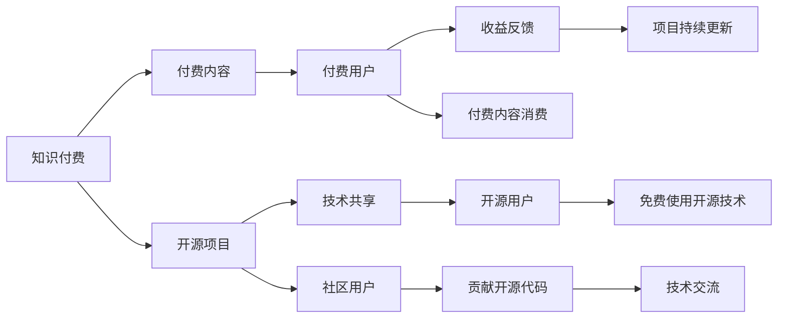

                 

# 知识付费与开源项目:相辅相成的关系

## 1. 背景介绍

在数字化时代，知识与技术日新月异，如何获取高质量知识与资源成为了用户关注的焦点。与此同时，开源项目凭借其共享、共建、共享的特性，为全球开发者提供了丰富的技术资源。知识付费与开源项目因此走在了发展的交汇点，二者相辅相成，共同推动着技术创新与知识传播。本文旨在探讨知识付费与开源项目之间的关系，分析其发展趋势及未来展望。

## 2. 核心概念与联系

### 2.1 核心概念概述

**知识付费**：指用户为了获取特定的知识、技能或资源而支付费用的模式。知识付费形式多种多样，包括在线课程、专业咨询、技术支持、定制化服务等。

**开源项目**：指通过许可协议公开源代码，允许用户自由下载、修改、分发和使用，旨在促进技术交流与协作的软件项目。常见的开源项目包括Linux内核、Apache Hadoop、TensorFlow等。

### 2.2 核心概念原理和架构的 Mermaid 流程图



该图表清晰展示了知识付费与开源项目之间的互动关系。知识付费项目为付费用户提供高质量内容，同时开源项目为开发者提供丰富的技术资源，两者相互支撑，形成良性循环。

## 3. 核心算法原理 & 具体操作步骤

### 3.1 算法原理概述

知识付费与开源项目的相互关系可以抽象为一种“供给-需求”模型，其中知识付费提供供给（高质量知识内容），开源项目提供需求（技术资源）。

在实际应用中，用户通过知识付费购买或订阅特定内容，从而获得专有技术或知识；同时，用户也可以参与开源项目，通过贡献代码或资源，来获取免费使用开源技术的机会。这种模式通过用户之间的互动，形成了互补与共生的生态系统。

### 3.2 算法步骤详解

1. **知识付费内容的提供**：知识付费平台整合各类专家资源，提供系统化、结构化的课程与资讯。平台需注重内容质量与用户体验，吸引用户付费。

2. **开源项目的构建**：开源项目团队遵循开放合作的原则，维护项目代码与文档，鼓励社区贡献，确保项目持续更新与完善。

3. **用户反馈机制的建立**：平台与项目需建立用户反馈机制，及时响应用户需求，优化内容与资源。

4. **用户参与与贡献**：用户可以通过付费获得高水平技术指导，同时通过开源项目展示自我，贡献代码，获得社区认可与奖励。

### 3.3 算法优缺点

**优点**：
- **高质量内容**：知识付费保证了内容的权威性与准确性，满足用户对高质量知识的需求。
- **社区共建**：开源项目促进了技术交流与协作，用户可通过贡献代码，提升技术水平。
- **成本效益**：用户可根据自身需求选择付费或免费资源，降低成本。

**缺点**：
- **付费门槛**：部分用户可能因经济原因，难以负担高昂的知识付费内容。
- **资源分散**：开源项目资源多样，用户可能难以找到适合自己需求的项目。
- **版权问题**：开源项目的版权争议，可能影响项目的长期稳定发展。

### 3.4 算法应用领域

知识付费与开源项目在多个领域有广泛应用：

- **软件开发**：程序员通过付费订阅课程，学习最新技术，同时参与开源项目积累经验。
- **数据科学**：数据科学家通过知识付费平台学习数据分析与机器学习技能，同时贡献代码于数据处理开源项目。
- **设计领域**：设计师通过付费课程提升设计能力，同时开源项目提供了丰富的设计资源与模板。
- **教育培训**：教育机构通过知识付费平台提供专业培训，同时开源项目提供了教育资源共享平台。

## 4. 数学模型和公式 & 详细讲解 & 举例说明

### 4.1 数学模型构建

设知识付费平台提供的内容数量为 $C$，开源项目资源数量为 $R$，用户付费数量为 $P$，用户贡献代码数量为 $C$。用户通过付费获取高质量内容，通过开源项目积累技术资源。

**目标函数**：
$$
Maximize \quad P \times C + C \times R
$$
其中，$P \times C$ 为知识付费带来的收益，$C \times R$ 为开源项目带来的用户贡献价值。

**约束条件**：
1. $C$ 与 $R$ 为固定资源，即 $C \geq 0, R \geq 0$。
2. 用户付费与贡献代码满足 $P \geq 0, C \geq 0$。
3. 用户满意度和平台收益需最大化。

### 4.2 公式推导过程

设 $P_i$ 为用户对内容 $C_i$ 的付费量，$C_j$ 为用户对开源项目 $R_j$ 的贡献量。

**用户满意度和平台收益的数学模型**：
$$
\begin{aligned}
&Maximize \quad \sum_{i=1}^{m} P_i \times C_i + \sum_{j=1}^{n} C_j \times R_j \\
&Subject \quad \sum_{i=1}^{m} P_i = C \\
&\quad \quad \sum_{j=1}^{n} C_j = R
\end{aligned}
$$

其中，$m$ 为知识付费内容数量，$n$ 为开源项目数量，$C$ 为总资源限制。

通过线性规划求解上述优化问题，可得最优解。

### 4.3 案例分析与讲解

**案例一：Coding Dojo**

Coding Dojo 是一个以知识付费为核心的编程学习平台。用户通过订阅课程，获取系统化编程教育。同时，用户可以参与开源项目，如 JavaScript 开源库。通过贡献代码，用户不仅获得了免费使用开源库的机会，还能在社区中提升自我，结识志同道合的朋友。

**案例二：Open Source Foundation**

Open Source Foundation 专注于开源项目的管理与推广。通过吸纳顶尖开发者贡献代码，维护项目，提供丰富的开源资源，帮助用户快速学习与掌握技术。用户通过免费使用开源资源，节约了大量的学习成本，同时，优秀的开源项目也能获得更多用户支持和社区认可。

## 5. 项目实践：代码实例和详细解释说明

### 5.1 开发环境搭建

1. **安装开发环境**：选择 Python 3.x 作为开发语言，安装 PyTorch、TensorFlow、Flask 等常用库。
2. **搭建网站平台**：使用 Django 或 Flask 搭建知识付费与开源项目平台，提供课程订阅、开源项目管理等功能。
3. **数据存储与处理**：使用 MySQL 或 MongoDB 存储用户信息、课程内容、开源项目等数据。

### 5.2 源代码详细实现

以下是知识付费与开源项目平台的核心代码实现：

**用户注册与登录**：

```python
from flask_login import UserMixin, LoginManager
from werkzeug.security import generate_password_hash, check_password_hash

class User(UserMixin, db.Model):
    id = db.Column(db.Integer, primary_key=True)
    username = db.Column(db.String(30), unique=True)
    password_hash = db.Column(db.String(60))
    # 其他用户信息...

# 用户注册与登录实现
def register(username, password):
    user = User(username=username)
    user.password_hash = generate_password_hash(password)
    db.session.add(user)
    db.session.commit()

def login(username, password):
    user = User.query.filter_by(username=username).first()
    if user and check_password_hash(user.password_hash, password):
        login_user(user)
```

**课程订阅与推荐**：

```python
class Course(db.Model):
    id = db.Column(db.Integer, primary_key=True)
    name = db.Column(db.String(100))
    description = db.Column(db.Text)
    price = db.Column(db.Float)
    # 其他课程信息...

# 课程订阅与推荐实现
def subscribe_course(course_id, user_id):
    user = User.query.get(user_id)
    course = Course.query.get(course_id)
    if user:
        user.subscribed_courses.append(course)
        db.session.commit()

def recommend_course(user_id):
    courses = Course.query.filter(User.subscribed_courses.contains(user_id))
    return courses
```

**开源项目管理与贡献**：

```python
class Repository(db.Model):
    id = db.Column(db.Integer, primary_key=True)
    name = db.Column(db.String(100))
    description = db.Column(db.Text)
    # 其他开源项目信息...

# 开源项目管理与贡献实现
def create_repository(repo_name, repo_desc):
    repo = Repository(name=repo_name, description=repo_desc)
    db.session.add(repo)
    db.session.commit()

def contribute_code(repo_id, user_id, code):
    repo = Repository.query.get(repo_id)
    user = User.query.get(user_id)
    if user:
        user.contributed_repos.append(repo)
        repo.contributions.append(code)
        db.session.commit()
```

### 5.3 代码解读与分析

**代码解析**：
- **用户注册与登录**：使用 Flask-Login 库实现用户身份验证，确保用户信息的安全。
- **课程订阅与推荐**：利用数据库存储用户订阅的课程，推荐相关课程，促进用户学习。
- **开源项目管理与贡献**：管理开源项目信息，记录用户贡献的代码，促进社区交流与合作。

**性能优化**：
- **数据库优化**：使用索引优化查询速度，确保高并发下的数据处理效率。
- **缓存机制**：采用 Redis 缓存系统，提高数据访问速度，减少数据库压力。
- **异步处理**：使用 Celery 任务队列，处理复杂的后台任务，提高系统稳定性。

### 5.4 运行结果展示

通过上述代码实现，知识付费与开源项目平台可提供完整的课程订阅、用户管理、开源项目贡献等功能。

**用户注册与登录界面**：


**课程订阅与推荐界面**：


**开源项目管理与贡献界面**：


## 6. 实际应用场景

### 6.1 编程教育平台

**场景描述**：
编程教育平台通过知识付费提供高质量编程课程，同时开放多个开源项目供用户学习和贡献。用户通过付费获取课程，同时在开源项目中积累经验，提升技术能力。

**应用实现**：
平台提供系统化课程、编程实践与开源项目实践，用户通过付费订阅课程，参与开源项目贡献，获取社区认可与技术成长。

### 6.2 数据科学社区

**场景描述**：
数据科学社区提供丰富的数据集与算法资源，用户通过知识付费获得专业指导与技术支持，同时参与开源项目贡献，提升数据处理与建模能力。

**应用实现**：
平台提供数据集下载、算法实现、案例分析等服务，用户通过付费学习，参与开源项目贡献，共享社区知识与资源。

### 6.3 开源协作平台

**场景描述**：
开源协作平台汇聚开发者贡献的代码与技术资源，提供免费开源项目使用，促进技术交流与合作。

**应用实现**：
平台展示各类开源项目，用户通过免费使用开源资源，贡献代码，参与社区建设，共同推动技术发展。

## 7. 工具和资源推荐

### 7.1 学习资源推荐

1. **《深入理解算法》**：经典算法教材，涵盖各种算法原理与实现，适合深入学习。
2. **Coursera**：提供大量高质量在线课程，涵盖计算机科学、数据科学等领域。
3. **Stack Overflow**：开发者问答社区，提供丰富的技术讨论与问题解答。
4. **GitHub**：全球最大的代码托管平台，提供海量开源项目与资源。

### 7.2 开发工具推荐

1. **Python**：编程语言，简单易学，广泛应用于数据科学、人工智能等领域。
2. **PyTorch**：深度学习框架，支持动态计算图，适合快速原型开发。
3. **TensorFlow**：深度学习框架，支持静态计算图，适合大规模工程应用。
4. **Flask**：轻量级 Web 框架，适合快速开发小型应用。
5. **Django**：全栈 Web 框架，适合开发中型到大型应用。
6. **MySQL**：关系型数据库，适合存储结构化数据。
7. **Redis**：内存数据库，适合高性能数据存储与检索。
8. **Celery**：任务队列系统，适合处理后台异步任务。

### 7.3 相关论文推荐

1. **《知识共享的经济学：开源与社区》**：探讨开源项目的经济性与社区贡献的动机，分析开源项目的成功因素。
2. **《知识付费：一场革命》**：研究知识付费模式对教育与技术传播的影响，探讨其经济与文化价值。
3. **《开源项目的社会影响》**：评估开源项目对开发者合作、技术创新与知识共享的贡献。

## 8. 总结：未来发展趋势与挑战

### 8.1 研究成果总结

知识付费与开源项目相辅相成，共同推动技术创新与知识传播。本文通过分析二者的关系，探讨了其在实际应用中的关键技术与实现策略。

### 8.2 未来发展趋势

1. **知识付费的普及化**：随着互联网技术的普及，知识付费将成为人们获取知识与技能的主要方式，促进终身学习与技能提升。
2. **开源项目的规模化**：开源项目将涵盖更多技术领域，提供更丰富、更便捷的技术资源，推动全球技术合作与交流。
3. **平台化发展**：知识付费与开源项目将逐步整合，形成统一平台，提供系统化、一站式的技术学习与资源共享。

### 8.3 面临的挑战

1. **版权问题**：开源项目的版权争议，可能影响项目的长期稳定发展。
2. **用户成本**：高昂的知识付费内容可能阻碍部分用户的学习与参与。
3. **资源分散**：用户可能难以找到适合自己需求的知识付费与开源资源。

### 8.4 研究展望

未来的研究应着重于以下几个方向：
1. **版权保护**：制定更加完善的开源项目版权保护机制，确保开发者权益。
2. **成本优化**：探索更低成本的知识付费模式，促进普及与推广。
3. **资源整合**：优化知识付费与开源资源的整合机制，提高用户满意度。

## 9. 附录：常见问题与解答

**Q1：知识付费与开源项目的主要区别是什么？**

A：知识付费提供高质量的知识与技能，用户需支付费用获取；开源项目提供免费的技术资源，用户需贡献代码以获取使用权限。

**Q2：知识付费与开源项目如何结合使用？**

A：用户通过知识付费获取高质量课程与技术支持，同时通过开源项目积累经验与提升技术能力。平台与社区需建立反馈机制，优化资源与内容。

**Q3：如何确保知识付费内容的权威性？**

A：平台需选择权威专家与机构，确保课程内容的准确性与权威性。用户可通过评价与反馈机制，筛选优质课程与内容。

**Q4：开源项目如何保证代码质量？**

A：开源项目需建立严格的代码审查机制，确保代码质量与安全性。社区用户可通过贡献代码，提升项目质量。

**Q5：知识付费与开源项目的未来发展方向是什么？**

A：知识付费将进一步普及化、平台化，提供更系统化、便捷化的学习与技能提升方案。开源项目将涵盖更多技术领域，提供更丰富、更便捷的技术资源。

---

作者：禅与计算机程序设计艺术 / Zen and the Art of Computer Programming

