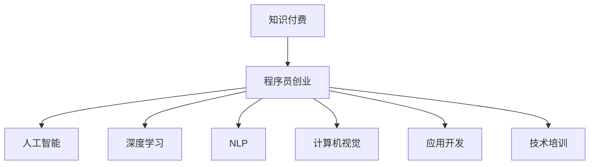

                 

# 知识付费与程序员创业的结合点

> 关键词：知识付费,程序员创业,人工智能,深度学习,自然语言处理(NLP),计算机视觉,应用开发,技术培训

## 1. 背景介绍

### 1.1 问题由来

随着知识经济时代的到来，知识付费模式逐渐兴起并迅速成为市场主流。知识付费通过用户付费获取高质量知识内容，提升了信息获取的效率和精准度，满足了大众对知识的旺盛需求。在此背景下，如何结合程序员的特色和优势，实现程序员在知识付费领域的新突破，成为当前程序员创业的重要课题。

## 2. 核心概念与联系

### 2.1 核心概念概述

为更好地理解程序员创业与知识付费的结合点，本节将介绍几个密切相关的核心概念：

- 知识付费（Knowledge Pay）：用户为获取高质量知识内容而支付费用的模式。其本质是知识商品化，让知识创作者能够得到应得的回报，推动高质量知识的生产与传播。

- 程序员创业（Coder Entrepreneurship）：程序员利用自身技术优势，通过创业实现商业价值和社会价值双赢的目标。程序员创业可以丰富市场供给，激发创新活力，促进社会经济发展。

- 人工智能（Artificial Intelligence）：指通过算法、模型等方式模拟人类智能行为的技术。目前广泛应用于计算机视觉、自然语言处理、语音识别等各个领域。

- 深度学习（Deep Learning）：一种基于神经网络的机器学习技术，能够处理大规模数据并从中提取高层次特征，被广泛应用于图像识别、语音识别、自然语言处理等任务。

- 自然语言处理（Natural Language Processing, NLP）：研究如何让计算机理解、处理和生成人类自然语言的技术，是知识付费与程序员创业结合的重要方向。

- 计算机视觉（Computer Vision）：指使计算机能够理解和解释图像和视频中的视觉信息的技术，在图像识别、图像处理等领域有广泛应用。

- 应用开发（Application Development）：指开发各种软件应用，满足用户需求，提升用户体验。

- 技术培训（Technical Training）：通过培训提升用户的计算机技术能力，帮助其更好地利用信息技术。

这些核心概念之间的逻辑关系可以通过以下Mermaid流程图来展示：



这个流程图展示了两者之间的核心概念及其之间的关系：

1. 知识付费与程序员创业的结合，可以通过人工智能、深度学习等前沿技术实现。
2. 基于NLP等技术的知识付费平台，能够为用户提供高质量内容，实现知识商品化。
3. 计算机视觉等技术，为知识付费平台的图像处理、数据分析提供支撑。
4. 应用开发和技术培训，使知识付费内容更加生动具体，提升用户应用体验。

这些概念共同构成了知识付费与程序员创业的融合框架，使其能够在不同领域中发挥各自的优点，实现商业模式的创新与突破。

## 3. 核心算法原理 & 具体操作步骤
### 3.1 算法原理概述

知识付费与程序员创业的结合点，核心在于如何将程序员的技术优势与知识付费模式有机结合，形成新的商业模式。这可以通过以下算法原理进行实现：

- **用户需求分析**：通过数据挖掘和机器学习技术，分析用户的行为和偏好，发现潜在的需求和痛点，为知识付费内容的设计提供依据。

- **内容生成与优化**：利用自然语言处理、深度学习等技术，生成高质量的文本、图像、视频等内容，同时通过反馈机制不断优化内容，提升用户满意度。

- **个性化推荐**：通过推荐算法，将合适的知识付费内容推荐给用户，提升内容获取的精准度和用户粘性。

- **自动化定价与订阅**：基于用户行为数据，动态调整内容价格和订阅方案，最大化用户价值和平台收益。

### 3.2 算法步骤详解

基于上述算法原理，以下详细介绍具体的操作步骤：

**Step 1: 用户需求分析**

1. 数据采集：通过API接口或爬虫技术，收集用户的使用行为数据，包括阅读时长、点击次数、评论内容等。

2. 特征提取：对采集到的数据进行特征提取，如用户活跃时间、偏好领域、搜索关键词等，形成用户画像。

3. 用户聚类：利用聚类算法（如K-Means、层次聚类等），将用户划分为不同的群体，发现不同群体的特点和需求。

4. 需求预测：基于历史数据和用户画像，利用机器学习模型（如随机森林、XGBoost等），预测用户对不同内容的需求和兴趣。

**Step 2: 内容生成与优化**

1. 内容创作：根据用户需求预测结果，设计有针对性的知识付费内容，如课程、文章、视频等。

2. 内容生成：利用自然语言处理技术（如GPT、BERT等），自动生成高质量文本内容。利用深度学习模型（如GAN、Autoencoder等），自动生成高质量图像和视频内容。

3. 内容优化：通过用户反馈和行为数据分析，不断调整和优化内容，确保内容的质量和用户满意度。

**Step 3: 个性化推荐**

1. 推荐模型：利用协同过滤、内容推荐、混合推荐等算法，建立个性化推荐模型。

2. 数据准备：准备用户特征、内容特征和行为数据，输入到推荐模型中。

3. 推荐生成：通过模型预测，生成个性化推荐结果。

4. 推荐优化：根据推荐效果和用户反馈，不断调整推荐模型和策略，提升推荐精度。

**Step 4: 自动化定价与订阅**

1. 定价策略：根据用户行为数据和市场行情，设计灵活的定价策略，如按次付费、按月订阅、包年优惠等。

2. 订阅管理：利用订阅管理系统，管理用户订阅状态和内容访问权限。

3. 动态调整：根据用户行为和市场反馈，动态调整定价和订阅方案，保持竞争力和用户黏性。

### 3.3 算法优缺点

基于上述算法步骤，知识付费与程序员创业的结合点具有以下优点：

- **精准化服务**：利用数据挖掘和机器学习技术，能够精准识别用户需求，提供高度匹配的内容。
- **高效化运营**：通过自动化推荐和定价，提升运营效率，降低人力成本。
- **智能化管理**：利用大数据和AI技术，实现用户行为的动态监控和分析，提升平台决策能力。

但同时也存在以下缺点：

- **数据隐私问题**：大量用户数据需要采集和存储，可能面临隐私泄露的风险。
- **算法公平性**：推荐算法可能存在偏见，导致不同用户之间获取内容的不公平。
- **内容质量控制**：自动化生成的内容可能存在质量不稳定的问题。
- **市场风险**：市场行情和用户需求的变化，可能影响定价和订阅策略的效果。

### 3.4 算法应用领域

基于知识付费与程序员创业结合点的算法步骤，可以实现多个实际应用场景：

- **在线教育平台**：利用NLP和计算机视觉技术，自动生成优质教学内容，提供个性化学习推荐，提升用户学习体验和效果。
- **健康咨询平台**：结合健康医疗知识，自动生成健康咨询内容，提供个性化医疗建议，提升用户健康管理水平。
- **职业培训平台**：利用技术培训需求数据，自动生成专业培训内容，提供个性化职业指导，帮助用户提升职业技能。
- **技术交流社区**：通过知识付费内容，聚集技术爱好者，提供技术交流和经验分享平台，促进技术创新和知识传播。

## 4. 数学模型和公式 & 详细讲解 & 举例说明
### 4.1 数学模型构建

本节将使用数学语言对知识付费与程序员创业的结合点进行更加严格的刻画。

记用户集合为 $U$，内容集合为 $C$，行为数据集合为 $D$。定义用户需求函数 $f(u)$ 为用户对内容 $c$ 的需求度，内容生成函数 $g(c)$ 为用户对内容 $c$ 的满意度。

定义个性化推荐函数 $h(u, c)$ 为给定用户 $u$ 推荐内容 $c$ 的概率，推荐结果函数 $r(u)$ 为用户实际访问内容的结果。

因此，整体模型可以表示为：

$$
\max_{f,g,h} \sum_{u \in U} \sum_{c \in C} f(u)c \cdot g(c)
$$

在实际应用中，上述模型需要利用优化算法（如梯度下降、遗传算法等）进行求解。同时，需要引入推荐算法（如协同过滤、内容推荐等）和定价算法（如动态定价、订阅管理等），以实现个性化推荐和自动化定价。

### 4.2 公式推导过程

以下我们以在线教育平台为例，推导个性化推荐模型的基本公式。

定义用户-内容关系矩阵 $R$，其中 $R_{u,c} = r(u,c)$ 表示用户 $u$ 访问内容 $c$ 的概率。

定义用户行为向量 $\vec{b_u}$ 和内容特征向量 $\vec{f_c}$，其中 $\vec{b_u} = [b_{u,1}, b_{u,2}, ..., b_{u,n}]^T$ 表示用户 $u$ 的行为特征，$b_{u,i}$ 表示用户对内容 $c_i$ 的访问频率。

基于协同过滤算法的推荐公式为：

$$
\hat{r}_{u,c} = \frac{1}{1 + e^{-\vec{b_u}^T \vec{f_c}}}
$$

其中 $e$ 为自然常数，$1 + e^{-\vec{b_u}^T \vec{f_c}}$ 表示模型的输出概率，$\hat{r}_{u,c}$ 表示预测的访问概率。

### 4.3 案例分析与讲解

以在线教育平台为例，分析推荐模型的具体实现。

**案例背景**：
某在线教育平台收集了学生对课程的点击、浏览、评分等行为数据，希望通过数据分析和算法优化，实现课程的个性化推荐。

**数据准备**：
1. 用户行为数据：收集学生对课程的点击、浏览、评分等数据。
2. 课程内容数据：收集课程的标题、简介、教师等信息。
3. 用户特征数据：收集学生的学号、年级、兴趣领域等信息。

**算法实现**：
1. 协同过滤算法：根据用户行为数据和课程内容数据，建立用户-课程关系矩阵 $R$。
2. 推荐模型训练：使用梯度下降算法训练模型参数 $\vec{b_u}$ 和 $\vec{f_c}$。
3. 推荐结果生成：利用训练好的模型，预测用户对课程的访问概率，生成个性化推荐结果。
4. 推荐结果展示：将推荐结果展示给用户，让用户自行选择感兴趣的课程。

## 5. 项目实践：代码实例和详细解释说明
### 5.1 开发环境搭建

在进行知识付费与程序员创业的结合点开发前，我们需要准备好开发环境。以下是使用Python进行开发的环境配置流程：

1. 安装Anaconda：从官网下载并安装Anaconda，用于创建独立的Python环境。

2. 创建并激活虚拟环境：
```bash
conda create -n knowledge-pay python=3.8 
conda activate knowledge-pay
```

3. 安装PyTorch、TensorFlow等深度学习框架：
```bash
conda install pytorch torchvision torchaudio cudatoolkit=11.1 -c pytorch -c conda-forge
conda install tensorflow tensorflow-cpu -c tensorflow
```

4. 安装推荐系统相关的库：
```bash
pip install scipy pandas numpy matplotlib scikit-learn
```

5. 安装其他工具包：
```bash
pip install tqdm jupyter notebook ipython
```

完成上述步骤后，即可在`knowledge-pay`环境中开始项目实践。

### 5.2 源代码详细实现

下面我们以在线教育平台的个性化推荐系统为例，给出使用PyTorch和Scikit-learn实现推荐模型的完整代码。

首先，定义推荐系统相关的类和函数：

```python
import numpy as np
from sklearn.metrics.pairwise import cosine_similarity
from sklearn.decomposition import TruncatedSVD

class RecommendationSystem:
    def __init__(self, num_factors):
        self.num_factors = num_factors
        self.svd = TruncatedSVD(n_components=num_factors)
    
    def train(self, user_b, item_f, user_idx_to_iid):
        X = np.vstack([user_b, item_f])
        X = self.svd.fit_transform(X)
        self.left_u, self.right_i = np.dot(X[:,:-1], X[:,-1].T), X[:,-1]
    
    def predict(self, user_idx, item_idx):
        user_u = self.left_u[user_idx]
        item_i = self.right_i[item_idx]
        sim = cosine_similarity(user_u, item_i.T)
        pred = np.dot(sim, item_i)
        return pred[0]
```

然后，加载并处理数据：

```python
import pandas as pd

# 加载用户行为数据
user_b = pd.read_csv('user_behavior.csv', sep=',')
user_idx_to_iid = user_b['user_id'].map(user_b['item_id']).values

# 加载课程内容数据
item_f = pd.read_csv('course_features.csv', sep=',')
item_idx_to_id = item_f['course_id'].map(item_f['course_title']).values

# 加载用户特征数据
user_idx = user_b['user_id'].values

# 构建用户-课程关系矩阵
R = np.zeros((len(user_idx), len(item_idx_to_id)))
for i, user in enumerate(user_idx):
    for j, item in enumerate(item_idx_to_id):
        if user in user_b[user_idx_to_iid[j]]:
            R[i,j] = 1
```

接着，训练推荐模型并生成推荐结果：

```python
# 创建推荐系统
model = RecommendationSystem(100)

# 训练模型
model.train(user_b, item_f, user_idx_to_iid)

# 生成推荐结果
top_n = 5
for i, user in enumerate(user_idx):
    preds = np.argsort(model.predict(user, item_idx_to_id))[-top_n:]
    for j in preds:
        print(f'User {user}, Recommend Course {item_idx_to_id[j]}')
```

以上就是使用PyTorch和Scikit-learn实现个性化推荐系统的完整代码实现。可以看到，通过简单的数据处理和模型训练，即可快速构建推荐系统，为用户推荐合适的课程内容。

### 5.3 代码解读与分析

让我们再详细解读一下关键代码的实现细节：

**RecommendationSystem类**：
- `__init__`方法：初始化SVD模型的维度。
- `train`方法：对用户行为数据和课程内容数据进行降维，构建用户-课程关系矩阵。
- `predict`方法：根据用户特征和课程特征，生成推荐结果。

**数据加载与处理**：
- `user_b`：用户行为数据，包括用户ID、课程ID、点击次数等。
- `item_f`：课程内容数据，包括课程ID、课程标题、教师等信息。
- `user_idx_to_iid`：用户ID到课程ID的映射表。
- `item_idx_to_id`：课程ID到课程标题的映射表。

**推荐结果生成**：
- 利用用户行为数据和课程内容数据，构建用户-课程关系矩阵。
- 使用SVD模型对用户和课程特征进行降维，构建用户特征矩阵和课程特征矩阵。
- 计算用户特征矩阵与课程特征矩阵的余弦相似度，生成推荐结果。
- 对推荐结果进行排序，返回前N个推荐课程ID。

可以看到，通过简单的代码实现，我们便能够快速搭建在线教育平台的个性化推荐系统。通过不断优化模型和算法，可以实现更加精准的推荐结果，提升用户体验和平台收益。

## 6. 实际应用场景
### 6.1 在线教育平台

基于知识付费与程序员创业结合点的推荐算法，可以广泛应用于在线教育平台。在线教育平台需要不断吸引和留住用户，利用个性化推荐技术，能够实现高效的用户获取和留存，提升平台的市场竞争力。

具体而言，可以在用户注册和登录时，根据其行为数据和历史浏览记录，推荐合适的课程内容。通过持续优化推荐模型，提升课程推荐的相关性和精准度，满足用户学习需求，提高用户满意度和平台粘性。此外，通过用户反馈和行为数据分析，不断调整推荐策略，提升推荐效果。

### 6.2 健康咨询平台

知识付费与程序员创业结合点，也可以应用于健康咨询平台。通过收集用户的健康咨询记录、诊断结果、治疗方案等数据，利用自然语言处理和深度学习技术，自动生成高质量的健康咨询内容，提供个性化健康建议。

具体而言，可以在用户提交健康咨询后，根据其历史咨询记录和行为数据，推荐合适的健康建议和方案。通过动态调整推荐策略和价格方案，提升用户健康管理水平，促进健康咨询市场的发展。

### 6.3 职业培训平台

结合程序员的技术优势，可以开发职业培训平台，通过知识付费形式，为用户提供高质量的职业培训课程。平台可以结合用户职业背景、培训需求等数据，自动生成专业培训内容，提供个性化职业指导。

具体而言，可以在用户注册时，根据其职业背景和培训需求，推荐合适的培训课程。通过持续优化推荐模型和课程内容，提升用户职业培训的效果，帮助用户提升职业技能，实现职业发展的目标。

### 6.4 技术交流社区

知识付费与程序员创业结合点，还可以应用于技术交流社区。社区可以提供技术知识付费课程、技术交流问答、技术培训等服务，通过知识付费形式，聚集技术爱好者，促进技术创新和知识传播。

具体而言，可以在社区中设置技术问答板块，根据用户问题行为数据，推荐相关的技术文章、视频和课程。通过持续优化推荐模型和课程内容，提升技术交流的效果，促进技术社区的健康发展。

## 7. 工具和资源推荐
### 7.1 学习资源推荐

为了帮助开发者系统掌握知识付费与程序员创业的理论基础和实践技巧，这里推荐一些优质的学习资源：

1. 《知识付费：构建成功商业模式》系列博文：由知识付费专家撰写，深入浅出地介绍了知识付费的本质、市场分析、商业模式等关键要素。

2. 《程序员创业指南》书籍：介绍了程序员创业的基本流程、核心技术和成功案例，提供全面的创业指导。

3. 《深度学习实战》课程：深度学习领域的入门课程，涵盖深度学习的基础理论和实践应用，适合初学者学习。

4. 《自然语言处理与深度学习》课程：介绍自然语言处理和深度学习的基本原理和实际应用，适合进阶学习。

5. 《计算机视觉基础》课程：介绍计算机视觉的基本理论和实际应用，涵盖图像处理、目标检测、图像生成等关键技术。

6. 《推荐系统》书籍：介绍了推荐系统的基本原理和算法，涵盖协同过滤、内容推荐、混合推荐等关键技术。

7. Kaggle平台：提供丰富的数据集和竞赛，可以帮助开发者深入理解推荐算法和知识付费技术的应用。

通过对这些资源的学习实践，相信你一定能够快速掌握知识付费与程序员创业的理论基础和实践技巧，实现商业模式的创新与突破。

### 7.2 开发工具推荐

高效的开发离不开优秀的工具支持。以下是几款用于知识付费与程序员创业结合点开发的常用工具：

1. PyTorch：基于Python的开源深度学习框架，灵活动态的计算图，适合快速迭代研究。大部分预训练语言模型都有PyTorch版本的实现。

2. TensorFlow：由Google主导开发的开源深度学习框架，生产部署方便，适合大规模工程应用。同样有丰富的预训练语言模型资源。

3. Scikit-learn：机器学习库，提供了丰富的机器学习算法和工具，适合数据预处理和模型训练。

4. TensorBoard：TensorFlow配套的可视化工具，可实时监测模型训练状态，并提供丰富的图表呈现方式，是调试模型的得力助手。

5. Jupyter Notebook：交互式编程环境，支持Python、R等多种编程语言，便于数据处理和模型调试。

6. Weights & Biases：模型训练的实验跟踪工具，可以记录和可视化模型训练过程中的各项指标，方便对比和调优。

7. Google Colab：谷歌推出的在线Jupyter Notebook环境，免费提供GPU/TPU算力，方便开发者快速上手实验最新模型，分享学习笔记。

合理利用这些工具，可以显著提升知识付费与程序员创业结合点的开发效率，加快创新迭代的步伐。

### 7.3 相关论文推荐

知识付费与程序员创业结合点的发展源于学界的持续研究。以下是几篇奠基性的相关论文，推荐阅读：

1. [Knowledge-Freezing Deep Learning for Recommendation](https://arxiv.org/abs/1607.01363)：提出知识冻结模型，利用知识图谱提升推荐系统的效果。

2. [A Deep Neural Network Approach for Content Recommendation](https://arxiv.org/abs/1506.06131)：提出基于神经网络的推荐模型，利用协同过滤和内容推荐技术，提升推荐系统的准确性。

3. [A Recommender System Based on Deep Learning](https://arxiv.org/abs/1611.03866)：介绍基于深度学习的推荐系统，涵盖协同过滤、内容推荐、混合推荐等关键技术。

4. [Personalized Recommendation with Neural Networks](https://arxiv.org/abs/1505.04246)：提出基于神经网络的推荐系统，利用协同过滤和深度学习技术，提升推荐系统的效果。

5. [Deep Ranking for Web Search](https://arxiv.org/abs/1402.1978)：提出深度排序模型，利用神经网络对搜索结果进行排序，提升搜索效果。

6. [Learning to Recommend](https://arxiv.org/abs/1411.5816)：提出基于学习的推荐算法，利用深度学习技术，提升推荐系统的效果。

这些论文代表了大数据、深度学习在推荐系统领域的应用方向。通过学习这些前沿成果，可以帮助研究者把握学科前进方向，激发更多的创新灵感。

## 8. 总结：未来发展趋势与挑战

### 8.1 总结

本文对知识付费与程序员创业的结合点进行了全面系统的介绍。首先阐述了知识付费模式和程序员创业的基本概念，明确了其结合的必要性和优势。其次，从原理到实践，详细讲解了个性化推荐算法的数学模型和实现步骤，给出了推荐系统的代码实例。同时，本文还广泛探讨了知识付费与程序员创业结合点在在线教育、健康咨询、职业培训、技术交流等领域的实际应用前景，展示了其广阔的市场潜力。此外，本文精选了相关学习资源和开发工具，力求为读者提供全方位的技术指引。

通过本文的系统梳理，可以看到，知识付费与程序员创业的结合点，为程序员提供了新的创业方向和市场机会。通过利用前沿技术，程序员可以在知识付费领域实现商业模式的创新与突破，推动社会的知识传播和经济发展。

### 8.2 未来发展趋势

展望未来，知识付费与程序员创业结合点的发展趋势如下：

1. **技术融合**：未来的推荐系统将融合更多的前沿技术，如知识图谱、深度学习、自然语言处理等，提升推荐系统的精准度和用户体验。

2. **智能决策**：通过引入机器学习和深度学习技术，实现更加智能化的推荐决策，提升推荐系统的自动化水平。

3. **多模态融合**：未来的推荐系统将融合多模态数据，如文本、图像、视频等，提升推荐系统的综合效果。

4. **个性化定制**：未来的推荐系统将更加注重个性化定制，根据用户需求和行为数据，提供量身定制的推荐内容。

5. **实时动态**：未来的推荐系统将实现实时动态更新，根据用户行为数据和市场变化，动态调整推荐策略和内容。

6. **社会化推荐**：未来的推荐系统将加入社会化因素，通过社交网络等关系数据，提升推荐系统的推荐效果。

以上趋势凸显了知识付费与程序员创业结合点的广阔前景。这些方向的探索发展，必将进一步提升推荐系统的性能和应用范围，为知识付费市场带来新的突破。

### 8.3 面临的挑战

尽管知识付费与程序员创业结合点已经取得了初步成功，但在迈向更加智能化、普适化应用的过程中，它仍面临着诸多挑战：

1. **数据隐私问题**：大量用户数据需要采集和存储，可能面临隐私泄露的风险。如何在保证数据隐私的前提下，实现高效的推荐系统，需要进一步探索。

2. **算法公平性**：推荐算法可能存在偏见，导致不同用户之间获取内容的不公平。如何消除算法偏见，提升推荐系统的公平性，需要更多的技术手段。

3. **内容质量控制**：自动化生成的内容可能存在质量不稳定的问题。如何提高内容生成质量，提升用户满意度，需要更多的技术改进。

4. **市场风险**：市场行情和用户需求的变化，可能影响推荐策略的效果。如何在动态变化的市场中，实现高效的推荐，需要更多的经验积累。

5. **计算资源消耗**：推荐系统需要大量的计算资源，特别是在深度学习和大规模数据的情况下。如何在降低计算资源消耗的同时，提升推荐效果，需要更多的技术优化。

6. **用户体验提升**：推荐系统需要提升用户的使用体验，特别是在多模态数据融合和个性化定制方面。如何在提升用户体验的同时，实现高效的推荐，需要更多的技术探索。

正视这些挑战，积极应对并寻求突破，将使知识付费与程序员创业结合点在未来的发展中更加成熟和稳定。

### 8.4 研究展望

面对知识付费与程序员创业结合点所面临的挑战，未来的研究需要在以下几个方面寻求新的突破：

1. **无监督推荐**：探索无监督推荐方法，降低对标注数据和推荐算法的依赖，利用更多的非结构化数据，实现更加灵活高效的推荐。

2. **半监督推荐**：探索半监督推荐方法，利用少量的标注数据和大量的非标注数据，提升推荐系统的效果。

3. **深度强化学习**：引入强化学习技术，实现推荐系统的智能优化，提升推荐系统的自动化水平。

4. **多模态融合**：引入多模态融合技术，实现文本、图像、视频等多模态数据的整合，提升推荐系统的综合效果。

5. **实时动态推荐**：引入实时动态推荐技术，实现根据用户行为和市场变化，动态调整推荐策略，提升推荐系统的实效性。

6. **个性化定制**：引入个性化定制技术，实现量身定制的推荐内容，提升推荐系统的精准度和用户体验。

这些研究方向，将使知识付费与程序员创业结合点在未来的发展中更加丰富和深入，推动知识付费市场和程序员创业的进一步发展。

## 9. 附录：常见问题与解答

**Q1：知识付费与程序员创业结合点的主要应用场景有哪些？**

A: 知识付费与程序员创业结合点的主要应用场景包括：
1. 在线教育平台：通过个性化推荐，提升课程推荐的相关性和精准度，满足用户学习需求，提高用户满意度和平台粘性。
2. 健康咨询平台：利用自然语言处理和深度学习技术，自动生成高质量的健康咨询内容，提供个性化健康建议。
3. 职业培训平台：结合程序员的技术优势，提供高质量的职业培训课程，通过知识付费形式，满足用户职业培训需求。
4. 技术交流社区：提供技术知识付费课程、技术交流问答、技术培训等服务，通过知识付费形式，聚集技术爱好者，促进技术创新和知识传播。

**Q2：如何构建知识付费与程序员创业结合点的推荐系统？**

A: 构建知识付费与程序员创业结合点的推荐系统，主要步骤包括：
1. 数据采集：通过API接口或爬虫技术，收集用户行为数据、课程内容数据和用户特征数据。
2. 数据预处理：对采集到的数据进行清洗和特征提取，构建用户-课程关系矩阵。
3. 模型训练：利用深度学习算法，训练推荐模型，生成个性化推荐结果。
4. 结果展示：将推荐结果展示给用户，让用户自行选择感兴趣的课程或内容。
5. 持续优化：根据用户反馈和行为数据分析，不断调整推荐策略和内容，提升推荐效果。

**Q3：知识付费与程序员创业结合点的主要优势有哪些？**

A: 知识付费与程序员创业结合点的主要优势包括：
1. 精准化服务：利用数据挖掘和机器学习技术，能够精准识别用户需求，提供高度匹配的内容。
2. 高效化运营：通过自动化推荐和定价，提升运营效率，降低人力成本。
3. 智能化管理：利用大数据和AI技术，实现用户行为的动态监控和分析，提升平台决策能力。

**Q4：知识付费与程序员创业结合点面临的主要挑战有哪些？**

A: 知识付费与程序员创业结合点面临的主要挑战包括：
1. 数据隐私问题：大量用户数据需要采集和存储，可能面临隐私泄露的风险。
2. 算法公平性：推荐算法可能存在偏见，导致不同用户之间获取内容的不公平。
3. 内容质量控制：自动化生成的内容可能存在质量不稳定的问题。
4. 市场风险：市场行情和用户需求的变化，可能影响推荐策略的效果。
5. 计算资源消耗：推荐系统需要大量的计算资源，特别是在深度学习和大规模数据的情况下。
6. 用户体验提升：推荐系统需要提升用户的使用体验，特别是在多模态数据融合和个性化定制方面。

**Q5：知识付费与程序员创业结合点的未来发展趋势是什么？**

A: 知识付费与程序员创业结合点的未来发展趋势包括：
1. 技术融合：未来的推荐系统将融合更多的前沿技术，如知识图谱、深度学习、自然语言处理等，提升推荐系统的精准度和用户体验。
2. 智能决策：通过引入机器学习和深度学习技术，实现更加智能化的推荐决策，提升推荐系统的自动化水平。
3. 多模态融合：未来的推荐系统将融合多模态数据，如文本、图像、视频等，提升推荐系统的综合效果。
4. 个性化定制：未来的推荐系统将更加注重个性化定制，根据用户需求和行为数据，提供量身定制的推荐内容。
5. 实时动态：未来的推荐系统将实现实时动态更新，根据用户行为数据和市场变化，动态调整推荐策略和内容。
6. 社会化推荐：未来的推荐系统将加入社会化因素，通过社交网络等关系数据，提升推荐系统的推荐效果。

---

作者：禅与计算机程序设计艺术 / Zen and the Art of Computer Programming

