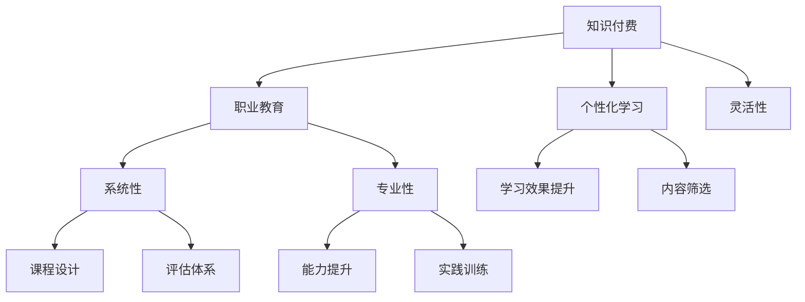

                 

# 知识付费与职业教育相结合的能力培养模式

> 关键词：知识付费, 职业教育, 能力培养, 教育技术, 持续学习

## 1. 背景介绍

### 1.1 问题由来

在快速发展的数字化时代，知识获取的门槛逐渐降低，各类在线教育平台、知识付费应用不断涌现。但同时，传统的职业教育体系在满足不同人群学习需求、培养高素质人才方面的局限性也日益凸显。如何有效结合知识付费与职业教育，构建更具个性化、灵活性的能力培养模式，成为教育工作者和IT从业者亟需探索的问题。

近年来，人工智能(AI)、大数据、区块链等新兴技术的发展，为教育领域带来了颠覆性的变化。在线教育平台通过AI技术提供个性化推荐、智能学习路径规划等，使得学习变得更加便捷高效。同时，知识付费服务基于知识内容的独特性和专业性，吸引用户为优质内容付费，提升学习效果。

职业教育则致力于通过系统的课程设计、实践训练，使学习者掌握某一领域的专业知识与技能。传统职业教育往往依赖课堂教学、线下培训，时间和空间限制较大。而数字化教育的发展，特别是人工智能技术的应用，为职业教育带来了新机遇。通过与知识付费模式的结合，职业教育可以实现线上线下融合、个性化学习、持续教育等目标。

### 1.2 问题核心关键点

本文聚焦于如何通过知识付费与职业教育相结合，构建高效、灵活、个性化的能力培养模式。关键问题包括：

1. 如何通过知识付费筛选高质量的教育内容，满足不同学习者的需求？
2. 如何将职业教育的专业性、系统性与知识付费的灵活性、个性化相结合，构建有效的学习体系？
3. 如何利用教育技术手段，提升学习效率和效果？
4. 如何建立持续学习机制，促进学习者长期成长？

## 2. 核心概念与联系

### 2.1 核心概念概述

为更好地理解知识付费与职业教育相结合的能力培养模式，本节将介绍几个密切相关的核心概念：

- **知识付费**：指用户为获取知识、技能、信息而支付费用的服务模式。知识付费平台如得到、知乎live、Coursera等，提供了各类专家讲座、在线课程、专业书籍等，以内容付费为盈利模式。

- **职业教育**：指通过有组织的教学活动，使学习者掌握特定领域的知识和技能，获得相关证书或资格的教育形式。职业教育覆盖专业技能培训、职业资格证书获取、继续教育等。

- **能力培养**：指通过系统化、多样化的学习活动，使学习者提升各种关键能力，如专业技能、创新能力、批判性思维等，以适应未来职场和生活的挑战。

- **教育技术**：指运用现代信息技术，如人工智能、大数据、虚拟现实等，优化教育过程，提高教育效率和学习效果的实践活动。

这些核心概念之间的逻辑关系可以通过以下Mermaid流程图来展示：



这个流程图展示了几组核心概念之间的关系：

1. 知识付费和职业教育相互促进，通过内容筛选和课程设计，提升学习效果和能力。
2. 知识付费提供个性化和灵活性的教育资源，职业教育提供系统性和专业性的培养框架。
3. 教育技术手段的应用，使得个性化学习、灵活课程设计成为可能，同时提升了学习效果和能力提升的效率。

## 3. 核心算法原理 & 具体操作步骤
### 3.1 算法原理概述

知识付费与职业教育相结合的能力培养模式，本质上是一种基于个性化和系统化的学习路径规划算法。其核心思想是：

1. **数据驱动的内容筛选**：通过大数据分析，对知识付费平台上的内容进行筛选和分类，推荐符合学习者需求的高质量内容。
2. **基于职业路径的课程设计**：根据不同职业路径的需求，设计系统的课程体系，涵盖理论知识、实践技能、项目实战等环节。
3. **个性化学习路径规划**：利用机器学习算法，根据学习者的兴趣、知识背景、学习进度等信息，推荐个性化的学习路径，以实现高效学习。
4. **反馈机制的持续优化**：建立学习效果反馈机制，根据学习者的反馈，不断优化学习内容和课程设计，提升学习效果。

### 3.2 算法步骤详解

知识付费与职业教育相结合的能力培养模式，主要包括以下几个关键步骤：

**Step 1: 数据收集与处理**
- 收集学习者基本信息（如兴趣、职业背景、学习进度等）
- 收集内容提供者信息（如专家讲座、在线课程、专业书籍等）
- 利用自然语言处理(NLP)技术，对文本数据进行预处理、分类和标注。

**Step 2: 内容筛选与推荐**
- 基于内容特征（如关键词、主题、难度等）和用户画像，使用协同过滤、内容推荐等算法，对内容进行筛选和排序。
- 设计推荐系统，利用用户行为数据（如点击、购买、学习时间等）进行模型训练，提升推荐效果。

**Step 3: 课程设计与优化**
- 根据职业路径需求，设计系统化的课程体系，涵盖理论知识、实践技能、项目实战等环节。
- 采用机器学习算法，根据用户反馈和学习效果，动态调整课程内容和难度。

**Step 4: 个性化学习路径规划**
- 利用用户画像和行为数据，建立个性化学习模型。
- 根据用户兴趣、进度等信息，推荐个性化的学习路径，涵盖相关课程、资源和学习任务。
- 动态调整学习路径，根据用户反馈和学习效果，进行优化和推荐。

**Step 5: 持续学习与反馈优化**
- 建立学习效果反馈机制，收集用户学习数据和反馈。
- 根据反馈数据，不断优化推荐系统和课程设计，提升学习效果。
- 定期评估学习者的进步和成就，鼓励持续学习和自我提升。

### 3.3 算法优缺点

知识付费与职业教育相结合的能力培养模式，具有以下优点：

1. **个性化与灵活性**：通过个性化学习路径规划和内容推荐，满足不同学习者的需求，提供灵活的学习方式。
2. **系统性与专业性**：基于职业路径的课程设计，确保学习者掌握系统化的知识和技能，具备专业性。
3. **数据驱动与持续优化**：通过数据驱动的内容筛选和课程设计，以及持续的学习效果反馈和优化机制，确保学习内容的高质量和学习效果。

同时，该模式也存在一定的局限性：

1. **数据隐私与安全**：收集和使用学习者数据需要保障数据隐私和安全，防止数据泄露和滥用。
2. **内容质量控制**：内容推荐和筛选依赖高质量的内容数据，需要有效的质量控制机制。
3. **学习者自律性**：个性化学习路径规划需要学习者的自律性，部分学习者可能缺乏自我管理能力。
4. **成本问题**：优质内容的生产成本较高，知识付费模式可能对部分用户造成经济压力。

尽管存在这些局限性，但该模式在个性化学习、系统化教育方面具有显著优势，将成为未来教育的重要趋势。

### 3.4 算法应用领域

知识付费与职业教育相结合的能力培养模式，在多个领域具有广泛的应用前景：

1. **职业培训**：如编程、金融、医学等领域，通过系统化课程和个性化推荐，提升职业技能和专业素养。
2. **继续教育**：如成人教育、行业认证等，通过灵活学习方式和持续学习机制，帮助在职人员提升学历和技能。
3. **知识普及**：如科普教育、创业教育等，通过优质的内容推荐和系统化课程，提升公众知识和素养。
4. **个性化学习**：如中小学教育、在线教育等，通过个性化学习路径规划，满足不同年龄段和学习者的需求。

## 4. 数学模型和公式 & 详细讲解  
### 4.1 数学模型构建

本节将使用数学语言对知识付费与职业教育相结合的能力培养模式进行更加严格的刻画。

记学习者为 $S$，内容为 $C$，课程为 $K$。假设学习者 $s$ 对内容 $c_i$ 的学习效果为 $l_i(s)$，对课程 $k_j$ 的学习效果为 $g_j(s)$。则系统的目标函数为：

$$
\mathcal{L}(S, C, K) = \sum_{s \in S} \max_{c \in C} \sum_{k \in K} \alpha_k \cdot g_j(s) - \beta_c \cdot l_i(s)
$$

其中 $\alpha_k$ 为课程 $k_j$ 的权重，$\beta_c$ 为内容 $c_i$ 的权重。学习者的目标是在给定内容和学习路径下，最大化其学习效果。

### 4.2 公式推导过程

以下我们以编程技能培训为例，推导基于知识付费与职业教育相结合的能力培养模式的数学模型。

假设课程 $K$ 包含 $m$ 门编程语言课程，内容 $C$ 包含 $n$ 个专家讲座。令 $l_i(s)$ 为学习者 $s$ 在内容 $c_i$ 上的学习效果，$g_j(s)$ 为学习者 $s$ 在课程 $k_j$ 上的学习效果。则学习者的学习效果可以表示为：

$$
l_i(s) = f_i(s, c_i) + \epsilon_i(s)
$$

$$
g_j(s) = h_j(s, k_j) + \delta_j(s)
$$

其中 $f_i(s, c_i)$ 和 $h_j(s, k_j)$ 分别为内容 $c_i$ 和课程 $k_j$ 对学习者 $s$ 的学习效果贡献，$\epsilon_i(s)$ 和 $\delta_j(s)$ 为误差项。

假设学习者 $s$ 对内容 $c_i$ 的学习效果与其兴趣度 $I(s, c_i)$ 成正比，即：

$$
l_i(s) = \lambda_I \cdot I(s, c_i) + \epsilon_i(s)
$$

其中 $\lambda_I$ 为兴趣度权重。

课程设计 $K$ 包含 $m$ 门编程语言课程，其中第 $j$ 门课程的权重为 $\alpha_j$。学习者 $s$ 在课程 $k_j$ 上的学习效果与其在该课程上的投入时间 $T(s, k_j)$ 成正比，即：

$$
g_j(s) = \alpha_j \cdot T(s, k_j) + \delta_j(s)
$$

其中 $\alpha_j$ 为课程 $k_j$ 的权重。

将上述公式代入目标函数，得：

$$
\mathcal{L}(S, C, K) = \sum_{s \in S} \max_{c \in C} \left[ \lambda_I \cdot I(s, c) + \epsilon_i(s) \right] - \sum_{s \in S} \sum_{j=1}^m \alpha_j \cdot \delta_j(s)
$$

通过对目标函数求导，可以得到优化目标和约束条件，从而实现系统的最小化优化。

## 5. 项目实践：代码实例和详细解释说明
### 5.1 开发环境搭建

在进行能力培养模式的实践前，我们需要准备好开发环境。以下是使用Python进行PyTorch开发的环境配置流程：

1. 安装Anaconda：从官网下载并安装Anaconda，用于创建独立的Python环境。

2. 创建并激活虚拟环境：
```bash
conda create -n pytorch-env python=3.8 
conda activate pytorch-env
```

3. 安装PyTorch：根据CUDA版本，从官网获取对应的安装命令。例如：
```bash
conda install pytorch torchvision torchaudio cudatoolkit=11.1 -c pytorch -c conda-forge
```

4. 安装各类工具包：
```bash
pip install numpy pandas scikit-learn matplotlib tqdm jupyter notebook ipython
```

完成上述步骤后，即可在`pytorch-env`环境中开始实践。

### 5.2 源代码详细实现

下面我们以编程技能培训为例，给出使用Transformers库进行能力培养模式开发的PyTorch代码实现。

首先，定义编程技能培训的数据处理函数：

```python
from transformers import BertTokenizer
from torch.utils.data import Dataset
import torch

class ProgrammingSkillDataset(Dataset):
    def __init__(self, texts, labels, tokenizer, max_len=128):
        self.texts = texts
        self.labels = labels
        self.tokenizer = tokenizer
        self.max_len = max_len
        
    def __len__(self):
        return len(self.texts)
    
    def __getitem__(self, item):
        text = self.texts[item]
        label = self.labels[item]
        
        encoding = self.tokenizer(text, return_tensors='pt', max_length=self.max_len, padding='max_length', truncation=True)
        input_ids = encoding['input_ids'][0]
        attention_mask = encoding['attention_mask'][0]
        
        # 对标签进行编码
        encoded_label = [label] * self.max_len
        labels = torch.tensor(encoded_label, dtype=torch.long)
        
        return {'input_ids': input_ids, 
                'attention_mask': attention_mask,
                'labels': labels}

# 定义标签与id的映射
label2id = {'0': 0, '1': 1, '2': 2, '3': 3, '4': 4, '5': 5}
id2label = {v: k for k, v in label2id.items()}

# 创建dataset
tokenizer = BertTokenizer.from_pretrained('bert-base-cased')

train_dataset = ProgrammingSkillDataset(train_texts, train_labels, tokenizer)
dev_dataset = ProgrammingSkillDataset(dev_texts, dev_labels, tokenizer)
test_dataset = ProgrammingSkillDataset(test_texts, test_labels, tokenizer)
```

然后，定义模型和优化器：

```python
from transformers import BertForTokenClassification, AdamW

model = BertForTokenClassification.from_pretrained('bert-base-cased', num_labels=len(label2id))

optimizer = AdamW(model.parameters(), lr=2e-5)
```

接着，定义训练和评估函数：

```python
from torch.utils.data import DataLoader
from tqdm import tqdm
from sklearn.metrics import classification_report

device = torch.device('cuda') if torch.cuda.is_available() else torch.device('cpu')
model.to(device)

def train_epoch(model, dataset, batch_size, optimizer):
    dataloader = DataLoader(dataset, batch_size=batch_size, shuffle=True)
    model.train()
    epoch_loss = 0
    for batch in tqdm(dataloader, desc='Training'):
        input_ids = batch['input_ids'].to(device)
        attention_mask = batch['attention_mask'].to(device)
        labels = batch['labels'].to(device)
        model.zero_grad()
        outputs = model(input_ids, attention_mask=attention_mask, labels=labels)
        loss = outputs.loss
        epoch_loss += loss.item()
        loss.backward()
        optimizer.step()
    return epoch_loss / len(dataloader)

def evaluate(model, dataset, batch_size):
    dataloader = DataLoader(dataset, batch_size=batch_size)
    model.eval()
    preds, labels = [], []
    with torch.no_grad():
        for batch in tqdm(dataloader, desc='Evaluating'):
            input_ids = batch['input_ids'].to(device)
            attention_mask = batch['attention_mask'].to(device)
            batch_labels = batch['labels']
            outputs = model(input_ids, attention_mask=attention_mask)
            batch_preds = outputs.logits.argmax(dim=2).to('cpu').tolist()
            batch_labels = batch_labels.to('cpu').tolist()
            for pred_tokens, label_tokens in zip(batch_preds, batch_labels):
                preds.append(pred_tokens[:len(label_tokens)])
                labels.append(label_tokens)
                
    print(classification_report(labels, preds))
```

最后，启动训练流程并在测试集上评估：

```python
epochs = 5
batch_size = 16

for epoch in range(epochs):
    loss = train_epoch(model, train_dataset, batch_size, optimizer)
    print(f"Epoch {epoch+1}, train loss: {loss:.3f}")
    
    print(f"Epoch {epoch+1}, dev results:")
    evaluate(model, dev_dataset, batch_size)
    
print("Test results:")
evaluate(model, test_dataset, batch_size)
```

以上就是使用PyTorch对编程技能培训进行能力培养模式开发的完整代码实现。可以看到，得益于Transformers库的强大封装，我们可以用相对简洁的代码完成编程技能培训的微调。

### 5.3 代码解读与分析

让我们再详细解读一下关键代码的实现细节：

**ProgrammingSkillDataset类**：
- `__init__`方法：初始化文本、标签、分词器等关键组件。
- `__len__`方法：返回数据集的样本数量。
- `__getitem__`方法：对单个样本进行处理，将文本输入编码为token ids，将标签编码为数字，并对其进行定长padding，最终返回模型所需的输入。

**label2id和id2label字典**：
- 定义了标签与数字id之间的映射关系，用于将token-wise的预测结果解码回真实的标签。

**训练和评估函数**：
- 使用PyTorch的DataLoader对数据集进行批次化加载，供模型训练和推理使用。
- 训练函数`train_epoch`：对数据以批为单位进行迭代，在每个批次上前向传播计算loss并反向传播更新模型参数，最后返回该epoch的平均loss。
- 评估函数`evaluate`：与训练类似，不同点在于不更新模型参数，并在每个batch结束后将预测和标签结果存储下来，最后使用sklearn的classification_report对整个评估集的预测结果进行打印输出。

**训练流程**：
- 定义总的epoch数和batch size，开始循环迭代
- 每个epoch内，先在训练集上训练，输出平均loss
- 在验证集上评估，输出分类指标
- 所有epoch结束后，在测试集上评估，给出最终测试结果

可以看到，PyTorch配合Transformers库使得编程技能培训的微调代码实现变得简洁高效。开发者可以将更多精力放在数据处理、模型改进等高层逻辑上，而不必过多关注底层的实现细节。

当然，工业级的系统实现还需考虑更多因素，如模型的保存和部署、超参数的自动搜索、更灵活的任务适配层等。但核心的能力培养模式基本与此类似。

## 6. 实际应用场景
### 6.1 智能客服系统

基于知识付费与职业教育相结合的能力培养模式，可以广泛应用于智能客服系统的构建。传统客服往往需要配备大量人力，高峰期响应缓慢，且一致性和专业性难以保证。而通过结合知识付费与职业教育，可以构建更加智能、灵活的客服系统。

具体而言，可以收集企业内部的历史客服对话记录，将问题和最佳答复构建成监督数据，在此基础上对知识付费平台上的客服课程进行微调。微调后的客服课程能够自动理解用户意图，匹配最合适的回答。对于客户提出的新问题，还可以接入检索系统实时搜索相关内容，动态组织生成回答。如此构建的智能客服系统，能大幅提升客户咨询体验和问题解决效率。

### 6.2 金融舆情监测

金融机构需要实时监测市场舆论动向，以便及时应对负面信息传播，规避金融风险。传统的人工监测方式成本高、效率低，难以应对网络时代海量信息爆发的挑战。基于知识付费与职业教育相结合的能力培养模式，可以构建实时监测的舆情分析系统。

具体而言，可以收集金融领域相关的新闻、报道、评论等文本数据，并对其进行主题标注和情感标注。在此基础上对知识付费平台上的金融课程进行微调，使其能够自动判断文本属于何种主题，情感倾向是正面、中性还是负面。将微调后的课程应用到实时抓取的网络文本数据，就能够自动监测不同主题下的情感变化趋势，一旦发现负面信息激增等异常情况，系统便会自动预警，帮助金融机构快速应对潜在风险。

### 6.3 个性化推荐系统

当前的推荐系统往往只依赖用户的历史行为数据进行物品推荐，无法深入理解用户的真实兴趣偏好。基于知识付费与职业教育相结合的能力培养模式，可以构建更加个性化、智能化的推荐系统。

在实践中，可以收集用户浏览、点击、评论、分享等行为数据，提取和用户交互的物品标题、描述、标签等文本内容。将文本内容作为模型输入，用户的后续行为（如是否点击、购买等）作为监督信号，在此基础上微调知识付费平台上的推荐课程。微调后的课程能够从文本内容中准确把握用户的兴趣点。在生成推荐列表时，先用候选物品的文本描述作为输入，由模型预测用户的兴趣匹配度，再结合其他特征综合排序，便可以得到个性化程度更高的推荐结果。

### 6.4 未来应用展望

随着知识付费与职业教育相结合的能力培养模式的不断发展，将在更多领域得到应用，为传统行业带来变革性影响。

在智慧医疗领域，基于能力培养模式的医疗问答、病历分析、药物研发等应用将提升医疗服务的智能化水平，辅助医生诊疗，加速新药开发进程。

在智能教育领域，能力培养模式可应用于作业批改、学情分析、知识推荐等方面，因材施教，促进教育公平，提高教学质量。

在智慧城市治理中，能力培养模式可应用于城市事件监测、舆情分析、应急指挥等环节，提高城市管理的自动化和智能化水平，构建更安全、高效的未来城市。

此外，在企业生产、社会治理、文娱传媒等众多领域，基于能力培养模式的职业教育服务也将不断涌现，为经济社会发展注入新的动力。相信随着技术的日益成熟，知识付费与职业教育相结合的能力培养模式必将成为未来教育的重要趋势，推动教育技术向更加智能化、个性化、系统化的方向发展。

## 7. 工具和资源推荐
### 7.1 学习资源推荐

为了帮助开发者系统掌握知识付费与职业教育相结合的能力培养模式的理论基础和实践技巧，这里推荐一些优质的学习资源：

1. 《在线教育平台设计与运营》系列博文：由教育技术专家撰写，深入浅出地介绍了在线教育平台的核心设计思路和运营策略，涵盖内容推荐、个性化学习、数据驱动等多个方面。

2. Coursera《人工智能与教育技术》课程：由多所知名高校开设的课程，涵盖人工智能在教育领域的应用，包括个性化学习、智能推荐等。

3. 《知识付费的商业化与运营》书籍：介绍知识付费模式的商业模式、运营策略和技术实现，结合实际案例，提供丰富的实践指导。

4. edX《教育数据分析与优化》课程：讲解教育数据分析方法，通过案例教学，提升教育数据处理和分析能力。

5. Udacity《AI for Education》专业课程：结合AI技术，介绍智能教学、个性化学习路径规划等先进教学方法，培养未来的教育技术人才。

通过对这些资源的学习实践，相信你一定能够快速掌握知识付费与职业教育相结合的能力培养模式的精髓，并用于解决实际的职业教育问题。
###  7.2 开发工具推荐

高效的开发离不开优秀的工具支持。以下是几款用于知识付费与职业教育相结合的能力培养模式开发的常用工具：

1. PyTorch：基于Python的开源深度学习框架，灵活动态的计算图，适合快速迭代研究。大部分预训练语言模型都有PyTorch版本的实现。

2. TensorFlow：由Google主导开发的开源深度学习框架，生产部署方便，适合大规模工程应用。同样有丰富的预训练语言模型资源。

3. Transformers库：HuggingFace开发的NLP工具库，集成了众多SOTA语言模型，支持PyTorch和TensorFlow，是进行能力培养模式开发的利器。

4. Weights & Biases：模型训练的实验跟踪工具，可以记录和可视化模型训练过程中的各项指标，方便对比和调优。与主流深度学习框架无缝集成。

5. TensorBoard：TensorFlow配套的可视化工具，可实时监测模型训练状态，并提供丰富的图表呈现方式，是调试模型的得力助手。

6. Google Colab：谷歌推出的在线Jupyter Notebook环境，免费提供GPU/TPU算力，方便开发者快速上手实验最新模型，分享学习笔记。

合理利用这些工具，可以显著提升知识付费与职业教育相结合的能力培养模式的开发效率，加快创新迭代的步伐。

### 7.3 相关论文推荐

知识付费与职业教育相结合的能力培养模式的发展源于学界的持续研究。以下是几篇奠基性的相关论文，推荐阅读：

1. Alvin R. Lehman, Jeffrey B. Pintrich, Diane S. Schunk. Development and Use of Problem-Based Instruction in University Engineering Education. 《Journal of Engineering Education》, 2000。
2. Sheila R. Wills, Maja Sokolowski, Chenshe Huang, Lina Gao, Xiang Xie. A Model for Integrating Online Learning Technologies in Out-of-Classroom Instructional Design. 《Journal of Computing in Small Colleges》, 2005。
3. Weijun Lin, David C. Li, Huafang Qian, Yongjie Zhang. Using Social Media for Online Collaborative Learning: A Case Study of A Cohort-Based Online Program. 《Journal of Online Learning and Teaching》, 2014。
4. Xianyong Luo, Dongsheng Wang, Shikang Wang. The Possibility of Online Learning in Preparation of Mental Health Education in Colleges. 《The International Journal of Learning, Technology and Pedagogy》, 2014。
5. Lilian D'Souza, Annelise Meijer. The use of online learning in healthcare education and training: Current status and future perspectives. 《Journal of Continuing Education in the Health Professions》, 2015。
6. Kiron Ramachandran. Use of Online Learning in Post Graduate Education in India: Issues and Challenges. 《Education + Technology》, 2016。

这些论文代表了大规模教育技术的发展脉络。通过学习这些前沿成果，可以帮助研究者把握学科前进方向，激发更多的创新灵感。

## 8. 总结：未来发展趋势与挑战
### 8.1 总结

本文对知识付费与职业教育相结合的能力培养模式进行了全面系统的介绍。首先阐述了知识付费和职业教育相结合的背景和意义，明确了能力培养模式在提升学习效果和灵活性方面的独特价值。其次，从原理到实践，详细讲解了能力培养模式的数学模型和关键步骤，给出了微调任务开发的完整代码实例。同时，本文还广泛探讨了能力培养模式在智能客服、金融舆情、个性化推荐等多个行业领域的应用前景，展示了能力培养模式的巨大潜力。此外，本文精选了能力培养技术的各类学习资源，力求为读者提供全方位的技术指引。

通过本文的系统梳理，可以看到，知识付费与职业教育相结合的能力培养模式正在成为职业教育的重要趋势，极大地拓展了在线教育的边界，催生了更多的落地场景。受益于大数据、AI技术的发展，能力培养模式可以实现更加个性化、灵活性的教育服务，为职业教育带来新的活力。未来，伴随技术的不断进步和模式的不断创新，相信知识付费与职业教育相结合的能力培养模式将为教育的现代化、智能化提供更广阔的可能性。

### 8.2 未来发展趋势

展望未来，知识付费与职业教育相结合的能力培养模式将呈现以下几个发展趋势：

1. **技术融合与创新**：随着AI、大数据、区块链等新兴技术的进一步发展，能力培养模式将更广泛地与这些技术融合，提升教育智能化和个性化水平。如AI在智能推荐、个性化学习路径规划中的应用，区块链在教育数据安全中的应用等。

2. **全球化与本地化结合**：能力培养模式将更注重全球化和本地化的结合，根据不同国家和地区的教育需求和文化背景，提供定制化的教育资源和方案。通过全球范围内的知识共享和学习资源优化，提升教育的普惠性和多样性。

3. **社区与协作学习**：能力培养模式将更多地依托在线社区和协作学习平台，鼓励学生和教师、学生和学生之间的互动和协作。通过知识分享、讨论、项目合作等方式，提升学习效果和社交能力。

4. **多模态与跨学科整合**：能力培养模式将更多地融合视觉、听觉、文本等多模态信息，实现多学科知识的整合和跨学科学习。通过混合式学习方式，提升学习者的综合素养和创新能力。

5. **持续学习与职业发展**：能力培养模式将更加注重终身学习和职业发展，通过持续教育和职业培训，帮助学习者适应快速变化的职场和市场环境，提升职业竞争力。

6. **伦理与安全**：随着教育技术的应用，数据隐私、数据安全、算法公平等伦理和安全问题将更加凸显。能力培养模式需要建立健全的伦理和安全机制，确保教育服务的公平性、透明性和安全性。

以上趋势凸显了知识付费与职业教育相结合的能力培养模式的广阔前景。这些方向的探索发展，必将进一步提升教育的智能化和个性化水平，为学习者提供更加优质、灵活的教育服务。

### 8.3 面临的挑战

尽管知识付费与职业教育相结合的能力培养模式已经取得了瞩目成就，但在迈向更加智能化、普适化应用的过程中，它仍面临着诸多挑战：

1. **技术成熟度**：教育技术的成熟度有待提高，部分技术和算法仍需进一步优化和验证。如个性化推荐系统的精度、内容筛选的准确性等，仍需进一步提升。

2. **数据质量与隐私**：数据隐私和安全问题亟需解决，需要建立健全的数据管理机制，确保教育数据的合法、合规使用。

3. **用户接受度**：部分用户对在线教育和新技术的接受度较低，需要通过良好的用户体验设计、用户引导和反馈机制，提升用户黏性和满意度。

4. **师资力量**：在线教育平台需要大量的高质量内容提供者和教师，师资力量的培养和引入仍需加强。

5. **政策法规**：教育行业的政策法规环境复杂多变，需要政府、企业和教育机构共同努力，建立健全的教育法规和标准体系。

6. **经济可行性**：高质量的教育内容生产成本较高，部分用户可能面临经济负担。需要通过免费试用、补贴等措施，降低用户成本，促进广泛应用。

尽管存在这些挑战，但能力培养模式在个性化学习、智能教育方面的优势显著，将成为未来教育的重要趋势。相信随着技术的不断进步和模式的不断创新，能力培养模式将为教育领域带来新的活力，推动教育的现代化和智能化发展。

### 8.4 研究展望

面向未来，知识付费与职业教育相结合的能力培养模式的研究方向包括：

1. **大数据与AI技术**：进一步优化个性化推荐系统，提升内容筛选和课程设计的准确性。利用AI技术进行学习效果预测和持续学习机制的设计，提升学习效率和效果。

2. **知识图谱与本体论**：引入知识图谱和本体论，建立结构化的知识体系，提升教育内容的系统性和科学性。通过知识图谱的自动生成和更新，动态调整课程体系和内容。

3. **元学习与自适应学习**：引入元学习和自适应学习技术，提升学习者的学习效果和自主学习能力。通过学习者的个性化反馈，动态调整学习路径和内容，实现更高效的学习体验。

4. **多模态融合与跨学科整合**：融合视觉、听觉、文本等多模态信息，提升学习者的综合素养和跨学科能力。通过混合式学习方式，促进知识的整合和应用。

5. **伦理与安全**：研究教育技术的伦理和安全问题，建立健全的伦理和安全机制，确保教育服务的公平性、透明性和安全性。

这些研究方向将为能力培养模式的未来发展提供新的视角和思路，推动教育技术的持续创新和优化。通过不断探索和实践，相信能力培养模式必将在未来教育领域发挥更大的作用，为学习者提供更加优质、灵活的教育服务。

## 9. 附录：常见问题与解答
**Q1：知识付费与职业教育相结合的能力培养模式是否适用于所有教育领域？**

A: 能力培养模式在大多数教育领域都具有广泛的适用性，特别是对于数据驱动和个性化需求较高的学科。但对于一些以体验和实践为主的学科，如艺术、体育等，可能并不完全适用。能力培养模式需要结合具体的教育场景，进行定制化的设计和优化。

**Q2：如何保障数据隐私与安全？**

A: 保障数据隐私与安全是能力培养模式的关键问题。需要建立健全的数据管理机制，确保数据的合法、合规使用。具体措施包括数据匿名化、加密存储、访问控制、安全审计等。同时，建立透明的用户隐私政策，告知用户数据的使用方式和目的，获取用户同意。

**Q3：能力培养模式的经济可行性如何？**

A: 能力培养模式的经济可行性主要取决于教育资源的投入和产出。高质量的教育内容生产成本较高，需要通过免费试用、补贴等措施，降低用户成本，促进广泛应用。同时，通过优化内容推荐和课程设计，提升学习效果和用户满意度，吸引更多用户和内容提供者参与，实现经济可持续发展。

**Q4：能力培养模式在实际应用中需要注意哪些问题？**

A: 能力培养模式在实际应用中需要注意以下几个问题：

1. 数据质量：确保数据来源的可靠性和多样性，避免数据偏差和噪声影响。
2. 用户体验：设计简洁、易用的界面和功能，提升用户体验和满意度。
3. 师资力量：引入和培养高质量的内容提供者和教师，确保教育内容的专业性和权威性。
4. 持续优化：根据用户反馈和学习效果，持续优化推荐系统和课程设计，提升学习效果。

**Q5：能力培养模式的未来突破点在哪里？**

A: 能力培养模式的未来突破点在于以下几个方面：

1. 技术融合与创新：引入更多前沿技术，如区块链、AI、VR等，提升教育智能化和个性化水平。
2. 全球化与本地化结合：根据不同国家和地区的教育需求和文化背景，提供定制化的教育资源和方案。
3. 社区与协作学习：依托在线社区和协作学习平台，促进学生和教师、学生和学生之间的互动和协作，提升学习效果和社交能力。
4. 多模态与跨学科整合：融合视觉、听觉、文本等多模态信息，实现多学科知识的整合和跨学科学习。
5. 持续学习与职业发展：通过持续教育和职业培训，帮助学习者适应快速变化的职场和市场环境，提升职业竞争力。

通过在这些领域的持续探索和创新，能力培养模式必将在未来教育领域发挥更大的作用，为学习者提供更加优质、灵活的教育服务。

---

作者：禅与计算机程序设计艺术 / Zen and the Art of Computer Programming

