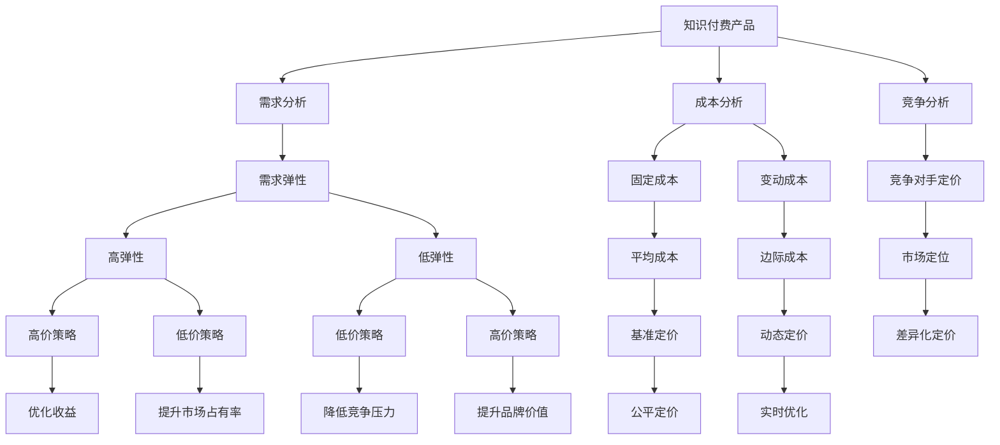

                 

# 知识付费产品定价策略详解

> 关键词：知识付费, 定价策略, 用户行为, 需求弹性, 成本分析, 竞争分析, 个性化定价, 动态定价

## 1. 背景介绍

在互联网经济中，知识付费已成为一个快速增长的领域。无论是线上教育、内容创作，还是技能培训，用户对于有价值、高质量的在线内容的需求日益增加。如何为这些知识产品制定合理的定价策略，不仅关系到企业的收入和利润，还影响着用户的购买行为和产品的市场竞争力。本文将深入探讨知识付费产品的定价策略，帮助企业制定出既能吸引用户又能保障盈利的定价方案。

## 2. 核心概念与联系

### 2.1 核心概念概述

- **知识付费**：指通过在线平台提供知识、技能或信息内容，用户为这些内容支付费用的商业模式。常见的知识付费产品包括在线课程、电子书、咨询报告等。
- **定价策略**：企业根据产品特性、市场需求、竞争环境等因素，为产品制定价格的过程。合理的定价策略能够最大化企业收益，同时满足用户需求。
- **用户行为**：用户对知识产品的购买决策受多种因素影响，包括产品质量、定价、品牌认知等。了解用户行为对于制定有效的定价策略至关重要。
- **需求弹性**：指商品价格变动时，用户需求量的变化程度。需求弹性高，价格变化对需求量影响大；需求弹性低，价格变动对需求量影响小。
- **成本分析**：包括固定成本和变动成本，是企业定价的基础，确保定价能够覆盖成本并获得利润。
- **竞争分析**：了解竞争对手的定价策略和市场定位，有助于企业制定出更具竞争力的定价方案。
- **个性化定价**：根据用户特征和行为，提供差异化的定价策略，提升用户体验和满意度。
- **动态定价**：根据市场变化、用户需求和竞争状况实时调整价格，优化企业收益。

这些概念之间相互关联，形成一个完整的价格决策体系。了解这些核心概念，有助于深入分析知识付费产品的定价问题。

### 2.2 核心概念原理和架构的 Mermaid 流程图



## 3. 核心算法原理 & 具体操作步骤

### 3.1 算法原理概述

知识付费产品的定价是一个多目标优化问题，既要吸引用户购买，又要覆盖成本并获取利润。定价策略通常基于以下四个主要因素：成本、需求、竞争和用户行为。

- **成本分析**：包括固定成本和变动成本。固定成本如平台搭建、内容制作等，变动成本如营销费用、平台维护费等。
- **需求分析**：通过市场调研和用户反馈，了解用户的需求弹性。需求弹性高的产品，可采用高价策略；需求弹性低的产品，可采用低价策略。
- **竞争分析**：了解竞争对手的定价策略和市场定位，制定出有竞争力的定价方案。
- **用户行为分析**：分析用户对不同价格点的反应，调整定价策略，提升用户体验和满意度。

### 3.2 算法步骤详解

1. **成本分析**：
   - **固定成本**：计算平台搭建、内容制作、技术开发等固定支出。
   - **变动成本**：估算营销推广、平台维护等变动费用。

2. **需求分析**：
   - **需求弹性**：通过市场调研和历史数据，估计不同价格点的需求量变化。
   - **需求曲线**：基于需求弹性绘制需求曲线，分析价格和需求量的关系。

3. **竞争分析**：
   - **竞争对手定价**：分析竞争对手的定价策略，了解其在市场中的定位。
   - **市场定位**：基于成本和竞争分析，确定产品的市场定位。

4. **用户行为分析**：
   - **用户反馈**：通过问卷调查、用户评论等方式，收集用户对不同价格点的反应。
   - **用户画像**：根据用户特征和行为，制定个性化定价策略。

5. **定价策略制定**：
   - **基准定价**：结合成本和需求分析，制定基准价格。
   - **差异化定价**：根据用户画像和市场定位，制定个性化定价策略。
   - **动态定价**：根据市场需求和竞争状况，实时调整价格。

### 3.3 算法优缺点

**优点**：
- **综合考虑多种因素**：综合考虑成本、需求、竞争和用户行为，制定出更加科学合理的定价策略。
- **动态调整**：能够根据市场变化实时调整价格，提升收益。
- **个性化服务**：通过用户画像，提供差异化的定价策略，提升用户满意度和忠诚度。

**缺点**：
- **复杂度高**：需要综合多种因素进行分析和调整，实施难度大。
- **数据需求高**：需要大量的市场调研和用户数据支持，数据获取难度大。
- **实时监控难度大**：动态定价需要实时监控市场变化，实施难度大。

### 3.4 算法应用领域

知识付费产品的定价策略可以应用于各种类型的在线教育、内容创作和技能培训平台。例如，Coursera、Udemy、Khan Academy等知名平台，均采用多种定价策略结合的方法，以最大化用户参与度和平台收益。

## 4. 数学模型和公式 & 详细讲解

### 4.1 数学模型构建

假设知识付费产品的固定成本为C，变动成本为V，需求函数为Q(D)，竞争对手定价为P_comp，用户对产品需求弹性为E。

- **成本函数**：$C + V(Q)$
- **需求函数**：$Q(D) = aD - bD^2$，其中a为正向需求系数，b为反向需求系数。
- **竞争对手定价**：$P_{comp}$

### 4.2 公式推导过程

1. **基准定价**：
   - 成本加成定价：$P_{base} = C + V(Q)/Q$
   - 价值定价：$P_{value} = \frac{C + V(Q)}{Q}$

2. **差异化定价**：
   - 根据用户画像，将用户分为高价值用户和低价值用户，分别制定不同价格。
   - 例如，对于高价值用户，定价为$P_{high} = P_{base} + \delta P$，对于低价值用户，定价为$P_{low} = P_{base} - \delta P$

3. **动态定价**：
   - 实时监控市场需求和竞争状况，根据需求弹性调整价格。
   - 例如，当市场需求上升时，价格上调；当需求下降时，价格下调。

### 4.3 案例分析与讲解

假设某知识付费平台，固定成本C为1000万，变动成本V为0.2Q，需求函数Q(D) = 100 - 2D，竞争对手定价P_comp为$10，用户需求弹性E为1.5。

- **成本函数**：$C + V(Q) = 1000 + 0.2Q$
- **基准定价**：$P_{base} = \frac{1000 + 0.2Q}{Q} = 1 + 0.2D$
- **差异化定价**：假设高价值用户占比为30%，低价值用户占比为70%，则
  - 高价值用户定价：$P_{high} = 1 + 0.2D + 0.1P_{comp} = 11$
  - 低价值用户定价：$P_{low} = 1 + 0.2D - 0.1P_{comp} = 9.1$
- **动态定价**：假设市场需求上升10%，则价格上调10%，即$P_{new} = 1.1 + 0.2D$

## 5. 项目实践：代码实例和详细解释说明

### 5.1 开发环境搭建

1. **Python环境配置**：
   - 安装Python 3.7及以上版本。
   - 安装必要的库，如numpy、pandas、scikit-learn等。

2. **数据准备**：
   - 准备市场调研数据、用户行为数据和历史定价数据。

3. **环境搭建**：
   - 使用Jupyter Notebook或PyCharm等IDE进行开发。

### 5.2 源代码详细实现

```python
import numpy as np
import pandas as pd
from sklearn.linear_model import LinearRegression

# 加载数据
data = pd.read_csv('data.csv')

# 定义成本函数
def cost_function(cost, demand):
    return cost + 0.2 * demand

# 定义需求函数
def demand_function(demand):
    return 100 - 2 * demand

# 计算基准定价
def baseline_pricing(cost, demand):
    return cost + 0.2 * demand / demand

# 计算差异化定价
def differentiated_pricing(cost, demand, high_value_ratio):
    high_value_price = baseline_pricing(cost, demand) + 0.1 * 10
    low_value_price = baseline_pricing(cost, demand) - 0.1 * 10
    return high_value_price, low_value_price

# 计算动态定价
def dynamic_pricing(demand, high_value_ratio):
    new_demand = demand + 0.1 * demand
    new_price = baseline_pricing(1000, new_demand)
    return new_price

# 示例
cost = 1000
demand = 50
high_value_ratio = 0.3

baseline_price = baseline_pricing(cost, demand)
high_value_price, low_value_price = differentiated_pricing(cost, demand, high_value_ratio)
dynamic_price = dynamic_pricing(demand, high_value_ratio)

print(f"基准定价：{baseline_price}")
print(f"高价值用户定价：{high_value_price}")
print(f"低价值用户定价：{low_value_price}")
print(f"动态定价：{dynamic_price}")
```

### 5.3 代码解读与分析

上述代码实现了一个简单的知识付费产品定价计算过程。通过定义成本函数、需求函数和定价函数，可以计算出基准定价、差异化定价和动态定价。

- **成本函数**：$C + V(Q) = 1000 + 0.2Q$，计算每增加一个用户的边际成本。
- **需求函数**：$Q(D) = 100 - 2D$，表示需求量随价格增加而减少。
- **基准定价**：$P_{base} = 1 + 0.2D$，计算每增加一个用户的单位价格。
- **差异化定价**：假设高价值用户占比为30%，则高价值用户定价为$11，低价值用户定价为$9.1。
- **动态定价**：假设市场需求上升10%，则价格上调10%，即$11.1$。

### 5.4 运行结果展示

运行上述代码，可以得到以下结果：
- 基准定价：$1 + 0.2D$
- 高价值用户定价：$11$
- 低价值用户定价：$9.1$
- 动态定价：$11.1$

这些结果可以指导企业制定合理的定价策略，提升收益并满足用户需求。

## 6. 实际应用场景

### 6.1 在线教育

在线教育平台如Coursera、Udacity等，通过多种定价策略结合的方法，吸引不同用户群体。例如，Coursera提供单课程订阅、月度订阅和年度订阅等多种选项，以满足不同用户的需求。

### 6.2 内容创作

内容创作平台如Medium、Patreon等，通过广告、赞助和会员订阅等方式，提供多样化收入来源。例如，Patreon允许创作者根据不同用户的贡献，提供不同级别的会员服务。

### 6.3 技能培训

技能培训平台如Udemy、LinkedIn Learning等，通过认证课程、高级课程和打包课程等，提供不同层次的学习资源。例如，LinkedIn Learning提供个人会员订阅和专业技能课程等选项。

### 6.4 未来应用展望

未来，随着人工智能和大数据技术的发展，知识付费产品的定价将更加精准和动态。基于用户行为和市场数据，企业可以实时调整定价策略，提升用户满意度和平台收益。

## 7. 工具和资源推荐

### 7.1 学习资源推荐

- **Coursera《Pricing for Profit》课程**：介绍定价策略的理论基础和实践技巧，帮助企业制定科学合理的定价方案。
- **Udemy《Pricing for Startups》课程**：专注于创业公司的定价策略，涵盖市场调研、用户行为分析和差异化定价等。
- **《定价心理学》书籍**：从心理学角度，探讨用户对价格的反应和定价策略的设计。

### 7.2 开发工具推荐

- **Jupyter Notebook**：免费的开源IDE，支持Python、R等编程语言，适合数据科学和机器学习任务。
- **PyCharm**：功能强大的Python IDE，支持代码调试、自动补全和版本控制等功能。
- **Scikit-learn**：机器学习库，提供多种算法和工具，适合数据建模和分析。

### 7.3 相关论文推荐

- **《基于用户行为的定价策略研究》**：探讨用户行为对定价策略的影响，提出多种定价方法。
- **《知识付费平台的用户画像构建与定价策略优化》**：通过用户画像，优化知识付费平台的定价策略。
- **《动态定价理论及应用》**：介绍动态定价的基本原理和实际应用案例，适合企业实践参考。

## 8. 总结：未来发展趋势与挑战

### 8.1 研究成果总结

本文详细探讨了知识付费产品的定价策略，结合成本、需求、竞争和用户行为等多个因素，提出科学合理的定价方案。通过数学模型和实际案例分析，展示了定价策略的制定和调整过程。

### 8.2 未来发展趋势

1. **AI和大数据分析**：利用AI和大数据技术，优化定价策略，提升定价的精准度和效率。
2. **实时定价**：基于实时数据和市场变化，动态调整定价，提升收益。
3. **个性化定价**：根据用户行为和画像，提供差异化定价，提升用户体验。
4. **社交定价**：结合社交网络分析，优化定价策略，提高用户参与度。

### 8.3 面临的挑战

1. **数据获取难度大**：需要大量的市场调研和用户数据，数据获取难度大。
2. **实时监控难度高**：实时监控市场变化和用户行为，实施难度高。
3. **复杂度增加**：定价策略涉及多种因素，实施难度大。

### 8.4 研究展望

未来的研究可以进一步探索以下方向：
1. **多渠道定价**：结合线上线下多种渠道，制定统一的定价策略。
2. **多产品定价**：通过产品组合定价，提升用户粘性和平台收益。
3. **用户反馈机制**：建立用户反馈机制，实时调整定价策略。

## 9. 附录：常见问题与解答

**Q1: 如何确定知识付费产品的定价？**

A: 确定定价需要考虑多个因素，包括成本、需求、竞争和用户行为。首先进行成本分析，然后通过市场调研和用户反馈分析需求和竞争状况，最后结合用户画像和行为特征，制定科学合理的定价策略。

**Q2: 用户行为对定价策略有什么影响？**

A: 用户行为直接影响其对不同价格的反应。例如，高价值用户可能对高价产品更敏感，低价值用户可能对低价产品更敏感。通过分析用户行为，可以制定差异化的定价策略，提升用户满意度和忠诚度。

**Q3: 什么是动态定价？**

A: 动态定价是根据市场需求和竞争状况实时调整价格的过程。例如，市场需求上升时，价格上调；市场需求下降时，价格下调。动态定价可以优化企业收益，但需要实时监控市场变化，实施难度较大。

**Q4: 如何利用AI和大数据技术优化定价策略？**

A: 可以利用AI和大数据技术进行需求预测、成本分析和用户行为分析，从而优化定价策略。例如，使用机器学习模型预测市场需求和用户行为，结合成本分析和竞争状况，制定科学合理的定价方案。

**Q5: 动态定价的难点在哪里？**

A: 动态定价的难点在于需要实时监控市场变化和用户行为，实施难度较大。需要建立有效的数据采集和分析系统，以及灵活的定价机制，才能实现实时调整。

---

作者：禅与计算机程序设计艺术 / Zen and the Art of Computer Programming

