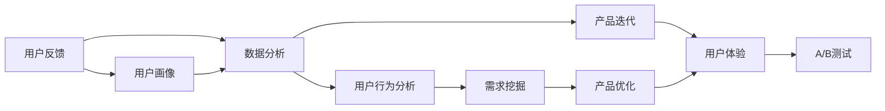

                 

# 知识付费产品的用户反馈收集与迭代优化

## 1. 背景介绍

随着互联网和信息技术的快速发展，知识付费逐渐成为了一种新型的互联网经济模式，为人们提供专业、有价值的知识和技能学习。越来越多的平台和应用涌现出来，如《得到》、《知乎live》、《喜马拉雅》等，为学习者提供了丰富的课程和讲座。然而，尽管市场规模不断扩大，知识付费产品的用户反馈问题也日益突出。为了满足用户需求，持续提升产品体验，知识付费平台亟需建立一套全面的用户反馈收集和迭代优化机制。

## 2. 核心概念与联系

### 2.1 核心概念概述

为更好地理解用户反馈收集与迭代优化方法，本节将介绍几个核心概念：

- **用户反馈**：用户在使用知识付费产品时，对于内容、界面、交互、功能等各个方面的使用感受和建议。
- **数据分析**：从用户反馈中提取有价值的信息，统计分析用户的喜好、行为和需求，为产品迭代提供数据支持。
- **产品迭代**：根据用户反馈和数据分析结果，改进和优化产品的功能、设计、性能等各方面，提升用户体验。
- **用户体验(UX)**：产品的易用性、可访问性、满意度等各方面的综合评价。
- **A/B测试**：通过对比两个或多个版本的产品，来验证特定改进或优化是否有效。
- **用户画像**：对用户群体特征的抽象描述，有助于理解不同用户群体的需求和行为模式。

这些概念之间具有密切的联系，形成了知识付费产品用户反馈收集与迭代优化的整体框架。用户反馈是数据收集的基础，数据分析为迭代优化提供依据，产品迭代是优化过程的实现，用户体验是最终的目标。

### 2.2 核心概念原理和架构的 Mermaid 流程图



这个流程图展示了大语言模型的核心概念及其之间的关系：

1. 用户反馈从多渠道进入数据收集系统。
2. 数据分析提取用户行为数据和用户画像，发现用户需求。
3. 根据需求挖掘结果，进行产品优化和功能改进。
4. A/B测试验证改进效果，优化用户体验。
5. 通过不断迭代，提升产品的整体性能。

## 3. 核心算法原理 & 具体操作步骤

### 3.1 算法原理概述

用户反馈收集与迭代优化方法，本质上是一个循环迭代的过程。其核心思想是通过不断收集和分析用户反馈，识别产品的缺陷和不足，并针对性地进行优化和改进，以提升产品的用户体验。

形式化地，假设知识付费产品 $P$，用户反馈为 $F$，通过 $Analyze(F)$ 分析函数得到产品改进需求 $D$，改进后的产品记为 $P'$，则迭代优化的目标可以表示为：

$$
P' = \mathop{\arg\min}_{P} \lVert P - Analyze(F) \rVert
$$

其中 $\lVert \cdot \rVert$ 表示范数，即改进后的产品 $P'$ 与用户需求 $D$ 之间的距离。

通过梯度下降等优化算法，迭代过程不断更新产品参数 $P$，最小化距离 $d$，使得产品 $P'$ 尽可能接近用户需求 $D$。由于 $P$ 已经通过用户反馈和数据分析获得了较好的初始化，因此即便在有限的迭代次数下，也能逐步逼近理想产品 $P'$。

### 3.2 算法步骤详解

基于用户反馈收集与迭代优化方法，本节将详细讲解具体步骤：

**Step 1: 收集用户反馈**

- 通过应用内反馈按钮、在线问卷、客服对话、社交媒体等渠道，收集用户的反馈信息。
- 反馈信息包括用户对课程内容、界面设计、功能体验等方面的意见和建议。

**Step 2: 数据分析**

- 对收集到的反馈数据进行清洗、去重、分类和统计。
- 使用机器学习算法，如K-Means、PCA等，对用户行为进行聚类分析，生成用户画像。
- 分析用户评论的情感倾向，使用自然语言处理技术，如情感分析、主题建模等，提取有价值的信息。

**Step 3: 产品迭代**

- 根据用户画像和需求分析结果，确定产品改进的方向和优先级。
- 针对核心功能进行优化，如课程推荐、内容质量、用户界面等。
- 实施产品改进，并通过A/B测试评估效果。

**Step 4: 用户体验评估**

- 使用用户满意度调查、用户流失率、产品使用率等指标，评估产品优化效果。
- 根据评估结果，不断调整产品优化策略和优先级。

### 3.3 算法优缺点

基于用户反馈收集与迭代优化方法具有以下优点：

- **高效快速**：通过数据分析和A/B测试，可以快速识别问题并验证改进效果。
- **目标明确**：用户反馈直接来自用户，具有很强的针对性和实用性。
- **全面覆盖**：反馈渠道多样，可以覆盖不同类型用户的意见和建议。

同时，该方法也存在一些局限性：

- **用户反馈质量参差不齐**：部分用户反馈可能不够明确或存在误导性，需要人工筛选和处理。
- **依赖数据分析能力**：数据分析和机器学习模型的准确性直接影响到迭代优化效果。
- **成本较高**：数据收集、分析和产品改进需要人力、算力和资源投入。
- **用户行为变化**：用户需求和行为可能会随时间变化，需要持续关注和优化。

尽管存在这些局限性，但就目前而言，用户反馈收集与迭代优化方法仍然是知识付费产品改进的主流范式。未来相关研究的重点在于如何进一步降低优化成本，提高数据分析的自动化和智能化水平，同时兼顾用户体验的全面性和可解释性等因素。

### 3.4 算法应用领域

用户反馈收集与迭代优化方法在知识付费产品中具有广泛的应用，具体如下：

- **课程推荐优化**：通过分析用户学习行为和反馈，改进课程推荐算法，提高推荐准确性。
- **界面设计优化**：根据用户界面反馈，优化UI/UX设计，提升用户体验。
- **功能拓展**：根据用户需求，开发和优化新功能，如智能笔记、个性化设置等。
- **性能优化**：提高应用的稳定性和响应速度，提升用户满意度。

此外，在教育培训、在线医疗、企业培训等领域，基于用户反馈的迭代优化方法也得到了广泛的应用，为不同场景下的产品优化提供了有力支持。

## 4. 数学模型和公式 & 详细讲解

### 4.1 数学模型构建

本节将使用数学语言对用户反馈收集与迭代优化过程进行更加严格的刻画。

假设知识付费产品 $P$，用户反馈数据为 $F$，用户需求为 $D$。令 $x_i$ 为第 $i$ 个用户反馈样本，包含课程内容、界面设计、功能体验等方面的信息。令 $y_i$ 为第 $i$ 个用户反馈的情感标签（正面、负面、中性）。令 $w$ 为模型参数，表示不同特征的重要性。则目标函数可以表示为：

$$
\mathcal{L}(w) = \sum_{i=1}^{N} \ell(f(x_i, w), y_i)
$$

其中 $f(x_i, w)$ 为模型预测的情感标签，$\ell$ 为损失函数，如交叉熵损失等。

通过优化算法（如梯度下降），最小化目标函数 $\mathcal{L}(w)$，得到最优模型参数 $w^*$，进而更新产品参数 $P$ 为：

$$
P' = f(P, w^*)
$$

通过不断迭代，模型能够逐步逼近用户需求 $D$，优化产品 $P'$。

### 4.2 公式推导过程

以下我们以情感分析为例，推导情感分析模型及其梯度的计算公式。

假设模型 $M$ 在输入 $x$ 上的输出为 $\hat{y}=M(x) \in [0,1]$，表示样本属于正面情感的概率。真实情感标签 $y \in \{0,1\}$。则二分类交叉熵损失函数定义为：

$$
\ell(M(x),y) = -[y\log \hat{y} + (1-y)\log (1-\hat{y})]
$$

将其代入目标函数公式，得：

$$
\mathcal{L}(w) = -\frac{1}{N}\sum_{i=1}^N [y_i\log f(x_i, w)+(1-y_i)\log(1-f(x_i, w))]
$$

根据链式法则，损失函数对模型参数 $w$ 的梯度为：

$$
\frac{\partial \mathcal{L}(w)}{\partial w} = -\frac{1}{N}\sum_{i=1}^N \frac{\partial f(x_i, w)}{\partial w} (\frac{y_i}{f(x_i, w)}-\frac{1-y_i}{1-f(x_i, w)})
$$

其中 $\frac{\partial f(x_i, w)}{\partial w}$ 为模型预测输出对参数 $w$ 的梯度，可通过反向传播算法高效计算。

在得到损失函数的梯度后，即可带入优化算法，完成模型的迭代优化。重复上述过程直至收敛，最终得到适应用户需求的最优模型参数 $w^*$。

## 5. 项目实践：代码实例和详细解释说明

### 5.1 开发环境搭建

在进行用户反馈收集与迭代优化实践前，我们需要准备好开发环境。以下是使用Python进行Scikit-learn开发的环境配置流程：

1. 安装Anaconda：从官网下载并安装Anaconda，用于创建独立的Python环境。

2. 创建并激活虚拟环境：
```bash
conda create -n feedback-env python=3.8 
conda activate feedback-env
```

3. 安装必要的Python包：
```bash
pip install scikit-learn pandas numpy matplotlib seaborn
```

4. 安装数据预处理和模型训练所需的工具：
```bash
pip install scikit-learn pandas numpy matplotlib seaborn
```

完成上述步骤后，即可在`feedback-env`环境中开始用户反馈收集与迭代优化的实践。

### 5.2 源代码详细实现

下面我们以情感分析任务为例，给出使用Scikit-learn进行用户反馈情感分析的Python代码实现。

首先，定义情感分析任务的数据处理函数：

```python
import pandas as pd
from sklearn.feature_extraction.text import CountVectorizer, TfidfTransformer
from sklearn.model_selection import train_test_split
from sklearn.linear_model import LogisticRegression
from sklearn.metrics import accuracy_score, classification_report

# 读取数据
data = pd.read_csv('feedback.csv')

# 划分训练集和测试集
X_train, X_test, y_train, y_test = train_test_split(data['feedback'], data['emotion'], test_size=0.2, random_state=42)

# 特征提取
vectorizer = CountVectorizer()
X_train = vectorizer.fit_transform(X_train)
X_test = vectorizer.transform(X_test)

# 构建模型
model = LogisticRegression()

# 训练模型
model.fit(X_train, y_train)

# 评估模型
y_pred = model.predict(X_test)
print('Accuracy:', accuracy_score(y_test, y_pred))
print(classification_report(y_test, y_pred))
```

然后，定义模型评估和优化函数：

```python
from sklearn.model_selection import cross_val_score

def evaluate_model(model, X_train, y_train):
    # 交叉验证评估模型性能
    scores = cross_val_score(model, X_train, y_train, cv=5)
    print('Cross-Validation Scores:', scores)

def optimize_model(X_train, y_train):
    # 网格搜索优化模型参数
    parameters = {'C': [0.01, 0.1, 1, 10], 'penalty': ['l1', 'l2']}
    best_model = GridSearchCV(model, parameters, cv=5)
    best_model.fit(X_train, y_train)
    print('Best Model:', best_model.best_params_)
```

最后，启动用户反馈分析流程并在测试集上评估：

```python
# 数据预处理
X_train, X_test, y_train, y_test = train_test_split(data['feedback'], data['emotion'], test_size=0.2, random_state=42)

# 特征提取
vectorizer = CountVectorizer()
X_train = vectorizer.fit_transform(X_train)
X_test = vectorizer.transform(X_test)

# 训练模型
model = LogisticRegression()
model.fit(X_train, y_train)

# 评估模型
y_pred = model.predict(X_test)
print('Accuracy:', accuracy_score(y_test, y_pred))
print(classification_report(y_test, y_pred))

# 优化模型
optimize_model(X_train, y_train)
```

以上就是使用Scikit-learn进行用户反馈情感分析的完整代码实现。可以看到，使用Scikit-learn进行情感分析的代码实现非常简洁高效，开发门槛较低，适合快速迭代实验。

### 5.3 代码解读与分析

让我们再详细解读一下关键代码的实现细节：

**情感分析任务的数据处理函数**：
- `read_csv`方法：读取用户反馈数据，包含反馈内容和情感标签。
- `train_test_split`方法：将数据划分为训练集和测试集。
- `CountVectorizer`类：使用词袋模型提取特征，将文本转换为向量表示。
- `LogisticRegression`类：使用逻辑回归模型进行情感分类。

**模型评估和优化函数**：
- `evaluate_model`函数：使用交叉验证评估模型性能。
- `optimize_model`函数：使用网格搜索优化模型参数，选择最优的模型。

**训练流程**：
- 数据预处理：使用词袋模型提取特征，划分训练集和测试集。
- 模型训练：使用逻辑回归模型进行情感分类，并评估模型性能。
- 模型优化：通过网格搜索优化模型参数，提升模型精度。

可以看到，Scikit-learn使得用户反馈情感分析的代码实现变得简洁高效。开发者可以将更多精力放在数据处理、模型改进等高层逻辑上，而不必过多关注底层的实现细节。

当然，工业级的系统实现还需考虑更多因素，如模型的保存和部署、超参数的自动搜索、更灵活的任务适配层等。但核心的迭代优化范式基本与此类似。

## 6. 实际应用场景

### 6.1 用户画像构建

基于用户反馈收集与迭代优化方法，可以构建用户画像，帮助企业深入了解用户特征和需求。例如，一家在线教育平台通过收集用户反馈和行为数据，使用聚类算法将用户分为不同类型，如学习积极型、内容偏好型、互动活跃型等。通过分析用户画像，平台可以更有针对性地进行产品改进和推荐。

### 6.2 课程推荐优化

课程推荐是知识付费产品的重要功能，通过用户反馈可以不断优化推荐算法。例如，某在线课程平台通过分析用户反馈和行为数据，使用协同过滤、内容推荐等算法，改进课程推荐系统。经过多次迭代优化，平台能够根据用户的兴趣和历史行为，推荐更符合用户需求的课程，从而提升用户满意度和平台粘性。

### 6.3 界面设计优化

界面设计是产品用户体验的重要组成部分。通过用户反馈和数据分析，可以不断优化界面设计和用户体验。例如，某在线教育平台通过收集用户界面反馈，改进平台布局、颜色搭配、按钮交互等设计细节。通过A/B测试验证效果，平台逐步优化出更加易用、美观的界面设计，提升用户使用体验。

### 6.4 未来应用展望

随着用户反馈收集与迭代优化技术的不断发展，基于用户反馈的智能产品优化将更加广泛地应用于各个领域。

在智慧医疗领域，智能诊断系统可以通过收集用户反馈，不断优化诊断算法和推荐系统，提高诊断准确性和用户满意度。

在智能家居领域，智能助手可以通过收集用户反馈，不断改进语音识别、自然语言处理等核心功能，提升用户体验。

在智慧城市领域，智能交通系统可以通过收集用户反馈，不断优化路线规划、信号控制等算法，提高交通效率和安全性。

此外，在教育培训、在线医疗、企业培训等领域，基于用户反馈的迭代优化方法也得到了广泛的应用，为不同场景下的产品优化提供了有力支持。相信随着技术的不断进步，用户反馈收集与迭代优化方法将更加全面和高效，为产品优化带来新的突破。

## 7. 工具和资源推荐

### 7.1 学习资源推荐

为了帮助开发者系统掌握用户反馈收集与迭代优化技术，这里推荐一些优质的学习资源：

1. 《Python数据分析》系列书籍：详细介绍了Python在数据处理和分析中的应用，适合入门学习。
2. 《机器学习实战》书籍：介绍机器学习算法在实际项目中的应用，适合实践练习。
3. 《自然语言处理综论》书籍：系统介绍了自然语言处理技术，适合深入学习。
4. Kaggle：数据科学竞赛平台，提供了大量的真实数据集和问题，适合实战练习。
5. Coursera：在线学习平台，提供了丰富的机器学习和大数据课程，适合进一步深造。

通过对这些资源的学习实践，相信你一定能够快速掌握用户反馈收集与迭代优化的精髓，并用于解决实际的NLP问题。

### 7.2 开发工具推荐

高效的开发离不开优秀的工具支持。以下是几款用于用户反馈收集与迭代优化开发的常用工具：

1. Jupyter Notebook：交互式编程环境，支持Python和其他语言，适合数据处理和模型开发。
2. Pandas：数据分析和处理库，提供丰富的数据处理功能。
3. Scikit-learn：机器学习库，提供各种模型和算法，适合模型开发和评估。
4. Matplotlib：绘图库，提供丰富的绘图功能，适合数据可视化。
5. Seaborn：基于Matplotlib的高级绘图库，适合美观的数据可视化。

合理利用这些工具，可以显著提升用户反馈收集与迭代优化的开发效率，加快创新迭代的步伐。

### 7.3 相关论文推荐

用户反馈收集与迭代优化技术的发展源于学界的持续研究。以下是几篇奠基性的相关论文，推荐阅读：

1. "Machine Learning in Data Mining: Theory and Practice" by Rajeev Motwani and P. Ray:介绍了机器学习在数据挖掘中的应用，包括分类、聚类、回归等。
2. "Data Mining: Concepts and Techniques" by Jiawei Han, Micheline Kamber, and Jian Pei:全面介绍了数据挖掘的基本概念和技术，适合深入学习。
3. "The Elements of Statistical Learning" by Trevor Hastie, Robert Tibshirani, and Jerome Friedman:详细介绍了统计学习的基本理论和技术，适合深入学习。
4. "Introduction to Machine Learning with Python" by Andreas C. Müller and Sarah Guido:介绍了机器学习在Python中的应用，适合实践练习。
5. "Data Science for Business" by Foster Provost and Tom Fawcett:介绍了数据科学在商业中的应用，适合实际案例学习。

这些论文代表了大数据和机器学习领域的发展脉络。通过学习这些前沿成果，可以帮助研究者把握学科前进方向，激发更多的创新灵感。

## 8. 总结：未来发展趋势与挑战

### 8.1 总结

本文对用户反馈收集与迭代优化方法进行了全面系统的介绍。首先阐述了用户反馈收集与迭代优化方法的研究背景和意义，明确了该方法在产品优化中的独特价值。其次，从原理到实践，详细讲解了用户反馈收集与迭代优化的数学原理和关键步骤，给出了用户反馈分析任务开发的完整代码实例。同时，本文还广泛探讨了用户反馈收集与迭代优化方法在多个行业领域的应用前景，展示了其在产品优化中的巨大潜力。

通过本文的系统梳理，可以看到，用户反馈收集与迭代优化方法正在成为知识付费产品优化的重要范式，极大地拓展了产品应用的边界，催生了更多的落地场景。得益于用户反馈和数据分析的持续支持，知识付费产品能够更好地满足用户需求，提升用户体验，从而在激烈的市场竞争中脱颖而出。未来，伴随用户反馈收集与迭代优化技术的不断演进，相信知识付费产品将迎来更加智能、高效、便捷的体验，更好地服务于广大用户。

### 8.2 未来发展趋势

展望未来，用户反馈收集与迭代优化技术将呈现以下几个发展趋势：

1. **自动化和智能化**：随着机器学习和人工智能技术的不断发展，自动化数据分析和智能化优化将成为主流。通过引入先进的算法和模型，用户反馈处理将更加高效、准确。
2. **多模态融合**：除了文本数据，未来的用户反馈收集将涵盖语音、图像、视频等多模态信息，形成更加全面、深入的用户画像和需求分析。
3. **实时响应**：通过大数据和实时计算技术，用户反馈将实现实时收集和处理，快速响应用户需求和行为变化。
4. **个性化推荐**：基于用户反馈和数据分析，个性化的产品推荐和优化将成为核心竞争力，提升用户粘性和满意度。
5. **全渠道协同**：未来的用户反馈收集将覆盖多个渠道，如应用内反馈、社交媒体、客服对话等，实现全渠道的协同优化。

以上趋势凸显了用户反馈收集与迭代优化技术的广阔前景。这些方向的探索发展，必将进一步提升知识付费产品的性能和应用范围，为产品优化带来新的突破。

### 8.3 面临的挑战

尽管用户反馈收集与迭代优化技术已经取得了瞩目成就，但在迈向更加智能化、普适化应用的过程中，它仍面临着诸多挑战：

1. **数据质量和量级**：用户反馈数据的质量和量级直接影响到分析结果的准确性。如何高效、准确地收集和处理海量数据，仍然是一个难题。
2. **数据隐私和安全**：用户反馈涉及个人隐私，如何保障数据安全，防止数据泄露，是用户反馈收集面临的重要挑战。
3. **模型复杂性**：随着数据量和特征维度的增加，模型的复杂度也随之提高，如何提高模型训练和推理的效率，是一个亟待解决的难题。
4. **用户体验**：尽管用户反馈收集与迭代优化技术带来了诸多便利，但过度依赖技术可能忽视用户体验的人性化需求，如何平衡技术改进和用户体验，是一个重要的课题。
5. **技术壁垒**：用户反馈收集与迭代优化技术需要具备一定的数据科学和编程能力，如何降低技术门槛，推广普及，是一个重要的任务。

尽管存在这些挑战，但通过不断探索和创新，相信用户反馈收集与迭代优化技术必将不断成熟，为知识付费产品的优化提供更为科学、高效的方法。

### 8.4 研究展望

面对用户反馈收集与迭代优化技术所面临的挑战，未来的研究需要在以下几个方面寻求新的突破：

1. **自动化数据分析**：引入自动化机器学习算法和模型，提高数据分析的效率和准确性。
2. **用户行为建模**：基于用户行为数据，构建更加精细化的用户画像和行为模型。
3. **多模态融合技术**：开发多模态融合算法，实现文本、语音、图像等多种数据源的协同分析。
4. **实时数据处理**：引入实时计算和大数据技术，实现用户反馈的实时收集和处理。
5. **个性化推荐算法**：开发高效、个性化的推荐算法，提升用户推荐的效果和用户满意度。
6. **用户体验设计**：引入用户体验设计理论和方法，提升产品的易用性和用户满意度。

这些研究方向的探索，必将引领用户反馈收集与迭代优化技术迈向更高的台阶，为知识付费产品的优化提供更为科学、高效的方法。面向未来，用户反馈收集与迭代优化技术还需要与其他人工智能技术进行更深入的融合，如自然语言处理、智能推荐、知识表示等，多路径协同发力，共同推动知识付费产品的进步。只有勇于创新、敢于突破，才能不断拓展用户反馈收集与迭代优化的边界，让知识付费产品更好地服务于用户需求。

## 9. 附录：常见问题与解答

**Q1：用户反馈数据收集和处理需要注意哪些方面？**

A: 用户反馈数据的收集和处理需要注意以下几点：

1. **多渠道收集**：通过应用内反馈按钮、在线问卷、客服对话、社交媒体等渠道，收集用户的反馈信息。
2. **数据清洗**：对收集到的数据进行去重、去噪、清洗等预处理步骤，去除无效和重复数据。
3. **数据标准化**：对收集到的数据进行标准化处理，如统一格式、规范编码等。
4. **数据存储**：选择合适的数据存储方式，如数据库、文件系统等，确保数据的可访问性和安全性。

**Q2：用户反馈数据如何进行情感分析？**

A: 用户反馈数据的情感分析可以采用以下方法：

1. **文本预处理**：对用户反馈文本进行分词、去停用词、词性标注等预处理步骤。
2. **特征提取**：使用TF-IDF、Word2Vec、BERT等方法，将文本转换为向量表示。
3. **模型训练**：使用逻辑回归、SVM、深度学习模型（如LSTM、CNN、BERT等）进行情感分类。
4. **模型评估**：使用准确率、召回率、F1-score等指标评估模型性能。

**Q3：用户反馈数据如何进行聚类分析？**

A: 用户反馈数据的聚类分析可以采用以下方法：

1. **特征提取**：使用文本预处理、TF-IDF、Word2Vec等方法，将用户反馈文本转换为向量表示。
2. **聚类算法**：使用K-means、层次聚类、DBSCAN等算法进行聚类分析。
3. **聚类评估**：使用轮廓系数、SILhouette宽度等指标评估聚类效果。
4. **聚类应用**：根据聚类结果，进行用户画像构建和需求分析。

**Q4：用户反馈数据如何进行可视化分析？**

A: 用户反馈数据的可视化分析可以采用以下方法：

1. **数据可视化工具**：使用Matplotlib、Seaborn、D3.js等工具进行数据可视化。
2. **可视化图表**：使用柱状图、饼图、散点图、热力图等图表展示用户反馈数据。
3. **动态可视化**：使用JavaScript、Python等语言实现动态可视化效果。
4. **可视化应用**：根据可视化结果，进行数据分析和用户画像构建。

**Q5：用户反馈数据如何进行A/B测试？**

A: 用户反馈数据的A/B测试可以采用以下方法：

1. **数据分组**：将用户分为两组，A组和B组，分别接受不同的产品版本。
2. **统计分析**：使用卡方检验、t-test等统计方法，评估两组数据差异。
3. **结果验证**：根据统计分析结果，验证改进效果是否显著。
4. **结果应用**：根据A/B测试结果，选择最优的产品版本，进行推广和优化。

通过合理应用这些方法，用户反馈数据的收集、处理和分析将更加高效、准确、全面，为知识付费产品的优化提供有力的支持。

---

作者：禅与计算机程序设计艺术 / Zen and the Art of Computer Programming

