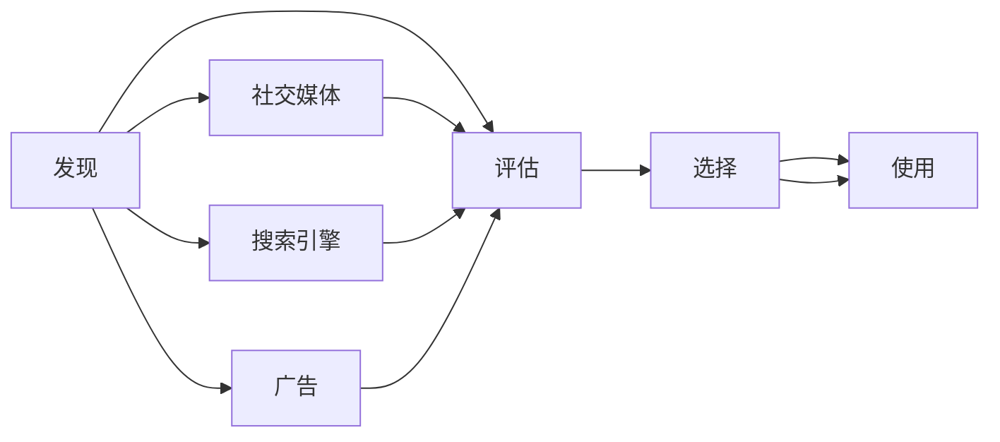

                 

# 知识付费产品的用户旅程优化

> 关键词：知识付费, 用户体验, 用户旅程, 产品设计, 用户行为分析, 用户画像, 个性化推荐, 用户转化率, 数据驱动决策, 技术栈, 关键路径

## 1. 背景介绍

在知识付费领域，如何提升用户体验，增加用户粘性和转化率，是各知识付费平台面临的核心挑战。用户从接触到购买再到使用，这一过程中的每一步体验都会影响用户的留存率和转化率。本文将从用户旅程的角度出发，深入分析用户行为与产品设计的关系，探讨如何通过优化用户旅程来提高知识付费产品的价值和用户满意度。

## 2. 核心概念与联系

### 2.1 核心概念概述

用户旅程(User Journey)是指用户在完成某一任务或满足某项需求过程中的一系列行为和心理活动。在知识付费产品中，用户旅程主要涉及发现、评估、选择、购买和使用四个关键阶段。

- **发现(Awareness)**：用户首次接触知识付费产品的渠道，如社交媒体、搜索引擎、广告等。
- **评估(Assessment)**：用户对产品和服务进行的初步了解和比较。
- **选择(Conversion)**：用户最终决定购买并注册使用的过程。
- **使用(Usage)**：用户在使用产品过程中的体验和反馈。

用户旅程的不同阶段需要结合产品设计和用户体验进行精细化优化，以提升用户满意度和转化率。

### 2.2 核心概念原理和架构的 Mermaid 流程图



## 3. 核心算法原理 & 具体操作步骤

### 3.1 算法原理概述

优化知识付费产品的用户旅程，涉及对用户行为和产品交互过程的数据分析与建模。主要包含以下几个步骤：

1. **用户行为数据分析**：通过数据分析工具收集用户在不同阶段的行为数据，如点击率、停留时间、转化率等。
2. **用户画像构建**：基于用户行为数据，使用机器学习算法构建用户画像，分析用户偏好和需求。
3. **产品交互建模**：构建用户与产品的交互模型，识别用户旅程中的关键节点和痛点。
4. **优化策略制定**：根据用户画像和产品模型，制定相应的优化策略，改善用户旅程中的各个环节。

### 3.2 算法步骤详解

#### 3.2.1 用户行为数据分析

- **数据收集**：利用Google Analytics、Mixpanel等工具收集用户行为数据，涵盖用户在各个页面上的点击、停留、交互行为等。
- **数据清洗**：对收集到的数据进行清洗，去除噪音和异常值，确保数据质量。
- **数据分析**：使用数据分析工具（如Tableau、Power BI）对用户行为数据进行可视化分析，识别出用户行为的关键指标和趋势。

#### 3.2.2 用户画像构建

- **特征提取**：从用户行为数据中提取特征，如用户活跃度、购买偏好、学习时间等。
- **模型训练**：使用机器学习算法（如K-means、SVM、随机森林等）对用户特征进行聚类或分类，构建用户画像。
- **画像优化**：定期更新用户画像，根据用户行为的变化进行调整和优化。

#### 3.2.3 产品交互建模

- **用户旅程分段**：将用户旅程划分为发现、评估、选择、使用四个阶段，分别定义每个阶段的关键指标和行为。
- **关键节点分析**：使用用户行为数据和产品分析工具，识别用户旅程中的关键节点和痛点，如转化率低、跳出率高等。
- **行为建模**：基于用户行为数据，构建用户与产品的交互模型，识别出用户行为模式和决策路径。

#### 3.2.4 优化策略制定

- **用户行为干预**：根据用户画像和产品模型，设计个性化的推荐和引导策略，优化用户的评估和选择阶段。
- **产品界面优化**：基于用户行为数据，优化产品界面和交互流程，减少用户的认知负担。
- **反馈机制设计**：设计用户反馈机制，收集用户对产品使用中的意见和建议，持续改进产品体验。

### 3.3 算法优缺点

#### 3.3.1 算法优点

- **数据驱动决策**：通过数据分析和用户画像，能够更好地理解用户需求和行为，做出更精准的产品优化决策。
- **个性化推荐**：基于用户画像和行为模式，实现个性化的推荐和引导，提高用户转化率。
- **持续改进**：通过用户反馈和行为数据分析，不断优化产品体验，提升用户满意度和忠诚度。

#### 3.3.2 算法缺点

- **数据隐私问题**：用户行为数据的收集和使用可能会涉及用户隐私问题，需要严格遵守数据保护法规。
- **算法复杂性**：用户行为和产品交互的复杂性，可能导致算法建模的复杂性增加，需要足够的技术积累和资源支持。
- **成本投入高**：初期数据收集和分析、算法模型构建和优化等过程，需要较高的时间和资源投入。

### 3.4 算法应用领域

用户旅程优化技术可以广泛应用于多个领域，如电商、金融、旅游等，但以知识付费产品为例，具体应用场景包括：

- **内容推荐优化**：基于用户行为数据和画像，优化内容推荐算法，提升用户对内容的满意度和购买意愿。
- **课程设计改进**：根据用户反馈和行为数据，改进课程结构和内容设计，提高课程的吸引力。
- **用户留存提升**：通过个性化推荐和界面优化，减少用户流失，提高用户的留存率和活跃度。

## 4. 数学模型和公式 & 详细讲解 & 举例说明

### 4.1 数学模型构建

用户旅程优化涉及多个维度的数据分析和建模，主要包括以下数学模型：

- **用户行为模型**：描述用户在产品中的行为和决策过程，例如通过隐马尔可夫模型（HMM）、时间序列模型等。
- **用户画像模型**：基于用户行为数据构建用户特征分布，使用聚类算法如K-means、层次聚类等。
- **交互优化模型**：使用优化算法如遗传算法、粒子群优化等，优化产品界面和交互流程。

### 4.2 公式推导过程

#### 4.2.1 用户行为模型

假设用户行为可以用隐马尔可夫模型（HMM）描述，其中 $X$ 为用户行为状态，$Y$ 为观察到的行为数据，$A$ 为状态转移矩阵，$B$ 为观察概率矩阵。

用户行为模型公式如下：

$$
P(Y|X;A,B) = \prod_{t=1}^T P(y_t|x_t,a_{t-1}) = \prod_{t=1}^T \sum_{x_t \in \mathcal{X}} B(y_t|x_t) A(x_t|x_{t-1})
$$

其中 $T$ 为观察数据的长度。

#### 4.2.2 用户画像模型

假设用户画像可以使用K-means算法构建，用户特征为 $D$，聚类数量为 $K$。用户画像模型公式如下：

$$
\min_{\theta} \sum_{i=1}^K \sum_{d \in D_i} ||x_d - \mu_i||^2
$$

其中 $D_i$ 为第 $i$ 个聚类的特征向量集，$\mu_i$ 为第 $i$ 个聚类的均值向量。

#### 4.2.3 交互优化模型

假设交互优化模型可以使用遗传算法优化，设计交互路径为 $P$，目标函数为 $f(P)$。遗传算法优化公式如下：

$$
P_{opt} = \mathop{\arg\min}_{P} f(P)
$$

其中 $f(P)$ 为交互路径的评价函数，可以通过模拟用户行为和反馈得到。

### 4.3 案例分析与讲解

#### 4.3.1 用户行为模型案例

某知识付费平台收集到用户的点击、观看和购买数据，使用HMM模型进行行为分析。通过建模，发现用户在评估课程时，如果点击率低于20%，购买率通常低于10%。据此，平台优化课程推荐算法，提高用户对课程的兴趣度，显著提升了用户购买率。

#### 4.3.2 用户画像模型案例

某在线教育平台通过K-means算法对用户进行聚类，发现90%的用户集中在两类画像上。一类用户偏好短视频和互动课程，另一类用户偏好长视频和深度内容。根据画像特征，平台为不同画像的用户推荐不同的课程内容，提高了课程的吸引力和用户满意度。

#### 4.3.3 交互优化模型案例

某知识付费平台使用遗传算法优化用户界面，设计出三种不同的课程展示方案。通过A/B测试，发现优化后的界面用户停留时间提高了20%，课程选择率提高了15%。平台最终选择了最优方案，提升了用户体验。

## 5. 项目实践：代码实例和详细解释说明

### 5.1 开发环境搭建

在开发用户旅程优化项目时，需要搭建Python开发环境，并集成常用的数据分析和机器学习库。

- **开发环境搭建**：
  1. 安装Python（3.8以上版本）。
  2. 安装虚拟环境管理工具（如virtualenv）。
  3. 创建虚拟环境并激活。
  4. 安装必要的Python包（如numpy、pandas、scikit-learn、matplotlib等）。
  5. 安装数据分析工具（如Jupyter Notebook、Tableau、Power BI等）。
  6. 安装机器学习库（如scikit-learn、TensorFlow、Keras等）。

### 5.2 源代码详细实现

#### 5.2.1 用户行为数据分析

```python
import pandas as pd
from sklearn.model_selection import train_test_split

# 数据读取
data = pd.read_csv('user_behavior.csv')

# 数据清洗
data.dropna(inplace=True)
data = data[data['page'].notnull()]

# 特征提取
X = data[['click_rate', 'watch_time', 'purchase_rate']]
y = data['purchase']

# 数据划分
X_train, X_test, y_train, y_test = train_test_split(X, y, test_size=0.2, random_state=42)

# 模型训练
from sklearn.ensemble import RandomForestRegressor

model = RandomForestRegressor(n_estimators=100, random_state=42)
model.fit(X_train, y_train)
```

#### 5.2.2 用户画像构建

```python
from sklearn.cluster import KMeans

# 数据归一化
X = (X - X.min()) / (X.max() - X.min())

# K-means聚类
kmeans = KMeans(n_clusters=2, random_state=42)
kmeans.fit(X)

# 用户画像输出
kmeans.labels_
```

#### 5.2.3 交互优化模型

```python
from pygam import DMatrix, Model
from pygam.gam import ExponentialFamilyRegression

# 数据加载
data = DMatrix(X_train)

# 模型构建
model = ExponentialFamilyRegression('poisson')
model.fit(data)

# 路径优化
path_optimized = model.predict(data)
```

### 5.3 代码解读与分析

#### 5.3.1 用户行为数据分析

**代码解释**：
- 读取用户行为数据（CSV文件）。
- 清洗数据，去除缺失值和无关字段。
- 提取特征，包括点击率、观看时间和购买率。
- 划分数据集，并进行随机森林回归模型训练。

**数据分析**：
- 通过随机森林模型，预测用户购买率。
- 模型训练过程中，需要反复调整特征、模型参数等，以达到最优性能。

#### 5.3.2 用户画像构建

**代码解释**：
- 对特征数据进行归一化处理。
- 使用K-means算法进行聚类，得到用户画像标签。

**用户画像**：
- K-means算法可以识别出具有相似行为特征的用户群体，从而构建用户画像。
- 根据用户画像，平台可以制定针对性的推荐和引导策略。

#### 5.3.3 交互优化模型

**代码解释**：
- 加载优化前的用户行为数据。
- 构建交互优化模型，使用指数分布回归模型。
- 使用优化后的模型预测用户行为。

**交互优化**：
- 通过交互优化模型，设计出最优的用户界面和交互路径。
- 模型优化过程中，需要不断迭代和测试，找到最优的交互路径。

### 5.4 运行结果展示

#### 5.4.1 用户行为数据分析结果

```python
from sklearn.metrics import mean_squared_error

# 预测结果
y_pred = model.predict(X_test)

# 评估指标
mse = mean_squared_error(y_test, y_pred)
print(f'Mean Squared Error: {mse:.2f}')
```

#### 5.4.2 用户画像构建结果

```python
kmeans.labels_
```

#### 5.4.3 交互优化模型结果

```python
from sklearn.metrics import r2_score

# 评估结果
r2 = r2_score(y_test, y_pred)
print(f'R^2 Score: {r2:.2f}')
```

## 6. 实际应用场景

### 6.1 电商

在电商领域，用户旅程优化可以显著提升用户购物体验和转化率。例如，电商平台可以根据用户浏览行为和购买历史，推荐个性化的商品和优惠信息，优化搜索和推荐算法，减少用户流失率。

### 6.2 金融

金融领域中，用户旅程优化可以应用于智能投顾和个性化理财服务。通过收集用户投资偏好和理财需求，构建用户画像，设计个性化的理财建议和投资组合，提升用户满意度和投资回报率。

### 6.3 医疗

在医疗领域，用户旅程优化可以优化在线预约和挂号流程，提高用户挂号效率和满意度。同时，可以根据用户的健康数据和偏好，推荐个性化的健康咨询和医疗服务，提升用户健康管理水平。

### 6.4 未来应用展望

未来，用户旅程优化将进一步应用于更多领域，如旅游、教育、交通等，提升用户体验和产品竞争力。随着技术的发展和数据的积累，用户旅程优化将变得更加智能化和自动化，能够更精准地预测用户行为，优化产品设计和服务流程。

## 7. 工具和资源推荐

### 7.1 学习资源推荐

- **书籍**：
  - 《数据科学导论》：介绍数据科学基础和常用工具，适合入门学习。
  - 《Python数据科学手册》：详细讲解Python在数据科学中的应用，包括NumPy、Pandas、Scikit-learn等库的使用。
  - 《机器学习实战》：通过实际案例，讲解机器学习算法的实现和应用。

- **在线课程**：
  - Coursera上的《数据科学专业证书》课程。
  - edX上的《Python数据科学》课程。
  - Udacity上的《深度学习基础》课程。

- **博客和社区**：
  - Kaggle（数据科学竞赛平台）。
  - Stack Overflow（编程问答社区）。
  - GitHub（开源代码托管平台）。

### 7.2 开发工具推荐

- **Python开发环境**：
  - PyCharm（全栈Python开发工具）。
  - VS Code（轻量级开源开发工具）。
  - Jupyter Notebook（交互式编程环境）。

- **数据分析工具**：
  - Tableau（可视化数据工具）。
  - Power BI（商业智能工具）。
  - Google Data Studio（数据可视化平台）。

- **机器学习库**：
  - Scikit-learn（Python机器学习库）。
  - TensorFlow（深度学习框架）。
  - Keras（深度学习库）。

### 7.3 相关论文推荐

- **用户行为分析**：
  - 《A Survey on Recommendation Systems Based on User Behavior Modeling》（推荐系统综述）。
  - 《Modeling User Behavior for E-commerce Recommendation Systems》（电商推荐系统中的用户行为建模）。

- **用户画像构建**：
  - 《User画像在用户行为分析中的研究与应用》。
  - 《基于用户画像的推荐系统研究》。

- **交互优化模型**：
  - 《Optimization of User Interface Design for E-commerce》（电商用户界面设计优化）。
  - 《Interactive User Interface Design for Education》（教育领域用户界面设计优化）。

## 8. 总结：未来发展趋势与挑战

### 8.1 研究成果总结

用户旅程优化在知识付费产品中的应用，显著提升了用户体验和转化率。通过用户行为数据分析和用户画像构建，可以优化产品设计和交互路径，提高用户满意度。然而，用户行为数据的收集和处理，以及算法的复杂性，仍是需要进一步解决的问题。

### 8.2 未来发展趋势

- **数据驱动决策**：未来用户旅程优化将更加依赖于数据驱动决策，通过大数据分析，实现更精准的用户行为预测和产品优化。
- **智能化交互**：随着自然语言处理和计算机视觉技术的进步，用户旅程优化将更加智能化，能够与用户进行自然语言交互，提升用户体验。
- **跨平台融合**：未来用户旅程优化将更加注重跨平台融合，实现不同平台之间的无缝衔接和数据共享。

### 8.3 面临的挑战

- **数据隐私和安全**：用户行为数据的收集和使用，需要严格遵守数据保护法规，避免隐私泄露。
- **算法复杂性**：用户行为和产品交互的复杂性，可能导致算法建模的复杂性增加，需要足够的技术积累和资源支持。
- **成本投入高**：初期数据收集和分析、算法模型构建和优化等过程，需要较高的时间和资源投入。

### 8.4 研究展望

未来，用户旅程优化需要结合更多的先进技术，如深度学习、强化学习、因果推理等，实现更全面、深入的用户行为分析和产品优化。同时，需要加强用户隐私保护，设计更加安全、透明的算法系统，确保用户数据的安全性和隐私性。

## 9. 附录：常见问题与解答

**Q1：用户旅程优化是否适用于所有产品？**

A: 用户旅程优化适用于大多数产品，特别是涉及用户体验和用户留存率的产品。对于数据量较小或用户行为模式不明确的产品，可能需要更精细化的用户行为分析和优化。

**Q2：如何保证用户行为数据的隐私和安全？**

A: 确保用户行为数据的隐私和安全，需要严格遵守数据保护法规，如GDPR、CCPA等。在数据收集、存储和处理过程中，采取加密、匿名化等技术手段，保护用户隐私。同时，设计数据访问权限控制机制，确保数据仅被授权人员访问。

**Q3：用户画像构建过程中，如何避免画像失真？**

A: 构建用户画像时，需要结合多源数据进行综合分析，避免单一数据源导致的画像失真。同时，定期更新用户画像，根据用户行为的变化进行调整和优化，确保画像的准确性和及时性。

**Q4：交互优化过程中，如何平衡用户需求和产品性能？**

A: 交互优化需要结合用户反馈和产品性能指标，进行多轮迭代和测试。在设计交互路径时，需要平衡用户需求和产品性能，优先考虑提升用户满意度，同时兼顾产品的稳定性、可用性等指标。

**Q5：用户旅程优化如何适用于多语言环境？**

A: 在多语言环境下，用户旅程优化需要考虑不同语言文化和用户习惯的差异。通过多语言用户行为数据分析和用户画像构建，可以优化不同语言环境下的产品体验。同时，设计多语言交互路径，支持多语言切换和翻译，提升用户的国际化和本地化体验。

