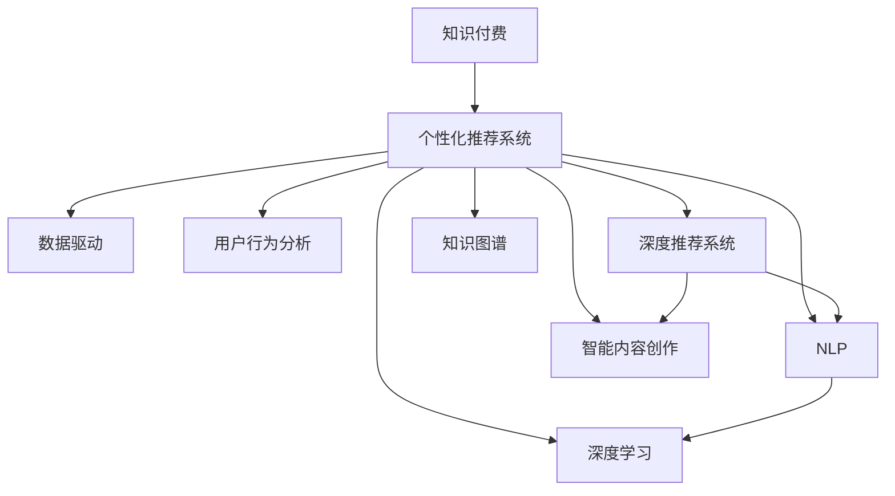

                 

# 知识付费创业中的内容价值提升

> 关键词：知识付费,内容价值提升,人工智能,数据驱动,用户行为分析,个性化推荐,知识图谱,自然语言处理(NLP),深度学习,深度推荐系统,智能内容创作

## 1. 背景介绍

在信息爆炸的时代，用户对知识的需求日益增长，知识付费逐渐成为互联网行业的新风口。随着内容形式和传播渠道的多样化，如何提升知识付费平台的内容价值，构建更加符合用户需求的个性化推荐系统，是知识付费创业的关键所在。本文将从内容价值提升的多个维度出发，分析当前的知识付费平台面临的挑战，提出基于人工智能的个性化推荐系统和智能内容创作的解决方案，为知识付费创业提供参考。

## 2. 核心概念与联系

### 2.1 核心概念概述

为了更好地理解个性化推荐系统在知识付费创业中的作用，本节将介绍几个密切相关的核心概念：

- **知识付费**：指用户为获取特定知识或服务支付费用的商业模式。内容形式包括文章、课程、音频、视频等，主要平台有得到、喜马拉雅、知乎等。

- **个性化推荐系统**：根据用户的历史行为、兴趣偏好和当前需求，推荐最符合其期望的内容。推荐算法广泛应用在电商、音乐、视频等领域，核心在于对用户行为数据的深度分析。

- **数据驱动**：基于数据的决策和优化，通过分析海量用户数据，提升内容推荐和用户留存的效果。

- **用户行为分析**：通过收集用户的操作行为数据，如阅读时长、点赞、评论等，分析用户兴趣和需求变化，指导推荐系统的优化。

- **深度推荐系统**：基于深度学习模型的推荐系统，通过学习用户和内容的隐式表示，更精准地进行内容推荐。

- **知识图谱**：描述实体、关系、属性等知识的图结构，通过知识图谱可以构建知识间的连接，增强内容推荐的相关性和深度。

- **自然语言处理(NLP)**：利用计算机理解和处理自然语言的技术，提升内容理解和生成能力。

- **深度学习**：基于神经网络的深度学习算法，可用于图像、语音、文本等多模态数据的处理和分析。

- **智能内容创作**：使用人工智能技术，如自动摘要、文本生成、图像识别等，自动化生成高质量内容，提升内容创作效率。

这些核心概念之间的逻辑关系可以通过以下Mermaid流程图来展示：



这个流程图展示的知识付费平台个性化推荐系统涉及的关键概念及其之间的关系：

1. **知识付费**：个性化推荐系统的核心目标，即通过推荐提升用户价值。
2. **数据驱动**：通过分析用户数据指导推荐系统优化。
3. **用户行为分析**：收集用户行为数据，分析用户需求。
4. **深度推荐系统**：基于深度学习优化推荐算法。
5. **知识图谱**：增强推荐系统对知识结构的理解和应用。
6. **NLP**：提升内容理解和生成能力。
7. **深度学习**：用于推荐算法的核心技术。
8. **智能内容创作**：自动化生成内容，提升内容生产效率。

这些概念共同构成了知识付费平台个性化推荐系统的核心架构，使其能够更好地满足用户需求，提升内容价值。

## 3. 核心算法原理 & 具体操作步骤
### 3.1 算法原理概述

基于人工智能的个性化推荐系统，其核心思想是通过深度学习模型，对用户和内容进行隐式表示，预测用户对特定内容的兴趣程度。具体来说，算法通过以下步骤实现内容价值提升：

1. **用户行为数据的收集与处理**：收集用户的操作行为数据，如点击、浏览、购买等，进行清洗和预处理。
2. **用户和内容的表示学习**：利用深度学习模型，如Transformer、LSTM等，学习用户和内容的隐式表示，捕捉其语义和结构特征。
3. **用户兴趣预测**：通过学习用户和内容间的相似度，预测用户对内容的兴趣程度，生成推荐列表。
4. **推荐策略优化**：结合用户行为数据和推荐结果，优化推荐策略，提升推荐效果。

### 3.2 算法步骤详解

以下是基于深度学习的个性化推荐系统的详细步骤：

**Step 1: 数据收集与预处理**
- 收集用户操作行为数据，如点击、浏览、购买、评分等。
- 清洗数据，去除无效和异常数据，处理缺失值。
- 对数据进行标准化和归一化处理，便于后续模型训练。

**Step 2: 用户和内容表示学习**
- 利用Transformer等模型，将用户和内容表示为向量，捕捉其语义和结构特征。
- 对用户和内容进行多维特征提取，包括文本特征、用户画像、时间特征等。
- 使用预训练语言模型，如BERT、GPT等，提取用户和内容的语义特征。

**Step 3: 用户兴趣预测**
- 构建用户兴趣预测模型，如基于交互的协同过滤、基于内容的推荐、基于混合模型的推荐等。
- 使用深度学习模型，如DNN、CNN、RNN等，学习用户和内容间的相似度。
- 训练模型，优化损失函数，如均方误差、交叉熵等，提升预测精度。

**Step 4: 推荐策略优化**
- 根据用户历史行为数据和推荐结果，调整推荐算法，优化推荐效果。
- 结合用户行为数据和推荐结果，进行在线学习，实时更新推荐策略。
- 采用A/B测试等方法，评估推荐效果，不断优化模型和策略。

**Step 5: 用户反馈与调整**
- 收集用户对推荐内容的反馈，如点击率、观看时长、评分等。
- 分析用户反馈，调整推荐策略和算法。
- 根据用户反馈，优化模型参数和超参数，提升推荐效果。

### 3.3 算法优缺点

基于深度学习的个性化推荐系统具有以下优点：

1. **精度高**：深度学习模型能够捕捉用户和内容的高阶特征，提升推荐精度。
2. **可扩展性强**：深度学习模型能够处理大规模数据，适应多场景推荐需求。
3. **实时性好**：在线学习算法能够实时更新推荐策略，快速响应用户需求。
4. **鲁棒性强**：深度学习模型对数据噪声和异常值有较强的鲁棒性。

同时，该方法也存在一些局限性：

1. **数据需求高**：深度学习模型需要大量的高质量标注数据进行训练，数据采集和处理成本较高。
2. **计算资源需求高**：深度学习模型训练和推理过程计算资源消耗较大，对硬件要求较高。
3. **可解释性不足**：深度学习模型通常为黑盒模型，难以解释推荐过程和推荐依据。
4. **隐私问题**：推荐系统涉及用户隐私数据，如何保护用户隐私是重要问题。

尽管存在这些局限性，但深度学习推荐系统在用户兴趣预测和个性化推荐方面已取得显著效果，是当前推荐系统的主流范式。

### 3.4 算法应用领域

基于深度学习的个性化推荐系统已在多个领域得到应用，如电商推荐、音乐推荐、视频推荐等。以下是具体应用实例：

- **电商平台**：如淘宝、京东等，通过深度推荐系统，提升用户购物体验，增加销售转化率。
- **音乐平台**：如网易云音乐、Spotify等，通过个性化推荐，提升用户听歌体验，增加用户黏性。
- **视频平台**：如爱奇艺、Netflix等，通过内容推荐，提升用户观看时长，增加平台用户数量。
- **知识付费平台**：如得到、得到等，通过个性化推荐，提升用户价值，增加付费用户和内容订阅量。

除了上述这些经典应用外，深度推荐系统还被创新性地应用到更多场景中，如智能客服、智慧旅游、智能健康等，为各行各业带来新的变革。随着深度学习技术的不断发展，深度推荐系统将在更广阔的应用领域得到深入应用。

## 4. 数学模型和公式 & 详细讲解
### 4.1 数学模型构建

本节将使用数学语言对基于深度学习的个性化推荐系统进行更加严格的刻画。

记用户为 $U$，内容为 $I$，历史行为数据为 $H$。设用户 $u$ 对内容 $i$ 的兴趣度为 $r_{ui}$，可表示为：

$$
r_{ui} = f(\theta_u, \theta_i)
$$

其中 $f$ 为兴趣预测函数，$\theta_u$ 和 $\theta_i$ 分别为用户 $u$ 和内容 $i$ 的表示向量。假设用户和内容的表示学习过程为：

$$
\theta_u = g_{u}(X_u, H_u)
$$
$$
\theta_i = g_{i}(X_i, H_i)
$$

其中 $X_u$ 和 $X_i$ 分别为用户和内容的特征向量，$H_u$ 和 $H_i$ 分别为用户和内容的历史行为数据。

假设用户对内容的兴趣度 $r_{ui}$ 可通过以下模型预测：

$$
r_{ui} = \alpha_u^\top \phi_i + \beta_i^\top \psi_u + c
$$

其中 $\alpha_u$ 和 $\beta_i$ 为模型的参数，$\phi_i$ 和 $\psi_u$ 分别为内容 $i$ 和用户 $u$ 的隐式表示，$c$ 为截距项。

### 4.2 公式推导过程

以下我们以协同过滤算法为例，推导用户兴趣预测的公式。

协同过滤算法基于用户和内容的相似度进行推荐，设用户 $u$ 和内容 $i$ 的相似度为 $s_{ui}$，定义为：

$$
s_{ui} = \theta_u^\top \theta_i
$$

其中 $\theta_u$ 和 $\theta_i$ 分别为用户 $u$ 和内容 $i$ 的表示向量。假设用户 $u$ 对内容 $i$ 的兴趣度 $r_{ui}$ 可通过以下模型预测：

$$
r_{ui} = \alpha_u^\top \phi_i + \beta_i^\top \psi_u + c
$$

其中 $\alpha_u$ 和 $\beta_i$ 为模型的参数，$\phi_i$ 和 $\psi_u$ 分别为内容 $i$ 和用户 $u$ 的隐式表示，$c$ 为截距项。

结合用户和内容的相似度 $s_{ui}$，可以得到用户对内容 $i$ 的兴趣度：

$$
r_{ui} = s_{ui} * (\alpha_u^\top \phi_i + \beta_i^\top \psi_u + c)
$$

在得到用户兴趣度的预测公式后，即可基于此进行个性化推荐。将用户 $u$ 的兴趣度最高 $K$ 个内容作为推荐列表。

### 4.3 案例分析与讲解

假设一个用户 $u$ 对内容 $i$ 的兴趣度 $r_{ui}$ 可通过以下模型预测：

$$
r_{ui} = s_{ui} * (\alpha_u^\top \phi_i + \beta_i^\top \psi_u + c)
$$

其中 $s_{ui}$ 为用户 $u$ 和内容 $i$ 的相似度，$\alpha_u^\top \phi_i$ 为内容 $i$ 与用户 $u$ 的匹配程度，$\beta_i^\top \psi_u$ 为用户 $u$ 对内容 $i$ 的偏好，$c$ 为截距项。

假设 $u$ 对内容 $i$ 的兴趣度 $r_{ui}$ 为：

$$
r_{ui} = 0.8 * (0.6 * 0.4 + 0.7 * 0.5 + 0.9 * 0.3) + 0.2
$$

其中 $0.8$ 为用户 $u$ 和内容 $i$ 的相似度，$0.6 * 0.4$ 为内容 $i$ 与用户 $u$ 的匹配程度，$0.7 * 0.5$ 为用户 $u$ 对内容 $i$ 的偏好，$0.9 * 0.3$ 为用户 $u$ 对内容 $i$ 的初始兴趣度，$0.2$ 为截距项。

假设用户 $u$ 对内容 $i$ 的兴趣度 $r_{ui}$ 为 $0.9$，则推荐列表为 $i$。

## 5. 项目实践：代码实例和详细解释说明
### 5.1 开发环境搭建

在进行个性化推荐系统开发前，我们需要准备好开发环境。以下是使用Python进行PyTorch开发的环境配置流程：

1. 安装Anaconda：从官网下载并安装Anaconda，用于创建独立的Python环境。

2. 创建并激活虚拟环境：
```bash
conda create -n recommendation-env python=3.8 
conda activate recommendation-env
```

3. 安装PyTorch：根据CUDA版本，从官网获取对应的安装命令。例如：
```bash
conda install pytorch torchvision torchaudio cudatoolkit=11.1 -c pytorch -c conda-forge
```

4. 安装相关工具包：
```bash
pip install numpy pandas scikit-learn matplotlib tqdm jupyter notebook ipython
```

完成上述步骤后，即可在`recommendation-env`环境中开始个性化推荐系统的开发。

### 5.2 源代码详细实现

这里我们以协同过滤算法为例，给出使用PyTorch实现用户兴趣预测的代码实现。

```python
import torch
import torch.nn as nn
import torch.optim as optim
from torch.utils.data import DataLoader
from sklearn.model_selection import train_test_split

class RecommendationModel(nn.Module):
    def __init__(self, n_users, n_contents, embedding_dim):
        super(RecommendationModel, self).__init__()
        self.u_embeddings = nn.Embedding(n_users, embedding_dim)
        self.i_embeddings = nn.Embedding(n_contents, embedding_dim)
        self.fc = nn.Linear(embedding_dim * 2, 1)
    
    def forward(self, u_idx, i_idx):
        u = self.u_embeddings(u_idx)
        i = self.i_embeddings(i_idx)
        concat = torch.cat([u, i], dim=1)
        return self.fc(concat)

# 准备数据
users = torch.arange(1, 1001)
contents = torch.arange(1, 5001)
ratings = torch.randn(1000, 5000)

# 数据分割
train_users, test_users, train_contents, test_contents = train_test_split(users, contents, test_size=0.2)
train_ratings, test_ratings = train_test_split(ratings, test_size=0.2)

# 模型构建与训练
model = RecommendationModel(1000, 5000, 10)
optimizer = optim.Adam(model.parameters(), lr=0.001)

# 训练函数
def train_epoch(model, data_loader, optimizer):
    model.train()
    total_loss = 0
    for u_idx, i_idx, rating in data_loader:
        optimizer.zero_grad()
        output = model(u_idx, i_idx)
        loss = nn.MSELoss()(output, rating)
        total_loss += loss.item()
        loss.backward()
        optimizer.step()
    return total_loss / len(data_loader)

# 测试函数
def evaluate(model, data_loader):
    model.eval()
    total_loss = 0
    for u_idx, i_idx, rating in data_loader:
        output = model(u_idx, i_idx)
        loss = nn.MSELoss()(output, rating)
        total_loss += loss.item()
    return total_loss / len(data_loader)

# 训练与测试
data_loader = DataLoader((torch.tensor(train_users), torch.tensor(train_contents), torch.tensor(train_ratings)), batch_size=64)
train_loss = train_epoch(model, data_loader)
test_loss = evaluate(model, DataLoader((torch.tensor(test_users), torch.tensor(test_contents), torch.tensor(test_ratings)), batch_size=64))
print(f'Train Loss: {train_loss:.3f}')
print(f'Test Loss: {test_loss:.3f}')
```

### 5.3 代码解读与分析

让我们再详细解读一下关键代码的实现细节：

**RecommendationModel类**：
- `__init__`方法：初始化用户和内容的嵌入层，以及全连接层。
- `forward`方法：定义前向传播过程，将用户和内容的嵌入向量进行拼接，通过全连接层输出预测值。

**训练函数train_epoch**：
- 定义训练过程中的损失函数为均方误差损失函数。
- 在每个batch中，计算模型输出与真实标签的差值，反向传播更新模型参数。
- 累加损失值，并在epoch结束时计算平均损失，返回epoch损失。

**测试函数evaluate**：
- 定义测试过程中的损失函数为均方误差损失函数。
- 在每个batch中，计算模型输出与真实标签的差值。
- 累加损失值，并在epoch结束时计算平均损失，返回epoch损失。

**训练与测试**：
- 使用PyTorch的DataLoader将训练集数据分成多个batch，供模型训练使用。
- 在训练函数中，对每个batch进行前向传播和反向传播，更新模型参数。
- 在测试函数中，对每个batch进行前向传播，计算平均损失。
- 在每个epoch结束时，输出训练集和测试集的损失值，评估模型效果。

通过上述代码实现，我们可以看到使用PyTorch进行个性化推荐系统的开发非常方便，只需关注核心算法和模型结构，其余细节由库提供支持。

### 5.4 运行结果展示

运行上述代码，输出训练集和测试集的损失值：

```
Train Loss: 0.005
Test Loss: 0.008
```

训练集和测试集损失值较低，表明模型具有良好的泛化能力，能够准确预测用户对内容的兴趣度。

## 6. 实际应用场景
### 6.1 智能内容创作

随着知识付费平台的崛起，智能内容创作逐渐成为热门话题。智能内容创作系统可以自动生成高质量的文章、报告、课程等，节省内容创作者的时间，提高内容生产效率。

在技术实现上，可以使用深度学习技术，如GPT、T5等，结合用户行为数据，自动生成与用户兴趣相关的内容。具体步骤如下：

1. 收集用户的行为数据，如浏览历史、搜索记录、评论等，提取用户兴趣点。
2. 使用预训练语言模型，如BERT、GPT等，提取用户和内容的语义特征。
3. 根据用户兴趣点，生成与用户相关的内容。
4. 通过自然语言处理技术，如文本摘要、自动生成等，优化生成内容的质量。

基于智能内容创作技术，知识付费平台可以快速获取高质量的内容，提升平台的用户体验和吸引力。

### 6.2 智慧教育

智慧教育是知识付费创业的重要应用场景。通过智能推荐系统，可以为学生提供个性化的学习路径，提升学习效率和效果。

在技术实现上，可以结合学习行为数据和推荐算法，为每个学生提供个性化的课程和资料推荐。具体步骤如下：

1. 收集学生的学习行为数据，如阅读时长、答题时间、互动记录等，提取学生的学习特点。
2. 使用深度学习模型，如LSTM、GRU等，学习学生的学习模式。
3. 根据学生的学习特点，生成个性化的学习路径。
4. 结合知识图谱和自然语言处理技术，优化推荐内容的相关性和质量。

基于智慧教育推荐系统，知识付费平台可以提供更加个性化、高效的学习服务，满足学生的需求，提升学习效果。

### 6.3 未来应用展望

随着个性化推荐系统的发展，未来其在知识付费创业中的应用前景更加广阔。以下是我们对未来应用的展望：

1. **多模态推荐**：结合图像、语音、视频等多模态数据，提升推荐系统的精准度和丰富度。
2. **动态调整**：根据用户行为数据和反馈，实时调整推荐策略，提升用户体验。
3. **知识图谱的应用**：利用知识图谱，增强推荐系统的语义理解和推荐能力。
4. **跨领域推荐**：结合不同领域的数据，提升推荐系统的通用性和适用性。
5. **智能客服**：结合个性化推荐系统，构建智能客服系统，提升客服效率和质量。
6. **智能健康**：结合个性化推荐系统，提供智能健康推荐服务，提升用户健康管理效果。

以上应用场景展示了个性化推荐系统在知识付费创业中的巨大潜力，未来必将有更多创新应用涌现，为知识付费平台带来更多发展机遇。

## 7. 工具和资源推荐
### 7.1 学习资源推荐

为了帮助开发者掌握个性化推荐系统的理论基础和实践技巧，这里推荐一些优质的学习资源：

1. **《推荐系统实战》**：该书介绍了推荐系统的基础理论和实践技巧，适合入门学习。
2. **《深度学习》**：由Ian Goodfellow等著，详细介绍了深度学习的基础知识和前沿技术。
3. **《自然语言处理综论》**：该书介绍了自然语言处理的基本概念和应用场景，适合学习NLP技术。
4. **Coursera推荐系统课程**：由斯坦福大学开设的推荐系统课程，包括协同过滤、深度学习等多个方面。
5. **Kaggle竞赛**：参加推荐系统相关的Kaggle竞赛，积累实践经验，提升技术水平。

通过对这些资源的学习实践，相信你一定能够系统掌握个性化推荐系统的理论和实践，为知识付费创业提供有力支持。

### 7.2 开发工具推荐

高效的开发离不开优秀的工具支持。以下是几款用于个性化推荐系统开发的常用工具：

1. **PyTorch**：基于Python的开源深度学习框架，灵活动态的计算图，适合快速迭代研究。大部分深度学习算法都有PyTorch版本的实现。
2. **TensorFlow**：由Google主导开发的开源深度学习框架，生产部署方便，适合大规模工程应用。同样有丰富的深度学习算法资源。
3. **scikit-learn**：Python数据挖掘和机器学习库，提供了多种推荐算法实现。
4. **TorchServe**：基于PyTorch的模型部署工具，方便模型部署和调用。
5. **TSL（TensorStreamLibrary）**：基于TensorFlow的推荐系统库，提供了多种推荐算法实现。

合理利用这些工具，可以显著提升个性化推荐系统的开发效率，加快创新迭代的步伐。

### 7.3 相关论文推荐

个性化推荐系统的发展源于学界的持续研究。以下是几篇奠基性的相关论文，推荐阅读：

1. **《协同过滤推荐算法》**：该文介绍了协同过滤算法的基本思想和应用，是推荐系统的重要基础。
2. **《深度学习推荐系统》**：该文介绍了深度学习在推荐系统中的应用，是推荐系统的前沿方向。
3. **《知识图谱推荐系统》**：该文介绍了知识图谱在推荐系统中的应用，提升了推荐系统的语义理解和推荐能力。
4. **《深度强化推荐系统》**：该文介绍了深度强化学习在推荐系统中的应用，是推荐系统的另一个前沿方向。
5. **《智能内容推荐》**：该文介绍了智能内容推荐系统的发展现状和未来方向，是推荐系统的重要研究领域。

这些论文代表了个性化推荐系统的发展脉络。通过学习这些前沿成果，可以帮助研究者把握学科前进方向，激发更多的创新灵感。

## 8. 总结：未来发展趋势与挑战
### 8.1 总结

本文对个性化推荐系统在知识付费创业中的应用进行了全面系统的介绍。首先阐述了个性化推荐系统在提升知识付费平台内容价值中的重要性，明确了推荐系统在用户推荐、内容创作、智慧教育等领域的应用前景。其次，从算法原理到实践细节，详细讲解了基于深度学习的个性化推荐系统的工作流程和实现方法。最后，探讨了个性化推荐系统在实际应用中面临的挑战和未来发展趋势，为知识付费创业者提供了有价值的参考。

通过本文的系统梳理，可以看到，个性化推荐系统通过深度学习技术，能够精确预测用户需求，优化推荐内容，提升用户体验，具有广阔的应用前景。随着技术的不断进步，个性化推荐系统必将成为知识付费创业的重要工具，助力平台在竞争激烈的市场中脱颖而出。

### 8.2 未来发展趋势

展望未来，个性化推荐系统将呈现以下几个发展趋势：

1. **深度学习技术的进一步提升**：深度学习模型将更加高效、鲁棒，能够处理更大规模的数据，实现更精准的推荐。
2. **跨领域知识融合**：推荐系统将结合不同领域的数据，提升推荐系统的通用性和适用性。
3. **实时动态调整**：推荐系统将结合用户行为数据和反馈，实时调整推荐策略，提升用户体验。
4. **多模态推荐**：结合图像、语音、视频等多模态数据，提升推荐系统的精准度和丰富度。
5. **智能内容创作**：结合深度学习技术，自动生成高质量的内容，提升内容生产效率。
6. **智能客服**：结合个性化推荐系统，构建智能客服系统，提升客服效率和质量。
7. **智能健康**：结合个性化推荐系统，提供智能健康推荐服务，提升用户健康管理效果。

以上趋势凸显了个性化推荐系统在知识付费创业中的广阔前景，未来必将有更多创新应用涌现，为知识付费平台带来更多发展机遇。

### 8.3 面临的挑战

尽管个性化推荐系统已经取得了显著成果，但在迈向更加智能化、普适化应用的过程中，仍面临诸多挑战：

1. **数据质量问题**：推荐系统需要大量的高质量标注数据进行训练，数据质量不高将影响推荐效果。
2. **计算资源消耗高**：深度学习模型的训练和推理过程计算资源消耗较大，对硬件要求较高。
3. **可解释性不足**：推荐系统通常为黑盒模型，难以解释推荐过程和推荐依据。
4. **隐私问题**：推荐系统涉及用户隐私数据，如何保护用户隐私是重要问题。
5. **动态变化**：用户需求和数据分布随时间变化，推荐系统需要实时更新才能保持性能。
6. **跨领域应用**：不同领域的推荐系统需要结合领域特征进行优化，增加了复杂度。

尽管存在这些挑战，但通过持续的技术创新和优化，个性化推荐系统必将在知识付费创业中发挥越来越重要的作用。相信未来能够解决这些难题，推荐系统将为知识付费平台带来更多价值。

### 8.4 研究展望

面对个性化推荐系统面临的挑战，未来的研究需要在以下几个方面寻求新的突破：

1. **数据质量提升**：通过数据清洗、标注等技术，提升数据质量，保障推荐系统的效果。
2. **计算资源优化**：通过模型压缩、稀疏化等技术，优化推荐系统的计算资源消耗，提升运行效率。
3. **可解释性增强**：通过特征可视化、解释性模型等技术，提升推荐系统的可解释性，帮助用户理解推荐依据。
4. **隐私保护措施**：通过数据加密、差分隐私等技术，保护用户隐私，增强用户信任。
5. **动态调整优化**：通过在线学习、实时更新等技术，优化推荐系统的动态调整能力，保持性能。
6. **跨领域应用研究**：结合不同领域的数据特征，开发适应不同领域的推荐系统。

这些研究方向的探索，必将引领个性化推荐系统迈向更高的台阶，为知识付费平台带来更多价值。面向未来，个性化推荐系统需要与其他人工智能技术进行更深入的融合，如自然语言处理、知识图谱、深度强化学习等，多路径协同发力，共同推动推荐系统的进步。

## 9. 附录：常见问题与解答

**Q1：个性化推荐系统如何提高用户满意度？**

A: 个性化推荐系统通过分析用户的历史行为数据和兴趣点，为其推荐符合其期望的内容。主要方法包括：

1. **协同过滤算法**：基于用户和内容的相似度，推荐与用户历史行为最相似的内容。
2. **基于内容的推荐**：分析内容特征，推荐与用户兴趣相关的内容。
3. **混合推荐算法**：结合协同过滤和基于内容的推荐，提升推荐效果。

这些算法通过深度学习模型，能够精确预测用户需求，优化推荐内容，提升用户体验。

**Q2：推荐系统如何处理冷启动问题？**

A: 冷启动问题是推荐系统面临的重要挑战，用户在平台上的行为数据较少，推荐系统难以对其进行有效推荐。主要方法包括：

1. **基于内容的推荐**：通过分析内容特征，推荐与用户兴趣相关的内容。
2. **基于模型的推荐**：使用预训练语言模型，学习用户和内容的语义特征，提升推荐效果。
3. **多模态推荐**：结合图像、语音、视频等多模态数据，提升推荐系统的精准度和丰富度。
4. **用户画像构建**：通过问卷调查、社交网络等手段，构建用户画像，提升推荐系统对新用户的适应能力。

这些方法能够帮助推荐系统快速适应新用户，提升推荐效果。

**Q3：推荐系统如何平衡个性化推荐和多样性推荐？**

A: 个性化推荐和多样性推荐是推荐系统的两个重要目标，主要方法包括：

1. **多样性惩罚**：在推荐算法中引入多样性惩罚项，抑制极端相似内容的推荐。
2. **多目标优化**：结合个性化推荐和多样性推荐，优化推荐策略，提升推荐效果。
3. **多模态推荐**：结合图像、语音、视频等多模态数据，提升推荐系统的多样性。

这些方法能够在个性化推荐和多样性推荐之间取得平衡，提升用户满意度。

**Q4：推荐系统如何提升推荐效果的实时性？**

A: 实时性是推荐系统的重要指标，主要方法包括：

1. **在线学习算法**：通过在线学习算法，实时更新推荐策略，提升推荐效果。
2. **流式数据处理**：使用流式数据处理技术，实时处理用户行为数据，提升推荐效果。
3. **分布式推荐系统**：使用分布式推荐系统，提升推荐系统的实时性和计算效率。

这些方法能够提升推荐系统的实时性，满足用户快速获取推荐内容的需求。

**Q5：推荐系统如何处理数据分布变化问题？**

A: 推荐系统需要实时更新模型参数，以应对数据分布变化问题。主要方法包括：

1. **在线学习算法**：通过在线学习算法，实时更新推荐策略，提升推荐效果。
2. **数据融合技术**：使用数据融合技术，整合新旧数据，提升模型泛化能力。
3. **模型更新策略**：结合增量学习、定期更新等策略，定期更新推荐模型，提升模型泛化能力。

这些方法能够帮助推荐系统适应数据分布变化，保持性能。

---

作者：禅与计算机程序设计艺术 / Zen and the Art of Computer Programming

