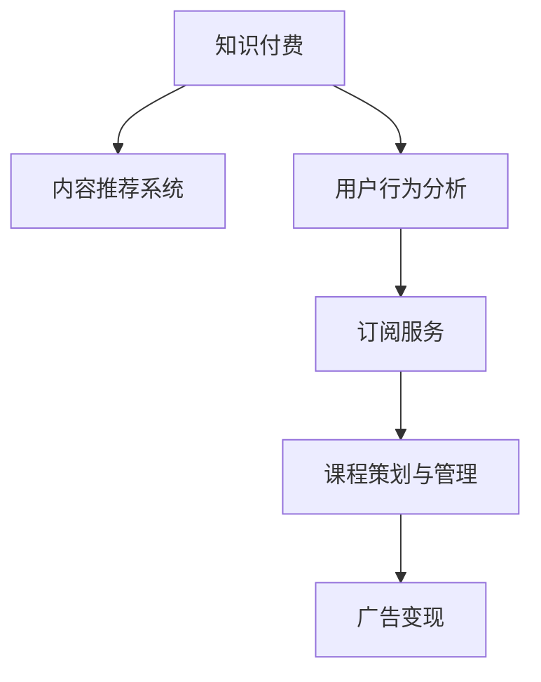

                 

# 知识付费创业中的内容价值最大化

> 关键词：知识付费,内容价值,内容推荐,用户行为分析,订阅服务,课程策划,广告变现

## 1. 背景介绍

### 1.1 问题由来

随着互联网的普及和信息爆炸，人们对高质量内容的需求日益增加。知识付费作为新兴行业，依托于互联网技术，通过付费订阅的方式提供专业知识、技能培训和信息服务，满足了用户对高效信息获取的需求。在知识付费行业，内容是核心竞争力，如何最大化内容价值，提升用户粘性，实现商业变现，成为创业公司追求的目标。

### 1.2 问题核心关键点

知识付费创业中，内容价值最大化的关键点包括：

- **内容质量与深度**：内容的深度和质量直接影响用户支付意愿和满意程度，是知识付费业务的根本。
- **用户需求洞察**：深入了解用户需求，提供精准内容，增加用户粘性。
- **个性化推荐**：通过大数据分析用户行为，提供个性化推荐，提升用户体验和满意度。
- **订阅服务优化**：设计合理的订阅服务，满足用户多样化学习需求，增加续费率和收入。
- **广告变现策略**：在提供优质内容的同时，通过广告变现获取额外收入。
- **课程策划与管理**：高质量的课程策划和管理是保证内容持续更新和质量提升的重要环节。

## 2. 核心概念与联系

### 2.1 核心概念概述

为了更好地理解内容价值最大化的过程，本节将介绍几个密切相关的核心概念：

- **知识付费**：一种通过付费形式获取专业知识、技能培训或信息服务的商业模式。
- **内容推荐系统**：基于用户行为数据，为用户推荐感兴趣内容的系统。
- **用户行为分析**：通过数据挖掘和分析，理解用户行为，优化内容推荐和业务策略。
- **订阅服务**：用户定期支付费用获取内容或服务的模式，如年卡、月卡等。
- **课程策划与管理**：从选题到课程制作、推广、反馈，直至下一轮内容更新的全过程管理。
- **广告变现**：利用内容平台上的用户流量，通过广告展示实现商业变现。

这些核心概念之间的逻辑关系可以通过以下Mermaid流程图来展示：



这个流程图展示了几大核心概念及其之间的关系：

1. 知识付费以内容为核心，内容推荐系统提供个性化推荐，满足用户需求。
2. 用户行为分析揭示用户兴趣，优化订阅服务和课程策划。
3. 课程策划和管理保障内容质量，提升用户满意度。
4. 广告变现通过流量价值最大化，增加收益。

## 3. 核心算法原理 & 具体操作步骤

### 3.1 算法原理概述

内容价值最大化主要依赖于以下几个方面的算法和策略：

- **内容推荐算法**：基于用户历史行为数据，通过协同过滤、深度学习等算法，提供个性化推荐。
- **用户行为分析算法**：通过统计分析、机器学习等方法，理解用户兴趣和行为模式，优化推荐和服务策略。
- **订阅服务优化算法**：利用机器学习模型，预测用户续费概率，设计差异化定价策略。
- **课程策划管理算法**：通过数据驱动，分析市场需求，指导内容生产，提升课程质量和用户满意度。
- **广告变现算法**：通过定向广告投放和效果评估，优化广告策略，实现流量变现。

### 3.2 算法步骤详解

#### 3.2.1 内容推荐系统

1. **数据收集与预处理**：
   - 收集用户行为数据，如浏览、搜索、购买行为等。
   - 对数据进行清洗、去重、归一化等预处理。
   
2. **特征工程**：
   - 提取用户和内容的特征，如用户ID、浏览时间、内容类别、标题等。
   - 构建特征向量，用于后续的算法模型训练。
   
3. **推荐算法模型训练**：
   - 选择适合的算法模型，如协同过滤、矩阵分解、深度学习等。
   - 使用训练集数据训练模型，优化模型参数。
   
4. **推荐效果评估**：
   - 在验证集上测试模型效果，评估准确率、召回率、覆盖率等指标。
   - 根据评估结果调整模型参数，进行迭代优化。

#### 3.2.2 用户行为分析

1. **数据收集与预处理**：
   - 收集用户行为数据，如浏览记录、搜索关键词、购买行为等。
   - 对数据进行清洗、去重、归一化等预处理。
   
2. **特征工程**：
   - 提取用户行为特征，如浏览时长、搜索频率、购买金额等。
   - 构建特征向量，用于后续的机器学习模型训练。
   
3. **机器学习模型训练**：
   - 选择适合的机器学习模型，如聚类、分类、回归等。
   - 使用训练集数据训练模型，优化模型参数。
   
4. **用户行为理解**：
   - 分析用户行为模式，理解用户兴趣和需求。
   - 根据分析结果调整内容推荐和业务策略。

#### 3.2.3 订阅服务优化

1. **数据收集与预处理**：
   - 收集用户订阅数据，如订阅时间、续费频率、取消原因等。
   - 对数据进行清洗、去重、归一化等预处理。
   
2. **特征工程**：
   - 提取订阅特征，如订阅时长、续费概率、课程质量等。
   - 构建特征向量，用于后续的机器学习模型训练。
   
3. **机器学习模型训练**：
   - 选择适合的机器学习模型，如逻辑回归、随机森林、神经网络等。
   - 使用训练集数据训练模型，优化模型参数。
   
4. **续费概率预测**：
   - 根据模型预测用户的续费概率。
   - 设计差异化定价策略，提升续费率和收入。

#### 3.2.4 课程策划与管理

1. **数据收集与预处理**：
   - 收集课程数据，如课程评分、评论、观看时长等。
   - 对数据进行清洗、去重、归一化等预处理。
   
2. **特征工程**：
   - 提取课程特征，如课程时长、观看次数、用户评分等。
   - 构建特征向量，用于后续的机器学习模型训练。
   
3. **机器学习模型训练**：
   - 选择适合的机器学习模型，如聚类、分类、回归等。
   - 使用训练集数据训练模型，优化模型参数。
   
4. **内容生产指导**：
   - 根据模型分析市场需求，指导内容生产。
   - 提升课程质量和用户满意度。

#### 3.2.5 广告变现

1. **数据收集与预处理**：
   - 收集广告展示数据，如展示次数、点击率、转化率等。
   - 对数据进行清洗、去重、归一化等预处理。
   
2. **特征工程**：
   - 提取广告特征，如展示时长、展示位置、广告内容等。
   - 构建特征向量，用于后续的机器学习模型训练。
   
3. **机器学习模型训练**：
   - 选择适合的机器学习模型，如逻辑回归、随机森林、神经网络等。
   - 使用训练集数据训练模型，优化模型参数。
   
4. **广告策略优化**：
   - 根据模型优化广告策略，如定向投放、效果评估等。
   - 实现流量变现最大化。

### 3.3 算法优缺点

内容价值最大化的算法具有以下优点：

- **个性化推荐**：通过深度学习算法，能够提供精准的个性化推荐，提升用户满意度。
- **用户行为理解**：机器学习模型可以深入理解用户行为模式，优化业务策略。
- **续费预测**：机器学习模型可以预测用户续费概率，提升续费率和收入。
- **内容质量提升**：数据驱动的内容策划和管理，保证课程质量，提升用户满意度。
- **流量变现**：精准广告投放实现流量变现最大化。

同时，这些算法也存在一定的局限性：

- **数据依赖**：算法的效果依赖于高质量的数据，数据收集和处理成本较高。
- **算法复杂性**：深度学习等算法的实现较为复杂，需要较强的技术能力。
- **模型维护**：机器学习模型的维护和更新需要持续投入，成本较高。

尽管存在这些局限性，但通过合理的算法选择和优化，可以充分发挥内容价值最大化的潜力。

### 3.4 算法应用领域

内容价值最大化的算法广泛应用于知识付费平台的多个环节，例如：

- **内容推荐系统**：根据用户行为数据，推荐感兴趣的内容，提升用户粘性和满意度。
- **用户行为分析**：通过机器学习模型，理解用户需求，优化推荐和服务策略。
- **订阅服务优化**：预测用户续费概率，设计差异化定价策略，提升续费率和收入。
- **课程策划与管理**：数据驱动的内容策划，提升课程质量和用户满意度。
- **广告变现**：精准广告投放，最大化流量变现。

除了上述应用外，内容价值最大化的算法也在其他领域展现出广泛的应用前景，如电子商务、社交网络、新闻媒体等。随着算法的不断优化和数据资源的积累，其在更多场景中的应用潜力将进一步释放。

## 4. 数学模型和公式 & 详细讲解 & 举例说明

### 4.1 数学模型构建

在知识付费创业中，内容推荐、用户行为分析、续费预测、课程策划和广告变现等环节均涉及数学模型的构建和使用。这里以用户行为分析和续费预测为例，构建数学模型。

#### 4.1.1 用户行为分析

假设用户行为数据为 $D=\{(x_i,y_i)\}_{i=1}^N$，其中 $x_i$ 为特征向量，$y_i$ 为标签（如浏览时长、续费概率等）。设用户行为分类模型的损失函数为 $L$，模型参数为 $\theta$，则最小化损失函数的目标为：

$$
\hat{\theta}=\mathop{\arg\min}_{\theta} \frac{1}{N} \sum_{i=1}^N \ell(M_{\theta}(x_i),y_i)
$$

其中 $\ell$ 为损失函数，$M_{\theta}(x_i)$ 为模型预测值。

#### 4.1.2 续费预测

设续费概率为 $y_i \in [0,1]$，分类模型的损失函数为 $L$，模型参数为 $\theta$，则最小化损失函数的目标为：

$$
\hat{\theta}=\mathop{\arg\min}_{\theta} \frac{1}{N} \sum_{i=1}^N \ell(M_{\theta}(x_i),y_i)
$$

其中 $\ell$ 为损失函数，$M_{\theta}(x_i)$ 为模型预测值。

### 4.2 公式推导过程

#### 4.2.1 用户行为分析

以线性回归模型为例，假设用户行为数据为 $D=\{(x_i,y_i)\}_{i=1}^N$，其中 $x_i \in \mathbb{R}^d$，$y_i \in \mathbb{R}$。则线性回归模型的目标是最小化均方误差损失函数：

$$
L(y_i,\hat{y}_i)=\frac{1}{2N}\sum_{i=1}^N (y_i - \hat{y}_i)^2
$$

其中 $\hat{y}_i$ 为模型预测值，$y_i$ 为真实值。模型的参数 $\theta=(\beta_0,\beta_1,\cdots,\beta_d)$ 可以通过最小化损失函数得到：

$$
\theta^* = \mathop{\arg\min}_{\theta} \frac{1}{N} \sum_{i=1}^N (y_i - \beta_0 - \sum_{j=1}^d \beta_j x_{ij})^2
$$

通过求偏导数，可以解得：

$$
\beta_j^* = \frac{1}{N}\sum_{i=1}^N (y_i - \hat{y}_i)x_{ij}
$$

#### 4.2.2 续费预测

以逻辑回归模型为例，设续费概率 $y_i \in \{0,1\}$，分类模型的损失函数为交叉熵损失函数：

$$
L(y_i,\hat{y}_i) = -y_i \log \hat{y}_i + (1-y_i) \log (1-\hat{y}_i)
$$

其中 $\hat{y}_i$ 为模型预测值，$y_i$ 为真实值。模型的参数 $\theta$ 可以通过最小化损失函数得到：

$$
\hat{\theta}=\mathop{\arg\min}_{\theta} \frac{1}{N} \sum_{i=1}^N L(y_i,\hat{y}_i)
$$

通过求偏导数，可以解得：

$$
\theta^* = \mathop{\arg\min}_{\theta} -\frac{1}{N}\sum_{i=1}^N y_i \log \hat{y}_i + (1-y_i) \log (1-\hat{y}_i)
$$

### 4.3 案例分析与讲解

#### 4.3.1 用户行为分析案例

某知识付费平台收集了用户浏览记录 $D=\{(x_i,y_i)\}_{i=1}^N$，其中 $x_i$ 为浏览时间、浏览频率等特征，$y_i$ 为续费概率。使用逻辑回归模型进行预测，数据集 $D$ 划分为训练集和测试集，训练集数据为 $D_{train}$，测试集数据为 $D_{test}$。训练集模型参数 $\theta^*=(\beta_0,\beta_1,\beta_2)$，则预测方程为：

$$
\hat{y}_i = \sigma(\beta_0 + \beta_1 x_{i1} + \beta_2 x_{i2})
$$

其中 $\sigma$ 为sigmoid函数。

在测试集上进行预测，可以得到准确率、召回率等评估指标，根据评估结果调整模型参数，进行迭代优化。

#### 4.3.2 续费预测案例

某知识付费平台收集了用户续费记录 $D=\{(x_i,y_i)\}_{i=1}^N$，其中 $x_i$ 为续费时间、续费金额等特征，$y_i$ 为续费概率。使用随机森林模型进行预测，数据集 $D$ 划分为训练集和测试集，训练集模型参数 $\theta^*=(\beta_0,\beta_1,\beta_2)$，则预测方程为：

$$
\hat{y}_i = \beta_0 + \beta_1 x_{i1} + \beta_2 x_{i2}
$$

在测试集上进行预测，可以得到准确率、召回率等评估指标，根据评估结果调整模型参数，进行迭代优化。

## 5. 项目实践：代码实例和详细解释说明

### 5.1 开发环境搭建

在进行内容价值最大化算法实践前，我们需要准备好开发环境。以下是使用Python进行Scikit-learn开发的环境配置流程：

1. 安装Anaconda：从官网下载并安装Anaconda，用于创建独立的Python环境。

2. 创建并激活虚拟环境：
```bash
conda create -n sklearn-env python=3.8 
conda activate sklearn-env
```

3. 安装Scikit-learn：
```bash
pip install scikit-learn
```

4. 安装相关库：
```bash
pip install pandas numpy matplotlib seaborn jupyter notebook
```

完成上述步骤后，即可在`sklearn-env`环境中开始算法实践。

### 5.2 源代码详细实现

这里以用户行为分析为例，给出使用Scikit-learn库进行逻辑回归模型的PyTorch代码实现。

首先，导入相关库：

```python
from sklearn.linear_model import LogisticRegression
from sklearn.model_selection import train_test_split
from sklearn.metrics import accuracy_score, precision_score, recall_score
import pandas as pd
import numpy as np
```

然后，准备数据集：

```python
data = pd.read_csv('user_browsing_data.csv')
X = data[['browsing_time', 'browsing_frequency']]
y = data['续费概率']

X_train, X_test, y_train, y_test = train_test_split(X, y, test_size=0.2, random_state=42)
```

接着，训练模型：

```python
model = LogisticRegression(solver='liblinear')
model.fit(X_train, y_train)
y_pred = model.predict(X_test)
```

最后，评估模型：

```python
print('Accuracy:', accuracy_score(y_test, y_pred))
print('Precision:', precision_score(y_test, y_pred))
print('Recall:', recall_score(y_test, y_pred))
```

以上就是使用Scikit-learn进行用户行为分析的完整代码实现。可以看到，Scikit-learn库提供了丰富的机器学习模型和评估工具，使得算法实现变得简洁高效。

### 5.3 代码解读与分析

让我们再详细解读一下关键代码的实现细节：

**数据准备**：
- 使用pandas库读取CSV数据文件，提取特征和标签。
- 使用train_test_split函数将数据集划分为训练集和测试集。

**模型训练**：
- 创建逻辑回归模型，使用liblinear求解器。
- 使用训练集数据训练模型，生成预测结果。

**模型评估**：
- 使用accuracy_score、precision_score、recall_score等函数评估模型性能。
- 输出模型在测试集上的准确率、精确率和召回率。

**代码亮点**：
- 使用了Scikit-learn的train_test_split函数，方便快速划分训练集和测试集。
- 使用了pandas库的read_csv函数，方便读取CSV数据文件。
- 使用了Scikit-learn的metrics模块，方便评估模型性能。

通过以上步骤，可以高效地完成用户行为分析的算法实践，进一步理解模型的原理和应用。

## 6. 实际应用场景

### 6.1 智能推荐系统

智能推荐系统是知识付费平台的重要组成部分，通过个性化推荐提升用户体验和满意度。在推荐系统中，用户行为分析算法扮演着关键角色。

具体而言，平台收集用户浏览、点击、评分等行为数据，使用用户行为分析算法分析用户兴趣和行为模式，生成个性化推荐。推荐系统在用户端实时更新推荐内容，提升用户粘性和满意度。

### 6.2 续费优化

续费优化是知识付费平台的重要业务环节，通过续费预测算法提高续费率和收入。

平台收集用户续费记录，使用续费预测算法分析用户续费概率，设计差异化定价策略，提升续费率和收入。对于续费意愿不高的用户，可以通过优化课程内容和体验，提升续费意愿。

### 6.3 课程策划

课程策划是知识付费平台的核心环节，通过数据驱动的内容策划，提升课程质量和用户满意度。

平台收集课程浏览、观看、评论等数据，使用内容分析算法分析课程需求，指导内容生产。课程策划团队可以根据分析结果，优化课程内容，提升课程质量，增加用户粘性。

### 6.4 广告变现

广告变现是知识付费平台的重要收入来源，通过精准广告投放实现流量变现。

平台收集广告展示数据，使用广告优化算法分析用户行为和广告效果，优化广告投放策略。通过定向广告投放，提升广告点击率和转化率，实现流量变现最大化。

### 6.5 用户行为分析

用户行为分析是知识付费平台的重要环节，通过深入理解用户行为，优化推荐和服务策略。

平台收集用户浏览、搜索、购买行为等数据，使用用户行为分析算法分析用户兴趣和需求，优化推荐和服务策略。通过个性化推荐，提升用户粘性和满意度。

## 7. 工具和资源推荐

### 7.1 学习资源推荐

为了帮助开发者系统掌握内容价值最大化的理论基础和实践技巧，这里推荐一些优质的学习资源：

1. 《机器学习实战》书籍：由机器学习专家撰写，深入浅出地介绍了机器学习算法和应用，适合初学者入门。

2. CS229《机器学习》课程：斯坦福大学开设的机器学习课程，有Lecture视频和配套作业，带你深入理解机器学习原理。

3. Kaggle：全球最大的数据科学竞赛平台，提供海量数据集和竞赛机会，可以锻炼实际问题解决能力。

4. Coursera：全球知名的在线教育平台，提供众多机器学习和数据科学课程，涵盖从入门到高级的内容。

5. Scikit-learn官方文档：Scikit-learn库的官方文档，提供了详细的使用指南和实例代码，是学习Scikit-learn的重要资源。

通过这些学习资源，相信你一定能够快速掌握内容价值最大化的算法技术，并用于解决实际的业务问题。

### 7.2 开发工具推荐

高效的开发离不开优秀的工具支持。以下是几款用于内容价值最大化算法开发的常用工具：

1. Jupyter Notebook：免费的开源Jupyter笔记本环境，支持多种编程语言，方便调试和分享代码。

2. Python：动态语言，灵活性强，拥有丰富的第三方库和框架，适合数据科学和机器学习开发。

3. Scikit-learn：强大的机器学习库，提供多种算法和评估工具，适合数据预处理和模型训练。

4. Pandas：强大的数据处理库，支持高效的数据读取和处理，适合数据科学和统计分析。

5. Matplotlib：强大的可视化库，支持丰富的图表绘制，适合数据可视化。

6. Scikit-image：强大的图像处理库，支持多种图像处理操作，适合计算机视觉任务。

通过这些工具，可以显著提升内容价值最大化的开发效率，加快创新迭代的步伐。

### 7.3 相关论文推荐

内容价值最大化的算法发展源于学界的持续研究。以下是几篇奠基性的相关论文，推荐阅读：

1. "Collaborative Filtering for Implicit Feedback Datasets"（2002）：介绍协同过滤算法的经典论文，适用于推荐系统。

2. "The Elements of Statistical Learning"（2001）：经典统计学习教材，涵盖了回归、分类、聚类等多种机器学习算法。

3. "Hands-On Machine Learning with Scikit-Learn, Keras, and TensorFlow"（2017）：介绍机器学习算法和框架的实战书籍，适合实践开发。

4. "Deep Learning"（2015）：深度学习领域权威教材，涵盖了深度学习算法和应用。

5. "User Behavior Analysis in Recommendation Systems"（2018）：介绍用户行为分析的最新研究成果，适用于推荐系统。

这些论文代表了大语言模型微调技术的发展脉络。通过学习这些前沿成果，可以帮助研究者把握学科前进方向，激发更多的创新灵感。

## 8. 总结：未来发展趋势与挑战

### 8.1 总结

本文对内容价值最大化进行了全面系统的介绍。首先阐述了内容价值最大化的背景和意义，明确了算法在知识付费创业中的核心地位。其次，从原理到实践，详细讲解了内容推荐、用户行为分析、续费预测、课程策划和广告变现等算法的数学模型和实现细节，给出了代码实例和详细解释。最后，本文探讨了内容价值最大化在实际应用中的场景，推荐了相关的学习资源和开发工具，展望了未来的发展趋势和面临的挑战。

通过本文的系统梳理，可以看到，内容价值最大化算法在知识付费平台中的应用潜力巨大，能够显著提升用户满意度，优化业务策略，实现商业变现。未来，随着算法的不断优化和数据资源的积累，其在更多场景中的应用潜力将进一步释放。

### 8.2 未来发展趋势

展望未来，内容价值最大化算法将呈现以下几个发展趋势：

1. **算法模型多样化**：除了传统的机器学习算法，深度学习、强化学习等新算法将得到广泛应用，提升算法模型的复杂性和效果。

2. **数据融合和跨领域分析**：将多种数据源进行融合分析，提升算法模型的全面性和鲁棒性。

3. **实时计算和流式处理**：利用流式计算和大数据技术，实现实时推荐和广告投放，提升用户体验和广告效果。

4. **模型解释和可控性**：引入可解释性算法和模型，提高模型的透明性和可控性，保障用户隐私和安全。

5. **用户个性化和行为预测**：通过深入理解用户行为，实现更加精准的个性化推荐和续费预测。

6. **广告定位和效果优化**：利用大数据和机器学习技术，实现精准的广告定位和效果优化，最大化广告变现。

这些趋势表明，内容价值最大化算法在未来将面临更多挑战和机遇，需要不断创新和优化，才能满足用户需求和业务发展。

### 8.3 面临的挑战

尽管内容价值最大化算法已经取得了显著成果，但在实际应用中仍面临诸多挑战：

1. **数据质量**：数据质量直接影响算法效果，高质量的数据采集和处理成本较高。

2. **算法复杂性**：深度学习等算法的实现较为复杂，需要较强的技术能力和资源投入。

3. **模型可解释性**：复杂模型往往难以解释，需要引入可解释性算法，保障模型透明性和可控性。

4. **用户隐私保护**：在数据收集和分析过程中，如何保护用户隐私和数据安全，是算法应用的重要挑战。

5. **资源消耗**：大规模数据和复杂模型对计算资源消耗较大，需要优化资源配置和算法效率。

6. **模型维护和更新**：模型需要持续更新和维护，投入成本较高。

尽管存在这些挑战，但通过合理的算法选择和优化，可以充分发挥内容价值最大化的潜力，助力知识付费平台的发展。

### 8.4 研究展望

面对内容价值最大化算法面临的诸多挑战，未来的研究需要在以下几个方面寻求新的突破：

1. **数据融合与跨领域分析**：将多种数据源进行融合分析，提升算法模型的全面性和鲁棒性。

2. **实时计算与流式处理**：利用流式计算和大数据技术，实现实时推荐和广告投放，提升用户体验和广告效果。

3. **可解释性与透明性**：引入可解释性算法和模型，提高模型的透明性和可控性，保障用户隐私和安全。

4. **个性化与行为预测**：通过深入理解用户行为，实现更加精准的个性化推荐和续费预测。

5. **广告定位与效果优化**：利用大数据和机器学习技术，实现精准的广告定位和效果优化，最大化广告变现。

这些研究方向将引领内容价值最大化算法的进一步发展，为知识付费平台提供更精准、高效、安全的服务。

## 9. 附录：常见问题与解答

**Q1：什么是内容价值最大化？**

A: 内容价值最大化是指通过算法和技术手段，最大化知识付费平台内容对用户的吸引力，提升用户体验和满意度，实现商业变现的过程。

**Q2：内容价值最大化有哪些应用场景？**

A: 内容价值最大化在知识付费平台的应用场景包括：

- 个性化推荐系统
- 续费优化
- 课程策划与管理
- 广告变现
- 用户行为分析

**Q3：如何评估内容价值最大化的效果？**

A: 内容价值最大化效果的评估可以从以下几个方面进行：

- 用户满意度调查
- 用户留存率和续费率
- 广告点击率和转化率
- 课程观看量和评分

**Q4：内容价值最大化面临哪些挑战？**

A: 内容价值最大化面临的主要挑战包括：

- 数据质量
- 算法复杂性
- 模型可解释性
- 用户隐私保护
- 资源消耗
- 模型维护和更新

**Q5：未来内容价值最大化有哪些发展趋势？**

A: 内容价值最大化未来的发展趋势包括：

- 算法模型多样化
- 数据融合和跨领域分析
- 实时计算和流式处理
- 模型解释和可控性
- 用户个性化和行为预测
- 广告定位和效果优化

---

作者：禅与计算机程序设计艺术 / Zen and the Art of Computer Programming

