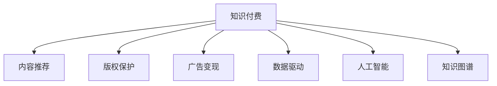

                 

# 知识付费创业中的内容创新与突破

> 关键词：知识付费, 内容创新, 用户体验, 版权保护, 广告变现, 数据驱动, 人工智能, 知识图谱

## 1. 背景介绍

### 1.1 问题由来

随着互联网和移动设备的普及，人们对于知识和信息的渴求日益增长。知识付费平台通过提供专业、系统、高效的学习资源，满足了用户对知识深度的需求。然而，随着知识付费市场竞争日趋激烈，单纯依靠内容获取用户的时代已经过去。内容创新与突破成为了知识付费创业中的关键课题。

### 1.2 问题核心关键点

知识付费创业的核心在于如何通过创新内容，满足用户的个性化需求，提升用户体验。具体关键点包括：

- 内容形式的多样化：除了传统的文字、视频外，音频、互动式问答、游戏化学习等形式应得到重视。
- 内容的个性化推荐：通过数据分析和算法优化，精准推荐用户感兴趣的内容。
- 内容与技术结合：利用人工智能、大数据等技术提升内容的表现力和互动性。
- 内容创新的持续性：不断更新迭代，保持内容的时效性和前沿性。
- 内容的版权保护：确保内容的原创性和合法性，避免盗版和侵权。
- 内容的变现模式：拓展多元化的变现渠道，提升平台的盈利能力。

## 2. 核心概念与联系

### 2.1 核心概念概述

为更好地理解知识付费内容创新与突破，本节将介绍几个密切相关的核心概念：

- 知识付费：指用户为获取知识或信息而支付费用的模式。通过付费机制，提升内容的稀缺性和专业性，同时激发优质内容创作者的动力。
- 内容推荐：指根据用户行为和兴趣，推荐符合用户需求的内容，提升用户粘性和满意度。
- 版权保护：指采取法律和技术手段，保障内容创作者的权益，防止盗版和侵权。
- 广告变现：指通过在内容中嵌入广告或页面展示，获取平台收益。
- 数据驱动：指利用大数据分析，指导内容的生产、分发和优化，提升运营效率。
- 人工智能：指利用AI技术，提升内容的表现力、互动性和智能化水平。
- 知识图谱：指将知识结构化，构建机器易于理解的知识体系，增强内容的关联性和深度。

这些核心概念之间的逻辑关系可以通过以下Mermaid流程图来展示：



这个流程图展示的知识付费内容创新的各个环节：

1. 知识付费通过付费机制提升内容质量。
2. 内容推荐根据用户兴趣，提升用户满意度。
3. 版权保护保障创作者权益，防止盗版。
4. 广告变现通过商业化手段，提升平台盈利能力。
5. 数据驱动利用数据分析，优化内容生产和运营。
6. 人工智能通过AI技术，增强内容表现力。
7. 知识图谱构建知识体系，增强内容深度。

这些概念共同构成了知识付费创业的完整框架，为内容创新和突破提供了有力支持。

## 3. 核心算法原理 & 具体操作步骤
### 3.1 算法原理概述

知识付费平台的内容创新与突破，本质上是一个数据驱动的内容推荐和优化过程。其核心思想是：利用用户行为数据和机器学习算法，构建个性化内容推荐模型，不断优化内容形式和内容组合，提升用户体验和平台收益。

形式化地，假设知识付费平台的用户数量为 $N$，已有的内容数量为 $C$。用户对内容的评价可以通过评分或点击等行为进行量化。设用户 $i$ 对内容 $j$ 的评分或点击次数为 $U_{ij}$，内容 $j$ 的评分为 $V_j$。则内容推荐的目标是找到用户 $i$ 最可能感兴趣的内容 $j$，即最大化预测评分 $P_{ij}$，其中：

$$
P_{ij} = \frac{e^{U_{ij} \cdot W_j}}{\sum_{k=1}^C e^{U_{ik} \cdot W_k}}
$$

其中 $W_j$ 为内容 $j$ 的权重向量，可以通过梯度下降等优化算法进行训练更新。

### 3.2 算法步骤详解

知识付费平台的内容推荐主要包括以下几个关键步骤：

**Step 1: 数据收集与预处理**
- 收集用户行为数据，包括评分、点击、收藏、评论等。
- 对数据进行清洗、去重、归一化等预处理操作，确保数据质量。
- 构建用户行为矩阵 $\mathbf{U}$ 和内容特征矩阵 $\mathbf{V}$，准备输入模型。

**Step 2: 模型训练与优化**
- 选择推荐算法（如协同过滤、矩阵分解、深度学习等），构建推荐模型。
- 使用用户行为矩阵 $\mathbf{U}$ 和内容特征矩阵 $\mathbf{V}$ 训练推荐模型。
- 优化模型参数，提升模型预测精度和泛化能力。

**Step 3: 内容推荐与反馈**
- 在用户浏览界面，根据用户历史行为和模型预测结果，推荐相关内容。
- 记录用户对推荐内容的反馈（如点击、观看时长、评分等）。
- 根据反馈调整模型参数，持续优化推荐结果。

**Step 4: 内容创新与优化**
- 定期进行内容更新和迭代，增加新内容或优化现有内容。
- 利用人工智能技术，如NLP、图像识别、生成对抗网络等，提升内容的互动性和表现力。
- 构建知识图谱，增强内容的关联性和深度，引导用户进行深入学习。

### 3.3 算法优缺点

知识付费平台的内容推荐方法具有以下优点：
1. 个性化推荐：通过用户行为数据，实现个性化推荐，提升用户满意度。
2. 数据分析驱动：利用大数据分析，优化内容生产和分发，提升运营效率。
3. 多维变现：通过内容付费、广告变现、周边产品销售等多元变现方式，提升平台收益。
4. 用户体验提升：通过优化内容形式和互动性，提升用户粘性和忠诚度。

同时，该方法也存在一定的局限性：
1. 数据隐私问题：需要收集大量用户行为数据，可能涉及隐私保护问题。
2. 冷启动问题：新用户或新内容推荐时，缺乏足够的数据，推荐效果可能不佳。
3. 模型复杂度高：复杂推荐模型需要较长的训练时间，且对硬件资源要求较高。
4. 内容同质化：过度依赖推荐算法，可能导致内容同质化，缺乏多样性。
5. 版权保护困难：用户可能进行内容的盗版和侵权，平台难以维权。

尽管存在这些局限性，但就目前而言，数据驱动的内容推荐方法仍是大规模知识付费平台的主流范式。未来相关研究的重点在于如何进一步降低推荐算法对数据的依赖，提高推荐精度，同时兼顾内容创新和版权保护。

### 3.4 算法应用领域

知识付费平台的内容推荐方法在多个领域得到了广泛应用，例如：

- 在线教育平台：通过推荐算法，精准推荐用户感兴趣的视频课程和资料，提升学习效果。
- 专业咨询平台：根据用户需求，推荐合适的专家进行一对一咨询，提升用户体验。
- 在线图书平台：推荐用户感兴趣的图书和阅读列表，提升阅读体验。
- 职业技能培训平台：根据用户职业需求，推荐相关的课程和资料，提升职业技能。
- 金融投资平台：根据用户投资偏好，推荐合适的金融产品，提升投资收益。

除了上述这些经典应用外，知识付费内容推荐还被创新性地应用到更多场景中，如智能理财、健康医疗、法律咨询等，为各行各业的知识付费服务提供了新的思路。

## 4. 数学模型和公式 & 详细讲解 & 举例说明

### 4.1 数学模型构建

本节将使用数学语言对知识付费平台的内容推荐过程进行更加严格的刻画。

假设知识付费平台的用户数量为 $N$，已有的内容数量为 $C$。用户对内容的评价可以通过评分或点击等行为进行量化。设用户 $i$ 对内容 $j$ 的评分或点击次数为 $U_{ij}$，内容 $j$ 的评分为 $V_j$。内容推荐的目标是找到用户 $i$ 最可能感兴趣的内容 $j$，即最大化预测评分 $P_{ij}$，其中：

$$
P_{ij} = \frac{e^{U_{ij} \cdot W_j}}{\sum_{k=1}^C e^{U_{ik} \cdot W_k}}
$$

其中 $W_j$ 为内容 $j$ 的权重向量，可以通过梯度下降等优化算法进行训练更新。

### 4.2 公式推导过程

以下我们以协同过滤算法为例，推导推荐模型的训练和优化过程。

协同过滤算法基于用户行为数据，通过矩阵分解等技术，构建用户-内容评分矩阵 $\mathbf{U}$ 和内容特征矩阵 $\mathbf{V}$，进而训练得到用户对内容的预测评分 $P_{ij}$。

设用户 $i$ 对内容 $j$ 的预测评分为 $P_{ij} = \hat{U}_i^T \cdot \hat{V}_j$，其中 $\hat{U}_i$ 和 $\hat{V}_j$ 为分解后的用户向量和内容向量。则优化目标为：

$$
\mathop{\min}_{\hat{U},\hat{V}} \frac{1}{2}\sum_{i=1}^N\sum_{j=1}^C (U_{ij} - \hat{U}_i^T \cdot \hat{V}_j)^2
$$

通过梯度下降算法，不断更新 $\hat{U}_i$ 和 $\hat{V}_j$，最小化预测误差。

### 4.3 案例分析与讲解

我们以Coursera为例，说明知识付费平台如何进行内容推荐和创新。

Coursera通过收集用户注册、选课、学习、考试成绩等行为数据，构建用户行为矩阵 $\mathbf{U}$ 和课程特征矩阵 $\mathbf{V}$。用户行为矩阵 $\mathbf{U}$ 包含了用户对不同课程的评分、观看时长等行为数据，课程特征矩阵 $\mathbf{V}$ 则包含了课程的教师、难度、评分等特征信息。

Coursera使用协同过滤算法对用户行为矩阵 $\mathbf{U}$ 和课程特征矩阵 $\mathbf{V}$ 进行矩阵分解，得到用户向量和课程向量。通过计算用户对课程的预测评分 $P_{ij}$，将高评分课程推荐给用户。

此外，Coursera还利用深度学习技术，构建课程生成对抗网络(CourseGAN)，生成高质量课程推荐结果。课程GAN通过学习课程生成数据，生成与真实课程相似的新课程推荐，丰富推荐内容的多样性。

## 5. 项目实践：代码实例和详细解释说明

### 5.1 开发环境搭建

在进行知识付费内容推荐系统的开发前，我们需要准备好开发环境。以下是使用Python进行PyTorch开发的环境配置流程：

1. 安装Anaconda：从官网下载并安装Anaconda，用于创建独立的Python环境。

2. 创建并激活虚拟环境：
```bash
conda create -n knowledge-env python=3.8 
conda activate knowledge-env
```

3. 安装PyTorch：根据CUDA版本，从官网获取对应的安装命令。例如：
```bash
conda install pytorch torchvision torchaudio cudatoolkit=11.1 -c pytorch -c conda-forge
```

4. 安装相关库：
```bash
pip install pandas numpy scipy sklearn jupyter notebook matplotlib seaborn joblib
```

完成上述步骤后，即可在`knowledge-env`环境中开始内容推荐系统的开发。

### 5.2 源代码详细实现

下面我们以一个简单的协同过滤推荐系统为例，给出使用PyTorch和scikit-learn库进行知识付费内容推荐系统的PyTorch代码实现。

首先，定义协同过滤模型的数据处理函数：

```python
from sklearn.model_selection import train_test_split
import pandas as pd
import numpy as np

def read_data(file):
    data = pd.read_csv(file)
    return data

def preprocess_data(data):
    # 对数据进行归一化处理
    data['user'] = data['user'].astype(str)
    data['item'] = data['item'].astype(str)
    data['rating'] = data['rating'].astype(float)
    data = data.dropna()
    data = data.groupby(['user', 'item'])['rating'].mean().reset_index()
    return data

def split_data(data):
    train_data, test_data = train_test_split(data, test_size=0.2, random_state=42)
    return train_data, test_data
```

然后，定义模型和优化器：

```python
from torch import nn
from torch.nn import Parameter
import torch

class CFAE(nn.Module):
    def __init__(self, num_users, num_items, num_factors):
        super(CFAE, self).__init__()
        self.user_factors = Parameter(torch.randn(num_users, num_factors))
        self.item_factors = Parameter(torch.randn(num_items, num_factors))
        self.scaling_factor = nn.Parameter(torch.randn(1))

    def forward(self, user_indices, item_indices):
        # 用户向量和内容向量
        user_factors = self.user_factors[user_indices]
        item_factors = self.item_factors[item_indices]
        # 计算预测评分
        rating = (user_factors @ item_factors.T) * self.scaling_factor
        return rating
```

接着，定义训练和评估函数：

```python
from torch.utils.data import DataLoader
from sklearn.metrics import mean_squared_error

device = torch.device('cuda') if torch.cuda.is_available() else torch.device('cpu')

def train_model(model, train_data, val_data, batch_size, num_epochs, learning_rate):
    model.train()
    optimizer = torch.optim.Adam(model.parameters(), lr=learning_rate)
    criterion = nn.MSELoss()
    best_val_mse = np.inf
    for epoch in range(num_epochs):
        for user_indices, item_indices, ratings in train_loader:
            optimizer.zero_grad()
            rating = model(user_indices, item_indices)
            loss = criterion(rating, ratings)
            loss.backward()
            optimizer.step()
        train_mse = mean_squared_error(ratings, rating.cpu().numpy())
        val_mse = mean_squared_error(val_ratings, val_rating.cpu().numpy())
        if val_mse < best_val_mse:
            best_val_mse = val_mse
            torch.save(model.state_dict(), 'model_{}.pkl'.format(epoch))
    return model
```

最后，启动训练流程并在测试集上评估：

```python
from torch.utils.data import TensorDataset, DataLoader

# 加载数据
train_data, test_data = split_data(train_data)
train_data = train_data.to(device)
test_data = test_data.to(device)
train_user_indices, train_item_indices, train_ratings = train_data['user'], train_data['item'], train_data['rating']
val_user_indices, val_item_indices, val_ratings = val_data['user'], val_data['item'], val_data['rating']

# 构建数据集和数据加载器
train_dataset = TensorDataset(train_user_indices, train_item_indices, train_ratings)
val_dataset = TensorDataset(val_user_indices, val_item_indices, val_ratings)
train_loader = DataLoader(train_dataset, batch_size=batch_size, shuffle=True)
val_loader = DataLoader(val_dataset, batch_size=batch_size, shuffle=False)

# 构建模型和优化器
num_users, num_items, num_factors = train_data.shape[0], train_data.shape[1], 10
model = CFAE(num_users, num_items, num_factors)
model.to(device)
learning_rate = 0.01
num_epochs = 100
train_model(model, train_loader, val_loader, batch_size, num_epochs, learning_rate)

# 在测试集上评估
test_data.to(device)
test_user_indices, test_item_indices, test_ratings = test_data['user'], test_data['item'], test_data['rating']
test_dataset = TensorDataset(test_user_indices, test_item_indices, test_ratings)
test_loader = DataLoader(test_dataset, batch_size=batch_size, shuffle=False)
val_mse = mean_squared_error(val_ratings, val_rating.cpu().numpy())
test_mse = mean_squared_error(test_ratings, test_rating.cpu().numpy())
print('Validation MSE:', val_mse)
print('Test MSE:', test_mse)
```

以上就是使用PyTorch和scikit-learn库进行知识付费内容推荐系统的完整代码实现。可以看到，利用PyTorch和scikit-learn，我们可以快速搭建协同过滤推荐模型，进行内容推荐和评估。

### 5.3 代码解读与分析

让我们再详细解读一下关键代码的实现细节：

**Data Preprocessing**：
- `read_data`函数：读取CSV格式的数据文件，并转换为Pandas DataFrame格式。
- `preprocess_data`函数：对数据进行归一化处理，移除缺失值，并按用户-内容对进行分组计算平均评分。
- `split_data`函数：将数据集分为训练集和验证集。

**Model Definition**：
- `CFAE`类：定义协同过滤模型，包含用户向量和内容向量，以及缩放因子。
- `forward`方法：计算用户对内容的预测评分。

**Training and Evaluation**：
- `train_model`函数：定义训练过程，包括模型前向传播、计算损失、反向传播和优化器更新。
- 在训练过程中，使用均方误差(MSE)作为损失函数，优化器使用Adam，并在每个epoch结束后评估验证集的MSE。
- 训练结束后，保存最优模型参数。

**Evaluation**：
- 在测试集上重新加载模型，计算测试集的MSE。
- 打印验证集和测试集的MSE，评估模型性能。

可以看到，PyTorch和scikit-learn使得内容推荐系统的开发变得简洁高效。开发者可以将更多精力放在模型优化和业务逻辑上，而不必过多关注底层的实现细节。

当然，工业级的系统实现还需考虑更多因素，如模型的保存和部署、超参数的自动搜索、更灵活的任务适配层等。但核心的推荐范式基本与此类似。

## 6. 实际应用场景
### 6.1 智能教育

智能教育平台通过推荐算法，帮助学生发现感兴趣的课程和资料，提升学习效果。在技术实现上，可以收集学生浏览、点击、观看、评分等行为数据，并构建个性化推荐模型，推荐符合学生兴趣和需求的内容。

具体而言，智能教育平台可以与教育机构、教师合作，构建丰富的课程资源库。通过分析学生的学习行为数据，推荐合适的课程和资料，辅助学生学习。对于基础薄弱的学生，还可以根据其学习情况，推荐适合的练习题和辅导视频，实现个性化辅导。

### 6.2 在线电商

在线电商平台通过推荐算法，提高用户的购物体验，提升销售额。在技术实现上，可以收集用户的浏览记录、点击行为、购买历史等数据，构建个性化推荐模型，推荐符合用户兴趣的商品。

具体而言，电商平台可以构建商品特征库，收集商品的属性、价格、评价等数据，构建商品特征矩阵。通过分析用户的购买历史和浏览记录，推荐用户感兴趣的商品，提升用户体验和购买转化率。对于新商品，还可以通过协同过滤和内容基推荐算法，进行初始推荐。

### 6.3 金融投资

金融投资平台通过推荐算法，帮助用户发现优质的投资产品和策略，提升投资收益。在技术实现上，可以收集用户的投资偏好、历史交易记录、收益情况等数据，构建个性化推荐模型，推荐符合用户需求的产品和策略。

具体而言，金融投资平台可以与投资机构、专家合作，构建丰富的投资产品库。通过分析用户的投资行为数据，推荐合适的投资产品和策略，帮助用户进行投资决策。对于投资经验较少的用户，还可以提供投资指南和风险提示，提升用户的投资能力。

### 6.4 未来应用展望

随着推荐算法和数据技术的不断进步，知识付费内容推荐将在更多领域得到应用，为各行各业带来变革性影响。

在智慧医疗领域，智能医疗平台通过推荐算法，推荐合适的医生和诊疗方案，提升医疗服务的智能化水平，辅助医生诊疗，加速新药开发进程。

在智能教育领域，智能教育平台通过推荐算法，推荐合适的课程和资料，提升学习效果，实现个性化辅导。

在智能金融领域，金融投资平台通过推荐算法，推荐合适的投资产品和策略，提升投资收益，实现智能化投资决策。

此外，在智慧城市治理中，推荐算法也可以用于交通出行、公共服务、应急指挥等环节，提高城市管理的自动化和智能化水平，构建更安全、高效的未来城市。

## 7. 工具和资源推荐
### 7.1 学习资源推荐

为了帮助开发者系统掌握知识付费内容推荐理论基础和实践技巧，这里推荐一些优质的学习资源：

1. 《推荐系统实战》系列博文：由推荐系统领域专家撰写，深入浅出地介绍了推荐系统的基本原理和算法实现。

2. 《机器学习》课程：斯坦福大学开设的机器学习明星课程，涵盖推荐系统的经典算法和优化方法，是入门推荐系统的必备资料。

3. 《推荐系统》书籍：深度学习领域权威专著，全面介绍了推荐系统的理论基础、算法实现和实际应用，是推荐系统学习的经典参考书。

4. TensorFlow官方文档：TensorFlow的推荐系统模块，提供了丰富的推荐系统算法和工具，是推荐系统开发的重要参考。

5. ML-Next：推荐系统领域的开源社区，提供了大量推荐系统算法和框架，是推荐系统学习的实践指南。

通过对这些资源的学习实践，相信你一定能够快速掌握知识付费内容推荐的精髓，并用于解决实际的推荐问题。

### 7.2 开发工具推荐

高效的开发离不开优秀的工具支持。以下是几款用于知识付费内容推荐开发的常用工具：

1. PyTorch：基于Python的开源深度学习框架，灵活的计算图和自动微分功能，适合推荐系统的算法优化。

2. TensorFlow：由Google主导开发的开源深度学习框架，分布式计算和图形化界面功能，适合大规模工程应用。

3. H2O.ai：开源的机器学习平台，提供了丰富的推荐算法和工具，支持推荐系统的模型部署和调优。

4. IBM Watson：IBM的机器学习平台，提供了强大的推荐系统模块，支持大规模数据分析和推荐模型的训练。

5. Jupyter Notebook：开源的交互式开发环境，支持Python、R等多种编程语言，方便模型开发和调试。

合理利用这些工具，可以显著提升知识付费内容推荐的开发效率，加快创新迭代的步伐。

### 7.3 相关论文推荐

知识付费推荐系统的研究源于学界的持续研究。以下是几篇奠基性的相关论文，推荐阅读：

1. J. Koren《Collaborative Filtering for Implicit Feedback Datasets》：提出了协同过滤算法的经典模型，奠定了协同过滤推荐系统的基础。

2. Y. Bengio《Deep Learning for AI》：介绍了深度学习在推荐系统中的应用，展示了深度神经网络在推荐系统中的优越性。

3. P. C. Maluf《A Survey on Recommendation Algorithms》：综述了推荐系统的主要算法和技术，提供了丰富的理论参考和实践指导。

4. J. Zhang《Adaptive Deep Neural Networks for Recommendation》：提出了一种基于深度学习的推荐系统框架，展示了深度神经网络在推荐系统中的广泛应用。

5. P. J. Karatzoglou《Beyond Nearest Neighbors》：介绍了基于矩阵分解和神经网络的推荐系统，展示了推荐算法的多样性和丰富性。

这些论文代表了大规模知识付费平台推荐系统的演进脉络。通过学习这些前沿成果，可以帮助研究者把握推荐系统的最新进展，激发更多的创新灵感。

## 8. 总结：未来发展趋势与挑战

### 8.1 总结

本文对知识付费内容推荐方法进行了全面系统的介绍。首先阐述了知识付费的创业背景和内容创新的核心关键点，明确了推荐算法在提升用户体验和平台收益中的重要性。其次，从原理到实践，详细讲解了推荐算法的数学模型和实现步骤，给出了推荐系统开发的完整代码实例。同时，本文还广泛探讨了推荐算法在多个行业领域的应用前景，展示了推荐系统的巨大潜力。此外，本文精选了推荐算法的各类学习资源，力求为读者提供全方位的技术指引。

通过本文的系统梳理，可以看到，知识付费内容推荐技术正在成为推荐系统中的重要范式，极大地拓展了推荐系统的应用边界，催生了更多的落地场景。得益于大数据和机器学习技术的发展，推荐系统将在更多领域得到应用，为各行各业带来变革性影响。

### 8.2 未来发展趋势

展望未来，知识付费内容推荐技术将呈现以下几个发展趋势：

1. 数据驱动与业务融合：推荐系统将更紧密地与业务需求结合，实现数据驱动的个性化推荐，提升业务效果。

2. 多模态融合：推荐系统将融合多种数据源，如文本、图像、音频等，构建多模态推荐模型，提升推荐质量。

3. 深度学习与强化学习：推荐系统将更多地采用深度学习技术和强化学习算法，提升推荐的准确性和智能化水平。

4. 联邦学习与隐私保护：推荐系统将采用联邦学习技术，实现数据隐私保护，避免数据泄露风险。

5. 个性化推荐与社交网络：推荐系统将结合社交网络数据，实现个性化推荐，提升用户粘性。

6. 知识图谱与信息检索：推荐系统将引入知识图谱和信息检索技术，提升推荐内容的深度和广度。

以上趋势凸显了知识付费内容推荐技术的广阔前景。这些方向的探索发展，必将进一步提升推荐系统的性能和应用范围，为各行业知识付费服务提供新的思路。

### 8.3 面临的挑战

尽管知识付费内容推荐技术已经取得了瞩目成就，但在迈向更加智能化、普适化应用的过程中，它仍面临着诸多挑战：

1. 数据隐私问题：推荐系统需要收集大量用户数据，涉及隐私保护问题。如何在保护用户隐私的同时，优化推荐效果，仍是一个难题。

2. 冷启动问题：新用户或新物品推荐时，缺乏足够的数据，推荐效果可能不佳。如何提高冷启动性能，仍需深入研究。

3. 模型复杂度高：推荐系统需要处理大量数据，计算复杂度高，对硬件资源要求较高。如何在保证推荐效果的同时，优化模型计算资源，仍需不断探索。

4. 内容同质化：过度依赖推荐算法，可能导致内容同质化，缺乏多样性。如何设计更合理的推荐算法，提升内容多样性，仍需深入研究。

5. 版权保护困难：推荐系统需要处理大量版权问题，如盗版和侵权，平台难以维权。如何构建更有效的版权保护机制，仍需深入研究。

6. 计算资源需求高：推荐系统需要处理大量数据，计算复杂度高，对硬件资源要求较高。如何在保证推荐效果的同时，优化模型计算资源，仍需不断探索。

尽管存在这些挑战，但就目前而言，数据驱动的内容推荐方法仍是大规模知识付费平台的主流范式。未来相关研究的重点在于如何进一步降低推荐算法对数据的依赖，提高推荐精度，同时兼顾内容创新和版权保护。

### 8.4 研究展望

面向未来，知识付费内容推荐技术需要在以下几个方面寻求新的突破：

1. 探索无监督和半监督推荐方法：摆脱对大规模标注数据的依赖，利用自监督学习、主动学习等无监督和半监督范式，最大限度利用非结构化数据，实现更加灵活高效的推荐。

2. 研究参数高效和计算高效的推荐范式：开发更加参数高效的推荐方法，在固定大部分预训练参数的同时，只更新极少量的任务相关参数。同时优化推荐模型的计算图，减少前向传播和反向传播的资源消耗，实现更加轻量级、实时性的部署。

3. 融合因果和对比学习范式：通过引入因果推断和对比学习思想，增强推荐模型建立稳定因果关系的能力，学习更加普适、鲁棒的语言表征，从而提升推荐泛化性和抗干扰能力。

4. 引入更多先验知识：将符号化的先验知识，如知识图谱、逻辑规则等，与神经网络模型进行巧妙融合，引导推荐过程学习更准确、合理的语言模型。同时加强不同模态数据的整合，实现视觉、语音等多模态信息与文本信息的协同建模。

5. 结合因果分析和博弈论工具：将因果分析方法引入推荐模型，识别出模型决策的关键特征，增强推荐结果的因果性和逻辑性。借助博弈论工具刻画人机交互过程，主动探索并规避模型的脆弱点，提高系统稳定性。

6. 纳入伦理道德约束：在推荐模型的训练目标中引入伦理导向的评估指标，过滤和惩罚有害的输出倾向。同时加强人工干预和审核，建立推荐模型的监管机制，确保推荐内容的安全性和伦理性。

这些研究方向的探索，必将引领知识付费内容推荐技术迈向更高的台阶，为构建安全、可靠、可解释、可控的智能系统铺平道路。面向未来，知识付费内容推荐技术还需要与其他人工智能技术进行更深入的融合，如知识表示、因果推理、强化学习等，多路径协同发力，共同推动自然语言理解和智能交互系统的进步。只有勇于创新、敢于突破，才能不断拓展知识付费推荐系统的边界，让智能技术更好地造福人类社会。

## 9. 附录：常见问题与解答

**Q1：知识付费推荐算法是否适用于所有推荐场景？**

A: 知识付费推荐算法在大多数推荐场景上都能取得不错的效果，特别是对于数据量较小的场景。但对于一些特定领域的推荐场景，如医药、金融等，推荐算法可能需要针对领域特性进行优化。

**Q2：推荐算法如何处理新用户的冷启动问题？**

A: 新用户推荐时，可以采用基于内容的推荐算法，利用物品属性和用户属性进行推荐。还可以采用基于协同过滤的算法，利用用户-物品评分矩阵进行推荐。此外，还可以通过先验知识或用户反馈进行初期推荐，逐步提升推荐效果。

**Q3：推荐算法如何处理数据隐私问题？**

A: 推荐算法在处理数据隐私问题时，可以采用数据脱敏、差分隐私等技术，保护用户数据隐私。同时可以采用联邦学习技术，在本地设备上训练模型，减少数据传输和共享的风险。

**Q4：推荐算法如何处理多模态数据？**

A: 推荐算法可以融合多种模态数据，如文本、图像、音频等，构建多模态推荐模型。例如，可以利用文本和图像的特征进行融合，构建文本-视觉推荐模型，提升推荐质量。

**Q5：推荐算法如何处理版权问题？**

A: 推荐算法在处理版权问题时，可以采用版权识别技术，识别并过滤盗版内容。同时可以采用区块链等技术，保障版权信息的安全和透明。

这些回答展示了推荐算法在实际应用中面临的关键问题和解决方案，为知识付费创业提供了宝贵的指导。希望这些建议和建议能够帮助创业者们更好地应对挑战，实现内容创新与突破。

---

作者：禅与计算机程序设计艺术 / Zen and the Art of Computer Programming

