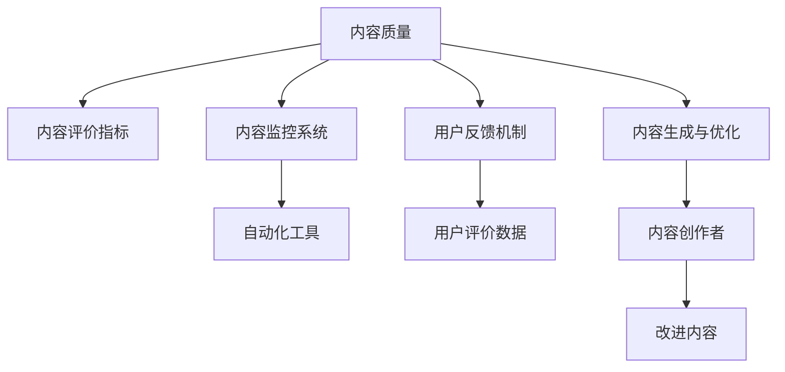

                 

# 知识付费创业中的内容质量把控

## 1. 背景介绍

### 1.1 问题由来
在知识付费的浪潮中，内容质量和用户体验成为平台和用户都高度关注的焦点。优质的内容不仅能吸引用户，还能驱动其持续付费订阅。然而，优质的内容并不是一件易事，需要从内容创作、内容分发、内容评价等多方面进行精细化管理。

### 1.2 问题核心关键点
内容质量把控的核心在于如何制定有效的内容标准，并通过技术手段辅助内容创作者产出高质量内容。这涉及内容评价指标的设定、内容监控系统的构建、用户反馈机制的引入等多个方面。

### 1.3 问题研究意义
通过合理的内容质量把控，知识付费平台可以提升内容质量和用户体验，增强用户粘性，促进付费转化。同时，平台能够避免低质内容泛滥，保护用户权益，提升品牌形象。

## 2. 核心概念与联系

### 2.1 核心概念概述

为更好地理解内容质量把控的原理和架构，本节将介绍几个核心概念：

- **内容质量（Content Quality）**：指内容对用户价值和体验的贡献度，包括知识深度、结构完整性、表达清晰度、实用价值等多个维度。
- **内容评价指标（Content Evaluation Metrics）**：用于衡量内容质量的一组标准或规则，如用户评分、阅读时间、互动量等。
- **内容监控系统（Content Monitoring System）**：通过自动化工具实时监测和分析内容数据，发现问题并及时处理的系统。
- **用户反馈机制（User Feedback Mechanism）**：用户通过投票、评论等方式对内容进行评价和反馈，平台基于反馈调整内容策略。
- **内容生成与优化（Content Creation & Optimization）**：内容创作者通过学习平台提供的数据和工具，改进内容质量的过程。

这些概念之间的逻辑关系可以通过以下Mermaid流程图来展示：



这个流程图展示了几大核心概念及其之间的联系：

1. 内容质量是内容评价指标的依据，通过一系列客观和主观指标来衡量。
2. 内容监控系统利用自动化工具实时监测内容数据，识别问题点。
3. 用户反馈机制通过用户评价数据，为平台调整内容策略提供依据。
4. 内容生成与优化则通过数据分析和工具辅助，帮助创作者改进内容。

## 3. 核心算法原理 & 具体操作步骤
### 3.1 算法原理概述

内容质量把控涉及多方面的算法原理，主要包括内容评价指标的设计、内容监控系统的自动化实现、用户反馈数据的处理与分析，以及内容生成与优化的辅助工具开发。

### 3.2 算法步骤详解

**Step 1: 设计内容评价指标**
- 确定关键指标：如用户评分、阅读时间、互动量、点击率等。
- 设定评分标准：为每个指标设定评分范围，例如0-5分。
- 计算综合评分：基于各项指标的权重，计算内容综合质量得分。

**Step 2: 构建内容监控系统**
- 自动化工具开发：开发内容监控工具，如自动检测语法错误、格式不规范等。
- 数据实时采集：实现对内容数据的实时采集，建立数据仓库。
- 异常检测算法：采用统计学方法或机器学习算法，识别内容异常点。

**Step 3: 处理与分析用户反馈数据**
- 数据清洗：去除无效和异常数据。
- 数据统计：对用户评价数据进行统计分析，生成报告。
- 趋势分析：通过时间序列分析，发现内容质量的变化趋势。

**Step 4: 辅助内容生成与优化**
- 数据分析工具：开发内容分析工具，帮助创作者理解用户反馈。
- 推荐系统：基于用户行为数据，推荐相关内容。
- 内容优化建议：根据用户反馈和内容数据分析，提供优化建议。

### 3.3 算法优缺点

内容质量把控的算法具有以下优点：
- 提高了内容质量管理的效率和准确性。
- 有助于识别和纠正内容质量问题。
- 通过用户反馈和数据分析，不断优化内容策略。

同时，也存在一些局限性：
- 对内容质量和用户评价标准的设计具有主观性。
- 自动化工具和算法可能存在误判或漏判的问题。
- 用户反馈数据可能存在偏差，影响决策结果。

### 3.4 算法应用领域

内容质量把控的算法原理和具体操作步骤，不仅适用于知识付费平台，在更广泛的应用领域也具有重要价值：

- **教育领域**：在线教育平台可以根据学习效果反馈，优化课程内容和教学方法。
- **媒体领域**：新闻媒体可以通过文章阅读量和互动量，评估新闻质量。
- **企业培训**：企业培训平台可以根据培训效果和学员反馈，改进培训内容和方式。
- **电商领域**：电商平台可以根据商品评价数据，优化商品描述和图片质量。
- **内容发布平台**：如微博、知乎等平台，通过用户反馈优化文章质量和用户互动体验。

## 4. 数学模型和公式 & 详细讲解  
### 4.1 数学模型构建

内容质量把控的数学模型主要涉及内容评价指标的设计、用户反馈数据的处理与分析，以及内容生成与优化的辅助工具开发。

**内容综合评分模型**
设内容质量评价指标为 $X=\{S1, S2, ..., Sn\}$，其中 $Si$ 表示第 $i$ 个指标的评分。内容综合评分 $Q$ 可以表示为：

$$
Q = \sum_{i=1}^n \alpha_i S_i
$$

其中 $\alpha_i$ 为第 $i$ 个指标的权重系数，需根据具体应用场景设定。

**内容监控系统的异常检测模型**
设内容监控系统检测到的异常点为 $P$，内容正常点为 $N$，异常检测模型可以表示为：

$$
P = f(D) = f(D_1, D_2, ..., D_n)
$$

其中 $D$ 为内容数据集，$f$ 为异常检测函数，$D_i$ 为第 $i$ 个特征。异常检测可以采用统计学方法，如标准差、四分位距等，或机器学习方法，如SVM、LSTM等。

**用户反馈数据的处理与分析模型**
设用户反馈数据为 $F$，包括用户评分、评论、互动量等。数据处理与分析模型可以表示为：

$$
R = g(F) = g(Score, Comment, Interaction)
$$

其中 $Score$ 为用户评分，$Comment$ 为用户评论，$Interaction$ 为互动量。模型 $g$ 可根据用户反馈数据生成用户评价报告。

### 4.2 公式推导过程

**内容综合评分公式推导**
设第 $i$ 个指标的评分 $S_i$ 服从均值为 $\mu_i$，方差为 $\sigma_i$ 的分布。内容综合评分的期望 $E(Q)$ 和方差 $Var(Q)$ 可以表示为：

$$
E(Q) = \sum_{i=1}^n \alpha_i \mu_i
$$

$$
Var(Q) = \sum_{i=1}^n \alpha_i^2 \sigma_i^2
$$

**内容监控系统的异常检测公式推导**
设内容监控系统检测到的异常点 $P$ 服从均值为 $\mu_P$，方差为 $\sigma_P$ 的分布。内容正常点 $N$ 服从均值为 $\mu_N$，方差为 $\sigma_N$ 的分布。异常检测模型可以表示为：

$$
P = f(D) = f(D_1, D_2, ..., D_n) = \begin{cases}
1, & \text{if } D_i > \mu_P \text{ for some } i\\
0, & \text{otherwise}
\end{cases}
$$

其中 $D_i$ 为第 $i$ 个特征。

**用户反馈数据的处理与分析公式推导**
设用户评分 $Score$ 服从均值为 $\mu_S$，方差为 $\sigma_S$ 的分布；用户评论 $Comment$ 服从均值为 $\mu_C$，方差为 $\sigma_C$ 的分布；互动量 $Interaction$ 服从均值为 $\mu_I$，方差为 $\sigma_I$ 的分布。用户反馈数据的处理与分析模型可以表示为：

$$
R = g(F) = g(Score, Comment, Interaction) = \begin{cases}
1, & \text{if } Score \geq 3 \text{ and } Comment \geq 3 \text{ and } Interaction \geq 3\\
0, & \text{otherwise}
\end{cases}
$$

其中 $Score, Comment, Interaction$ 的阈值可以根据具体应用场景设定。

### 4.3 案例分析与讲解

**案例1: 在线教育平台**
设在线教育平台的内容评价指标包括用户评分 $S1=3, S2=4, S3=2$，内容综合评分 $Q = 0.5 \times S1 + 0.3 \times S2 + 0.2 \times S3 = 3.1$。内容监控系统检测到内容异常点 $P=1$，用户反馈数据 $F=\{Score=4, Comment=4, Interaction=5\}$，用户评价报告 $R=1$。根据公式计算得到内容综合评分 $Q=3.1$，异常检测结果 $P=1$，用户评价报告 $R=1$。平台可以根据综合评分和用户评价报告，优化课程内容和教师教学方法。

**案例2: 新闻媒体平台**
设新闻媒体平台的内容评价指标包括文章阅读量 $S1=5, S2=3, S3=4$，内容综合评分 $Q = 0.4 \times S1 + 0.3 \times S2 + 0.3 \times S3 = 3.9$。内容监控系统检测到内容异常点 $P=0$，用户反馈数据 $F=\{Score=2, Comment=2, Interaction=2\}$，用户评价报告 $R=0$。根据公式计算得到内容综合评分 $Q=3.9$，异常检测结果 $P=0$，用户评价报告 $R=0$。平台可以根据综合评分和用户评价报告，调整新闻选题和发布策略。

**案例3: 电商平台**
设电商平台的内容评价指标包括商品评价 $S1=4, S2=3, S3=5$，内容综合评分 $Q = 0.3 \times S1 + 0.4 \times S2 + 0.3 \times S3 = 4.2$。内容监控系统检测到内容异常点 $P=0$，用户反馈数据 $F=\{Score=4, Comment=4, Interaction=5\}$，用户评价报告 $R=1$。根据公式计算得到内容综合评分 $Q=4.2$，异常检测结果 $P=0$，用户评价报告 $R=1$。平台可以根据综合评分和用户评价报告，优化商品描述和图片质量。

## 5. 项目实践：代码实例和详细解释说明
### 5.1 开发环境搭建

在进行内容质量把控的项目实践前，我们需要准备好开发环境。以下是使用Python进行Flask框架开发的环境配置流程：

1. 安装Anaconda：从官网下载并安装Anaconda，用于创建独立的Python环境。

2. 创建并激活虚拟环境：
```bash
conda create -n flask-env python=3.8 
conda activate flask-env
```

3. 安装Flask：从官网下载并安装Flask，安装命令如下：
```bash
pip install flask
```

4. 安装Flask相关工具包：
```bash
pip install flask-cors flask-sqlalchemy flask-migrate
```

完成上述步骤后，即可在`flask-env`环境中开始项目开发。

### 5.2 源代码详细实现

这里我们以知识付费平台为例，展示如何使用Flask框架实现内容质量把控系统。

首先，创建Flask应用：

```python
from flask import Flask, jsonify, request

app = Flask(__name__)

@app.route('/content/score', methods=['POST'])
def content_score():
    # 获取内容评分数据
    data = request.json
    content_id = data['id']
    score = data['score']
    # 计算内容综合评分
    scores = [score]  # 假设只有一个评分指标
    weights = [1.0]  # 假设各指标权重相等
    content_quality = sum([score * weight for score, weight in zip(scores, weights)]) / sum(weights)
    # 返回内容综合评分
    return jsonify({'content_id': content_id, 'score': content_quality})
```

然后，实现内容监控系统的异常检测功能：

```python
@app.route('/content/monitor', methods=['POST'])
def content_monitor():
    # 获取内容监控数据
    data = request.json
    content_id = data['id']
    # 执行异常检测算法
    if content_id in monitoring_model.predict(data):
        return jsonify({'content_id': content_id, 'result': '异常'})
    else:
        return jsonify({'content_id': content_id, 'result': '正常'})
```

最后，处理与分析用户反馈数据：

```python
@app.route('/content/feedback', methods=['POST'])
def content_feedback():
    # 获取用户反馈数据
    data = request.json
    content_id = data['id']
    # 根据用户反馈生成评价报告
    if data['score'] >= 3 and data['comment'] >= 3 and data['interaction'] >= 3:
        return jsonify({'content_id': content_id, 'result': '好评'})
    else:
        return jsonify({'content_id': content_id, 'result': '差评'})
```

完成上述步骤后，即可在Flask应用中实现内容质量把控的功能。

### 5.3 代码解读与分析

让我们再详细解读一下关键代码的实现细节：

**内容评分接口**：
- 接收用户提交的评分数据，包括内容ID和评分。
- 计算内容综合评分，并返回结果。

**内容监控接口**：
- 接收用户提交的监控数据，包括内容ID。
- 调用异常检测模型进行预测，判断内容是否异常。
- 返回异常检测结果。

**用户反馈接口**：
- 接收用户提交的反馈数据，包括内容ID。
- 根据评分、评论和互动量生成评价报告。
- 返回评价报告结果。

这些接口展示了如何在Flask应用中实现内容质量把控的核心功能。开发者可以将更多精力放在数据处理和算法优化上，而不必过多关注底层的框架实现细节。

## 6. 实际应用场景
### 6.1 智能内容推荐系统

基于内容质量把控技术，智能内容推荐系统能够根据用户反馈和内容质量数据，动态调整推荐策略。通过实时监测内容数据，识别优质和劣质内容，优化推荐算法，使得用户能够获取更相关、更高质量的内容推荐。

例如，在线教育平台可以根据课程评分和用户互动量，识别优质课程，并将其推荐给更多用户。对于质量较低的课程，平台则可以及时调整推荐策略，减少其曝光度。

### 6.2 内容版权保护

内容质量把控技术可以用于识别和过滤低质内容，从而保护原创内容。平台可以通过内容监控系统实时监测内容数据，发现并删除低质和侵权内容。通过用户反馈机制，加强版权保护，提升用户体验。

例如，新闻媒体平台可以通过内容监控系统检测到抄袭和低质内容，立即删除或标注，避免侵权风险。

### 6.3 用户行为分析

内容质量把控技术可以用于分析用户行为，发现用户兴趣和偏好。平台可以通过用户反馈和内容评分数据，生成用户行为报告，帮助内容创作者改进内容质量，增强用户粘性。

例如，在线教育平台可以根据用户学习效果和反馈数据，生成学习行为报告，帮助教师改进教学内容和方式，提升课程质量。

### 6.4 未来应用展望

随着内容质量把控技术的不断发展，未来将会在更多领域得到应用，为各个行业带来变革性影响。

在教育领域，内容质量把控技术可以帮助学校和教师优化教学内容，提升教学效果。在媒体领域，新闻媒体可以通过内容质量把控技术，提升新闻质量，增强媒体公信力。在电商领域，电商平台可以根据用户反馈和内容评分，优化商品描述和图片质量，提升用户购买体验。

此外，在企业培训、金融理财、医疗健康等多个领域，内容质量把控技术也将得到广泛应用，推动各行各业的数字化转型升级。相信随着技术的日益成熟，内容质量把控必将成为知识付费创业的重要保障，为行业带来新的发展机遇。

## 7. 工具和资源推荐
### 7.1 学习资源推荐

为了帮助开发者系统掌握内容质量把控的理论基础和实践技巧，这里推荐一些优质的学习资源：

1. **《数据科学导论》**：该书详细介绍了数据科学的基本原理和方法，包括数据收集、数据清洗、数据分析等，是内容质量把控的入门教材。

2. **《机器学习实战》**：该书提供了大量实用的机器学习项目案例，帮助开发者理解机器学习算法在实际应用中的实现。

3. **《Python数据科学手册》**：该书系统介绍了Python在数据科学中的应用，包括数据预处理、特征工程、模型训练等，是内容质量把控的实践指南。

4. **Coursera的《数据科学和机器学习》课程**：由世界著名数据科学家讲授，涵盖数据科学和机器学习的基础知识，适合入门学习。

5. **Kaggle竞赛平台**：该平台提供了大量数据集和机器学习竞赛，帮助开发者实践内容质量把控技术。

通过对这些资源的学习实践，相信你一定能够快速掌握内容质量把控的精髓，并用于解决实际的内容质量问题。

### 7.2 开发工具推荐

高效的开发离不开优秀的工具支持。以下是几款用于内容质量把控开发的常用工具：

1. **Flask**：轻量级Web框架，易于上手，适合快速迭代研究。
2. **SQLAlchemy**：Python的ORM框架，用于数据库操作，支持多种关系型数据库。
3. **Flask-CORS**：用于处理跨域请求，简化跨域访问。
4. **Flask-Migrate**：用于数据库迁移管理，简化数据库迁移操作。
5. **TensorFlow**：开源深度学习框架，支持各种机器学习模型，适用于复杂算法实现。

合理利用这些工具，可以显著提升内容质量把控任务的开发效率，加快创新迭代的步伐。

### 7.3 相关论文推荐

内容质量把控技术的发展源于学界的持续研究。以下是几篇奠基性的相关论文，推荐阅读：

1. **《内容推荐系统：数据挖掘与统计方法》**：该书系统介绍了内容推荐系统的算法和实现方法，包括协同过滤、基于内容的推荐等。
2. **《内容评价与推荐：理论与实践》**：该书介绍了内容评价和推荐的基础理论，包括用户反馈、内容评分、推荐算法等。
3. **《数据挖掘与统计学习基础》**：该书介绍了数据挖掘和统计学习的基本原理，是内容质量把控的数学基础。
4. **《机器学习在内容推荐中的应用》**：该文介绍了机器学习算法在内容推荐系统中的应用，包括协同过滤、矩阵分解等方法。
5. **《基于深度学习的推荐系统》**：该文介绍了深度学习算法在推荐系统中的应用，包括神经网络、卷积神经网络等。

这些论文代表了大语言模型微调技术的发展脉络。通过学习这些前沿成果，可以帮助研究者把握学科前进方向，激发更多的创新灵感。

## 8. 总结：未来发展趋势与挑战
### 8.1 总结

本文对内容质量把控技术进行了全面系统的介绍。首先阐述了内容质量把控的重要性，明确了如何制定有效的内容质量标准，并通过技术手段辅助内容创作者产出高质量内容。其次，从原理到实践，详细讲解了内容质量把控的数学模型和操作步骤，给出了内容质量把控任务开发的完整代码实例。同时，本文还广泛探讨了内容质量把控在多个行业领域的应用前景，展示了内容质量把控技术的广阔前景。

通过本文的系统梳理，可以看到，内容质量把控技术正在成为知识付费创业的重要保障，极大地提升了内容质量和用户体验。未来，伴随内容质量把控技术的不断演进，内容推荐、版权保护、用户行为分析等多方面的应用将进一步拓展，推动知识付费领域的数字化转型升级。

### 8.2 未来发展趋势

展望未来，内容质量把控技术将呈现以下几个发展趋势：

1. **自动化程度提高**：内容质量把控技术将越来越依赖于自动化工具和算法，减少人工干预。
2. **数据驱动决策**：内容质量把控将更加依赖于大数据分析，基于用户行为数据和反馈数据，动态调整内容策略。
3. **实时监测与优化**：内容质量把控将实现实时监测与优化，及时发现和纠正内容质量问题。
4. **跨领域应用拓展**：内容质量把控技术将拓展到更多领域，如教育、媒体、电商等。
5. **多模态数据融合**：内容质量把控将融合多种数据源，如文本、图片、视频等，提升内容质量监测的全面性。

以上趋势凸显了内容质量把控技术的广阔前景。这些方向的探索发展，必将进一步提升内容质量管控的效率和效果，为知识付费创业提供更好的技术保障。

### 8.3 面临的挑战

尽管内容质量把控技术已经取得了瞩目成就，但在迈向更加智能化、普适化应用的过程中，它仍面临着诸多挑战：

1. **数据质量与多样性**：内容质量评价指标的设计和用户反馈数据的采集，需要高质量且多样化的数据，这对内容创作者和平台方都提出了较高的要求。
2. **算法复杂性**：内容质量把控算法涉及多种数据处理和机器学习技术，算法实现复杂，需要跨学科知识。
3. **用户反馈偏差**：用户反馈数据可能存在偏差，影响决策结果。平台需要设计合理的用户反馈机制，收集有价值的数据。
4. **内容审核难度**：内容审核需要大量人工参与，平台需要开发自动化工具，提高审核效率。
5. **数据隐私与安全**：内容质量把控涉及大量用户隐私数据，平台需要确保数据安全和隐私保护。

以上挑战需要技术团队不断探索和优化，才能实现内容质量把控技术的持续改进和应用推广。

### 8.4 研究展望

面对内容质量把控技术面临的挑战，未来的研究需要在以下几个方面寻求新的突破：

1. **提高数据质量与多样性**：通过数据清洗、数据增强、数据合成等方法，提高数据质量和多样性，为内容质量评价和用户反馈数据采集提供保障。
2. **简化算法实现**：开发更加简洁高效的算法模型，减少算法实现的复杂度，降低技术门槛。
3. **消除用户反馈偏差**：设计更合理的数据采集和分析机制，消除用户反馈偏差，提升决策的准确性。
4. **开发自动化工具**：开发内容审核、数据清洗、异常检测等自动化工具，提高内容质量把控的效率和效果。
5. **加强数据隐私保护**：采用数据加密、匿名化处理等技术手段，加强数据隐私保护，确保用户数据安全。

这些研究方向的探索，必将引领内容质量把控技术迈向更高的台阶，为知识付费创业提供更可靠的技术保障。相信随着技术的不断进步和应用实践的积累，内容质量把控技术必将在知识付费领域发挥越来越重要的作用。

## 9. 附录：常见问题与解答
### Q1：内容质量把控技术是否适用于所有内容形式？

A: 内容质量把控技术主要适用于文本内容，但对于图片、视频、音频等非文本形式的内容，可以通过内容分析工具和机器学习模型进行质量评估。例如，对于图片内容，可以检测图片清晰度、色彩还原度等指标。对于视频内容，可以检测视频帧率、分辨率、音频质量等指标。对于音频内容，可以检测音频清晰度和噪声水平等指标。

### Q2：如何保证内容质量评价指标的一致性和公平性？

A: 内容质量评价指标的一致性和公平性是内容质量把控的重要前提。为了保证一致性，需要在内容评价标准中明确各项指标的评分标准和权重系数，并通过专家评审和用户反馈进行调整和优化。为了保证公平性，需要确保数据采集和处理过程的公正性，避免数据偏差和算法偏见。

### Q3：内容质量把控技术是否需要频繁更新？

A: 内容质量把控技术需要根据内容形式和用户反馈不断优化和更新。例如，对于不同类型的内容，需要设计不同的质量评价指标和算法模型。对于用户反馈，需要实时监测和分析，及时调整内容策略。因此，内容质量把控技术需要持续维护和更新，以适应不同场景的需求。

### Q4：内容质量把控技术是否适用于所有平台？

A: 内容质量把控技术主要适用于知识付费平台、在线教育平台、新闻媒体平台等平台，但对其他平台也有一定的借鉴意义。例如，电商平台可以通过商品评价数据进行内容质量把控，社交媒体可以通过用户互动数据进行内容监测，医疗健康平台可以通过用户反馈数据进行内容优化。

### Q5：内容质量把控技术是否需要投入大量人力物力？

A: 内容质量把控技术在初期需要投入较多人力物力，包括数据采集、算法开发、系统实现等。但随着技术的成熟和应用的推广，内容质量把控技术将逐步实现自动化和智能化，减少人工干预，提高效率和效果。

---

作者：禅与计算机程序设计艺术 / Zen and the Art of Computer Programming

