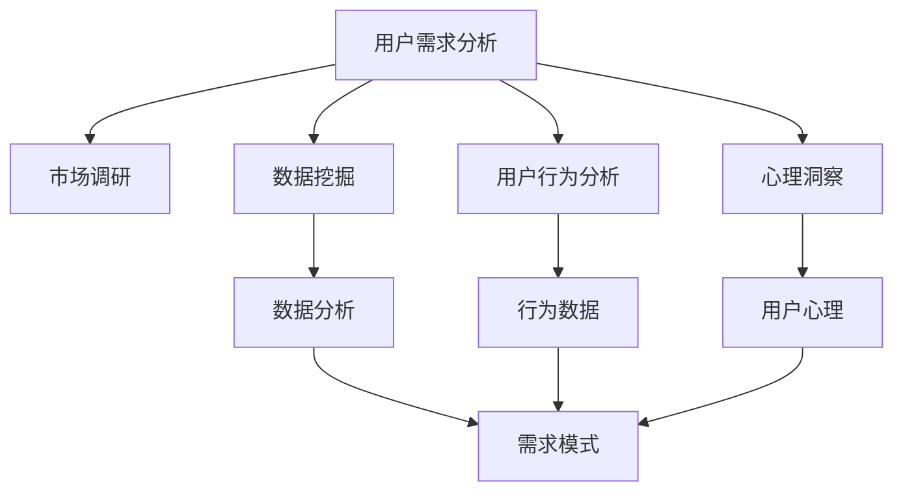

                 

# 知识付费创业中的用户需求挖掘技巧

> 关键词：用户需求分析, 市场调研, 数据挖掘, 用户行为分析, 心理洞察, 数据可视化

## 1. 背景介绍

### 1.1 问题由来
随着互联网和智能设备的普及，知识付费市场迅速崛起。各种知识付费平台、应用、课程和内容层出不穷，用户也越来越多地消费知识产品。然而，如何在众多知识付费产品中脱颖而出，满足用户需求，成为创业公司亟需解决的核心问题。

### 1.2 问题核心关键点
用户需求挖掘是知识付费创业的关键，它决定了产品的定位、内容选择和营销策略。深入理解用户需求，不仅能够提高产品竞争力，还能帮助公司获取更大的市场份额。然而，这一过程复杂而多维度，需要综合运用市场调研、数据分析、用户行为分析、心理学等多种方法。

## 2. 核心概念与联系

### 2.1 核心概念概述

为了更好地理解用户需求挖掘的各个方面，本节将介绍几个关键概念：

- 用户需求分析：通过各种方法收集和分析用户反馈、行为数据等，理解用户的潜在需求和偏好。
- 市场调研：通过问卷调查、焦点小组等形式，了解市场动态和用户需求。
- 数据挖掘：应用数据科学和机器学习技术，从大量数据中发现隐藏的用户需求模式和趋势。
- 用户行为分析：利用网站、应用等平台的数据，分析用户行为路径、消费习惯等。
- 心理洞察：通过心理学原理，洞察用户内心的需求和动机。
- 数据可视化：使用图表、图形等直观形式，将数据和分析结果呈现出来。

这些概念相互关联，共同构成了用户需求挖掘的核心框架。通过理解这些概念，我们可以更好地设计和实施用户需求挖掘策略。

### 2.2 核心概念原理和架构的 Mermaid 流程图



这个流程图展示了用户需求挖掘的关键步骤及其相互关系：

1. 用户需求分析：起点，通过多种方法收集用户信息。
2. 市场调研：了解市场和竞争环境，识别用户潜在需求。
3. 数据挖掘：分析海量数据，发现用户需求模式和趋势。
4. 用户行为分析：研究用户在平台上的具体行为，洞察需求。
5. 心理洞察：深入理解用户的心理需求和动机。
6. 数据分析：从数据中提取有意义的信息，支持需求挖掘。
7. 行为数据和心理洞察结果融合，发现用户实际需求模式。

这些步骤共同构成了一个全面、系统的用户需求挖掘流程。

## 3. 核心算法原理 & 具体操作步骤
### 3.1 算法原理概述

用户需求挖掘的本质是从用户数据中提取有意义的信息，识别用户潜在的需求和偏好。其核心算法包括但不限于以下几种：

- 聚类算法（Clustering）：通过将用户分成不同的群体，发现不同群体之间的需求差异。
- 关联规则挖掘（Association Rule Mining）：发现用户行为之间的关联关系，识别潜在的需求。
- 文本挖掘（Text Mining）：从用户评论、反馈中提取有价值的信息，理解用户需求。
- 情感分析（Sentiment Analysis）：分析用户情感倾向，判断需求的正负面。
- 主题建模（Topic Modeling）：从大量文本数据中识别主题和用户关注点。

这些算法均基于统计学和机器学习的原理，通过数据驱动的方式，揭示用户需求的模式和趋势。

### 3.2 算法步骤详解

用户需求挖掘的具体操作步骤可以分为以下几步：

**Step 1: 数据收集**

收集用户数据，包括但不限于：
- 用户基本信息（年龄、性别、职业等）
- 用户行为数据（浏览记录、购买历史等）
- 用户评论、反馈、评分等文本数据

**Step 2: 数据预处理**

对收集到的数据进行清洗和预处理，包括：
- 数据去重、异常值处理
- 数据格式统一、标准化
- 数据划分训练集和测试集

**Step 3: 数据分析**

应用各种数据分析方法，从数据中提取有意义的信息，包括：
- 用户行为路径分析
- 用户行为模式识别
- 用户需求聚类
- 情感倾向分析

**Step 4: 需求洞察**

根据分析结果，洞察用户需求，得出以下结论：
- 用户主要关注的需求点
- 不同用户群体的需求差异
- 潜在需求和市场机会

**Step 5: 结果验证**

通过后续的A/B测试、市场调研等手段，验证需求挖掘结果的准确性和可行性。

**Step 6: 迭代优化**

根据验证结果，不断优化需求挖掘策略和算法，提升挖掘效果。

### 3.3 算法优缺点

用户需求挖掘的算法具有以下优点：
- 数据驱动：能够客观、准确地发现用户需求
- 高效性：能够快速处理大量数据，发现用户行为模式
- 可扩展性：可以应用于多种类型的用户数据

同时，这些算法也存在一些缺点：
- 数据质量依赖：数据收集和处理过程繁琐，数据质量影响结果
- 算法复杂性：部分算法需要复杂的数学和统计模型，实施难度大
- 结果解释性：部分算法结果难以直观理解，需要专业知识

## 4. 数学模型和公式 & 详细讲解 & 举例说明

### 4.1 数学模型构建

用户需求挖掘的数学模型可以基于以下假设：
- 用户需求是隐含在数据中的，需要通过数据分析手段挖掘出来。
- 数据集足够大，能够代表用户群体的真实需求。

可以构建以下数学模型：

$$
\hat{y} = f(x) + \epsilon
$$

其中，$\hat{y}$ 为预测的用户需求，$x$ 为输入数据，$f(x)$ 为模型函数，$\epsilon$ 为随机误差。

### 4.2 公式推导过程

以关联规则挖掘为例，推导用户行为之间的关联关系。

假设用户行为集合为 $B = \{b_1, b_2, ..., b_m\}$，其中 $b_i$ 为某个行为。如果 $b_i$ 和 $b_j$ 频繁同时出现，则存在关联关系。可以通过以下公式计算关联度：

$$
supp(B) = \frac{|B|}{|D|}
$$

其中，$supp(B)$ 为关联规则 $B$ 的支持度，$|B|$ 为行为集合 $B$ 的大小，$|D|$ 为数据集 $D$ 的大小。

### 4.3 案例分析与讲解

假设某知识付费平台的数据挖掘结果显示，用户浏览课程时，往往同时购买了相关书籍。这表明用户需求之间存在显著的关联性。可以进一步分析用户在不同课程和书籍之间的关联关系，优化推荐策略，提升用户体验和满意度。

## 5. 项目实践：代码实例和详细解释说明

### 5.1 开发环境搭建

在进行用户需求挖掘项目实践前，需要准备以下开发环境：

1. 安装Python：确保环境中的Python版本为3.6或以上，可以通过以下命令检查：
```bash
python --version
```

2. 安装Pandas：
```bash
pip install pandas
```

3. 安装NumPy：
```bash
pip install numpy
```

4. 安装Scikit-learn：
```bash
pip install scikit-learn
```

5. 安装Seaborn和Matplotlib：
```bash
pip install seaborn matplotlib
```

6. 安装TensorFlow：
```bash
pip install tensorflow
```

### 5.2 源代码详细实现

以下是一个简单的用户行为数据分析项目，使用Python的Pandas、NumPy和Matplotlib库进行实现。

```python
import pandas as pd
import numpy as np
import matplotlib.pyplot as plt

# 读取用户行为数据
data = pd.read_csv('user_behavior_data.csv')

# 数据预处理
data = data.dropna()  # 删除缺失值
data = data.drop_duplicates()  # 删除重复行

# 行为分析
behavior_counts = data['behavior'].value_counts()
plt.bar(behavior_counts.index, behavior_counts.values)
plt.title('User Behavior Distribution')
plt.xlabel('Behavior')
plt.ylabel('Frequency')
plt.show()

# 用户聚类
from sklearn.cluster import KMeans
kmeans = KMeans(n_clusters=3)
kmeans.fit(data[['age', 'gender', 'occupation']])
clusters = kmeans.labels_
plt.scatter(data['age'], data['gender'], c=clusters)
plt.xlabel('Age')
plt.ylabel('Gender')
plt.show()
```

### 5.3 代码解读与分析

**用户行为数据分析**：
- 使用Pandas库读取用户行为数据，并将其转换为DataFrame对象。
- 删除缺失值和重复行，确保数据的准确性。
- 统计不同行为的出现次数，使用Matplotlib绘制柱状图，直观展示不同行为的用户分布。

**用户聚类分析**：
- 使用Scikit-learn库中的KMeans算法对用户进行聚类。
- 根据年龄、性别、职业等特征，将用户分成3个不同的群体。
- 使用Matplotlib绘制散点图，展示不同群体在年龄和性别上的分布。

通过这些简单的代码示例，我们可以初步掌握用户需求挖掘的基本实现方法。

### 5.4 运行结果展示

运行上述代码后，将得到以下结果：

- 用户行为分布图
- 用户聚类散点图

这些图表直观展示了用户行为和聚类结果，为进一步的需求挖掘提供了直观的参考。

## 6. 实际应用场景

### 6.1 智能推荐系统

智能推荐系统是知识付费平台的重要组成部分，能够帮助用户发现感兴趣的课程和内容。通过用户行为数据分析和用户聚类，可以构建更加精准、个性化的推荐模型，提升用户满意度和平台留存率。

**具体应用**：
- 通过关联规则挖掘，发现用户行为之间的关联关系。
- 利用用户聚类分析，将用户分成不同的群体，针对不同群体推荐不同的内容。
- 应用情感分析，理解用户对推荐内容的情感倾向，优化推荐策略。

### 6.2 内容策划与创作

内容策划与创作是知识付费平台的另一核心环节，能够帮助平台吸引更多的用户和内容创作者。通过用户需求挖掘，可以识别出用户感兴趣的内容主题和格式，指导内容创作和策划。

**具体应用**：
- 使用文本挖掘技术，分析用户评论和反馈，提取热门主题和格式。
- 结合情感分析，了解用户对不同内容的情感倾向，指导内容创作方向。
- 应用主题建模，发现潜在的需求主题，指导内容策划。

### 6.3 用户留存与流失预警

用户留存与流失预警是知识付费平台运营的重要指标，能够帮助平台及时采取措施，提升用户留存率。通过用户需求挖掘，可以发现用户流失的预警信号，及时干预，提升用户粘性。

**具体应用**：
- 应用用户行为分析，识别出流失用户的典型行为模式。
- 利用关联规则挖掘，发现流失用户之间的关联关系。
- 通过心理洞察，理解用户流失的深层次原因，制定相应的留存策略。

### 6.4 未来应用展望

随着大数据、人工智能技术的不断发展，用户需求挖掘也将迎来新的突破。未来的应用场景可能包括：

- 多模态数据融合：结合文本、语音、图像等多种数据类型，全面挖掘用户需求。
- 实时数据分析：利用流计算和实时数据处理技术，实现对用户需求的实时分析。
- 跨平台数据整合：整合不同平台的数据，全面了解用户需求。
- 自动化需求挖掘：利用自动化工具和算法，自动挖掘用户需求，减少人工干预。

## 7. 工具和资源推荐

### 7.1 学习资源推荐

为了帮助创业者系统掌握用户需求挖掘的理论和实践方法，以下是一些优质的学习资源：

1. 《数据分析与数据挖掘》课程：清华大学开设的在线课程，系统介绍了数据分析和数据挖掘的基本原理和应用。
2. 《Python数据科学手册》书籍：由Jake VanderPlas撰写，详细介绍了Python在数据分析和机器学习中的应用。
3. 《用户行为分析》书籍：由Ian T. Allen撰写，介绍了用户行为分析的基本方法和技术。
4. 《市场调研与用户洞察》在线课程：由Coursera提供，系统介绍了市场调研和用户洞察的基本方法。
5. Kaggle数据集和竞赛：Kaggle提供了丰富的数据集和竞赛，可以帮助用户实践和验证用户需求挖掘的方法。

### 7.2 开发工具推荐

以下是几款常用的用户需求挖掘开发工具：

1. Python：数据科学和机器学习的主流编程语言，具有丰富的数据分析和机器学习库。
2. Pandas：用于数据处理和分析的Python库，支持数据清洗、预处理和可视化。
3. NumPy：用于数值计算和科学计算的Python库，支持高效的数组操作和线性代数计算。
4. Scikit-learn：用于机器学习的Python库，支持分类、回归、聚类等多种算法。
5. TensorFlow：用于深度学习的开源框架，支持分布式计算和大规模数据处理。
6. PyTorch：另一个流行的深度学习框架，支持动态图计算和模型部署。
7. Tableau：数据可视化工具，支持数据的交互式可视化和分析。
8. Power BI：微软推出的商业智能工具，支持多维数据分析和可视化。

合理利用这些工具，可以显著提升用户需求挖掘的开发效率，加速创新迭代的步伐。

### 7.3 相关论文推荐

用户需求挖掘领域的研究论文众多，以下是一些经典论文，推荐阅读：

1. "A Survey on Clustering Data" by Jianjun Wang et al.：综述了各种聚类算法及其应用，提供了全面的理论基础。
2. "Association Rules in Market Basket Analysis" by Jiawei Han et al.：介绍了关联规则挖掘的基本原理和技术，应用到市场篮子分析中。
3. "Text Mining: A Concept Whose Time Has Come and Gone" by Hector Garcia-Molina et al.：回顾了文本挖掘的发展历程和技术，提供了深入的理论和实践方法。
4. "Sentiment Analysis with Deep Learning" by Diligent Xie et al.：介绍了情感分析的基本方法和应用，利用深度学习提升分析效果。
5. "Topic Modeling for Statistical Learning" by Andrew P. D. Brown et al.：介绍了主题建模的基本原理和技术，应用到文本数据分析中。

这些论文代表了用户需求挖掘领域的重要研究进展，通过学习这些前沿成果，可以帮助研究者把握学科前进方向，激发更多的创新灵感。

## 8. 总结：未来发展趋势与挑战

### 8.1 总结

本文对用户需求挖掘的各个方面进行了全面系统的介绍。首先阐述了用户需求挖掘的重要性和实现方法，明确了微调在拓展预训练模型应用、提升下游任务性能方面的独特价值。其次，从原理到实践，详细讲解了用户需求挖掘的数学模型和操作步骤，给出了用户需求挖掘任务开发的完整代码实例。同时，本文还广泛探讨了用户需求挖掘方法在智能推荐、内容策划、用户留存等诸多行业领域的应用前景，展示了用户需求挖掘范式的巨大潜力。此外，本文精选了用户需求挖掘技术的各类学习资源，力求为读者提供全方位的技术指引。

通过本文的系统梳理，可以看到，用户需求挖掘技术正在成为知识付费创业中的核心竞争力，极大地拓展了产品开发和市场推广的边界，催生了更多的落地场景。受益于大数据、人工智能技术的不断发展，用户需求挖掘必将更加深入和广泛地应用于各种行业，为经济社会发展注入新的动力。

### 8.2 未来发展趋势

展望未来，用户需求挖掘技术将呈现以下几个发展趋势：

1. 数据智能化：利用AI和大数据技术，实现对用户需求的高效分析和挖掘。
2. 多模态融合：结合文本、语音、图像等多种数据类型，全面挖掘用户需求。
3. 实时性提升：利用流计算和实时数据处理技术，实现对用户需求的实时分析。
4. 自动化增强：利用自动化工具和算法，自动挖掘用户需求，减少人工干预。
5. 个性化定制：根据用户行为和心理需求，实现更加个性化、精准的需求挖掘。
6. 伦理与安全：在挖掘过程中，重视用户隐私保护和数据安全，确保合规性。

以上趋势凸显了用户需求挖掘技术的广阔前景。这些方向的探索发展，必将进一步提升知识付费平台的竞争力，为行业带来新的突破。

### 8.3 面临的挑战

尽管用户需求挖掘技术已经取得了瞩目成就，但在迈向更加智能化、普适化应用的过程中，它仍面临着诸多挑战：

1. 数据隐私问题：用户数据的收集和使用需要严格遵守隐私保护法规，确保用户隐私不被侵犯。
2. 数据质量问题：用户数据的准确性和完整性直接影响挖掘结果的准确性。
3. 算法复杂性问题：部分用户需求挖掘算法需要复杂的数学和统计模型，实施难度大。
4. 结果解释性问题：用户需求挖掘结果难以直观理解，需要专业知识支持。
5. 跨平台整合问题：不同平台的数据格式和格式不一致，整合难度大。
6. 用户心理问题：用户心理需求和动机复杂，难以通过客观数据全面了解。

这些挑战需要不断优化和完善用户需求挖掘方法，增强算法的可解释性和合规性，提升数据的准确性和完整性，才能实现更加高效、可靠的用户需求挖掘。

### 8.4 研究展望

面对用户需求挖掘所面临的种种挑战，未来的研究需要在以下几个方面寻求新的突破：

1. 引入更多先验知识：将符号化的先验知识，如知识图谱、逻辑规则等，与神经网络模型进行巧妙融合，引导需求挖掘过程学习更准确、合理的用户需求。
2. 增强算法可解释性：通过引入因果分析和博弈论工具，增强用户需求挖掘结果的可解释性和逻辑性。
3. 实现跨平台数据整合：通过数据标准化和格式转换技术，实现不同平台数据的有效整合。
4. 利用人工智能辅助分析：结合人工智能技术，实现对用户需求的高效分析和挖掘。
5. 重视用户隐私保护：在用户需求挖掘过程中，严格遵守隐私保护法规，确保用户数据安全。

这些研究方向的应用和发展，必将推动用户需求挖掘技术迈向更高的台阶，为知识付费平台和其他领域带来新的突破。

## 9. 附录：常见问题与解答

**Q1：用户需求挖掘是否适用于所有知识付费平台？**

A: 用户需求挖掘技术可以应用于各种知识付费平台，但其效果和适用性取决于平台的具体业务模式和用户群体。对于特定领域或特定用户群体的平台，可能需要结合领域知识和用户行为特征，进一步优化挖掘方法和模型。

**Q2：如何选择合适的用户行为分析方法？**

A: 选择合适的用户行为分析方法需要考虑平台的用户类型、业务模式和数据特点。常见的用户行为分析方法包括：
- 关联规则挖掘：适用于发现用户行为之间的关联关系
- 用户行为路径分析：适用于分析用户行为路径和行为模式
- 聚类分析：适用于识别不同用户群体的需求差异

**Q3：数据隐私问题如何解决？**

A: 解决数据隐私问题需要严格遵守相关法规，如GDPR等。可以通过以下方式：
- 匿名化处理：对用户数据进行匿名化处理，保护用户隐私。
- 数据加密：对用户数据进行加密存储和传输，防止数据泄露。
- 用户同意：在数据收集和使用前，获取用户同意，并公开数据使用目的。

**Q4：数据质量问题如何解决？**

A: 提升数据质量需要从数据收集、存储、处理等多个环节进行优化。具体方法包括：
- 数据清洗：对数据进行去重、去噪、填补缺失值等处理，提升数据质量。
- 数据验证：通过数据验证技术，检测和修复数据异常。
- 数据采集：通过多渠道采集数据，丰富数据来源，提升数据代表性。

**Q5：用户心理洞察如何实现？**

A: 用户心理洞察需要结合心理学原理和数据分析技术。具体方法包括：
- 用户调研：通过问卷调查、焦点小组等形式，了解用户需求和动机。
- 用户画像：构建用户画像，了解不同用户群体的心理特征。
- 情感分析：应用情感分析技术，理解用户对产品或服务的情感倾向。

这些问题的解答可以为知识付费创业中用户需求挖掘的实践提供指导和参考，帮助创业者更加全面、系统地理解用户需求，提高产品的竞争力和市场表现。

---

作者：禅与计算机程序设计艺术 / Zen and the Art of Computer Programming

