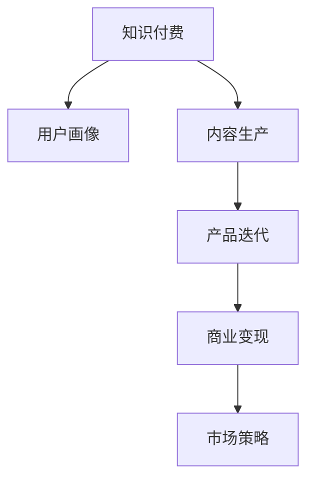

                 

# 知识付费创业的产品线扩展思路

## 1. 背景介绍

### 1.1 问题由来

随着知识付费时代的到来，越来越多的用户开始关注自我提升和终身学习。知识付费产品（如在线课程、电子书、专栏文章等）的兴起，为创业者提供了巨大的机会。然而，知识付费市场的竞争日趋激烈，如何拓展产品线，满足不同用户的需求，成为各大创业公司亟需解决的问题。

### 1.2 问题核心关键点

在知识付费领域，创业公司面临的核心问题主要包括：

1. **用户画像分析**：如何精准定位目标用户群体，获取用户偏好信息，提升产品定制化程度。
2. **内容生产管理**：如何高效组织内容生产团队，构建内容审核机制，保证内容质量。
3. **产品迭代优化**：如何通过用户反馈，不断优化产品功能和用户体验，提升用户粘性。
4. **商业变现模式**：如何设计合理的商业模式，实现知识付费产品的可持续发展。
5. **市场竞争策略**：如何在激烈的市场竞争中，打造具有核心竞争力的产品，占据市场份额。

### 1.3 问题研究意义

深入理解知识付费产品线的扩展思路，对于创业者把握市场机会，提升产品竞争力具有重要意义：

1. **降低市场风险**：通过精准的市场分析和用户研究，降低产品上线风险，避免盲目跟风。
2. **提升用户满意度**：通过科学的产品设计和内容管理，提升用户对产品的满意度和忠诚度。
3. **实现可持续增长**：通过合理的商业变现模式和市场策略，确保知识付费产品的长期发展。
4. **增强市场竞争力**：通过不断的产品创新和优化，保持领先地位，吸引更多用户和投资者关注。

## 2. 核心概念与联系

### 2.1 核心概念概述

为更好地理解知识付费产品线的扩展思路，本节将介绍几个密切相关的核心概念：

- **知识付费**：指用户为获取专业知识、技能提升等内容而进行付费的行为，主要形式包括在线课程、电子书、专栏文章等。
- **用户画像**：指对目标用户群体的基本信息、行为习惯、需求偏好等进行综合分析，构建用户特征模型。
- **内容生产**：指通过组织专家、学者、行业人士等，创作有价值、有深度的内容，满足用户学习需求。
- **产品迭代**：指通过用户反馈、数据分析等手段，不断优化产品功能和用户体验，提升产品竞争力。
- **商业变现**：指通过多样化的商业策略（如广告、会员订阅、付费课程等）实现知识付费产品的盈利目标。
- **市场策略**：指在竞争激烈的知识付费市场中，制定有效的市场推广、产品定价、用户运营等策略，提升市场份额和用户数量。

这些核心概念之间的逻辑关系可以通过以下Mermaid流程图来展示：



这个流程图展示出知识付费产品线的核心环节，及其相互之间的关联：

1. **用户画像**：基于用户数据，分析用户需求，构建用户特征模型。
2. **内容生产**：根据用户画像，组织内容创作者，生产满足用户需求的内容。
3. **产品迭代**：通过用户反馈，优化产品功能和用户体验。
4. **商业变现**：根据市场需求，设计合理的盈利模式，实现产品盈利。
5. **市场策略**：通过有效的市场推广和运营策略，提升产品市场占有率。

这些概念共同构成了知识付费产品线的全流程管理框架，帮助创业者从整体上把握产品拓展的思路和方法。

## 3. 核心算法原理 & 具体操作步骤
### 3.1 算法原理概述

知识付费产品线的扩展思路，本质上是一个基于用户画像、内容生产、产品迭代、商业变现和市场策略的多目标优化问题。其核心思想是：通过科学的市场分析和用户研究，构建精准的用户画像，组织高效的内容生产团队，不断优化产品功能和体验，设计合理的商业变现策略，制定有效的市场推广方案，实现知识付费产品的良性循环。

### 3.2 算法步骤详解

知识付费产品线的扩展思路，通常包括以下几个关键步骤：

**Step 1: 用户画像构建**
- 收集用户基本信息，如年龄、性别、职业、地域等。
- 分析用户行为数据，如访问历史、购买记录、反馈意见等。
- 使用聚类、分类等算法，对用户进行分组，构建用户特征模型。

**Step 2: 内容生产优化**
- 根据用户画像，确定内容选题和创作方向。
- 组织专家、学者、行业人士等，开展内容创作活动。
- 引入内容审核机制，保证内容质量，避免低质内容产生。

**Step 3: 产品功能迭代**
- 收集用户反馈，分析用户使用数据，识别产品痛点和不足。
- 优化产品功能，提升用户体验，如界面设计、交互方式等。
- 引入A/B测试、用户调研等方法，验证产品改进效果。

**Step 4: 商业变现设计**
- 设计多样化的变现策略，如广告、会员订阅、付费课程等。
- 根据用户行为和数据，制定合理的定价策略。
- 优化商业模型，提升产品盈利能力，如引入广告分成、会员激励等。

**Step 5: 市场策略制定**
- 分析市场竞争环境，确定竞争优势和市场定位。
- 制定有效的市场推广方案，如SEO优化、社交媒体营销等。
- 设计用户运营策略，提升用户留存率和活跃度。

### 3.3 算法优缺点

知识付费产品线的扩展思路，具有以下优点：

1. **数据驱动决策**：通过用户数据和市场分析，进行科学决策，提升产品定制化程度。
2. **内容质量保证**：通过专业的内容审核机制，保证内容的高质量和权威性，提升用户满意度。
3. **用户粘性提升**：通过产品迭代优化，不断提升用户体验，增强用户粘性。
4. **多元盈利模式**：设计多样化的商业变现策略，实现知识付费产品的可持续发展。
5. **市场竞争力提升**：通过市场策略优化，提升产品市场占有率和用户数量。

同时，该方法也存在一定的局限性：

1. **数据隐私问题**：收集和使用用户数据可能涉及隐私风险，需要严格遵守数据保护法规。
2. **内容版权问题**：涉及侵权风险，需要确保内容创作和使用符合版权法律。
3. **用户支付意愿**：用户对知识付费的支付意愿较低，可能影响盈利效果。
4. **市场竞争激烈**：知识付费市场竞争激烈，需要不断创新和优化产品，才能保持竞争优势。
5. **市场推广成本**：有效的市场推广需要投入大量资源，可能对初期运营产生较大压力。

尽管存在这些局限性，但就目前而言，基于用户画像、内容生产、产品迭代、商业变现和市场策略的多目标优化方法仍是最主流的产品线扩展思路。未来相关研究的重点在于如何进一步提升数据驱动决策的精准度，降低内容生产和用户运营成本，提升产品盈利能力，同时兼顾用户隐私保护和版权法律要求。

### 3.4 算法应用领域

基于知识付费产品线的扩展思路，在教育、科技、健康、金融等众多领域已经得到了广泛的应用，为相关行业带来了新的发展机会。

1. **教育培训**：通过在线课程、电子书、直播讲座等形式，提供丰富的教育资源，帮助用户提升职业技能。
2. **科技产品**：通过技术培训、编程课程等，帮助开发者提升技术能力，加速技术创新。
3. **健康管理**：通过健康课程、健身指导等，为用户提供科学的健康管理方案，改善生活质量。
4. **金融投资**：通过财经知识、投资策略等课程，帮助用户提升投资理财水平，实现财富增值。
5. **艺术设计**：通过艺术创作、设计技能等课程，帮助用户提升艺术审美和设计水平。

除了上述这些经典应用外，知识付费产品线的扩展思路也被创新性地应用到更多场景中，如职业发展、个人成长、生活技能等，为个人发展和自我提升提供了新的途径。

## 4. 数学模型和公式 & 详细讲解 & 举例说明

### 4.1 数学模型构建

本节将使用数学语言对知识付费产品线的扩展思路进行更加严格的刻画。

记知识付费产品线扩展过程为 $M: \mathcal{U} \rightarrow \mathcal{C}$，其中 $\mathcal{U}$ 为用户画像空间，$\mathcal{C}$ 为内容生产、产品迭代、商业变现和市场策略空间。

定义知识付费产品线扩展的目标函数为 $\mathcal{F}(M) = f_{\text{用户画像}}(u) + f_{\text{内容生产}}(c) + f_{\text{产品迭代}}(p) + f_{\text{商业变现}}(v) + f_{\text{市场策略}}(s)$，其中 $u, c, p, v, s$ 分别表示用户画像、内容生产、产品迭代、商业变现和市场策略的子目标函数。

### 4.2 公式推导过程

以用户画像构建为例，假设收集到的用户数据为 $\mathcal{D} = \{(x_i, y_i)\}_{i=1}^N$，其中 $x_i \in \mathbb{R}^d$ 为特征向量，$y_i \in \{0, 1\}$ 为标签（是否属于某个用户画像类别）。

用户画像构建的目标是找到最优的特征映射函数 $f: \mathcal{U} \rightarrow \mathbb{R}^d$，使得对任意 $x_i \in \mathcal{D}$，有 $y_i = \mathbb{1}(f(x_i))$，其中 $\mathbb{1}$ 为示性函数。

将数据 $\mathcal{D}$ 划分为训练集 $\mathcal{D}^{\text{train}}$ 和验证集 $\mathcal{D}^{\text{valid}}$，定义用户画像构建的损失函数为 $\mathcal{L}(f) = \frac{1}{N} \sum_{i=1}^N \ell(f(x_i), y_i)$，其中 $\ell$ 为损失函数，如交叉熵损失。

优化目标为：

$$
\mathop{\arg\min}_{f} \mathcal{L}(f)
$$

在实践中，我们通常使用基于梯度的优化算法（如SGD、Adam等）来近似求解上述最优化问题。设 $\eta$ 为学习率，则参数的更新公式为：

$$
f \leftarrow f - \eta \nabla_{f}\mathcal{L}(f)
$$

其中 $\nabla_{f}\mathcal{L}(f)$ 为损失函数对参数 $f$ 的梯度，可通过反向传播算法高效计算。

### 4.3 案例分析与讲解

以内容生产为例，假设内容创作者数量为 $N$，每位创作者每周生成 $K$ 篇文章，每篇文章需经过 $M$ 次审核才能发布。

定义内容生产的期望收益为 $R$，内容审核通过率（合格率）为 $\epsilon$，则内容生产的总收益为：

$$
R = N \times K \times \epsilon \times C
$$

其中 $C$ 为每篇文章的期望收益。

内容审核的期望成本为 $C^{\text{cost}}$，则内容生产的总成本为：

$$
C^{\text{total}} = N \times K \times (1 - \epsilon) \times C^{\text{cost}}
$$

内容生产的目标是最大化收益并最小化成本，即：

$$
\mathop{\arg\max}_{\epsilon} R - \mathop{\arg\min}_{\epsilon} C^{\text{total}}
$$

定义内容审核通过率的优化目标为：

$$
\mathop{\arg\min}_{\epsilon} \mathcal{L}(\epsilon) = \mathcal{L}_R(\epsilon) + \mathcal{L}_C(\epsilon)
$$

其中 $\mathcal{L}_R$ 为收益损失函数，$\mathcal{L}_C$ 为成本损失函数。

通过优化 $\epsilon$，可以最大化收益并最小化成本，实现内容生产的最佳状态。

## 5. 项目实践：代码实例和详细解释说明
### 5.1 开发环境搭建

在进行知识付费产品线扩展实践前，我们需要准备好开发环境。以下是使用Python进行知识付费产品线扩展开发的环境配置流程：

1. 安装Anaconda：从官网下载并安装Anaconda，用于创建独立的Python环境。

2. 创建并激活虚拟环境：
```bash
conda create -n knowledge-env python=3.8 
conda activate knowledge-env
```

3. 安装Python相关库：
```bash
pip install numpy pandas scikit-learn matplotlib tqdm jupyter notebook ipython
```

4. 安装知识付费相关库：
```bash
pip install course-pynt
```

5. 安装其他工具包：
```bash
pip install jieba
```

完成上述步骤后，即可在`knowledge-env`环境中开始知识付费产品线扩展实践。

### 5.2 源代码详细实现

这里我们以构建用户画像和优化内容生产为例，给出使用Python和scikit-learn库进行知识付费产品线扩展的代码实现。

首先，定义用户画像的构建函数：

```python
from sklearn.cluster import KMeans
from sklearn.decomposition import PCA
from sklearn.metrics import accuracy_score

def build_user_profile(data, num_clusters=5, num_components=2):
    # 使用KMeans聚类算法构建用户画像
    kmeans = KMeans(n_clusters=num_clusters)
    kmeans.fit(data)
    clusters = kmeans.labels_
    
    # 使用PCA降维算法提取用户特征
    pca = PCA(n_components=num_components)
    features = pca.fit_transform(data)
    
    # 计算聚类准确率
    accuracy = accuracy_score(clusters, kmeans.labels_)
    
    return clusters, features, accuracy
```

然后，定义内容生产的优化函数：

```python
from sklearn.metrics import f1_score

def optimize_content_production(creator_data, num_courses, weekly_posts_per_creator, 
                                pass_rate, course_price, course_cost):
    # 计算内容生产的期望收益和成本
    expected_profit = num_courses * weekly_posts_per_creator * pass_rate * course_price
    expected_cost = num_courses * weekly_posts_per_creator * (1 - pass_rate) * course_cost
    
    # 计算收益损失和成本损失
    profit_loss = expected_profit - expected_cost
    cost_loss = expected_cost
    
    # 定义优化目标
    objective = profit_loss - cost_loss
    
    # 定义优化函数
    def f(x):
        return x * pass_rate
    
    # 使用优化算法求解
    from scipy.optimize import minimize
    result = minimize(f, x0=0.5, bounds=(0, 1))
    
    return result.x, result.fun
```

接着，启动用户画像构建和内容生产优化的流程：

```python
# 构建用户画像
user_data = load_user_data()  # 加载用户数据
clusters, features, accuracy = build_user_profile(user_data, num_clusters=5, num_components=2)

# 优化内容生产
creator_data = load_creator_data()  # 加载创作者数据
pass_rate, objective_value = optimize_content_production(creator_data, num_courses=100, 
                                                       weekly_posts_per_creator=2, 
                                                       pass_rate=0.8, course_price=10, 
                                                       course_cost=5)
```

以上就是使用Python和scikit-learn库进行知识付费产品线扩展的代码实现。可以看到，通过科学的数据分析方法和统计模型，可以高效地进行用户画像构建和内容生产优化，实现知识付费产品线的扩展。

### 5.3 代码解读与分析

让我们再详细解读一下关键代码的实现细节：

**build_user_profile函数**：
- 使用KMeans聚类算法对用户数据进行聚类，构建用户画像。
- 使用PCA降维算法提取用户特征，用于进一步分析。
- 计算聚类准确率，评估用户画像构建的效果。

**optimize_content_production函数**：
- 根据内容创作者数据和课程参数，计算内容生产的期望收益和成本。
- 定义收益损失和成本损失函数，构建优化目标。
- 使用scipy库的minimize函数求解优化目标，得到最优的内容审核通过率。

**启动流程**：
- 加载用户数据和创作者数据。
- 使用build_user_profile函数构建用户画像，使用optimize_content_production函数优化内容生产。

通过代码实现的例子，可以看出知识付费产品线扩展思路的具体应用。利用科学的数据分析方法和模型优化，可以实现对用户画像和内容生产的有效管理和优化。

当然，实际系统开发中还需要考虑更多因素，如内容审核机制、广告变现策略、市场推广等。但核心的扩展思路与本文介绍的思路一致。

## 6. 实际应用场景
### 6.1 智能学习平台

智能学习平台通过构建用户画像和优化内容生产，为用户提供个性化的学习资源推荐，提升学习效率和效果。

在技术实现上，平台可以收集用户的学习行为数据，如观看时长、学习进度、课后反馈等，构建用户画像。同时，通过组织专家团队，定期更新平台上的课程和资源，满足用户的学习需求。平台还可以根据用户画像和课程数据，推荐合适的学习资源，提高用户的学习体验和效果。

### 6.2 健康管理应用

健康管理应用通过构建用户画像和优化内容生产，为用户提供个性化的健康管理方案，帮助用户提升健康水平。

在技术实现上，应用可以收集用户的健康数据，如运动数据、饮食数据、健康检测数据等，构建用户画像。同时，平台可以邀请医生、营养师等专家，定期发布健康管理文章和视频，提供科学的健康建议。应用还可以根据用户画像和健康数据，推荐个性化的健康管理方案，帮助用户保持健康。

### 6.3 财务管理工具

财务管理工具通过构建用户画像和优化内容生产，为用户提供个性化的财务规划服务，提升用户的财务管理水平。

在技术实现上，工具可以收集用户的财务数据，如收入、支出、资产、负债等，构建用户画像。同时，平台可以邀请理财专家，定期发布财务管理课程和文章，提供科学的财务规划建议。工具还可以根据用户画像和财务数据，推荐个性化的财务管理方案，帮助用户实现财务自由。

### 6.4 未来应用展望

随着知识付费产品线的扩展思路的不断完善，知识付费应用将更加多样化、个性化，为更多行业带来新的发展机遇。

在智慧医疗领域，基于用户画像和健康数据，可以为患者提供个性化的健康管理方案，提升医疗服务的智能化水平。

在智慧教育领域，通过构建学生画像和优化教学资源，可以为学生提供个性化的学习方案，提升教育质量。

在智慧金融领域，利用用户画像和财务数据，可以为投资者提供个性化的财务规划服务，实现财富增值。

除了上述这些应用领域，知识付费产品线的扩展思路还可以拓展到更多场景，如职业发展、个人成长、生活技能等，为个人发展和自我提升提供新的途径。

## 7. 工具和资源推荐
### 7.1 学习资源推荐

为了帮助开发者系统掌握知识付费产品线的扩展思路，这里推荐一些优质的学习资源：

1. 《知识付费产品线扩展思路》系列博文：由知识付费领域的专家撰写，深入浅出地介绍了知识付费产品线的构建思路和方法。

2. Coursera《知识付费商业模式》课程：斯坦福大学开设的课程，探讨了知识付费商业模式的设计和优化。

3. 《知识付费产品设计与运营》书籍：详细介绍了知识付费产品的设计与运营，提供了丰富的实践案例和工具。

4. Udemy《知识付费平台开发》课程：介绍如何使用技术手段开发知识付费平台，覆盖了知识付费的各个环节。

5. Udacity《知识付费系统架构》课程：探讨了知识付费系统的架构设计和关键技术，帮助开发者构建高效的知识付费平台。

通过对这些资源的学习实践，相信你一定能够快速掌握知识付费产品线的扩展思路，并用于解决实际的产品问题。

### 7.2 开发工具推荐

高效的开发离不开优秀的工具支持。以下是几款用于知识付费产品线扩展开发的常用工具：

1. Python：基于Python的开源语言，拥有丰富的第三方库和框架，适合快速迭代研究。

2. Jupyter Notebook：强大的交互式编程环境，支持代码编写、数据处理、可视化等多种功能。

3. Scikit-learn：基于Python的数据挖掘和机器学习库，提供了丰富的数据处理和建模工具。

4. Scipy：基于Python的科学计算库，提供了数学、科学和工程计算工具。

5. Pandas：基于Python的数据分析库，提供了高效的数据处理和分析工具。

6. Matplotlib：基于Python的数据可视化库，支持各种图形和图表的绘制。

合理利用这些工具，可以显著提升知识付费产品线扩展的开发效率，加快创新迭代的步伐。

### 7.3 相关论文推荐

知识付费产品线的扩展思路涉及数据科学、机器学习、人工智能等多个领域。以下是几篇奠基性的相关论文，推荐阅读：

1. "User Profiling for Personalized Recommendation Systems"：介绍用户画像在个性化推荐系统中的应用。

2. "Optimizing Content Production in E-Learning Platforms"：探讨内容生产的优化方法和策略。

3. "A Survey on Knowledge Extraction from Learning Resources"：综述了从学习资源中提取知识的最新进展。

4. "Personalized Financial Planning Using Machine Learning"：介绍机器学习在个性化财务规划中的应用。

5. "Integrating Personalized Learning with Artificial Intelligence"：探讨个性化学习和人工智能的结合方式。

这些论文代表了大规模知识付费产品线扩展的最新研究进展。通过学习这些前沿成果，可以帮助研究者把握学科前进方向，激发更多的创新灵感。

## 8. 总结：未来发展趋势与挑战
### 8.1 总结

本文对知识付费产品线的扩展思路进行了全面系统的介绍。首先阐述了知识付费领域面临的挑战和核心问题，明确了用户画像、内容生产、产品迭代、商业变现和市场策略之间的逻辑关系。其次，从原理到实践，详细讲解了知识付费产品线扩展的数学模型和关键步骤，给出了具体的代码实例。同时，本文还广泛探讨了知识付费产品线在教育、健康、金融等领域的应用前景，展示了知识付费产品线扩展思路的广阔应用空间。最后，本文精选了知识付费产品线的各类学习资源，力求为读者提供全方位的技术指引。

通过本文的系统梳理，可以看到，知识付费产品线的扩展思路，从数据驱动、内容优化、产品迭代到商业变现、市场策略，是一个系统化的工程，涉及到数据科学、机器学习、人工智能等多个领域。这些环节的有机结合，可以确保知识付费产品线的良性循环，实现可持续的业务增长。未来，伴随着技术的不断发展，知识付费产品线拓展还将面临更多新的挑战和机遇。

### 8.2 未来发展趋势

展望未来，知识付费产品线的扩展思路将呈现以下几个发展趋势：

1. **用户画像精确度提升**：随着数据收集和分析技术的进步，用户画像将更加精细和个性化，实现更精准的内容推荐和个性化服务。
2. **内容生产自动化**：借助AI生成技术，内容生产将更加高效和规模化，降低人工成本，提高内容生产效率。
3. **产品迭代快速化**：通过A/B测试、用户调研等手段，产品迭代将更加快速和灵活，及时响应用户需求。
4. **商业变现多元化**：除了传统的广告和订阅模式，知识付费产品线还将引入更多创新的变现方式，如按需付费、社交互动等。
5. **市场推广精准化**：基于用户画像和行为数据，精准化市场推广，提高推广效果，降低推广成本。
6. **用户运营智能化**：借助AI技术，实现用户运营的智能化，提升用户留存率和活跃度。

这些趋势将推动知识付费产品线扩展的不断创新和优化，提升产品的竞争力和用户满意度。

### 8.3 面临的挑战

尽管知识付费产品线的扩展思路已经取得了一定进展，但在迈向更加智能化、个性化应用的过程中，它仍面临诸多挑战：

1. **数据隐私问题**：收集和使用用户数据可能涉及隐私风险，需要严格遵守数据保护法规。
2. **内容版权问题**：涉及侵权风险，需要确保内容创作和使用符合版权法律。
3. **用户支付意愿**：用户对知识付费的支付意愿较低，可能影响盈利效果。
4. **市场竞争激烈**：知识付费市场竞争激烈，需要不断创新和优化产品，才能保持竞争优势。
5. **市场推广成本**：有效的市场推广需要投入大量资源，可能对初期运营产生较大压力。
6. **技术实现复杂**：知识付费产品线的扩展需要多个环节协同工作，技术实现较为复杂，需要团队协作和技术积累。

尽管存在这些挑战，但随着技术的不断进步和产业的成熟，知识付费产品线的扩展思路有望克服这些问题，实现更加智能化、个性化、高效化的知识付费服务。

### 8.4 研究展望

未来的研究需要在以下几个方面寻求新的突破：

1. **大数据分析**：利用大数据技术，提升用户画像的精确度和个性化程度。
2. **人工智能生成**：借助AI生成技术，实现内容生产的自动化和高效化。
3. **智能推荐系统**：基于用户画像和行为数据，构建智能推荐系统，实现个性化服务。
4. **区块链技术**：利用区块链技术，保障内容版权和用户隐私，提升市场信任度。
5. **用户行为分析**：深入分析用户行为，优化产品迭代和市场推广策略，提高用户粘性。
6. **跨平台协作**：实现多平台协作，提升用户体验和内容传播效率。

这些研究方向的探索，将引领知识付费产品线扩展思路向更深层次发展，实现更加智能、个性化、高效的知识付费服务。面向未来，知识付费产品线扩展思路还需要与其他人工智能技术进行更深入的融合，如知识表示、因果推理、强化学习等，多路径协同发力，共同推动知识付费技术的进步。只有勇于创新、敢于突破，才能不断拓展知识付费的边界，让知识付费服务更好地造福人类社会。

## 9. 附录：常见问题与解答

**Q1：知识付费产品线扩展的起点是什么？**

A: 知识付费产品线扩展的起点是用户画像构建。通过收集和分析用户数据，构建准确、全面的用户画像，可以为后续的内容生产和产品迭代提供基础。

**Q2：如何确定内容生产的最佳策略？**

A: 确定内容生产的最佳策略，需要综合考虑内容收益、成本和用户需求。通过科学的数据分析和模型优化，可以逐步找到最优的内容生产策略。

**Q3：如何降低知识付费平台的运营成本？**

A: 降低知识付费平台的运营成本，可以从多个方面入手：
1. 采用AI生成技术，降低内容生产的人工成本。
2. 引入多模态内容，提升内容丰富度，吸引更多用户。
3. 优化广告和订阅模式，提升盈利能力。
4. 引入用户行为分析，优化市场推广策略，提高推广效果。

**Q4：知识付费平台的市场策略有哪些？**

A: 知识付费平台的市场策略包括：
1. 内容营销：通过优质的内容吸引用户，提升平台品牌知名度。
2. 社交互动：利用社交媒体平台，增加用户参与度。
3. 个性化推荐：根据用户画像和行为数据，推荐个性化内容，提升用户粘性。
4. 合作推广：与其他平台或品牌合作，扩大市场覆盖。
5. 多渠道运营：通过多渠道分发内容，提升内容传播效率。

**Q5：知识付费产品线扩展的瓶颈在哪里？**

A: 知识付费产品线扩展的瓶颈主要在于数据收集和用户画像构建。如何获取高质量、多维度的用户数据，构建准确的、个性化的用户画像，是产品线扩展的关键。

正视这些挑战，积极应对并寻求突破，将使知识付费产品线扩展思路更加成熟，为知识付费技术的可持续发展奠定坚实基础。相信随着技术的不断进步和产业的成熟，知识付费产品线的扩展思路有望克服这些问题，实现更加智能化、个性化、高效化的知识付费服务。

