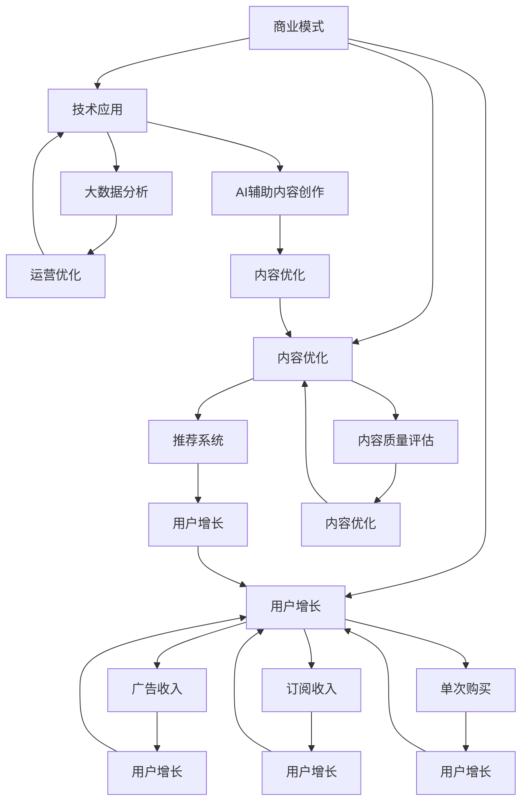

                 

# 知识付费创业的商业模式优化策略

## 1. 背景介绍

### 1.1 问题由来
随着互联网和数字技术的发展，知识付费模式逐渐兴起，成为新时代的学习新方式。知识付费平台如得到、喜马拉雅、知乎live等，通过订阅、打赏、单次购买等方式，为知识消费者提供高价值的课程、文章、音频、视频等内容。这一新兴模式不仅丰富了信息获取途径，还带动了相关产业链的快速发展。

知识付费创业在近年来迅速崛起，但同时也面临诸多挑战：用户增长放缓、内容同质化严重、收益模式单一等问题逐渐凸显。面对这些挑战，优化商业模式成为关键。本文将从商业模式构建、内容优化、技术应用等多个角度，深入探讨知识付费创业的优化策略。

## 2. 核心概念与联系

### 2.1 核心概念概述

知识付费创业的核心概念包括：
- 商业模式：知识付费平台的业务模式和盈利方式，包括订阅制、按需购买、广告分成等。
- 用户增长：平台吸引和留存用户的过程，包括内容质量、用户体验、推广策略等因素。
- 内容优化：提高内容质量、丰富内容形态、强化内容分发，提升用户价值和粘性。
- 技术应用：利用大数据、AI等技术，对用户行为进行精准分析，优化推荐系统，提升运营效率。
- KPI指标：用于衡量知识付费平台运营效果的各项关键绩效指标，如用户活跃度、留存率、收益率等。

这些概念之间相互关联，共同构成了知识付费创业的运营体系。

### 2.2 核心概念原理和架构的 Mermaid 流程图



此图展示了知识付费平台的主要运营逻辑和关键环节：
- 商业模式构建（A）为平台提供盈利基础。
- 用户增长（B）通过多渠道引流、精准营销、用户体验优化等方式吸引用户。
- 内容优化（C）提升用户价值和粘性，包括内容质量、内容形态和分发。
- 技术应用（D）利用大数据和AI技术优化推荐系统和运营效率。
- KPI指标（未展示）用于衡量各项运营效果。

各环节相互影响，共同支撑平台的持续健康发展。

## 3. 核心算法原理 & 具体操作步骤
### 3.1 算法原理概述

知识付费创业的商业模式优化策略主要基于用户行为分析、推荐系统、个性化定价、社交互动等核心算法。

- **用户行为分析**：利用大数据技术对用户行为进行深入分析，识别不同用户的需求和偏好，为内容优化和精准营销提供依据。
- **推荐系统**：通过协同过滤、基于内容的推荐、深度学习等算法，为用户推荐个性化内容，提高用户粘性和留存率。
- **个性化定价**：根据用户行为数据和市场调研，调整课程和内容的定价策略，实现用户价值最大化和收益最大化。
- **社交互动**：通过社区功能、互动问答、用户生成内容等方式，提升用户参与度和社交粘性，促进内容的传播和分享。

### 3.2 算法步骤详解

#### 3.2.1 用户行为分析

1. **数据采集与预处理**：收集用户在平台上的行为数据，包括浏览记录、购买记录、互动行为等，进行清洗和去重。
2. **特征提取与模型训练**：使用特征工程技术提取关键特征，如用户兴趣、购买历史、学习时长等，训练推荐模型。
3. **行为分析与策略调整**：通过分析用户行为数据，识别流失风险和提升点，调整运营策略，如优化推荐算法、提升内容质量、改进用户界面等。

#### 3.2.2 推荐系统

1. **协同过滤推荐**：利用用户和物品间的评分数据，推荐相似的物品给用户，提高用户满意度。
2. **基于内容的推荐**：根据物品的属性特征，推荐相似的物品给用户，增加推荐多样性。
3. **深度学习推荐**：使用神经网络模型，如CNN、RNN、Transformer等，对用户和物品进行高维表示，优化推荐效果。

#### 3.2.3 个性化定价

1. **市场调研与需求分析**：通过调研市场价格、用户支付意愿等，分析课程内容的市场价值。
2. **定价策略调整**：根据用户行为数据和市场调研结果，调整课程和内容的定价策略，如动态定价、阶梯定价、折扣优惠等。
3. **收益优化与调整**：实时监测定价策略效果，进行动态调整，实现收益最大化。

#### 3.2.4 社交互动

1. **社区功能设计**：设计用户社区，促进用户之间的交流和互动，提升用户粘性。
2. **互动问答机制**：引入互动问答机制，增加用户参与度，促进知识传播。
3. **用户生成内容**：鼓励用户生成和分享内容，丰富平台内容库，增加用户粘性。

### 3.3 算法优缺点

**优点**：
- 提升用户价值：通过精准的推荐和个性化定价，提升用户粘性和留存率，提高用户价值。
- 增加用户参与度：通过社区功能、互动问答等社交机制，增加用户互动，提升平台活跃度。
- 优化运营效率：利用大数据和AI技术，优化推荐系统和运营策略，提高运营效率。

**缺点**：
- 数据隐私问题：用户行为数据的采集和分析可能涉及隐私问题，需严格遵守数据保护法规。
- 推荐算法复杂性：推荐系统的设计和使用需要较高技术水平，需持续优化和迭代。
- 成本投入高：个性化定价和推荐系统需要较大成本投入，包括数据采集、模型训练和优化等。

### 3.4 算法应用领域

知识付费创业的商业模式优化策略可应用于以下多个领域：
- **课程内容优化**：通过用户行为分析，优化课程内容，提高用户满意度和完成率。
- **用户增长策略**：利用推荐系统和社交互动，吸引和留存用户，提高用户增长速度。
- **个性化定价策略**：根据用户行为和市场调研结果，调整课程定价策略，实现收益最大化。
- **社区功能开发**：设计用户社区，增加用户互动和粘性，促进知识传播。

## 4. 数学模型和公式 & 详细讲解 & 举例说明

### 4.1 数学模型构建

知识付费平台的用户行为分析、推荐系统和个性化定价主要基于以下数学模型：
- **用户行为模型**：通过用户行为数据，建立用户兴趣和行为偏好的概率模型，如协同过滤模型、基于内容的推荐模型、深度学习推荐模型等。
- **收益模型**：通过用户行为数据和课程定价策略，建立收益预测模型，如线性回归模型、逻辑回归模型、神经网络模型等。
- **社交互动模型**：通过用户互动数据，建立社交网络模型，如社交网络图模型、社区结构模型等。

### 4.2 公式推导过程

#### 4.2.1 协同过滤模型

协同过滤模型基于用户和物品的评分数据，推荐相似的物品给用户。公式推导如下：
$$
\hat{r}_{ui} = \frac{1}{1+\exp(-\eta (\vec{u}_i \cdot \vec{v}_j - \mu)} 
$$
其中，$\hat{r}_{ui}$ 为预测评分，$\vec{u}_i$ 和 $\vec{v}_j$ 为用户的评分向量，$\mu$ 为均值项，$\eta$ 为平滑系数。

#### 4.2.2 基于内容的推荐模型

基于内容的推荐模型根据物品的属性特征，推荐相似的物品给用户。公式推导如下：
$$
\hat{r}_{ui} = \sum_{k=1}^{K} u_{ik} \cdot v_{kj}
$$
其中，$u_{ik}$ 和 $v_{kj}$ 为物品和用户的关键特征向量，$K$ 为特征维度。

#### 4.2.3 深度学习推荐模型

深度学习推荐模型使用神经网络模型，对用户和物品进行高维表示，优化推荐效果。公式推导如下：
$$
\hat{r}_{ui} = \sigma(\vec{u}_i \cdot \vec{v}_j + b)
$$
其中，$\vec{u}_i$ 和 $\vec{v}_j$ 为用户和物品的嵌入向量，$\sigma$ 为激活函数，$b$ 为偏置项。

### 4.3 案例分析与讲解

**案例1：得到课程推荐系统**

得到通过用户行为数据，建立协同过滤和基于内容的推荐模型，为用户推荐相关课程。通过多轮迭代，模型逐步优化，提升推荐准确性和用户满意度。

**案例2：知识星球定价策略**

知识星球通过调研市场价格和用户支付意愿，建立定价模型。结合用户行为数据，动态调整课程价格，实现收益最大化。

## 5. 项目实践：代码实例和详细解释说明

### 5.1 开发环境搭建

知识付费创业的商业模式优化涉及多个技术栈，以下是开发环境搭建的基本流程：
1. **数据存储与处理**：使用MySQL或MongoDB等关系型/非关系型数据库，存储用户行为数据、课程信息等。
2. **数据采集与清洗**：使用Flume、Apache Kafka等工具，采集平台行为数据，进行清洗和去重。
3. **大数据平台搭建**：使用Hadoop、Spark等大数据平台，进行数据处理和分析。
4. **推荐系统实现**：使用TensorFlow、PyTorch等深度学习框架，实现推荐算法。
5. **前端开发**：使用React、Vue等前端技术，开发用户界面和交互功能。

### 5.2 源代码详细实现

以下是一个简单的推荐系统实现示例，使用TensorFlow库：

```python
import tensorflow as tf
from tensorflow.keras.layers import Input, Embedding, DotProduct

# 定义输入层
user_input = Input(shape=(1,))
item_input = Input(shape=(1,))

# 定义嵌入层
user_embed = Embedding(input_dim=num_users, output_dim=embedding_dim)(user_input)
item_embed = Embedding(input_dim=num_items, output_dim=embedding_dim)(item_input)

# 定义点积层
dot_product = DotProduct()([user_embed, item_embed])

# 定义输出层
output = tf.keras.layers.Dense(1, activation='sigmoid')(dot_product)

# 编译模型
model = tf.keras.Model(inputs=[user_input, item_input], outputs=output)
model.compile(optimizer='adam', loss='binary_crossentropy', metrics=['accuracy'])

# 训练模型
model.fit(X_train, y_train, epochs=10, batch_size=32)
```

### 5.3 代码解读与分析

**用户行为分析**：
- 数据采集与预处理：使用数据采集工具Flume或Apache Kafka，从平台日志中提取用户行为数据。
- 特征提取与模型训练：使用特征工程技术提取关键特征，如用户兴趣、购买历史、学习时长等，训练推荐模型。
- 行为分析与策略调整：通过分析用户行为数据，识别流失风险和提升点，调整运营策略，如优化推荐算法、提升内容质量、改进用户界面等。

**推荐系统实现**：
- 协同过滤模型：利用用户和物品的评分数据，训练推荐模型。
- 基于内容的推荐模型：根据物品的属性特征，训练推荐模型。
- 深度学习推荐模型：使用神经网络模型，对用户和物品进行高维表示，训练推荐模型。

**个性化定价策略**：
- 市场调研与需求分析：通过调研市场价格、用户支付意愿等，分析课程内容的市场价值。
- 定价策略调整：根据用户行为数据和市场调研结果，调整课程和内容的定价策略，如动态定价、阶梯定价、折扣优惠等。
- 收益优化与调整：实时监测定价策略效果，进行动态调整，实现收益最大化。

## 6. 实际应用场景

### 6.1 在线教育平台

在线教育平台如Coursera、Udacity等，通过知识付费模式，提供高质量的在线课程。通过优化推荐系统，精准推送相关课程，提升用户学习体验和满意度。

### 6.2 专业培训机构

专业培训机构如慕课网、极客时间等，通过知识付费模式，提供专业领域的培训课程。通过个性化定价和社交互动，提升用户参与度和满意度。

### 6.3 企业内部培训

企业内部培训系统通过知识付费模式，提供定制化的内部培训课程。通过优化推荐系统和个性化定价，提升员工培训效果和学习体验。

### 6.4 未来应用展望

随着知识付费模式的普及和技术的进步，知识付费创业将迎来新的发展机遇。未来，知识付费创业将更加注重用户个性化需求，通过推荐系统和个性化定价，实现精准营销和用户留存。同时，社交互动机制将更加丰富多样，增加用户参与度和粘性。

## 7. 工具和资源推荐

### 7.1 学习资源推荐

- **Coursera**：提供各类在线课程，涵盖数据科学、编程、商业、艺术等多个领域。
- **edX**：提供各类在线课程，涵盖计算机科学、工程、法律等多个领域。
- **Udacity**：提供各类在线课程，涵盖人工智能、机器学习、自动驾驶等多个领域。

### 7.2 开发工具推荐

- **Hadoop**：开源的分布式计算平台，适合大规模数据处理。
- **Spark**：开源的大数据处理框架，支持快速数据处理和分析。
- **TensorFlow**：开源的机器学习框架，支持深度学习模型的训练和部署。
- **PyTorch**：开源的深度学习框架，支持动态图计算和模型优化。
- **React**：开源的前端框架，适合构建交互丰富的用户界面。
- **Vue**：开源的前端框架，适合构建单页应用和响应式界面。

### 7.3 相关论文推荐

- **Knowledge Graphs in Recommendation Systems**：介绍知识图谱在推荐系统中的应用，提升推荐多样性和准确性。
- **User Behavior Modeling in Recommendation Systems**：介绍用户行为建模的方法，提升推荐系统的效果。
- **Adaptive Pricing in Recommendation Systems**：介绍适应性定价策略，提升用户满意度和平台收益。

## 8. 总结：未来发展趋势与挑战

### 8.1 研究成果总结

本文系统总结了知识付费创业的商业模式优化策略，包括用户行为分析、推荐系统、个性化定价、社交互动等关键环节。通过优化这些环节，提升平台的运营效率和用户价值。

### 8.2 未来发展趋势

知识付费创业的未来发展趋势主要包括：
- **人工智能应用**：利用AI技术优化推荐系统，提升推荐效果和用户体验。
- **个性化服务**：通过个性化定价和推荐，提升用户粘性和满意度。
- **社区功能开发**：增加社区功能，提升用户参与度和粘性。

### 8.3 面临的挑战

知识付费创业面临的主要挑战包括：
- **数据隐私问题**：用户行为数据的采集和分析涉及隐私问题，需严格遵守数据保护法规。
- **推荐算法复杂性**：推荐系统的设计和实现需要较高技术水平，需持续优化和迭代。
- **成本投入高**：个性化定价和推荐系统需要较大成本投入，包括数据采集、模型训练和优化等。

### 8.4 研究展望

未来研究应关注以下几个方面：
- **数据隐私保护**：研究隐私保护技术，保障用户数据安全。
- **推荐系统优化**：研究推荐算法，提升推荐效果和用户体验。
- **成本控制**：研究成本控制策略，提高推荐系统的运营效率。

## 9. 附录：常见问题与解答

**Q1：知识付费创业如何优化用户行为分析？**

A: 优化用户行为分析主要从以下几个方面入手：
- **数据采集**：使用数据采集工具Flume或Apache Kafka，从平台日志中提取用户行为数据。
- **数据清洗**：对数据进行去重和清洗，去除无效和重复数据。
- **特征提取**：使用特征工程技术提取关键特征，如用户兴趣、购买历史、学习时长等。
- **模型训练**：利用机器学习模型，如协同过滤模型、基于内容的推荐模型、深度学习推荐模型等，进行用户行为分析。

**Q2：知识付费创业如何选择推荐系统算法？**

A: 选择合适的推荐系统算法主要考虑以下几个因素：
- **数据规模**：数据量较大时，可以选择基于矩阵分解的协同过滤模型；数据量较小时，可以选择基于内容的推荐模型。
- **推荐效果**：深度学习推荐模型在推荐效果上表现最好，但需要较高技术水平；协同过滤和基于内容的推荐模型相对简单，但推荐效果有所不足。
- **推荐多样性**：深度学习推荐模型和基于内容的推荐模型在推荐多样性上表现较好，协同过滤模型则相对较差。

**Q3：知识付费创业如何优化个性化定价策略？**

A: 优化个性化定价策略主要从以下几个方面入手：
- **市场调研**：通过调研市场价格和用户支付意愿，分析课程内容的市场价值。
- **定价策略调整**：根据用户行为数据和市场调研结果，调整课程和内容的定价策略，如动态定价、阶梯定价、折扣优惠等。
- **收益优化**：实时监测定价策略效果，进行动态调整，实现收益最大化。

**Q4：知识付费创业如何提升社交互动效果？**

A: 提升社交互动效果主要从以下几个方面入手：
- **社区功能设计**：设计用户社区，促进用户之间的交流和互动，提升用户粘性。
- **互动问答机制**：引入互动问答机制，增加用户参与度，促进知识传播。
- **用户生成内容**：鼓励用户生成和分享内容，丰富平台内容库，增加用户粘性。

通过上述优化策略，知识付费创业平台可以更好地满足用户需求，提升用户体验和平台运营效率，实现可持续发展。

---

作者：禅与计算机程序设计艺术 / Zen and the Art of Computer Programming

