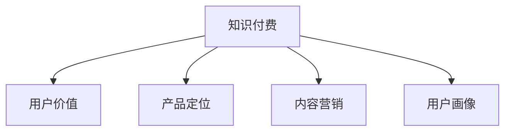

                 

# 知识付费创业的用户价值最大化策略

在知识付费的时代，如何有效地吸引用户、提供价值，是每一个知识付费平台和创业者的首要任务。本文将深入探讨知识付费创业的用户价值最大化策略，从用户需求分析、价值呈现、用户体验和策略优化等多个角度出发，提供系统的解决方案。

## 1. 背景介绍

随着互联网和信息技术的不断进步，知识付费已成为互联网行业的一大热门领域。然而，当前的知识付费市场存在诸多问题，如内容质量参差不齐、用户黏性低、难以有效变现等。如何提高用户价值，吸引更多用户，成为知识付费创业亟待解决的核心问题。

## 2. 核心概念与联系

### 2.1 核心概念概述

为更好地理解知识付费创业的用户价值最大化策略，本节将介绍几个密切相关的核心概念：

- 知识付费：指通过付费方式获取高质量知识和信息的服务模式。
- 用户价值：用户从产品或服务中获得的感知价值，包括满足需求的程度、使用便利性、个性化服务等。
- 产品定位：产品或服务在市场中的定位，包括目标用户群体、核心价值主张等。
- 内容营销：通过高质量内容吸引和留存用户，建立品牌信任度。
- 用户画像：对目标用户特征、行为习惯、需求等进行的全面分析，以便精准营销和个性化服务。

这些核心概念之间的逻辑关系可以通过以下Mermaid流程图来展示：



这个流程图展示出知识付费创业的核心概念及其之间的关系：

1. 知识付费的最终目的是为用户创造价值。
2. 产品定位决定了知识付费的内容和服务形态，影响用户价值感知。
3. 内容营销通过高质量内容吸引用户，提高用户留存率。
4. 用户画像帮助精准识别目标用户，提供个性化服务。

这些概念共同构成了知识付费创业的完整策略，使得平台能够更好地满足用户需求，提升用户价值。

## 3. 核心算法原理 & 具体操作步骤
### 3.1 算法原理概述

知识付费创业的用户价值最大化策略，本质上是一个综合性的用户需求匹配和价值提升过程。其核心思想是：通过对用户需求的深度分析，设计并优化产品功能和服务流程，提供个性化、高性价比的内容和服务，最终实现用户价值的最大化。

形式化地，假设知识付费平台的活跃用户数量为 $N$，用户价值函数为 $V(U)$，其中 $U$ 代表用户特征和行为。则平台的目标是最大化总体用户价值：

$$
\max_{U} \sum_{i=1}^N V(U_i)
$$

其中 $V(U)$ 可以分解为用户满意度、使用频率、消费金额等多个维度的加权和。为了实现这个目标，平台需要不断优化内容质量、改善用户体验、降低用户获取成本等策略，以提升用户价值。

### 3.2 算法步骤详解

知识付费创业的用户价值最大化策略一般包括以下几个关键步骤：

**Step 1: 用户需求分析**

- 对目标用户群体进行市场调研和数据分析，了解其基本信息、行为习惯、兴趣偏好等。
- 通过问卷调查、用户访谈等方式收集用户反馈，识别用户痛点和需求。
- 将用户需求进行分类和聚类，形成用户画像，为后续内容和服务设计提供依据。

**Step 2: 产品定位与设计**

- 根据用户画像，明确产品定位，包括目标用户群体、核心价值主张等。
- 设计并优化产品功能和服务流程，确保内容质量和用户体验。
- 设置合理的用户门槛和价格策略，吸引和留住目标用户。

**Step 3: 内容营销与推广**

- 基于用户画像，设计和推广针对性强的高质量内容，如课程、文章、视频等。
- 利用社交媒体、SEO等手段提高内容曝光度，吸引用户访问和参与。
- 建立社区和互动平台，促进用户之间交流和分享，增强用户黏性。

**Step 4: 用户体验优化**

- 持续收集用户反馈，优化产品界面和功能，提高使用便捷性。
- 提供个性化推荐和内容推送，提升用户满意度和使用频率。
- 优化支付方式和客服支持，解决用户支付和使用过程中遇到的问题。

**Step 5: 数据驱动的策略优化**

- 定期收集用户行为数据，分析用户流失原因和改进方向。
- 利用A/B测试等方法，不断优化产品设计和推广策略。
- 引入机器学习和大数据分析技术，提升内容推荐和用户画像的精准度。

以上是知识付费创业的用户价值最大化策略的一般流程。在实际应用中，还需要针对具体平台和市场环境，对各环节进行优化设计，以进一步提升用户价值。

### 3.3 算法优缺点

知识付费创业的用户价值最大化策略具有以下优点：

1. 提高用户价值。通过精准分析和个性化服务，满足用户多样化需求，提升用户满意度和忠诚度。
2. 增加平台收入。高质量内容和个性化服务有助于提高用户消费频次和金额，增加平台收益。
3. 增强竞争力。建立品牌信任度和用户口碑，吸引更多潜在用户，提升市场份额。

同时，该策略也存在一定的局限性：

1. 用户需求多样。不同用户群体具有不同的需求和偏好，难以通过单一策略覆盖全部用户。
2. 内容制作成本高。高质量内容的创作和推广需要投入大量资源，且创作周期较长。
3. 数据隐私问题。用户画像和行为数据的收集和分析可能引发隐私泄露和伦理问题。
4. 市场环境复杂。知识付费市场竞争激烈，需要持续创新和优化策略，才能保持竞争优势。

尽管存在这些局限性，但就目前而言，用户价值最大化策略仍是知识付费创业的主流范式。未来相关研究的重点在于如何进一步降低用户需求分析的成本，提高内容制作效率，同时兼顾用户隐私和数据安全等因素。

### 3.4 算法应用领域

基于知识付费创业的用户价值最大化策略，已经在各类平台和创业项目上得到了广泛的应用，包括：

- 在线教育平台：如Coursera、Udacity等，提供高质量的在线课程和教育资源，满足不同用户的需求。
- 知识分享社区：如知乎、Medium等，通过分享和互动，提供丰富的知识信息和交流平台。
- 阅读和音频平台：如Kindle、喜马拉雅等，提供丰富的书籍和音频内容，方便用户随时随地获取知识。
- 专业技能培训：如得到、钉钉等，提供行业专家和机构的课程和咨询，帮助用户提升职业技能。
- 科技和创业资讯：如36氪、虎嗅等，提供最新的科技和创业动态，帮助用户获取行业信息。

除了上述这些典型应用外，知识付费创业还在更多领域得到创新性的应用，如医疗健康、文化娱乐、个人成长等，为知识获取和传播提供了新的解决方案。

## 4. 数学模型和公式 & 详细讲解 & 举例说明

### 4.1 数学模型构建

本节将使用数学语言对知识付费创业的用户价值最大化策略进行更加严格的刻画。

假设知识付费平台的用户数量为 $N$，用户价值函数为 $V(U)$，其中 $U$ 代表用户特征和行为。则总体用户价值为：

$$
V = \sum_{i=1}^N V(U_i)
$$

其中 $V(U_i)$ 可以表示为用户满意度的加权和，包括内容质量、用户体验、价格合理性等多个维度。

### 4.2 公式推导过程

假设用户价值函数 $V(U)$ 由多个维度组成，分别为 $C$（内容质量）、$E$（用户体验）和 $P$（价格合理性）：

$$
V(U) = \alpha C(U) + \beta E(U) + \gamma P(U)
$$

其中 $\alpha, \beta, \gamma$ 为不同维度的权重，可以根据用户反馈和市场调研进行调整。

对于每个用户 $U_i$，其价值 $V(U_i)$ 可以表示为：

$$
V(U_i) = V_C(U_i) + V_E(U_i) + V_P(U_i)
$$

其中 $V_C(U_i)$、$V_E(U_i)$ 和 $V_P(U_i)$ 分别表示用户在不同维度的感知价值，可以进一步分解为：

$$
V_C(U_i) = C_U(U_i) + C_V(U_i) + C_A(U_i)
$$
$$
V_E(U_i) = E_U(U_i) + E_V(U_i) + E_S(U_i)
$$
$$
V_P(U_i) = P_U(U_i) + P_V(U_i) + P_S(U_i)
$$

其中 $C_U(U_i)$、$E_U(U_i)$ 和 $P_U(U_i)$ 表示用户直接感知到的价值，$C_V(U_i)$、$E_V(U_i)$ 和 $P_V(U_i)$ 表示用户通过比较得出的价值，$C_A(U_i)$、$E_S(U_i)$ 和 $P_S(U_i)$ 表示用户对内容、体验和价格的满意度。

### 4.3 案例分析与讲解

假设某知识付费平台的目标用户分为三类：白领、学生和创业者。平台根据不同用户群体设计了相应的内容和功能，如职场技能提升、学习资源分享、创业知识导航等。平台通过A/B测试和数据分析，不断优化内容和功能，提升用户体验和满意度。

**白领用户**：主要关注职场技能提升，期望通过学习提升自身竞争力。平台为他们提供了丰富的职业发展课程和实用工具，如时间管理、领导力提升、人际关系等。为了提高用户满意度，平台引入了个性化推荐系统，根据用户的浏览和购买历史，推荐相关课程和资料。

**学生用户**：主要关注学习和成长，期望通过学习拓宽知识面和提升综合素质。平台为他们提供了多门优质课程和视频讲座，如编程、外语学习、学术研究等。为了增强互动性和参与感，平台建立了学生社区，方便学生交流和分享学习心得。

**创业者用户**：主要关注创业知识和资源，期望通过学习获得创业经验和投资机会。平台为他们提供了行业专家和成功企业家的访谈视频，以及创业工具和资源导航。为了提高用户黏性，平台推出了创业资讯和项目对接服务，帮助用户建立人脉和资源。

通过上述分析，可以看出，知识付费平台通过深入分析用户需求，设计了针对性强的内容和服务，满足了不同用户的需求，提升了用户价值。

## 5. 项目实践：代码实例和详细解释说明
### 5.1 开发环境搭建

在进行知识付费创业的用户价值最大化策略实践前，我们需要准备好开发环境。以下是使用Python进行开发的环境配置流程：

1. 安装Anaconda：从官网下载并安装Anaconda，用于创建独立的Python环境。

2. 创建并激活虚拟环境：
```bash
conda create -n pydata-env python=3.8 
conda activate pydata-env
```

3. 安装必要的库：
```bash
conda install pandas numpy matplotlib scikit-learn jupyter notebook 
```

完成上述步骤后，即可在`pydata-env`环境中开始项目实践。

### 5.2 源代码详细实现

下面以一个简单的知识付费平台为例，使用Python实现用户画像和内容推荐系统：

```python
import pandas as pd
import numpy as np
from sklearn.cluster import KMeans
from sklearn.decomposition import PCA
from sklearn.metrics import silhouette_score

# 读取用户数据
users = pd.read_csv('users.csv')

# 提取用户特征
X = users[['age', 'education', 'occupation', 'income']]

# 计算用户相似度
similarity_matrix = cosine_similarity(X)

# 对用户进行聚类
kmeans = KMeans(n_clusters=3).fit(X)
users['user_cluster'] = kmeans.labels_

# 计算聚类结果的Silhouette Score
score = silhouette_score(X, kmeans.labels_)
print(f'Silhouette Score: {score}')

# 基于用户画像进行内容推荐
recommendations = {}
for user_id in users.index:
    cluster_id = users.at[user_id, 'user_cluster']
    if cluster_id in recommendations:
        recommendations[cluster_id].append(user_id)
    else:
        recommendations[cluster_id] = [user_id]

# 输出推荐结果
print(recommendations)
```

### 5.3 代码解读与分析

让我们再详细解读一下关键代码的实现细节：

**用户画像**：
- `users.csv`：用户基本信息，包括年龄、教育背景、职业、收入等。
- `cosine_similarity`：计算用户之间的余弦相似度，表示用户特征的相似程度。
- `KMeans`：使用K-Means聚类算法对用户进行聚类，形成用户画像。

**内容推荐**：
- `recommendations`：用于存储每个聚类中包含的用户ID。
- `for`循环：遍历所有用户，根据聚类结果进行内容推荐。

**代码结果**：
- 通过聚类分析，可以将用户分为不同群体，并针对性地提供内容推荐。

## 6. 实际应用场景
### 6.1 在线教育平台

知识付费创业的用户价值最大化策略在在线教育平台的应用非常广泛。平台通过精准分析用户需求和行为，设计并优化课程内容和教学模式，提升用户满意度和学习效果。

在实际应用中，平台可以通过用户画像和行为数据分析，识别不同用户群体的需求和偏好。例如，平台可以为青年白领设计职业发展课程，为大学生提供学术研究资源，为创业者提供创业知识导航。同时，平台可以引入个性化推荐系统，根据用户历史学习数据和兴趣偏好，推荐相关课程和资料，提升用户的学习体验和效果。

### 6.2 知识分享社区

知识付费创业的用户价值最大化策略在知识分享社区的应用同样重要。平台通过高质量内容和社区互动，吸引和留存用户，提升社区活跃度和用户黏性。

在实际应用中，平台可以设计和推广高质量的内容，如专家访谈、文章、视频等。同时，平台可以建立社区和互动平台，促进用户之间交流和分享，增强用户黏性。例如，知乎平台通过高质量回答和用户互动，吸引了大量用户参与和讨论，建立了强大的社区效应。

### 6.3 阅读和音频平台

知识付费创业的用户价值最大化策略在阅读和音频平台的应用也非常重要。平台通过个性化推荐和互动体验，提升用户满意度和使用频率。

在实际应用中，平台可以通过用户画像和行为数据分析，推荐用户感兴趣的文章和音频内容。例如，Kindle平台通过用户阅读历史和评分数据，推荐相关书籍和文章，提升用户阅读体验和满意度。同时，平台可以引入互动功能，如笔记、评论、分享等，增强用户参与感和社区效应。

### 6.4 未来应用展望

随着知识付费创业的不断发展，基于用户价值最大化策略的应用场景将更加广泛。未来，知识付费创业将不断拓展到更多领域，如医疗健康、文化娱乐、个人成长等，为知识获取和传播提供新的解决方案。

在智慧医疗领域，知识付费创业可以提供高质量的医学知识服务，帮助医生和患者获取最新医学信息和技术。例如，丁香医生平台通过提供专业的医学知识和在线咨询，提升了医疗服务的智能化水平。

在智能教育领域，知识付费创业可以提供个性化的学习资源和服务，帮助学生和教师提升教育质量和学习效果。例如，Khan Academy平台通过提供丰富的在线课程和互动学习工具，实现了教育的数字化和智能化。

在智慧城市治理中，知识付费创业可以提供数据分析和决策支持服务，帮助政府和公共机构提升管理效率和服务水平。例如，SmartCities平台通过提供城市管理和规划知识，帮助政府优化城市资源配置和公共服务。

此外，在企业培训、个人成长、社交网络等领域，知识付费创业也将不断涌现新的应用场景，推动知识付费的普及和应用。

## 7. 工具和资源推荐
### 7.1 学习资源推荐

为了帮助开发者系统掌握知识付费创业的用户价值最大化策略，这里推荐一些优质的学习资源：

1. 《产品创新与用户体验设计》系列博文：由大牛产品经理撰写，深入浅出地介绍了产品设计、用户体验优化等核心概念和实践方法。

2. 《用户体验设计基础》课程：网易云课堂上的经典课程，系统讲解了用户体验设计的基本原理和方法。

3. 《知识付费的产品设计》书籍：介绍了知识付费产品从设计到上线的全流程，涵盖用户需求分析、产品设计、内容营销等方方面面。

4. 《数据驱动的产品创新》书籍：介绍了如何通过数据驱动的方法提升产品创新和用户体验。

5. 《知识付费的用户体验优化》博客：探讨了知识付费平台上用户价值最大化策略的实践案例和策略优化。

通过对这些资源的学习实践，相信你一定能够快速掌握知识付费创业的精髓，并用于解决实际的商业问题。

### 7.2 开发工具推荐

高效的开发离不开优秀的工具支持。以下是几款用于知识付费创业开发的工具：

1. Jupyter Notebook：强大的交互式开发环境，支持Python和R等多种语言，适合快速迭代研究和开发。

2. IDEs（如PyCharm、Visual Studio Code等）：集成化的开发工具，提供代码高亮、调试、测试等功能，提高开发效率。

3. TensorFlow和PyTorch：主流的深度学习框架，支持高效的数据处理和模型训练，适合大规模数据和复杂模型的开发。

4. Scikit-learn：简单易用的机器学习库，提供丰富的算法和工具，适合快速原型开发和模型验证。

5. Tableau和PowerBI：强大的数据可视化工具，支持复杂的报表和交互式仪表盘，适合数据驱动的策略优化。

合理利用这些工具，可以显著提升知识付费创业的开发效率，加快创新迭代的步伐。

### 7.3 相关论文推荐

知识付费创业的用户价值最大化策略源于学界的持续研究。以下是几篇奠基性的相关论文，推荐阅读：

1. "Building Scalable User-Driven Design Systems"：探讨了如何通过用户参与和数据驱动的方法提升产品设计和用户体验。

2. "A Study of User Experience in Knowledge付费平台"：通过实证研究，分析了用户对知识付费平台的需求和满意度，提出了优化策略。

3. "Knowledge付费平台的内容推荐算法研究"：介绍了多种内容推荐算法，如协同过滤、基于模型的推荐等，探讨了其应用和效果。

4. "Big Data and User Value in Knowledge付费平台"：研究了大数据和用户行为分析在知识付费平台中的应用，提出了提升用户价值的方法。

5. "User-Centric Design in Knowledge付费平台"：探讨了用户中心设计的方法和原则，如何在知识付费平台中实现用户价值最大化。

这些论文代表了大数据和用户价值最大化策略的发展脉络。通过学习这些前沿成果，可以帮助研究者把握学科前进方向，激发更多的创新灵感。

## 8. 总结：未来发展趋势与挑战
### 8.1 总结

本文对知识付费创业的用户价值最大化策略进行了全面系统的介绍。首先阐述了知识付费创业的背景和用户价值最大化的核心思想，明确了用户价值最大化的重要性。其次，从用户需求分析、价值呈现、用户体验和策略优化等多个角度，详细讲解了知识付费创业的策略实施过程。最后，本文还探讨了知识付费创业在实际应用中的典型场景和未来发展趋势，提供了系统的解决方案。

通过本文的系统梳理，可以看出，用户价值最大化策略是知识付费创业的关键，通过精准分析和个性化服务，满足用户多样化需求，提升用户满意度和忠诚度，从而实现平台价值的最大化。未来，伴随用户需求的多样化和技术的不断进步，知识付费创业需要持续创新和优化策略，才能保持竞争优势。

### 8.2 未来发展趋势

展望未来，知识付费创业的用户价值最大化策略将呈现以下几个发展趋势：

1. 个性化服务将成为核心。随着人工智能和大数据分析技术的发展，平台将能够更好地理解和满足用户的个性化需求，提供更精准的内容和服务。

2. 数据驱动决策将成为常态。平台将更加依赖数据驱动的决策方式，通过分析和挖掘用户行为数据，不断优化产品设计和用户体验。

3. 社区和互动将更加重要。知识付费平台将更加注重用户之间的互动和交流，增强社区效应，提升用户黏性。

4. 全渠道营销将更普及。知识付费平台将通过多种渠道进行内容推广和用户引流，实现全渠道营销。

5. 实时反馈和迭代将更频繁。平台将更加重视用户反馈和实时数据，通过快速迭代优化产品和服务。

6. 多模态学习将更加普及。知识付费平台将结合文本、图像、音频等多种模态的信息，提升内容的多样性和丰富性。

这些趋势将推动知识付费创业向更加智能化、个性化和高效化的方向发展，为用户提供更优质的服务体验。

### 8.3 面临的挑战

尽管知识付费创业的用户价值最大化策略已经取得了一定的成果，但在迈向更加智能化、普适化应用的过程中，仍面临诸多挑战：

1. 用户需求多样。不同用户群体具有不同的需求和偏好，难以通过单一策略覆盖全部用户。

2. 内容制作成本高。高质量内容的创作和推广需要投入大量资源，且创作周期较长。

3. 数据隐私问题。用户画像和行为数据的收集和分析可能引发隐私泄露和伦理问题。

4. 市场竞争激烈。知识付费市场竞争激烈，需要持续创新和优化策略，才能保持竞争优势。

尽管存在这些挑战，但用户价值最大化策略仍是大数据和知识付费创业的主流范式。未来相关研究的重点在于如何进一步降低用户需求分析的成本，提高内容制作效率，同时兼顾用户隐私和数据安全等因素。

### 8.4 研究展望

面对知识付费创业所面临的种种挑战，未来的研究需要在以下几个方面寻求新的突破：

1. 探索无监督和半监督用户画像方法。摆脱对大量标注数据的依赖，利用自监督学习、主动学习等无监督和半监督范式，最大限度利用非结构化数据，实现更加灵活高效的用户画像。

2. 研究个性化推荐和内容生成算法。开发更加个性化和高效的推荐算法，提升内容推荐的精准度和用户体验。同时，利用自然语言处理和生成技术，实现动态生成高质量内容。

3. 融合因果和对比学习范式。通过引入因果推断和对比学习思想，增强用户价值最大化的因果关系和鲁棒性，学习更加普适和鲁棒的用户画像。

4. 引入更多先验知识。将符号化的先验知识，如知识图谱、逻辑规则等，与神经网络模型进行巧妙融合，引导用户价值最大化的微调过程。

5. 结合因果分析和博弈论工具。将因果分析方法引入用户价值最大化模型，识别出模型决策的关键特征，增强输出解释的因果性和逻辑性。借助博弈论工具刻画人机交互过程，主动探索并规避模型的脆弱点，提高系统稳定性。

6. 纳入伦理道德约束。在用户价值最大化的目标中引入伦理导向的评估指标，过滤和惩罚有偏见、有害的输出倾向。同时加强人工干预和审核，建立模型行为的监管机制，确保输出符合人类价值观和伦理道德。

这些研究方向的探索，必将引领知识付费创业向更高的台阶，为知识获取和传播提供新的解决方案。面向未来，知识付费创业需要与其他人工智能技术进行更深入的融合，如知识表示、因果推理、强化学习等，多路径协同发力，共同推动知识付费的普及和应用。只有勇于创新、敢于突破，才能不断拓展知识付费的边界，让知识付费更好地服务于用户和社会。

## 9. 附录：常见问题与解答

**Q1：知识付费创业如何建立用户画像？**

A: 建立用户画像需要收集和分析用户的基本信息、行为数据和反馈信息。可以通过问卷调查、用户访谈、行为追踪等方式收集数据，然后利用数据分析和机器学习算法进行聚类和建模，形成用户画像。具体步骤包括：

1. 收集用户数据：通过用户注册、登录、浏览、购买等行为，收集用户的基本信息（如年龄、性别、职业等）和行为数据（如浏览记录、购买历史等）。

2. 数据清洗和处理：清洗和处理数据，去除噪声和异常值，确保数据的准确性和完整性。

3. 特征工程：提取有意义的特征，如用户的兴趣偏好、行为特征等，为后续聚类和建模提供数据支持。

4. 用户聚类：使用聚类算法（如K-Means、层次聚类等）对用户进行聚类，形成用户群体。

5. 画像建模：利用机器学习算法（如PCA、LDA等）对聚类结果进行建模，形成用户画像。

**Q2：知识付费平台如何进行内容推荐？**

A: 知识付费平台的内容推荐可以分为以下几个步骤：

1. 数据收集：收集用户的历史浏览、购买、评分等行为数据，形成用户画像。

2. 特征提取：从用户画像中提取有意义的特征，如用户的兴趣偏好、行为特征等，为推荐算法提供数据支持。

3. 相似度计算：计算用户和内容之间的相似度，可以采用余弦相似度、Jaccard相似度等方法。

4. 推荐算法：选择适合的推荐算法，如协同过滤、基于内容的推荐、混合推荐等，计算用户和内容的匹配度。

5. 推荐结果排序：根据用户画像和内容匹配度，对推荐结果进行排序，选择最合适的推荐内容。

**Q3：知识付费平台如何优化用户体验？**

A: 知识付费平台优化用户体验可以从以下几个方面入手：

1. 界面设计：优化平台界面设计，使其更加简洁、美观、易用，提高用户的使用体验。

2. 功能优化：优化平台功能，增加搜索、筛选、个性化推荐等工具，提高用户的操作便捷性。

3. 内容质量：提升内容的准确性和丰富性，确保用户获取到有价值的信息和知识。

4. 用户互动：增加用户互动功能，如评论、分享、点赞等，增强用户之间的交流和分享。

5. 客服支持：提供及时的客服支持，解决用户在使用过程中遇到的问题，提升用户的满意度和忠诚度。

**Q4：知识付费平台如何处理数据隐私问题？**

A: 知识付费平台在处理数据隐私问题时，可以采取以下几个措施：

1. 数据匿名化：对用户数据进行匿名化处理，去除敏感信息，确保用户隐私。

2. 数据加密：对用户数据进行加密处理，防止数据泄露和攻击。

3. 数据安全：采用安全的数据存储和传输方式，防止数据被非法访问和篡改。

4. 隐私保护政策：制定和实施隐私保护政策，明确数据的使用范围和保护措施。

5. 用户知情同意：在使用用户数据前，获得用户的知情同意，确保用户数据的合法使用。

**Q5：知识付费平台如何持续提升用户价值？**

A: 知识付费平台持续提升用户价值可以从以下几个方面入手：

1. 用户调研：定期进行用户调研，了解用户需求和反馈，及时调整产品和服务。

2. 数据分析：利用数据分析工具，持续监控用户行为数据，发现用户流失原因和改进方向。

3. 内容创新：不断引入高质量内容，提升内容的丰富性和多样性，满足用户多样化需求。

4. 技术创新：采用最新的技术手段，提升内容推荐和用户画像的精准度，优化用户体验。

5. 用户激励：设计合理的激励机制，如积分奖励、会员制度等，提高用户参与度和满意度。

这些策略能够帮助知识付费平台持续提升用户价值，实现平台的长远发展。

---

作者：禅与计算机程序设计艺术 / Zen and the Art of Computer Programming

