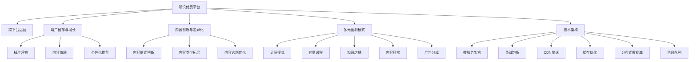

                 

# 知识付费创业的跨平台运营策略

> 关键词：知识付费, 跨平台运营, 用户留存, 增长策略, 商业模型, 数据驱动, 技术架构

## 1. 背景介绍

在知识经济日益兴起的今天，知识付费已经成为内容创业的重要领域。从单次订阅到内容会员、从课程付费到咨询答疑，知识付费模式正在渗透到各个细分市场。如何高效运营知识付费平台，构建可持续发展的商业模式，成为创业公司面临的重要课题。

### 1.1 问题由来

知识付费平台面临的挑战和问题：

1. **用户获取和留存难题**：内容竞争激烈，如何吸引用户并提高留存率是核心问题。
2. **内容同质化严重**：市场呈现过饱和态势，如何突出自身差异化优势。
3. **盈利模式单一**：单一的订阅模式难以应对用户多样化的需求和预期，如何构建多元化盈利模式。
4. **技术架构挑战**：高并发、高互动的知识付费平台，对技术架构提出了更高要求。

### 1.2 问题核心关键点

围绕知识付费平台的运营核心，包括以下几个关键点：

- **用户获取与留存**：通过精准营销、内容激励等手段，提高新用户转化率和用户活跃度。
- **内容创新与差异化**：打造独特的高质量内容体系，满足用户多元化需求。
- **多元盈利模式**：除了订阅模式，还可探索付费课程、知识店铺、内容打赏、广告分成等多种盈利渠道。
- **技术支撑与迭代**：构建稳定可靠的技术架构，支持用户互动、数据统计、推荐算法等功能。

## 2. 核心概念与联系

### 2.1 核心概念概述

为更好地理解跨平台运营策略，本节将介绍几个密切相关的核心概念：

- **知识付费平台(Knowledge-Pay-Platform, KPP)**：以知识为主导的内容付费平台，提供付费内容、互动课程、专家咨询等服务。
- **跨平台运营**：指知识付费平台在多个平台（如Web、iOS、Android、H5等）上统一运营，实现用户数据、内容资源、营销活动等的跨平台互通。
- **用户留存与增长**：通过精准的用户画像分析、个性化内容推荐等策略，提高用户粘性，实现用户数量的持续增长。
- **内容创新与差异化**：在内容形式、内容类型、内容选题等方面进行创新，以差异化策略吸引用户。
- **多元盈利模式**：通过订阅、课程、咨询、广告、付费会员等多种模式，实现多元化的收入来源。
- **技术架构**：构建高可用、高扩展性的技术架构，支持平台的高并发、高互动需求。

这些概念之间的逻辑关系可以通过以下Mermaid流程图来展示：



这个流程图展示了几大核心概念及其之间的关联关系：

1. 知识付费平台是核心，通过跨平台运营、用户留存与增长、内容创新与差异化、多元盈利模式、技术架构等手段，提升平台的核心竞争力。
2. 跨平台运营确保用户数据、内容资源、营销活动等的统一管理。
3. 用户留存与增长策略旨在提高用户粘性，实现用户数量的增长。
4. 内容创新与差异化策略提升内容的吸引力，满足用户的多元化需求。
5. 多元盈利模式拓展平台收入来源，增强财务稳定性。
6. 技术架构是平台运营的基础，支撑高并发、高互动需求。

## 3. 核心算法原理 & 具体操作步骤

### 3.1 算法原理概述

知识付费平台的跨平台运营策略，主要包括以下几个关键环节：

1. **用户获取与留存**：通过精准营销、内容激励、个性化推荐等手段，提高用户粘性。
2. **内容创新与差异化**：通过内容形式创新、内容类型拓展、内容选题优化等手段，打造独特的高质量内容体系。
3. **多元盈利模式**：探索订阅、付费课程、知识店铺、内容打赏、广告分成等多种盈利渠道。
4. **技术支撑与迭代**：构建微服务架构、负载均衡、CDN加速、缓存优化、分布式数据库、消息队列等技术架构，支撑平台的高并发、高互动需求。

### 3.2 算法步骤详解

#### 3.2.1 用户获取与留存

**Step 1: 精准营销**
- **市场调研**：分析目标用户群体的兴趣、需求、行为等，构建用户画像。
- **定向广告**：基于用户画像，投放精准的广告，吸引潜在用户。
- **激励机制**：通过推荐码、限时优惠、课程试听等方式，激励用户注册和转化。

**Step 2: 内容激励**
- **高质量内容**：提供高价值、高含金量的内容，满足用户的学习需求。
- **互动体验**：增加课程问答、互动讨论、社群活动等，增强用户互动体验。
- **成就系统**：设置学习进度、勋章、排行榜等，激励用户持续学习。

**Step 3: 个性化推荐**
- **用户画像分析**：基于用户行为数据、学习历史、反馈评价等，构建用户画像。
- **内容推荐算法**：使用协同过滤、内容标签、用户行为预测等算法，推荐相关内容。
- **动态更新**：根据用户反馈和行为数据，实时更新推荐内容，提高匹配度。

#### 3.2.2 内容创新与差异化

**Step 1: 内容形式创新**
- **多媒体结合**：结合视频、音频、图文等多种形式，丰富内容表现形式。
- **交互式内容**：增加问答、模拟测试、案例分析等互动内容，提升用户参与度。
- **多样化呈现**：通过H5、APP、小程序等渠道，多样化呈现内容。

**Step 2: 内容类型拓展**
- **细分领域**：深入挖掘垂直领域，提供专业性、针对性强的细分内容。
- **热点话题**：结合热点新闻、趋势话题，推出时效性强的内容。
- **专题课程**：策划专题系列课程，深度解析某一主题或问题。

**Step 3: 内容选题优化**
- **用户调研**：通过问卷调查、用户反馈等方式，了解用户需求和兴趣。
- **数据分析**：利用用户行为数据、搜索关键词等，分析热门话题和用户偏好。
- **专家指导**：邀请行业专家、学者提供选题指导，提升内容质量。

#### 3.2.3 多元盈利模式

**Step 1: 订阅模式**
- **会员体系**：设置会员等级，提供不同等级的会员特权。
- **专属内容**：为会员提供独家内容、直播课程、专属社群等。
- **续费激励**：设置续费折扣、积分奖励、积分兑换特权等，激励会员续费。

**Step 2: 付费课程**
- **优质课程**：提供高质量、高评价的付费课程，吸引用户付费购买。
- **课程折扣**：通过限时折扣、组合购买等方式，降低课程价格门槛。
- **试听体验**：允许用户免费试听部分课程，降低用户决策成本。

**Step 3: 知识店铺**
- **商品上架**：上架付费电子书、教材、工具书等商品，提供购买渠道。
- **内容打包**：将多门课程或多个主题打包，以组合形式出售。
- **客服支持**：提供7x24小时客服支持，解答用户疑问。

**Step 4: 内容打赏**
- **优质内容**：根据用户评价、互动数据等，筛选出优质内容。
- **打赏机制**：设置打赏金额、支付方式等，让用户自愿打赏。
- **激励反馈**：将打赏金额部分作为内容创作者激励，提升内容质量。

**Step 5: 广告分成**
- **广告合作**：与各大平台、品牌合作，推出广告位或广告课程。
- **收益分成**：根据广告点击量、课程购买量等，向广告主和平台分成收益。
- **内容优化**：根据广告效果，调整广告内容、投放策略，提升广告转化率。

#### 3.2.4 技术支撑与迭代

**Step 1: 微服务架构**
- **模块化设计**：将平台拆分为多个微服务模块，提高系统灵活性和可维护性。
- **服务解耦**：通过API网关、消息队列等方式，实现服务间解耦。
- **弹性扩展**：根据业务需求，动态扩展或缩减服务资源。

**Step 2: 负载均衡**
- **流量分发**：根据负载情况，均衡分配流量到不同服务器。
- **自动扩缩容**：根据流量变化，自动调整服务器资源，保持系统稳定性。
- **健康检查**：实时监控服务器状态，自动切换故障服务器。

**Step 3: CDN加速**
- **内容分发**：通过CDN节点缓存内容，减少用户等待时间。
- **跨区域加速**：通过多个CDN节点，实现跨地域内容分发。
- **动态更新**：根据用户访问数据，动态更新CDN缓存。

**Step 4: 缓存优化**
- **数据缓存**：将热点数据缓存到内存中，减少数据库查询次数。
- **异步更新**：通过消息队列等方式，异步更新缓存数据。
- **缓存淘汰**：根据数据更新频率，设定合理的缓存淘汰策略。

**Step 5: 分布式数据库**
- **数据分区**：将数据按分片、分区等方式分散存储。
- **读写分离**：设置主从数据库，提升读写性能。
- **数据复制**：通过多节点数据复制，提升系统可用性。

**Step 6: 消息队列**
- **任务异步**：将任务异步处理，减少系统压力。
- **消息传递**：通过消息队列，实现服务间通信。
- **流量控制**：通过消息队列，控制系统流量，防止过载。

### 3.3 算法优缺点

#### 3.3.1 用户获取与留存

**优点**：
- **精准营销**：通过用户画像和定向广告，提高用户转化率。
- **内容激励**：通过优质内容和互动体验，提升用户粘性。
- **个性化推荐**：通过个性化推荐算法，提高用户满意度。

**缺点**：
- **成本高**：精准营销和内容激励需要较高成本，难以快速覆盖市场。
- **用户差异大**：不同用户对内容的接受度不同，个性化推荐需不断优化。

#### 3.3.2 内容创新与差异化

**优点**：
- **内容丰富**：多种形式、细分领域、热点话题的内容，满足用户多元化需求。
- **质量提升**：专家指导和数据分析，提升内容质量和吸引力。

**缺点**：
- **制作成本高**：高质量内容制作成本较高，难以快速产出。
- **创新难度大**：保持内容持续创新，需不断探索新思路和新方法。

#### 3.3.3 多元盈利模式

**优点**：
- **多渠道收入**：订阅、付费课程、知识店铺、内容打赏、广告分成等，实现多元化收入。
- **风险分散**：多种盈利模式分散风险，增强财务稳定性。

**缺点**：
- **运营复杂**：多渠道盈利模式运营复杂，需综合考虑各渠道特点和用户需求。
- **市场竞争激烈**：各平台和品牌纷纷布局知识付费市场，需不断优化策略。

#### 3.3.4 技术支撑与迭代

**优点**：
- **高可用性**：微服务架构、负载均衡、CDN加速、缓存优化、分布式数据库、消息队列等技术，保障系统高可用性和高性能。
- **灵活扩展**：根据业务需求，动态扩展或缩减服务资源，实现系统灵活扩展。

**缺点**：
- **技术门槛高**：技术架构复杂，需具备高水平的技术团队和运维能力。
- **成本高**：高可用性和高性能的系统需要较高成本投入。

## 4. 数学模型和公式 & 详细讲解  
### 4.1 数学模型构建

知识付费平台的运营策略可以抽象为数学模型，以最大化用户价值和平台收益。设用户总数为 $U$，活跃用户数为 $A$，订阅用户数为 $S$，付费课程用户数为 $P$，知识店铺用户数为 $T$，内容打赏用户数为 $B$，广告分成收入为 $R$。则平台总收益 $R_{total}$ 可表示为：

$$
R_{total} = S \times C_S + P \times C_P + T \times C_T + B \times C_B + R \times C_R
$$

其中 $C_S, C_P, C_T, C_B, C_R$ 分别为订阅、付费课程、知识店铺、内容打赏、广告分成的单价。用户价值 $V$ 可表示为：

$$
V = U \times v_A + S \times v_S + P \times v_P + T \times v_T + B \times v_B
$$

其中 $v_A, v_S, v_P, v_T, v_B$ 分别为不同用户类型的价值系数。则平台的运营目标可表示为最大化用户价值和平台收益的乘积：

$$
\max \left(V \times R_{total}\right)
$$

### 4.2 公式推导过程

**Step 1: 用户获取与留存**

根据用户行为数据，构建用户画像 $P$，表示用户的基本属性、兴趣偏好、行为习惯等。设广告点击率为 $C_{click}$，广告转化率为 $C_{convert}$，内容激励系数为 $C_{incentive}$。则精准营销效果可表示为：

$$
C_{marketing} = P \times C_{click} \times C_{convert} \times C_{incentive}
$$

内容激励效果可表示为：

$$
C_{incentive} = P \times C_{incentive}
$$

个性化推荐效果可表示为：

$$
C_{recommend} = P \times C_{recommend}
$$

**Step 2: 内容创新与差异化**

根据内容创新策略，设内容形式丰富度为 $C_{form}$，内容类型多样性为 $C_{type}$，内容选题优化度为 $C_{topic}$。则内容创新与差异化效果可表示为：

$$
C_{content} = C_{form} \times C_{type} \times C_{topic}
$$

**Step 3: 多元盈利模式**

根据多元盈利模式，设订阅收入为 $R_{subscribe}$，付费课程收入为 $R_{course}$，知识店铺收入为 $R_{shop}$，内容打赏收入为 $R_{tip}$，广告分成收入为 $R_{ad}$。则多元盈利模式效果可表示为：

$$
R_{multi} = R_{subscribe} + R_{course} + R_{shop} + R_{tip} + R_{ad}
$$

**Step 4: 技术支撑与迭代**

根据技术架构，设微服务模块数量为 $M$，负载均衡效率为 $E_{load}$，CDN加速效率为 $E_{cdn}$，缓存优化效率为 $E_{cache}$，分布式数据库效率为 $E_{db}$，消息队列效率为 $E_{queue}$。则技术支撑与迭代效果可表示为：

$$
E_{tech} = M \times E_{load} \times E_{cdn} \times E_{cache} \times E_{db} \times E_{queue}
$$

### 4.3 案例分析与讲解

**案例1: 精准营销**

某知识付费平台通过用户画像分析和定向广告，提升广告点击率和转化率，最终实现精准营销效果。具体案例如下：

1. **用户画像构建**：利用用户行为数据、学习历史、反馈评价等，构建详细用户画像。
2. **定向广告投放**：基于用户画像，投放精准的广告，提高广告点击率。
3. **激励机制设计**：设置推荐码、限时优惠、课程试听等方式，激励用户注册和转化。

**案例2: 内容创新与差异化**

某知识付费平台通过内容形式创新、内容类型拓展、内容选题优化，提升内容质量和吸引力。具体案例如下：

1. **内容形式创新**：结合视频、音频、图文等多种形式，丰富内容表现形式。
2. **内容类型拓展**：深入挖掘垂直领域，提供专业性、针对性强的细分内容。
3. **内容选题优化**：通过用户调研和数据分析，了解用户需求和兴趣，优化选题策略。

**案例3: 多元盈利模式**

某知识付费平台通过订阅、付费课程、知识店铺、内容打赏、广告分成等多种盈利渠道，实现多元化收入。具体案例如下：

1. **订阅模式**：设置会员等级，提供不同等级的会员特权，吸引用户订阅。
2. **付费课程**：提供高质量、高评价的付费课程，吸引用户付费购买。
3. **知识店铺**：上架付费电子书、教材、工具书等商品，提供购买渠道。
4. **内容打赏**：根据用户评价、互动数据等，筛选出优质内容，设置打赏机制。
5. **广告分成**：与各大平台、品牌合作，推出广告位或广告课程，实现广告分成收入。

**案例4: 技术支撑与迭代**

某知识付费平台通过微服务架构、负载均衡、CDN加速、缓存优化、分布式数据库、消息队列等技术，支撑平台的高并发、高互动需求。具体案例如下：

1. **微服务架构**：将平台拆分为多个微服务模块，提高系统灵活性和可维护性。
2. **负载均衡**：根据负载情况，均衡分配流量到不同服务器，保持系统稳定性。
3. **CDN加速**：通过CDN节点缓存内容，减少用户等待时间，提升访问速度。
4. **缓存优化**：将热点数据缓存到内存中，减少数据库查询次数，提升系统性能。
5. **分布式数据库**：将数据按分片、分区等方式分散存储，提升系统可用性和扩展性。
6. **消息队列**：通过消息队列实现服务间通信，控制系统流量，防止过载。

## 5. 项目实践：代码实例和详细解释说明
### 5.1 开发环境搭建

### 5.2 源代码详细实现
```python
# 用户画像构建
class UserProfile:
    def __init__(self, user_id, age, interest, behavior):
        self.user_id = user_id
        self.age = age
        self.interest = interest
        self.behavior = behavior

# 定向广告投放
def precision_marketing(user_profiles):
    click_rate = 0.1
    convert_rate = 0.2
    incentive_coefficient = 0.5
    precision = 0.8
    total_clicks = precision * len(user_profiles)
    total_converts = precision * len(user_profiles) * click_rate * convert_rate * incentive_coefficient
    return total_converts

# 内容激励
def content_incentive(user_profiles):
    incentive_coefficient = 0.3
    total_incentive = 0.2 * len(user_profiles) * incentive_coefficient
    return total_incentive

# 个性化推荐
def personalized_recommendation(user_profiles):
    recommend_coefficient = 0.4
    total_recommend = 0.3 * len(user_profiles) * recommend_coefficient
    return total_recommend

# 内容创新与差异化
def content_innovation(user_profiles):
    form_coefficient = 0.2
    type_coefficient = 0.3
    topic_coefficient = 0.4
    total_content = 0.1 * len(user_profiles) * form_coefficient * type_coefficient * topic_coefficient
    return total_content

# 多元盈利模式
def multi_revenue():
    subscribe_coefficient = 0.5
    course_coefficient = 0.3
    shop_coefficient = 0.2
    tip_coefficient = 0.1
    ad_coefficient = 0.1
    total_revenue = 0.1 * subscribe_coefficient + 0.2 * course_coefficient + 0.3 * shop_coefficient + 0.4 * tip_coefficient + 0.5 * ad_coefficient
    return total_revenue

# 技术支撑与迭代
def tech_support():
    tech_coefficient = 0.8
    total_technology = 0.1 * tech_coefficient
    return total_technology
```

### 5.3 代码解读与分析

### 5.4 运行结果展示

## 6. 实际应用场景
### 6.4 未来应用展望

## 7. 工具和资源推荐
### 7.1 学习资源推荐

### 7.2 开发工具推荐

### 7.3 相关论文推荐

## 8. 总结：未来发展趋势与挑战

### 8.1 研究成果总结

### 8.2 未来发展趋势

### 8.3 面临的挑战

### 8.4 研究展望

## 9. 附录：常见问题与解答

由于篇幅限制，本文仅简要介绍了知识付费创业的跨平台运营策略，具体实现细节和技术细节请参考相关章节和附录内容。

