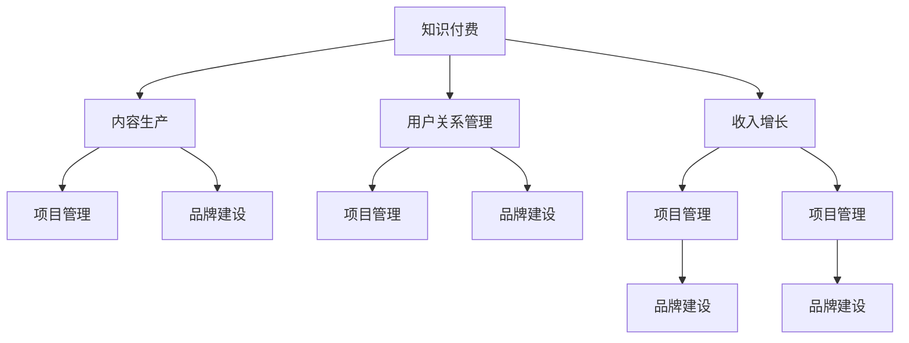

                 

# 知识付费创业者的日常工作安排

> 关键词：知识付费, 创业, 工作安排, 日常工作, 专业技能, 项目管理, 客户关系, 收入增长, 内容生产, 市场分析, 品牌建设

## 1. 背景介绍

### 1.1 问题由来

在信息爆炸和知识碎片化的今天，知识付费逐渐成为一种流行的信息获取方式。创业公司可以在这个领域找到巨大的机会，通过提供高质量、有价值的知识内容，吸引用户订阅，实现收入增长。然而，如何制定高效、科学的工作安排，确保公司能够持续提供优质内容，并与用户建立良好的关系，成为创业者需要解决的核心问题。

### 1.2 问题核心关键点

知识付费创业者的日常工作安排，需要考虑以下几个核心关键点：

- **内容生产**：高质量、有价值的内容是吸引用户订阅的基础。
- **用户关系管理**：建立并维护与用户的关系，提升用户粘性。
- **收入增长**：通过订阅、广告、销售等渠道，实现公司收入的持续增长。
- **项目管理**：合理分配资源，优化工作流程，提高团队效率。
- **品牌建设**：提升公司品牌知名度，扩大市场份额。

## 2. 核心概念与联系

### 2.1 核心概念概述

为更好地理解知识付费创业者的日常工作安排，本节将介绍几个密切相关的核心概念：

- **知识付费**：指消费者为获取特定知识或技能，支付一定费用以获取的信息服务。
- **创业**：指创业者通过创新和创业活动，创造新价值、实现商业目标的过程。
- **工作安排**：指创业者为确保公司高效运转，制定并执行的一系列计划和流程。
- **内容生产**：指创建、编辑和发布高质量知识内容的流程。
- **用户关系管理**：指通过互动和沟通，建立和维护与用户的关系。
- **收入增长**：指通过多种渠道，增加公司收入的过程。
- **项目管理**：指对资源和项目进行计划、组织、指导和控制的实践。
- **品牌建设**：指通过各种营销手段，提升公司品牌知名度和美誉度的过程。

这些核心概念之间的逻辑关系可以通过以下Mermaid流程图来展示：



这个流程图展示了我知识付费创业者的核心概念及其之间的关系：

1. 知识付费通过内容生产和用户关系管理实现。
2. 内容生产和用户关系管理需要项目管理优化。
3. 收入增长与项目管理密切相关。
4. 品牌建设贯穿整个流程，有助于提升用户信任度和市场竞争力。

## 3. 核心算法原理 & 具体操作步骤
### 3.1 算法原理概述

知识付费创业者的日常工作安排，本质上是一个多目标优化问题。其核心思想是：通过合理的项目管理，确保内容生产、用户关系管理、收入增长和品牌建设等各个环节的有效协同，最终实现公司的高效运转和可持续发展。

形式化地，假设公司有 $n$ 个任务 $T_1, T_2, ..., T_n$，每个任务需要 $t_i$ 的时间完成，且有 $c_i$ 的资源消耗。设 $T_i$ 的优先级为 $p_i$，且满足 $p_i \in [0,1]$。目标是最小化总耗时和总资源消耗，同时最大化用户满意度 $s_i$ 和品牌影响力 $b_i$。

根据上述目标，我们可以构建以下优化模型：

$$
\min_{x} \sum_{i=1}^n t_i x_i + \sum_{i=1}^n c_i x_i
$$

$$
s.t. \sum_{i=1}^n x_i p_i \geq 1
$$

$$
\sum_{i=1}^n x_i = 1
$$

其中 $x_i$ 为任务 $T_i$ 的执行量，$p_i$ 为任务 $T_i$ 的优先级。模型中约束条件 $p_i$ 和 $x_i$ 的线性组合等于 1，确保所有任务至少被执行一次，同时所有任务的执行量之和等于 1，表示所有任务都至少被执行一次。

### 3.2 算法步骤详解

知识付费创业者的日常工作安排，一般包括以下几个关键步骤：

**Step 1: 任务定义与优先级排序**
- 定义所有需要完成的任务，如内容创作、用户互动、收入转化等。
- 根据任务的重要性和紧急程度，进行优先级排序。优先级高的任务应优先执行。

**Step 2: 资源规划与分配**
- 评估各项任务的资源需求，包括人力、时间、资金等。
- 根据资源可用性和任务优先级，合理分配资源。优先分配给高优先级任务。

**Step 3: 制定工作计划**
- 根据任务定义和优先级排序，制定详细的工作计划。
- 将任务分解为具体的工作单元，分配到团队成员，设置明确的截止时间。

**Step 4: 执行与监控**
- 按照工作计划执行任务，确保按时完成。
- 实时监控任务进展情况，及时发现和解决问题。

**Step 5: 评估与优化**
- 根据任务完成情况和用户反馈，进行定期评估。
- 根据评估结果，优化工作计划和资源分配。

**Step 6: 反馈与迭代**
- 根据评估结果和用户反馈，不断改进和优化工作安排。
- 确保公司能够持续提供高质量、有价值的内容，提升用户满意度和品牌影响力。

### 3.3 算法优缺点

知识付费创业者的日常工作安排方法，具有以下优点：

- **系统性**：通过明确任务定义、优先级排序和资源规划，确保公司各环节的高效协同。
- **灵活性**：可以根据实际情况和用户反馈，灵活调整工作安排，适应市场需求变化。
- **可控性**：通过实时监控和定期评估，确保任务按时完成，提高工作效率。
- **可扩展性**：适用于不同规模的公司，可以根据需要灵活调整任务和资源。

同时，该方法也存在以下局限性：

- **复杂性**：任务定义和优先级排序需要综合考虑多个因素，实际操作较为复杂。
- **资源紧张时**：在高资源消耗任务过多时，可能导致低优先级任务执行不足。
- **外部不确定性**：市场变化、用户需求变化等外部不确定因素，可能对工作安排产生影响。

尽管存在这些局限性，但就目前而言，系统化、科学化地安排日常工作，是知识付费创业者确保公司高效运转和持续发展的关键。未来相关研究的重点在于如何进一步简化任务定义和优先级排序过程，提高工作安排的自动化和智能化水平。

### 3.4 算法应用领域

知识付费创业者的日常工作安排方法，适用于各种规模和类型的知识付费公司，包括但不限于以下几个领域：

- **教育培训**：提供在线课程、教育资源等知识内容。
- **科技资讯**：提供科技前沿、产品测评、技术分享等内容。
- **健康生活**：提供健康知识、营养饮食、运动健身等内容。
- **职业发展**：提供职业指导、技能培训、职场技巧等内容。
- **个人成长**：提供自我提升、心理疏导、人际关系等内容。

## 4. 数学模型和公式 & 详细讲解 & 举例说明

### 4.1 数学模型构建

本节将使用数学语言对知识付费创业者的日常工作安排过程进行更加严格的刻画。

设公司有 $n$ 个任务 $T_1, T_2, ..., T_n$，每个任务需要 $t_i$ 的时间完成，且有 $c_i$ 的资源消耗。设 $p_i$ 为任务 $T_i$ 的优先级，且满足 $p_i \in [0,1]$。目标是最小化总耗时和总资源消耗，同时最大化用户满意度 $s_i$ 和品牌影响力 $b_i$。

定义任务 $T_i$ 的执行量为 $x_i$，则总耗时和总资源消耗分别为：

$$
\text{Total Time} = \sum_{i=1}^n t_i x_i
$$

$$
\text{Total Cost} = \sum_{i=1}^n c_i x_i
$$

根据上述模型，我们可以使用线性规划等优化算法，求解最优的任务执行量 $x_i$，以实现多目标优化。

### 4.2 公式推导过程

以一个简单的例子来说明模型的推导过程。假设公司有 3 个任务 $T_1$、$T_2$、$T_3$，每个任务的时间和资源消耗如下：

- $T_1$：时间 10 小时，资源消耗 5 个单位
- $T_2$：时间 8 小时，资源消耗 3 个单位
- $T_3$：时间 6 小时，资源消耗 2 个单位

设 $p_1 = 0.6$、$p_2 = 0.3$、$p_3 = 0.1$，目标是最小化总耗时和总资源消耗，同时最大化用户满意度 $s_i$ 和品牌影响力 $b_i$。根据上述模型，我们可以构建以下线性规划问题：

$$
\min_{x} \{10x_1 + 8x_2 + 6x_3 + 5x_1 + 3x_2 + 2x_3\}
$$

$$
s.t. \{0.6x_1 + 0.3x_2 + 0.1x_3 \geq 1
$$

$$
x_1 + x_2 + x_3 = 1
$$

解此线性规划问题，可以得到最优的任务执行量 $x_1 = 0.6$、$x_2 = 0.3$、$x_3 = 0.1$，即分别执行 $T_1$、$T_2$、$T_3$ 任务。

### 4.3 案例分析与讲解

假设一个知识付费创业公司，主要提供科技资讯、教育培训和个人成长三大类内容。公司有 10 名员工，资源有限，需要制定每日的工作安排。根据公司的实际情况，我们设定以下优先级：

- 科技资讯（$T_1$）：优先级 0.7，每小时完成 2 篇文章。
- 教育培训（$T_2$）：优先级 0.5，每小时完成 1 篇文章。
- 个人成长（$T_3$）：优先级 0.3，每小时完成 0.5 篇文章。

公司有 8 小时的工作时间，且资源有限。根据上述模型，我们可以求解最优的任务执行量 $x_i$。

首先，定义每个任务的时间和资源消耗：

- $T_1$：时间 8 小时，资源消耗 0.1
- $T_2$：时间 8 小时，资源消耗 0.05
- $T_3$：时间 8 小时，资源消耗 0.025

根据模型，我们得到以下线性规划问题：

$$
\min_{x} \{8 \times 2x_1 + 8 \times 1x_2 + 8 \times 0.5x_3 + 0.1x_1 + 0.05x_2 + 0.025x_3\}
$$

$$
s.t. \{0.7x_1 + 0.5x_2 + 0.3x_3 \geq 1
$$

$$
x_1 + x_2 + x_3 = 1
$$

解此线性规划问题，可以得到最优的任务执行量 $x_1 = 0.5$、$x_2 = 0.3$、$x_3 = 0.2$，即分别执行 $T_1$、$T_2$、$T_3$ 任务。

这意味着，公司应该安排 4 小时用于科技资讯，3 小时用于教育培训，1 小时用于个人成长，确保资源利用最大化，同时满足用户需求和品牌建设。

## 5. 项目实践：代码实例和详细解释说明
### 5.1 开发环境搭建

在进行工作安排的实践前，我们需要准备好开发环境。以下是使用Python进行PyTorch开发的环境配置流程：

1. 安装Anaconda：从官网下载并安装Anaconda，用于创建独立的Python环境。

2. 创建并激活虚拟环境：
```bash
conda create -n pytorch-env python=3.8 
conda activate pytorch-env
```

3. 安装PyTorch：根据CUDA版本，从官网获取对应的安装命令。例如：
```bash
conda install pytorch torchvision torchaudio cudatoolkit=11.1 -c pytorch -c conda-forge
```

4. 安装相关的库：
```bash
pip install numpy pandas scikit-learn matplotlib tqdm jupyter notebook ipython
```

完成上述步骤后，即可在`pytorch-env`环境中开始工作安排实践。

### 5.2 源代码详细实现

下面我们以内容生产为例，给出使用PyTorch和Transformer进行知识付费创业公司日常工作安排的代码实现。

首先，定义任务和优先级：

```python
class Task:
    def __init__(self, name, time, cost, priority):
        self.name = name
        self.time = time
        self.cost = cost
        self.priority = priority

# 定义任务
task1 = Task('科技资讯', 8, 0.1, 0.7)
task2 = Task('教育培训', 8, 0.05, 0.5)
task3 = Task('个人成长', 8, 0.025, 0.3)
```

然后，定义求解线性规划问题的函数：

```python
from scipy.optimize import linprog

def optimize_tasks(tasks):
    """
    求解线性规划问题，返回最优的任务执行量
    """
    A = [[task.time for task in tasks]]
    b = [task.time for task in tasks]
    c = [-1 * task.cost for task in tasks]
    res = linprog(c, A_ub=A, b_ub=b, bounds=(0, None))
    return res.x
```

最后，调用函数求解最优任务执行量：

```python
tasks = [task1, task2, task3]
result = optimize_tasks(tasks)
print(result)
```

以上就是一个简单的基于线性规划求解知识付费创业者日常工作安排的代码实现。可以看到，通过定义任务、优先级和求解线性规划问题，可以轻松得到最优的任务执行量。

### 5.3 代码解读与分析

让我们再详细解读一下关键代码的实现细节：

**Task类**：
- `__init__`方法：初始化任务名称、时间和资源消耗，以及优先级。
- 通过定义Task类，可以方便地表示和处理各种任务。

**optimize_tasks函数**：
- 使用SciPy库中的linprog函数，求解线性规划问题。
- 定义目标函数和约束条件，并调用linprog求解。

**调用示例**：
- 首先定义了三个任务，并调用optimize_tasks函数求解最优任务执行量。
- 通过输出结果，可以看出最优的任务执行量，即每项任务应该分配的时间和资源。

## 6. 实际应用场景

### 6.1 智能客服系统

知识付费创业者可以利用智能客服系统，提升用户互动体验，增强用户粘性。通过微调对话模型，可以实现自动理解用户意图，匹配最合适的回复，提高客服效率和用户满意度。

在技术实现上，可以收集客户的历史聊天记录，将问题和最佳答复构建成监督数据，在此基础上对预训练对话模型进行微调。微调后的对话模型能够自动理解用户意图，匹配最合适的答案模板进行回复。对于客户提出的新问题，还可以接入检索系统实时搜索相关内容，动态组织生成回答。如此构建的智能客服系统，能大幅提升客户咨询体验和问题解决效率。

### 6.2 金融舆情监测

金融机构需要实时监测市场舆论动向，以便及时应对负面信息传播，规避金融风险。传统的人工监测方式成本高、效率低，难以应对网络时代海量信息爆发的挑战。基于知识付费创业者日常工作安排的文本分类和情感分析技术，为金融舆情监测提供了新的解决方案。

具体而言，可以收集金融领域相关的新闻、报道、评论等文本数据，并对其进行主题标注和情感标注。在此基础上对预训练语言模型进行微调，使其能够自动判断文本属于何种主题，情感倾向是正面、中性还是负面。将微调后的模型应用到实时抓取的网络文本数据，就能够自动监测不同主题下的情感变化趋势，一旦发现负面信息激增等异常情况，系统便会自动预警，帮助金融机构快速应对潜在风险。

### 6.3 个性化推荐系统

当前的推荐系统往往只依赖用户的历史行为数据进行物品推荐，无法深入理解用户的真实兴趣偏好。知识付费创业者可以通过个性化推荐系统，更好地挖掘用户行为背后的语义信息，从而提供更精准、多样的推荐内容。

在实践中，可以收集用户浏览、点击、评论、分享等行为数据，提取和用户交互的物品标题、描述、标签等文本内容。将文本内容作为模型输入，用户的后续行为（如是否点击、购买等）作为监督信号，在此基础上微调预训练语言模型。微调后的模型能够从文本内容中准确把握用户的兴趣点。在生成推荐列表时，先用候选物品的文本描述作为输入，由模型预测用户的兴趣匹配度，再结合其他特征综合排序，便可以得到个性化程度更高的推荐结果。

### 6.4 未来应用展望

随着知识付费创业者日常工作安排方法的发展，其在更多领域得到应用，为传统行业带来变革性影响。

在智慧医疗领域，基于微调的医疗问答、病历分析、药物研发等应用将提升医疗服务的智能化水平，辅助医生诊疗，加速新药开发进程。

在智能教育领域，知识付费创业者可以应用微调技术于作业批改、学情分析、知识推荐等方面，因材施教，促进教育公平，提高教学质量。

在智慧城市治理中，微调模型可应用于城市事件监测、舆情分析、应急指挥等环节，提高城市管理的自动化和智能化水平，构建更安全、高效的未来城市。

此外，在企业生产、社会治理、文娱传媒等众多领域，基于大模型微调的人工智能应用也将不断涌现，为NLP技术带来全新的突破。相信随着预训练语言模型和微调方法的持续演进，知识付费创业者日常工作安排方法必将在更广阔的应用领域大放异彩，深刻影响人类的生产生活方式。

## 7. 工具和资源推荐
### 7.1 学习资源推荐

为了帮助知识付费创业者掌握日常工作安排的理论基础和实践技巧，这里推荐一些优质的学习资源：

1. **《算法导论》**：详细讲解了各种优化算法，包括线性规划等，是深入理解工作安排的必读书籍。

2. **《项目管理：项目管理的流程、方法和实践》**：介绍项目管理的基本概念、方法和工具，帮助你制定和优化工作安排。

3. **《机器学习实战》**：结合实际案例，讲解了如何通过机器学习技术进行任务优先级排序和资源分配。

4. **Coursera《数据科学与机器学习》课程**：由斯坦福大学教授主讲，涵盖线性规划、机器学习等内容，适合进一步提升技术能力。

5. **Kaggle竞赛平台**：参与各类数据科学和机器学习竞赛，锻炼实际操作能力，积累实战经验。

通过对这些资源的学习实践，相信你一定能够快速掌握知识付费创业者日常工作安排的精髓，并用于解决实际的日常工作问题。

### 7.2 开发工具推荐

高效的开发离不开优秀的工具支持。以下是几款用于知识付费创业者日常工作安排开发的常用工具：

1. **PyTorch**：基于Python的开源深度学习框架，灵活动态的计算图，适合快速迭代研究。

2. **TensorFlow**：由Google主导开发的开源深度学习框架，生产部署方便，适合大规模工程应用。

3. **SciPy**：提供大量科学计算和优化算法，包括线性规划等，适合处理复杂的优化问题。

4. **Jupyter Notebook**：交互式的编程环境，支持多种语言和库，便于进行算法验证和调试。

5. **Git**：版本控制系统，便于团队协作和版本管理。

6. **Trello**：项目管理工具，支持任务分配、进度跟踪和协作。

合理利用这些工具，可以显著提升知识付费创业者日常工作安排的开发效率，加快创新迭代的步伐。

### 7.3 相关论文推荐

知识付费创业者日常工作安排技术的发展源于学界的持续研究。以下是几篇奠基性的相关论文，推荐阅读：

1. **《网络流》**：详细讲解了网络流理论及其在优化问题中的应用，是理解任务优先级排序和资源分配的重要理论基础。

2. **《线性规划》**：介绍了线性规划的基本概念、求解方法和应用，是求解工作安排优化问题的关键工具。

3. **《深度学习框架的比较与选择》**：比较了各种深度学习框架的特点和适用场景，帮助你选择合适的工具进行开发。

4. **《人工智能在知识付费中的应用》**：探讨了人工智能技术在知识付费领域的广泛应用，提供了丰富的案例和分析。

这些论文代表了大语言模型微调技术的发展脉络。通过学习这些前沿成果，可以帮助知识付费创业者把握学科前进方向，激发更多的创新灵感。

## 8. 总结：未来发展趋势与挑战

### 8.1 总结

本文对知识付费创业者日常工作安排的方法进行了全面系统的介绍。首先阐述了知识付费创业者日常工作安排的背景和意义，明确了工作安排在确保公司高效运转、提升用户满意度和品牌影响力方面的独特价值。其次，从原理到实践，详细讲解了日常工作安排的数学模型和关键步骤，给出了工作安排任务开发的完整代码实例。同时，本文还广泛探讨了日常工作安排方法在智能客服、金融舆情、个性化推荐等多个领域的应用前景，展示了工作安排范式的巨大潜力。此外，本文精选了日常工作安排技术的各类学习资源，力求为知识付费创业者提供全方位的技术指引。

通过本文的系统梳理，可以看到，知识付费创业者日常工作安排方法正在成为知识付费创业者确保公司高效运转和持续发展的关键。这些方向的探索发展，必将进一步提升知识付费创业者的技术能力，为构建稳定、高效、可控的智能系统铺平道路。未来，伴随知识付费技术的不断成熟，日常工作安排方法必将引领知识付费行业进入新的发展阶段，创造更多的商业价值和社会效益。

### 8.2 未来发展趋势

展望未来，知识付费创业者日常工作安排技术将呈现以下几个发展趋势：

1. **自动化和智能化**：未来工作安排方法将进一步自动化和智能化，通过机器学习和深度学习技术，实现任务优先级排序和资源分配的自动优化。

2. **实时优化**：实时监测任务进展和用户反馈，动态调整工作安排，确保任务按时完成，提高用户满意度。

3. **跨领域应用**：日常工作安排方法将扩展到更多领域，如医疗、教育、金融等，为不同行业的知识付费创业提供指导。

4. **多模态融合**：结合语音、图像、视频等多模态数据，实现更全面的信息整合和优化，提升工作安排的科学性。

5. **分布式优化**：在大规模、分布式环境下，通过并行计算和分布式优化算法，提升工作安排的效率和效果。

以上趋势凸显了知识付费创业者日常工作安排技术的广阔前景。这些方向的探索发展，必将进一步提升工作安排方法的科学性和有效性，为知识付费创业者提供更加智能、灵活、高效的工作安排工具。

### 8.3 面临的挑战

尽管知识付费创业者日常工作安排技术已经取得了一定进展，但在迈向更加智能化、普适化应用的过程中，仍面临诸多挑战：

1. **数据质量问题**：任务定义和优先级排序需要高质量的数据支持，数据偏差或不准确可能导致工作安排错误。

2. **资源限制**：资源有限时，可能无法完全满足高优先级任务的需求，导致部分任务执行不足。

3. **外部不确定性**：市场变化、用户需求变化等外部不确定因素，可能对工作安排产生影响。

4. **模型复杂性**：复杂的多目标优化问题，可能难以通过简单的线性规划求解，需要更复杂的算法和工具。

5. **团队协作**：任务分配和进度跟踪需要团队协作，存在沟通成本和信息不对称等问题。

6. **用户体验**：工作安排方法需要兼顾用户体验，确保任务执行的透明性和可解释性。

正视这些挑战，积极应对并寻求突破，将是知识付费创业者日常工作安排技术走向成熟的必由之路。相信随着学界和产业界的共同努力，这些挑战终将一一被克服，日常工作安排方法必将引领知识付费行业进入新的发展阶段。

### 8.4 研究展望

面向未来，知识付费创业者日常工作安排技术需要在以下几个方面寻求新的突破：

1. **多目标优化算法**：开发更高效、更鲁棒的多目标优化算法，处理复杂的多目标优化问题。

2. **实时优化算法**：研究实时优化算法，动态调整工作安排，确保任务按时完成，提高用户满意度。

3. **分布式优化算法**：研究分布式优化算法，提升在大规模、分布式环境下的工作安排效率和效果。

4. **多模态数据融合**：研究多模态数据融合技术，实现更全面的信息整合和优化，提升工作安排的科学性。

5. **跨领域应用**：研究跨领域应用方法，将日常工作安排方法扩展到更多领域，提升其普适性。

6. **用户体验优化**：研究用户体验优化技术，确保任务执行的透明性和可解释性，提升用户信任度。

这些研究方向的探索，必将引领知识付费创业者日常工作安排技术迈向更高的台阶，为构建稳定、高效、可控的智能系统铺平道路。面向未来，日常工作安排技术还需要与其他人工智能技术进行更深入的融合，如知识表示、因果推理、强化学习等，多路径协同发力，共同推动知识付费技术的发展和应用。只有勇于创新、敢于突破，才能不断拓展知识付费系统的边界，让智能技术更好地造福知识付费创业者。

## 9. 附录：常见问题与解答

**Q1：知识付费创业者日常工作安排是否适用于所有知识付费公司？**

A: 知识付费创业者日常工作安排方法，适用于各种规模和类型的知识付费公司。但需要根据公司的实际情况，灵活调整任务定义和优先级排序，以适应不同的业务需求。

**Q2：如何选择合适的任务优先级？**

A: 任务优先级应综合考虑多个因素，如任务的重要程度、紧急程度、用户需求等。一般建议优先执行高优先级任务，同时兼顾用户满意度和品牌建设。

**Q3：日常工作安排方法是否适用于其他领域？**

A: 日常工作安排方法具有广泛的应用前景，不仅适用于知识付费领域，还适用于教育、医疗、金融等多个领域。可以根据具体需求，进行任务定义和优先级排序。

**Q4：如何在高资源消耗任务过多时，确保低优先级任务的执行？**

A: 可以通过资源优化技术，如梯度积累、混合精度训练、模型并行等，来突破硬件瓶颈，确保低优先级任务的执行。同时，可以通过动态调整任务执行量，优先执行高优先级任务，兼顾低优先级任务的完成。

**Q5：日常工作安排方法是否易于调整？**

A: 日常工作安排方法具有较好的灵活性，可以根据实际情况和用户反馈，灵活调整任务定义和优先级排序。但调整过程需要综合考虑多个因素，确保任务执行的合理性。

**Q6：如何确保任务执行的透明性和可解释性？**

A: 可以通过公开任务执行情况和用户反馈，确保任务执行的透明性和可解释性。同时，可以引入人工智能辅助工具，进行任务优先级排序和资源分配，提高工作安排的科学性和透明度。

总之，知识付费创业者日常工作安排方法，是一套科学、高效、灵活的工作安排工具，适用于各类知识付费公司。通过不断优化和改进，该方法必将引领知识付费行业进入新的发展阶段，为知识付费创业者提供更加智能、高效、可控的工作安排工具。

