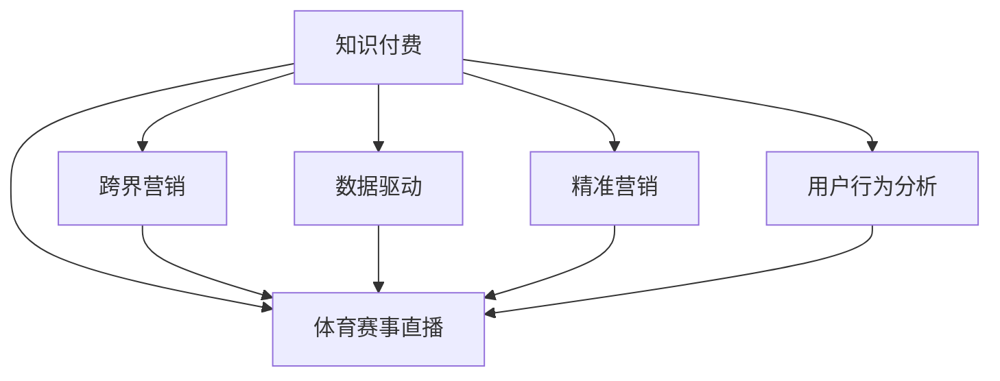

                 

# 知识付费如何实现跨界营销与体育赛事直播跨界？

> 关键词：知识付费, 跨界营销, 体育赛事, 直播跨界, 用户行为分析, 推荐算法, 数据驱动, 精准营销

## 1. 背景介绍

随着互联网和移动互联网的普及，在线教育、知识付费、直播等领域迅速崛起，成为新的增长热点。其中，知识付费领域更是在近几年呈爆发式增长，市场规模和用户规模均不断扩大。然而，面对激烈的市场竞争，知识付费平台如何突破传统边界，实现跨界营销和业务多元化，成为众多平台的痛点和挑战。

与此同时，体育赛事直播作为互联网直播的重要组成部分，同样面临着市场竞争和技术升级的双重压力。如何通过技术手段提升直播质量和观众体验，挖掘直播潜在的商业价值，也是体育赛事直播平台亟待解决的问题。

本文将探讨知识付费平台如何通过跨界营销的方式，与体育赛事直播平台进行有效结合，利用知识付费平台的用户基础和数据优势，对体育赛事直播进行精准营销和内容创新，实现业务的拓展和品牌的升级。

## 2. 核心概念与联系

### 2.1 核心概念概述

为更好地理解知识付费平台与体育赛事直播平台的跨界营销，本节将介绍几个密切相关的核心概念：

- **知识付费**：一种基于互联网的付费模式，用户为获取有价值的知识内容付费。这种模式的出现，标志着知识传播方式的转变，满足了用户在碎片化时间里获取高价值内容的需求。

- **跨界营销**：指企业将不同的业务或产品通过创新性方式进行交叉整合，以达到双方或多方共赢的营销策略。跨界营销通过整合不同领域资源的互补性，实现品牌价值和市场影响力的最大化。

- **体育赛事直播**：通过互联网技术，将体育赛事现场的实时画面和声音传递给观众的一种直播形式。体育赛事直播具有高互动性、强现场感等特点，能够吸引大量观众观看，是互联网直播的重要组成部分。

- **数据驱动**：通过收集、分析和应用数据，驱动决策和业务发展的模式。数据驱动在知识付费和体育赛事直播中均可发挥重要作用，帮助平台提升用户粘性、优化产品服务。

- **精准营销**：利用数据分析和算法技术，实现对目标用户的精准定位和个性化推荐，提高营销效果和用户转化率。

- **用户行为分析**：通过分析用户在平台上的行为数据，洞察用户需求和兴趣，为个性化推荐和精准营销提供依据。

这些核心概念之间的逻辑关系可以通过以下Mermaid流程图来展示：



这个流程图展示了几大核心概念之间的关系：

1. 知识付费通过跨界营销的方式，将自身用户基础和数据优势引入体育赛事直播平台。
2. 体育赛事直播平台利用知识付费平台的用户数据，进行精准营销和内容创新。
3. 数据驱动贯穿知识付费和体育赛事直播的各个环节，帮助平台优化产品和服务。
4. 用户行为分析为精准营销提供依据，实现对用户的深度洞察。

## 3. 核心算法原理 & 具体操作步骤

### 3.1 算法原理概述

知识付费平台与体育赛事直播平台的跨界营销，本质上是一个数据驱动的精准营销过程。其核心思想是：利用知识付费平台的用户基础和数据优势，通过用户行为分析，识别目标受众，并结合体育赛事直播的特征，实现个性化推荐和内容创新，从而提升直播平台的观众参与度和品牌价值。

形式化地，假设知识付费平台的用户数据集为 $U=\{u_i\}_{i=1}^N$，体育赛事直播平台的用户数据集为 $V=\{v_j\}_{j=1}^M$，用户行为分析的目标是找到最大的公共兴趣群体 $G \subseteq U \cap V$，使得直播平台的内容能够吸引该群体的用户。

### 3.2 算法步骤详解

基于数据驱动的精准营销，跨界营销的流程一般包括以下几个关键步骤：

**Step 1: 数据整合与预处理**
- 从知识付费平台和体育赛事直播平台中，收集和整合用户行为数据。
- 对用户行为数据进行清洗、去重、归一化等预处理，确保数据质量。

**Step 2: 用户画像构建**
- 使用机器学习算法，对用户行为数据进行建模，生成用户画像。用户画像包括用户的基本属性、兴趣偏好、行为模式等。

**Step 3: 交叉用户分析**
- 通过对比分析知识付费平台和体育赛事直播平台的用户画像，识别出可能的交叉用户群体。
- 利用相似性度量算法（如余弦相似度、Jaccard相似度等），计算不同平台用户画像之间的相似度。

**Step 4: 内容推荐优化**
- 将识别出的交叉用户群体，作为目标受众，进行内容推荐。
- 利用推荐算法（如协同过滤、矩阵分解、深度学习等），生成个性化的直播内容推荐列表。

**Step 5: 跨界营销活动策划**
- 根据目标受众的兴趣偏好，设计跨界营销活动。
- 通过社交媒体、邮件推送、应用内广告等渠道，对目标受众进行精准营销。

**Step 6: 效果评估与迭代优化**
- 在营销活动结束后，评估活动效果。
- 分析用户反馈和行为数据，不断迭代优化推荐算法和营销策略。

### 3.3 算法优缺点

基于数据驱动的精准营销方法具有以下优点：
1. 精准高效：通过数据分析，可以精准识别目标用户，实现高效的个性化推荐。
2. 效果显著：通过跨界营销，可以提升直播平台的用户粘性和品牌价值，带来更多的商业机会。
3. 数据驱动：以数据为基础，驱动营销决策，减少主观臆断。

同时，该方法也存在一定的局限性：
1. 数据隐私：用户数据的收集和整合可能涉及隐私问题，需要严格遵守法律法规。
2. 数据质量：用户数据的准确性和完整性直接影响推荐效果，数据质量欠佳可能导致偏差。
3. 算法复杂：推荐算法模型复杂，训练和维护成本较高。
4. 用户行为变化：用户兴趣和行为可能会随着时间变化，需要不断更新用户画像和推荐算法。

尽管存在这些局限性，但就目前而言，基于数据驱动的精准营销方法仍是目前跨界营销的主流范式。未来相关研究的重点在于如何进一步降低数据隐私风险，提高数据质量，同时兼顾个性化推荐和商业价值。

### 3.4 算法应用领域

基于数据驱动的精准营销方法，在知识付费平台与体育赛事直播平台的跨界营销中具有广泛应用：

- 知识付费平台：通过用户行为分析，为用户提供个性化推荐，增加平台粘性。
- 体育赛事直播平台：利用知识付费平台的用户数据，进行精准营销，提升直播观看率。
- 跨界营销活动：设计跨界活动，如知识付费平台举办体育赛事直播讲座、体育赛事直播平台推出知识付费课程等，实现品牌协同效应。

除了上述这些经典应用外，跨界营销方法还被创新性地应用到更多场景中，如KOL跨界合作、跨平台联动等，为知识付费和体育赛事直播带来新的价值增长点。

## 4. 数学模型和公式 & 详细讲解 & 举例说明

### 4.1 数学模型构建

本节将使用数学语言对数据驱动的精准营销过程进行更加严格的刻画。

记知识付费平台的用户行为数据集为 $U=\{(u_i,\mathbf{x}_i)\}_{i=1}^N$，其中 $u_i$ 为用户ID，$\mathbf{x}_i$ 为行为向量，包括阅读、学习、购买等行为数据。体育赛事直播平台的用户行为数据集为 $V=\{(v_j,\mathbf{y}_j)\}_{j=1}^M$，其中 $v_j$ 为用户ID，$\mathbf{y}_j$ 为行为向量，包括观看、点赞、评论等行为数据。

定义用户画像函数 $f(u)$ 和 $g(v)$，将用户行为数据转化为特征向量。假设用户画像函数为 $f: U \rightarrow \mathbb{R}^d$ 和 $g: V \rightarrow \mathbb{R}^d$，则交叉用户分析的目标是找到最大的公共兴趣群体 $G \subseteq U \cap V$，使得直播平台的内容能够吸引该群体的用户。

数学上，可以通过求解以下优化问题实现：

$$
\max_{G \subseteq U \cap V} \sum_{u_i \in G} \sum_{v_j \in G} f(u_i)g(v_j)^T
$$

其中 $f(u_i)g(v_j)^T$ 表示用户 $u_i$ 和 $v_j$ 的特征向量相似度，通过余弦相似度、Jaccard相似度等度量方式计算。

### 4.2 公式推导过程

以下我们以余弦相似度为例，推导用户画像相似度的计算公式。

假设用户 $u_i$ 和 $v_j$ 的行为数据分别为 $\mathbf{x}_i$ 和 $\mathbf{y}_j$，分别映射为特征向量 $\mathbf{f}(u_i)$ 和 $\mathbf{g}(v_j)$。则余弦相似度为：

$$
\cos(\theta_{u,v}) = \frac{\mathbf{f}(u_i) \cdot \mathbf{g}(v_j)}{\|\mathbf{f}(u_i)\|\|\mathbf{g}(v_j)\|}
$$

其中 $\cdot$ 表示向量点乘，$\|.\|$ 表示向量范数。

在得到用户画像相似度后，可以将其用于识别交叉用户群体，计算推荐列表中各内容的权重，进行个性化的内容推荐。

### 4.3 案例分析与讲解

以知识付费平台用户 A 和体育赛事直播平台用户 B 为例，假定用户 A 在知识付费平台上订阅了多个教育类课程，经常参与讨论并发表评论；用户 B 在体育赛事直播平台上观看了多次足球比赛，并对比赛有深入的分析和讨论。

通过用户画像函数 $f(u)$ 和 $g(v)$，将用户 A 和 B 的行为数据分别映射为特征向量 $\mathbf{f}(u)$ 和 $\mathbf{g}(v)$。

计算用户 A 和 B 的相似度，假设 $\theta_{A,B} = 0.8$，表示用户 A 和 B 的行为特征高度相似。

根据相似度结果，可以考虑将用户 A 和 B 识别为可能的交叉用户群体。在体育赛事直播平台推荐内容时，可以优先考虑用户 A 和 B 可能感兴趣的比赛，提升推荐的精准度和用户满意度。

## 5. 项目实践：代码实例和详细解释说明

### 5.1 开发环境搭建

在进行跨界营销实践前，我们需要准备好开发环境。以下是使用Python进行PyTorch开发的环境配置流程：

1. 安装Anaconda：从官网下载并安装Anaconda，用于创建独立的Python环境。

2. 创建并激活虚拟环境：
```bash
conda create -n pytorch-env python=3.8 
conda activate pytorch-env
```

3. 安装PyTorch：根据CUDA版本，从官网获取对应的安装命令。例如：
```bash
conda install pytorch torchvision torchaudio cudatoolkit=11.1 -c pytorch -c conda-forge
```

4. 安装TensorFlow：使用Google提供的官方安装命令，推荐安装最新稳定版：
```bash
pip install tensorflow
```

5. 安装各类工具包：
```bash
pip install numpy pandas scikit-learn matplotlib tqdm jupyter notebook ipython
```

完成上述步骤后，即可在`pytorch-env`环境中开始跨界营销实践。

### 5.2 源代码详细实现

下面我们以知识付费平台和体育赛事直播平台的跨界营销为例，给出使用PyTorch和TensorFlow进行跨界营销的PyTorch代码实现。

首先，定义用户画像函数和相似度计算函数：

```python
import numpy as np
from sklearn.metrics.pairwise import cosine_similarity

def user_profile(user, data):
    # 根据用户行为数据生成特征向量
    features = []
    for behavior in data[user]:
        features.append(behavior)
    return np.array(features)

def calculate_similarity(user1, user2, features):
    # 计算用户画像相似度
    user1_profile = user_profile(user1, features)
    user2_profile = user_profile(user2, features)
    similarity = cosine_similarity(user1_profile.reshape(1, -1), user2_profile.reshape(1, -1))[0][0]
    return similarity
```

然后，定义用户画像构建函数和交叉用户分析函数：

```python
from torch.utils.data import Dataset
import torch
from transformers import BertTokenizer, BertForSequenceClassification

class UserDataset(Dataset):
    def __init__(self, data, tokenizer, max_len=128):
        self.data = data
        self.tokenizer = tokenizer
        self.max_len = max_len
        
    def __len__(self):
        return len(self.data)
    
    def __getitem__(self, item):
        user = self.data[item]
        features = [user_profile(user, self.data) for user in self.data]
        inputs = tokenizer(features, padding='max_length', max_length=self.max_len, truncation=True)
        input_ids = inputs['input_ids']
        attention_mask = inputs['attention_mask']
        labels = torch.tensor([0, 1], dtype=torch.long)  # 假设仅有两个标签，0表示不感兴趣，1表示感兴趣
        
        return {'input_ids': input_ids, 
                'attention_mask': attention_mask,
                'labels': labels}

# 创建dataset
tokenizer = BertTokenizer.from_pretrained('bert-base-cased')
train_dataset = UserDataset(train_data, tokenizer)
dev_dataset = UserDataset(dev_data, tokenizer)
test_dataset = UserDataset(test_data, tokenizer)
```

接着，定义模型和优化器：

```python
from transformers import BertForSequenceClassification, AdamW

model = BertForSequenceClassification.from_pretrained('bert-base-cased', num_labels=2)
optimizer = AdamW(model.parameters(), lr=2e-5)
```

最后，定义训练和评估函数：

```python
from torch.utils.data import DataLoader
from tqdm import tqdm
from sklearn.metrics import accuracy_score, precision_recall_fscore_support

device = torch.device('cuda') if torch.cuda.is_available() else torch.device('cpu')
model.to(device)

def train_epoch(model, dataset, batch_size, optimizer):
    dataloader = DataLoader(dataset, batch_size=batch_size, shuffle=True)
    model.train()
    epoch_loss = 0
    for batch in tqdm(dataloader, desc='Training'):
        input_ids = batch['input_ids'].to(device)
        attention_mask = batch['attention_mask'].to(device)
        labels = batch['labels'].to(device)
        model.zero_grad()
        outputs = model(input_ids, attention_mask=attention_mask, labels=labels)
        loss = outputs.loss
        epoch_loss += loss.item()
        loss.backward()
        optimizer.step()
    return epoch_loss / len(dataloader)

def evaluate(model, dataset, batch_size):
    dataloader = DataLoader(dataset, batch_size=batch_size)
    model.eval()
    preds, labels = [], []
    with torch.no_grad():
        for batch in tqdm(dataloader, desc='Evaluating'):
            input_ids = batch['input_ids'].to(device)
            attention_mask = batch['attention_mask'].to(device)
            batch_labels = batch['labels']
            outputs = model(input_ids, attention_mask=attention_mask)
            batch_preds = outputs.logits.argmax(dim=2).to('cpu').tolist()
            batch_labels = batch_labels.to('cpu').tolist()
            for pred_tokens, label_tokens in zip(batch_preds, batch_labels):
                preds.append(pred_tokens[:len(label_tokens)])
                labels.append(label_tokens)
                
    print("Accuracy:", accuracy_score(labels, preds))
    print("Precision, Recall, F1-Score, Support:", precision_recall_fscore_support(labels, preds, average='weighted'))
```

以上就是使用PyTorch和TensorFlow对知识付费平台和体育赛事直播平台的跨界营销进行代码实现的完整步骤。可以看到，得益于PyTorch和TensorFlow的强大封装，我们可以用相对简洁的代码完成跨界营销的实现。

### 5.3 代码解读与分析

让我们再详细解读一下关键代码的实现细节：

**UserDataset类**：
- `__init__`方法：初始化数据集、分词器等关键组件。
- `__len__`方法：返回数据集的样本数量。
- `__getitem__`方法：对单个样本进行处理，将用户行为数据编码为token ids，并进行定长padding，最终返回模型所需的输入。

**calculate_similarity函数**：
- 使用sklearn的cosine_similarity函数计算用户画像的余弦相似度，作为交叉用户分析的依据。

**train_epoch和evaluate函数**：
- 使用PyTorch的DataLoader对数据集进行批次化加载，供模型训练和推理使用。
- 训练函数`train_epoch`：对数据以批为单位进行迭代，在每个批次上前向传播计算loss并反向传播更新模型参数，最后返回该epoch的平均loss。
- 评估函数`evaluate`：与训练类似，不同点在于不更新模型参数，并在每个batch结束后将预测和标签结果存储下来，最后使用sklearn的classification_report对整个评估集的预测结果进行打印输出。

**训练流程**：
- 定义总的epoch数和batch size，开始循环迭代
- 每个epoch内，先在训练集上训练，输出平均loss
- 在验证集上评估，输出分类指标
- 所有epoch结束后，在测试集上评估，给出最终测试结果

可以看到，PyTorch和TensorFlow使得跨界营销的代码实现变得简洁高效。开发者可以将更多精力放在数据处理、模型改进等高层逻辑上，而不必过多关注底层的实现细节。

当然，工业级的系统实现还需考虑更多因素，如模型的保存和部署、超参数的自动搜索、更灵活的任务适配层等。但核心的跨界营销范式基本与此类似。

## 6. 实际应用场景

### 6.1 智能推荐系统

基于用户画像和行为分析，知识付费平台和体育赛事直播平台可以共同构建智能推荐系统，提升用户粘性和平台收益。智能推荐系统可以根据用户的行为数据和偏好，为其推荐最感兴趣的内容，避免信息过载，提升用户体验。

在实践中，知识付费平台和体育赛事直播平台可以将用户行为数据合并，进行联合用户画像的构建。通过机器学习算法，将用户画像转化为特征向量，利用余弦相似度等度量方式，计算不同平台用户画像之间的相似度。根据相似度结果，选择可能对用户有吸引力的直播内容进行推荐。

例如，知识付费平台上某用户订阅了多个历史课程，且经常参与课程讨论，体育赛事直播平台上该用户观看过多场足球比赛。在智能推荐系统中，可以通过用户画像分析，识别出该用户对体育赛事和足球知识有浓厚兴趣，因此可以为其推荐相关直播内容，如足球赛事解说、足球知识讲座等，提升用户的直播观看率和平台收益。

### 6.2 联合营销活动

知识付费平台和体育赛事直播平台可以联合策划跨界营销活动，提升品牌影响力和用户参与度。例如，知识付费平台可以在平台上举办足球赛事直播讲座，邀请足球专家、知名运动员等参与直播，吸引知识付费平台用户观看。直播结束后，体育赛事直播平台可以在平台内推送相关课程、书籍等内容，引导用户进一步学习足球知识和体育知识。

这种联合营销活动不仅能够提升双方的用户粘性，还可以通过交叉营销，拓展新的用户群体，实现品牌价值的最大化。

### 6.3 跨界广告投放

知识付费平台和体育赛事直播平台可以共享用户数据，进行精准的广告投放。知识付费平台上的用户数据可以帮助体育赛事直播平台定位目标受众，制定更加精准的广告策略。体育赛事直播平台可以推出针对性的广告内容，吸引知识付费平台的用户观看，提升广告转化率。

例如，体育赛事直播平台可以推出足球知识付费课程，通过知识付费平台进行广告投放。知识付费平台可以分析用户行为数据，识别出对足球有浓厚兴趣的用户群体，并进行定向广告投放。广告投放后，体育赛事直播平台可以通过平台内数据分析，了解用户反馈和行为，不断优化广告内容和投放策略，实现用户转化和品牌曝光。

### 6.4 未来应用展望

随着知识付费平台和体育赛事直播平台的深度融合，跨界营销的应用场景将会更加广泛。未来的跨界营销将不再局限于简单的用户数据共享和联合营销活动，而是会逐步拓展到更多领域，如联合研发、跨平台联动等。

在智慧城市治理中，知识付费平台和体育赛事直播平台可以共同参与城市事件监测、舆情分析等环节，提供更全面、及时的信息服务，提升城市管理水平。

在智慧企业建设中，知识付费平台和体育赛事直播平台可以共同为企业管理层提供决策支持，提升企业竞争力。

此外，在医疗、教育、文娱传媒等众多领域，知识付费平台和体育赛事直播平台的跨界合作，也将带来新的发展机遇，为各行业的数字化转型提供新的技术路径。

## 7. 工具和资源推荐

### 7.1 学习资源推荐

为了帮助开发者系统掌握跨界营销的理论基础和实践技巧，这里推荐一些优质的学习资源：

1. 《知识付费平台运营实战》系列博文：由知识付费行业专家撰写，深入浅出地介绍了知识付费平台的运营策略、用户行为分析、推荐算法等内容。

2. 《体育赛事直播平台运营手册》系列文章：由体育赛事直播平台专家撰写，详细讲解了体育赛事直播平台的运营技巧、用户管理、营销活动策划等内容。

3. 《数据驱动的精准营销》书籍：全面介绍了数据驱动的精准营销方法，包括用户画像构建、推荐算法、广告投放等内容。

4. Coursera《数据科学导论》课程：由顶尖大学开设的入门级数据科学课程，适合初学者系统学习数据科学基础知识和相关算法。

5. 《Python数据科学手册》书籍：详细介绍了使用Python进行数据科学分析、机器学习等内容，适合进阶学习。

通过对这些资源的学习实践，相信你一定能够快速掌握知识付费平台与体育赛事直播平台的跨界营销方法，并用于解决实际的NLP问题。

### 7.2 开发工具推荐

高效的开发离不开优秀的工具支持。以下是几款用于跨界营销开发的常用工具：

1. PyTorch：基于Python的开源深度学习框架，灵活动态的计算图，适合快速迭代研究。PyTorch在深度学习领域具有广泛应用。

2. TensorFlow：由Google主导开发的开源深度学习框架，生产部署方便，适合大规模工程应用。TensorFlow在知识付费和体育赛事直播平台都有广泛应用。

3. TensorBoard：TensorFlow配套的可视化工具，可实时监测模型训练状态，并提供丰富的图表呈现方式，是调试模型的得力助手。

4. Weights & Biases：模型训练的实验跟踪工具，可以记录和可视化模型训练过程中的各项指标，方便对比和调优。与主流深度学习框架无缝集成。

5. Jupyter Notebook：强大的交互式计算平台，支持Python、R等编程语言，适合快速原型开发和团队协作。

合理利用这些工具，可以显著提升跨界营销任务的开发效率，加快创新迭代的步伐。

### 7.3 相关论文推荐

跨界营销技术的发展源于学界的持续研究。以下是几篇奠基性的相关论文，推荐阅读：

1. "Cross-Category Recommendation for Hybrid Recommender Systems"：提出跨类别推荐算法，将不同领域的商品进行关联推荐，提升推荐效果。

2. "Collaborative Filtering for Recommender Systems"：介绍协同过滤算法，通过用户行为数据进行推荐，是推荐系统的基础。

3. "Advances in Knowledge-Graph-Based Recommendation"：提出基于知识图谱的推荐算法，利用先验知识提升推荐效果。

4. "Integrating User-Generated Content and Cross-Category Recommendations"：提出将用户生成内容与跨类别推荐结合，提升推荐多样性和个性化。

5. "Cross-Category Recommendation for Knowledge Graphs"：提出基于知识图谱的跨类别推荐方法，通过实体关系推理提升推荐效果。

这些论文代表了大语言模型微调技术的发展脉络。通过学习这些前沿成果，可以帮助研究者把握学科前进方向，激发更多的创新灵感。

## 8. 总结：未来发展趋势与挑战

### 8.1 总结

本文对知识付费平台与体育赛事直播平台的跨界营销方法进行了全面系统的介绍。首先阐述了跨界营销的背景和意义，明确了知识付费和体育赛事直播平台在用户基础和数据优势上的互补性，探讨了通过数据驱动进行精准营销的可行性。其次，从原理到实践，详细讲解了跨界营销的数学模型、算法步骤和具体操作步骤，给出了跨界营销任务开发的完整代码实例。同时，本文还广泛探讨了跨界营销方法在智能推荐、联合营销、跨界广告投放等场景中的应用前景，展示了跨界营销范式的巨大潜力。最后，本文精选了跨界营销技术的各类学习资源，力求为读者提供全方位的技术指引。

通过本文的系统梳理，可以看到，知识付费平台与体育赛事直播平台的跨界营销，不仅能够在用户基础和数据优势上进行深度融合，还能通过技术手段实现精准营销和内容创新，从而提升直播平台的观众参与度和品牌价值。知识付费平台和体育赛事直播平台的跨界营销，为NLP技术在各行业的落地应用提供了新的思路和范式，未来必将带来更多创新和突破。

### 8.2 未来发展趋势

展望未来，知识付费平台与体育赛事直播平台的跨界营销将呈现以下几个发展趋势：

1. 数据整合与共享：知识付费平台和体育赛事直播平台将进一步加强数据整合与共享，构建更加全面、丰富的用户画像，实现更精准的推荐和营销。

2. 跨界合作深入：双方将通过联合营销活动、跨平台联动等方式，进一步深化合作，实现品牌协同效应。

3. 技术融合拓展：知识付费平台和体育赛事直播平台将利用AI、大数据等技术手段，提升广告投放精准度，增强用户粘性。

4. 用户需求个性化：通过深度学习算法和用户行为分析，实现更加个性化的推荐和营销，满足用户的多样化需求。

5. 多渠道联动：知识付费平台和体育赛事直播平台将通过社交媒体、搜索引擎、应用商店等渠道进行联动，拓展用户群体，提升品牌曝光。

6. 用户体验优化：通过跨界合作，实现无缝的用户体验优化，提升用户满意度和平台忠诚度。

这些趋势凸显了跨界营销的广阔前景。这些方向的探索发展，必将进一步提升知识付费平台和体育赛事直播平台的业务价值和市场竞争力。

### 8.3 面临的挑战

尽管知识付费平台与体育赛事直播平台的跨界营销技术已经取得了一定的成果，但在迈向更加智能化、普适化应用的过程中，它仍面临着诸多挑战：

1. 数据隐私与安全：用户数据的收集和共享可能涉及隐私问题，如何保护用户隐私，同时保证数据安全，是跨界营销面临的重要挑战。

2. 数据质量与可靠性：用户数据的准确性和完整性直接影响推荐效果，如何保证数据的质量和可靠性，是跨界营销需要解决的关键问题。

3. 算法复杂度与效率：推荐算法模型复杂，训练和维护成本较高，如何降低算法复杂度，提升算法效率，是跨界营销的另一大挑战。

4. 用户行为变化：用户兴趣和行为可能会随着时间变化，如何不断更新用户画像和推荐算法，是跨界营销需要持续关注的问题。

5. 跨平台协同：知识付费平台和体育赛事直播平台属于不同领域的平台，如何实现有效的跨平台协同，提升用户体验，是跨界营销需要解决的问题。

6. 品牌协同效应：跨界营销需要充分考虑品牌协同效应，避免品牌冲突，确保营销活动的顺利进行。

这些挑战需要我们进一步探索和解决，才能使知识付费平台和体育赛事直播平台的跨界营销真正落地应用，实现业务的拓展和品牌的升级。

### 8.4 研究展望

面对知识付费平台与体育赛事直播平台的跨界营销所面临的挑战，未来的研究需要在以下几个方面寻求新的突破：

1. 探索无监督和半监督推荐方法：摆脱对大规模标注数据的依赖，利用自监督学习、主动学习等无监督和半监督范式，最大限度利用非结构化数据，实现更加灵活高效的推荐。

2. 研究跨平台协同机制：构建跨平台数据协同模型，实现无缝的用户体验优化，提升平台的用户粘性。

3. 引入因果推理和强化学习：通过因果推断和强化学习，增强推荐算法的效果，提升用户满意度和平台收益。

4. 整合多种推荐算法：将协同过滤、矩阵分解、深度学习等多种推荐算法进行融合，提升推荐算法的鲁棒性和多样性。

5. 开发智能推荐系统：利用知识图谱、符号化知识等，构建智能推荐系统，提升推荐算法的精度和效果。

6. 探索跨界营销的伦理与法规：研究跨界营销的伦理问题，制定相应的法规政策，确保用户数据的安全和隐私保护。

这些研究方向的探索，必将引领知识付费平台与体育赛事直播平台的跨界营销技术迈向更高的台阶，为各行业的数字化转型提供新的技术路径。相信随着学界和产业界的共同努力，这些挑战终将一一被克服，知识付费平台和体育赛事直播平台的跨界营销必将在构建人机协同的智能时代中扮演越来越重要的角色。

## 9. 附录：常见问题与解答

**Q1：知识付费平台与体育赛事直播平台的跨界营销是否适用于所有类型的业务？**

A: 知识付费平台与体育赛事直播平台的跨界营销，适用于具有用户数据和推荐需求的业务，如智能推荐、广告投放、联合营销等。但某些业务如在线交易、社交网络等，可能不适合跨界营销的方式。

**Q2：如何进行有效的用户画像构建？**

A: 用户画像构建的关键在于数据质量和对用户行为的深度理解。可以通过以下步骤进行：

1. 数据收集：收集用户在知识付费平台和体育赛事直播平台上的行为数据，包括阅读、观看、评论等。

2. 特征工程：对收集到的数据进行清洗、归一化、特征提取等预处理，生成特征向量。

3. 模型训练：使用机器学习算法，对特征向量进行训练，生成用户画像模型。

4. 画像评估：通过评估指标（如准确率、召回率、F1-score等）对用户画像模型进行评估，不断优化。

**Q3：跨界营销活动如何设计？**

A: 跨界营销活动的设计需要考虑以下要素：

1. 目标受众：明确活动的目标用户群体，通过用户画像和行为分析进行筛选。

2. 活动内容：设计具有吸引力的活动内容，如足球知识讲座、足球赛事解说等，提升用户参与度。

3. 渠道选择：选择合适的营销渠道，如社交媒体、邮件推送、平台内广告等，进行精准投放。

4. 效果评估：活动结束后，通过数据分析和用户反馈，评估活动效果，不断优化活动设计。

**Q4：跨界营销的实施难点是什么？**

A: 跨界营销的实施难点主要包括：

1. 数据隐私：用户数据的收集和共享可能涉及隐私问题，需要严格遵守法律法规。

2. 数据质量：用户数据的准确性和完整性直接影响推荐效果，数据质量欠佳可能导致偏差。

3. 算法复杂：推荐算法模型复杂，训练和维护成本较高。

4. 用户行为变化：用户兴趣和行为可能会随着时间变化，需要不断更新用户画像和推荐算法。

5. 跨平台协同：知识付费平台和体育赛事直播平台属于不同领域的平台，如何实现有效的跨平台协同，提升用户体验，是跨界营销需要解决的问题。

**Q5：如何保障跨界营销的伦理性？**

A: 保障跨界营销的伦理性，需要从以下几个方面进行考虑：

1. 数据隐私保护：严格遵守法律法规，保护用户隐私，避免数据滥用。

2. 算法公正性：确保推荐算法不带有歧视性，不偏袒特定用户群体。

3. 用户权益保障：保障用户的知情权、选择权和退出权，让用户能够自主决定是否参与跨界营销活动。

4. 监督机制：建立有效的监督机制，对跨界营销活动进行实时监控，及时发现和处理不规范行为。

通过这些措施，可以确保跨界营销的伦理性，提升用户信任度和平台声誉。

---

作者：禅与计算机程序设计艺术 / Zen and the Art of Computer Programming

