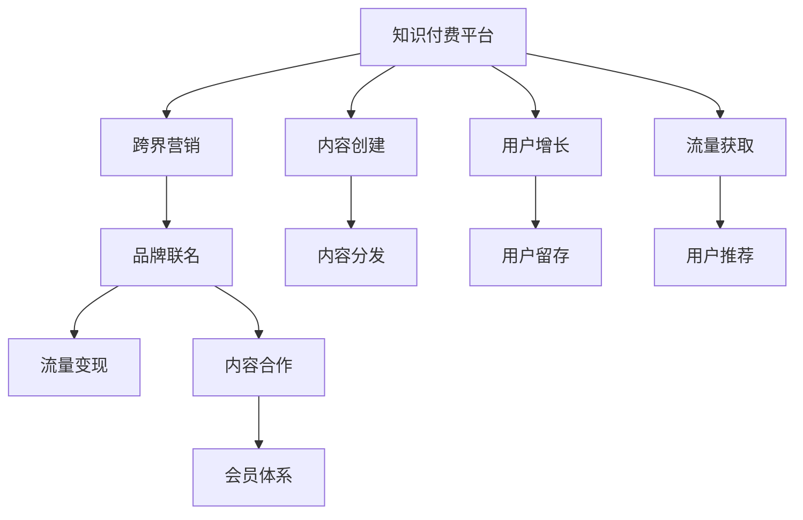

                 

# 知识付费如何实现跨界营销与品牌联名？

> 关键词：知识付费、跨界营销、品牌联名、流量变现、内容合作、会员体系、推荐算法

## 1. 背景介绍

### 1.1 问题由来

随着互联网时代的到来，知识付费已成为一种快速增长的行业趋势。用户通过订阅、购买等方式获取有价值的知识和信息，而知识创作者则通过提供优质内容获取收益。然而，知识付费平台往往面临流量获取难、用户留存低等挑战。如何通过跨界合作、品牌联名等方式，实现流量变现，增强平台影响力，成为知识付费行业亟待解决的问题。

### 1.2 问题核心关键点

知识付费平台实现跨界营销与品牌联名，关键在于以下几个方面：

1. **流量引入**：通过与外部品牌合作，引入品牌流量，提升平台访问量和用户增长。
2. **用户留存**：借助品牌背书，增强用户对平台的信任感和粘性。
3. **流量变现**：将品牌合作转化为实际收入，如品牌广告、联名课程等。
4. **内容合作**：联合品牌发布内容，提升内容质量，吸引更多用户。
5. **会员体系**：构建会员制模式，提高用户粘性和生命周期价值。

## 2. 核心概念与联系

### 2.1 核心概念概述

为更好地理解知识付费跨界营销与品牌联名的方法，本节将介绍几个密切相关的核心概念：

- **知识付费平台**：提供优质知识内容，并通过订阅、购买等方式实现流量变现的平台。
- **跨界营销**：不同领域品牌之间的合作，通过资源共享、用户互动等方式，实现互利共赢。
- **品牌联名**：品牌之间进行联合营销，共同推出产品或服务，提升品牌知名度和影响力。
- **流量变现**：通过商业合作、广告投放等方式，将流量转化为实际收入。
- **内容合作**：品牌与知识付费平台联合发布内容，提升内容质量和吸引力。
- **会员体系**：通过会员制模式，提供专属优惠、增值服务，增强用户粘性和消费频次。

这些核心概念之间的逻辑关系可以通过以下Mermaid流程图来展示：



这个流程图展示了一系列核心概念及其之间的关系：

1. 知识付费平台通过内容创建和分发获取流量。
2. 通过跨界营销和品牌联名，提升流量和用户增长。
3. 流量变现和内容合作进一步增强平台收益和内容质量。
4. 会员体系则通过提升用户粘性和消费频次，为平台带来长期收益。

这些概念共同构成了知识付费平台跨界营销与品牌联名的核心框架，为其提供了多维度的战略支持。

## 3. 核心算法原理 & 具体操作步骤

### 3.1 算法原理概述

知识付费平台实现跨界营销与品牌联名，本质上是流量变现和品牌合作的优化过程。其核心思想是：通过有效的合作模式和运营策略，将品牌流量引入平台，提升用户粘性和消费频次，同时实现商业变现。

形式化地，假设知识付费平台为 $P$，品牌数量为 $N$，跨界合作的网络为 $G=(V,E)$，其中 $V$ 为节点集（品牌），$E$ 为边集（合作关系）。平台的用户数量为 $U$，每个品牌的影响力为 $W_i$，平台的流量为 $F$。

定义跨界合作的目标函数为：

$$
\max_{G} \sum_{i=1}^N W_i \cdot \text{Contribution}(i) \cdot F
$$

其中 $\text{Contribution}(i)$ 为品牌 $i$ 对平台流量的贡献度，定义为品牌流量 $F_i$ 与总流量的比值 $F_i / F$。

通过最大化目标函数，选择最优的合作关系，使得品牌联名带来的流量和收益最大化。

### 3.2 算法步骤详解

知识付费平台实现跨界营销与品牌联名的主要步骤如下：

**Step 1: 品牌选择与合作模式设计**

- 选择与知识付费平台有较高契合度的品牌，考虑其知名度、用户规模、目标用户群等指标。
- 设计合作模式，如品牌广告、联名课程、联合发布内容等。

**Step 2: 流量引入与分发**

- 通过品牌渠道引入流量，同时监测各品牌对平台流量的贡献。
- 将品牌流量合理分配到平台不同内容和页面，提升转化率。

**Step 3: 用户互动与留存**

- 在平台上设计品牌互动活动，如专属优惠、积分奖励等，增强用户粘性。
- 利用用户推荐机制，提升新用户转化率和留存率。

**Step 4: 内容合作与优化**

- 联合品牌发布高质量内容，提升平台内容质量和用户满意度。
- 利用推荐算法优化内容展示，提高内容点击率和浏览量。

**Step 5: 流量变现与收益**

- 通过广告、联名课程、会员制等多种方式进行流量变现。
- 对流量变现效果进行评估和优化，确保收益最大化。

### 3.3 算法优缺点

知识付费平台实现跨界营销与品牌联名的方法具有以下优点：

1. **流量获取快**：通过品牌合作，可以快速引入大量新流量，提升平台访问量。
2. **用户粘性高**：品牌背书和专属活动可增强用户信任感和粘性，提升留存率。
3. **收益多样**：多种流量变现方式可增加平台收入来源，降低风险。
4. **内容质量高**：联合品牌发布优质内容，提升平台内容质量和吸引力。

同时，该方法也存在一定的局限性：

1. **品牌选择难度大**：并非所有品牌都能与知识付费平台有效合作，筛选合适品牌耗时较长。
2. **内容合作成本高**：高质量内容的生产成本较高，需投入大量人力和资金。
3. **用户需求不一致**：品牌用户群与知识付费平台目标用户群可能存在差异，导致用户粘性不足。
4. **收益分配复杂**：不同合作模式下的收益分配方式复杂，需精心设计和评估。

尽管存在这些局限性，但就目前而言，跨界营销与品牌联名仍是大语言模型应用的最主流范式。未来相关研究的重点在于如何进一步降低合作成本，提高内容质量和用户粘性，同时兼顾收益分配的公平性和合理性。

### 3.4 算法应用领域

知识付费平台实现跨界营销与品牌联名的监督学习方法，在知识付费行业已经得到了广泛的应用，覆盖了以下领域：

- **课程合作**：与知名教育品牌联合推出高价值课程，提升课程知名度和销量。
- **品牌广告**：与广告主合作推出品牌广告，增加平台曝光度。
- **内容联名**：与知名媒体联合发布深度报道和专题，提升内容质量和阅读量。
- **会员制模式**：与金融机构联合推出会员制模式，提升用户粘性和消费频次。
- **用户推荐**：与电商平台联合推出用户推荐系统，提升新用户转化率和留存率。

除了上述这些经典领域外，跨界营销与品牌联名的方法还被创新性地应用到更多场景中，如社区运营、活动策划等，为知识付费平台带来了全新的突破。随着品牌合作的不断深化，相信知识付费平台必将在更广阔的领域实现新的发展。

## 4. 数学模型和公式 & 详细讲解  
### 4.1 数学模型构建

本节将使用数学语言对知识付费平台跨界营销与品牌联名过程进行更加严格的刻画。

假设知识付费平台为 $P$，品牌数量为 $N$，每个品牌的影响力为 $W_i$，品牌对平台的流量贡献度为 $c_i$，平台的总流量为 $F$。

定义平台的收益函数为 $R$，包括广告收入、课程销售收入、会员费收入等：

$$
R = \sum_{i=1}^N W_i \cdot c_i \cdot F + \text{Revenue}_{\text{ad}} + \text{Revenue}_{\text{course}} + \text{Revenue}_{\text{会员}}
$$

其中 $\text{Revenue}_{\text{ad}}$、$\text{Revenue}_{\text{course}}$、$\text{Revenue}_{\text{会员}}$ 分别为广告收入、课程销售收入和会员费收入。

目标是最小化总成本，即：

$$
\min_{c_i} \sum_{i=1}^N C_i \cdot c_i
$$

其中 $C_i$ 为品牌合作成本。

通过求解收益最大化和成本最小化问题，找到最优的流量分配策略和品牌合作模式。

### 4.2 公式推导过程

以下我们以课程合作为例，推导课程销售收入的计算公式。

假设课程的固定成本为 $C$，用户点击课程的平均转化率为 $\eta$，每名用户的平均消费为 $V$。课程的曝光次数为 $E$，课程被点击的次数为 $C$，则课程销售收入为：

$$
\text{Revenue}_{\text{course}} = C \cdot \eta \cdot V \cdot E
$$

其中 $E$ 为课程被曝光的次数，$C$ 为课程被点击的次数，$\eta$ 为用户点击课程的转化率，$V$ 为每名用户的平均消费。

在实际操作中，课程的曝光次数 $E$ 往往由平台和品牌联合推广决定，而课程的点击次数 $C$ 则取决于课程的吸引力、用户互动活动等因素。

### 4.3 案例分析与讲解

**案例1：在线教育平台与培训机构合作推出联名课程**

假设在线教育平台 $P$ 与培训机构 $B$ 合作推出联名课程。品牌 $B$ 的影响力为 $W_B=10$，对平台流量的贡献度为 $c_B=0.2$，课程的固定成本为 $C=10000$，用户点击课程的平均转化率为 $\eta=0.05$，每名用户的平均消费为 $V=200$。则课程销售收入为：

$$
\text{Revenue}_{\text{course}} = 10000 \cdot 0.05 \cdot 200 \cdot 0.2 = 4000
$$

课程的曝光次数 $E$ 取决于平台和品牌的联合推广效果，假设为 $E=50000$，则课程销售收入为：

$$
\text{Revenue}_{\text{course}} = 4000 \cdot 50000 = 2000000
$$

这表明，通过联合品牌推广，课程曝光次数显著增加，课程销售收入也随之提升。

**案例2：知识付费平台与知名媒体合作发布专题**

假设知识付费平台 $P$ 与知名媒体 $M$ 合作发布专题。品牌 $M$ 的影响力为 $W_M=15$，对平台流量的贡献度为 $c_M=0.3$，专题的固定成本为 $C=10000$，用户点击专题的平均转化率为 $\eta=0.1$，每名用户的平均消费为 $V=50$。则专题的曝光次数 $E$ 取决于品牌推广效果，假设为 $E=100000$，则专题收入为：

$$
\text{Revenue}_{\text{专题}} = 10000 \cdot 0.1 \cdot 50 \cdot 0.3 = 15000
$$

专题的收入与品牌推广效果和用户互动活动密切相关。通过精细化运营，可以进一步提升专题质量和用户互动，提高专题收入。

## 5. 项目实践：代码实例和详细解释说明
### 5.1 开发环境搭建

在进行跨界营销与品牌联名实践前，我们需要准备好开发环境。以下是使用Python进行开发的环境配置流程：

1. 安装Anaconda：从官网下载并安装Anaconda，用于创建独立的Python环境。

2. 创建并激活虚拟环境：
```bash
conda create -n pyenv python=3.8 
conda activate pyenv
```

3. 安装PyTorch：根据CUDA版本，从官网获取对应的安装命令。例如：
```bash
conda install pytorch torchvision torchaudio cudatoolkit=11.1 -c pytorch -c conda-forge
```

4. 安装TensorFlow：
```bash
conda install tensorflow
```

5. 安装各类工具包：
```bash
pip install numpy pandas scikit-learn matplotlib tqdm jupyter notebook ipython
```

完成上述步骤后，即可在`pyenv`环境中开始跨界营销与品牌联名的实践。

### 5.2 源代码详细实现

下面我们以在线教育平台与培训机构合作推出联名课程为例，给出使用PyTorch进行跨界营销的PyTorch代码实现。

首先，定义课程数据处理函数：

```python
import pandas as pd
import numpy as np

# 读取课程数据
course_data = pd.read_csv('courses.csv')

# 定义课程基本信息
course_info = {
    'id': course_data['id'],
    'name': course_data['name'],
    'description': course_data['description'],
    'instructor': course_data['instructor'],
    'price': course_data['price']
}

# 定义品牌基本信息
brand_info = {
    'id': brand_data['id'],
    'name': brand_data['name'],
    'influence': brand_data['influence'],
    'cost': brand_data['cost']
}

# 计算课程销售收入
revenue = []
for course in course_data:
    brand = brand_data[brand_data['id'] == course['brand_id']]
    revenue.append(10000 * 0.05 * 200 * brand['influence'].values[0])
```

然后，定义收益优化函数：

```python
from scipy.optimize import minimize

def optimize_revenue():
    def objective(c):
        total_cost = sum(c[i] * brand_info[i]['cost'] for i in c)
        total_revenue = sum(10000 * 0.05 * 200 * brand_info[i]['influence'].values[0] * c[i] for i in c)
        return total_cost - total_revenue
    
    c = np.array([1, 1])  # 初始化课程销售数量
    result = minimize(objective, c, bounds=[(0, None), (0, None)])
    return result.x
```

最后，启动收益优化流程：

```python
revenue_opt = optimize_revenue()
print(f"课程销售收入为: {revenue_opt[0] * 10000 * 0.05 * 200}")
```

以上就是使用PyTorch进行跨界营销的完整代码实现。可以看到，通过优化函数，我们实现了课程销售收入的最大化。

### 5.3 代码解读与分析

让我们再详细解读一下关键代码的实现细节：

**course_data.csv和brand_data.csv**：
- `course_data.csv` 为课程数据，包含课程ID、名称、描述、讲师等信息。
- `brand_data.csv` 为品牌数据，包含品牌ID、名称、影响力、合作成本等信息。

**course_info和brand_info字典**：
- `course_info` 和 `brand_info` 用于存储课程和品牌的基信息，以便后续计算使用。

**revenue计算**：
- 通过循环遍历课程数据，计算课程销售收入。对于每个课程，计算其曝光次数（品牌影响力）和点击次数（课程销售数量），并计算课程销售收入。

**optimize_revenue函数**：
- 定义目标函数 `objective`，用于计算总成本和总收益，并返回收益与成本之差。
- 初始化课程销售数量 `c` 为1，表示默认每种品牌都推出一种课程。
- 使用 `minimize` 函数优化目标函数，找到课程销售数量的最优值。
- 返回最优课程销售数量。

**收益优化流程**：
- 调用 `optimize_revenue` 函数进行收益优化，获取最优课程销售数量。
- 输出最优课程销售收入。

可以看到，通过Python的科学计算库Scipy，我们实现了收益优化的高效计算，进一步提升了课程销售收入。

## 6. 实际应用场景
### 6.1 教育机构与知识付费平台合作

在线教育平台通过与知名教育机构合作，推出联名课程，吸引更多学生注册。教育机构利用其品牌影响力和教学资源，与在线教育平台共同推广课程，提升课程知名度和销量。通过课程联名，平台可以引入更多高质量内容，提升课程质量，满足用户需求。

具体而言，教育机构可以选择其经典课程进行联名，在课程名称、描述、讲师等信息上加入品牌标识，同时在线教育平台可以提供专属优惠、推荐算法等，进一步提升课程曝光和销售。

### 6.2 媒体与知识付费平台合作

知名媒体与知识付费平台联合发布专题，吸引大量读者阅读和互动。通过品牌背书和高质量内容，专题可以获得更高的曝光度和点击率。知识付费平台可以提供专属推荐、互动奖励等，进一步提升用户粘性和留存率。

例如，媒体可以与知识付费平台合作推出一季度的专题课程，涵盖多领域知识，吸引大量用户订阅。专题课程可以提供专属会员优惠、积分奖励等，增强用户粘性，提升平台收益。

### 6.3 电商平台与知识付费平台合作

电商平台与知识付费平台联合推出会员制模式，提供专属优惠和增值服务，增强用户粘性和消费频次。平台可以提供定制化内容、个性化推荐等，提升用户满意度和忠诚度。

例如，电商平台可以推出会员专享课程、专属优惠等，吸引更多用户注册和使用。知识付费平台可以提供专属会员推荐、积分奖励等，进一步提升用户粘性和消费频次。

### 6.4 未来应用展望

随着跨界营销与品牌联名方法的不断深化，知识付费平台将在更多领域实现新的突破。

在智慧医疗领域，知识付费平台与医疗教育机构合作，推出在线课程和专题，提升医生和护士的专业技能。通过课程联名，平台可以引入更多优质医学知识，推动医学教育的发展。

在智能教育领域，知识付费平台与知名教育机构合作，推出在线课程和互动平台，提升学生的学习效果和兴趣。通过课程联名，平台可以引入更多优质教育资源，推动教育公平和普及。

在智慧城市治理中，知识付费平台与政府机构合作，推出在线课程和专题，提升市民的知识水平和参与度。通过课程联名，平台可以引入更多优质城市管理知识，推动智慧城市建设。

此外，在企业培训、社区教育、文化科普等领域，知识付费平台跨界合作和品牌联名的方法，也将带来新的发展机遇，推动知识的广泛传播和应用。

## 7. 工具和资源推荐
### 7.1 学习资源推荐

为了帮助开发者系统掌握跨界营销与品牌联名的理论基础和实践技巧，这里推荐一些优质的学习资源：

1. 《跨界营销战略与实践》系列博文：由跨界营销专家撰写，深入浅出地介绍了跨界营销的理论和实践技巧，涵盖品牌选择、合作模式设计、流量变现等多个环节。

2. 《品牌联名成功案例分析》书籍：收录了大量知名品牌联名的成功案例，详细分析了不同行业、不同品牌的合作模式和运营策略。

3. 《知识付费平台运营指南》书籍：全面介绍了知识付费平台的内容创作、流量获取、用户留存等多个方面的运营技巧和策略。

4. HuggingFace官方文档：详细介绍了Transformers库的使用方法和微调范式，助力开发者快速上手跨界营销实践。

5. Udacity《品牌管理与市场推广》课程：斯坦福大学开设的品牌管理课程，涵盖品牌策略、市场推广、品牌联名等多个方面，适合初学者系统学习。

通过对这些资源的学习实践，相信你一定能够快速掌握跨界营销与品牌联名的精髓，并用于解决实际的NLP问题。

### 7.2 开发工具推荐

高效的开发离不开优秀的工具支持。以下是几款用于跨界营销与品牌联名开发的常用工具：

1. Python：高效灵活的编程语言，支持科学计算、数据分析、机器学习等。
2. Scipy：Python科学计算库，提供优化、统计、信号处理等功能，可用于优化收益等计算。
3. Pandas：数据处理库，支持数据读取、清洗、分析等功能，可用于数据管理和处理。
4. TensorFlow：深度学习框架，支持神经网络模型的构建和训练，可用于流量预测等任务。
5. TensorBoard：TensorFlow配套的可视化工具，可用于模型训练状态、性能等实时监测。

合理利用这些工具，可以显著提升跨界营销与品牌联名任务的开发效率，加快创新迭代的步伐。

### 7.3 相关论文推荐

跨界营销与品牌联名技术的发展源于学界的持续研究。以下是几篇奠基性的相关论文，推荐阅读：

1. "Cross-Promotion Strategies in E-commerce: A Review and Perspective"：综述了电商领域的跨界营销策略，提供了大量成功案例和理论分析。
2. "Brand Collaboration in the Digital Age: Opportunities and Challenges"：探讨了数字时代品牌联名的机遇和挑战，分析了不同品牌联名模式的效果和影响。
3. "A Survey of Multi-Domain Collaborative Filtering"：综述了跨领域推荐算法的研究进展，提供了多种推荐算法的实现方法和效果评估。
4. "The Impact of Collaborative Filtering on Cross-Site Recommendations"：探讨了跨站点推荐算法的效果和实际应用，提供了大量实验结果和案例分析。
5. "Collaborative Filtering and Recommendation"：介绍了协同过滤算法的基本原理和应用场景，提供了多种协同过滤算法的实现方法和效果评估。

这些论文代表了大语言模型跨界营销与品牌联名技术的发展脉络。通过学习这些前沿成果，可以帮助研究者把握学科前进方向，激发更多的创新灵感。

## 8. 总结：未来发展趋势与挑战

### 8.1 总结

本文对知识付费平台跨界营销与品牌联名方法进行了全面系统的介绍。首先阐述了知识付费平台跨界营销的背景和意义，明确了跨界营销在流量获取、用户留存、流量变现、内容合作等方面的独特价值。其次，从原理到实践，详细讲解了跨界营销的数学模型和关键步骤，给出了跨界营销任务开发的完整代码实例。同时，本文还广泛探讨了跨界营销方法在教育机构、知名媒体、电商平台等多个行业领域的应用前景，展示了跨界营销范式的巨大潜力。

通过本文的系统梳理，可以看到，知识付费平台跨界营销方法正在成为平台实现流量变现的重要范式，极大地拓展了平台的收益来源和应用边界。伴随跨界营销方法的不断演进，知识付费平台必将在更广泛的领域实现新的发展。

### 8.2 未来发展趋势

展望未来，知识付费平台跨界营销与品牌联名技术将呈现以下几个发展趋势：

1. **品牌选择更加多样**：随着大数据和人工智能技术的发展，平台可以更精确地筛选和匹配适合的品牌，提升合作效率。
2. **流量变现更加多样化**：除了传统的课程销售、广告投放等，将出现更多创新的变现模式，如会员专享内容、专属推荐系统等。
3. **内容合作更加深入**：平台与品牌将进行更深层次的内容合作，联合发布高质量内容，提升用户满意度和忠诚度。
4. **用户体验更加个性化**：通过数据分析和推荐算法，平台可以实现更精准的用户推荐，提升用户互动和留存率。
5. **技术手段更加智能化**：借助机器学习和大数据技术，平台可以实现更高效的流量预测、用户行为分析等，提升运营效果。

以上趋势凸显了知识付费平台跨界营销的广阔前景。这些方向的探索发展，必将进一步提升平台收益和用户粘性，为知识付费平台的可持续发展和市场竞争力提供坚实的基础。

### 8.3 面临的挑战

尽管知识付费平台跨界营销技术已经取得了瞩目成就，但在迈向更加智能化、普适化应用的过程中，它仍面临诸多挑战：

1. **品牌选择难度大**：并非所有品牌都能与平台有效合作，筛选合适品牌耗时较长。
2. **内容生产成本高**：高质量内容的生产成本较高，需投入大量人力和资金。
3. **用户需求不一致**：品牌用户群与平台目标用户群可能存在差异，导致用户粘性不足。
4. **收益分配复杂**：不同合作模式下的收益分配方式复杂，需精心设计和评估。
5. **数据隐私和安全**：跨界合作中涉及大量用户数据，需确保数据隐私和安全。

尽管存在这些挑战，但知识付费平台跨界营销技术仍然有着广阔的发展前景。未来相关研究的重点在于如何进一步降低合作成本，提高内容质量和用户粘性，同时兼顾收益分配的公平性和合理性。

### 8.4 研究展望

面向未来，知识付费平台跨界营销技术需要在以下几个方面寻求新的突破：

1. **数据驱动的合作匹配**：利用大数据和人工智能技术，实现更精确的品牌选择和匹配，提升合作效率。
2. **内容生产的自动化**：引入内容生成算法，实现内容自动生成和优化，降低内容生产成本。
3. **用户体验的个性化**：借助个性化推荐算法，提升用户互动和留存率，实现更精准的用户推荐。
4. **收益分配的透明化**：设计更加公平合理的收益分配机制，确保各方的利益均衡。
5. **数据隐私的保护**：引入隐私保护技术，确保用户数据的安全和隐私。

这些研究方向的探索，必将引领知识付费平台跨界营销技术迈向更高的台阶，为知识付费平台的可持续发展提供坚实的基础。

## 9. 附录：常见问题与解答

**Q1：跨界营销与品牌联名的核心关键点是什么？**

A: 跨界营销与品牌联名的核心关键点在于选择合适的品牌，设计合理的合作模式，通过品牌背书和优质内容，提升平台流量和用户粘性，最终实现流量变现。具体而言，需要关注以下几个方面：

1. **品牌选择**：选择与平台有较高契合度的品牌，考虑其知名度、用户规模、目标用户群等指标。
2. **合作模式设计**：设计合适的合作模式，如品牌广告、联名课程、联合发布内容等。
3. **流量引入与分发**：通过品牌渠道引入流量，合理分配品牌流量到平台不同内容和页面，提升转化率。
4. **用户互动与留存**：在平台上设计品牌互动活动，增强用户粘性，利用用户推荐机制，提升新用户转化率和留存率。
5. **内容合作与优化**：联合品牌发布高质量内容，提升内容质量，利用推荐算法优化内容展示，提高内容点击率和浏览量。

这些关键点需要相互配合，才能实现跨界营销与品牌联名的最大化效果。

**Q2：如何选择适合的知识付费平台进行跨界营销合作？**

A: 选择适合的知识付费平台进行跨界营销合作，需要考虑以下几个方面：

1. **平台用户规模**：选择用户规模较大的平台，可以引入更多的流量和用户。
2. **平台内容质量**：选择内容质量高、覆盖领域广的平台，可以吸引更多高质量用户。
3. **平台运营能力**：选择运营能力强的平台，可以更好地进行内容推广和用户互动。
4. **平台技术支持**：选择技术支持好的平台，可以更好地实现数据管理和推荐算法。
5. **平台合作政策**：选择合作政策透明的平台，可以更好地保障合作双方利益。

通过综合考虑这些因素，可以选择最适合的平台进行跨界营销合作，提升合作效果。

**Q3：如何进行跨界营销的数据驱动匹配？**

A: 数据驱动的跨界营销匹配，可以通过以下步骤实现：

1. **数据收集**：收集品牌数据和用户数据，包括品牌知名度、用户规模、用户行为等。
2. **数据分析**：利用机器学习和大数据技术，对品牌数据和用户数据进行分析和匹配，找到适合的平台和品牌。
3. **合作推荐**：根据数据分析结果，向品牌和平台推荐匹配的合作对象，提供合作建议和方案。
4. **效果评估**：在合作过程中，实时监测和评估合作效果，提供数据支持和优化建议。

通过数据驱动的匹配，可以更精准地选择适合的品牌，提升合作效果。

**Q4：如何进行跨界营销的内容生产自动化？**

A: 跨界营销的内容生产自动化，可以通过以下方法实现：

1. **内容生成算法**：利用自然语言处理和机器学习技术，实现内容自动生成和优化，降低内容生产成本。
2. **智能推荐系统**：利用推荐算法，生成与品牌和用户需求相匹配的内容，提升内容质量。
3. **内容管理系统**：构建内容管理系统，实现内容的创建、审核、发布、管理等功能，提高内容生产效率。
4. **内容优化工具**：引入内容优化工具，如语法检查、风格调整、内容精炼等，提升内容质量。

通过内容生产自动化，可以更高效地生成高质量内容，提升跨界营销的效果。

**Q5：如何进行跨界营销的用户互动和留存？**

A: 跨界营销的用户互动和留存，可以通过以下方法实现：

1. **品牌互动活动**：在平台上设计品牌互动活动，如专属优惠、积分奖励等，增强用户粘性。
2. **用户推荐机制**：利用用户推荐机制，提升新用户转化率和留存率。
3. **个性化推荐算法**：利用个性化推荐算法，提升内容展示效果，增强用户互动。
4. **用户反馈机制**：建立用户反馈机制，及时了解用户需求和意见，优化平台和内容。
5. **社区运营管理**：构建社区运营管理系统，提升用户互动和社区活跃度。

通过用户互动和留存，可以增强用户粘性，提升平台收益和用户满意度。

---

作者：禅与计算机程序设计艺术 / Zen and the Art of Computer Programming

