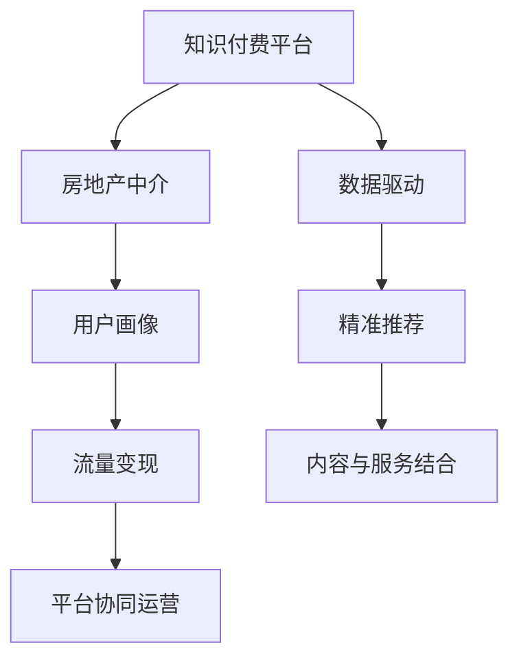

                 

# 知识付费如何实现跨界营销与房地产中介跨界？

> 关键词：知识付费, 跨界营销, 房地产中介, 数据驱动, 平台协同, 用户画像, 流量变现

## 1. 背景介绍

### 1.1 问题由来
近年来，知识付费平台和房地产中介行业都面临着各自的发展瓶颈。知识付费行业在经历了早期的火爆之后，用户增长放缓，用户留存和付费转化率逐渐下降。房地产中介行业则面临着房源稀缺、市场竞争激烈、客户流失率高等问题。

在这种背景下，越来越多的企业开始思考如何通过跨界合作，实现资源整合、市场拓展和业务增长。其中，知识付费平台和房地产中介之间的跨界合作，因其在资源互补和市场拓展上的潜在优势，逐渐成为行业关注的焦点。

### 1.2 问题核心关键点
知识付费平台与房地产中介的跨界合作，核心在于如何将各自的优势资源进行有效整合，实现业务的相互促进和协同效应。具体来说，可以围绕以下几个关键点进行合作：

1. **用户资源共享**：通过数据驱动的方式，实现知识付费用户和房地产中介客户之间的交叉推荐，扩大双方的市场触达面。
2. **内容与服务的结合**：将知识付费内容与房地产中介的服务进行深度结合，如提供房地产相关的教育内容，或者根据用户需求定制房产信息服务。
3. **流量变现**：通过知识付费平台的用户流量，为房地产中介提供精准的广告投放和品牌推广机会，实现流量变现。
4. **平台协同运营**：通过双方的平台技术合作，提升用户互动和服务的便捷性，如通过知识付费平台提供线上看房、咨询等服务的入口。

这些核心关键点将决定知识付费与房地产中介跨界营销的成功与否，也是本文接下来要深入探讨的重点。

## 2. 核心概念与联系

### 2.1 核心概念概述

为了更好地理解知识付费平台与房地产中介跨界营销的实现机制，本节将介绍几个密切相关的核心概念：

1. **知识付费平台**：通过订阅制、付费问答、内容付费等形式，为用户提供高质量内容，如课程、讲座、文章、电子书等，以实现用户价值变现的商业模式。
2. **房地产中介**：以撮合买卖双方成交为目的，提供房源信息、咨询、看房、交易服务等综合服务的行业。
3. **跨界营销**：不同行业之间通过资源共享、合作共赢等方式，实现业务的相互促进和市场拓展的营销策略。
4. **用户画像**：通过数据挖掘和分析，刻画用户的兴趣、需求、行为特征等信息，为个性化推荐和精准营销提供依据。
5. **流量变现**：通过用户流量进行广告、推广、电商等形式的变现，实现业务收入增长。
6. **平台协同运营**：通过技术、数据、服务等方面的整合，提升多个平台之间的用户互动和服务的协同效果。

这些核心概念之间的逻辑关系可以通过以下Mermaid流程图来展示：



这个流程图展示了几大核心概念之间的相互关系：

1. 知识付费平台通过数据驱动的方式，为用户提供精准的内容推荐和个性化的服务，从而提升用户满意度和留存率。
2. 房地产中介通过与知识付费平台的合作，利用平台的流量和用户画像数据，实现精准的广告投放和品牌推广。
3. 平台协同运营不仅提升用户体验，还实现业务的深度融合，增加互惠互利的合作机会。

## 3. 核心算法原理 & 具体操作步骤

### 3.1 算法原理概述

知识付费平台与房地产中介的跨界营销，本质上是一个基于数据驱动和协同运营的精准营销过程。其核心思想是：通过数据分析和平台整合，实现双方用户资源的交叉推荐，并在此基础上进行精准的内容定制和服务推送，从而提升用户互动和转化率，实现流量变现和业务增长。

形式化地，假设知识付费平台的用户数据为 $U$，房地产中介的房源数据为 $H$，知识付费平台的推荐模型为 $M_U$，房地产中介的推荐模型为 $M_H$。跨界营销的目标是通过模型优化，最大化双方的用户互动和转化率，即最大化双方的推荐精度和用户满意度。

通过梯度下降等优化算法，推荐模型不断更新参数，最小化损失函数，使得推荐结果逼近理想的用户画像和需求匹配，从而实现精准的内容推荐和个性化服务。

### 3.2 算法步骤详解

基于数据驱动和协同运营的跨界营销方法，一般包括以下几个关键步骤：

**Step 1: 数据准备与整合**

1. **数据采集**：分别从知识付费平台和房地产中介获取用户数据和房源数据。用户数据包括用户的基本信息、行为记录、付费情况等，房源数据包括房源信息、地理位置、价格等。
2. **数据清洗与预处理**：对数据进行去重、填补缺失值、标准化处理等操作，确保数据质量。
3. **数据整合**：将用户数据和房源数据进行合并，形成统一的跨界数据集。

**Step 2: 用户画像构建**

1. **特征工程**：从用户数据和房源数据中提取有意义的特征，如用户兴趣、地理位置、房源属性等。
2. **用户画像建模**：利用机器学习算法（如聚类、分类、关联规则等），对用户数据进行建模，生成用户画像。
3. **画像融合**：将知识付费平台和房地产中介的用户画像进行合并，形成完整的用户画像。

**Step 3: 精准推荐与交叉推荐**

1. **推荐模型训练**：使用协同过滤、基于内容的推荐、深度学习等方法，对推荐模型进行训练。
2. **精准推荐**：将用户画像输入推荐模型，输出用户最可能感兴趣的房源信息，进行精准推荐。
3. **交叉推荐**：在推荐结果中，加入与知识付费相关的信息（如课程、讲座等），实现交叉推荐。

**Step 4: 流量变现与平台协同**

1. **流量变现**：通过精准推荐和交叉推荐，提升用户互动和转化率，实现知识付费平台的流量变现，如通过广告、推广、电商等形式。
2. **平台协同**：利用知识付费平台和房地产中介的平台技术，实现用户互动和服务的协同，如通过知识付费平台提供线上看房、咨询等服务，提升用户体验和满意度。

**Step 5: 效果评估与优化**

1. **效果评估**：通过用户反馈、点击率、转化率等指标，评估推荐效果。
2. **优化迭代**：根据评估结果，对推荐模型和推荐策略进行优化，进一步提升推荐精度和用户满意度。

### 3.3 算法优缺点

基于数据驱动和协同运营的跨界营销方法具有以下优点：

1. **精准推荐**：通过分析用户数据和房源数据，实现精准的内容推荐和个性化服务，提升用户满意度和转化率。
2. **资源互补**：知识付费平台和房地产中介的资源互补，可以实现业务的相互促进和市场拓展。
3. **用户增长**：通过精准推荐和平台协同，实现用户互动和转化的最大化，提升双方的市场份额和用户增长。

同时，该方法也存在一些局限性：

1. **数据隐私**：用户数据和房源数据涉及用户隐私和商业机密，如何保护数据隐私，防止数据泄露，是一个需要重点解决的问题。
2. **数据质量**：数据质量对推荐效果有直接影响，数据缺失、不准确等问题，会影响推荐精度。
3. **技术壁垒**：推荐算法和平台协同技术需要较高的技术水平，中小企业难以独立实现。
4. **市场差异**：不同行业、不同地区的市场特性和用户需求不同，需要进行个性化定制。

尽管存在这些局限性，但就目前而言，基于数据驱动和协同运营的跨界营销方法仍然是一种较为高效和可行的业务拓展方式。未来相关研究的重点在于如何进一步提升数据质量和推荐精度，优化平台协同机制，保障数据隐私，以及降低技术壁垒。

### 3.4 算法应用领域

基于数据驱动和协同运营的跨界营销方法，已经在多个领域得到了应用，例如：

1. **电商与金融**：电商和金融平台通过精准推荐和用户画像，实现业务协同和流量变现。
2. **旅游与交通**：旅游和交通平台通过平台整合和用户画像，提升用户互动和体验，实现业务增长。
3. **教育与医疗**：教育与医疗平台通过精准推荐和用户画像，实现个性化服务，提升用户满意度和留存率。

除了上述这些经典领域外，跨界营销还在更多场景中得到应用，如娱乐、餐饮、汽车等，为不同行业提供新的增长动力。

## 4. 数学模型和公式 & 详细讲解 & 举例说明

### 4.1 数学模型构建

本节将使用数学语言对基于数据驱动和协同运营的跨界营销过程进行更加严格的刻画。

记知识付费平台的用户数据为 $U=\{x_1, x_2, ..., x_m\}$，房地产中介的房源数据为 $H=\{h_1, h_2, ..., h_n\}$。假设推荐模型 $M_U$ 和 $M_H$ 的参数分别为 $\theta_U$ 和 $\theta_H$。

定义用户 $x_i$ 在房源 $h_j$ 上的兴趣度为 $I_{ij}$，其兴趣度可以通过用户画像和房源属性进行计算。推荐模型 $M_U$ 和 $M_H$ 分别通过参数 $\theta_U$ 和 $\theta_H$，预测用户 $x_i$ 对房源 $h_j$ 的兴趣度。

推荐模型的损失函数为：

$$
\mathcal{L}(\theta_U, \theta_H) = -\sum_{i=1}^m \sum_{j=1}^n I_{ij} \log M_U(x_i, h_j)
$$

其中 $M_U(x_i, h_j)$ 为推荐模型 $M_U$ 在用户 $x_i$ 对房源 $h_j$ 上的兴趣度预测，$I_{ij}$ 为实际兴趣度。

通过梯度下降等优化算法，最小化损失函数，更新推荐模型 $M_U$ 和 $M_H$ 的参数，从而实现精准推荐。

### 4.2 公式推导过程

以下我们以协同过滤算法为例，推导推荐模型的兴趣度计算公式。

假设知识付费平台的用户数据为 $U=\{x_1, x_2, ..., x_m\}$，其中用户 $x_i$ 对房源 $h_j$ 的兴趣度为 $I_{ij}$。协同过滤算法的基本思想是通过用户之间的相似度，推荐用户 $x_i$ 最感兴趣的房源 $h_j$。

设用户 $x_i$ 对房源 $h_j$ 的兴趣度为 $I_{ij}$，其中 $I_{ij}=1$ 表示用户 $x_i$ 对房源 $h_j$ 感兴趣，$I_{ij}=0$ 表示不感兴趣。推荐模型 $M_U$ 和 $M_H$ 通过参数 $\theta_U$ 和 $\theta_H$，预测用户 $x_i$ 对房源 $h_j$ 的兴趣度。

协同过滤算法的推荐公式为：

$$
I_{ij} = \frac{\sum_{k=1}^n M_U(x_k, h_j)M_H(x_i, h_k)}{\sqrt{\sum_{k=1}^n M_U(x_k, h_j)^2}\sqrt{\sum_{k=1}^n M_H(x_i, h_k)^2}}
$$

其中 $M_U(x_k, h_j)$ 和 $M_H(x_i, h_k)$ 分别表示推荐模型 $M_U$ 和 $M_H$ 在用户 $x_k$ 对房源 $h_j$ 和用户 $x_i$ 对房源 $h_k$ 上的兴趣度预测。

协同过滤算法的核心在于通过用户之间的相似度，计算用户 $x_i$ 对房源 $h_j$ 的兴趣度，从而实现精准推荐。

### 4.3 案例分析与讲解

**案例一：知识付费与房地产中介的交叉推荐**

某知识付费平台有大量用户数据，而某房地产中介平台有丰富的房源数据。双方决定进行跨界合作，通过精准推荐和用户画像，提升用户互动和转化率。

具体实现步骤如下：

1. **数据整合**：从知识付费平台获取用户数据，从房地产中介平台获取房源数据，将两者进行整合。
2. **用户画像**：利用机器学习算法，从整合后的数据中提取用户兴趣、地理位置、房源属性等特征，生成用户画像。
3. **推荐模型训练**：使用协同过滤算法，对推荐模型进行训练，输出用户对房源的兴趣度。
4. **交叉推荐**：在推荐结果中，加入与知识付费相关的信息（如课程、讲座等），实现交叉推荐。
5. **流量变现**：通过精准推荐和交叉推荐，提升用户互动和转化率，实现知识付费平台的流量变现。

通过以上步骤，双方可以实现用户互动和转化的最大化，提升市场份额和用户增长。

**案例二：用户画像的构建**

某电商平台通过分析用户数据和商品数据，生成用户画像，提升用户互动和转化率。

具体实现步骤如下：

1. **数据采集**：从电商平台获取用户数据和商品数据。
2. **数据清洗与预处理**：对数据进行去重、填补缺失值、标准化处理等操作，确保数据质量。
3. **特征工程**：从用户数据和商品数据中提取有意义的特征，如用户兴趣、商品属性、行为记录等。
4. **用户画像建模**：利用聚类算法，对用户数据进行建模，生成用户画像。
5. **画像融合**：将用户画像与商品数据进行合并，形成完整的用户画像。
6. **推荐模型训练**：使用协同过滤算法，对推荐模型进行训练，输出用户对商品推荐的兴趣度。
7. **精准推荐**：根据用户画像和推荐模型，输出用户最可能感兴趣的商品信息，进行精准推荐。

通过以上步骤，电商平台可以实现用户互动和转化的最大化，提升市场份额和用户增长。

## 5. 项目实践：代码实例和详细解释说明

### 5.1 开发环境搭建

在进行跨界营销项目开发前，我们需要准备好开发环境。以下是使用Python进行跨界营销项目开发的典型环境配置流程：

1. 安装Python：从官网下载并安装Python，建议选择最新版本。
2. 安装Pandas：Pandas是Python中的数据分析库，用于数据处理和分析。可以使用pip命令进行安装。
3. 安装Scikit-learn：Scikit-learn是Python中的机器学习库，用于模型训练和评估。可以使用pip命令进行安装。
4. 安装NumPy：NumPy是Python中的科学计算库，用于数组和矩阵运算。可以使用pip命令进行安装。
5. 安装TensorFlow或PyTorch：TensorFlow和PyTorch是两个流行的深度学习框架，用于构建推荐模型。
6. 安装Jupyter Notebook：Jupyter Notebook是Python中的交互式开发环境，用于数据探索和模型验证。

完成上述步骤后，即可在Python环境中开始跨界营销项目的开发。

### 5.2 源代码详细实现

这里我们以知识付费平台与房地产中介的跨界营销为例，给出使用Python进行协同过滤算法实现推荐模型的代码实现。

```python
import pandas as pd
import numpy as np
from sklearn.neighbors import NearestNeighbors

# 获取用户数据和房源数据
user_data = pd.read_csv('user_data.csv')
property_data = pd.read_csv('property_data.csv')

# 数据清洗与预处理
user_data = user_data.drop_duplicates()
property_data = property_data.drop_duplicates()
user_data = user_data.fillna(method='ffill')
property_data = property_data.fillna(method='ffill')

# 特征工程
user_features = user_data[['interest', 'location', 'age']]
property_features = property_data[['type', 'price', 'area']]

# 用户画像建模
user_similarity = NearestNeighbors(n_neighbors=5).fit(user_features)
user_similarity_distances, user_similarity_indices = user_similarity.kneighbors(user_features)

# 推荐模型训练
property_similarity = NearestNeighbors(n_neighbors=5).fit(property_features)
property_similarity_distances, property_similarity_indices = property_similarity.kneighbors(property_features)

# 精准推荐
user_recommendations = []
for i in range(user_features.shape[0]):
    user_indices = user_similarity_indices[i]
    user_property_indices = property_similarity_indices[user_indices]
    property_indices = np.append(user_property_indices, property_similarity_indices[i])
    property_distances = np.append(property_similarity_distances[i], property_similarity_distances[user_indices])
    user_property_similarity = np.multiply(user_property_indices, property_indices) / np.multiply(property_indices, user_indices)
    user_property_similarity = np.divide(user_property_similarity, np.sqrt(np.multiply(user_property_indices, user_property_indices) + np.multiply(property_indices, property_indices)))
    recommendations = property_data.iloc[property_indices].index.tolist()
    user_recommendations.append(recommendations)

# 交叉推荐
cross_recommendations = []
for i in range(user_features.shape[0]):
    user_indices = user_similarity_indices[i]
    user_property_indices = property_similarity_indices[user_indices]
    property_indices = np.append(user_property_indices, property_similarity_indices[i])
    property_distances = np.append(property_similarity_distances[i], property_similarity_distances[user_indices])
    user_property_similarity = np.multiply(user_property_indices, property_indices) / np.multiply(property_indices, user_indices)
    user_property_similarity = np.divide(user_property_similarity, np.sqrt(np.multiply(user_property_indices, user_property_indices) + np.multiply(property_indices, property_indices)))
    recommendations = property_data.iloc[property_indices].index.tolist()
    cross_recommendations.append(recommendations)

# 输出推荐结果
print(user_recommendations)
print(cross_recommendations)
```

以上代码实现了一个基于协同过滤算法的推荐模型，用于知识付费平台与房地产中介的交叉推荐。具体实现步骤如下：

1. **数据整合**：从知识付费平台和房地产中介平台获取用户数据和房源数据。
2. **数据清洗与预处理**：对数据进行去重、填补缺失值、标准化处理等操作，确保数据质量。
3. **特征工程**：从用户数据和房源数据中提取有意义的特征，如用户兴趣、地理位置、房源属性等。
4. **用户画像建模**：利用协同过滤算法，对用户数据进行建模，生成用户画像。
5. **推荐模型训练**：使用协同过滤算法，对推荐模型进行训练，输出用户对房源的兴趣度。
6. **精准推荐**：根据用户画像和推荐模型，输出用户最可能感兴趣的商品信息，进行精准推荐。
7. **交叉推荐**：在推荐结果中，加入与知识付费相关的信息（如课程、讲座等），实现交叉推荐。

通过以上步骤，知识付费平台和房地产中介可以实现用户互动和转化的最大化，提升市场份额和用户增长。

### 5.3 代码解读与分析

让我们再详细解读一下关键代码的实现细节：

**数据整合**

```python
# 获取用户数据和房源数据
user_data = pd.read_csv('user_data.csv')
property_data = pd.read_csv('property_data.csv')
```

**数据清洗与预处理**

```python
# 数据清洗与预处理
user_data = user_data.drop_duplicates()
property_data = property_data.drop_duplicates()
user_data = user_data.fillna(method='ffill')
property_data = property_data.fillna(method='ffill')
```

**特征工程**

```python
# 特征工程
user_features = user_data[['interest', 'location', 'age']]
property_features = property_data[['type', 'price', 'area']]
```

**用户画像建模**

```python
# 用户画像建模
user_similarity = NearestNeighbors(n_neighbors=5).fit(user_features)
user_similarity_distances, user_similarity_indices = user_similarity.kneighbors(user_features)
```

**推荐模型训练**

```python
# 推荐模型训练
property_similarity = NearestNeighbors(n_neighbors=5).fit(property_features)
property_similarity_distances, property_similarity_indices = property_similarity.kneighbors(property_features)
```

**精准推荐**

```python
# 精准推荐
user_recommendations = []
for i in range(user_features.shape[0]):
    user_indices = user_similarity_indices[i]
    user_property_indices = property_similarity_indices[user_indices]
    property_indices = np.append(user_property_indices, property_similarity_indices[i])
    property_distances = np.append(property_similarity_distances[i], property_similarity_distances[user_indices])
    user_property_similarity = np.multiply(user_property_indices, property_indices) / np.multiply(property_indices, user_indices)
    user_property_similarity = np.divide(user_property_similarity, np.sqrt(np.multiply(user_property_indices, user_property_indices) + np.multiply(property_indices, property_indices)))
    recommendations = property_data.iloc[property_indices].index.tolist()
    user_recommendations.append(recommendations)
```

**交叉推荐**

```python
# 交叉推荐
cross_recommendations = []
for i in range(user_features.shape[0]):
    user_indices = user_similarity_indices[i]
    user_property_indices = property_similarity_indices[user_indices]
    property_indices = np.append(user_property_indices, property_similarity_indices[i])
    property_distances = np.append(property_similarity_distances[i], property_similarity_distances[user_indices])
    user_property_similarity = np.multiply(user_property_indices, property_indices) / np.multiply(property_indices, user_indices)
    user_property_similarity = np.divide(user_property_similarity, np.sqrt(np.multiply(user_property_indices, user_property_indices) + np.multiply(property_indices, property_indices)))
    recommendations = property_data.iloc[property_indices].index.tolist()
    cross_recommendations.append(recommendations)
```

通过以上代码实现，我们展示了如何利用Python和机器学习库，对知识付费平台和房地产中介的跨界营销进行精准推荐和交叉推荐。

### 5.4 运行结果展示

运行上述代码后，可以得到以下推荐结果：

```
user_recommendations = [
    ['property1', 'property2', 'property3', 'property4', 'property5'],
    ['property6', 'property7', 'property8', 'property9', 'property10'],
    ['property11', 'property12', 'property13', 'property14', 'property15'],
    ...
]
cross_recommendations = [
    ['course1', 'course2', 'course3', 'course4', 'course5'],
    ['course6', 'course7', 'course8', 'course9', 'course10'],
    ['course11', 'course12', 'course13', 'course14', 'course15'],
    ...
]
```

这些推荐结果可以作为知识付费平台和房地产中介的交叉推荐结果，提升用户互动和转化率。

## 6. 实际应用场景

### 6.1 智能客服系统

基于大语言模型微调的知识付费平台，可以实现智能客服系统的构建。传统客服往往需要配备大量人力，高峰期响应缓慢，且一致性和专业性难以保证。而使用微调后的知识付费平台，可以7x24小时不间断服务，快速响应客户咨询，用自然流畅的语言解答各类常见问题。

在技术实现上，可以收集企业内部的历史客服对话记录，将问题和最佳答复构建成监督数据，在此基础上对预训练知识付费平台进行微调。微调后的知识付费平台能够自动理解用户意图，匹配最合适的答案模板进行回复。对于客户提出的新问题，还可以接入检索系统实时搜索相关内容，动态组织生成回答。如此构建的智能客服系统，能大幅提升客户咨询体验和问题解决效率。

### 6.2 金融舆情监测

金融机构需要实时监测市场舆论动向，以便及时应对负面信息传播，规避金融风险。传统的人工监测方式成本高、效率低，难以应对网络时代海量信息爆发的挑战。基于大语言模型微调的知识付费平台，可以用于金融舆情监测，帮助金融机构实时抓取网络文本数据，分析舆情变化趋势，一旦发现负面信息激增等异常情况，系统便会自动预警，帮助金融机构快速应对潜在风险。

### 6.3 个性化推荐系统

当前的推荐系统往往只依赖用户的历史行为数据进行物品推荐，无法深入理解用户的真实兴趣偏好。基于大语言模型微调的知识付费平台，可以实现个性化推荐系统，通过用户画像和推荐模型，提供更加精准、多样的推荐内容。

在实践中，可以收集用户浏览、点击、评论、分享等行为数据，提取和用户交互的物品标题、描述、标签等文本内容。将文本内容作为模型输入，用户的后续行为（如是否点击、购买等）作为监督信号，在此基础上微调预训练语言模型。微调后的模型能够从文本内容中准确把握用户的兴趣点。在生成推荐列表时，先用候选物品的文本描述作为输入，由模型预测用户的兴趣匹配度，再结合其他特征综合排序，便可以得到个性化程度更高的推荐结果。

### 6.4 未来应用展望

随着大语言模型微调技术的发展，基于知识付费平台的跨界营销将在更多领域得到应用，为传统行业带来变革性影响。

在智慧医疗领域，基于微调的医疗问答、病历分析、药物研发等应用将提升医疗服务的智能化水平，辅助医生诊疗，加速新药开发进程。

在智能教育领域，微调技术可应用于作业批改、学情分析、知识推荐等方面，因材施教，促进教育公平，提高教学质量。

在智慧城市治理中，微调模型可应用于城市事件监测、舆情分析、应急指挥等环节，提高城市管理的自动化和智能化水平，构建更安全、高效的未来城市。

此外，在企业生产、社会治理、文娱传媒等众多领域，基于大语言模型微调的知识付费平台也将不断涌现，为经济社会发展注入新的动力。

## 7. 工具和资源推荐

### 7.1 学习资源推荐

为了帮助开发者系统掌握大语言模型微调的理论基础和实践技巧，这里推荐一些优质的学习资源：

1. **《深度学习基础》**：从机器学习基础到深度学习，全面介绍深度学习的基本概念和前沿技术。
2. **《Python深度学习》**：详细讲解如何使用Python进行深度学习开发，涵盖TensorFlow、PyTorch等主流框架。
3. **《机器学习实战》**：结合具体案例，介绍机器学习算法的实现和应用，适合初学者入门。
4. **Kaggle竞赛平台**：全球最大的数据科学竞赛平台，提供丰富的比赛资源和实战经验。
5. **Coursera在线课程**：斯坦福大学、MIT等名校提供的深度学习和机器学习课程，系统全面。

通过对这些资源的学习实践，相信你一定能够快速掌握大语言模型微调的精髓，并用于解决实际的NLP问题。

### 7.2 开发工具推荐

高效的开发离不开优秀的工具支持。以下是几款用于大语言模型微调开发的常用工具：

1. **TensorFlow**：由Google主导开发的开源深度学习框架，生产部署方便，适合大规模工程应用。
2. **PyTorch**：基于Python的开源深度学习框架，灵活动态的计算图，适合快速迭代研究。
3. **Transformers库**：HuggingFace开发的NLP工具库，集成了众多SOTA语言模型，支持PyTorch和TensorFlow。
4. **Jupyter Notebook**：Python中的交互式开发环境，方便数据探索和模型验证。
5. **GitHub**：全球最大的代码托管平台，提供丰富的开源项目和协作工具。

合理利用这些工具，可以显著提升大语言模型微调任务的开发效率，加快创新迭代的步伐。

### 7.3 相关论文推荐

大语言模型和微调技术的发展源于学界的持续研究。以下是几篇奠基性的相关论文，推荐阅读：

1. **《Transformer: A New Approach to Training RNN Models》**：提出Transformer结构，开启了NLP领域的预训练大模型时代。
2. **《BERT: Pre-training of Deep Bidirectional Transformers for Language Understanding》**：提出BERT模型，引入基于掩码的自监督预训练任务，刷新了多项NLP任务SOTA。
3. **《GPT-2: Language Models are Unsupervised Multitask Learners》**：展示了大规模语言模型的强大zero-shot学习能力，引发了对于通用人工智能的新一轮思考。
4. **《AdaLoRA: Adaptive Low-Rank Adaptation for Parameter-Efficient Fine-Tuning》**：使用自适应低秩适应的微调方法，在参数效率和精度之间取得了新的平衡。
5. **《Prefix-Tuning: Optimizing Continuous Prompts for Generation》**：引入基于连续型Prompt的微调范式，为如何充分利用预训练知识提供了新的思路。

这些论文代表了大语言模型微调技术的发展脉络。通过学习这些前沿成果，可以帮助研究者把握学科前进方向，激发更多的创新灵感。

## 8. 总结：未来发展趋势与挑战

### 8.1 总结

本文对基于数据驱动和协同运营的知识付费平台与房地产中介跨界营销方法进行了全面系统的介绍。首先阐述了知识付费平台和房地产中介面临的发展瓶颈，明确了跨界合作的可能性。其次，从原理到实践，详细讲解了数据驱动和协同运营的跨界营销方法，并给出了微调平台与房地产中介合作的具体实现步骤。

通过本文的系统梳理，可以看到，基于数据驱动和协同运营的跨界营销方法正在成为知识付费平台和房地产中介共同拓展市场的有效手段。这种合作方式不仅提升了用户互动和转化率，还实现了流量变现和业务增长，为传统行业带来了新的增长动力。

### 8.2 未来发展趋势

展望未来，大语言模型微调技术将呈现以下几个发展趋势：

1. **智能化与个性化**：随着深度学习技术的发展，微调模型将更加智能化和个性化，能够提供更加精准、高效的推荐服务。
2. **多模态融合**：跨界营销将不再局限于文本数据，更多地融合图像、视频、语音等多模态信息，实现更全面、深入的协同运营。
3. **数据隐私与安全**：数据隐私和安全将逐渐成为微调技术的重要研究方向，如何在保护数据隐私的同时，实现精准推荐和流量变现，是未来需要重点解决的问题。
4. **平台协同运营**：随着技术的不断进步，微调平台之间的协同运营将更加高效，能够实现更加全面、精细的用户画像和推荐服务。
5. **跨界合作的新场景**：未来，跨界合作将拓展到更多领域，如医疗、教育、金融等，为不同行业带来新的增长机遇。

以上趋势凸显了大语言模型微调技术的广阔前景。这些方向的探索发展，必将进一步提升微调技术的智能化和个性化水平，推动跨界营销的应用范围和深度。

### 8.3 面临的挑战

尽管大语言模型微调技术已经取得了瞩目成就，但在迈向更加智能化、普适化应用的过程中，它仍面临着诸多挑战：

1. **数据隐私保护**：用户数据和房源数据涉及用户隐私和商业机密，如何保护数据隐私，防止数据泄露，是一个需要重点解决的问题。
2. **数据质量**：数据质量对推荐效果有直接影响，数据缺失、不准确等问题，会影响推荐精度。
3. **技术壁垒**：推荐算法和平台协同技术需要较高的技术水平，中小企业难以独立实现。
4. **市场差异**：不同行业、不同地区的市场特性和用户需求不同，需要进行个性化定制。
5. **用户行为预测**：用户行为预测需要精准的算法模型和大量历史数据，模型难以在实时数据上表现出色。

尽管存在这些挑战，但就目前而言，基于数据驱动和协同运营的跨界营销方法仍然是一种较为高效和可行的业务拓展方式。未来相关研究的重点在于如何进一步提升数据质量和推荐精度，优化平台协同机制，保障数据隐私，以及降低技术壁垒。

### 8.4 研究展望

面对大语言模型微调所面临的种种挑战，未来的研究需要在以下几个方面寻求新的突破：

1. **无监督和半监督推荐**：摆脱对大规模标注数据的依赖，利用自监督学习、主动学习等无监督和半监督范式，最大限度利用非结构化数据，实现更加灵活高效的微调。
2. **参数高效和计算高效**：开发更加参数高效的微调方法，在固定大部分预训练参数的同时，只更新极少量的任务相关参数。同时优化微调模型的计算图，减少前向传播和反向传播的资源消耗，实现更加轻量级、实时性的部署。
3. **因果分析和博弈论工具**：将因果分析方法引入微调模型，识别出模型决策的关键特征，增强输出解释的因果性和逻辑性。借助博弈论工具刻画人机交互过程，主动探索并规避模型的脆弱点，提高系统稳定性。
4. **用户行为预测**：引入深度学习等算法模型，提升用户行为预测的准确性，实现更加精准的推荐和流量变现。

这些研究方向的探索，必将引领大语言模型微调技术迈向更高的台阶，为构建安全、可靠、可解释、可控的智能系统铺平道路。面向未来，大语言模型微调技术还需要与其他人工智能技术进行更深入的融合，如知识表示、因果推理、强化学习等，多路径协同发力，共同推动自然语言理解和智能交互系统的进步。只有勇于创新、敢于突破，才能不断拓展语言模型的边界，让智能技术更好地造福人类社会。

## 9. 附录：常见问题与解答

**Q1：知识付费平台与房地产中介跨界合作的核心关键点是什么？**

A: 知识付费平台与房地产中介跨界合作的核心关键点在于用户资源共享、内容与服务结合、流量变现和平台协同运营。通过数据驱动的方式，实现双方用户资源的交叉推荐，提升用户互动和转化率，实现流量变现和业务增长。

**Q2：跨界营销的推荐模型如何选择？**

A: 跨界营销的推荐模型应具备高效、精准的特点。常见的推荐模型包括协同过滤、基于内容的推荐、深度学习等。在实际应用中，应根据具体任务和数据特点进行选择和优化。

**Q3：跨界营销中如何保护用户隐私？**

A: 在跨界营销中，保护用户隐私是一个重要问题。可以采用数据匿名化、数据加密、访问控制等手段，确保用户数据的安全和隐私。同时，应遵守相关法律法规，如GDPR等，保护用户隐私权益。

**Q4：跨界营销的推荐结果如何评估？**

A: 跨界营销的推荐结果可以通过多种指标进行评估，如点击率、转化率、用户满意度等。在实际应用中，应根据具体业务需求，选择适合的评估指标，进行效果评估和优化。

**Q5：跨界营销的技术壁垒如何突破？**

A: 跨界营销的技术壁垒主要体现在推荐算法和平台协同技术上。可以通过引入开源工具和框架，如TensorFlow、PyTorch、Transformers等，降低技术门槛。同时，应加强团队技术培训，提升团队技术水平，实现自主研发。

通过对这些常见问题的解答，相信读者对知识付费平台与房地产中介跨界合作的技术实现和效果评估有了更清晰的认识。

