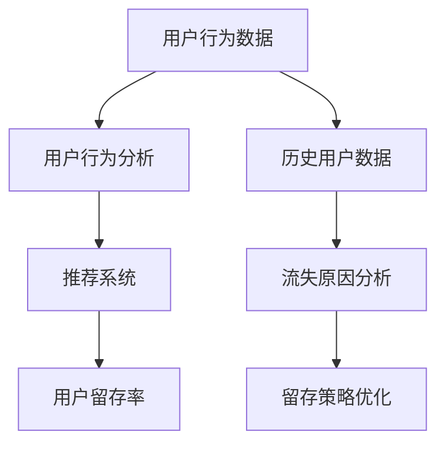

                 

# 知识付费平台的用户留存分析

在互联网的快速发展和数字内容的爆炸式增长背景下，知识付费平台如雨后春笋般涌现。这些平台通过整合海量知识资源，提供专业、定制化的学习内容，极大地满足了用户对深度学习和知识获取的需求。然而，用户留存问题一直困扰着这些平台，直接关系到其业务模式的可持续性和商业价值。本文将深入探讨知识付费平台的用户留存问题，提出一套基于机器学习的用户留存分析框架，并详细阐述算法原理和操作步骤，为平台运营商提供参考。

## 1. 背景介绍

### 1.1 问题由来

知识付费平台用户留存问题，主要源于以下几个方面：

- **内容质量不均**：知识付费平台内容丰富，但内容质量参差不齐，导致部分用户流失。
- **用户体验不足**：部分平台功能设计不够人性化，操作复杂，影响用户黏性。
- **个性化推荐不精准**：用户的个性化学习需求未得到有效满足，导致内容不匹配，用户流失。
- **价格因素**：部分平台的付费门槛过高，缺乏灵活性，导致用户流失。

### 1.2 问题核心关键点

为了解决用户留存问题，平台运营商需要深入理解用户行为，挖掘留存关键因素，采取有针对性的运营策略。具体问题核心关键点包括：

- **用户行为分析**：通过数据分析，掌握用户行为模式和偏好。
- **用户流失原因**：分析用户流失的根本原因，制定针对性改善措施。
- **留存策略优化**：结合用户行为特征，设计个性化运营策略，提升用户留存率。

## 2. 核心概念与联系

### 2.1 核心概念概述

本文涉及的核心概念包括：

- **用户留存率**：指在一定时间内继续使用平台的用户比例，是衡量平台黏性的重要指标。
- **用户行为分析**：通过分析用户在平台上的操作行为，了解其需求和偏好。
- **推荐系统**：根据用户行为和兴趣，向用户推荐相关内容，提升用户体验。
- **预测模型**：基于历史数据，建立预测模型，预测用户流失风险，并采取相应措施。

这些概念通过以下Mermaid流程图建立联系：



## 3. 核心算法原理 & 具体操作步骤

### 3.1 算法原理概述

基于机器学习的方法，通过对历史用户数据进行分析，建立预测模型，预测用户的流失概率。模型主要分为两个部分：

1. **用户行为特征提取**：从用户行为数据中提取特征，包括用户活跃度、付费行为、内容消费习惯等。
2. **流失概率预测**：建立分类模型，根据用户行为特征预测用户流失概率。

### 3.2 算法步骤详解

#### 3.2.1 数据收集与预处理

1. **数据收集**：从知识付费平台获取用户行为数据，包括登录时间、内容消费记录、付费行为、注册时间等。
2. **数据清洗**：去除缺失值和异常值，处理重复数据，确保数据质量。
3. **特征工程**：选择对用户留存有影响的特征，并进行归一化、编码等处理。

#### 3.2.2 模型选择与训练

1. **模型选择**：选择适合分类任务的模型，如逻辑回归、决策树、随机森林、梯度提升树等。
2. **模型训练**：使用训练集数据训练模型，并通过交叉验证选择最佳模型参数。
3. **模型评估**：使用测试集数据评估模型性能，选择合适的评估指标如准确率、召回率、F1分数等。

#### 3.2.3 模型部署与预测

1. **模型部署**：将训练好的模型部署到生产环境，供实际预测使用。
2. **用户流失预测**：对新用户行为数据进行预测，判断其流失风险，并及时采取留存措施。
3. **策略调整**：根据预测结果，调整推荐策略和运营策略，提升用户留存率。

### 3.3 算法优缺点

#### 3.3.1 优点

1. **模型灵活**：基于机器学习的预测模型可以根据数据变化进行灵活调整。
2. **预测准确**：通过大量历史数据训练模型，预测用户流失概率具有较高的准确性。
3. **实时性**：模型可以实时处理新数据，及时预测用户流失风险。

#### 3.3.2 缺点

1. **数据依赖**：模型依赖于历史数据，对新用户或数据变化较大的情况，预测效果可能受限。
2. **过拟合风险**：模型在训练过程中可能过拟合，降低预测效果。
3. **计算资源需求**：模型训练和部署需要一定的计算资源，成本较高。

### 3.4 算法应用领域

该算法在知识付费平台的用户留存分析中有着广泛的应用，包括：

1. **流失用户预警**：对流失风险较高的用户进行预警，及时采取留存措施。
2. **个性化推荐优化**：根据用户行为特征，优化推荐策略，提升用户体验。
3. **运营策略调整**：基于预测结果，调整营销策略、价格策略等，提升用户留存率。
4. **产品改进**：根据用户行为分析，改进平台功能，提升用户满意度。

## 4. 数学模型和公式 & 详细讲解

### 4.1 数学模型构建

我们采用逻辑回归模型进行用户流失预测。逻辑回归模型可以表示为：

$$
P(y|x) = \frac{1}{1 + \exp(-\theta^T x)}
$$

其中 $x$ 为输入特征向量，$y$ 为目标变量，$\theta$ 为模型参数。

### 4.2 公式推导过程

逻辑回归模型的损失函数为：

$$
\mathcal{L}(\theta) = -\frac{1}{N}\sum_{i=1}^N [y_i\log P(y_i|x_i) + (1-y_i)\log (1-P(y_i|x_i))]
$$

其中 $N$ 为样本数量，$y_i$ 为样本的真实标签。

使用梯度下降法更新模型参数 $\theta$：

$$
\theta \leftarrow \theta - \eta \nabla_{\theta}\mathcal{L}(\theta)
$$

其中 $\eta$ 为学习率。

### 4.3 案例分析与讲解

我们以某知识付费平台的数据为例，分析其用户流失问题。假设平台的标签为 0（未流失）和 1（流失），特征包括用户活跃度 $A$、内容消费量 $C$、付费频率 $P$。训练集数据为 $(x_1, y_1), (x_2, y_2), \dots, (x_N, y_N)$。通过逻辑回归模型训练，得到参数 $\theta$，即可对新用户行为数据进行预测。

假设新用户行为数据为 $x'$，则预测结果为：

$$
P(y'|x') = \frac{1}{1 + \exp(-\theta^T x')}
$$

根据预测结果，判断用户流失风险，并采取相应措施。

## 5. 项目实践：代码实例和详细解释说明

### 5.1 开发环境搭建

1. **Python环境**：安装Python 3.8，创建虚拟环境。
2. **数据收集**：从知识付费平台获取用户行为数据，存储在本地。
3. **工具安装**：安装Pandas、Scikit-learn、TensorFlow等数据处理和机器学习工具。

### 5.2 源代码详细实现

#### 5.2.1 数据读取与预处理

```python
import pandas as pd
from sklearn.model_selection import train_test_split
from sklearn.preprocessing import StandardScaler

# 读取数据
data = pd.read_csv('user_data.csv')

# 数据清洗
data = data.dropna()

# 特征选择
features = ['active_days', 'content_consumption', 'payment_frequency']

# 数据归一化
scaler = StandardScaler()
data[features] = scaler.fit_transform(data[features])

# 数据分割
X = data[features]
y = data['churn']
X_train, X_test, y_train, y_test = train_test_split(X, y, test_size=0.2, random_state=42)
```

#### 5.2.2 模型训练与评估

```python
from sklearn.linear_model import LogisticRegression
from sklearn.metrics import accuracy_score, roc_auc_score

# 训练模型
model = LogisticRegression()
model.fit(X_train, y_train)

# 预测
y_pred = model.predict(X_test)

# 评估
accuracy = accuracy_score(y_test, y_pred)
roc_auc = roc_auc_score(y_test, y_pred)
print(f"Accuracy: {accuracy:.2f}, ROC AUC: {roc_auc:.2f}")
```

#### 5.2.3 预测与策略调整

```python
# 预测新用户流失概率
new_user_data = pd.read_csv('new_user_data.csv')
new_user_data[features] = scaler.transform(new_user_data[features])
new_user_churn = model.predict_proba(new_user_data)[:, 1]

# 策略调整
high_risk_users = new_user_churn > 0.5
# 针对高风险用户采取留存措施
```

### 5.3 代码解读与分析

在上述代码中，我们使用了Scikit-learn库中的LogisticRegression模型进行训练和预测。首先，通过Pandas读取数据并进行清洗、特征选择和归一化。然后，使用train_test_split将数据集划分为训练集和测试集。接着，使用LogisticRegression训练模型，并计算准确率和AUC值进行评估。最后，对新用户行为数据进行预测，并根据流失概率调整策略。

### 5.4 运行结果展示

通过运行上述代码，可以得到模型在测试集上的评估指标，如准确率、AUC值等。同时，可以对新用户流失概率进行预测，并根据预测结果进行策略调整，提升用户留存率。

## 6. 实际应用场景

### 6.1 智能推荐系统

知识付费平台的用户流失问题，可以通过智能推荐系统得到有效缓解。通过分析用户行为数据，推荐系统可以为用户推荐感兴趣的内容，提升用户黏性。推荐算法可以选择基于协同过滤、基于内容的推荐等方法。

### 6.2 个性化运营策略

平台可以根据用户行为数据，制定个性化的运营策略，提升用户满意度。如针对流失风险较高的用户，通过邮件、短信等渠道进行挽留。针对付费频率低、活跃度不高的用户，提供优惠活动、推荐优质内容等措施。

### 6.3 用户反馈收集

平台可以通过问卷调查、用户反馈等方式，收集用户对平台的意见和建议。结合用户行为数据，可以更准确地分析用户需求，优化产品功能和运营策略。

## 7. 工具和资源推荐

### 7.1 学习资源推荐

1. **《机器学习实战》**：讲解机器学习基础及常用算法，适合初学者入门。
2. **Coursera 《机器学习》课程**：斯坦福大学开设的机器学习课程，深入浅出地讲解机器学习算法。
3. **Kaggle 竞赛**：参加Kaggle竞赛，锻炼数据处理和机器学习技能。

### 7.2 开发工具推荐

1. **Jupyter Notebook**：交互式编程环境，适合数据处理和算法实现。
2. **TensorBoard**：模型训练和调优的工具，提供可视化分析。
3. **Scikit-learn**：Python机器学习库，提供简单易用的机器学习算法实现。

### 7.3 相关论文推荐

1. **《Click-bank and the Credit Card: Data Mining for Market Basket Analysis in the Credit Card Industry》**：介绍市场篮子分析的机器学习应用。
2. **《E-commerce Recommendation Systems: A Survey》**：对电子商务推荐系统的全面综述。
3. **《User-Centric Recommender Systems》**：介绍用户为中心的推荐系统，涵盖协同过滤、基于内容的推荐等方法。

## 8. 总结：未来发展趋势与挑战

### 8.1 总结

本文通过分析知识付费平台的用户留存问题，提出了一套基于机器学习的用户留存分析框架，包括数据收集与预处理、模型选择与训练、模型部署与预测等关键步骤。该框架可以帮助平台运营商深入理解用户行为，制定有效的运营策略，提升用户留存率。

通过详细阐述算法原理和操作步骤，本文为平台运营商提供了一套可行的实践方案，帮助他们构建高效的用户留存分析系统。

### 8.2 未来发展趋势

展望未来，知识付费平台的用户留存分析将呈现以下几个发展趋势：

1. **多模态数据融合**：结合用户行为数据、社交网络数据、用户评论等多模态数据，提升预测模型的准确性。
2. **实时预测与策略调整**：通过实时数据流处理技术，实现实时预测和策略调整，提升用户留存率。
3. **跨平台数据分析**：结合用户在多个平台上的行为数据，进行联合分析，提升用户留存率。
4. **基于深度学习的模型**：引入深度学习模型，如神经网络、卷积神经网络等，提升预测模型的性能。
5. **用户隐私保护**：加强用户隐私保护，确保用户数据的安全性和隐私性。

### 8.3 面临的挑战

在用户留存分析的发展过程中，仍面临以下挑战：

1. **数据隐私与安全**：用户数据隐私和安全问题，需制定严格的数据保护政策。
2. **数据质量与偏差**：数据质量差、数据偏差等问题，可能导致预测模型准确性下降。
3. **模型复杂性**：深度学习等复杂模型需大量计算资源，对平台资源要求较高。
4. **模型可解释性**：复杂模型难以解释，影响运营策略的制定和调整。
5. **模型鲁棒性**：模型对新数据和新用户的适应性，需进一步提高。

### 8.4 研究展望

未来的研究需要在以下几个方面寻求新的突破：

1. **跨平台数据分析**：结合用户在多个平台上的行为数据，进行联合分析，提升用户留存率。
2. **实时预测与策略调整**：通过实时数据流处理技术，实现实时预测和策略调整，提升用户留存率。
3. **用户隐私保护**：加强用户隐私保护，确保用户数据的安全性和隐私性。
4. **多模态数据融合**：结合用户行为数据、社交网络数据、用户评论等多模态数据，提升预测模型的准确性。
5. **模型鲁棒性**：提高模型对新数据和新用户的适应性，增强预测模型的鲁棒性。

这些研究方向将推动用户留存分析技术的不断进步，为知识付费平台提供更高效、更可靠的运营支持。

## 9. 附录：常见问题与解答

**Q1: 用户行为数据如何收集？**

A: 用户行为数据可以通过平台API、用户行为日志等方式进行收集。具体方法包括：
- 使用API接口获取用户登录、浏览、购买等行为数据。
- 通过日志文件记录用户行为，使用工具如Flume、Kafka等进行数据收集和处理。

**Q2: 用户行为特征有哪些？**

A: 用户行为特征包括：
- 用户活跃度：用户登录天数、浏览时长、访问频率等。
- 内容消费量：用户观看视频、阅读文章、购买课程等行为数量。
- 付费频率：用户付费的频率和金额。
- 用户标签：用户的兴趣标签、购买历史等。

**Q3: 模型训练过程中需要注意什么？**

A: 模型训练过程中需注意：
- 数据划分：确保训练集和测试集的划分比例合理。
- 过拟合问题：使用正则化技术、dropout等方法防止过拟合。
- 模型调参：调整模型参数，选择最优的超参数。

**Q4: 用户留存策略有哪些？**

A: 用户留存策略包括：
- 个性化推荐：根据用户行为特征，推荐个性化内容。
- 优惠活动：提供优惠券、折扣等优惠活动。
- 用户互动：通过社交功能，增加用户互动。
- 用户反馈：收集用户反馈，改进平台功能。

**Q5: 如何评估预测模型的效果？**

A: 评估预测模型的效果可以使用以下指标：
- 准确率：预测正确的样本数量与总样本数量之比。
- 召回率：预测正确的正样本数量与实际正样本数量之比。
- F1分数：综合考虑准确率和召回率，计算加权平均值。
- ROC曲线：绘制接收者操作特征曲线，评估模型性能。

通过不断迭代和优化，知识付费平台可以在用户留存分析中取得更好的效果，提升平台的用户黏性和商业价值。

---

作者：禅与计算机程序设计艺术 / Zen and the Art of Computer Programming

